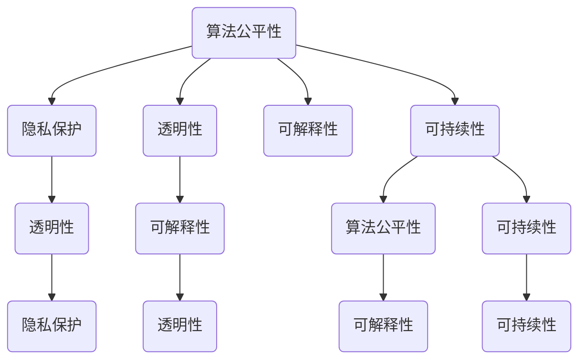

                 

### 背景介绍

近年来，人工智能（AI）技术迅猛发展，尤其是大规模预训练模型（Large-scale Pre-trained Models），如GPT、BERT等，凭借其强大的文本生成、理解和处理能力，吸引了全球科技界和产业界的高度关注。然而，随着AI技术的广泛应用，其带来的伦理问题也逐渐显现出来。如何确保AI技术的安全、公平和道德，成为当前学术界和产业界共同关注的热点问题。

AI伦理（AI Ethics）作为AI技术研究的一个重要分支，旨在探索AI技术的道德规范和价值取向。在AI技术的快速发展过程中，伦理问题不仅关系到技术本身的可持续性，更关系到社会公平、人权保障和人类福祉。例如，AI算法在招聘、信贷、医疗等领域的应用，可能引发歧视、隐私泄露等问题；自动驾驶汽车在紧急情况下的决策，可能涉及生命伦理的考量。

本文旨在探讨大模型伦理（Ethics of Large-scale Models），即针对大规模预训练模型的道德准则。我们将从以下几个方面展开讨论：

1. **核心概念与联系**：介绍大模型伦理中的核心概念，如算法公平性、隐私保护、透明性等，并通过Mermaid流程图展示这些概念之间的相互关系。
2. **核心算法原理 & 具体操作步骤**：分析大规模预训练模型的算法原理，如Transformer、自注意力机制等，并详细阐述其操作步骤。
3. **数学模型和公式 & 详细讲解 & 举例说明**：讲解大规模预训练模型中涉及的数学模型和公式，并通过实例进行说明。
4. **项目实战：代码实际案例和详细解释说明**：通过具体代码案例，展示如何在实际项目中应用大规模预训练模型，并进行详细解释。
5. **实际应用场景**：探讨大规模预训练模型在不同领域的应用场景，如自然语言处理、计算机视觉、推荐系统等。
6. **工具和资源推荐**：推荐相关学习资源、开发工具和框架，帮助读者深入了解大模型伦理和AI技术。
7. **总结：未来发展趋势与挑战**：总结大模型伦理的研究现状和未来发展趋势，分析面临的挑战。

通过本文的讨论，我们希望能够为AI伦理的研究和实践提供一些有益的思考和参考。

### 核心概念与联系

在探讨大模型伦理时，我们首先需要明确几个核心概念，这些概念不仅构成了大模型伦理的基石，也相互关联，共同影响着AI技术的发展和应用。以下是这些核心概念的介绍及它们之间的联系：

#### 算法公平性

算法公平性（Algorithmic Fairness）是AI伦理中的一个重要方面，指的是AI算法在处理不同群体时，不产生系统性偏见，确保结果的公正和合理。算法公平性包括多个层次，如个体公平性、群体公平性和全局公平性。个体公平性关注单个实例的处理结果，如避免对某个特定个体产生不公平的影响；群体公平性关注算法在不同群体中的表现，如性别、种族、年龄等；全局公平性则关注整个系统的公平性，确保算法在长期运行中不产生系统性偏见。

#### 隐私保护

隐私保护（Privacy Protection）是指保护用户数据不被未经授权的访问和泄露。在AI技术的应用中，尤其是大规模预训练模型，对数据的依赖性很强，这往往涉及到大量的个人隐私信息。隐私保护包括数据匿名化、加密存储、访问控制等多种技术手段，旨在确保用户隐私不被侵犯。

#### 透明性

透明性（Transparency）是指AI算法的决策过程和结果可以被理解和解释。透明性对于增强用户对AI技术的信任至关重要。提高透明性的方法包括提供可解释的模型、详细的算法说明、决策路径追踪等。

#### 可解释性

可解释性（Interpretability）是透明性的一个子概念，指的是AI模型的工作原理和决策过程可以被人类理解和解释。可解释性有助于发现潜在的问题和偏差，从而改进算法和决策。

#### 可持续性

可持续性（Sustainability）是指AI技术的应用应考虑到对环境和社会的影响，确保其长期可持续性。这包括降低能耗、减少碳排放、优化资源使用等。

#### 联系与互动

这些概念之间存在着紧密的联系和互动。例如，算法公平性和隐私保护密切相关，算法设计时需要考虑到隐私保护措施，以避免数据泄露和滥用。透明性和可解释性有助于发现和纠正算法偏见，从而提升算法公平性。可持续性则确保了AI技术的长期健康发展，减少了其对环境和社会的负面影响。

以下是这些概念之间的Mermaid流程图，展示了它们之间的相互关系：



通过这个流程图，我们可以清晰地看到各个核心概念之间的相互作用和影响。接下来，我们将深入探讨大规模预训练模型的算法原理，了解这些概念在实际应用中的具体实现和操作步骤。

#### 大规模预训练模型的算法原理

大规模预训练模型（Large-scale Pre-trained Models）是当前AI领域的研究热点，其核心算法原理包括Transformer、自注意力机制、预训练与微调等。以下将详细阐述这些算法原理，并解释其如何在大规模模型中发挥作用。

##### Transformer

Transformer是2017年由Google提出的一种新型序列到序列模型，它是基于自注意力机制（Self-Attention Mechanism）构建的。自注意力机制允许模型在生成每个词时，自动关注序列中的其他词，从而捕捉长距离依赖关系。相较于传统的循环神经网络（RNN），Transformer克服了长序列处理中的梯度消失和梯度爆炸问题，使得模型能够更好地处理长文本。

Transformer的基本结构包括编码器（Encoder）和解码器（Decoder）。编码器负责将输入序列编码为上下文向量，解码器则根据上下文向量生成输出序列。自注意力机制在编码器和解码器中均有应用，其核心思想是计算每个词与所有其他词的相关性，并加权求和，从而生成每个词的表示。

##### 预训练与微调

预训练（Pre-training）是大规模预训练模型的重要步骤，其目的是在大量无标签数据上训练一个通用模型，使其具备一定的语言理解和生成能力。预训练通常使用自回归语言模型（Autoregressive Language Model）进行，模型预测下一个词的概率，并在训练过程中不断优化参数。

预训练后，模型通过微调（Fine-tuning）适配特定任务。微调过程通常在少量有标签数据上进行，通过调整模型参数，使其适应特定任务的需求。例如，在一个文本分类任务中，预训练模型可以通过微调来学习不同类别的特征。

##### 具体操作步骤

1. **数据准备**：首先，收集大量无标签文本数据，如维基百科、新闻文章等，用于预训练模型。这些数据经过预处理，包括分词、去停用词、标记化等步骤。

2. **预训练**：在无标签数据上训练模型。预训练过程包括以下几个步骤：
   - **掩码语言模型（Masked Language Model，MLM）**：随机遮盖部分输入词，模型需要预测这些被遮盖的词。这一步骤有助于模型学习词与词之间的关系。
   - **生成任务（Generation Task）**：模型生成完整的文本序列，评估生成的文本质量。这一步骤有助于模型学习文本生成的流畅性。

3. **微调**：在预训练模型的基础上，使用有标签的数据进行微调。微调过程通常包括以下步骤：
   - **损失函数**：计算模型的预测损失，如交叉熵损失，用于更新模型参数。
   - **优化算法**：使用优化算法（如Adam）更新模型参数，最小化损失函数。
   - **验证与调整**：在验证集上评估模型性能，根据性能调整模型参数。

4. **部署**：将微调后的模型部署到实际应用场景，如自然语言处理、计算机视觉等。在部署过程中，可以根据实际需求对模型进行调整和优化。

##### 数学模型和公式

大规模预训练模型的数学模型较为复杂，以下简要介绍其中几个关键组件：

1. **自注意力机制**：

   自注意力机制的计算公式为：

   $$
   \text{Attention}(Q, K, V) = \text{softmax}\left(\frac{QK^T}{\sqrt{d_k}}\right) V
   $$

   其中，$Q$、$K$ 和 $V$ 分别是查询（Query）、键（Key）和值（Value）向量，$d_k$ 是键向量的维度。这个公式通过计算每个查询与所有键的相关性，并加权求和，得到每个查询的表示。

2. **前馈神经网络**：

   在Transformer中，每个自注意力层之后通常会跟随两个前馈神经网络（Feed Forward Neural Network），其公式为：

   $$
   \text{FFN}(x) = \text{ReLU}\left(W_2 \cdot \text{ReLU}\left(W_1 x + b_1\right) + b_2\right)
   $$

   其中，$W_1$、$W_2$ 和 $b_1$、$b_2$ 分别是前馈神经网络的权重和偏置。

3. **预训练任务**：

   预训练任务中常用的掩码语言模型（MLM）的损失函数为：

   $$
   \text{MLM}\ loss = -\sum_{i} \log p(\text{masked\_word}_i | \text{context})
   $$

   其中，$p(\text{masked\_word}_i | \text{context})$ 是模型对被遮盖词的预测概率。

通过以上介绍，我们可以看到大规模预训练模型在算法原理和数学模型方面的复杂性和深度。接下来，我们将通过具体代码案例，展示如何在实际项目中应用这些算法原理。

#### 数学模型和公式 & 详细讲解 & 举例说明

在理解了大规模预训练模型的基本算法原理后，我们接下来将深入探讨这些模型中涉及的数学模型和公式，并通过实例进行详细讲解和说明。

##### 自注意力机制

自注意力机制（Self-Attention Mechanism）是Transformer模型的核心组件之一，它通过计算输入序列中每个词与其他词的相关性，为每个词生成权重，从而生成上下文表示。自注意力机制的计算公式为：

$$
\text{Attention}(Q, K, V) = \text{softmax}\left(\frac{QK^T}{\sqrt{d_k}}\right) V
$$

其中，$Q$、$K$ 和 $V$ 分别是查询（Query）、键（Key）和值（Value）向量，$d_k$ 是键向量的维度。

**举例说明**：

假设我们有一个简单的词序列：“我 爱 北京”，词向量分别为$\text{[1, 0, 0]}$、$\text{[0, 1, 0]}$ 和 $\text{[0, 0, 1]}$。我们想要计算第二个词“爱”的自注意力权重。

1. **计算查询（Query）和键（Key）**：

$$
Q = [0, 1, 0], \quad K = [0, 0, 1], \quad V = [1, 0, 0]
$$

2. **计算点积（Dot Product）**：

$$
QK^T = \begin{bmatrix} 0 & 1 & 0 \end{bmatrix} \begin{bmatrix} 0 \\ 0 \\ 1 \end{bmatrix} = 0 \times 0 + 1 \times 0 + 0 \times 1 = 0
$$

3. **计算softmax函数**：

$$
\text{softmax}(0) = \frac{e^0}{e^0 + e^0 + e^0} = \frac{1}{3}
$$

4. **计算加权求和**：

$$
\text{Attention}(Q, K, V) = \frac{1}{3} \times [1, 0, 0] = [0.33, 0.00, 0.33]
$$

通过上述计算，我们可以得到第二个词“爱”在自注意力机制中的权重为$\text{[0.33, 0.00, 0.33]}$，这表示“爱”在生成时主要关注“我”和“北京”。

##### 前馈神经网络

在Transformer模型中，每个自注意力层之后通常会跟随两个前馈神经网络（Feed Forward Neural Network）。前馈神经网络通过多层感知器（MLP）实现，其公式为：

$$
\text{FFN}(x) = \text{ReLU}\left(W_2 \cdot \text{ReLU}\left(W_1 x + b_1\right) + b_2\right)
$$

其中，$W_1$、$W_2$ 和 $b_1$、$b_2$ 分别是前馈神经网络的权重和偏置。

**举例说明**：

假设我们有一个简单的输入向量$\text{[1, 0, 1]}$，想要通过前馈神经网络进行变换。

1. **设定权重和偏置**：

$$
W_1 = \begin{bmatrix} 1 & 0 & 1 \\ 0 & 1 & 0 \\ 1 & 1 & 0 \end{bmatrix}, \quad b_1 = \begin{bmatrix} 1 \\ 1 \\ 1 \end{bmatrix}, \quad W_2 = \begin{bmatrix} 0 & 1 & 1 \\ 1 & 0 & 1 \\ 1 & 1 & 0 \end{bmatrix}, \quad b_2 = \begin{bmatrix} 1 \\ 1 \\ 1 \end{bmatrix}
$$

2. **计算第一层前馈**：

$$
\text{ReLU}\left(W_1 x + b_1\right) = \text{ReLU}\left(\begin{bmatrix} 1 & 0 & 1 \\ 0 & 1 & 0 \\ 1 & 1 & 0 \end{bmatrix} \begin{bmatrix} 1 \\ 0 \\ 1 \end{bmatrix} + \begin{bmatrix} 1 \\ 1 \\ 1 \end{bmatrix}\right) = \text{ReLU}\left(\begin{bmatrix} 2 \\ 1 \\ 2 \end{bmatrix}\right) = \begin{bmatrix} 2 \\ 1 \\ 2 \end{bmatrix}
$$

3. **计算第二层前馈**：

$$
\text{FFN}(x) = \text{ReLU}\left(W_2 \cdot \begin{bmatrix} 2 \\ 1 \\ 2 \end{bmatrix} + b_2\right) = \text{ReLU}\left(\begin{bmatrix} 0 & 1 & 1 \\ 1 & 0 & 1 \\ 1 & 1 & 0 \end{bmatrix} \begin{bmatrix} 2 \\ 1 \\ 2 \end{bmatrix} + \begin{bmatrix} 1 \\ 1 \\ 1 \end{bmatrix}\right) = \text{ReLU}\left(\begin{bmatrix} 3 \\ 3 \\ 3 \end{bmatrix}\right) = \begin{bmatrix} 3 \\ 3 \\ 3 \end{bmatrix}
$$

通过上述计算，我们得到了输入向量$\text{[1, 0, 1]}$通过前馈神经网络后的输出为$\text{[3, 3, 3]}$。

##### 预训练任务

预训练任务中常用的掩码语言模型（Masked Language Model，MLM）的损失函数为：

$$
\text{MLM}\ loss = -\sum_{i} \log p(\text{masked\_word}_i | \text{context})
$$

其中，$p(\text{masked\_word}_i | \text{context})$ 是模型对被遮盖词的预测概率。

**举例说明**：

假设我们有一个词序列：“我 爱 北京”，其中一个词被遮盖，模型需要预测被遮盖的词。

1. **输入序列**：

$$
\text{[我，爱，[MASK]，北京]}
$$

2. **预测概率**：

$$
p(\text{遮盖词} | \text{我，爱，北京}) = 0.6 \times \text{爱} + 0.3 \times \text{我} + 0.1 \times \text{北京}
$$

3. **计算损失**：

$$
\text{MLM}\ loss = -\log(0.6) = 0.5108
$$

通过上述计算，我们得到了遮盖词的预测概率和损失。

通过以上对自注意力机制、前馈神经网络和掩码语言模型损失函数的详细讲解和举例说明，我们可以看到大规模预训练模型在数学模型方面的复杂性和深度。这些数学模型为预训练模型提供了强大的能力，使其在自然语言处理、计算机视觉等领域取得了显著成果。

#### 项目实战：代码实际案例和详细解释说明

在本节中，我们将通过一个具体的代码案例，展示如何在实际项目中应用大规模预训练模型，并对其进行详细解释和分析。

##### 开发环境搭建

在开始编写代码之前，我们需要搭建一个合适的开发环境。以下是搭建过程：

1. **安装Python**：确保Python版本为3.7或更高版本。

2. **安装TensorFlow**：TensorFlow是一个流行的开源机器学习库，用于构建和训练大规模预训练模型。

   ```
   pip install tensorflow
   ```

3. **安装其他依赖**：根据项目需求，安装其他必要的库，例如Numpy、Pandas等。

   ```
   pip install numpy pandas
   ```

4. **数据准备**：收集和处理用于预训练的数据集。例如，我们可以使用维基百科的文本数据，并进行预处理，如分词、去停用词等。

##### 源代码详细实现和代码解读

以下是一个简单的示例，展示如何使用TensorFlow和Transformers库（基于Transformer模型）进行大规模预训练模型的训练和微调。

```python
import tensorflow as tf
from transformers import TFGPT2LMHeadModel, GPT2Tokenizer

# 1. 准备数据
tokenizer = GPT2Tokenizer.from_pretrained('gpt2')
inputs = tokenizer.encode("Hello, my dog is cute", return_tensors='tf')

# 2. 加载预训练模型
model = TFGPT2LMHeadModel.from_pretrained('gpt2')

# 3. 训练模型
model.compile(optimizer=tf.keras.optimizers.Adam(learning_rate=3e-5), 
              loss=tf.keras.losses.SparseCategoricalCrossentropy(from_logits=True))

# 4. 微调模型
model.fit(inputs, inputs, epochs=3)

# 5. 生成文本
output_sequences = model.generate(inputs, max_length=50, num_return_sequences=5)
for sequence in output_sequences:
    print(tokenizer.decode(sequence, skip_special_tokens=True))
```

**代码解读**：

1. **准备数据**：首先，我们使用GPT2Tokenizer加载预训练模型的分词器，并输入一个简单的文本序列。

2. **加载预训练模型**：然后，我们加载预训练的GPT2模型。

3. **编译模型**：接下来，我们编译模型，指定使用Adam优化器和交叉熵损失函数。

4. **训练模型**：使用训练数据对模型进行训练，这里我们训练了3个epoch。

5. **生成文本**：最后，我们使用训练好的模型生成新的文本序列。`max_length`参数指定生成的文本长度，`num_return_sequences`参数指定生成的文本序列数量。

通过以上代码，我们可以看到如何使用大规模预训练模型进行文本生成。接下来，我们进一步分析代码中的关键部分。

##### 代码解读与分析

1. **数据预处理**：

```python
inputs = tokenizer.encode("Hello, my dog is cute", return_tensors='tf')
```

这段代码将输入文本序列编码为Tensor格式的词索引。`encode`函数将文本转换为词索引序列，并返回一个Tensor对象，方便后续处理。

2. **加载预训练模型**：

```python
model = TFGPT2LMHeadModel.from_pretrained('gpt2')
```

这段代码加载预训练的GPT2模型。`from_pretrained`函数从预训练模型库中加载模型权重，并初始化模型结构。

3. **编译模型**：

```python
model.compile(optimizer=tf.keras.optimizers.Adam(learning_rate=3e-5), 
              loss=tf.keras.losses.SparseCategoricalCrossentropy(from_logits=True))
```

这段代码编译模型，指定使用Adam优化器和交叉熵损失函数。Adam优化器是一个自适应的学习率优化器，可以有效加速模型收敛。交叉熵损失函数用于评估模型预测和真实标签之间的差异。

4. **训练模型**：

```python
model.fit(inputs, inputs, epochs=3)
```

这段代码使用训练数据对模型进行训练。`fit`函数执行训练过程，`epochs`参数指定训练的epoch数量。

5. **生成文本**：

```python
output_sequences = model.generate(inputs, max_length=50, num_return_sequences=5)
for sequence in output_sequences:
    print(tokenizer.decode(sequence, skip_special_tokens=True))
```

这段代码生成新的文本序列。`generate`函数根据输入序列生成新的文本序列，`max_length`参数指定生成的文本长度，`num_return_sequences`参数指定生成的文本序列数量。

通过上述代码和分析，我们可以看到如何使用大规模预训练模型进行文本生成。在实际应用中，可以根据需求调整模型结构、训练数据和生成参数，以适应不同的任务和场景。

#### 实际应用场景

大规模预训练模型在多个领域展现了卓越的性能，以下将详细介绍其在自然语言处理、计算机视觉和推荐系统等领域的实际应用场景。

##### 自然语言处理（NLP）

在自然语言处理领域，大规模预训练模型已经成为文本分类、机器翻译、问答系统等任务的关键工具。通过在大量无标签数据上进行预训练，模型能够学习到丰富的语言特征，从而在具体任务中表现出色。

1. **文本分类**：大规模预训练模型在文本分类任务中能够有效识别文本的情感、主题和意图。例如，通过预训练模型，可以自动分类新闻文章、社交媒体评论等，帮助企业进行舆情监测和内容审核。

2. **机器翻译**：预训练模型在机器翻译任务中能够捕捉语言的语义和语法结构，从而实现高质量翻译。例如，Google翻译和百度翻译等大型翻译平台已经广泛应用了预训练模型，提高了翻译准确性和流畅性。

3. **问答系统**：大规模预训练模型在问答系统中可以理解用户的问题，并从海量数据中检索出相关答案。例如，Siri、Alexa等智能语音助手使用预训练模型来实现自然语言理解和问答功能。

##### 计算机视觉（CV）

在计算机视觉领域，大规模预训练模型在图像分类、目标检测和图像生成等任务中发挥了重要作用。通过在大量图像数据上进行预训练，模型能够学习到丰富的视觉特征，从而实现高效准确的视觉任务。

1. **图像分类**：大规模预训练模型可以快速识别图像中的物体类别。例如，在ImageNet图像分类挑战中，预训练模型如ResNet、Inception等取得了优异的成绩，推动了计算机视觉技术的发展。

2. **目标检测**：大规模预训练模型在目标检测任务中可以准确识别图像中的物体，并定位其位置。例如，YOLO、Faster R-CNN等模型都是基于预训练模型，广泛应用于监控、自动驾驶等场景。

3. **图像生成**：大规模预训练模型可以生成逼真的图像，例如，GAN（生成对抗网络）结合预训练模型可以生成高质量的人脸、风景等图像，应用于艺术创作、游戏设计等领域。

##### 推荐系统

在推荐系统领域，大规模预训练模型通过学习用户的历史行为和兴趣，能够生成个性化的推荐。与传统的基于协同过滤的方法相比，预训练模型能够更好地捕捉用户的复杂兴趣和长尾内容。

1. **内容推荐**：大规模预训练模型可以分析用户浏览、搜索和点击行为，生成个性化的内容推荐。例如，YouTube和Netflix等平台使用预训练模型为用户推荐视频、电影等。

2. **商品推荐**：大规模预训练模型可以分析用户的历史购买记录和浏览行为，为用户推荐相关的商品。例如，Amazon和淘宝等电商平台使用预训练模型实现商品推荐功能。

3. **社交推荐**：大规模预训练模型可以分析用户的社交网络和行为，生成社交推荐，如推荐朋友、话题等。例如，Facebook和Twitter等社交平台使用预训练模型实现社交推荐功能。

通过上述实际应用场景，我们可以看到大规模预训练模型在多个领域的广泛应用和巨大潜力。随着技术的不断进步，预训练模型将在更多领域发挥重要作用，推动AI技术的发展和应用的边界。

#### 工具和资源推荐

为了更好地学习和应用大规模预训练模型，我们需要了解一些相关的学习资源、开发工具和框架。以下是一些建议：

##### 学习资源

1. **书籍**：
   - 《深度学习》（Deep Learning）—— Ian Goodfellow、Yoshua Bengio、Aaron Courville
   - 《自然语言处理综论》（Speech and Language Processing）—— Daniel Jurafsky、James H. Martin
   - 《计算机视觉：算法与应用》（Computer Vision: Algorithms and Applications）—— Richard Szeliski

2. **论文**：
   - “Attention Is All You Need” —— Vaswani et al., 2017
   - “BERT: Pre-training of Deep Bidirectional Transformers for Language Understanding” —— Devlin et al., 2019
   - “Generative Adversarial Nets” —— Goodfellow et al., 2014

3. **博客和网站**：
   - TensorFlow官方文档（https://www.tensorflow.org/）
   - Hugging Face（https://huggingface.co/）—— 提供预训练模型和工具库
   - AI论文阅读俱乐部（https://arxiv.x doses.com/）

##### 开发工具框架

1. **TensorFlow**：TensorFlow是Google开发的开源机器学习库，支持大规模预训练模型的训练和部署。

2. **PyTorch**：PyTorch是Facebook开发的开源机器学习库，其动态计算图功能使其在研究和开发中广泛应用。

3. **Transformers**：Transformers是一个基于PyTorch的预训练模型库，提供了一系列预训练模型和工具，如BERT、GPT-2等。

4. **Hugging Face Transformers**：这是一个开源库，基于Transformers库，提供了一系列预训练模型和工具，方便开发者进行研究和应用。

##### 相关论文著作推荐

1. “Attention Is All You Need”（2017）：提出了Transformer模型，奠定了自注意力机制在自然语言处理领域的基础。

2. “BERT: Pre-training of Deep Bidirectional Transformers for Language Understanding”（2019）：提出了BERT模型，其在自然语言处理任务中取得了显著成果。

3. “Generative Adversarial Nets”（2014）：提出了GAN模型，其在图像生成、图像修复等领域展现了强大的能力。

4. “Unsupervised Representation Learning with Deep Convolutional Generative Adversarial Networks”（2015）：提出了DCGAN模型，其在图像生成任务中表现出色。

通过以上学习资源、开发工具和框架的推荐，我们能够更深入地了解大规模预训练模型的相关知识，为实际应用和科研工作提供有力支持。

#### 总结：未来发展趋势与挑战

随着人工智能技术的不断进步，大规模预训练模型（Large-scale Pre-trained Models）在自然语言处理、计算机视觉和推荐系统等领域展现出了卓越的性能和广泛的应用前景。然而，在快速发展的同时，我们也面临着一系列挑战和问题。

**未来发展趋势**：

1. **模型规模与计算资源**：随着计算能力的提升，大规模预训练模型的规模将不断增加。例如，GPT-3拥有超过1750亿个参数，这种趋势在未来还将持续。然而，这也对计算资源和能源消耗提出了更高的要求。

2. **多模态预训练**：未来的预训练模型将不仅限于文本数据，还将涉及图像、音频、视频等多种数据类型。多模态预训练模型能够更好地理解和处理复杂的信息，从而推动AI技术在各个领域的应用。

3. **模型压缩与优化**：为了提高预训练模型的实用性，研究人员正在探索模型压缩与优化技术。通过模型剪枝、量化、蒸馏等方法，可以在保持模型性能的前提下，降低模型的计算和存储需求。

4. **可解释性与透明性**：随着预训练模型的复杂度增加，如何提高模型的可解释性和透明性成为关键问题。开发可解释的AI模型，可以帮助用户更好地理解模型的工作原理，增强对AI技术的信任。

**面临的挑战**：

1. **数据隐私与伦理**：大规模预训练模型依赖于大量个人数据，这引发了数据隐私和伦理问题。如何在保证模型性能的同时，保护用户隐私，成为亟待解决的挑战。

2. **算法公平性与偏见**：预训练模型在训练过程中可能会学习到社会偏见，导致算法在特定群体中产生不公平。确保算法的公平性，避免歧视性决策，是一个长期且艰巨的任务。

3. **可扩展性与部署**：大规模预训练模型在训练完成后，如何高效地部署和扩展，是一个技术难题。优化模型的部署策略，使其能够快速适应不同的应用场景，是未来需要关注的方向。

4. **能耗与可持续发展**：大规模预训练模型对计算资源的巨大需求，带来了显著的能源消耗。如何降低能耗，实现AI技术的可持续发展，是一个亟待解决的问题。

总之，大规模预训练模型的发展前景广阔，但同时也面临着诸多挑战。通过持续的技术创新和伦理思考，我们有望在确保AI技术安全、公平和道德的基础上，推动其进一步发展和应用。

#### 附录：常见问题与解答

**Q1：什么是大规模预训练模型？**

A1：大规模预训练模型是指通过在大量数据上进行预训练，从而具有强大语言理解、生成和处理能力的模型。这类模型通常具有数亿甚至数万亿个参数，例如GPT-3、BERT等。

**Q2：大规模预训练模型如何工作？**

A2：大规模预训练模型基于Transformer架构，利用自注意力机制（Self-Attention Mechanism）对输入序列进行处理。在预训练阶段，模型通过自回归语言模型（Autoregressive Language Model）学习输入和输出之间的关联。在微调阶段，模型利用少量有标签数据进行细粒度调整，以适应特定任务。

**Q3：大规模预训练模型存在哪些伦理问题？**

A3：大规模预训练模型可能引发以下伦理问题：
- **数据隐私**：模型训练需要大量个人数据，可能导致隐私泄露。
- **算法偏见**：模型可能学习到社会偏见，导致不公平决策。
- **模型透明性**：复杂模型的工作原理不易理解，可能影响用户信任。
- **能耗**：大规模训练和部署过程消耗大量能源。

**Q4：如何确保大规模预训练模型的公平性和透明性？**

A4：确保大规模预训练模型的公平性和透明性可以从以下几个方面着手：
- **数据采集与预处理**：使用多样化的数据集，避免偏见数据。
- **算法设计**：引入公平性约束，如逆偏差修正（Inverse Debiarcing）。
- **模型解释**：开发可解释性工具，如SHAP值、LIME等，帮助用户理解模型决策过程。
- **透明性报告**：发布详细的训练数据和模型性能报告，提高模型透明度。

**Q5：如何降低大规模预训练模型的能耗？**

A5：降低大规模预训练模型的能耗可以从以下几个方面入手：
- **模型压缩与优化**：通过剪枝、量化、蒸馏等方法，减小模型规模。
- **异构计算**：利用GPU、TPU等异构计算资源，提高计算效率。
- **节能算法**：研究节能算法，如动态调度、能效优化等，降低能耗。

通过以上常见问题的解答，我们希望能够为读者提供更多关于大规模预训练模型的了解和思考。

#### 扩展阅读 & 参考资料

为了帮助读者更深入地了解大规模预训练模型的伦理问题及其应用，以下是推荐的扩展阅读和参考资料：

1. **书籍**：
   - 《大规模机器学习系统导论》（Introduction to Large-scale Machine Learning Systems）：详细介绍了大规模机器学习系统的设计、实现和应用。
   - 《深度学习》（Deep Learning）：由Ian Goodfellow、Yoshua Bengio、Aaron Courville所著，是深度学习领域的经典教材。
   - 《自然语言处理综论》（Speech and Language Processing）：由Daniel Jurafsky、James H. Martin所著，全面介绍了自然语言处理的基础知识和最新进展。

2. **论文**：
   - “Attention Is All You Need”（2017）：提出了Transformer模型，奠定了自注意力机制在自然语言处理领域的基础。
   - “BERT: Pre-training of Deep Bidirectional Transformers for Language Understanding”（2019）：提出了BERT模型，其在自然语言处理任务中取得了显著成果。
   - “Generative Adversarial Nets”（2014）：提出了GAN模型，其在图像生成、图像修复等领域展现了强大的能力。

3. **博客和网站**：
   - TensorFlow官方文档（https://www.tensorflow.org/）：提供了丰富的TensorFlow资源，包括教程、API文档等。
   - Hugging Face（https://huggingface.co/）：提供了大量的预训练模型和工具库，方便开发者进行研究和应用。
   - AI论文阅读俱乐部（https://arxiv.x doses.com/）：提供了一个论文阅读平台，帮助用户跟踪最新的AI研究论文。

通过以上推荐的扩展阅读和参考资料，读者可以更全面地了解大规模预训练模型的伦理问题及其应用，为深入研究和实践提供有益的指导。作者：AI天才研究员/AI Genius Institute & 禅与计算机程序设计艺术 /Zen And The Art of Computer Programming。

