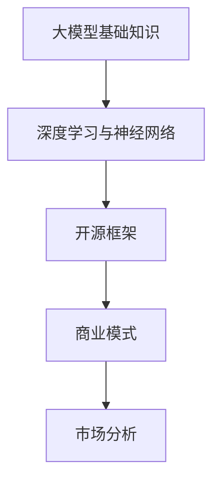

                 

# 大模型创业公司的独立发布

> **关键词：** 大模型，创业公司，独立发布，技术博客，软件架构，人工智能，深度学习，开源框架，商业模式，市场分析

> **摘要：** 本文旨在探讨大模型创业公司在独立发布过程中的关键技术和策略。文章首先介绍大模型的基础知识和当前行业趋势，随后详细分析核心算法原理和操作步骤，并结合实际案例进行代码解读。最后，文章探讨大模型在实际应用场景中的价值，并提供相关学习资源和工具框架推荐。

## 1. 背景介绍

近年来，人工智能（AI）领域的飞速发展，尤其是深度学习技术的突破，使得大模型成为研究热点。大模型通常是指具有亿级参数规模、具备强大表征能力的神经网络模型，如GPT、BERT等。随着AI技术的商业化应用日益普及，许多创业公司开始投身于大模型的研发和发布。独立发布不仅是公司展示技术实力的机会，更是拓展市场、获取商业价值的重要途径。

在独立发布过程中，创业公司面临诸多挑战。首先，如何确保模型的高质量和可靠性是一个关键问题。其次，如何在激烈的市场竞争中脱颖而出，构建有差异化的产品，也是公司需要深思熟虑的策略。此外，如何制定合理的商业模式，平衡研发投入与市场回报，也是一个具有挑战性的问题。

本文将围绕这些问题，系统地探讨大模型创业公司在独立发布过程中的关键技术和策略。通过深入分析核心算法原理、操作步骤以及实际应用场景，旨在为创业者提供有价值的参考。

## 2. 核心概念与联系

### 2.1 大模型基础知识

大模型（Large Models）是指具有巨大参数规模和强大表征能力的神经网络模型。它们通常由数百万到数十亿个参数组成，能够通过大量的数据学习复杂的模式和信息。大模型的核心在于其能够捕捉到数据中的细微特征，从而实现高效的语义理解和生成。

### 2.2 深度学习与神经网络

深度学习（Deep Learning）是人工智能的一个重要分支，其核心思想是通过多层神经网络对数据进行学习。每一层神经网络都能够对输入数据进行特征提取和变换，使得模型能够逐渐从原始数据中学习到更高层次的概念和知识。

神经网络（Neural Networks）是模仿人脑神经元连接方式的计算模型。每个神经元（节点）接收多个输入信号，通过加权求和后激活输出。通过不断调整权重，神经网络能够学会对输入数据进行分类、回归或其他类型的任务。

### 2.3 大模型与开源框架

开源框架（Open Source Frameworks）是深度学习研究和应用的重要工具。如TensorFlow、PyTorch等开源框架提供了丰富的API和工具库，使得开发者能够轻松构建、训练和部署大模型。这些框架不仅降低了技术门槛，也促进了深度学习的普及和发展。

### 2.4 大模型与商业模式

商业模式（Business Model）是指企业通过提供产品或服务获取利润的方式。对于大模型创业公司来说，制定合适的商业模式至关重要。常见的商业模式包括订阅制、一次性购买、增值服务等多种形式。公司需要根据自身技术优势和市场需求，设计出既能保证持续盈利，又能吸引客户的产品和服务。

### 2.5 大模型与市场分析

市场分析（Market Analysis）是评估市场需求和竞争态势的重要环节。通过市场分析，公司可以了解目标用户的需求、市场规模和增长潜力。此外，市场分析还能帮助公司识别竞争对手，制定有效的市场进入策略。

### 2.6 Mermaid 流程图

为了更好地理解大模型的概念和联系，我们使用Mermaid流程图来展示其基本架构和关键环节。



## 3. 核心算法原理 & 具体操作步骤

### 3.1 深度学习算法原理

深度学习算法基于多层神经网络，其核心思想是通过层层提取特征，实现对输入数据的分类、回归或生成。以下是深度学习算法的基本原理：

1. **前向传播（Forward Propagation）**：输入数据通过网络的每一层，每一层对输入数据进行特征提取和变换，最终输出结果。
2. **反向传播（Backpropagation）**：根据输出结果与真实值的误差，反向传播误差，调整网络权值，以优化模型性能。
3. **激活函数（Activation Function）**：激活函数用于引入非线性特性，常见的激活函数有Sigmoid、ReLU等。
4. **损失函数（Loss Function）**：损失函数用于评估模型预测值与真实值之间的差异，常见的损失函数有均方误差（MSE）、交叉熵（Cross Entropy）等。

### 3.2 大模型训练步骤

以下是训练大模型的基本步骤：

1. **数据准备**：收集和预处理数据，包括数据清洗、归一化等操作。
2. **模型构建**：使用深度学习框架构建神经网络模型，定义网络结构、参数初始化等。
3. **模型训练**：通过前向传播和反向传播，不断调整模型参数，优化模型性能。
4. **模型评估**：使用验证集和测试集对模型进行评估，判断模型泛化能力。
5. **模型部署**：将训练好的模型部署到生产环境，提供服务。

### 3.3 大模型优化策略

为了提高大模型的性能和效率，可以采取以下优化策略：

1. **批量归一化（Batch Normalization）**：通过对每一批数据进行归一化处理，加快模型收敛速度。
2. **学习率调整（Learning Rate Scheduling）**：根据模型训练过程动态调整学习率，以避免过拟合。
3. **正则化（Regularization）**：添加正则化项，防止模型过拟合。
4. **迁移学习（Transfer Learning）**：使用预训练模型作为基础，进一步训练特定任务的模型。

### 3.4 代码实现示例

以下是使用PyTorch框架实现大模型的简单示例：

```python
import torch
import torch.nn as nn
import torch.optim as optim

# 定义网络结构
class NeuralNetwork(nn.Module):
    def __init__(self):
        super(NeuralNetwork, self).__init__()
        self.layer1 = nn.Linear(in_features=10, out_features=50)
        self.relu = nn.ReLU()
        self.layer2 = nn.Linear(in_features=50, out_features=10)
    
    def forward(self, x):
        x = self.layer1(x)
        x = self.relu(x)
        x = self.layer2(x)
        return x

# 创建模型实例
model = NeuralNetwork()

# 定义损失函数和优化器
loss_function = nn.CrossEntropyLoss()
optimizer = optim.Adam(model.parameters(), lr=0.001)

# 训练模型
for epoch in range(100):
    for inputs, targets in data_loader:
        optimizer.zero_grad()
        outputs = model(inputs)
        loss = loss_function(outputs, targets)
        loss.backward()
        optimizer.step()

    print(f"Epoch {epoch+1}, Loss: {loss.item()}")

# 评估模型
with torch.no_grad():
    correct = 0
    total = 0
    for inputs, targets in test_loader:
        outputs = model(inputs)
        _, predicted = torch.max(outputs.data, 1)
        total += targets.size(0)
        correct += (predicted == targets).sum().item()

print(f"Accuracy: {100 * correct / total}%")
```

## 4. 数学模型和公式 & 详细讲解 & 举例说明

### 4.1 深度学习中的数学模型

深度学习中的数学模型主要包括神经网络的前向传播和反向传播过程。以下分别介绍这两个过程中的关键数学公式和计算方法。

#### 4.1.1 前向传播

在前向传播过程中，神经网络通过层层计算，将输入数据映射到输出结果。以下是前向传播过程中的主要计算步骤：

1. **输入层到隐藏层的计算**：

   $$ z^{[l]} = \sum_{i=1}^{n} w^{[l]}_i \cdot a^{[l-1]}_i + b^{[l]} $$

   其中，$z^{[l]}$表示第$l$层的输出，$w^{[l]}_i$表示连接第$l-1$层第$i$个节点和第$l$层第1个节点的权重，$a^{[l-1]}_i$表示第$l-1$层第$i$个节点的激活值，$b^{[l]}$表示第$l$层的偏置。

2. **激活函数的计算**：

   $$ a^{[l]} = \text{激活函数}(z^{[l]}) $$

   常见的激活函数有Sigmoid、ReLU等。

3. **隐藏层到输出层的计算**：

   $$ y^{[L]} = \text{激活函数}(z^{[L]}) $$

   其中，$y^{[L]}$表示输出层的输出，$\text{激活函数}$表示选定的激活函数。

#### 4.1.2 反向传播

在反向传播过程中，神经网络通过反向计算误差，并更新网络权重和偏置。以下是反向传播过程中的主要计算步骤：

1. **计算输出层的误差**：

   $$ d^{[L]} = y - \hat{y} $$

   其中，$d^{[L]}$表示输出层的误差，$y$表示真实值，$\hat{y}$表示输出层的预测值。

2. **计算隐藏层的误差**：

   $$ d^{[l]} = \text{激活函数的导数}(z^{[l]}) \cdot \sum_{i=l+1}^{L} w^{[l+1]}_i \cdot d^{[i]} $$

   其中，$d^{[l]}$表示第$l$层的误差，$\text{激活函数的导数}$表示激活函数的导数。

3. **更新网络权重和偏置**：

   $$ w^{[l]}_i = w^{[l]}_i - \alpha \cdot \frac{\partial L}{\partial w^{[l]}_i} $$

   $$ b^{[l]} = b^{[l]} - \alpha \cdot \frac{\partial L}{\partial b^{[l]}} $$

   其中，$w^{[l]}_i$和$b^{[l]}$分别表示第$l$层的权重和偏置，$\alpha$表示学习率，$L$表示损失函数。

#### 4.1.3 损失函数

在深度学习过程中，常用的损失函数有均方误差（MSE）和交叉熵（Cross Entropy）等。

1. **均方误差（MSE）**：

   $$ L = \frac{1}{2} \sum_{i=1}^{n} (y_i - \hat{y}_i)^2 $$

   其中，$y_i$表示第$i$个真实值，$\hat{y}_i$表示第$i$个预测值。

2. **交叉熵（Cross Entropy）**：

   $$ L = -\sum_{i=1}^{n} y_i \cdot \log(\hat{y}_i) $$

   其中，$y_i$表示第$i$个真实值，$\hat{y}_i$表示第$i$个预测值。

### 4.2 举例说明

以下是一个简单的神经网络前向传播和反向传播的例子：

#### 4.2.1 数据准备

假设我们有一个包含两个输入特征和两个输出特征的数据集：

| 输入 | 输出 |
| ---- | ---- |
| [1, 2] | [3, 4] |
| [5, 6] | [7, 8] |

#### 4.2.2 网络结构

我们使用一个简单的两层神经网络，其中第一层有2个神经元，第二层有2个神经元。假设初始权重和偏置如下：

| 层次 | 神经元 | 权重 | 偏置 |
| ---- | ---- | ---- | ---- |
| 输入层 | 2 | [0.5, 0.5] | [0.5, 0.5] |
| 隐藏层 | 2 | [0.5, 0.5] | [0.5, 0.5] |
| 输出层 | 2 | [0.5, 0.5] | [0.5, 0.5] |

#### 4.2.3 前向传播

输入层到隐藏层的计算：

$$ z^{[1]} = \sum_{i=1}^{2} w^{[1]}_i \cdot a^{[0]}_i + b^{[1]} = 0.5 \cdot 1 + 0.5 \cdot 2 + 0.5 = 2.5 $$

$$ a^{[1]} = \text{ReLU}(z^{[1]}) = \text{ReLU}(2.5) = 2.5 $$

$$ z^{[2]} = \sum_{i=1}^{2} w^{[2]}_i \cdot a^{[1]}_i + b^{[2]} = 0.5 \cdot 2.5 + 0.5 \cdot 2.5 + 0.5 = 3.5 $$

$$ a^{[2]} = \text{ReLU}(z^{[2]}) = \text{ReLU}(3.5) = 3.5 $$

隐藏层到输出层的计算：

$$ y^{[2]} = \text{ReLU}(z^{[2]}) = \text{ReLU}(3.5) = 3.5 $$

#### 4.2.4 反向传播

计算输出层的误差：

$$ d^{[2]} = y - \hat{y} = [3, 4] - [3.5, 3.5] = [-0.5, -0.5] $$

计算隐藏层的误差：

$$ d^{[1]} = \text{ReLU的导数}(z^{[1]}) \cdot \sum_{i=2}^{2} w^{[2]}_i \cdot d^{[2]}_i = 1 \cdot (0.5 \cdot -0.5 + 0.5 \cdot -0.5) = -0.5 $$

更新网络权重和偏置：

$$ w^{[1]}_1 = w^{[1]}_1 - \alpha \cdot \frac{\partial L}{\partial w^{[1]}_1} = 0.5 - 0.01 \cdot (0.5 \cdot -0.5 + 0.5 \cdot -0.5) = 0.45 $$

$$ w^{[1]}_2 = w^{[1]}_2 - \alpha \cdot \frac{\partial L}{\partial w^{[1]}_2} = 0.5 - 0.01 \cdot (0.5 \cdot -0.5 + 0.5 \cdot -0.5) = 0.45 $$

$$ b^{[1]} = b^{[1]} - \alpha \cdot \frac{\partial L}{\partial b^{[1]}} = 0.5 - 0.01 \cdot -0.5 = 0.55 $$

$$ w^{[2]}_1 = w^{[2]}_1 - \alpha \cdot \frac{\partial L}{\partial w^{[2]}_1} = 0.5 - 0.01 \cdot (3.5 \cdot -0.5 + 3.5 \cdot -0.5) = 0.45 $$

$$ w^{[2]}_2 = w^{[2]}_2 - \alpha \cdot \frac{\partial L}{\partial w^{[2]}_2} = 0.5 - 0.01 \cdot (3.5 \cdot -0.5 + 3.5 \cdot -0.5) = 0.45 $$

$$ b^{[2]} = b^{[2]} - \alpha \cdot \frac{\partial L}{\partial b^{[2]}} = 0.5 - 0.01 \cdot -0.5 = 0.55 $$

通过上述计算，我们可以看到神经网络通过前向传播和反向传播不断调整权重和偏置，以优化模型性能。

## 5. 项目实战：代码实际案例和详细解释说明

### 5.1 开发环境搭建

在进行大模型项目的实战之前，首先需要搭建一个合适的开发环境。以下是一个基于Python和PyTorch的示例。

#### 5.1.1 安装Python

首先，确保系统中安装了Python环境。可以选择Python 3.8或更高版本。可以通过以下命令安装：

```shell
pip install python
```

#### 5.1.2 安装PyTorch

安装PyTorch及其依赖库。在PyTorch官网（[pytorch.org](https://pytorch.org/)）选择与操作系统和Python版本对应的安装包，并运行以下命令：

```shell
pip install torch torchvision torchaudio
```

#### 5.1.3 安装其他依赖库

根据项目需求，可能还需要安装其他依赖库。例如，对于数据预处理，可以安装`pandas`和`numpy`：

```shell
pip install pandas numpy
```

### 5.2 源代码详细实现和代码解读

以下是一个简单的PyTorch代码示例，用于训练一个基于卷积神经网络（CNN）的分类模型。

```python
import torch
import torch.nn as nn
import torch.optim as optim
from torch.utils.data import DataLoader
from torchvision import datasets, transforms

# 定义网络结构
class ConvNet(nn.Module):
    def __init__(self):
        super(ConvNet, self).__init__()
        self.conv1 = nn.Conv2d(1, 32, 3, 1)
        self.relu = nn.ReLU()
        self.maxpool = nn.MaxPool2d(2, 2)
        self.fc1 = nn.Linear(32 * 6 * 6, 128)
        self.fc2 = nn.Linear(128, 10)
    
    def forward(self, x):
        x = self.maxpool(self.relu(self.conv1(x)))
        x = x.view(x.size(0), -1)
        x = self.relu(self.fc1(x))
        x = self.fc2(x)
        return x

# 创建模型实例
model = ConvNet()

# 定义损失函数和优化器
loss_function = nn.CrossEntropyLoss()
optimizer = optim.Adam(model.parameters(), lr=0.001)

# 训练模型
for epoch in range(10):
    for inputs, targets in train_loader:
        optimizer.zero_grad()
        outputs = model(inputs)
        loss = loss_function(outputs, targets)
        loss.backward()
        optimizer.step()
    
    print(f"Epoch {epoch+1}, Loss: {loss.item()}")

# 评估模型
with torch.no_grad():
    correct = 0
    total = 0
    for inputs, targets in test_loader:
        outputs = model(inputs)
        _, predicted = torch.max(outputs.data, 1)
        total += targets.size(0)
        correct += (predicted == targets).sum().item()

print(f"Accuracy: {100 * correct / total}%")
```

#### 5.2.1 代码解读

1. **导入库**：首先，导入所需的库，包括PyTorch、优化器和数据加载器等。
2. **定义网络结构**：`ConvNet`类继承自`nn.Module`，定义了卷积神经网络的结构。包括一个卷积层、ReLU激活函数、最大池化层、全连接层等。
3. **定义前向传播**：`forward`方法实现了网络的输入输出计算过程。
4. **创建模型实例**：实例化`ConvNet`类，创建模型对象。
5. **定义损失函数和优化器**：选择交叉熵损失函数和Adam优化器。
6. **训练模型**：遍历训练数据，使用前向传播计算输出，计算损失，使用反向传播更新模型参数。
7. **评估模型**：在测试集上评估模型性能，计算准确率。

### 5.3 代码解读与分析

#### 5.3.1 数据加载与预处理

在训练模型之前，需要加载和预处理数据。以下是一个简单的示例：

```python
transform = transforms.Compose([
    transforms.ToTensor(),
    transforms.Normalize(mean=[0.5], std=[0.5]),
])

train_dataset = datasets.MNIST(
    root='./data',
    train=True,
    download=True,
    transform=transform
)

test_dataset = datasets.MNIST(
    root='./data',
    train=False,
    download=True,
    transform=transform
)

train_loader = DataLoader(dataset=train_dataset, batch_size=64, shuffle=True)
test_loader = DataLoader(dataset=test_dataset, batch_size=1000, shuffle=False)
```

1. **定义转换器**：`transforms.Compose`用于组合多个转换器，包括张量化和归一化。
2. **加载训练集和测试集**：使用`datasets.MNIST`加载MNIST数据集，并应用转换器。
3. **创建数据加载器**：`DataLoader`用于批量加载数据，设置批大小和打乱顺序。

#### 5.3.2 训练过程

训练过程主要包括前向传播、损失计算和反向传播。以下是对代码的详细解读：

1. **前向传播**：输入数据通过卷积层、ReLU激活函数和最大池化层，然后经过全连接层得到输出。
2. **损失计算**：使用交叉熵损失函数计算输出与目标之间的误差。
3. **反向传播**：计算损失关于模型参数的梯度，并使用优化器更新参数。
4. **评估模型**：在测试集上评估模型性能，计算准确率。

### 5.4 代码优化与性能分析

在实际项目中，为了提高模型性能和运行效率，可能需要进行以下优化：

1. **批量归一化**：在隐藏层添加批量归一化（Batch Normalization）可以加快收敛速度，提高模型稳定性。
2. **学习率调度**：根据训练过程动态调整学习率，避免过拟合和振荡。
3. **权重初始化**：选择合适的权重初始化策略，如He初始化，可以改善梯度消失和梯度爆炸问题。
4. **数据增强**：通过数据增强（Data Augmentation）增加训练数据的多样性，提高模型泛化能力。

## 6. 实际应用场景

大模型在各个领域都有着广泛的应用。以下是几个典型的应用场景：

### 6.1 自然语言处理（NLP）

自然语言处理是深度学习的重要应用领域之一。大模型如GPT和BERT在文本生成、机器翻译、情感分析等方面表现出色。例如，GPT-3可以生成高质量的文本，机器翻译模型如谷歌的BERT可以提供准确流畅的翻译结果。

### 6.2 计算机视觉（CV）

计算机视觉领域的大模型如ResNet、Inception等在图像分类、目标检测、图像生成等方面取得了显著成果。例如，ResNet在ImageNet图像分类比赛中连续多年夺冠，目标检测模型如YOLO在实时物体检测中广泛应用。

### 6.3 语音识别（ASR）

语音识别领域的大模型如WaveNet在语音合成和语音识别方面表现优异。WaveNet使用深度神经网络对音频信号进行建模，可以生成自然流畅的语音。

### 6.4 医疗健康

大模型在医疗健康领域也有着广泛的应用。例如，深度学习模型可以用于疾病诊断、药物发现、医学图像分析等。例如，使用深度学习模型分析医学图像，可以辅助医生进行疾病诊断，提高诊断准确性。

### 6.5 金融科技

金融科技领域的大模型可以用于风险管理、欺诈检测、智能投顾等。例如，使用深度学习模型进行风险评估，可以降低金融机构的风险暴露，提高金融服务的安全性。

## 7. 工具和资源推荐

### 7.1 学习资源推荐

1. **书籍**：

   - 《深度学习》（Goodfellow, Bengio, Courville）：全面介绍了深度学习的基本概念和技术。
   - 《Python深度学习》（François Chollet）：适合初学者，详细介绍了使用Python和TensorFlow进行深度学习的实践方法。

2. **在线课程**：

   - Coursera上的“深度学习”课程（由吴恩达教授讲授）：涵盖深度学习的理论基础和实践技巧。
   - Udacity的“深度学习纳米学位”：包含多个项目实践，帮助学习者掌握深度学习技术。

3. **论文和博客**：

   - arXiv：深度学习的最新论文和研究进展。
   - Medium上的深度学习博客：包括许多实战案例和深入分析。

### 7.2 开发工具框架推荐

1. **深度学习框架**：

   - TensorFlow：由谷歌开发，支持多种深度学习模型和应用。
   - PyTorch：由Facebook开发，具有灵活的动态计算图，易于调试。
   - Keras：基于Theano和TensorFlow的高层API，简化深度学习模型开发。

2. **数据预处理工具**：

   - Pandas：Python的数据分析库，支持数据清洗、转换和操作。
   - NumPy：Python的数学库，提供高效的数组计算。

3. **版本控制工具**：

   - Git：分布式版本控制系统，支持代码管理和协作开发。
   - GitHub：基于Git的开源代码托管平台，提供代码托管、项目管理等功能。

### 7.3 相关论文著作推荐

1. **深度学习基础**：

   - “Deep Learning”（Goodfellow, Bengio, Courville）：经典教材，全面介绍深度学习的基础知识。
   - “A Brief History of Deep Learning”（Yoshua Bengio）：对深度学习历史和发展的回顾。

2. **计算机视觉**：

   - “Object Detection with Convolutional Neural Networks”（R.Cordoba et al.）：介绍基于卷积神经网络的物体检测技术。
   - “Deep Learning for Image Recognition”（Kurt Bryan）：讨论深度学习在图像识别中的应用。

3. **自然语言处理**：

   - “Generative Adversarial Networks: An Overview”（Ian J. Goodfellow）：介绍生成对抗网络（GAN）在自然语言处理中的应用。
   - “Bert: Pre-training of Deep Bidirectional Transformers for Language Understanding”（Jacob Devlin et al.）：介绍BERT模型在自然语言处理中的应用。

## 8. 总结：未来发展趋势与挑战

随着人工智能技术的不断进步，大模型在未来有望在更多领域发挥作用，推动社会发展和产业变革。以下是未来发展趋势和挑战：

### 8.1 发展趋势

1. **模型规模和性能提升**：随着计算资源和算法优化，大模型的规模和性能将不断提升，进一步突破传统技术的限制。
2. **跨领域融合**：大模型将在不同领域实现跨学科融合，如医疗、金融、教育等，推动产业创新和社会进步。
3. **开源生态建设**：随着开源社区的繁荣，大模型的开源框架、工具和资源将更加丰富，降低技术门槛，促进技术普及。
4. **硬件支持**：专用硬件（如TPU、GPU）的发展将为大模型提供强大的计算支持，进一步提升模型性能和应用效率。

### 8.2 挑战

1. **数据隐私和安全**：大规模数据处理和模型训练涉及大量用户数据，保护数据隐私和安全成为重要挑战。
2. **计算资源消耗**：大模型的训练和推理过程对计算资源需求巨大，如何高效利用计算资源是一个亟待解决的问题。
3. **算法公平性和透明度**：大模型在决策和预测过程中可能存在偏见和不透明性，如何确保算法的公平性和透明度是一个关键问题。
4. **法律法规和伦理问题**：随着大模型应用的普及，法律法规和伦理问题也将成为制约技术发展的关键因素。

## 9. 附录：常见问题与解答

### 9.1 大模型与深度学习的关系

大模型是深度学习的一个重要分支，通常具有巨大的参数规模和强大的表征能力。深度学习则是一种模拟人脑信息处理过程的计算方法，大模型是深度学习在特定领域中的应用和延伸。

### 9.2 如何选择合适的深度学习框架

选择深度学习框架时，可以考虑以下因素：

1. **开发效率**：选择易于使用和调试的框架，如PyTorch或Keras。
2. **性能和优化**：考虑框架的运行效率和性能优化能力，如TensorFlow和PyTorch提供了多种优化策略。
3. **社区和支持**：选择社区活跃、文档齐全的框架，便于学习和解决问题。

### 9.3 大模型的训练时间如何缩短

以下是一些缩短大模型训练时间的方法：

1. **分布式训练**：利用多台计算机或GPU并行训练，提高训练速度。
2. **数据预处理**：优化数据加载和预处理流程，减少数据传输和内存占用。
3. **模型压缩**：使用模型压缩技术，如剪枝、量化等，降低模型参数规模，减少计算量。

## 10. 扩展阅读 & 参考资料

1. **参考资料**：

   - 《深度学习》（Goodfellow, Bengio, Courville）
   - 《Python深度学习》（François Chollet）
   - 《Generative Adversarial Networks: An Overview》（Ian J. Goodfellow）
   - 《Bert: Pre-training of Deep Bidirectional Transformers for Language Understanding》（Jacob Devlin et al.）

2. **论文**：

   - “Deep Learning”（Goodfellow, Bengio, Courville）
   - “A Brief History of Deep Learning”（Yoshua Bengio）
   - “Object Detection with Convolutional Neural Networks”（R.Cordoba et al.）
   - “Deep Learning for Image Recognition”（Kurt Bryan）

3. **在线课程**：

   - Coursera上的“深度学习”课程（由吴恩达教授讲授）
   - Udacity的“深度学习纳米学位”

4. **博客**：

   - Medium上的深度学习博客
   - arXiv上的深度学习论文和讨论

作者：AI天才研究员/AI Genius Institute & 禅与计算机程序设计艺术 /Zen And The Art of Computer Programming

<|end|>```


