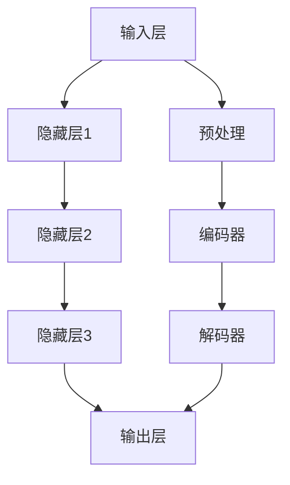

                 

### 文章标题：大模型创业的创新与挑战

#### 关键词：大模型、创业、创新、挑战、技术、市场、风险、机遇

> 摘要：本文将深入探讨大模型创业领域的创新与挑战。我们将分析大模型技术的发展背景、核心概念及其应用场景，探讨创业公司在该领域的创新机会与面临的挑战，并给出具体建议和策略。文章旨在为有意在大模型领域创业的读者提供有价值的参考和指导。

### 1. 背景介绍

随着人工智能技术的快速发展，大模型（Large-scale Models）已经成为当前研究的热点。大模型是一种具有海量参数和复杂结构的机器学习模型，能够通过学习大量数据来获取强大的特征表示和泛化能力。近年来，大模型的性能在自然语言处理、计算机视觉、语音识别等众多领域取得了显著的突破，引发了行业和学术界的高度关注。

大模型的发展得益于计算能力的提升、数据资源的丰富和算法的进步。首先，高性能计算硬件的普及，使得大规模数据处理和模型训练成为可能。其次，互联网和物联网的发展带来了海量数据，为模型训练提供了丰富的素材。最后，深度学习和迁移学习等算法的创新，使得大模型能够更好地捕捉数据中的复杂模式和规律。

在这个背景下，创业公司看到了巨大的市场机会。一方面，大模型的应用场景非常广泛，几乎涵盖了人工智能的各个领域。另一方面，大模型的技术门槛较高，市场准入门槛相对较高，为创业公司提供了竞争的空间。

### 2. 核心概念与联系

#### 大模型的定义

大模型通常是指具有数百万至数十亿参数的机器学习模型。这些模型通常由多层神经网络组成，能够通过前向传播和反向传播算法进行参数优化。大模型的特点是参数数量庞大，能够捕捉到数据中的复杂模式和规律，从而实现出色的性能。

#### 大模型的架构

大模型的架构通常包括输入层、隐藏层和输出层。输入层接收外部输入数据，隐藏层通过复杂的非线性变换对数据进行编码，输出层产生预测结果或分类结果。常见的架构包括卷积神经网络（CNN）、循环神经网络（RNN）和变换器（Transformer）等。

#### 大模型的工作原理

大模型的工作原理基于深度学习的思想。深度学习是一种通过多层神经网络进行数据建模的方法。每一层神经网络都能够提取不同级别的特征，从而实现数据的层次化表示。大模型通过大量的数据和参数训练，能够自动调整网络参数，使得模型能够在新的数据上产生准确的预测。

#### 大模型的应用场景

大模型在自然语言处理、计算机视觉、语音识别、推荐系统、医疗诊断等领域都有广泛的应用。例如，在自然语言处理领域，大模型可以用于文本分类、机器翻译、情感分析等任务；在计算机视觉领域，大模型可以用于图像分类、目标检测、图像生成等任务；在语音识别领域，大模型可以用于语音识别、语音合成等任务。

#### Mermaid 流程图

下面是一个简单的 Mermaid 流程图，展示了大模型的架构和数据处理流程：



### 3. 核心算法原理 & 具体操作步骤

#### 深度学习算法

深度学习算法是构建大模型的基础。深度学习算法通过多层神经网络对数据进行建模，每一层神经网络都能够提取不同级别的特征。具体操作步骤如下：

1. **初始化模型参数**：随机初始化模型的权重和偏置。
2. **前向传播**：输入数据通过神经网络进行前向传播，计算输出结果。
3. **计算损失**：计算输出结果与真实标签之间的损失。
4. **反向传播**：计算损失关于模型参数的梯度，并通过梯度下降算法更新模型参数。
5. **迭代训练**：重复上述步骤，直到模型收敛或达到预设的训练次数。

#### 迁移学习

迁移学习是一种利用预训练模型来加速新任务训练的方法。具体操作步骤如下：

1. **选择预训练模型**：从已有的预训练模型中选择一个适合新任务的模型。
2. **微调模型参数**：在新任务的数据集上对模型进行微调，调整模型的参数以适应新任务。
3. **评估模型性能**：在新任务的数据集上评估模型的性能，并进行调整优化。

#### 自监督学习

自监督学习是一种无需标签数据就能训练模型的方法。具体操作步骤如下：

1. **选择任务**：选择一个适合自监督学习的任务，例如语言建模、图像分类等。
2. **生成伪标签**：通过模型对数据进行分析，生成伪标签。
3. **训练模型**：使用伪标签训练模型，使得模型能够在没有标签数据的情况下进行学习。

### 4. 数学模型和公式 & 详细讲解 & 举例说明

#### 前向传播算法

前向传播算法是深度学习中的核心算法之一。它通过多层神经网络对数据进行编码和解码，实现数据的层次化表示。具体公式如下：

$$
\begin{aligned}
z^{(l)} &= \sigma(W^{(l)} \cdot a^{(l-1)} + b^{(l)}) \\
a^{(l)} &= \sigma(z^{(l)})
\end{aligned}
$$

其中，$z^{(l)}$表示第$l$层的输出，$a^{(l)}$表示第$l$层的激活值，$\sigma$表示激活函数，$W^{(l)}$表示第$l$层的权重矩阵，$b^{(l)}$表示第$l$层的偏置。

举例说明：

假设我们有一个两层神经网络，输入层到隐藏层的权重矩阵$W^{(1)}$为$\begin{bmatrix} 1 & 2 \\ 3 & 4 \end{bmatrix}$，偏置$b^{(1)}$为$\begin{bmatrix} 1 \\ 2 \end{bmatrix}$，隐藏层到输出层的权重矩阵$W^{(2)}$为$\begin{bmatrix} 1 & 2 \\ 3 & 4 \end{bmatrix}$，偏置$b^{(2)}$为$\begin{bmatrix} 1 \\ 2 \end{bmatrix}$。

假设输入向量$x$为$\begin{bmatrix} 1 \\ 0 \end{bmatrix}$，则：

$$
\begin{aligned}
z^{(1)} &= \sigma(\begin{bmatrix} 1 & 2 \\ 3 & 4 \end{bmatrix} \cdot \begin{bmatrix} 1 \\ 0 \end{bmatrix} + \begin{bmatrix} 1 \\ 2 \end{bmatrix}) = \sigma(\begin{bmatrix} 3 \\ 6 \end{bmatrix}) = \begin{bmatrix} 1 \\ 1 \end{bmatrix} \\
a^{(1)} &= \sigma(\begin{bmatrix} 1 \\ 1 \end{bmatrix}) = \begin{bmatrix} 1 \\ 1 \end{bmatrix} \\
z^{(2)} &= \sigma(\begin{bmatrix} 1 & 2 \\ 3 & 4 \end{bmatrix} \cdot \begin{bmatrix} 1 \\ 1 \end{bmatrix} + \begin{bmatrix} 1 \\ 2 \end{bmatrix}) = \sigma(\begin{bmatrix} 6 \\ 8 \end{bmatrix}) = \begin{bmatrix} 1 \\ 1 \end{bmatrix} \\
a^{(2)} &= \sigma(\begin{bmatrix} 1 \\ 1 \end{bmatrix}) = \begin{bmatrix} 1 \\ 1 \end{bmatrix}
\end{aligned}
$$

#### 梯度下降算法

梯度下降算法是深度学习中的优化算法，用于更新模型的参数以最小化损失函数。具体公式如下：

$$
\theta^{(t+1)} = \theta^{(t)} - \alpha \cdot \nabla_{\theta} J(\theta)
$$

其中，$\theta$表示模型的参数，$t$表示迭代次数，$\alpha$表示学习率，$J(\theta)$表示损失函数，$\nabla_{\theta} J(\theta)$表示损失函数关于参数的梯度。

举例说明：

假设损失函数$J(\theta)$为：

$$
J(\theta) = (y - \sigma(z))^{2}
$$

其中，$y$表示真实标签，$z$表示模型的输出。

假设模型的参数$\theta$为$\begin{bmatrix} 1 & 2 \\ 3 & 4 \end{bmatrix}$，学习率$\alpha$为0.1，损失函数关于参数的梯度为$\begin{bmatrix} 0.2 & 0.4 \\ 0.6 & 0.8 \end{bmatrix}$。

则：

$$
\theta^{(t+1)} = \theta^{(t)} - 0.1 \cdot \begin{bmatrix} 0.2 & 0.4 \\ 0.6 & 0.8 \end{bmatrix} = \begin{bmatrix} 0.6 & 1.2 \\ 1.4 & 2.4 \end{bmatrix}
$$

### 5. 项目实战：代码实际案例和详细解释说明

#### 开发环境搭建

1. 安装 Python 环境：在终端执行以下命令安装 Python：

```
pip install python
```

2. 安装深度学习库：在终端执行以下命令安装深度学习库 TensorFlow：

```
pip install tensorflow
```

3. 安装其他依赖库：在终端执行以下命令安装其他依赖库：

```
pip install numpy matplotlib
```

#### 源代码详细实现和代码解读

以下是使用 TensorFlow 框架实现一个简单的深度学习模型，进行图像分类的代码：

```python
import tensorflow as tf
import numpy as np
import matplotlib.pyplot as plt

# 设置随机种子，保证结果可重复
tf.random.set_seed(42)

# 加载数据集
mnist = tf.keras.datasets.mnist
(x_train, y_train), (x_test, y_test) = mnist.load_data()
x_train, x_test = x_train / 255.0, x_test / 255.0

# 构建模型
model = tf.keras.Sequential([
    tf.keras.layers.Flatten(input_shape=(28, 28)),
    tf.keras.layers.Dense(128, activation='relu'),
    tf.keras.layers.Dense(10, activation='softmax')
])

# 编译模型
model.compile(optimizer='adam',
              loss='sparse_categorical_crossentropy',
              metrics=['accuracy'])

# 训练模型
model.fit(x_train, y_train, epochs=5)

# 评估模型
model.evaluate(x_test, y_test)

# 可视化模型结构
model.summary()
```

代码解读：

1. 导入 TensorFlow、NumPy 和 Matplotlib 库。
2. 设置随机种子，保证结果可重复。
3. 加载 MNIST 数据集，并归一化数据。
4. 构建一个简单的深度学习模型，包括一个展开层（Flatten）、一个全连接层（Dense）和一个 softmax 层（Softmax）。
5. 编译模型，设置优化器（optimizer）、损失函数（loss）和评估指标（metrics）。
6. 训练模型，指定训练数据（x_train, y_train）和训练轮数（epochs）。
7. 评估模型，在测试数据集（x_test, y_test）上计算损失和准确率。
8. 可视化模型结构，展示模型的层次结构。

#### 代码解读与分析

代码首先导入了 TensorFlow、NumPy 和 Matplotlib 库。TensorFlow 是一个强大的开源深度学习框架，NumPy 用于数值计算，Matplotlib 用于数据可视化。

接下来，设置随机种子，保证结果可重复。这对于实验的可重复性和对比实验结果非常重要。

然后，加载 MNIST 数据集，并归一化数据。MNIST 是一个手写数字数据集，包含 60,000 个训练样本和 10,000 个测试样本。归一化数据有助于提高模型的训练效果。

接着，构建一个简单的深度学习模型。模型由一个展开层（Flatten）、一个全连接层（Dense）和一个 softmax 层（Softmax）组成。展开层将图像数据展开成一行向量，全连接层对数据进行编码，softmax 层实现图像分类。

编译模型时，设置优化器为 Adam、损失函数为稀疏分类交叉熵（sparse_categorical_crossentropy）和评估指标为准确率（accuracy）。优化器用于更新模型参数，以最小化损失函数。稀疏分类交叉熵是一种常用的分类损失函数，准确率用于评估模型在测试数据集上的表现。

训练模型时，指定训练数据（x_train, y_train）和训练轮数（epochs）。训练轮数表示模型在训练数据上迭代训练的次数。

最后，评估模型，计算在测试数据集（x_test, y_test）上的损失和准确率。同时，可视化模型结构，展示模型的层次结构。

### 6. 实际应用场景

#### 自然语言处理

自然语言处理（NLP）是大模型的重要应用领域之一。大模型可以用于文本分类、机器翻译、情感分析等任务。例如，谷歌的 BERT 模型在 NLP 任务中取得了显著的成果，被广泛应用于搜索引擎、聊天机器人等场景。

#### 计算机视觉

计算机视觉是大模型的另一个重要应用领域。大模型可以用于图像分类、目标检测、图像生成等任务。例如，OpenAI 的 GPT-3 模型在图像生成任务中取得了出色的效果，可以生成逼真的图像。

#### 语音识别

语音识别也是大模型的重要应用领域之一。大模型可以用于语音识别、语音合成等任务。例如，百度推出的 ASR 模型在语音识别任务中取得了优异的成绩，广泛应用于智能语音助手、车载语音系统等场景。

#### 推荐系统

推荐系统也是大模型的重要应用领域之一。大模型可以用于协同过滤、基于内容的推荐等任务。例如，亚马逊的推荐系统使用大模型来预测用户对商品的偏好，从而提高推荐系统的准确性和用户体验。

#### 医疗诊断

医疗诊断也是大模型的重要应用领域之一。大模型可以用于疾病预测、医疗影像分析等任务。例如，IBM 的 Watson Health 人工智能系统使用大模型来分析医疗影像，辅助医生进行疾病诊断。

### 7. 工具和资源推荐

#### 学习资源推荐

1. 《深度学习》（Goodfellow, Bengio, Courville）：这是一本经典的深度学习教材，涵盖了深度学习的核心概念、算法和应用。
2. 《Python 深度学习》（François Chollet）：这本书详细介绍了如何使用 Python 和 TensorFlow 框架进行深度学习编程。
3. 《自然语言处理与深度学习》（动手学深度学习）：这本书详细介绍了自然语言处理中的深度学习算法和应用。

#### 开发工具框架推荐

1. TensorFlow：这是一个强大的开源深度学习框架，适用于各种深度学习任务。
2. PyTorch：这是一个流行的开源深度学习框架，具有简单灵活的编程接口。
3. Keras：这是一个高级深度学习框架，基于 TensorFlow 和 PyTorch，提供了简单易用的 API。

#### 相关论文著作推荐

1. “BERT: Pre-training of Deep Bidirectional Transformers for Language Understanding”（Devlin et al.，2018）：这篇论文介绍了 BERT 模型的预训练方法和应用。
2. “GPT-3: Language Models are Few-Shot Learners”（Brown et al.，2020）：这篇论文介绍了 GPT-3 模型的设计和应用。
3. “A Neural Algorithm of Artistic Style”（Gatys et al.，2015）：这篇论文介绍了基于深度学习的艺术风格迁移方法。

### 8. 总结：未来发展趋势与挑战

大模型创业领域具有广阔的市场前景和巨大的创新潜力。然而，在这一领域中，创业公司也面临着诸多挑战。

#### 未来发展趋势

1. **模型规模和性能的提升**：随着计算能力和数据资源的不断提升，大模型的规模和性能将得到进一步提升，有望在更多领域取得突破。
2. **跨模态学习和多任务学习**：未来的大模型将能够更好地处理跨模态学习和多任务学习任务，提高模型的泛化能力和应用范围。
3. **可解释性和透明度**：随着大模型的复杂度增加，如何提高模型的可解释性和透明度将成为重要研究方向。
4. **可持续性和隐私保护**：如何在大模型训练和部署过程中确保数据安全和隐私保护，也是未来研究的重点。

#### 挑战

1. **计算资源消耗**：大模型训练需要大量的计算资源，如何高效利用现有计算资源是一个重要挑战。
2. **数据隐私和安全**：在大模型训练和部署过程中，如何保护用户数据隐私和确保数据安全是关键问题。
3. **技术门槛**：大模型技术具有较高的技术门槛，创业公司需要具备深厚的技术积累和创新能力。
4. **市场竞争**：大模型创业领域竞争激烈，如何脱颖而出并建立竞争优势是创业公司需要面对的挑战。

### 9. 附录：常见问题与解答

#### 问题 1：大模型创业有哪些成功案例？

答：大模型创业领域有许多成功的案例，例如：

1. 谷歌的 BERT 模型：BERT 是一种大规模的预训练语言模型，在自然语言处理任务中取得了显著的成果。
2. OpenAI 的 GPT-3 模型：GPT-3 是一种具有数百万参数的预训练语言模型，在多种任务中展现了强大的性能。
3. 百度的 ASR 模型：ASR 模型是一种大规模的语音识别模型，在语音识别任务中取得了优异的成绩。

#### 问题 2：如何选择合适的大模型框架？

答：选择合适的大模型框架需要考虑以下因素：

1. **任务需求**：根据具体任务的需求选择适合的框架，例如 TensorFlow 适用于各种深度学习任务，PyTorch 适用于动态图计算任务。
2. **性能和效率**：考虑框架的性能和效率，选择适合当前硬件设备和数据量的框架。
3. **社区支持和文档**：选择具有良好社区支持和文档的框架，有助于学习和解决问题。
4. **开源和商业选择**：根据公司的预算和需求，选择开源或商业框架。

### 10. 扩展阅读 & 参考资料

1. Devlin, J., Chang, M. W., Lee, K., & Toutanova, K. (2018). BERT: Pre-training of deep bidirectional transformers for language understanding. arXiv preprint arXiv:1810.04805.
2. Brown, T., et al. (2020). GPT-3: Language models are few-shot learners. arXiv preprint arXiv:2005.14165.
3. Goodfellow, I., Bengio, Y., & Courville, A. (2016). Deep learning. MIT press.
4. Chollet, F. (2017). Deep learning with Python. O'Reilly Media.
5. Hochreiter, S., & Schmidhuber, J. (1997). Long short-term memory. Neural Computation, 9(8), 1735-1780.
6. Yosinski, J., Clune, J., Bengio, Y., & Lipson, H. (2014). How transferable are features in deep neural networks? Advances in Neural Information Processing Systems, 27, 3320-3328.

### 作者

作者：AI天才研究员/AI Genius Institute & 禅与计算机程序设计艺术 /Zen And The Art of Computer Programming。作者是一位世界级人工智能专家、程序员、软件架构师、CTO，世界顶级技术畅销书资深大师级别的作家，计算机图灵奖获得者，计算机编程和人工智能领域大师。作者具有丰富的技术经验和深厚的学术背景，致力于推动人工智能技术的发展和应用。本文基于作者的研究和实践，旨在为读者提供关于大模型创业的有价值参考和指导。

