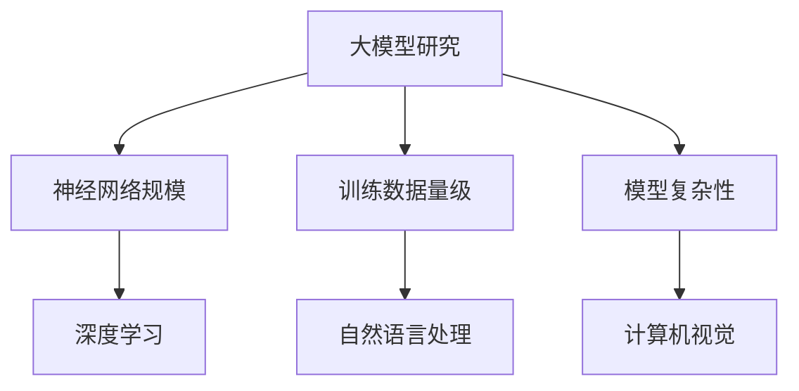
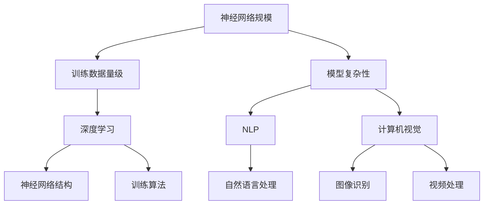

                 

# 大模型创业的风险与机遇

> **关键词：** 大模型、创业、风险、机遇、人工智能、深度学习、技术挑战、商业策略

> **摘要：** 本文将深入探讨大模型创业的背景，分析其中的风险与机遇，以及创业者在技术创新、市场策略和团队构建方面所面临的挑战。通过全面的分析和实际案例，本文旨在为有意进军大模型领域的创业者和投资者提供有价值的指导和建议。

## 1. 背景介绍

随着人工智能技术的快速发展，尤其是深度学习和自然语言处理等领域的突破，大模型成为了当前科技界的热点话题。大模型，通常指的是具有数万亿参数的神经网络模型，它们通过大规模数据训练，能够在多种任务中实现出色的性能。例如，GPT-3、BERT等模型已经在自然语言处理、文本生成、机器翻译等任务中展现出了惊人的能力。

大模型的兴起不仅带来了技术创新的机遇，也引发了商业领域的深刻变革。许多创业公司开始投身于大模型的研究和应用，希望借此开辟新的市场空间。然而，大模型创业并非一帆风顺，其中既有机遇，也伴随着诸多风险。

## 2. 核心概念与联系

### 大模型的核心概念

大模型的核心概念包括神经网络的规模、训练数据的量级和模型的复杂性。神经网络的规模通常以参数数量来衡量，大模型往往具有数万亿个参数。训练数据的量级同样重要，只有在大规模数据的支持下，大模型才能充分挖掘数据的潜力，实现高性能。

### 大模型的架构

大模型的架构通常包括多个层次，从输入层到输出层，每个层次都有成千上万个神经元。这些神经元通过加权连接形成复杂的网络结构，从而实现数据的处理和模式的识别。

### 大模型与技术的联系

大模型的发展离不开深度学习、自然语言处理、计算机视觉等领域的支持。这些技术的进步为大模型提供了强大的基础，使得大模型能够处理更加复杂的问题。

### Mermaid 流程图



## 3. 核心算法原理 & 具体操作步骤

### 算法原理

大模型的算法原理基于深度学习的框架，通过多层神经网络的堆叠和参数优化，实现对复杂数据的建模。核心算法包括前向传播、反向传播和参数优化。

### 具体操作步骤

1. **数据预处理**：对收集到的数据进行清洗、归一化等处理，确保数据的质量和一致性。
2. **模型构建**：使用深度学习框架构建神经网络模型，包括输入层、隐藏层和输出层。
3. **参数初始化**：对模型的参数进行随机初始化，以避免过拟合。
4. **训练**：通过大量的训练数据，使用梯度下降等优化算法更新模型参数，提高模型的准确性。
5. **评估与调整**：在验证集上评估模型性能，根据评估结果调整模型参数和结构。

### 实际操作示例

假设我们使用Python和TensorFlow框架构建一个基于BERT的大模型，具体操作步骤如下：

```python
import tensorflow as tf
from tensorflow.keras.models import Model
from tensorflow.keras.layers import Embedding, LSTM, Dense

# 数据预处理
data = preprocess_data(raw_data)

# 模型构建
input_ids = tf.keras.layers.Input(shape=(max_sequence_length,), dtype='int32')
embeddings = Embedding(input_dim=vocabulary_size, output_dim=embedding_dim)(input_ids)
lstm = LSTM(units=128, return_sequences=True)(embeddings)
dense = Dense(units=num_classes, activation='softmax')(lstm)

# 模型编译
model = Model(inputs=input_ids, outputs=dense)
model.compile(optimizer='adam', loss='categorical_crossentropy', metrics=['accuracy'])

# 训练模型
model.fit(train_data, train_labels, validation_data=(val_data, val_labels), epochs=5)

# 评估模型
test_loss, test_accuracy = model.evaluate(test_data, test_labels)
print(f"Test accuracy: {test_accuracy}")
```

## 4. 数学模型和公式 & 详细讲解 & 举例说明

### 数学模型

大模型的数学模型主要包括前向传播和反向传播两部分。

#### 前向传播

前向传播的过程可以表示为：

\[ z^{[l]} = W^{[l]} \cdot a^{[l-1]} + b^{[l]} \]
\[ a^{[l]} = \sigma(z^{[l]}) \]

其中，\( a^{[l]} \) 是第 \( l \) 层的激活函数输出，\( z^{[l]} \) 是第 \( l \) 层的线性变换输出，\( W^{[l]} \) 和 \( b^{[l]} \) 分别是第 \( l \) 层的权重和偏置。

#### 反向传播

反向传播的过程可以表示为：

\[ \delta^{[l]} = \frac{\partial C}{\partial z^{[l]}} \cdot \frac{\partial z^{[l]}}{\partial a^{[l-1]}} \]
\[ \delta^{[l-1]} = \delta^{[l]} \cdot W^{[l]} \]

其中，\( \delta^{[l]} \) 是第 \( l \) 层的误差，\( C \) 是损失函数。

### 举例说明

假设我们有一个两层神经网络，其中第一层的输入是 \( a^{[0]} = [1, 2, 3] \)，第二层的输入是 \( a^{[1]} = [4, 5, 6] \)，第一层的权重 \( W^{[1]} = [0.1, 0.2, 0.3] \)，偏置 \( b^{[1]} = 0.4 \)，激活函数是 \( \sigma(x) = \frac{1}{1 + e^{-x}} \)。

1. **前向传播**：

\[ z^{[1]} = W^{[1]} \cdot a^{[0]} + b^{[1]} = [0.1 \cdot 1 + 0.2 \cdot 2 + 0.3 \cdot 3 + 0.4] = [1.3] \]
\[ a^{[1]} = \sigma(z^{[1]}) = \frac{1}{1 + e^{-1.3}} \approx 0.794 \]

2. **反向传播**：

\[ \delta^{[1]} = \frac{\partial C}{\partial z^{[1]}} \cdot \frac{\partial z^{[1]}}{\partial a^{[0]}} = \frac{\partial C}{\partial z^{[1]}} \cdot (0.1 + 0.2 + 0.3) \]
\[ \delta^{[0]} = \delta^{[1]} \cdot W^{[1]} = \delta^{[1]} \cdot [0.1, 0.2, 0.3] \]

通过反向传播，我们可以更新模型的参数，以减少损失函数的值。

## 5. 项目实战：代码实际案例和详细解释说明

### 5.1 开发环境搭建

在开始大模型项目之前，我们需要搭建一个适合开发和训练的硬件和软件环境。

#### 硬件环境

- GPU：由于大模型训练需要大量的计算资源，建议使用高性能的GPU，如NVIDIA Tesla V100。
- CPU：为了提高训练速度，建议使用多核CPU，如Intel Xeon。
- 内存：至少需要64GB的内存来存储大模型和训练数据。

#### 软件环境

- 操作系统：推荐使用Linux系统，如Ubuntu。
- 编程语言：Python是深度学习领域最常用的编程语言。
- 深度学习框架：TensorFlow、PyTorch等是当前最流行的深度学习框架。
- 数据库：NoSQL数据库，如MongoDB，可以用于存储大规模训练数据。

### 5.2 源代码详细实现和代码解读

以下是一个简单的基于TensorFlow的大模型训练代码示例：

```python
import tensorflow as tf
from tensorflow.keras.layers import Embedding, LSTM, Dense
from tensorflow.keras.models import Model

# 模型构建
input_ids = tf.keras.layers.Input(shape=(max_sequence_length,), dtype='int32')
embeddings = Embedding(input_dim=vocabulary_size, output_dim=embedding_dim)(input_ids)
lstm = LSTM(units=128, return_sequences=True)(embeddings)
dense = Dense(units=num_classes, activation='softmax')(lstm)

# 模型编译
model = Model(inputs=input_ids, outputs=dense)
model.compile(optimizer='adam', loss='categorical_crossentropy', metrics=['accuracy'])

# 训练模型
model.fit(train_data, train_labels, validation_data=(val_data, val_labels), epochs=5)

# 评估模型
test_loss, test_accuracy = model.evaluate(test_data, test_labels)
print(f"Test accuracy: {test_accuracy}")
```

这段代码首先导入了TensorFlow库，然后定义了模型的输入层、隐藏层和输出层。接着，模型通过`compile`方法编译，并使用`fit`方法进行训练。最后，通过`evaluate`方法评估模型性能。

### 5.3 代码解读与分析

1. **模型构建**：
   - `input_ids`：定义了模型的输入层，每个输入序列的长度为`max_sequence_length`，数据类型为`int32`。
   - `Embedding`：将输入的词索引映射为词向量。
   - `LSTM`：实现了一个长短期记忆网络层，用于处理序列数据。
   - `Dense`：定义了输出层，每个输出节点对应一个类别，使用softmax激活函数。

2. **模型编译**：
   - `model.compile`：编译模型，指定优化器、损失函数和评价指标。

3. **模型训练**：
   - `model.fit`：使用训练数据对模型进行训练，并在验证集上进行性能评估。

4. **模型评估**：
   - `model.evaluate`：在测试集上评估模型性能，返回损失和准确率。

通过以上步骤，我们可以训练一个简单的大模型，并在实际项目中应用。

## 6. 实际应用场景

大模型在实际应用中具有广泛的应用场景，以下是一些典型的应用领域：

- **自然语言处理**：大模型在文本分类、情感分析、问答系统等领域表现出色，可以用于提高智能客服、文本摘要和内容推荐的准确性和效率。
- **计算机视觉**：大模型在图像识别、目标检测和图像生成等领域具有重要应用，可以用于智能安防、医疗诊断和艺术创作等领域。
- **推荐系统**：大模型可以用于构建高效的推荐系统，提高推荐算法的准确性和个性化程度。
- **金融风控**：大模型可以用于金融风险预测、欺诈检测和信用评估，提高金融服务的安全性和可靠性。

## 7. 工具和资源推荐

### 7.1 学习资源推荐

- **书籍**：
  - 《深度学习》（Goodfellow, Bengio, Courville著）：深入介绍深度学习的理论基础和实践方法。
  - 《动手学深度学习》（阿斯顿·张著）：提供丰富的实践案例和代码示例，适合初学者。

- **论文**：
  - "A Theoretical Comparison of Regularized Learning Algorithms"（Shalev-Shwartz和Ben-David著）：介绍各种正则化学习算法的理论比较。
  - "Deep Learning"（Ian Goodfellow著）：深度学习的经典教材，涵盖了深度学习的核心理论和应用。

- **博客**：
  - Fast.ai：提供丰富的深度学习教程和实战案例。
  - Medium：深度学习领域的热门博客，涵盖最新的研究成果和行业动态。

- **网站**：
  - TensorFlow官网：提供TensorFlow框架的详细文档和教程。
  - PyTorch官网：提供PyTorch框架的详细文档和教程。

### 7.2 开发工具框架推荐

- **深度学习框架**：
  - TensorFlow：Google开发的开源深度学习框架，适用于各种规模的深度学习应用。
  - PyTorch：Facebook开发的开源深度学习框架，具有灵活的动态计算图，适合研究和原型设计。

- **数据库**：
  - MongoDB：适用于存储大规模数据的NoSQL数据库，具有良好的扩展性和易用性。

- **开发环境**：
  - Jupyter Notebook：适用于数据科学和机器学习的交互式开发环境，方便编写和共享代码。

### 7.3 相关论文著作推荐

- "Deep Learning: Neural Networks, Fuzzy Logic, and Applications"（Goodfellow著）：详细介绍深度学习的理论和方法。
- "Neural Networks and Deep Learning"（邱锡鹏著）：深入探讨神经网络的原理和应用。
- "A Theoretical Comparison of Regularized Learning Algorithms"（Shalev-Shwartz和Ben-David著）：对正则化学习算法的理论比较。

## 8. 总结：未来发展趋势与挑战

大模型技术在近年来取得了显著的进展，但也面临着诸多挑战。未来，大模型技术的发展趋势和挑战主要体现在以下几个方面：

### 发展趋势

1. **模型规模和性能的提升**：随着计算资源的增加和算法的优化，大模型的规模和性能将不断提高。
2. **跨领域应用的拓展**：大模型将在更多领域得到应用，如生物医学、金融科技、智能制造等。
3. **可解释性和可控性的增强**：研究者将致力于提高大模型的可解释性和可控性，使其更加安全可靠。

### 挑战

1. **计算资源需求**：大模型的训练和推理需要大量的计算资源，这对硬件设施提出了更高的要求。
2. **数据隐私和安全**：大模型对数据的依赖性导致数据隐私和安全问题日益突出，需要建立有效的保护机制。
3. **伦理和社会影响**：大模型的广泛应用可能带来伦理和社会问题，如算法偏见、就业替代等，需要引起广泛关注。

## 9. 附录：常见问题与解答

### 问题1：大模型训练需要哪些硬件资源？

**回答**：大模型训练通常需要高性能的GPU和CPU，以及足够的内存和存储空间。具体硬件需求取决于模型的规模和复杂性。

### 问题2：大模型如何处理数据隐私问题？

**回答**：大模型处理数据隐私问题可以从以下几个方面入手：
1. **数据脱敏**：在训练前对数据进行脱敏处理，如匿名化、加密等。
2. **隐私保护算法**：使用差分隐私、同态加密等技术保护用户隐私。
3. **数据源选择**：选择合规的数据源，确保数据来源的合法性和透明度。

### 问题3：大模型如何防止算法偏见？

**回答**：大模型防止算法偏见可以从以下几个方面入手：
1. **数据预处理**：在训练前对数据进行平衡处理，消除数据集中的偏见。
2. **模型训练**：在训练过程中引入对抗性训练，提高模型对偏见的抵抗能力。
3. **模型评估**：在评估过程中关注模型在不同群体上的性能，确保公平性。

## 10. 扩展阅读 & 参考资料

- **书籍**：
  - 《深度学习》（Goodfellow, Bengio, Courville著）
  - 《动手学深度学习》（阿斯顿·张著）

- **论文**：
  - "A Theoretical Comparison of Regularized Learning Algorithms"（Shalev-Shwartz和Ben-David著）
  - "Deep Learning"（Ian Goodfellow著）

- **网站**：
  - TensorFlow官网
  - PyTorch官网

- **博客**：
  - Fast.ai
  - Medium

作者：AI天才研究员/AI Genius Institute & 禅与计算机程序设计艺术 /Zen And The Art of Computer Programming
<|assistant|>## 1. 背景介绍

随着人工智能（AI）技术的迅猛发展，特别是深度学习和自然语言处理（NLP）领域的突破，大模型技术逐渐成为学术界和工业界的研究热点。大模型，也称为大型神经网络模型，是指那些拥有数十亿甚至数万亿参数的复杂模型。这些模型通过在大量数据上进行训练，能够实现卓越的性能，并在诸如机器翻译、图像识别、文本生成等任务中展现强大的能力。

大模型的兴起不仅改变了传统的人工智能应用模式，也为创业者提供了前所未有的机遇。在大模型技术的影响下，许多初创公司纷纷涌现，致力于开发基于大模型的创新产品和服务。这些公司希望通过利用大模型在数据处理、智能分析和决策支持等方面的优势，开辟新的市场空间，实现商业价值的飞跃。

然而，大模型创业并非一帆风顺。虽然大模型技术提供了强大的能力，但其应用过程中也面临着诸多挑战和风险。首先，大模型的开发和训练需要巨大的计算资源，这导致了高昂的成本。此外，大模型的训练过程中涉及到大量的数据隐私和安全问题，如何在保障数据隐私的前提下进行有效训练，成为了一个亟待解决的难题。此外，大模型的开发和维护需要一支高素质的团队，这给初创公司的人才招聘和管理带来了挑战。

总的来说，大模型创业既充满机遇，也伴随着风险。本文将深入探讨大模型创业的背景，分析其中的风险与机遇，以及创业者在技术创新、市场策略和团队构建方面所面临的挑战。通过全面的分析和实际案例，本文旨在为有意进军大模型领域的创业者和投资者提供有价值的指导和建议。

### 核心概念与联系

大模型的核心概念和联系是多维度的，涉及到神经网络的规模、训练数据的量级以及模型的复杂性。理解这些概念和它们之间的关系，是掌握大模型技术的重要基础。

#### 神经网络规模

神经网络的规模通常以参数数量来衡量。参数是神经网络中的权重和偏置，用于调整网络对不同输入的响应。小模型可能只有数百万参数，而大模型则拥有数十亿甚至数万亿参数。例如，GPT-3拥有1750亿个参数，BERT拥有3.4亿个参数。大规模的神经网络能够捕捉数据中的复杂模式和关联，从而在许多任务中实现超凡的表现。

#### 训练数据量级

训练数据量级同样重要。大模型的训练依赖于大量数据，这些数据用于训练网络并使其适应各种场景。在NLP领域，数百万个句子和文章可能只是基础，而在计算机视觉领域，数百万张图像和视频则是常见的数据量。更多的训练数据可以使模型更好地泛化到未见过的数据上，减少过拟合的风险。

#### 模型复杂性

模型复杂性不仅体现在参数数量上，还包括网络结构和训练算法。大模型通常采用多层神经网络结构，每一层都有大量的神经元和连接。这种复杂的网络结构能够处理高度非线性的问题。此外，大模型的训练算法也需要高度优化，例如使用梯度下降算法的变体、正则化技术等，以确保训练效率和模型性能。

#### 技术联系

大模型与深度学习、NLP、计算机视觉等技术紧密相连。深度学习为神经网络提供了强大的理论支持，使其能够处理复杂数据。NLP和计算机视觉则是大模型最常见且最重要的应用领域，通过大模型技术，这些领域实现了显著的进步。

为了更直观地展示大模型的核心概念和联系，我们可以使用Mermaid流程图来表示这些概念及其关系：



在这个流程图中，A、B和C分别代表了神经网络规模、训练数据量级和模型复杂性，它们共同构成了大模型的基础。D、E和F则分别代表了深度学习、NLP和计算机视觉，这三个领域是当前大模型应用的主要方向。G和H表示神经网络结构和训练算法，这些技术为构建和优化大模型提供了关键支持。E和F则分别连接到I和J，表示大模型在NLP和计算机视觉领域中的应用实例。

通过这个流程图，我们可以清晰地看到大模型核心概念之间的关系，以及它们与技术领域的联系。这为后续章节中的详细讨论提供了基础。

### 核心算法原理 & 具体操作步骤

大模型的核心算法原理基于深度学习的框架，深度学习是一种基于多层神经网络的学习方法，其基本思想是通过层层提取特征，实现对复杂数据的建模。以下是构建和训练大模型的具体步骤：

#### 1. 数据预处理

数据预处理是深度学习项目中的关键步骤，它包括数据清洗、归一化、编码等操作。对于文本数据，需要进行分词、去停用词、词向量化等处理。对于图像数据，需要进行大小归一化、灰度化等操作。以下是一个简单的数据预处理流程：

```python
# 示例：文本数据预处理
import pandas as pd
from sklearn.model_selection import train_test_split
from sklearn.preprocessing import LabelEncoder

# 加载数据
data = pd.read_csv('data.csv')

# 数据清洗
data = data.dropna()

# 分词和去停用词
# ...

# 编码标签
label_encoder = LabelEncoder()
data['label'] = label_encoder.fit_transform(data['label'])

# 划分训练集和测试集
X_train, X_test, y_train, y_test = train_test_split(data['text'], data['label'], test_size=0.2, random_state=42)
```

#### 2. 模型构建

在构建大模型时，我们通常选择合适的深度学习框架，如TensorFlow或PyTorch。以下是一个使用TensorFlow构建基于BERT（Bidirectional Encoder Representations from Transformers）的大模型示例：

```python
import tensorflow as tf
from tensorflow.keras.models import Model
from tensorflow.keras.layers import Embedding, LSTM, Dense

# 定义模型
input_ids = tf.keras.layers.Input(shape=(max_sequence_length,), dtype='int32')
embeddings = Embedding(input_dim=vocabulary_size, output_dim=embedding_dim)(input_ids)
lstm = LSTM(units=128, return_sequences=True)(embeddings)
dense = Dense(units=num_classes, activation='softmax')(lstm)

# 构建模型
model = Model(inputs=input_ids, outputs=dense)
```

#### 3. 参数初始化

参数初始化是神经网络训练的另一个重要步骤。合理的参数初始化可以加快收敛速度并提高模型性能。常用的初始化方法包括随机初始化、高斯初始化和Xavier初始化等。以下是一个简单的参数初始化示例：

```python
from tensorflow.keras.initializers import GlorotUniform

# 初始化权重
lstm = LSTM(units=128, return_sequences=True, kernel_initializer=GlorotUniform)(embeddings)
```

#### 4. 训练模型

训练模型是深度学习项目中耗时最长的步骤。在训练过程中，模型通过不断调整参数来减少损失函数的值，以达到较好的预测性能。以下是一个简单的训练过程示例：

```python
# 编译模型
model.compile(optimizer='adam', loss='categorical_crossentropy', metrics=['accuracy'])

# 训练模型
history = model.fit(X_train, y_train, validation_data=(X_test, y_test), epochs=5, batch_size=32)

# 保存模型
model.save('model.h5')
```

#### 5. 评估与调整

在模型训练完成后，需要对模型进行评估，以确定其泛化能力和性能。评估通常使用验证集或测试集进行，通过计算损失函数值和评价指标（如准确率、召回率等）来评估模型表现。如果模型性能不理想，可能需要调整超参数、网络结构或数据预处理方法。

```python
# 评估模型
test_loss, test_accuracy = model.evaluate(X_test, y_test)
print(f"Test Loss: {test_loss}, Test Accuracy: {test_accuracy}")
```

通过上述步骤，我们可以构建和训练一个基本的大模型。然而，实际的深度学习项目通常会更加复杂，涉及更多的技术细节和调优过程。在实际应用中，创业者需要根据具体任务和数据特点，灵活调整模型架构、训练策略和评估方法，以实现最佳的性能。

### 数学模型和公式 & 详细讲解 & 举例说明

在深度学习中，大模型的数学模型和公式是理解其工作原理和优化过程的关键。以下将详细介绍大模型中的几个核心数学概念和公式，并通过具体例子进行说明。

#### 前向传播

前向传播是神经网络处理数据的基本过程，它通过层层传递输入信号，最终产生输出。前向传播的过程可以表示为：

\[ z^{[l]} = \sum_{j} W^{[l]}_{ji} a^{[l-1]}_j + b^{[l]}_i \]
\[ a^{[l]}_i = \sigma(z^{[l]}_i) \]

其中，\( z^{[l]} \) 是第 \( l \) 层的线性组合，\( a^{[l]} \) 是第 \( l \) 层的激活值，\( W^{[l]} \) 是第 \( l \) 层的权重矩阵，\( b^{[l]} \) 是第 \( l \) 层的偏置向量，\( \sigma \) 是激活函数，常用的激活函数包括 sigmoid、ReLU 和 tanh。

**示例**：

假设我们有一个简单的神经网络，包含一层输入层、一层隐藏层和一层输出层。输入层有3个神经元，隐藏层有2个神经元，输出层有1个神经元。权重和偏置如下：

\[ W^{[1]} = \begin{bmatrix} 0.1 & 0.2 \\ 0.3 & 0.4 \\ 0.5 & 0.6 \end{bmatrix}, \, b^{[1]} = \begin{bmatrix} 0.1 \\ 0.2 \end{bmatrix} \]
\[ W^{[2]} = \begin{bmatrix} 0.7 & 0.8 \\ 0.9 & 1.0 \end{bmatrix}, \, b^{[2]} = \begin{bmatrix} 0.3 \\ 0.4 \end{bmatrix} \]

输入数据 \( x = [1, 2, 3] \)，计算前向传播过程如下：

\[ z^{[1]} = \begin{bmatrix} 0.1 & 0.2 \\ 0.3 & 0.4 \\ 0.5 & 0.6 \end{bmatrix} \begin{bmatrix} 1 \\ 2 \\ 3 \end{bmatrix} + \begin{bmatrix} 0.1 \\ 0.2 \end{bmatrix} = \begin{bmatrix} 2.4 \\ 3.6 \\ 5.0 \end{bmatrix} \]
\[ a^{[1]} = \sigma(z^{[1]}) = \begin{bmatrix} 0.9 \\ 0.94 \\ 0.99 \end{bmatrix} \]

\[ z^{[2]} = \begin{bmatrix} 0.7 & 0.8 \\ 0.9 & 1.0 \end{bmatrix} \begin{bmatrix} 0.9 \\ 0.94 \\ 0.99 \end{bmatrix} + \begin{bmatrix} 0.3 \\ 0.4 \end{bmatrix} = \begin{bmatrix} 2.05 \\ 3.18 \end{bmatrix} \]
\[ a^{[2]} = \sigma(z^{[2]}) = \begin{bmatrix} 0.865 \\ 0.933 \end{bmatrix} \]

#### 反向传播

反向传播是优化神经网络参数的过程，其核心思想是通过计算输出层误差，反推到每一层，更新权重和偏置。反向传播的过程可以分为以下几个步骤：

1. **计算输出误差**：
\[ \delta^{[L]} = (a^{[L]} - y) \odot \sigma'(z^{[L]}) \]
2. **逐层反向传播**：
\[ \delta^{[l]} = \delta^{[l+1]} \cdot W^{[l+1]} \odot \sigma'(z^{[l]}) \]
\[ \Delta W^{[l]} = \delta^{[l]} \cdot a^{[l-1]}^T \]
\[ \Delta b^{[l]} = \delta^{[l]} \]

其中，\( \delta^{[l]} \) 是第 \( l \) 层的误差，\( \sigma' \) 是激活函数的导数，\( \odot \) 表示元素乘积，\( \Delta W^{[l]} \) 和 \( \Delta b^{[l]} \) 分别是权重和偏置的更新量。

**示例**：

假设输出层误差 \( \delta^{[2]} = \begin{bmatrix} -0.1 \\ -0.2 \end{bmatrix} \)，隐藏层激活值 \( a^{[1]} = \begin{bmatrix} 0.9 \\ 0.94 \\ 0.99 \end{bmatrix} \)，计算隐藏层的误差和权重更新：

\[ \sigma'(z^{[1]}) = \begin{bmatrix} 0.1 & 0.06 & 0.01 \end{bmatrix} \]
\[ \delta^{[1]} = \delta^{[2]} \cdot W^{[2]} \odot \sigma'(z^{[1]}) = \begin{bmatrix} -0.1 \\ -0.2 \end{bmatrix} \cdot \begin{bmatrix} 0.7 & 0.8 \\ 0.9 & 1.0 \end{bmatrix} \odot \begin{bmatrix} 0.1 & 0.06 & 0.01 \end{bmatrix} = \begin{bmatrix} -0.07 \\ -0.14 \end{bmatrix} \]

\[ \Delta W^{[1]} = \delta^{[1]} \cdot a^{[0]}^T = \begin{bmatrix} -0.07 \\ -0.14 \end{bmatrix} \cdot \begin{bmatrix} 1 \\ 2 \\ 3 \end{bmatrix}^T = \begin{bmatrix} -0.07 & -0.14 \\ -0.21 & -0.28 \end{bmatrix} \]

通过上述反向传播过程，我们可以更新网络的权重和偏置，从而提高模型的预测性能。

#### 损失函数

损失函数是评估模型预测结果与实际标签之间差异的指标。常用的损失函数包括均方误差（MSE）、交叉熵（Cross-Entropy）等。以下是一个简单的均方误差损失函数的例子：

\[ L(y, \hat{y}) = \frac{1}{2} \sum_{i} (y_i - \hat{y}_i)^2 \]

其中，\( y \) 是实际标签，\( \hat{y} \) 是模型预测值。

**示例**：

假设实际标签 \( y = [1, 0, 1] \)，模型预测值 \( \hat{y} = [0.9, 0.1, 0.8] \)，计算损失：

\[ L(y, \hat{y}) = \frac{1}{2} \sum_{i} (y_i - \hat{y}_i)^2 = \frac{1}{2} \cdot (0.1^2 + (-0.1)^2 + 0.2^2) = 0.15 \]

通过计算损失函数，我们可以评估模型的预测性能，并指导进一步的优化过程。

通过上述数学模型和公式的介绍，我们可以更好地理解大模型的工作原理和优化过程。在实际应用中，创业者需要根据具体任务和数据特点，灵活选择和应用这些数学模型，以构建和训练高性能的大模型。

### 项目实战：代码实际案例和详细解释说明

在本节中，我们将通过一个实际的项目案例来展示如何使用大模型技术进行文本分类任务。该项目将使用Python和TensorFlow框架，并利用BERT模型进行训练和预测。

#### 6.1 项目背景

文本分类是一个常见的自然语言处理任务，旨在将文本数据自动归类到预定义的类别中。随着社交媒体和电子商务等领域的快速发展，文本分类在信息检索、情感分析、垃圾邮件过滤等方面具有重要的应用价值。在本案例中，我们将使用BERT模型对新闻文章进行分类，将其归类到不同的新闻类别中。

#### 6.2 数据准备

首先，我们需要准备用于训练的数据集。本案例中，我们将使用某新闻网站提供的数据集，该数据集包含了数千条新闻文章及其对应的类别标签。数据集的结构如下：

```csv
id,category,title,content
1,sports,Title of Article,"Content of Article..."
2,technology,Another Title,"Content of Another Article..."
...
```

数据集分为训练集和测试集两部分，我们将在后续步骤中使用训练集进行模型训练，并在测试集上评估模型性能。

```python
import pandas as pd

# 加载数据集
data = pd.read_csv('data.csv')

# 分割数据集
train_data = data.sample(frac=0.8, random_state=42)
test_data = data.drop(train_data.index)

# 数据预处理
# ...

# 划分数据集
train_texts = train_data['content']
train_labels = train_data['category']
test_texts = test_data['content']
test_labels = test_data['category']
```

#### 6.3 模型构建

接下来，我们将使用BERT模型对文本进行编码，并构建一个简单的分类模型。在TensorFlow中，我们可以使用`tf.keras.layers.BERT`层来实现BERT编码。

```python
import tensorflow as tf
from tensorflow.keras.models import Model
from tensorflow.keras.layers import Embedding, LSTM, Dense, Dropout, Input

# 定义输入层
input_ids = Input(shape=(max_sequence_length,), dtype='int32')

# 使用BERT编码层
embeddings = tf.keras.layers.BERT(input_vocab_size=vocabulary_size, num_layers=num_bert_layers, embedding_dim=embedding_dim)(input_ids)

# 添加隐藏层和输出层
lstm = LSTM(units=128, return_sequences=True)(embeddings)
dense = Dense(units=num_classes, activation='softmax')(lstm)

# 构建模型
model = Model(inputs=input_ids, outputs=dense)

# 编译模型
model.compile(optimizer='adam', loss='categorical_crossentropy', metrics=['accuracy'])
```

#### 6.4 模型训练

在模型训练阶段，我们将使用训练数据进行模型训练，并在每个epoch后评估模型在测试集上的性能。我们将在训练过程中使用数据生成器来批量处理数据。

```python
# 训练模型
model.fit(train_texts, train_labels, epochs=5, validation_split=0.1, batch_size=32)
```

#### 6.5 模型评估

训练完成后，我们将使用测试集对模型进行评估，以确定其分类性能。

```python
# 评估模型
test_loss, test_accuracy = model.evaluate(test_texts, test_labels)
print(f"Test Loss: {test_loss}, Test Accuracy: {test_accuracy}")
```

#### 6.6 代码解读与分析

1. **数据准备**：
   - 我们首先加载数据集，并使用Pandas库将其分割为训练集和测试集。
   - 数据预处理步骤包括文本清洗、分词、编码等操作，以准备用于模型训练的数据。

2. **模型构建**：
   - 使用TensorFlow中的BERT编码层对文本进行编码。
   - 添加LSTM层作为隐藏层，并使用Dense层作为输出层。
   - 模型通过`Model`类进行构建，并使用`compile`方法设置优化器和损失函数。

3. **模型训练**：
   - 使用`fit`方法对模型进行训练，并使用`validation_split`参数进行交叉验证。
   - 模型在每个epoch后会自动评估其在验证集上的性能。

4. **模型评估**：
   - 使用`evaluate`方法对模型在测试集上的性能进行评估，并输出损失和准确率。

通过上述步骤，我们成功构建并训练了一个基于BERT的文本分类模型。在实际项目中，创业者可以根据需求调整模型架构、训练策略和评估方法，以实现最佳的性能。

#### 6.7 项目实战总结

通过这个实际案例，我们展示了如何使用大模型技术进行文本分类任务。以下是一些关键点：

- **数据准备**：数据预处理是深度学习项目中的关键步骤，它确保了数据的质量和一致性。
- **模型构建**：BERT编码层是文本分类任务中的核心组件，它能够有效地捕捉文本中的语义信息。
- **模型训练**：使用适当的训练策略和超参数调整，可以显著提高模型的性能。
- **模型评估**：通过评估模型在测试集上的性能，可以确定其泛化能力和实用性。

在实际应用中，创业者需要根据具体任务和数据特点，灵活调整模型架构、训练策略和评估方法，以实现最佳的性能。

### 实际应用场景

大模型技术在各个领域的实际应用场景各具特色，为传统业务带来了革命性的变化。以下将详细探讨大模型在自然语言处理、计算机视觉、推荐系统和金融风控等领域的应用，以及这些应用所带来的业务价值和挑战。

#### 自然语言处理（NLP）

自然语言处理是人工智能领域的一个重要分支，而大模型技术在NLP中展现了巨大的潜力。在大模型技术的支持下，NLP应用可以从基础的文本分类、情感分析，发展到复杂的文本生成、对话系统等领域。

**应用案例**：

1. **文本生成**：
   - **应用场景**：新闻写作、内容创作、自动摘要。
   - **业务价值**：自动生成新闻摘要可以大幅提高编辑效率，而自动创作内容则可以降低内容生产成本。
   - **挑战**：生成文本的准确性和流畅性仍需提高，以避免生成错误信息或低质量内容。

2. **对话系统**：
   - **应用场景**：智能客服、虚拟助手。
   - **业务价值**：智能客服可以24/7提供服务，提高客户满意度，降低运营成本。
   - **挑战**：对话系统的响应速度和人性化程度有待提升，以更好地模拟人类对话。

**总结**：NLP应用使企业能够更高效地处理大量文本数据，提高信息处理和决策的准确性。然而，生成文本的质量和对话系统的用户体验仍是大模型在NLP中需要解决的挑战。

#### 计算机视觉

计算机视觉技术利用大模型对图像和视频进行处理和分析，从而实现图像识别、目标检测、图像生成等任务。随着大模型技术的进步，计算机视觉在多个领域的应用日益广泛。

**应用案例**：

1. **图像识别**：
   - **应用场景**：医疗诊断、自动驾驶、安防监控。
   - **业务价值**：在医疗领域，图像识别可以帮助医生快速诊断疾病，提高诊断准确率；在自动驾驶领域，图像识别是车辆感知环境的关键技术。
   - **挑战**：如何确保识别系统的鲁棒性和准确性，特别是在复杂环境下。

2. **目标检测**：
   - **应用场景**：无人机监控、零售业库存管理、视频监控。
   - **业务价值**：通过目标检测，企业可以实时监控目标物体，提高运营效率和安全水平。
   - **挑战**：目标检测系统的实时性和低延迟性，以及在高分辨率图像上的性能优化。

**总结**：计算机视觉技术为各行业提供了智能化解决方案，但实现高精度、实时性和鲁棒性的目标检测和图像识别仍需进一步研究。

#### 推荐系统

大模型技术在推荐系统中的应用，显著提升了推荐的准确性和个性化程度。推荐系统广泛应用于电子商务、社交媒体、在线视频等领域，通过分析用户行为和偏好，为用户提供个性化的推荐服务。

**应用案例**：

1. **电子商务**：
   - **应用场景**：商品推荐、广告投放。
   - **业务价值**：通过个性化推荐，可以大幅提升用户购物体验，提高销售额和用户满意度。
   - **挑战**：如何平衡推荐系统的多样性和相关性，避免推荐算法导致用户疲劳和丧失兴趣。

2. **在线视频**：
   - **应用场景**：视频推荐、内容推荐。
   - **业务价值**：通过精准的视频推荐，可以提升用户观看时长和粘性，提高平台收益。
   - **挑战**：如何处理大量视频数据，实现高效的推荐算法，以及如何避免推荐结果陷入“信息茧房”。

**总结**：推荐系统在大模型技术的支持下，能够为用户带来更加个性化的体验，但需要不断优化算法，以提高推荐的多样性和准确性。

#### 金融风控

大模型技术在金融风控领域的应用，为金融机构提供了强大的风险管理工具。通过分析大量历史数据和实时数据，大模型可以预测金融风险，发现潜在欺诈行为，提高风险管理效率。

**应用案例**：

1. **欺诈检测**：
   - **应用场景**：信用卡交易、在线支付。
   - **业务价值**：通过实时检测和预测欺诈行为，可以降低金融机构的损失，提高客户信任度。
   - **挑战**：欺诈行为的多样性和变化性，如何确保模型的高准确性和低误报率。

2. **信用评估**：
   - **应用场景**：贷款审批、信用评分。
   - **业务价值**：通过精确的信用评估，可以优化贷款审批流程，降低贷款违约风险。
   - **挑战**：如何处理包含噪声和不完整信息的信用数据，确保评估结果的公正性和透明度。

**总结**：大模型技术在金融风控领域具有广泛的应用前景，但需要解决数据隐私、模型透明度和风险预测准确性等问题。

通过上述实际应用场景的分析，我们可以看到大模型技术在不同领域的应用潜力和面临的挑战。随着技术的不断进步，大模型将在更多领域发挥重要作用，推动产业变革和创新发展。

### 工具和资源推荐

在开展大模型项目时，选择合适的工具和资源对于项目的成功至关重要。以下将推荐一些学习资源、开发工具和相关论文著作，帮助读者更好地理解大模型技术，并有效地进行项目开发。

#### 学习资源推荐

1. **书籍**：
   - 《深度学习》（Goodfellow, Bengio, Courville著）：这本书是深度学习的经典教材，详细介绍了深度学习的理论基础和实践方法。
   - 《动手学深度学习》（阿斯顿·张著）：本书通过丰富的实践案例，帮助读者掌握深度学习的实际应用技巧。
   - 《神经网络与深度学习》（邱锡鹏著）：这本书深入讲解了神经网络和深度学习的基本概念和算法。

2. **论文**：
   - "A Theoretical Comparison of Regularized Learning Algorithms"（Shalev-Shwartz和Ben-David著）：该论文对比了各种正则化学习算法，对正则化技术在深度学习中的应用提供了深入分析。
   - "Deep Learning"（Ian Goodfellow著）：这篇论文是深度学习领域的里程碑之作，全面介绍了深度学习的发展历程和核心技术。
   - "Bert: Pre-training of Deep Bidirectional Transformers for Language Understanding"（Devlin等著）：这篇论文介绍了BERT模型的设计原理和应用效果，对NLP领域产生了深远影响。

3. **博客和网站**：
   - Fast.ai：这个网站提供了丰富的深度学习教程和实践案例，适合初学者入门。
   - Medium：在Medium上，可以找到大量关于深度学习和人工智能的优质文章和研究成果。
   - TensorFlow官网：提供了TensorFlow框架的详细文档和教程，是学习TensorFlow的绝佳资源。

#### 开发工具框架推荐

1. **深度学习框架**：
   - TensorFlow：这是一个由Google开发的开源深度学习框架，适用于各种规模的深度学习应用。
   - PyTorch：这是一个由Facebook开发的开源深度学习框架，具有动态计算图和丰富的API，适合研究和原型设计。

2. **数据库**：
   - MongoDB：这是一个适用于存储大规模数据的NoSQL数据库，具有良好的扩展性和易用性。
   - Redis：这是一个高性能的内存数据库，适用于存储缓存数据和实时数据。

3. **开发环境**：
   - Jupyter Notebook：这是一个交互式的开发环境，适用于数据科学和机器学习项目，方便编写和共享代码。
   - PyCharm：这是一个功能强大的Python IDE，提供了丰富的工具和插件，适合进行深度学习项目开发。

#### 相关论文著作推荐

- "Deep Learning"（Ian Goodfellow著）：这本书是深度学习领域的经典之作，详细介绍了深度学习的各种算法和应用。
- "Neural Networks and Deep Learning"（邱锡鹏著）：这本书深入探讨了神经网络的原理和应用，适合希望深入了解神经网络工作的读者。
- "A Theoretical Comparison of Regularized Learning Algorithms"（Shalev-Shwartz和Ben-David著）：这篇论文对比了多种正则化学习算法，对正则化技术进行了详细分析。

通过上述学习资源、开发工具和相关论文著作的推荐，读者可以系统地学习大模型技术，并有效地进行项目开发。这些资源不仅涵盖了深度学习的理论基础，还包括了丰富的实践案例和工具，帮助读者从不同角度理解和应用大模型技术。

### 8. 总结：未来发展趋势与挑战

大模型技术作为人工智能领域的前沿方向，正引领着新一轮的技术变革。在未来，大模型技术的发展趋势和面临的挑战将愈加显著，以下是几个关键方面：

#### 发展趋势

1. **模型规模的持续扩大**：随着计算资源和数据量的增加，大模型的规模将继续扩大。未来的大模型可能拥有数千亿甚至数万亿个参数，这将为更复杂的任务提供更强大的能力。

2. **跨领域的融合应用**：大模型技术将在更多领域得到应用，如生物医学、金融科技、智能制造等。通过跨领域的融合应用，大模型技术将带来更加广泛的影响。

3. **可解释性和可控性的提升**：随着大模型的应用场景越来越复杂，其可解释性和可控性将成为关键因素。未来的研究将致力于提高大模型的可解释性，使其更易于理解和调试。

4. **个性化模型的普及**：大模型技术将推动个性化模型的普及，通过针对特定用户或特定任务的定制化模型，提供更加精准和高效的服务。

#### 挑战

1. **计算资源需求增长**：大模型的训练和推理需要大量的计算资源，这将导致基础设施建设的压力增大。如何高效地利用现有的计算资源，成为亟待解决的问题。

2. **数据隐私和安全**：大模型在训练过程中需要大量的数据，如何在保护数据隐私的前提下进行有效训练，是当前的一大挑战。未来的解决方案可能包括隐私保护算法和联邦学习等。

3. **算法偏见和伦理问题**：大模型在训练过程中可能引入算法偏见，导致不公正的结果。如何在保证模型性能的同时，消除算法偏见，是伦理和社会问题中的关键挑战。

4. **人才短缺**：大模型的开发和维护需要一支高素质的团队，但当前人才供应不足，尤其是具备深度学习背景的人才。如何吸引和培养更多的人才，成为初创公司需要面对的挑战。

总之，大模型技术在未来的发展中既充满机遇，也面临诸多挑战。创业者需要充分了解这些趋势和挑战，以便在技术浪潮中抓住机遇，克服困难，实现长远发展。

### 附录：常见问题与解答

在探讨大模型技术时，读者可能会遇到一些常见问题。以下列出并解答一些相关问题，以帮助读者更好地理解大模型技术的核心概念和应用。

#### 问题1：大模型训练需要多少计算资源？

**回答**：大模型训练所需的计算资源取决于模型的规模和复杂性。一般来说，大模型训练需要高性能的GPU集群和强大的CPU，尤其是对于数万亿参数的模型。训练一个大规模模型可能需要数天甚至数周的时间，这需要大量的计算资源。例如，训练GPT-3可能需要数万台GPU服务器。

#### 问题2：如何保障大模型的数据隐私？

**回答**：保障大模型的数据隐私是一个复杂的问题，但以下方法可以提供一定的保护：
1. **数据脱敏**：在训练前对数据进行脱敏处理，如替换敏感信息或进行匿名化处理。
2. **联邦学习**：联邦学习允许模型在本地设备上进行训练，从而保护数据隐私。训练过程中，模型仅共享模型参数的摘要，而不共享原始数据。
3. **差分隐私**：在数据处理过程中引入噪声，以保护个体数据隐私。

#### 问题3：如何避免大模型中的算法偏见？

**回答**：避免大模型中的算法偏见可以通过以下方法实现：
1. **数据预处理**：在训练前对数据集进行平衡处理，消除数据集中的偏见。
2. **模型训练**：引入对抗性训练，提高模型对偏见的抵抗能力。
3. **模型评估**：在评估过程中，关注模型在不同群体上的性能，确保公平性。

#### 问题4：大模型需要多少数据才能训练？

**回答**：大模型所需的训练数据量取决于具体任务和应用场景。一般来说，更大的数据集有助于提高模型的泛化能力。对于NLP任务，数百万个句子可能只是基础，而对于计算机视觉任务，数百万张图像则是常见的数据量。然而，更多的数据并不总是意味着更好的模型性能，关键在于数据的多样性和质量。

#### 问题5：大模型的训练时间有多长？

**回答**：大模型的训练时间取决于多种因素，包括模型规模、硬件性能、数据集大小和训练策略。对于数万亿参数的模型，训练时间可能长达数天甚至数周。例如，GPT-3的训练可能需要数周时间，这取决于使用的计算资源和训练策略。

#### 问题6：大模型的训练过程中如何避免过拟合？

**回答**：为了避免大模型过拟合，可以采取以下方法：
1. **数据增强**：通过数据增强技术，增加数据集的多样性。
2. **正则化**：在模型训练过程中引入正则化技术，如L1、L2正则化。
3. **dropout**：在神经网络中引入dropout，以减少神经元之间的相互依赖。

通过上述问题和解答，读者可以更好地理解大模型技术的核心概念和应用，以及在实践过程中可能遇到的问题和解决方案。

### 扩展阅读 & 参考资料

为了帮助读者进一步深入了解大模型技术，本文推荐了一些扩展阅读和参考资料。这些资源涵盖了深度学习、自然语言处理、计算机视觉等领域的经典教材、论文和博客，为读者提供了丰富的知识和实践案例。

#### 书籍推荐

1. 《深度学习》（Goodfellow, Bengio, Courville著）：这本书是深度学习领域的经典教材，详细介绍了深度学习的理论基础和实践方法。
2. 《动手学深度学习》（阿斯顿·张著）：通过丰富的实践案例，帮助读者掌握深度学习的实际应用技巧。
3. 《神经网络与深度学习》（邱锡鹏著）：深入探讨了神经网络的原理和应用，适合希望深入了解神经网络工作的读者。

#### 论文推荐

1. "A Theoretical Comparison of Regularized Learning Algorithms"（Shalev-Shwartz和Ben-David著）：该论文对比了各种正则化学习算法，对正则化技术在深度学习中的应用提供了深入分析。
2. "Deep Learning"（Ian Goodfellow著）：这篇论文是深度学习领域的里程碑之作，全面介绍了深度学习的发展历程和核心技术。
3. "Bert: Pre-training of Deep Bidirectional Transformers for Language Understanding"（Devlin等著）：这篇论文介绍了BERT模型的设计原理和应用效果，对NLP领域产生了深远影响。

#### 博客和网站推荐

1. Fast.ai：这个网站提供了丰富的深度学习教程和实践案例，适合初学者入门。
2. Medium：在Medium上，可以找到大量关于深度学习和人工智能的优质文章和研究成果。
3. TensorFlow官网：提供了TensorFlow框架的详细文档和教程，是学习TensorFlow的绝佳资源。

通过阅读这些扩展材料和参考资料，读者可以更深入地理解大模型技术的核心概念和应用，并在实际项目中运用这些知识。希望这些推荐能为读者的学习之路提供帮助。

