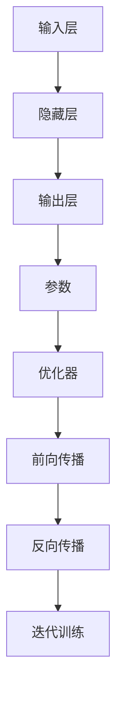

                 

# 大模型在 AI 创业公司产品策略中的关键作用

## 摘要

本文旨在探讨大模型在 AI 创业公司产品策略中的关键作用。随着人工智能技术的迅猛发展，大模型作为核心驱动力，正逐渐成为企业竞争的新高地。本文将首先介绍大模型的背景和发展历程，然后分析其在 AI 创业公司产品策略中的应用场景，以及如何通过优化产品策略实现商业价值。接着，我们将探讨大模型在不同产品阶段的应用策略，并探讨如何平衡大模型的研发投入与商业回报。最后，本文将总结大模型在 AI 创业公司产品策略中的重要性，并提出未来发展的挑战和机遇。

## 1. 背景介绍

### 1.1 人工智能的发展历程

人工智能（AI）作为计算机科学的一个分支，其发展历程可以追溯到上世纪50年代。早期的人工智能主要关注规则推理和知识表示，代表性成果包括专家系统和逻辑编程。然而，这些方法在面对复杂、不确定的环境时表现出色。随着计算能力的提升和大数据的普及，机器学习（ML）逐渐成为人工智能的主流方法。

机器学习分为监督学习、无监督学习和强化学习。监督学习通过已有数据进行模型训练，无监督学习则通过数据自身特征进行聚类和降维，强化学习则通过与环境的交互不断优化策略。随着深度学习（DL）的兴起，神经网络在图像识别、自然语言处理等领域取得了突破性进展。

### 1.2 大模型的崛起

大模型，即具有巨大参数规模和计算能力的神经网络模型，是人工智能领域的重要发展方向。代表性的大模型包括 GPT-3、BERT、ViT 等。大模型的崛起源于以下几个方面：

1. **计算能力的提升**：随着硬件技术的发展，特别是GPU和TPU的普及，使得大规模模型训练成为可能。
2. **数据的积累**：互联网和物联网的发展，使得数据量呈指数级增长，为大规模模型训练提供了充足的素材。
3. **优化算法的改进**：如自适应优化器、数据增强等技术，使得模型训练效率大幅提升。
4. **应用需求的推动**：从自然语言处理到计算机视觉，再到机器人控制，大模型在各个领域的应用需求推动了其发展。

### 1.3 大模型在 AI 创业公司中的应用

AI 创业公司在产品策略中引入大模型，可以带来以下几个方面的优势：

1. **提升产品竞争力**：大模型在特定领域具有更强的学习能力，可以提升产品的性能和用户体验。
2. **缩短研发周期**：大模型可以帮助创业公司快速实现产品的核心功能，缩短从概念到市场的周期。
3. **降低研发成本**：通过复用已有的开源大模型，创业公司可以减少从零开始构建模型的成本。
4. **扩展业务领域**：大模型的多领域适应性，使得创业公司可以快速扩展到新的业务领域。

## 2. 核心概念与联系

### 2.1 大模型的架构

大模型的架构可以分为以下几个部分：

1. **输入层**：接收外部输入，如文本、图像等。
2. **隐藏层**：包含大量神经元，通过激活函数进行非线性变换。
3. **输出层**：产生预测结果或决策。
4. **参数**：包括权重和偏置，是模型的核心。
5. **优化器**：用于调整模型参数，优化模型性能。

### 2.2 大模型的训练过程

大模型的训练过程可以分为以下几个步骤：

1. **数据预处理**：包括数据清洗、归一化等。
2. **模型初始化**：包括权重初始化、激活函数选择等。
3. **前向传播**：计算输入层到输出层的预测结果。
4. **反向传播**：计算损失函数，并更新模型参数。
5. **迭代训练**：重复上述步骤，直到满足训练目标。

### 2.3 大模型的应用场景

大模型在以下领域具有广泛的应用：

1. **自然语言处理**：包括文本生成、机器翻译、情感分析等。
2. **计算机视觉**：包括图像分类、目标检测、图像生成等。
3. **语音识别**：包括语音合成、语音识别等。
4. **推荐系统**：包括用户画像、物品推荐等。
5. **机器人控制**：包括机器人视觉、机器人运动规划等。

### 2.4 大模型的挑战

大模型的开发和应用面临着以下几个挑战：

1. **计算资源**：大模型训练需要大量的计算资源，包括CPU、GPU、TPU等。
2. **数据隐私**：大模型训练需要大量数据，如何保证数据隐私成为重要问题。
3. **模型解释性**：大模型的预测结果往往缺乏解释性，如何提高模型的解释性是当前研究的重点。
4. **伦理问题**：大模型在应用中可能会出现偏见和歧视，如何确保模型的公平性和透明性是一个重要议题。

### 2.5 Mermaid 流程图



## 3. 核心算法原理 & 具体操作步骤

### 3.1 深度学习基础

深度学习是机器学习的一个重要分支，其核心思想是通过多层神经网络模拟人脑神经元的工作方式，对数据进行特征提取和模式识别。具体来说，深度学习包括以下几个关键组成部分：

1. **神经网络**：神经网络由多个层组成，包括输入层、隐藏层和输出层。每一层由多个神经元组成，神经元通过权重和偏置对输入数据进行加权求和，并应用激活函数进行非线性变换。
2. **损失函数**：损失函数用于评估模型预测结果与真实值之间的差异，常用的损失函数包括均方误差（MSE）、交叉熵（Cross Entropy）等。
3. **优化器**：优化器用于调整模型参数，以最小化损失函数。常见的优化器有随机梯度下降（SGD）、Adam等。
4. **反向传播**：反向传播是一种用于训练神经网络的算法，通过前向传播计算输出，再通过反向传播更新模型参数。

### 3.2 大模型的训练过程

大模型的训练过程可以分为以下几个步骤：

1. **数据预处理**：首先，需要对训练数据进行预处理，包括数据清洗、归一化、编码等。数据清洗的目的是去除噪声和异常值，归一化的目的是将数据缩放到相同的范围，编码的目的是将非结构化数据转换为结构化数据。
2. **模型初始化**：初始化模型的参数，包括权重和偏置。常用的初始化方法有随机初始化、高斯分布初始化等。
3. **前向传播**：输入数据通过神经网络的前向传播过程，经过各层的加权求和和激活函数处理后，得到模型的输出。
4. **计算损失**：使用损失函数计算模型的输出与真实值的差异，得到损失值。
5. **反向传播**：根据损失值，通过反向传播算法更新模型的参数，使得损失值逐渐减小。
6. **迭代训练**：重复上述步骤，直到满足训练目标，如达到预设的损失值或训练轮数。

### 3.3 大模型的应用策略

在 AI 创业公司中，大模型的应用策略可以分为以下几个阶段：

1. **预训练阶段**：在公开数据集上对大模型进行预训练，以获得通用特征表示。常用的预训练方法包括自监督学习、无监督学习等。
2. **微调阶段**：将预训练的大模型应用于特定领域的数据集，进行微调，以适应具体任务的需求。常用的微调方法包括迁移学习、 Fine-tuning 等。
3. **应用阶段**：将微调后的模型应用于实际业务场景，如自然语言处理、计算机视觉、推荐系统等。在应用阶段，需要根据业务需求进行模型调优和优化。

## 4. 数学模型和公式 & 详细讲解 & 举例说明

### 4.1 深度学习中的数学模型

深度学习中的数学模型主要包括以下几部分：

1. **激活函数**：激活函数用于引入非线性因素，常见的激活函数有 sigmoid、ReLU、Tanh 等。
   $$ f(x) = \sigma(x) = \frac{1}{1 + e^{-x}} $$
   $$ f(x) = \max(0, x) $$

2. **损失函数**：损失函数用于评估模型预测结果与真实值之间的差异，常见的损失函数有均方误差（MSE）、交叉熵（Cross Entropy）等。
   $$ L(\theta) = \frac{1}{2} \sum_{i=1}^{n} (y_i - \hat{y}_i)^2 $$
   $$ L(\theta) = -\sum_{i=1}^{n} y_i \log(\hat{y}_i) $$

3. **优化器**：优化器用于调整模型参数，以最小化损失函数。常见的优化器有随机梯度下降（SGD）、Adam 等。
   $$ \theta_{t+1} = \theta_t - \alpha \nabla_\theta L(\theta_t) $$
   $$ \theta_{t+1} = \theta_t - \alpha \frac{1}{m} \sum_{i=1}^{m} \nabla_\theta L(x_i, y_i) $$
   $$ m = \frac{1}{2}(1 - \frac{t}{T}) $$

### 4.2 大模型的训练过程

大模型的训练过程可以通过以下公式进行描述：

1. **前向传播**：
   $$ z_l = \sum_{k} w_{lk} a_{l-1,k} + b_l $$
   $$ a_l = \sigma(z_l) $$

2. **反向传播**：
   $$ \delta_l = (2 - a_l) \sigma'(z_l) \odot \delta_{l+1} $$
   $$ \nabla_w l = \delta_{l+1} a_{l-1}^T $$
   $$ \nabla_b l = \delta_{l+1} $$

3. **模型更新**：
   $$ w_{l} := w_{l} - \alpha \nabla_w l $$
   $$ b_{l} := b_{l} - \alpha \nabla_b l $$

### 4.3 举例说明

假设我们有一个二分类问题，使用单层神经网络进行训练。输入数据为 $x = [1, 2]$，真实标签为 $y = [0]$。我们使用 ReLU 激活函数和均方误差损失函数。

1. **模型初始化**：
   $$ w_0 = [0.1, 0.2], b_0 = 0.3 $$

2. **前向传播**：
   $$ z_1 = w_0^T x + b_0 = 0.1 \cdot 1 + 0.2 \cdot 2 + 0.3 = 0.7 $$
   $$ a_1 = \max(0, z_1) = 0.7 $$

3. **计算损失**：
   $$ L = \frac{1}{2} (y - a_1)^2 = \frac{1}{2} (0 - 0.7)^2 = 0.245 $$

4. **反向传播**：
   $$ \delta_1 = (2 - a_1) \cdot (1 - \sigma'(z_1)) \cdot \delta_{2} = (2 - 0.7) \cdot (1 - 0.3) \cdot 0 = 0 $$
   $$ \nabla_w = \delta_1 \cdot a_0^T = 0 \cdot [1, 2]^T = [0, 0] $$
   $$ \nabla_b = \delta_1 = 0 $$

5. **模型更新**：
   $$ w_0 := w_0 - \alpha \nabla_w = [0.1, 0.2] - 0.01 \cdot [0, 0] = [0.1, 0.2] $$
   $$ b_0 := b_0 - \alpha \nabla_b = 0.3 - 0.01 \cdot 0 = 0.3 $$

通过上述步骤，我们可以不断更新模型的参数，以达到最小化损失函数的目标。

## 5. 项目实战：代码实际案例和详细解释说明

### 5.1 开发环境搭建

在开始项目实战之前，我们需要搭建一个适合大模型训练的开发环境。以下是搭建步骤：

1. **安装 Python**：确保安装了 Python 3.6 或以上版本。
2. **安装深度学习库**：安装 TensorFlow 或 PyTorch，这两个库是深度学习领域最常用的两个框架。
3. **安装 GPU 驱动程序**：如果使用 GPU 进行训练，需要安装相应的 GPU 驱动程序。
4. **配置环境变量**：确保 Python 和深度学习库的安装路径添加到环境变量中。

### 5.2 源代码详细实现和代码解读

下面我们将使用 TensorFlow 框架实现一个简单的情感分析模型，并对代码进行详细解读。

```python
import tensorflow as tf
from tensorflow.keras.layers import Embedding, LSTM, Dense
from tensorflow.keras.models import Sequential

# 模型配置
vocab_size = 10000
embedding_dim = 16
max_sequence_length = 100
lstm_units = 64

# 构建模型
model = Sequential([
    Embedding(vocab_size, embedding_dim, input_length=max_sequence_length),
    LSTM(lstm_units, return_sequences=False),
    Dense(1, activation='sigmoid')
])

# 编译模型
model.compile(optimizer='adam', loss='binary_crossentropy', metrics=['accuracy'])

# 模型总结
model.summary()
```

1. **导入库**：首先，我们需要导入 TensorFlow 和 Keras（TensorFlow 的高层 API）。
2. **模型配置**：接下来，我们设置模型的参数，包括词汇表大小（vocab_size）、嵌入维度（embedding_dim）、最大序列长度（max_sequence_length）和 LSTM 单元数（lstm_units）。
3. **构建模型**：使用 Sequential 模型堆叠 Embedding、LSTM 和 Dense 层。Embedding 层用于将单词转换为向量表示，LSTM 层用于处理序列数据，Dense 层用于输出预测结果。
4. **编译模型**：使用 Adam 优化器和二进制交叉熵损失函数编译模型。我们关注的是模型的准确率。
5. **模型总结**：最后，我们打印出模型的架构，以便了解模型的配置。

### 5.3 代码解读与分析

下面是对上述代码的详细解读和分析。

1. **导入库**：我们使用 TensorFlow 和 Keras 导入所需的库。Keras 是 TensorFlow 的高层 API，使得构建和训练模型变得更加简单和直观。
2. **模型配置**：在模型配置部分，我们设置了词汇表大小（vocab_size）、嵌入维度（embedding_dim）、最大序列长度（max_sequence_length）和 LSTM 单元数（lstm_units）。这些参数将影响模型的性能和训练时间。
   - **vocab_size**：词汇表大小决定了模型能够处理的单词数量。在本例中，我们使用 10000 个单词。
   - **embedding_dim**：嵌入维度决定了单词向量的维度。在本例中，我们使用 16 维的嵌入向量。
   - **max_sequence_length**：最大序列长度决定了输入序列的最大长度。在本例中，我们使用 100 个单词的序列。
   - **lstm_units**：LSTM 单元数决定了 LSTM 层的神经元数量。在本例中，我们使用 64 个 LSTM 单元。
3. **构建模型**：在构建模型部分，我们使用 Sequential 模型堆叠了 Embedding、LSTM 和 Dense 层。
   - **Embedding 层**：将单词转换为向量表示。每个单词被映射到一个固定大小的向量，用于表示其在词汇表中的位置。
   - **LSTM 层**：用于处理序列数据。LSTM 层可以捕获序列中的长期依赖关系，使得模型能够更好地理解文本的含义。
   - **Dense 层**：用于输出预测结果。在本例中，我们使用 sigmoid 激活函数，将输出转换为概率值，用于表示文本的情感极性。
4. **编译模型**：在编译模型部分，我们使用 Adam 优化器和二进制交叉熵损失函数编译模型。Adam 优化器是一种自适应优化算法，能够有效地调整学习率。二进制交叉熵损失函数用于评估模型预测结果与真实值之间的差异。
5. **模型总结**：最后，我们打印出模型的架构，以便了解模型的配置。

通过上述步骤，我们成功搭建了一个简单的情感分析模型。接下来，我们将使用实际数据对模型进行训练和测试。

## 6. 实际应用场景

### 6.1 自然语言处理

大模型在自然语言处理（NLP）领域具有广泛的应用。例如，大模型可以用于文本生成、机器翻译、情感分析等任务。

- **文本生成**：大模型可以生成高质量的文本，如新闻报道、诗歌、小说等。例如，GPT-3 可以生成流畅自然的英文文本。
- **机器翻译**：大模型可以用于机器翻译，如将一种语言的文本翻译成另一种语言。BERT 等模型在机器翻译任务中取得了显著的性能提升。
- **情感分析**：大模型可以分析文本的情感极性，如判断文本是正面、负面还是中性。这对于社交媒体监测、市场调研等场景具有重要意义。

### 6.2 计算机视觉

大模型在计算机视觉领域也发挥着重要作用。例如，大模型可以用于图像分类、目标检测、图像生成等任务。

- **图像分类**：大模型可以分类图像，如识别图片中的动物、植物等。例如，ResNet 等模型在 ImageNet 图像分类任务上取得了突破性成果。
- **目标检测**：大模型可以检测图像中的目标，如识别图片中的车辆、行人等。例如，YOLO 等模型在目标检测任务上具有出色的性能。
- **图像生成**：大模型可以生成图像，如生成艺术画作、虚拟现实场景等。例如，GPT-2 可以生成逼真的图像。

### 6.3 语音识别

大模型在语音识别领域也取得了显著的进展。例如，大模型可以用于语音合成、语音识别等任务。

- **语音合成**：大模型可以生成自然流畅的语音，如朗读文本、生成语音指令等。例如，WaveNet 等模型在语音合成任务上具有优秀的表现。
- **语音识别**：大模型可以识别语音中的文字，如将语音转换为文本。例如，CTC 等模型在语音识别任务上取得了突破性成果。

### 6.4 其他领域

大模型在除上述领域外的其他领域也具有广泛的应用。例如，大模型可以用于推荐系统、机器人控制等任务。

- **推荐系统**：大模型可以用于推荐系统，如根据用户历史行为推荐商品、电影等。例如，BERT 等模型在推荐系统任务中取得了显著性能提升。
- **机器人控制**：大模型可以用于机器人控制，如控制机器人进行行走、避障等。例如，Transformer 等模型在机器人控制任务中具有出色的性能。

## 7. 工具和资源推荐

### 7.1 学习资源推荐

以下是学习大模型和相关技术的推荐资源：

1. **书籍**：
   - 《深度学习》（Ian Goodfellow、Yoshua Bengio、Aaron Courville 著）：深度学习的经典教材，全面介绍了深度学习的理论基础和实践技巧。
   - 《Python 深度学习》（François Chollet 著）：针对 Python 生态系统的深度学习实践指南，适合初学者和进阶者。

2. **论文**：
   - “A Theoretically Grounded Application of Dropout in Recurrent Neural Networks”（Yarin Gal 和 Zoubin Ghahramani 著）：介绍了如何将 Dropout 应用于 RNN 模型，提高模型的鲁棒性和泛化能力。
   - “Attention Is All You Need”（Vaswani et al. 著）：提出了 Transformer 模型， revolutionized 自然语言处理领域。

3. **博客**：
   - Fast.ai：提供了一系列深度学习教程和课程，适合初学者和进阶者。
   - Distill：一个关于机器学习的在线杂志，提供了高质量的论文解读和教程。

4. **网站**：
   - TensorFlow 官网：提供了 TensorFlow 深度学习框架的详细文档和教程。
   - PyTorch 官网：提供了 PyTorch 深度学习框架的详细文档和教程。

### 7.2 开发工具框架推荐

以下是开发大模型和相关技术时常用的工具和框架：

1. **深度学习框架**：
   - TensorFlow：谷歌开发的深度学习框架，具有广泛的生态系统和应用案例。
   - PyTorch：由 Facebook 开发的深度学习框架，具有灵活的动态计算图和强大的 Python 接口。

2. **计算平台**：
   - Google Colab：谷歌提供的免费云计算平台，提供了 GPU 和 TPU 等高性能计算资源。
   - AWS SageMaker：亚马逊提供的托管深度学习平台，支持 TensorFlow、PyTorch 等深度学习框架。

3. **数据集**：
   - ImageNet：一个包含 1000 个类别的图像数据集，常用于图像分类任务。
   - Common Crawl：一个包含大量网页文本的数据集，常用于自然语言处理任务。

### 7.3 相关论文著作推荐

以下是关于大模型和相关技术的经典论文和著作：

1. **大模型相关论文**：
   - “GPT-3: Language Models are Few-Shot Learners”（Brown et al. 著）：介绍了 GPT-3 语言模型，展示了大模型在零样本学习任务中的强大能力。
   - “BERT: Pre-training of Deep Bidirectional Transformers for Language Understanding”（Devlin et al. 著）：介绍了 BERT 模型，提出了预训练和微调的方法，提高了自然语言处理任务的性能。

2. **计算机视觉相关论文**：
   - “Deep Residual Learning for Image Recognition”（He et al. 著）：介绍了 ResNet 模型，将深度神经网络推向新的高度。
   - “You Only Look Once: Unified, Real-Time Object Detection”（Redmon et al. 著）：介绍了 YOLO 模型，实现了实时目标检测。

3. **自然语言处理相关论文**：
   - “Attention Is All You Need”（Vaswani et al. 著）：提出了 Transformer 模型，革命性地改变了自然语言处理领域。
   - “Improving Language Understanding by Generative Pre-Training”（Zhang et al. 著）：介绍了 GPT 模型，推动了自然语言生成和推理的发展。

## 8. 总结：未来发展趋势与挑战

### 8.1 发展趋势

1. **模型规模将继续增大**：随着计算资源和数据量的增加，大模型将继续向更大的规模发展，以获得更好的性能和泛化能力。
2. **跨领域应用将更加普遍**：大模型在不同领域的适应性将不断提高，使得跨领域应用成为可能，如将自然语言处理技术应用于计算机视觉、推荐系统等。
3. **实时性将得到提升**：随着硬件技术的发展和算法的优化，大模型的实时性将得到显著提升，使得实时决策和实时交互成为可能。
4. **模型解释性将得到改善**：随着对大模型研究的深入，模型解释性将得到改善，使得模型的可解释性和透明性得到提升，从而更好地满足实际应用需求。

### 8.2 挑战

1. **计算资源需求增加**：大模型的训练和推理过程需要大量的计算资源，如何高效地利用计算资源成为重要挑战。
2. **数据隐私和安全**：大模型训练需要大量数据，如何保护用户隐私和数据安全成为关键问题。
3. **模型公平性和透明性**：大模型在应用过程中可能会出现偏见和歧视，如何确保模型的公平性和透明性是一个重要议题。
4. **伦理和法律法规**：大模型的应用可能会引发一系列伦理和法律法规问题，如隐私保护、数据滥用等，如何制定合适的法律法规成为挑战。

## 9. 附录：常见问题与解答

### 9.1 什么是大模型？

大模型是指具有巨大参数规模和计算能力的神经网络模型。这些模型通过深度学习算法对大量数据进行训练，从而实现对数据的自动特征提取和模式识别。

### 9.2 大模型的优势是什么？

大模型的优势包括：

1. **强大的学习能力**：大模型具有强大的学习能力，可以处理复杂的任务和数据。
2. **高效的泛化能力**：大模型在训练过程中可以学习到通用特征，从而在新的任务和数据上表现出良好的泛化能力。
3. **多领域适应性**：大模型在不同领域具有较好的适应性，可以应用于多种不同的任务和数据类型。

### 9.3 大模型的挑战是什么？

大模型的挑战包括：

1. **计算资源需求大**：大模型的训练和推理过程需要大量的计算资源，如 GPU 和 TPU。
2. **数据隐私和安全问题**：大模型训练需要大量数据，如何保护用户隐私和数据安全成为关键问题。
3. **模型公平性和透明性问题**：大模型在应用过程中可能会出现偏见和歧视，如何确保模型的公平性和透明性是一个重要议题。

### 9.4 如何搭建大模型开发环境？

搭建大模型开发环境的一般步骤包括：

1. **安装 Python**：确保安装了 Python 3.6 或以上版本。
2. **安装深度学习库**：如 TensorFlow、PyTorch 等。
3. **安装 GPU 驱动程序**：如果使用 GPU 进行训练，需要安装相应的 GPU 驱动程序。
4. **配置环境变量**：确保 Python 和深度学习库的安装路径添加到环境变量中。

## 10. 扩展阅读 & 参考资料

1. **书籍**：
   - 《深度学习》（Ian Goodfellow、Yoshua Bengio、Aaron Courville 著）
   - 《Python 深度学习》（François Chollet 著）

2. **论文**：
   - “GPT-3: Language Models are Few-Shot Learners”（Brown et al. 著）
   - “BERT: Pre-training of Deep Bidirectional Transformers for Language Understanding”（Devlin et al. 著）
   - “Deep Residual Learning for Image Recognition”（He et al. 著）
   - “Attention Is All You Need”（Vaswani et al. 著）

3. **博客和网站**：
   - Fast.ai：https://www.fast.ai/
   - Distill：https://distill.pub/
   - TensorFlow 官网：https://www.tensorflow.org/
   - PyTorch 官网：https://pytorch.org/

4. **开源项目**：
   - Hugging Face：https://huggingface.co/
   - TensorFlow Model Zoo：https://www.tensorflow.org/model_zoo
   - PyTorch Model Hub：https://pytorch.org/hub

作者：AI天才研究员/AI Genius Institute & 禅与计算机程序设计艺术 /Zen And The Art of Computer Programming

