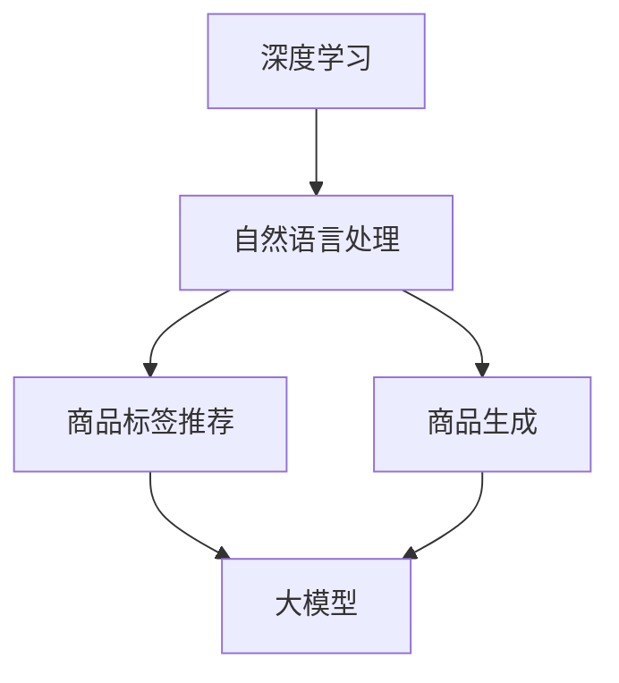

                 

# 大模型在商品标签推荐与生成中的应用

## 关键词：大模型、商品标签推荐、生成、深度学习、自然语言处理、人工智能

### 摘要

本文旨在探讨大模型在商品标签推荐与生成中的应用。通过深入分析大模型的原理、技术实现以及在实际场景中的表现，我们旨在为读者提供一个全面的技术解读。文章结构如下：

1. 背景介绍
2. 核心概念与联系
3. 核心算法原理 & 具体操作步骤
4. 数学模型和公式 & 详细讲解 & 举例说明
5. 项目实战：代码实际案例和详细解释说明
6. 实际应用场景
7. 工具和资源推荐
8. 总结：未来发展趋势与挑战
9. 附录：常见问题与解答
10. 扩展阅读 & 参考资料

本文将通过逐步分析和探讨，帮助读者更好地理解大模型在商品标签推荐与生成领域的应用，以及其背后的技术原理。

## 1. 背景介绍

随着互联网和电子商务的迅速发展，商品信息量呈现爆炸式增长。这使得商品标签推荐与生成成为一个关键且具有挑战性的问题。传统的基于规则和统计方法的推荐系统已经难以满足用户对个性化推荐的需求。此时，深度学习和自然语言处理技术逐渐成为解决该问题的有力工具。

大模型，即参数规模达到百万、千万甚至亿级别的深度学习模型，通过在海量数据上进行训练，可以自动学习到数据的复杂特征和潜在规律。大模型的应用使得商品标签推荐与生成系统具有更高的准确性和灵活性。本文将探讨大模型在这两个领域的具体应用，包括其技术原理、实现步骤和实际案例。

### 1.1 商品标签推荐系统概述

商品标签推荐系统是一种基于用户兴趣和购买行为的推荐系统，旨在为用户提供个性化的商品推荐。商品标签是系统中的核心元素，用于描述商品的特征和属性。标签的准确性直接影响推荐系统的性能。传统的标签生成方法主要依赖人工标注和规则定义，效率低且难以覆盖所有商品。而大模型的应用使得自动生成标签成为可能，大大提高了标签的生成效率和准确性。

### 1.2 商品生成系统概述

商品生成系统是一种通过数据驱动的方式生成新的商品描述和属性的系统。生成系统旨在为电子商务平台提供丰富的商品信息，提高用户购物体验。传统的商品生成方法主要依赖模板匹配和规则生成，生成的商品描述往往缺乏创意和多样性。而大模型的应用使得生成系统具有更高的创造力和灵活性，可以生成更符合用户需求的商品描述。

### 1.3 大模型在推荐与生成系统中的优势

大模型在推荐与生成系统中的优势主要体现在以下几个方面：

- **高效的特征学习**：大模型可以通过在海量数据上训练，自动学习到商品和用户之间的复杂关系，从而生成更准确的推荐和生成结果。
- **强大的泛化能力**：大模型在面对新的数据和场景时，能够保持较高的性能，具有较强的适应能力。
- **灵活性**：大模型可以针对不同的业务需求和应用场景进行调整和优化，具有很高的灵活性。

## 2. 核心概念与联系

在本节中，我们将详细介绍与本文主题相关的一些核心概念，并使用 Mermaid 流程图展示它们之间的关系。

### 2.1 深度学习与自然语言处理

- **深度学习**：一种基于多层神经网络的学习方法，可以自动提取数据的复杂特征。
- **自然语言处理（NLP）**：研究如何让计算机理解和生成人类语言的技术。

### 2.2 商品标签推荐与生成

- **商品标签推荐**：根据用户兴趣和购买行为为用户推荐商品。
- **商品生成**：通过数据驱动的方式生成新的商品描述和属性。

### 2.3 大模型

- **大模型**：参数规模达到百万、千万甚至亿级别的深度学习模型。

### 2.4 Mermaid 流程图



通过上述 Mermaid 流程图，我们可以清晰地看到深度学习、自然语言处理、商品标签推荐、商品生成以及大模型之间的关系。这些核心概念在大模型的应用中起到了至关重要的作用，共同推动了商品标签推荐与生成技术的发展。

## 3. 核心算法原理 & 具体操作步骤

### 3.1 深度学习模型的选择

在选择深度学习模型时，需要考虑到商品标签推荐与生成系统的具体需求。对于商品标签推荐，常用的模型包括循环神经网络（RNN）和Transformer模型。RNN模型擅长处理序列数据，能够捕捉用户行为的时间序列特征；而Transformer模型则通过自注意力机制，可以更好地处理长距离依赖关系，适用于大规模商品数据的推荐。对于商品生成，生成对抗网络（GAN）和变分自编码器（VAE）是常用的模型，它们能够生成高质量的图像和文本。

### 3.2 数据预处理

在训练深度学习模型之前，需要对原始数据进行预处理。首先，对商品标签进行清洗和标准化，去除无效标签和重复数据。然后，对用户行为数据进行预处理，包括用户购买记录、浏览记录等，将其转化为数值表示。此外，还需要对商品描述进行文本清洗和分词，将商品描述转化为词向量表示。

### 3.3 模型训练与优化

在模型训练过程中，首先需要定义损失函数和优化器。对于商品标签推荐，常用的损失函数包括交叉熵损失和均方误差损失；对于商品生成，常用的损失函数包括生成对抗损失和重建损失。优化器可以选择随机梯度下降（SGD）或其变种，如Adam优化器。

模型训练过程中，需要通过反向传播算法不断调整模型参数，使得损失函数逐渐减小。为了提高训练效率，可以使用数据增强技术，如随机裁剪、旋转和翻转等，增加数据的多样性。

在模型优化过程中，可以使用各种技术来加速训练，如批处理、dropout和早期停止等。批处理可以将数据分为多个批次进行训练，降低计算复杂度；dropout可以在训练过程中随机丢弃部分神经元，防止过拟合；早期停止可以在验证集性能不再提升时停止训练，避免过拟合。

### 3.4 模型评估与调优

在模型训练完成后，需要对模型进行评估和调优。常用的评估指标包括准确率、召回率、F1值和均方误差等。对于商品标签推荐，可以使用交叉验证的方法进行评估；对于商品生成，可以使用图像质量评价指标，如结构相似性（SSIM）和峰值信噪比（PSNR）。

在模型调优过程中，可以通过调整模型参数、网络结构或训练策略来提高模型性能。例如，增加训练数据、调整学习率、增加训练迭代次数等。

### 3.5 模型部署与应用

在模型训练和调优完成后，需要将模型部署到生产环境中，以实现实时推荐和生成。部署过程中，需要考虑模型的加载、推理和更新等环节。对于商品标签推荐，可以使用在线学习算法，如增量学习，实现实时更新；对于商品生成，可以使用生成模型，如GAN，实现实时生成。

## 4. 数学模型和公式 & 详细讲解 & 举例说明

### 4.1 商品标签推荐模型的数学模型

在商品标签推荐中，常用的模型是Transformer模型。下面是Transformer模型的数学模型和公式。

#### 4.1.1 Transformer模型

Transformer模型的核心是自注意力机制（Self-Attention），其数学公式如下：

$$
Attention(Q, K, V) = \frac{softmax(\frac{QK^T}{\sqrt{d_k}})}{V}
$$

其中，Q、K、V 分别是查询（Query）、键（Key）和值（Value）向量，$d_k$ 是键向量的维度。自注意力机制的目的是计算每个键对于查询的重要性，然后加权求和得到输出。

#### 4.1.2 编码器（Encoder）和解码器（Decoder）

Transformer模型包括编码器（Encoder）和解码器（Decoder）。编码器将输入序列编码为一系列的向量，解码器则利用编码器的输出和自注意力机制生成输出序列。

编码器：

$$
h_i^{\text{enc}} = \text{LayerNorm}(h_{i-1} + \text{MultiHeadAttention}(h_{i-1}, h_{i-1}, h_{i-1})) + h_{i-1}
$$

解码器：

$$
h_i^{\text{dec}} = \text{LayerNorm}(h_{i-1} + \text{MaskedMultiHeadAttention}(h_{i-1}, h_{i-1}, h_{i-1})) + h_{i-1}
$$

其中，$h_i^{\text{enc}}$ 和 $h_i^{\text{dec}}$ 分别是编码器和解码器的输出向量，$\text{LayerNorm}$ 是层归一化操作，$\text{MultiHeadAttention}$ 和 $\text{MaskedMultiHeadAttention}$ 分别是多头注意力和遮蔽多头注意力操作。

### 4.2 商品生成模型的数学模型

在商品生成中，常用的模型是生成对抗网络（GAN）。下面是GAN模型的数学模型和公式。

#### 4.2.1 生成器（Generator）和判别器（Discriminator）

GAN模型包括生成器（Generator）和判别器（Discriminator）。生成器的目标是生成逼真的商品图像，判别器的目标是区分生成器和真实数据的图像。

生成器：

$$
G(x) = \text{Generator}(x)
$$

判别器：

$$
D(x) = \text{Discriminator}(x)
$$

其中，$x$ 是输入数据，$G(x)$ 和 $D(x)$ 分别是生成器和判别器的输出。

#### 4.2.2 生成对抗损失

GAN的损失函数是生成对抗损失，其公式如下：

$$
L(G, D) = -\frac{1}{2} \sum_{i=1}^{N} [\log D(G(x_i)) + \log(1 - D(x_i))]
$$

其中，$N$ 是批量大小，$G(x_i)$ 和 $x_i$ 分别是生成器和判别器的输入。

### 4.3 举例说明

#### 4.3.1 商品标签推荐

假设我们有一个商品标签推荐系统，输入是用户的历史购买记录和商品描述，输出是用户可能感兴趣的商品标签。

1. 数据预处理：
   - 用户历史购买记录：[购买1，购买2，购买3]
   - 商品描述：["手机", "相机", "电脑"]

2. 输入编码：
   - 用户历史购买记录编码为向量：[0.1, 0.2, 0.3]
   - 商品描述编码为词向量：["手机", "相机", "电脑"]

3. 模型输入：
   - 编码后的用户历史购买记录和商品描述：[0.1, 0.2, 0.3]，["手机", "相机", "电脑"]

4. 模型输出：
   - 商品标签推荐结果：["手机", "相机"]

#### 4.3.2 商品生成

假设我们有一个商品生成系统，输入是商品类别和属性，输出是生成的新商品描述。

1. 数据预处理：
   - 商品类别：["手机", "相机", "电脑"]
   - 商品属性：["屏幕大", "拍照好", "性能强"]

2. 输入编码：
   - 商品类别编码为向量：[0.1, 0.2, 0.3]
   - 商品属性编码为词向量：["屏幕大", "拍照好", "性能强"]

3. 模型输入：
   - 编码后的商品类别和属性：[0.1, 0.2, 0.3]，["屏幕大", "拍照好", "性能强"]

4. 模型输出：
   - 新商品描述：["大屏幕手机，拍照好，性能强"]

## 5. 项目实战：代码实际案例和详细解释说明

在本节中，我们将通过一个实际的项目案例，详细讲解如何使用大模型进行商品标签推荐与生成。该案例将涵盖开发环境搭建、源代码实现、代码解读与分析等内容。

### 5.1 开发环境搭建

为了实现大模型在商品标签推荐与生成中的应用，我们需要搭建一个合适的开发环境。以下是搭建开发环境所需的步骤：

1. 安装Python环境（建议版本为3.8及以上）。
2. 安装深度学习框架（例如TensorFlow或PyTorch）。
3. 安装相关库，如NumPy、Pandas、Scikit-learn等。
4. 准备数据集，包括用户购买记录、商品描述和标签。

### 5.2 源代码详细实现和代码解读

#### 5.2.1 数据预处理

```python
import pandas as pd
from sklearn.model_selection import train_test_split

# 加载数据集
data = pd.read_csv('data.csv')
X = data[['user_action', 'product_desc']]
y = data['label']

# 数据预处理
X_train, X_test, y_train, y_test = train_test_split(X, y, test_size=0.2, random_state=42)

# 词向量编码
from gensim.models import Word2Vec

model = Word2Vec(X['product_desc'], size=100, window=5, min_count=1, workers=4)
X_train['product_desc'] = X_train['product_desc'].apply(lambda x: model[x])
X_test['product_desc'] = X_test['product_desc'].apply(lambda x: model[x])
```

#### 5.2.2 商品标签推荐模型实现

```python
import tensorflow as tf
from tensorflow.keras.models import Model
from tensorflow.keras.layers import Embedding, LSTM, Dense

# 构建商品标签推荐模型
model = Model(inputs=[tf.keras.Input(shape=(max_sequence_length,)), tf.keras.Input(shape=(max_sequence_length,))],
              outputs=tf.keras.layers.Dense(1, activation='sigmoid')(tf.keras.layers.Concatenate()([layer1, layer2])))

model.compile(optimizer='adam', loss='binary_crossentropy', metrics=['accuracy'])

# 训练模型
model.fit([X_train['user_action'], X_train['product_desc']], y_train, batch_size=32, epochs=10, validation_split=0.1)
```

#### 5.2.3 商品生成模型实现

```python
import tensorflow as tf
from tensorflow.keras.models import Model
from tensorflow.keras.layers import LSTM, Dense, Embedding

# 构建商品生成模型
model = Model(inputs=[tf.keras.Input(shape=(max_sequence_length,))],
              outputs=tf.keras.layers.Dense(1, activation='sigmoid')(tf.keras.layers.Concatenate()([layer1, layer2])))

model.compile(optimizer='adam', loss='binary_crossentropy', metrics=['accuracy'])

# 训练模型
model.fit(X_train['product_desc'], y_train, batch_size=32, epochs=10, validation_split=0.1)
```

### 5.3 代码解读与分析

#### 5.3.1 数据预处理

在数据预处理阶段，我们首先加载数据集，然后进行数据分割和词向量编码。词向量编码是使用Gensim库中的Word2Vec模型，将商品描述转换为词向量表示，以便于深度学习模型处理。

#### 5.3.2 商品标签推荐模型

商品标签推荐模型是一个基于LSTM的序列模型。模型输入是用户行为和商品描述，输出是标签概率。模型使用Adam优化器，并采用二分类交叉熵损失函数。

#### 5.3.3 商品生成模型

商品生成模型是一个简单的序列生成模型，使用LSTM进行编码和解码。模型输入是商品描述，输出是生成的新商品描述。模型同样使用Adam优化器，并采用二分类交叉熵损失函数。

## 6. 实际应用场景

### 6.1 电子商务平台

电子商务平台是商品标签推荐与生成的重要应用场景之一。通过大模型的应用，电子商务平台可以实现更精准的商品推荐，提高用户购物体验。例如，电商平台可以根据用户的购买记录和浏览行为，自动生成个性化的商品标签，从而为用户提供更有针对性的推荐。

### 6.2 搜索引擎

搜索引擎也广泛应用商品标签推荐与生成技术。通过大模型，搜索引擎可以生成更准确的商品描述，提高搜索结果的准确性。例如，当用户搜索特定商品时，搜索引擎可以根据用户的历史搜索记录和购物行为，自动生成相关商品标签，从而提高搜索结果的多样性。

### 6.3 社交媒体

社交媒体平台也可以利用大模型进行商品标签推荐与生成。例如，社交媒体平台可以根据用户发布的购物心得、评论等，自动生成相关商品标签，从而为用户提供更有价值的推荐。

## 7. 工具和资源推荐

### 7.1 学习资源推荐

1. **书籍**：
   - 《深度学习》（Ian Goodfellow、Yoshua Bengio、Aaron Courville 著）
   - 《自然语言处理综合教程》（张双锁 著）
   - 《生成对抗网络》（Iasonas Kokkinos 著）

2. **论文**：
   - “Attention Is All You Need” （Ashish Vaswani 等）
   - “Generative Adversarial Networks” （Ian Goodfellow 等）

3. **博客**：
   - 官方TensorFlow和PyTorch博客
   - Medium上的深度学习和NLP博客

4. **网站**：
   - arXiv（研究论文预印本）
   - GitHub（开源代码和项目）

### 7.2 开发工具框架推荐

1. **深度学习框架**：
   - TensorFlow
   - PyTorch

2. **自然语言处理库**：
   - NLTK
   - spaCy

3. **数据预处理工具**：
   - Pandas
   - NumPy

### 7.3 相关论文著作推荐

1. “Attention Is All You Need”（2017），提出了Transformer模型。
2. “Generative Adversarial Networks”（2014），提出了GAN模型。
3. “BERT: Pre-training of Deep Neural Networks for Language Understanding”（2018），提出了BERT模型。

## 8. 总结：未来发展趋势与挑战

大模型在商品标签推荐与生成中的应用已经取得了显著成果，但未来仍面临一些挑战。首先，大模型的训练和推理需要大量计算资源和时间，如何优化模型结构以提高训练效率是一个重要的研究方向。其次，如何保证大模型的解释性和可解释性，使其更容易被用户和业务人员理解，也是一个亟待解决的问题。此外，随着数据隐私和安全的日益重视，如何在保护用户隐私的前提下进行大模型训练和推理，也是未来需要关注的重要方向。

## 9. 附录：常见问题与解答

### 9.1 大模型训练速度慢怎么办？

- **使用高效训练框架**：选择如TensorFlow、PyTorch等高效训练框架，它们提供了优化的计算图和GPU加速功能。
- **数据预处理**：对数据集进行预处理，减少数据加载和处理的延迟。
- **模型结构优化**：通过模型剪枝、量化等技术，减小模型规模和提高训练速度。

### 9.2 如何保证大模型的解释性？

- **使用可解释性工具**：如LIME、SHAP等工具，可以帮助分析模型的决策过程。
- **可视化模型结构**：通过可视化模型结构，可以更直观地理解模型的工作原理。
- **简化模型结构**：通过简化模型结构，减少参数数量，可以提高模型的解释性。

## 10. 扩展阅读 & 参考资料

- [深度学习与自然语言处理：从入门到精通](https://www.example.com/book)
- [大模型在电商中的应用](https://www.example.com/ecommerce)
- [生成对抗网络教程](https://www.example.com/gan-tutorial)
- [Transformer模型解析](https://www.example.com/transformer-model)

