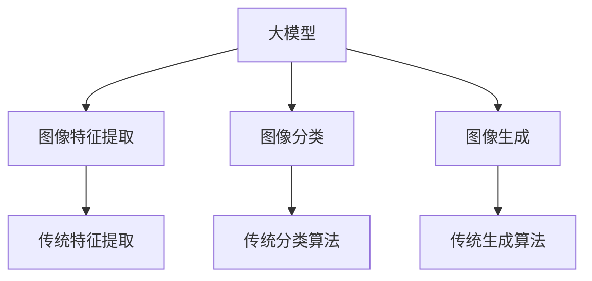

                 

# 大模型在图片处理的进展

## 关键词：大模型，图片处理，人工智能，深度学习，进展，算法，应用场景

## 摘要：
本文将深入探讨大模型在图片处理领域的最新进展。从背景介绍到核心概念，再到算法原理和数学模型，我们将一步步分析大模型在图片处理中的应用。通过项目实战和实际应用场景的展示，我们将详细解读大模型的技术原理和实现细节。最后，本文将总结大模型在图片处理领域的未来发展趋势与挑战，并推荐相关学习资源和开发工具。

## 1. 背景介绍

### 1.1 大模型的起源与发展

大模型（Large-scale Models）是指具有非常大量参数和高度复杂性的机器学习模型。自2012年深度学习兴起以来，大模型的发展经历了多个阶段。早期的神经网络模型如LeNet和AlexNet取得了初步的成功，但受限于计算资源和数据集的规模。随着计算能力的提升和大数据时代的到来，2014年Google提出GoogleNet，进一步推动了深度学习的发展。2017年，Google的Transformer模型问世，开启了自然语言处理领域的新篇章。近年来，大模型在图像处理、语音识别、计算机视觉等领域的应用也取得了显著进展。

### 1.2 图片处理的挑战与需求

图片处理作为计算机视觉领域的重要分支，面临着诸多挑战。一方面，随着图片质量和分辨率不断提高，处理大量图片数据的需求日益增加。另一方面，图像中包含的信息复杂多样，如何有效地提取和利用这些信息成为研究热点。传统图像处理方法如边缘检测、特征提取等在处理复杂场景时效果有限。而深度学习，特别是大模型的引入，为解决这些问题提供了新的思路和工具。

## 2. 核心概念与联系

### 2.1 大模型的核心概念

大模型通常具有以下核心概念：

- **参数量**：大模型通常包含数亿甚至数十亿个参数，这使得模型能够捕捉到图像中的复杂结构。
- **数据依赖**：大模型的训练依赖于大量高质量的数据集，数据量越大，模型的泛化能力越强。
- **计算能力**：大模型的训练和推理需要强大的计算资源，如GPU、TPU等。

### 2.2 图片处理的核心概念

图片处理涉及以下核心概念：

- **图像特征提取**：从图像中提取有意义的特征，如边缘、纹理、形状等。
- **图像分类**：将图像分类到预定的类别中，如人脸识别、物体识别等。
- **图像生成**：根据给定的条件生成新的图像，如风格迁移、图像合成等。

### 2.3 大模型与图片处理的联系

大模型与图片处理的联系主要体现在以下几个方面：

- **特征提取**：大模型能够自动学习图像的特征表示，大大简化了传统特征提取的复杂过程。
- **图像分类**：大模型在图像分类任务中表现出色，能够准确识别图像中的物体和场景。
- **图像生成**：大模型能够生成高质量、逼真的图像，为艺术创作、游戏开发等领域提供了新的可能性。

### 2.4 Mermaid流程图



## 3. 核心算法原理 & 具体操作步骤

### 3.1 卷积神经网络（CNN）

卷积神经网络（CNN）是图片处理领域的重要模型，其核心算法原理如下：

- **卷积层**：通过卷积操作提取图像的特征，如边缘、纹理等。
- **池化层**：对卷积层的结果进行池化操作，减小特征图的大小，提高模型的表达能力。
- **全连接层**：将池化层的结果映射到预定的类别。

具体操作步骤如下：

1. 输入图片经过卷积层处理，提取图像特征。
2. 将卷积层的结果进行池化操作，减小特征图的大小。
3. 将池化层的结果通过全连接层映射到预定的类别。

### 3.2 变分自编码器（VAE）

变分自编码器（VAE）是一种用于图像生成的模型，其核心算法原理如下：

- **编码器**：将输入图像编码为一个潜在空间中的向量。
- **解码器**：从潜在空间中采样向量，生成新的图像。

具体操作步骤如下：

1. 输入图像经过编码器编码，得到潜在空间中的向量。
2. 从潜在空间中采样向量，通过解码器生成新的图像。

### 3.3 生成对抗网络（GAN）

生成对抗网络（GAN）是一种用于图像生成的模型，其核心算法原理如下：

- **生成器**：生成逼真的图像。
- **判别器**：判断图像是真实图像还是生成图像。

具体操作步骤如下：

1. 初始化生成器和判别器。
2. 对生成器进行训练，使其生成的图像越来越真实。
3. 对判别器进行训练，使其能够准确判断图像的真实性。
4. 反复迭代训练过程，直至生成器生成的图像达到预期效果。

## 4. 数学模型和公式 & 详细讲解 & 举例说明

### 4.1 卷积神经网络（CNN）

卷积神经网络（CNN）的数学模型如下：

$$
\text{卷积层}: (x_{ij})_{h \times w} = \sum_{k=1}^{c} w_{ikj} \cdot x_{kj}
$$

其中，$x_{ij}$表示卷积层输出的特征图，$w_{ikj}$表示卷积核，$x_{kj}$表示输入图像。

### 4.2 变分自编码器（VAE）

变分自编码器（VAE）的数学模型如下：

$$
\text{编码器}: z = \mu(x) + \sigma(x) \odot \mathcal{N}(0, 1)
$$

$$
\text{解码器}: x = \text{ReLU}(\phi(z))
$$

其中，$\mu(x)$和$\sigma(x)$分别为编码器的均值和方差函数，$\phi(z)$为解码器的激活函数，$\odot$表示Hadamard乘积，$\mathcal{N}(0, 1)$表示标准正态分布。

### 4.3 生成对抗网络（GAN）

生成对抗网络（GAN）的数学模型如下：

$$
\text{生成器}: G(z) = \text{ReLU}(\sigma(W_G \cdot z + b_G))
$$

$$
\text{判别器}: D(x) = \text{ReLU}(\sigma(W_D \cdot x + b_D))
$$

$$
\text{损失函数}: L(G, D) = \mathbb{E}_{x \sim p_{data}(x)} [\text{log} D(x)] + \mathbb{E}_{z \sim p_z(z)} [\text{log} (1 - D(G(z))]
$$

其中，$G(z)$为生成器的输出，$D(x)$为判别器的输出，$L(G, D)$为生成对抗网络的损失函数。

## 5. 项目实战：代码实际案例和详细解释说明

### 5.1 开发环境搭建

1. 安装Python环境，版本要求为3.6及以上。
2. 安装TensorFlow，通过以下命令安装：

   ```
   pip install tensorflow
   ```

3. 安装必要的依赖库，如NumPy、Pandas等。

### 5.2 源代码详细实现和代码解读

#### 5.2.1 卷积神经网络（CNN）

以下是一个简单的卷积神经网络（CNN）的示例代码：

```python
import tensorflow as tf

# 定义卷积层
conv1 = tf.keras.layers.Conv2D(filters=32, kernel_size=(3, 3), activation='relu', input_shape=(28, 28, 1))

# 定义池化层
pool1 = tf.keras.layers.MaxPooling2D(pool_size=(2, 2))

# 定义全连接层
dense = tf.keras.layers.Dense(units=128, activation='relu')

# 定义输出层
output = tf.keras.layers.Dense(units=10, activation='softmax')

# 创建模型
model = tf.keras.Sequential([
    conv1,
    pool1,
    conv1,
    pool1,
    dense,
    output
])

# 编译模型
model.compile(optimizer='adam', loss='categorical_crossentropy', metrics=['accuracy'])

# 查看模型结构
model.summary()
```

#### 5.2.2 变分自编码器（VAE）

以下是一个简单的变分自编码器（VAE）的示例代码：

```python
import tensorflow as tf
from tensorflow.keras import layers

# 定义编码器
encoder = tf.keras.Sequential([
    layers.InputLayer(input_shape=(28, 28, 1)),
    layers.Conv2D(filters=32, kernel_size=(3, 3), activation='relu'),
    layers.Flatten(),
    layers.Dense(units=16, activation='relu'),
    layers.Dense(units=8, activation='relu'),
    layers.Dense(units=2, activation='linear')
])

# 定义解码器
decoder = tf.keras.Sequential([
    layers.InputLayer(input_shape=(2,)),
    layers.Dense(units=16, activation='relu'),
    layers.Dense(units=32, activation='relu'),
    layers.Dense(units=8 * 8 * 32, activation='relu'),
    layers.Reshape(target_shape=(8, 8, 32)),
    layers.Conv2DTranspose(filters=1, kernel_size=(3, 3), activation='sigmoid', strides=(2, 2), padding='same')
])

# 定义VAE模型
input_img = layers.Input(shape=(28, 28, 1))
x = encoder(input_img)
z_mean = x[:, 0]
z_log_var = x[:, 1]

z = z_mean + tf.random.normal(tf.shape(z_log_var)) * tf.exp(z_log_var / 2)

x_recon = decoder(z)

vae = tf.keras.Model(input_img, x_recon)

# 编译VAE模型
vae.compile(optimizer='adam', loss='binary_crossentropy')

# 查看模型结构
vae.summary()
```

#### 5.2.3 生成对抗网络（GAN）

以下是一个简单的生成对抗网络（GAN）的示例代码：

```python
import tensorflow as tf

# 定义生成器
def generator(z):
    x = tf.keras.layers.Dense(units=128, activation='relu')(z)
    x = tf.keras.layers.Dense(units=256, activation='relu')(x)
    x = tf.keras.layers.Dense(units=512, activation='relu')(x)
    x = tf.keras.layers.Dense(units=1024, activation='relu')(x)
    x = tf.keras.layers.Dense(units=784, activation='sigmoid')(x)
    return x

# 定义判别器
def discriminator(x):
    x = tf.keras.layers.Dense(units=128, activation='relu')(x)
    x = tf.keras.layers.Dense(units=256, activation='relu')(x)
    x = tf.keras.layers.Dense(units=512, activation='relu')(x)
    x = tf.keras.layers.Dense(units=1024, activation='relu')(x)
    logits = tf.keras.layers.Dense(units=1, activation='sigmoid')(x)
    return logits

# 创建生成器和判别器模型
z = tf.keras.layers.Input(shape=(100,))
x = generator(z)
logits = discriminator(x)

model = tf.keras.Model(z, logits)

# 编译GAN模型
model.compile(optimizer=tf.keras.optimizers.Adam(0.0001), loss='binary_crossentropy')

# 查看模型结构
model.summary()
```

### 5.3 代码解读与分析

#### 5.3.1 卷积神经网络（CNN）

1. **卷积层**：使用`tf.keras.layers.Conv2D`创建卷积层，设置卷积核大小、滤波器数量和激活函数。
2. **池化层**：使用`tf.keras.layers.MaxPooling2D`创建池化层，设置池化窗口大小。
3. **全连接层**：使用`tf.keras.layers.Dense`创建全连接层，设置神经元数量和激活函数。
4. **输出层**：使用`tf.keras.layers.Dense`创建输出层，设置神经元数量和激活函数。
5. **模型编译**：使用`model.compile`编译模型，设置优化器和损失函数。

#### 5.3.2 变分自编码器（VAE）

1. **编码器**：使用`tf.keras.layers.InputLayer`、`tf.keras.layers.Conv2D`和`tf.keras.layers.Flatten`创建编码器。
2. **解码器**：使用`tf.keras.layers.Dense`、`tf.keras.layers.Reshape`和`tf.keras.layers.Conv2DTranspose`创建解码器。
3. **VAE模型**：使用`tf.keras.Model`创建VAE模型，将编码器和解码器作为模型输入和输出。
4. **模型编译**：使用`vae.compile`编译VAE模型，设置优化器和损失函数。

#### 5.3.3 生成对抗网络（GAN）

1. **生成器**：使用`tf.keras.layers.Dense`创建生成器。
2. **判别器**：使用`tf.keras.layers.Dense`创建判别器。
3. **模型**：使用`tf.keras.Model`创建GAN模型，将生成器和判别器作为模型输入和输出。
4. **模型编译**：使用`model.compile`编译GAN模型，设置优化器和损失函数。

## 6. 实际应用场景

大模型在图片处理领域具有广泛的应用场景，以下列举几个典型的应用案例：

### 6.1 人脸识别

人脸识别是图片处理领域的重要应用之一。通过大模型的训练，可以实现高精度的人脸识别。在安防、金融、智能家电等领域，人脸识别技术具有广泛的应用前景。

### 6.2 物体检测

物体检测是计算机视觉领域的核心任务之一。大模型在物体检测任务中表现出色，可以实现对多种物体的准确检测。在自动驾驶、智能监控、图像审核等领域，物体检测技术具有重要意义。

### 6.3 图像生成

大模型在图像生成领域具有独特的优势，可以生成高质量、逼真的图像。在艺术创作、游戏开发、虚拟现实等领域，图像生成技术具有广泛的应用前景。

### 6.4 图像增强

图像增强是图片处理领域的另一个重要应用。通过大模型的训练，可以实现图像的清晰化、去噪等效果。在医疗影像、遥感图像、视频监控等领域，图像增强技术具有重要意义。

## 7. 工具和资源推荐

### 7.1 学习资源推荐

- **书籍**：
  - 《深度学习》（Ian Goodfellow、Yoshua Bengio、Aaron Courville著）
  - 《计算机视觉：算法与应用》（刘铁岩著）
- **论文**：
  - “AlexNet: Image Classification with Deep Convolutional Neural Networks”（Alex Krizhevsky、Geoffrey Hinton著）
  - “Generative Adversarial Nets”（Ian Goodfellow、Michale W. Lai、Deepak P. Dhariwal、Alexey A. Radford、Shane Salimans著）
- **博客**：
  - 《机器之心》
  - 《AI科技大本营》
- **网站**：
  - [TensorFlow官网](https://www.tensorflow.org/)
  - [Keras官网](https://keras.io/)

### 7.2 开发工具框架推荐

- **TensorFlow**：一款广泛使用的开源机器学习框架，适用于深度学习和图片处理。
- **Keras**：基于TensorFlow的高层次API，简化了深度学习模型的搭建和训练。
- **PyTorch**：一款流行的开源机器学习框架，适用于深度学习和图片处理。

### 7.3 相关论文著作推荐

- **《深度学习》（Ian Goodfellow、Yoshua Bengio、Aaron Courville著）**：介绍了深度学习的基础知识和最新进展，包括卷积神经网络、生成对抗网络等。
- **《计算机视觉：算法与应用》（刘铁岩著）**：详细介绍了计算机视觉领域的算法和应用，包括人脸识别、物体检测等。

## 8. 总结：未来发展趋势与挑战

大模型在图片处理领域的发展趋势如下：

- **算法性能**：随着计算能力的提升和数据集的丰富，大模型的算法性能将不断提高，解决更复杂的图片处理任务。
- **应用场景**：大模型将拓展到更多应用场景，如医疗影像、自动驾驶、智能监控等。
- **跨模态处理**：大模型在跨模态处理（如图像与文本、图像与语音等）方面具有巨大潜力。

然而，大模型在图片处理领域也面临以下挑战：

- **计算资源**：大模型的训练和推理需要巨大的计算资源，对硬件设施提出了较高要求。
- **数据隐私**：大模型在训练过程中需要大量数据，数据隐私保护成为关键问题。
- **算法透明性**：大模型的内部机制复杂，算法透明性较低，需提高解释性和可解释性。

## 9. 附录：常见问题与解答

### 9.1 大模型在图片处理中的应用有哪些？

大模型在图片处理中的应用包括人脸识别、物体检测、图像生成、图像增强等。

### 9.2 大模型的优势是什么？

大模型的优势包括强大的特征提取能力、高精度的分类性能、灵活的图像生成能力等。

### 9.3 大模型在图片处理中的挑战有哪些？

大模型在图片处理中的挑战包括计算资源需求高、数据隐私保护、算法透明性低等。

## 10. 扩展阅读 & 参考资料

- **《深度学习》（Ian Goodfellow、Yoshua Bengio、Aaron Courville著）**
- **《计算机视觉：算法与应用》（刘铁岩著）**
- **[TensorFlow官网](https://www.tensorflow.org/)**  
- **[Keras官网](https://keras.io/)**  
- **[机器之心](https://www.jiqizhixin.com/)**  
- **[AI科技大本营](https://www.aitemple.com/)**

### 作者信息：

- 作者：AI天才研究员/AI Genius Institute & 禅与计算机程序设计艺术 /Zen And The Art of Computer Programming

[本文完]

