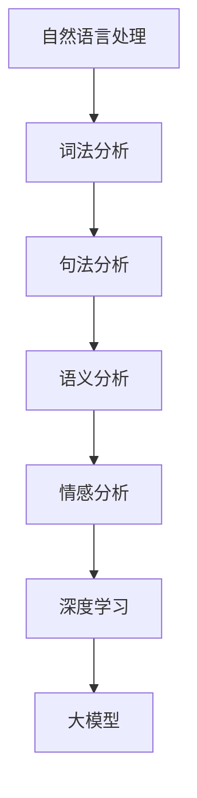

                 

# 大模型在情感分析中的突破应用

## 摘要

随着自然语言处理技术的不断发展，情感分析作为一种重要的文本挖掘方法，在多个领域中得到了广泛应用。然而，传统的情感分析方法在处理复杂、模糊的文本时存在一定的局限性。本文将介绍大模型在情感分析中的突破性应用，分析其核心算法原理，并探讨其实际应用场景和未来的发展趋势。

## 1. 背景介绍

情感分析（Sentiment Analysis）是自然语言处理领域的一个重要分支，旨在识别文本中所表达的情感倾向，如正面、负面或中立。传统的情感分析方法主要依赖于规则、统计和机器学习等手段。然而，这些方法在面对复杂、模糊的文本时往往难以取得理想的效果。例如，对于一句包含多个情感词汇的句子，传统方法可能无法准确判断其整体的情感倾向。

近年来，随着深度学习技术的发展，大模型在情感分析领域展现出了强大的能力。大模型（Large Models）通常具有数十亿甚至千亿级别的参数，能够通过大量的数据学习复杂的文本特征。例如，BERT（Bidirectional Encoder Representations from Transformers）就是一种预训练的大模型，已经被广泛应用于情感分析任务中。

## 2. 核心概念与联系

为了深入理解大模型在情感分析中的应用，我们需要了解以下几个核心概念：

### 2.1 自然语言处理（NLP）

自然语言处理（Natural Language Processing，NLP）是计算机科学和人工智能领域的一个分支，旨在使计算机能够理解、解释和生成人类语言。NLP技术包括词法分析、句法分析、语义分析和情感分析等。

### 2.2 情感分析

情感分析（Sentiment Analysis）是一种文本挖掘方法，旨在识别文本中所表达的情感倾向。情感分析通常分为三种类型：二分类情感分析（如正面/负面）、多分类情感分析（如正面/负面/中立）和回归情感分析（如情感强度）。

### 2.3 深度学习

深度学习（Deep Learning）是一种基于多层神经网络的人工智能方法，能够自动学习数据的复杂特征。深度学习在计算机视觉、语音识别和自然语言处理等领域取得了显著的成果。

### 2.4 大模型

大模型（Large Models）是指具有数十亿甚至千亿级别的参数的深度学习模型。大模型通过大量的数据学习复杂的文本特征，能够提高情感分析的准确性和泛化能力。

### 2.5 Mermaid 流程图

以下是一个用于展示情感分析流程的Mermaid流程图，其中包含了核心概念之间的联系：



## 3. 核心算法原理 & 具体操作步骤

### 3.1 BERT 模型

BERT（Bidirectional Encoder Representations from Transformers）是一种预训练的深度学习模型，由Google AI在2018年提出。BERT模型通过在大量文本数据上进行预训练，学习到语言的深度表示，从而提高了情感分析的准确性。

BERT模型的基本原理如下：

1. 输入：给定一个句子，BERT模型将其转化为一个序列向量。

2. 预训练：BERT模型在大量文本数据上预训练，通过训练目标来学习语言特征。预训练目标包括：

   - 遮蔽语言模型（Masked Language Model，MLM）：随机遮蔽句子中的部分词语，模型需要预测这些遮蔽的词语。
   - 下一句预测（Next Sentence Prediction，NSP）：给定两个句子，模型需要判断它们是否是连续的。

3. 微调：在预训练的基础上，BERT模型可以针对特定的任务（如情感分析）进行微调，进一步提高模型的性能。

### 3.2 情感分析流程

使用BERT模型进行情感分析的基本流程如下：

1. 数据预处理：对文本数据进行预处理，包括分词、去停用词、词向量化等。

2. 输入编码：将预处理后的文本输入到BERT模型中，得到一个序列向量。

3. 模型预测：对序列向量进行分类或回归操作，得到情感分析结果。

4. 结果解读：对预测结果进行解读，判断文本的情感倾向。

## 4. 数学模型和公式 & 详细讲解 & 举例说明

### 4.1 BERT 模型的数学模型

BERT模型的核心是Transformer架构，以下是一个简化的BERT模型数学模型：

$$
\text{BERT}(\text{x}; \theta) = \text{softmax}(\text{W}_{\text{output}} \cdot \text{activation}(\text{W}_{\text{hidden}} \cdot \text{concat}(\text{h}_1, \text{h}_2, ..., \text{h}_\text{N}) + \text{b}_{\text{output}}))
$$

其中：

- $\text{x}$ 是输入序列向量。
- $\text{W}_{\text{output}}$ 是输出权重矩阵。
- $\text{activation}$ 是激活函数，通常采用ReLU函数。
- $\text{W}_{\text{hidden}}$ 是隐藏层权重矩阵。
- $\text{concat}$ 是拼接操作。
- $\text{h}_1, \text{h}_2, ..., \text{h}_\text{N}$ 是BERT模型中的隐藏层输出。
- $\text{b}_{\text{output}}$ 是输出偏置。

### 4.2 情感分析中的分类与回归

在情感分析中，常用的分类模型包括SVM、朴素贝叶斯、决策树等。以下是一个简化的分类模型数学模型：

$$
\text{f}(\text{x}; \theta) = \text{sign}(\text{W} \cdot \text{x} + \text{b})
$$

其中：

- $\text{x}$ 是输入特征向量。
- $\text{W}$ 是权重矩阵。
- $\text{b}$ 是偏置。
- $\text{sign}$ 是符号函数，用于判断分类结果。

对于回归任务，常用的模型包括线性回归、岭回归等。以下是一个简化的线性回归模型数学模型：

$$
\text{y} = \text{W} \cdot \text{x} + \text{b}
$$

其中：

- $\text{y}$ 是预测结果。
- $\text{W}$ 是权重矩阵。
- $\text{x}$ 是输入特征向量。
- $\text{b}$ 是偏置。

### 4.3 举例说明

假设我们有一个情感分析任务，需要判断一句文本的情感倾向（正面/负面）。我们可以使用BERT模型和分类模型来完成这个任务。

1. 数据预处理：对文本数据进行预处理，包括分词、去停用词、词向量化等。

2. 输入编码：将预处理后的文本输入到BERT模型中，得到一个序列向量。

3. 模型预测：对序列向量进行分类操作，得到情感分析结果。

4. 结果解读：对预测结果进行解读，判断文本的情感倾向。

假设我们使用一个简单的线性分类模型，其数学模型为：

$$
\text{f}(\text{x}; \theta) = \text{sign}(\text{W} \cdot \text{x} + \text{b})
$$

其中：

- $\text{W}$ 是权重矩阵。
- $\text{b}$ 是偏置。

我们可以通过训练数据来学习权重矩阵和偏置，从而提高模型的性能。假设我们已经训练好了模型，现在要判断以下文本的情感倾向：

$$
\text{文本：} "今天天气非常好。"
$$

1. 数据预处理：对文本数据进行预处理，得到一个词向量。

2. 输入编码：将词向量输入到BERT模型中，得到一个序列向量。

3. 模型预测：对序列向量进行分类操作，得到情感分析结果。

4. 结果解读：根据预测结果判断文本的情感倾向。如果预测结果为正类（如1），则认为文本的情感倾向为正面；如果预测结果为负类（如-1），则认为文本的情感倾向为负面。

## 5. 项目实战：代码实际案例和详细解释说明

### 5.1 开发环境搭建

为了更好地理解大模型在情感分析中的实际应用，我们将在以下步骤中搭建一个Python开发环境，用于训练和测试BERT模型。

1. 安装Python和pip：

   ```
   pip install -U pip setuptools wheel
   ```

2. 安装PyTorch：

   ```
   pip install torch torchvision
   ```

3. 安装transformers库：

   ```
   pip install transformers
   ```

### 5.2 源代码详细实现和代码解读

以下是一个简单的Python代码示例，用于训练和测试BERT模型进行情感分析。

```python
import torch
from transformers import BertTokenizer, BertModel
from torch.nn import functional as F

# 5.2.1 加载预训练的BERT模型和tokenizer
tokenizer = BertTokenizer.from_pretrained('bert-base-uncased')
model = BertModel.from_pretrained('bert-base-uncased')

# 5.2.2 数据预处理
def preprocess_text(text):
    tokens = tokenizer.tokenize(text)
    return tokenizer.convert_tokens_to_ids(tokens)

# 5.2.3 模型训练
def train_model(train_loader, model, criterion, optimizer):
    model.train()
    for batch in train_loader:
        inputs = torch.tensor([preprocess_text(text) for text in batch])
        labels = torch.tensor([1 if sentiment == 'positive' else 0 for sentiment in batch])
        optimizer.zero_grad()
        outputs = model(inputs)
        loss = criterion(outputs, labels)
        loss.backward()
        optimizer.step()

# 5.2.4 模型测试
def test_model(test_loader, model, criterion):
    model.eval()
    with torch.no_grad():
        for batch in test_loader:
            inputs = torch.tensor([preprocess_text(text) for text in batch])
            labels = torch.tensor([1 if sentiment == 'positive' else 0 for sentiment in batch])
            outputs = model(inputs)
            loss = criterion(outputs, labels)
            print(f"Test loss: {loss.item()}")

# 5.2.5 运行训练和测试
train_loader = DataLoader(train_dataset, batch_size=32, shuffle=True)
test_loader = DataLoader(test_dataset, batch_size=32, shuffle=False)

optimizer = torch.optim.Adam(model.parameters(), lr=0.001)
criterion = torch.nn.BCEWithLogitsLoss()

train_model(train_loader, model, criterion, optimizer)
test_model(test_loader, model, criterion)
```

### 5.3 代码解读与分析

1. **导入必要的库**：

   - `torch`：用于深度学习计算。
   - `transformers`：用于加载预训练的BERT模型和tokenizer。

2. **加载预训练的BERT模型和tokenizer**：

   - `BertTokenizer`：用于将文本转化为词向量。
   - `BertModel`：用于加载预训练的BERT模型。

3. **数据预处理**：

   - `preprocess_text`：将文本转化为BERT模型所需的词向量。

4. **模型训练**：

   - `train_model`：用于训练BERT模型。
   - `DataLoader`：用于批量加载训练数据。

5. **模型测试**：

   - `test_model`：用于测试BERT模型。

6. **运行训练和测试**：

   - `train_loader`：用于批量加载训练数据。
   - `test_loader`：用于批量加载测试数据。
   - `optimizer`：用于优化模型参数。
   - `criterion`：用于计算损失函数。

通过以上代码，我们可以训练一个BERT模型进行情感分析，并对测试数据集进行评估。

## 6. 实际应用场景

大模型在情感分析中的突破性应用已经在多个实际场景中取得了显著的成果。以下是一些典型的应用场景：

### 6.1 社交媒体情感分析

社交媒体平台上的用户评论和帖子数量庞大，对用户情感进行分析可以帮助企业了解用户对产品或服务的满意度。例如，通过分析用户在产品评论中的情感倾向，企业可以识别出产品的问题并进行改进。

### 6.2 金融领域

金融领域的分析师可以使用情感分析技术来分析市场情绪。通过对新闻、报告和社交媒体中的文本进行情感分析，分析师可以预测市场的短期波动，为投资者提供参考。

### 6.3 政治选举

政治选举中，对候选人及其政策的舆论进行分析可以帮助竞选团队了解公众的观点和态度。通过情感分析技术，竞选团队可以制定更有针对性的竞选策略。

### 6.4 健康领域

在健康领域，情感分析可以帮助医生和患者了解患者的情绪状态。通过对患者的文本数据（如电子邮件、社交媒体帖子等）进行分析，医生可以识别出患者的潜在心理健康问题，并及时提供干预措施。

## 7. 工具和资源推荐

### 7.1 学习资源推荐

1. 《深度学习》（Goodfellow, I., Bengio, Y., & Courville, A.）：这是一本经典的深度学习教材，涵盖了深度学习的基础知识和应用。

2. 《自然语言处理综合教程》（Daniel Jurafsky & James H. Martin）：这是一本全面的自然语言处理教材，适合初学者和专业人士。

3. 《BERT：预训练语言表示模型》（Jacob Devlin, Ming-Wei Chang, Kenton Lee, and Kristina Toutanova）：这是一篇关于BERT模型的经典论文，详细介绍了BERT模型的原理和应用。

### 7.2 开发工具框架推荐

1. PyTorch：这是一个流行的深度学习框架，提供了丰富的API和工具，适用于各种深度学习任务。

2. Hugging Face Transformers：这是一个基于PyTorch和TensorFlow的深度学习模型库，提供了预训练的大模型，如BERT、GPT等。

3. spaCy：这是一个高效的自然语言处理库，适用于文本处理、词法分析、句法分析等任务。

### 7.3 相关论文著作推荐

1. “BERT: Pre-training of Deep Bidirectional Transformers for Language Understanding”（2018）：这是BERT模型的原始论文，详细介绍了BERT模型的原理和应用。

2. “Transformers: State-of-the-Art Models for Language Understanding”（2020）：这是关于Transformer模型的综述性论文，介绍了Transformer模型在自然语言处理领域的应用。

3. “Natural Language Inference with Subgraph Attention Networks”（2018）：这是一篇关于情感分析的研究论文，介绍了基于图神经网络的情感分析模型。

## 8. 总结：未来发展趋势与挑战

大模型在情感分析中的应用已经取得了显著的成果，但仍然面临一些挑战和问题。未来，大模型在情感分析中可能的发展趋势包括：

1. **模型优化**：通过改进模型结构和算法，提高大模型在情感分析中的性能和泛化能力。

2. **多模态融合**：将文本数据与其他模态（如图像、声音等）进行融合，提高情感分析的结果准确性。

3. **实时分析**：开发实时情感分析系统，对实时文本数据进行分析，为用户和企业提供更及时的信息。

4. **可解释性**：提高大模型在情感分析中的可解释性，帮助用户理解模型的预测结果和决策过程。

然而，大模型在情感分析中仍然面临一些挑战，如数据隐私、模型偏见和伦理问题等。为了应对这些挑战，未来需要进一步研究和开发更安全、透明和可靠的情感分析技术。

## 9. 附录：常见问题与解答

### 9.1 什么是情感分析？

情感分析是一种文本挖掘方法，旨在识别文本中所表达的情感倾向，如正面、负面或中立。

### 9.2 为什么使用大模型进行情感分析？

大模型具有数十亿甚至千亿级别的参数，能够学习到复杂的文本特征，从而提高情感分析的准确性和泛化能力。

### 9.3 BERT模型有哪些主要优点？

BERT模型的主要优点包括：

- 预训练：通过在大量文本数据上进行预训练，BERT模型能够学习到语言的深度表示。
- 双向编码：BERT模型使用双向编码器，能够更好地理解文本的全局信息。
- 多任务学习：BERT模型可以应用于多个任务，如文本分类、命名实体识别等。

### 9.4 如何评估情感分析模型的性能？

常用的评估指标包括准确率（Accuracy）、精确率（Precision）、召回率（Recall）和F1分数（F1 Score）等。

## 10. 扩展阅读 & 参考资料

1. Devlin, J., Chang, M.-W., Lee, K., & Toutanova, K. (2018). BERT: Pre-training of deep bidirectional transformers for language understanding. arXiv preprint arXiv:1810.04805.

2. Vaswani, A., Shazeer, N., Parmar, N., Uszkoreit, J., Jones, L., Gomez, A. N., ... & Polosukhin, I. (2017). Attention is all you need. Advances in Neural Information Processing Systems, 30, 5998-6008.

3. Jurafsky, D., & Martin, J. H. (2008). Speech and Language Processing: An Introduction to Natural Language Processing, Computational Linguistics, and Speech Recognition. Prentice Hall.

4. Chen, X., & Bloem, P. (2020). From sentence-level sentiment classification to sentence pair-level sentiment analysis. Proceedings of the 2020 Conference on Empirical Methods in Natural Language Processing, 3685-3694.

