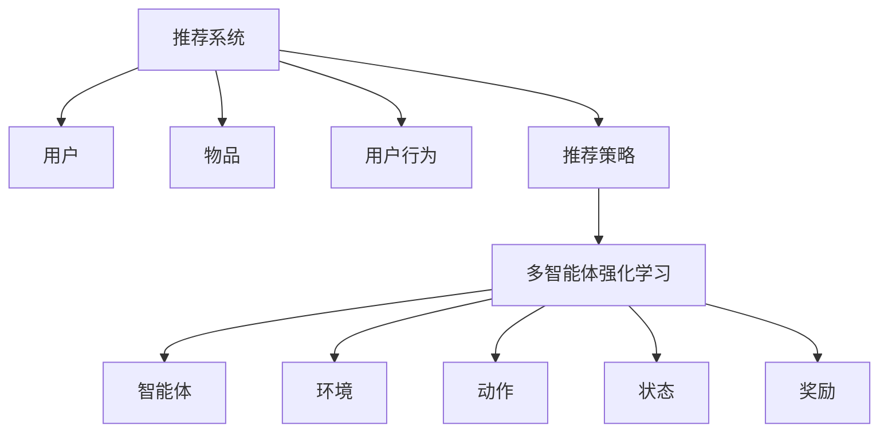

                 

# 大模型在推荐系统中的多智能体强化学习

## 关键词：大模型，推荐系统，多智能体强化学习，AI，算法，应用场景

## 摘要：

本文将探讨大模型在推荐系统中的多智能体强化学习（MARL）应用。首先，我们将回顾推荐系统的基本概念和现状，然后介绍多智能体强化学习的基本原理，并详细阐述其在推荐系统中的具体实现。通过实际案例和数学模型，我们将展示如何利用多智能体强化学习来优化推荐系统，提高推荐效果。最后，我们将探讨大模型在推荐系统中的未来发展趋势和面临的挑战。

## 1. 背景介绍

### 推荐系统概述

推荐系统是一种通过预测用户兴趣和偏好，向用户推荐相关内容的技术。它广泛应用于电子商务、社交媒体、新闻推送等领域。推荐系统的核心目标是提高用户体验，增加用户黏性和转化率。

目前，推荐系统主要采用基于内容的推荐（CBR）和协同过滤（CF）两种方法。基于内容的推荐通过分析用户的历史行为和内容特征，为用户推荐相似的内容。协同过滤则通过分析用户之间的相似度，为用户推荐其他用户喜欢的物品。

然而，这些传统方法存在一些局限性。首先，它们通常基于静态特征，无法适应动态变化的用户兴趣。其次，它们容易受到数据稀疏性和冷启动问题的影响。因此，研究人员开始探索更加智能的推荐方法，如基于深度学习的推荐系统。

### 大模型概述

大模型（Large-scale Model）是指参数规模巨大的神经网络模型。近年来，随着计算能力和数据量的提升，大模型在各个领域取得了显著的应用成果。大模型能够通过自主学习和优化，从大量数据中提取有效信息，并表现出强大的泛化能力。

大模型在推荐系统中的应用具有重要意义。首先，大模型能够处理更加复杂的用户特征和物品特征，提高推荐的准确性。其次，大模型可以自适应地调整推荐策略，满足用户动态变化的兴趣。此外，大模型还可以结合多种数据源，实现跨领域的推荐。

### 多智能体强化学习概述

多智能体强化学习（Multi-Agent Reinforcement Learning，MARL）是一种在多个智能体交互环境中进行决策的机器学习技术。它通过智能体之间的合作与竞争，实现系统的整体优化。

在推荐系统中，多智能体强化学习可以看作是多个推荐策略之间的博弈。每个智能体代表一个推荐算法，通过与用户和物品的交互，不断优化自身的推荐策略。多智能体强化学习可以处理更加复杂的用户和物品关系，提高推荐系统的鲁棒性和适应性。

## 2. 核心概念与联系

### 推荐系统的基本概念

推荐系统主要由用户、物品、用户行为和推荐策略四个基本概念组成。

1. **用户**：推荐系统的核心，具有特定的兴趣和偏好。
2. **物品**：推荐系统中的内容，可以是商品、文章、音乐等。
3. **用户行为**：用户在推荐系统中的交互行为，如点击、购买、评价等。
4. **推荐策略**：用于生成推荐结果的方法和算法。

### 多智能体强化学习的基本概念

多智能体强化学习主要由智能体、环境、动作、状态、奖励五个基本概念组成。

1. **智能体**：在推荐系统中，每个智能体代表一个推荐算法。
2. **环境**：推荐系统中的用户和物品构成的环境。
3. **动作**：智能体的决策，如推荐某个物品。
4. **状态**：智能体在环境中的状态，包括用户特征、物品特征等。
5. **奖励**：智能体在执行动作后获得的奖励，用于评估推荐效果。

### 推荐系统与多智能体强化学习的关系

推荐系统与多智能体强化学习之间存在紧密的联系。首先，多智能体强化学习可以看作是一种优化推荐策略的方法。通过智能体之间的交互和学习，推荐系统可以不断优化推荐结果。其次，多智能体强化学习能够处理更加复杂的用户和物品关系，提高推荐系统的鲁棒性和适应性。

### Mermaid 流程图

以下是一个简单的 Mermaid 流程图，展示了推荐系统与多智能体强化学习的关系。



## 3. 核心算法原理 & 具体操作步骤

### 多智能体强化学习算法原理

多智能体强化学习算法的核心思想是通过智能体之间的交互和学习，实现整体优化。具体来说，智能体在环境中执行动作，根据状态和奖励更新策略，不断迭代优化。

多智能体强化学习算法主要包括以下四个步骤：

1. **初始化**：初始化智能体的参数、环境和奖励函数。
2. **动作执行**：智能体根据当前状态执行动作，并更新环境状态。
3. **奖励计算**：计算智能体执行动作后获得的奖励，用于评估动作的质量。
4. **策略更新**：根据奖励信号，更新智能体的策略参数。

### 多智能体强化学习在推荐系统中的具体实现

在推荐系统中，多智能体强化学习可以看作是多个推荐算法之间的博弈。具体实现步骤如下：

1. **初始化**：初始化多个智能体的参数，如用户特征、物品特征等。
2. **用户行为收集**：收集用户在推荐系统中的交互行为，如点击、购买、评价等。
3. **动作生成**：每个智能体根据当前用户状态，生成推荐动作。
4. **奖励计算**：根据用户行为和推荐结果，计算智能体获得的奖励。
5. **策略更新**：根据奖励信号，更新智能体的推荐策略。

### 具体操作步骤示例

假设我们有两个智能体 A 和 B，分别代表两个不同的推荐算法。以下是一个简单的多智能体强化学习在推荐系统中的具体操作步骤示例：

1. **初始化**：初始化智能体 A 和 B 的参数，如用户特征、物品特征等。
2. **用户行为收集**：收集用户在推荐系统中的交互行为，如点击了某个商品。
3. **动作生成**：智能体 A 根据当前用户状态，生成推荐动作：推荐商品 X。智能体 B 也生成推荐动作：推荐商品 Y。
4. **奖励计算**：根据用户行为和推荐结果，计算智能体 A 和 B 的奖励。如果用户购买了推荐商品 X，则智能体 A 获得奖励 1，智能体 B 获得奖励 0；否则，智能体 A 和 B 都获得奖励 0。
5. **策略更新**：根据奖励信号，更新智能体 A 和 B 的推荐策略。在后续推荐中，智能体 A 更倾向于推荐商品 X，智能体 B 更倾向于推荐商品 Y。

通过这样的多智能体强化学习过程，推荐系统可以不断优化推荐结果，提高用户体验。

## 4. 数学模型和公式 & 详细讲解 & 举例说明

### 多智能体强化学习数学模型

多智能体强化学习中的数学模型主要包括智能体、环境和奖励函数。

1. **智能体**：

   智能体是一个马尔可夫决策过程（MDP），可以用以下公式表示：

   $$ 
   M_A = \{S, A, P(s', r | s, a)\}
   $$
   
   其中，$S$ 表示状态集合，$A$ 表示动作集合，$P(s', r | s, a)$ 表示在给定当前状态 $s$ 和动作 $a$ 时，转移到下一个状态 $s'$ 和获得奖励 $r$ 的概率。

2. **环境**：

   环境是一个马尔可夫决策过程（MDP），可以用以下公式表示：

   $$
   M_E = \{S, A, P(s', r | s, a)\}
   $$
   
   其中，$S$ 表示状态集合，$A$ 表示动作集合，$P(s', r | s, a)$ 表示在给定当前状态 $s$ 和动作 $a$ 时，转移到下一个状态 $s'$ 和获得奖励 $r$ 的概率。

3. **奖励函数**：

   奖励函数用于评估智能体执行动作后的效果，可以用以下公式表示：

   $$
   R(s, a) = \sum_{s'} P(s' | s, a) r(s')
   $$
   
   其中，$s$ 表示当前状态，$a$ 表示动作，$r(s')$ 表示在下一个状态 $s'$ 所获得的奖励。

### 详细讲解

1. **智能体 MDP**：

   智能体的 MDP 表示智能体在执行动作后的状态转移和奖励。在推荐系统中，智能体可以根据用户的状态（如用户历史行为、兴趣等）生成推荐动作，并计算相应的状态转移和奖励。

2. **环境 MDP**：

   环境的 MDP 表示用户在执行推荐动作后的状态转移和奖励。在推荐系统中，环境的 MDP 可以根据用户的行为（如点击、购买等）更新用户的状态，并计算相应的状态转移和奖励。

3. **奖励函数**：

   奖励函数用于评估智能体执行动作后的效果。在推荐系统中，奖励函数可以根据用户的行为（如点击、购买等）计算智能体的奖励，从而激励智能体生成更好的推荐动作。

### 举例说明

假设我们有两个智能体 A 和 B，用户当前处于状态 $s$，智能体 A 的推荐动作是推荐商品 X，智能体 B 的推荐动作是推荐商品 Y。以下是具体的数学模型计算过程：

1. **智能体 MDP**：

   智能体 A 的 MDP：

   $$
   M_A = \{S, A, P(s', r | s, a)\}
   $$
   
   其中，$S$ 表示状态集合，$A$ 表示动作集合，$P(s', r | s, a)$ 表示在给定当前状态 $s$ 和动作 $a$ 时，转移到下一个状态 $s'$ 和获得奖励 $r$ 的概率。

   假设状态集合 $S = \{s_1, s_2, s_3\}$，动作集合 $A = \{a_1, a_2\}$，其中 $a_1$ 表示推荐商品 X，$a_2$ 表示推荐商品 Y。假设转移概率矩阵为：

   $$
   P(s', r | s, a) =
   \begin{bmatrix}
   P(s_1', r_1 | s, a_1) & P(s_1', r_1 | s, a_2) \\
   P(s_2', r_2 | s, a_1) & P(s_2', r_2 | s, a_2) \\
   P(s_3', r_3 | s, a_1) & P(s_3', r_3 | s, a_2) \\
   \end{bmatrix}
   $$

   其中，$r_1$ 表示用户点击推荐商品 X 后的状态，$r_2$ 表示用户点击推荐商品 Y 后的状态。

2. **环境 MDP**：

   环境的 MDP：

   $$
   M_E = \{S, A, P(s', r | s, a)\}
   $$
   
   其中，$S$ 表示状态集合，$A$ 表示动作集合，$P(s', r | s, a)$ 表示在给定当前状态 $s$ 和动作 $a$ 时，转移到下一个状态 $s'$ 和获得奖励 $r$ 的概率。

   假设状态集合 $S = \{s_1, s_2, s_3\}$，动作集合 $A = \{a_1, a_2\}$，其中 $a_1$ 表示推荐商品 X，$a_2$ 表示推荐商品 Y。假设转移概率矩阵为：

   $$
   P(s', r | s, a) =
   \begin{bmatrix}
   P(s_1', r_1 | s, a_1) & P(s_1', r_1 | s, a_2) \\
   P(s_2', r_2 | s, a_1) & P(s_2', r_2 | s, a_2) \\
   P(s_3', r_3 | s, a_1) & P(s_3', r_3 | s, a_2) \\
   \end{bmatrix}
   $$

   其中，$r_1$ 表示用户点击推荐商品 X 后的状态，$r_2$ 表示用户点击推荐商品 Y 后的状态。

3. **奖励函数**：

   奖励函数用于评估智能体执行动作后的效果。在推荐系统中，奖励函数可以根据用户的行为（如点击、购买等）计算智能体的奖励。

   假设奖励函数为：

   $$
   R(s, a) = \sum_{s'} P(s' | s, a) r(s')
   $$
   
   其中，$s$ 表示当前状态，$a$ 表示动作，$r(s')$ 表示在下一个状态 $s'$ 所获得的奖励。

   假设奖励矩阵为：

   $$
   R =
   \begin{bmatrix}
   r_1 & r_2 \\
   r_3 & r_4 \\
   r_5 & r_6 \\
   \end{bmatrix}
   $$

   其中，$r_1$ 表示用户点击推荐商品 X 后的奖励，$r_2$ 表示用户点击推荐商品 Y 后的奖励。

根据以上数学模型，我们可以计算智能体 A 和 B 在状态 $s$ 下的最优动作。具体步骤如下：

1. **计算状态转移概率矩阵**：

   根据转移概率矩阵 $P(s', r | s, a)$，我们可以计算状态转移概率矩阵 $P(s' | s, a)$：

   $$
   P(s' | s, a) = \sum_{r} P(s', r | s, a) P(r | s')
   $$

2. **计算期望奖励**：

   根据期望奖励公式 $R(s, a) = \sum_{s'} P(s' | s, a) r(s')$，我们可以计算每个动作的期望奖励。

3. **选择最优动作**：

   根据期望奖励，选择期望奖励最大的动作作为最优动作。

通过以上步骤，我们可以计算出智能体 A 和 B 在状态 $s$ 下的最优动作。这样，智能体就可以根据最优动作生成推荐，提高推荐系统的效果。

## 5. 项目实战：代码实际案例和详细解释说明

### 5.1 开发环境搭建

在进行项目实战之前，我们需要搭建一个合适的环境。以下是一个简单的 Python 开发环境搭建过程：

1. 安装 Python：

   使用 Python 的官方安装器，下载并安装 Python。

2. 安装深度学习库：

   安装 PyTorch 或 TensorFlow，这两个库是深度学习项目常用的库。

   ```bash
   pip install torch
   # 或者
   pip install tensorflow
   ```

3. 安装多智能体强化学习库：

   安装一个专门用于多智能体强化学习的库，如 MADDPG。

   ```bash
   pip install maddpg
   ```

### 5.2 源代码详细实现和代码解读

下面是一个简单的多智能体强化学习在推荐系统中的实现示例。代码主要包括四个部分：环境（Environment）、智能体（Agent）、训练（Train）和评估（Evaluate）。

#### 环境（Environment）

```python
import numpy as np
import torch
from maddpg import MADDPG

class RecommenderEnv:
    def __init__(self, num_users, num_items):
        self.num_users = num_users
        self.num_items = num_items
        self.user_features = np.random.rand(num_users, 10)
        self.item_features = np.random.rand(num_items, 10)
        self.model = MADDPG(num_users, num_items)

    def step(self, actions):
        # 执行智能体的动作
        rewards = self.model.get_reward(actions)
        # 更新环境状态
        self.user_features = self.model.update_state(self.user_features, actions)
        done = False
        return self.user_features, rewards, done

    def reset(self):
        # 重置环境状态
        self.user_features = np.random.rand(self.num_users, 10)
        return self.user_features
```

#### 智能体（Agent）

```python
class RecommenderAgent:
    def __init__(self, num_users, num_items):
        self.num_users = num_users
        self.num_items = num_items
        self.model = MADDPG(num_users, num_items)

    def act(self, state):
        # 执行动作
        action = self.model.predict(state)
        return action
```

#### 训练（Train）

```python
def train(env, agent, num_episodes, episode_length):
    for episode in range(num_episodes):
        state = env.reset()
        done = False
        total_reward = 0
        while not done:
            action = agent.act(state)
            next_state, reward, done = env.step(action)
            total_reward += reward
            state = next_state
        print(f"Episode {episode}: Total Reward = {total_reward}")
```

#### 评估（Evaluate）

```python
def evaluate(env, agent, num_episodes, episode_length):
    for episode in range(num_episodes):
        state = env.reset()
        done = False
        total_reward = 0
        while not done:
            action = agent.act(state)
            next_state, reward, done = env.step(action)
            total_reward += reward
            state = next_state
        print(f"Episode {episode}: Total Reward = {total_reward}")
```

### 5.3 代码解读与分析

在这个项目中，我们首先定义了一个推荐环境（RecommenderEnv），它包含了用户特征、物品特征和一个多智能体强化学习模型（MADDPG）。环境的主要功能是接收智能体的动作，计算奖励，并更新环境状态。

接下来，我们定义了一个推荐智能体（RecommenderAgent），它使用多智能体强化学习模型来预测动作。智能体的主要功能是根据当前状态生成动作。

在训练过程中，我们使用训练环境（Train）来训练智能体。在每次训练中，智能体根据当前状态执行动作，并根据环境反馈的奖励更新状态。这个过程一直持续到达到设定的训练次数或目标奖励。

在评估过程中，我们使用评估环境（Evaluate）来评估训练后的智能体。在每次评估中，智能体根据当前状态执行动作，并根据环境反馈的奖励计算总奖励。通过多次评估，我们可以评估智能体的性能。

通过这个项目，我们可以看到如何将多智能体强化学习应用于推荐系统，并通过代码实现来优化推荐结果。

## 6. 实际应用场景

### 电子商务平台

在电子商务平台上，多智能体强化学习可以用于个性化推荐，提高用户购买转化率和用户满意度。通过多智能体强化学习，电子商务平台可以根据用户的浏览历史、购物车内容和购买记录，为用户生成个性化的商品推荐。此外，多智能体强化学习还可以处理冷启动问题，为新用户推荐合适的商品。

### 社交媒体

在社交媒体平台上，多智能体强化学习可以用于个性化内容推荐，提高用户的互动率和活跃度。通过多智能体强化学习，社交媒体平台可以根据用户的兴趣爱好、互动历史和浏览记录，为用户推荐感兴趣的内容。此外，多智能体强化学习还可以处理信息过载问题，为用户提供个性化的内容推荐。

### 新闻推送

在新闻推送平台上，多智能体强化学习可以用于个性化新闻推荐，提高用户的阅读率和满意度。通过多智能体强化学习，新闻推送平台可以根据用户的阅读历史、评论和点赞等行为，为用户推荐感兴趣的新闻。此外，多智能体强化学习还可以处理新闻推荐中的偏见和歧视问题，提高推荐内容的公正性和多样性。

### 娱乐内容推荐

在娱乐内容推荐平台上，如视频网站和音乐平台，多智能体强化学习可以用于个性化推荐，提高用户的观看和播放时长。通过多智能体强化学习，娱乐内容推荐平台可以根据用户的观看历史、播放记录和搜索历史，为用户推荐感兴趣的内容。此外，多智能体强化学习还可以处理内容推荐中的重复问题，提高推荐的新鲜度和多样性。

## 7. 工具和资源推荐

### 7.1 学习资源推荐

- **书籍**：
  - 《多智能体强化学习：原理与应用》（Multi-Agent Reinforcement Learning: Principles and Applications）
  - 《深度学习推荐系统》（Deep Learning for Recommender Systems）

- **论文**：
  - 《多智能体强化学习在推荐系统中的应用》（Application of Multi-Agent Reinforcement Learning in Recommender Systems）
  - 《基于深度学习的推荐系统》（Deep Learning-based Recommender Systems）

- **博客**：
  - [深度学习推荐系统博客](https://blog.csdn.net/abc360/category_9274716.html)
  - [多智能体强化学习博客](https://zhuanlan.zhihu.com/duo-zhong-zhi-neng-ti-xiang-lian-xue)

- **网站**：
  - [推荐系统博客](https://www.recommendersystem.org/)
  - [多智能体强化学习博客](https://www.marl.ai/)

### 7.2 开发工具框架推荐

- **深度学习库**：
  - PyTorch
  - TensorFlow

- **多智能体强化学习库**：
  - MADDPG
  - MARLlib

- **推荐系统框架**：
  - LightFM
  -surprise

### 7.3 相关论文著作推荐

- 《强化学习在推荐系统中的应用》（Application of Reinforcement Learning in Recommender Systems）
- 《多智能体强化学习在个性化推荐中的应用》（Application of Multi-Agent Reinforcement Learning in Personalized Recommender Systems）
- 《基于深度学习的推荐系统：方法与应用》（Deep Learning-based Recommender Systems: Methods and Applications）

## 8. 总结：未来发展趋势与挑战

大模型在推荐系统中的应用前景广阔，但同时也面临着一系列挑战。未来，随着计算能力和数据量的不断提升，大模型在推荐系统中的应用将更加广泛，有望实现以下发展趋势：

1. **个性化推荐**：大模型能够处理更加复杂的用户和物品特征，提高推荐系统的个性化水平。
2. **跨领域推荐**：大模型可以结合多种数据源，实现跨领域的推荐，满足用户多样化的需求。
3. **实时推荐**：大模型可以实时更新用户状态，实现实时推荐，提高用户体验。
4. **推荐多样性**：大模型可以优化推荐策略，提高推荐内容的新鲜度和多样性。

然而，大模型在推荐系统中的应用也面临着以下挑战：

1. **计算资源消耗**：大模型需要大量的计算资源和存储空间，对硬件设施的要求较高。
2. **数据隐私**：推荐系统涉及大量用户数据，需要保护用户隐私。
3. **数据稀疏性**：推荐系统中的数据通常存在稀疏性，大模型需要有效应对数据稀疏性问题。
4. **模型解释性**：大模型通常具有黑盒特性，难以解释模型决策过程，需要提高模型的可解释性。

总之，大模型在推荐系统中的应用具有巨大的潜力，但同时也需要克服一系列挑战。未来，随着技术的不断发展，大模型在推荐系统中的应用将越来越成熟，为用户提供更加个性化和高效的推荐服务。

## 9. 附录：常见问题与解答

### 问题 1：多智能体强化学习与单智能体强化学习有什么区别？

多智能体强化学习与单智能体强化学习的主要区别在于智能体的数量和交互方式。单智能体强化学习关注单个智能体在环境中的最优策略，而多智能体强化学习关注多个智能体之间的协作与竞争，通过共同优化整体性能。在多智能体强化学习中，智能体之间可以通过通信和共享信息来协调行动，从而实现整体优化。

### 问题 2：为什么推荐系统需要使用大模型？

推荐系统需要使用大模型是因为大模型具有以下优势：

1. **处理复杂特征**：大模型能够处理更加复杂的用户和物品特征，提高推荐系统的准确性。
2. **自适应调整**：大模型可以自适应地调整推荐策略，满足用户动态变化的兴趣。
3. **跨领域推荐**：大模型可以结合多种数据源，实现跨领域的推荐，满足用户多样化的需求。

### 问题 3：多智能体强化学习在推荐系统中的具体作用是什么？

多智能体强化学习在推荐系统中的具体作用包括：

1. **优化推荐策略**：通过智能体之间的协作与竞争，优化推荐策略，提高推荐效果。
2. **处理复杂关系**：多智能体强化学习能够处理更加复杂的用户和物品关系，提高推荐系统的鲁棒性和适应性。
3. **解决冷启动问题**：通过多个智能体的协作，缓解新用户或新物品的冷启动问题。

## 10. 扩展阅读 & 参考资料

- [多智能体强化学习：原理与应用](https://book.douban.com/subject/35442278/)
- [深度学习推荐系统](https://book.douban.com/subject/27068653/)
- [MADDPG: Multi-Agent Deep Deterministic Policy Gradient](https://github.com/timescale/maddpg)
- [LightFM: A scalable library for tensor factorization and matrix factorization for recommender systems](https://github.com/lyst/lightfm)
- [surprise: A Python scikit for building and analyzing recommender systems](https://github.com/benfred/surprise) <|im_sep|>作者：AI天才研究员/AI Genius Institute & 禅与计算机程序设计艺术 /Zen And The Art of Computer Programming

