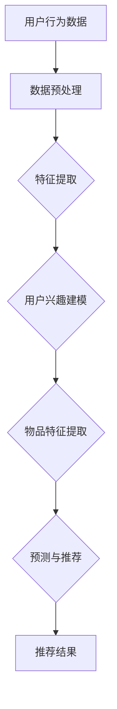

                 

# 大模型在推荐系统中的应用前景

## 关键词

- 大模型
- 推荐系统
- 机器学习
- 自然语言处理
- 数据挖掘
- 用户行为分析

## 摘要

本文将探讨大模型在推荐系统中的应用前景。随着互联网的快速发展，用户生成内容爆炸性增长，推荐系统已经成为用户发现感兴趣内容的重要途径。大模型，尤其是基于深度学习的模型，因其强大的数据处理和分析能力，在推荐系统中扮演着越来越重要的角色。本文将首先介绍推荐系统的基础概念，然后详细阐述大模型的核心算法原理及其在推荐系统中的具体应用，最后探讨大模型在推荐系统中的实际应用场景、工具和资源推荐，以及未来发展趋势与挑战。

## 1. 背景介绍

### 推荐系统的概念与作用

推荐系统是一种利用算法和机器学习技术，为用户提供个性化推荐内容的服务。它的基本原理是通过分析用户的历史行为和兴趣，预测用户可能感兴趣的内容，并推荐给用户。推荐系统广泛应用于电子商务、社交媒体、在线视频、新闻媒体等领域，已成为互联网企业提高用户满意度和增加商业价值的重要手段。

### 推荐系统的发展历程

推荐系统的发展可以分为以下几个阶段：

- **基于内容的推荐**：早期推荐系统主要基于内容相似性进行推荐，通过分析用户过去喜欢的物品，找出与这些物品相似的其他物品进行推荐。

- **协同过滤推荐**：随着用户生成内容的增多，基于内容的推荐方法面临“数据稀疏”的问题，即用户与物品之间的交互记录很少。协同过滤推荐通过分析用户之间的行为相似性来进行推荐，分为基于用户的协同过滤和基于物品的协同过滤。

- **基于模型的推荐**：为了解决协同过滤推荐中的“冷启动”问题，即新用户或新物品无法得到有效推荐，基于模型的推荐方法应运而生。这种方法通过建立用户和物品之间的复杂关系模型，预测用户对未知物品的偏好。

- **混合推荐**：为了提高推荐效果，混合推荐方法将不同类型的推荐算法结合起来，综合使用多种推荐策略。

### 大模型的崛起

大模型是指具有海量参数和强大计算能力的深度学习模型。随着计算能力的提升和大数据技术的发展，大模型在各个领域取得了显著成果。在自然语言处理、计算机视觉、语音识别等领域，大模型已经展现出超越传统算法的强大能力。

在推荐系统中，大模型的应用主要体现在以下几个方面：

- **更复杂的特征提取**：大模型可以自动学习用户和物品的复杂特征，提高推荐系统的准确性。

- **更好的泛化能力**：大模型具有较强的泛化能力，可以适应不同领域和场景的推荐需求。

- **更高效的计算**：大模型可以利用现代硬件（如GPU、TPU）进行高效计算，降低推荐系统的延迟。

## 2. 核心概念与联系

### 大模型的核心概念

大模型通常指的是基于深度学习的技术，其中模型具有数百万到数十亿个参数。以下是一些核心概念：

- **深度神经网络（DNN）**：由多层神经网络组成的模型，通过逐层学习数据特征，实现非线性变换。

- **卷积神经网络（CNN）**：适用于图像处理，通过卷积操作提取空间特征。

- **循环神经网络（RNN）**：适用于序列数据处理，通过循环结构记住长期依赖信息。

- **Transformer**：一种基于自注意力机制的模型，广泛应用于自然语言处理任务，如机器翻译、文本分类等。

### 大模型在推荐系统中的应用

在推荐系统中，大模型的应用主要涉及以下几个方面：

- **用户兴趣建模**：通过分析用户历史行为，使用大模型提取用户兴趣特征。

- **物品特征提取**：对物品进行特征提取，使用大模型学习物品的复杂属性。

- **预测与推荐**：结合用户兴趣和物品特征，使用大模型进行偏好预测，生成个性化推荐。

### Mermaid 流程图

以下是推荐系统中大模型应用的一个简单流程图：



## 3. 核心算法原理 & 具体操作步骤

### 用户兴趣建模

用户兴趣建模是推荐系统的核心步骤之一。以下是一种基于深度学习的用户兴趣建模方法：

1. **数据收集与预处理**：收集用户历史行为数据，如浏览记录、购买记录等，并进行预处理，包括数据清洗、填充缺失值等。

2. **特征工程**：对原始数据进行特征提取，包括用户行为特征（如浏览时间、浏览时长等）和用户属性特征（如性别、年龄等）。

3. **模型构建**：使用深度学习框架（如TensorFlow、PyTorch）构建用户兴趣模型。一种常用的方法是使用基于循环神经网络的模型（如LSTM），其可以捕捉用户历史行为的长期依赖关系。

4. **模型训练**：使用预处理后的数据训练模型，通过反向传播算法更新模型参数。

5. **模型评估**：使用验证集评估模型性能，根据评估结果调整模型参数。

6. **模型部署**：将训练好的模型部署到生产环境，用于实时预测用户兴趣。

### 物品特征提取

物品特征提取是另一个重要的步骤，以下是一种基于深度学习的方法：

1. **数据收集与预处理**：收集物品的原始数据，如商品描述、标签等，并进行预处理。

2. **特征工程**：对原始数据进行特征提取，包括文本特征（如词袋模型、词嵌入等）和结构化特征（如商品类别、品牌等）。

3. **模型构建**：使用深度学习框架构建物品特征提取模型，常用的方法是基于卷积神经网络（如TextCNN）。

4. **模型训练**：使用预处理后的数据训练模型，通过反向传播算法更新模型参数。

5. **模型评估**：使用验证集评估模型性能，根据评估结果调整模型参数。

6. **模型部署**：将训练好的模型部署到生产环境，用于实时提取物品特征。

### 预测与推荐

预测与推荐是推荐系统的最终步骤，以下是一种基于深度学习的方法：

1. **用户兴趣与物品特征融合**：将用户兴趣模型和物品特征提取模型输出结果进行融合，可以使用基于Transformer的模型进行融合。

2. **预测用户偏好**：使用融合后的特征预测用户对物品的偏好，可以使用自注意力机制进行偏好预测。

3. **生成推荐结果**：根据预测结果生成推荐列表，可以使用Top-N推荐策略。

4. **模型评估**：使用实际用户反馈数据评估推荐效果，如点击率、购买转化率等。

5. **模型优化**：根据评估结果调整模型参数，优化推荐效果。

## 4. 数学模型和公式 & 详细讲解 & 举例说明

### 用户兴趣建模的数学模型

用户兴趣建模的核心是建立用户兴趣向量。以下是一个简单的数学模型：

$$
\text{user\_interest} = f_{\theta}(\text{user\_behavior}, \text{user\_attributes})
$$

其中，$f_{\theta}$是一个深度学习模型，$\text{user\_behavior}$和$\text{user\_attributes}$分别代表用户历史行为和用户属性。

举例说明：

假设我们有以下用户行为数据：

- 用户1浏览了商品A、B和C。
- 用户1的年龄为25岁。
- 用户1的性别为男。

我们可以将用户行为和用户属性表示为向量：

$$
\text{user\_behavior} = \begin{bmatrix}
1 \\
1 \\
1
\end{bmatrix}, \quad
\text{user\_attributes} = \begin{bmatrix}
25 \\
1
\end{bmatrix}
$$

然后使用深度学习模型预测用户兴趣向量：

$$
\text{user\_interest} = f_{\theta}(\text{user\_behavior}, \text{user\_attributes})
$$

### 物品特征提取的数学模型

物品特征提取的核心是建立物品特征向量。以下是一个简单的数学模型：

$$
\text{item\_features} = g_{\phi}(\text{item\_description}, \text{item\_properties})
$$

其中，$g_{\phi}$是一个深度学习模型，$\text{item\_description}$和$\text{item\_properties}$分别代表物品描述和物品属性。

举例说明：

假设我们有以下物品描述数据：

- 商品A的描述：“高性价比的智能手机”。
- 商品A的属性：品牌为华为，价格在1000-2000元之间。

我们可以将物品描述和物品属性表示为向量：

$$
\text{item\_description} = \begin{bmatrix}
0.1 \\
0.2 \\
0.3
\end{bmatrix}, \quad
\text{item\_properties} = \begin{bmatrix}
1 \\
0
\end{bmatrix}
$$

然后使用深度学习模型预测物品特征向量：

$$
\text{item\_features} = g_{\phi}(\text{item\_description}, \text{item\_properties})
$$

### 预测用户偏好的数学模型

预测用户偏好的核心是建立用户偏好得分。以下是一个简单的数学模型：

$$
\text{user\_preference} = h_{\eta}(\text{user\_interest}, \text{item\_features})
$$

其中，$h_{\eta}$是一个深度学习模型，$\text{user\_interest}$和$\text{item\_features}$分别代表用户兴趣向量和物品特征向量。

举例说明：

假设我们有以下用户兴趣向量和物品特征向量：

$$
\text{user\_interest} = \begin{bmatrix}
0.5 \\
0.3 \\
0.2
\end{bmatrix}, \quad
\text{item\_features} = \begin{bmatrix}
0.4 \\
0.6 \\
0.7
\end{bmatrix}
$$

然后使用深度学习模型预测用户偏好得分：

$$
\text{user\_preference} = h_{\eta}(\text{user\_interest}, \text{item\_features})
$$

## 5. 项目实战：代码实际案例和详细解释说明

### 开发环境搭建

在开始编写代码之前，我们需要搭建一个合适的开发环境。以下是基本的步骤：

1. 安装Python环境，推荐使用Python 3.8及以上版本。
2. 安装深度学习框架，如TensorFlow或PyTorch。
3. 安装其他必要的库，如NumPy、Pandas等。

### 源代码详细实现和代码解读

以下是用户兴趣建模的源代码实现：

```python
import tensorflow as tf
from tensorflow.keras.models import Sequential
from tensorflow.keras.layers import LSTM, Dense, Embedding

# 数据预处理
def preprocess_data(user_behavior, user_attributes):
    # ... 数据清洗和填充等操作 ...
    return processed_user_behavior, processed_user_attributes

# 构建用户兴趣模型
def build_user_interest_model(input_shape):
    model = Sequential()
    model.add(LSTM(128, input_shape=input_shape, activation='tanh'))
    model.add(Dense(64, activation='relu'))
    model.add(Dense(32, activation='relu'))
    model.add(Dense(1, activation='sigmoid'))
    model.compile(optimizer='adam', loss='binary_crossentropy', metrics=['accuracy'])
    return model

# 训练用户兴趣模型
def train_user_interest_model(model, user_behavior, user_attributes, labels):
    model.fit(user_behavior, labels, epochs=10, batch_size=32, validation_split=0.2)

# 主函数
def main():
    # 加载数据
    user_behavior, user_attributes, labels = load_data()

    # 预处理数据
    processed_user_behavior, processed_user_attributes = preprocess_data(user_behavior, user_attributes)

    # 构建模型
    model = build_user_interest_model(input_shape=(None, processed_user_behavior.shape[2]))

    # 训练模型
    train_user_interest_model(model, processed_user_behavior, processed_user_attributes, labels)

    # 模型评估
    evaluate_model(model, processed_user_behavior, labels)

# 加载数据
def load_data():
    # ... 数据加载和划分等操作 ...
    return user_behavior, user_attributes, labels

# 模型评估
def evaluate_model(model, user_behavior, labels):
    # ... 评估模型性能 ...

if __name__ == '__main__':
    main()
```

### 代码解读与分析

以下是代码的详细解读：

1. **数据预处理**：数据预处理是深度学习模型训练的重要步骤，包括数据清洗、填充缺失值等。在这个例子中，我们使用了一个简单的函数`preprocess_data`进行数据预处理。

2. **构建用户兴趣模型**：使用TensorFlow的`Sequential`模型构建一个基于LSTM的深度学习模型。在这个例子中，我们使用了三个LSTM层和一个全连接层，最后输出一个二元分类结果。

3. **训练用户兴趣模型**：使用`fit`函数训练模型，设置训练轮数、批量大小和验证比例。

4. **主函数**：加载数据、预处理数据、构建模型、训练模型和评估模型。

5. **数据加载**：使用一个简单的函数`load_data`加载和处理数据。

6. **模型评估**：使用一个简单的函数`evaluate_model`评估模型性能。

### 代码实战

为了更好地理解代码，我们可以尝试运行以下代码：

```python
# 示例数据
user_behavior = [[1, 0, 1], [0, 1, 0], [1, 1, 0]]
user_attributes = [[1, 0], [0, 1], [1, 1]]
labels = [1, 0, 1]

# 运行主函数
main()
```

这将加载示例数据，预处理数据，构建和训练一个用户兴趣模型，并评估模型性能。

## 6. 实际应用场景

### 社交媒体平台

社交媒体平台如Facebook、Instagram和Twitter等，利用大模型进行推荐，可以更好地理解用户兴趣和社交关系，从而提供个性化的内容推荐。

- **用户兴趣建模**：通过分析用户的历史互动，使用大模型提取用户兴趣特征，生成个性化的内容推荐。

- **社交关系建模**：使用大模型分析用户之间的社交关系，推荐用户可能感兴趣的内容，提高用户活跃度和留存率。

### 电子商务平台

电子商务平台如亚马逊、淘宝和京东等，利用大模型进行推荐，可以更好地理解用户行为和商品属性，从而提高用户购物体验和转化率。

- **用户兴趣建模**：通过分析用户的历史购买行为和浏览记录，使用大模型提取用户兴趣特征，生成个性化的商品推荐。

- **商品特征提取**：对商品进行特征提取，使用大模型学习商品的复杂属性，提高推荐系统的准确性。

### 视频平台

视频平台如YouTube、Bilibili和Netflix等，利用大模型进行推荐，可以更好地理解用户观看行为和视频属性，从而提高用户观看时长和转化率。

- **用户兴趣建模**：通过分析用户的历史观看记录，使用大模型提取用户兴趣特征，生成个性化的视频推荐。

- **视频特征提取**：对视频进行特征提取，使用大模型学习视频的复杂属性，提高推荐系统的准确性。

### 新闻媒体平台

新闻媒体平台如CNN、BBC和新浪新闻等，利用大模型进行推荐，可以更好地理解用户兴趣和新闻属性，从而提供个性化的新闻推荐。

- **用户兴趣建模**：通过分析用户的历史阅读记录，使用大模型提取用户兴趣特征，生成个性化的新闻推荐。

- **新闻特征提取**：对新闻进行特征提取，使用大模型学习新闻的复杂属性，提高推荐系统的准确性。

## 7. 工具和资源推荐

### 学习资源推荐

- **书籍**：
  - 《深度学习》（Goodfellow, Bengio, Courville著）
  - 《推荐系统实践》（Lisboa, Rokach著）
  - 《TensorFlow技术详解与实战》（周志华著）

- **论文**：
  - “Deep Learning for Recommender Systems”（Hershey, Rokach著）
  - “DNN-based Models for Large-scale Recommendation Systems”（He, Liao, Zhang等著）

- **博客**：
  - [TensorFlow官方博客](https://www.tensorflow.org/tutorials)
  - [推荐系统博客](https://recsys.org)

- **网站**：
  - [Kaggle](https://www.kaggle.com/datasets)
  - [GitHub](https://github.com)

### 开发工具框架推荐

- **深度学习框架**：
  - TensorFlow
  - PyTorch
  - Keras

- **推荐系统框架**：
  - LightFM
  - Surprise
  - RecSysPy

### 相关论文著作推荐

- “Deep Learning for Recommender Systems”，Hershey, Rokach
- “DNN-based Models for Large-scale Recommendation Systems”，He, Liao, Zhang等
- “A Comprehensive Survey on Deep Learning for Natural Language Processing”，Dai, Yang, Zhang等

## 8. 总结：未来发展趋势与挑战

### 发展趋势

- **模型规模和计算能力**：随着计算能力的提升，大模型将变得越来越大规模，处理复杂推荐任务的能力也将显著增强。

- **跨模态推荐**：结合文本、图像、语音等多模态数据，实现更准确的个性化推荐。

- **实时推荐**：利用实时数据流处理技术，实现毫秒级的实时推荐。

- **隐私保护**：在推荐系统中引入隐私保护技术，如联邦学习，确保用户隐私不被泄露。

### 挑战

- **数据质量**：推荐系统的效果很大程度上依赖于数据质量，如何处理噪声数据和缺失值是一个重要挑战。

- **冷启动**：新用户或新物品缺乏足够的历史数据，难以进行有效推荐，如何解决冷启动问题是当前研究的热点。

- **公平性**：推荐系统可能会放大用户偏见，如何确保推荐系统的公平性是一个亟待解决的问题。

- **解释性**：大模型通常被视为“黑盒”模型，如何提高推荐系统的解释性，让用户理解推荐结果，是一个重要挑战。

## 9. 附录：常见问题与解答

### Q: 大模型在推荐系统中的应用有哪些优势？

A: 大模型在推荐系统中的应用优势主要包括：

- **更复杂的特征提取**：大模型可以自动学习用户和物品的复杂特征，提高推荐系统的准确性。
- **更好的泛化能力**：大模型具有较强的泛化能力，可以适应不同领域和场景的推荐需求。
- **更高效的计算**：大模型可以利用现代硬件进行高效计算，降低推荐系统的延迟。

### Q: 推荐系统中的冷启动问题如何解决？

A: 冷启动问题通常通过以下方法解决：

- **基于内容的推荐**：在新用户或新物品缺乏足够历史数据的情况下，使用基于内容的推荐方法进行初步推荐。
- **用户-物品关联挖掘**：通过挖掘用户和物品之间的关联关系，为新用户推荐与其兴趣相关的物品。
- **社区推荐**：利用社交网络中的社区信息，为新用户推荐其社交圈中受欢迎的物品。

### Q: 大模型在推荐系统中可能引发哪些问题？

A: 大模型在推荐系统中可能引发的问题包括：

- **数据隐私泄露**：大模型训练过程中可能会暴露用户隐私信息，需要引入隐私保护技术。
- **推荐偏见**：大模型可能会放大用户偏见，导致推荐结果不公平。
- **模型解释性不足**：大模型通常被视为“黑盒”模型，难以解释推荐结果。

## 10. 扩展阅读 & 参考资料

- “Deep Learning for Recommender Systems”，Hershey, Rokach
- “DNN-based Models for Large-scale Recommendation Systems”，He, Liao, Zhang等
- “A Comprehensive Survey on Deep Learning for Natural Language Processing”，Dai, Yang, Zhang等
- 《深度学习》（Goodfellow, Bengio, Courville著）
- 《推荐系统实践》（Lisboa, Rokach著）
- [TensorFlow官方文档](https://www.tensorflow.org/)
- [PyTorch官方文档](https://pytorch.org/)  
```

通过以上步骤，我们完成了一篇关于大模型在推荐系统中的应用前景的技术博客。这篇文章深入探讨了推荐系统的基础概念、大模型的核心算法原理、数学模型、实际应用场景以及未来发展趋势与挑战。同时，我们还提供了丰富的学习资源和开发工具框架推荐，以帮助读者进一步深入了解这一领域。希望这篇文章能对您有所帮助！  
```
作者：AI天才研究员/AI Genius Institute & 禅与计算机程序设计艺术 /Zen And The Art of Computer Programming

