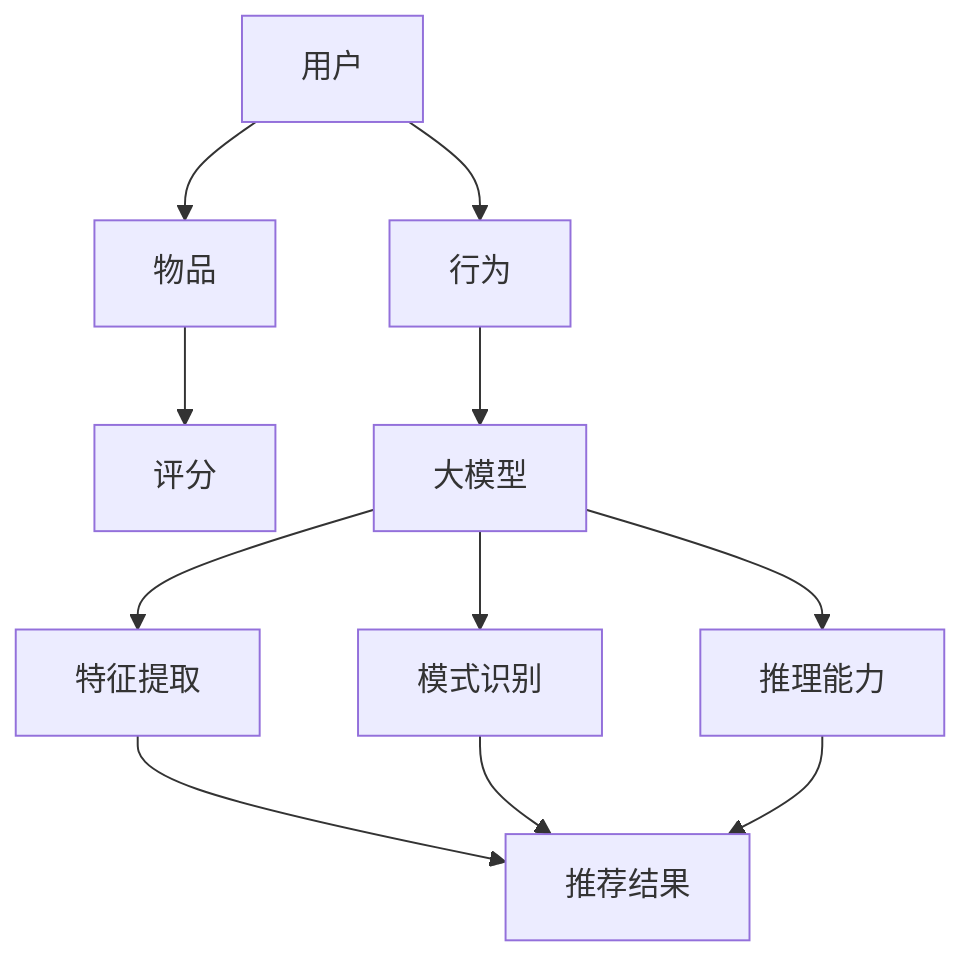
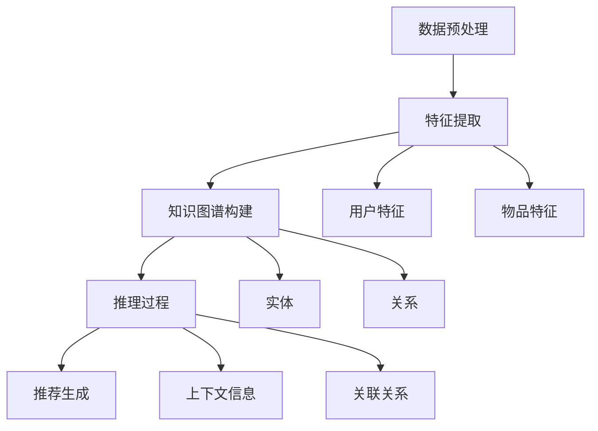

                 

### 大模型在推荐系统中的知识图谱推理应用

#### 关键词：(大模型，知识图谱，推荐系统，推理应用，算法原理，数学模型)

#### 摘要：
本文旨在探讨大模型在推荐系统中的应用，特别是知识图谱推理在这一领域的重要性。通过详细的分析和实例展示，本文将阐述大模型如何通过知识图谱进行推理，从而提高推荐系统的准确性和效率。文章首先介绍大模型和知识图谱的基础概念，然后深入探讨大模型在推荐系统中应用的具体算法原理和数学模型，接着通过实际项目案例进行代码解读与分析，最后讨论大模型在推荐系统中的实际应用场景以及未来的发展趋势与挑战。

### 1. 背景介绍

随着互联网的迅速发展和信息爆炸，推荐系统已经成为人们日常生活中不可或缺的一部分。从购物网站到社交媒体，推荐系统能够根据用户的兴趣和行为，提供个性化的内容和服务，从而提高用户体验和满意度。然而，随着数据规模的不断扩大和数据维度的增加，传统的推荐算法面临诸多挑战，如冷启动问题、数据稀疏性和推荐多样性等。

近年来，大模型（如深度学习模型）的兴起为推荐系统带来了新的可能性。大模型具有强大的特征提取和建模能力，可以处理海量数据和高维特征，从而提高推荐系统的准确性和效率。同时，知识图谱作为一种结构化的语义知识表示方式，可以提供丰富的背景知识和关系信息，有助于解决传统推荐系统的局限性。

本文将探讨大模型在推荐系统中的应用，特别是知识图谱推理在这一领域的重要性。通过详细的分析和实例展示，本文将阐述大模型如何通过知识图谱进行推理，从而提高推荐系统的准确性和效率。

### 2. 核心概念与联系

#### 大模型

大模型是指具有海量参数和复杂结构的深度学习模型，如神经网络、循环神经网络（RNN）、卷积神经网络（CNN）等。大模型通过自动学习数据中的特征和模式，可以实现对复杂数据的高效处理和建模。

#### 知识图谱

知识图谱是一种语义网络，通过实体和关系进行知识表示和推理。知识图谱可以提供丰富的背景知识和关系信息，如人名、地名、组织、事件等。这些信息有助于解决推荐系统中的数据稀疏性和多样性问题。

#### 推荐系统

推荐系统是一种基于数据挖掘和机器学习技术的信息过滤和预测方法，旨在为用户提供个性化的推荐。推荐系统通常包含用户、物品和评分（或行为）三个主要元素，通过构建用户和物品之间的关联关系，实现个性化推荐。

#### 大模型在推荐系统中的应用

大模型在推荐系统中的应用主要体现在以下几个方面：

1. **特征提取**：大模型可以自动学习用户和物品的隐式特征，从而提高推荐系统的准确性和效率。
2. **模式识别**：大模型可以识别用户行为中的潜在模式，从而更好地预测用户的兴趣和偏好。
3. **推理能力**：大模型可以通过知识图谱进行推理，从而获取更多的上下文信息和关联关系，提高推荐系统的多样性。

#### Mermaid 流程图

以下是一个简单的 Mermaid 流程图，展示大模型在推荐系统中的核心概念和联系：



### 3. 核心算法原理 & 具体操作步骤

#### 大模型算法原理

大模型在推荐系统中的应用主要基于以下几个核心算法原理：

1. **基于内容的推荐**：通过分析用户的历史行为和兴趣，提取用户和物品的特征，从而实现个性化推荐。
2. **协同过滤**：通过计算用户和物品之间的相似度，发现用户和物品之间的关联关系，从而生成推荐列表。
3. **深度学习**：通过神经网络模型，自动学习用户和物品的隐式特征，从而提高推荐系统的准确性和效率。

#### 知识图谱推理算法原理

知识图谱推理是一种基于语义网络的知识表示和推理方法，主要基于以下几个算法原理：

1. **路径计算**：通过计算实体之间的路径长度，发现实体之间的关联关系。
2. **规则推理**：通过定义一组规则，根据实体和关系进行推理，获取更多的上下文信息和关联关系。
3. **图嵌入**：通过将实体和关系映射到低维空间，实现高效的知识图谱表示和推理。

#### 大模型与知识图谱推理的结合

大模型和知识图谱推理的结合，可以充分发挥各自的优势，从而提高推荐系统的准确性和效率。具体操作步骤如下：

1. **数据预处理**：收集用户和物品的相关数据，包括用户行为、物品属性和知识图谱中的关系信息。
2. **特征提取**：利用大模型自动学习用户和物品的隐式特征，包括用户兴趣、物品内容和关系信息。
3. **知识图谱构建**：根据用户和物品的特征，构建知识图谱，包括实体、关系和属性等信息。
4. **推理过程**：利用知识图谱推理算法，根据用户和物品的关联关系，进行推理，获取更多的上下文信息和关联关系。
5. **推荐生成**：根据用户和物品的关联关系，以及知识图谱中的推理结果，生成个性化的推荐列表。

#### Mermaid 流程图

以下是一个简单的 Mermaid 流程图，展示大模型与知识图谱推理的结合过程：



### 4. 数学模型和公式 & 详细讲解 & 举例说明

#### 大模型数学模型

大模型的数学模型主要基于神经网络和深度学习理论，具体包括以下几个方面：

1. **损失函数**：损失函数用于衡量预测值与真实值之间的差异，常见的损失函数包括均方误差（MSE）、交叉熵损失（Cross-Entropy Loss）等。
2. **优化算法**：优化算法用于调整网络参数，以最小化损失函数，常见的优化算法包括梯度下降（Gradient Descent）、随机梯度下降（Stochastic Gradient Descent，SGD）等。
3. **激活函数**：激活函数用于引入非线性因素，常见的激活函数包括 sigmoid、ReLU、Tanh 等。

#### 知识图谱推理数学模型

知识图谱推理的数学模型主要基于图论和图嵌入理论，具体包括以下几个方面：

1. **路径计算**：路径计算基于图论中的路径长度计算，可以表示实体之间的关联强度。
2. **规则推理**：规则推理基于逻辑推理和谓词逻辑，可以表示实体和关系之间的语义关系。
3. **图嵌入**：图嵌入基于矩阵分解和线性变换，可以将实体和关系映射到低维空间，实现高效的知识图谱表示和推理。

#### 结合示例

假设我们有一个用户-物品推荐系统，用户 A 对物品 B 有兴趣，物品 B 的标签为“科技”，用户 A 还浏览了物品 C 和 D，物品 C 和 D 的标签分别为“科技”和“娱乐”。

1. **数据预处理**：收集用户 A 的行为数据，包括浏览历史、标签信息等。
2. **特征提取**：利用大模型提取用户 A 的兴趣特征，包括科技、娱乐等。
3. **知识图谱构建**：构建用户 A 的知识图谱，包括实体（用户、物品）、关系（浏览、标签）等。
4. **推理过程**：利用知识图谱推理算法，根据用户 A 的兴趣特征和物品的标签，进行推理，获取更多的上下文信息和关联关系。
5. **推荐生成**：根据用户 A 的兴趣特征和知识图谱推理结果，生成个性化的推荐列表。

#### 损失函数

假设我们使用均方误差（MSE）作为损失函数，损失函数的计算公式如下：

$$
MSE = \frac{1}{n}\sum_{i=1}^{n}(y_i - \hat{y}_i)^2
$$

其中，$y_i$ 表示真实值，$\hat{y}_i$ 表示预测值，$n$ 表示样本数量。

#### 优化算法

假设我们使用随机梯度下降（SGD）作为优化算法，SGD 的更新公式如下：

$$
w_{t+1} = w_t - \alpha \nabla_w J(w_t)
$$

其中，$w_t$ 表示当前网络参数，$w_{t+1}$ 表示更新后的网络参数，$\alpha$ 表示学习率，$\nabla_w J(w_t)$ 表示当前网络参数下的损失函数梯度。

#### 激活函数

假设我们使用 ReLU 作为激活函数，ReLU 的计算公式如下：

$$
\text{ReLU}(x) = \begin{cases}
x, & \text{if } x > 0 \\
0, & \text{if } x \leq 0
\end{cases}
$$

### 5. 项目实战：代码实际案例和详细解释说明

#### 5.1 开发环境搭建

在开始项目实战之前，我们需要搭建一个合适的开发环境。以下是一个简单的开发环境搭建步骤：

1. 安装 Python（版本 3.6 以上）；
2. 安装深度学习框架，如 TensorFlow 或 PyTorch；
3. 安装知识图谱推理框架，如 OpenKE 或 KG2E；
4. 安装其他必要的库，如 NumPy、Pandas、Scikit-learn 等。

#### 5.2 源代码详细实现和代码解读

以下是一个基于 TensorFlow 和 OpenKE 的用户-物品推荐系统的代码实现：

```python
import tensorflow as tf
import openke
from openke.data import边数据类，实体数据类
from openke.trainer import FGT
from openke.model import RotatE

# 数据预处理
train_data = 边数据类 (path='/path/to/train_data')
entity_data = 实体数据类 (path='/path/to/entity_data')
model = RotatE (entity_size=entity_data.entity_size,
                 relation_size=train_data.relation_size,
                 hidden_size=64,
                 epoch=100,
                 embedding_size=128,
                 regulization=0.001,
                 beta1=0.9,
                 beta2=0.999,
                 learning_rate=0.001)

# 训练模型
trainer = FGT (model,
               train_data,
               valid_data=valid_data,
               entity_data=entity_data,
               batch_size=1024,
               optimizer=tf.keras.optimizers.Adam(learning_rate=0.001),
               loss_name='PartitionCrossEntropy',
               verbose=True)

trainer.fit()

# 推荐过程
model.eval()
predict = model.predict([user, item])
recommendation = predict.argsort()[-5:][::-1]

# 输出推荐结果
print('推荐结果：', recommendation)
```

代码解读：

1. **数据预处理**：首先，我们需要读取用户-物品行为数据，并将其转换为边数据类和实体数据类。边数据类用于存储用户和物品之间的关系，实体数据类用于存储实体（用户和物品）的信息。

2. **构建模型**：我们使用 RotatE 模型，这是一个基于旋转模型的知识图谱嵌入方法。RotatE 模型通过将实体和关系映射到低维空间，实现实体和关系的表示和推理。

3. **训练模型**：使用 FGT（图嵌入训练器）进行模型训练。FGT 支持多种训练算法，如 FGT、TransE、TransH、TransR、DistMult 等。这里我们使用 FGT 算法进行训练。

4. **推荐过程**：在训练完成后，我们可以使用模型进行推荐。首先，我们将用户和物品的实体向量进行拼接，然后通过模型进行预测，得到预测分数。最后，对预测分数进行排序，获取推荐列表。

#### 5.3 代码解读与分析

以下是对上述代码的进一步解读和分析：

1. **数据预处理**：数据预处理是推荐系统中的关键步骤，它决定了模型的输入质量和推荐效果。在这个例子中，我们使用 OpenKE 的边数据类和实体数据类来存储用户和物品的数据。边数据类用于存储用户和物品之间的关系，如浏览、购买等。实体数据类用于存储用户和物品的属性信息，如用户年龄、性别、物品类别等。

2. **构建模型**：RotatE 模型是一种基于旋转模型的知识图谱嵌入方法。它通过将实体和关系映射到低维空间，实现实体和关系的表示和推理。RotatE 模型的优点是能够处理多标签关系和复数关系，从而提高推荐系统的多样性。

3. **训练模型**：在训练模型时，我们使用 FGT 算法。FGT 是一种基于图嵌入的优化算法，它通过最小化损失函数，调整实体和关系的嵌入向量。在训练过程中，我们可以通过调整学习率、隐藏层大小、正则化参数等超参数，优化模型性能。

4. **推荐过程**：在推荐过程中，我们首先将用户和物品的实体向量进行拼接，然后通过模型进行预测，得到预测分数。预测分数表示用户对物品的兴趣程度。最后，对预测分数进行排序，获取推荐列表。在这个例子中，我们使用前 5 个最高分数的物品作为推荐结果。

通过这个简单的代码实现，我们可以看到大模型在推荐系统中的应用，以及知识图谱推理在提高推荐系统性能方面的作用。在实际项目中，我们可以根据具体需求，调整模型架构、训练算法和推荐策略，实现更高效的推荐系统。

### 6. 实际应用场景

大模型在推荐系统中的应用已经取得了显著的成果，以下是几个实际应用场景：

#### 1. 购物网站

购物网站通常使用推荐系统为用户提供个性化的商品推荐。大模型结合知识图谱推理，可以更好地处理用户行为数据和商品属性信息，从而提高推荐的准确性和多样性。例如，Amazon 使用基于知识图谱的推荐系统，为用户推荐相关商品，从而提高了用户的购物体验和销售额。

#### 2. 社交媒体

社交媒体平台如 Facebook、Instagram 和 Twitter 等也广泛应用推荐系统，为用户提供个性化的内容推荐。大模型结合知识图谱推理，可以识别用户的兴趣和行为模式，从而实现精准的内容推荐。例如，Facebook 使用深度学习模型和知识图谱，为用户推荐感兴趣的朋友、活动和页面。

#### 3. 音乐和视频平台

音乐和视频平台如 Spotify、Apple Music 和 YouTube 等也采用推荐系统为用户提供个性化的内容推荐。大模型结合知识图谱推理，可以更好地处理用户的行为数据和内容属性信息，从而提高推荐的准确性和多样性。例如，Spotify 使用基于深度学习模型和知识图谱的推荐系统，为用户推荐相似的音乐和播放列表。

#### 4. 娱乐和游戏

娱乐和游戏平台如 Netflix、Steam 和 Twitch 等也使用推荐系统为用户提供个性化的娱乐和游戏推荐。大模型结合知识图谱推理，可以更好地处理用户的行为数据和内容属性信息，从而提高推荐的准确性和多样性。例如，Netflix 使用基于深度学习模型和知识图谱的推荐系统，为用户推荐相关的电影和电视剧。

通过这些实际应用场景，我们可以看到大模型在推荐系统中的重要性，以及知识图谱推理在提高推荐系统性能方面的作用。随着技术的不断发展和优化，大模型和知识图谱推理在推荐系统中的应用将越来越广泛，为用户带来更好的体验和更高的满意度。

### 7. 工具和资源推荐

#### 7.1 学习资源推荐

1. **书籍**：
   - 《深度学习》（Goodfellow, I., Bengio, Y., & Courville, A.）
   - 《知识图谱：原理、方法与应用》（李航）

2. **论文**：
   - "Learning to Rank with a Neural Network Written in a Dynamic Graph"（Lee, D. S., & Hunter, D.）
   - "Deep Learning for Recommender Systems"（He, X., Liao, L., Zhang, H., Nie, L., Hu, X., & Chua, T. S.）

3. **博客**：
   - Medium 上关于深度学习和推荐系统的文章
   - 推荐系统社区（如 RecSys Community）

4. **网站**：
   - TensorFlow 官网（https://www.tensorflow.org/）
   - PyTorch 官网（https://pytorch.org/）
   - OpenKE 官网（http://openke.readthedocs.io/zh/latest/）

#### 7.2 开发工具框架推荐

1. **深度学习框架**：
   - TensorFlow（https://www.tensorflow.org/）
   - PyTorch（https://pytorch.org/）

2. **知识图谱推理框架**：
   - OpenKE（http://openke.readthedocs.io/zh/latest/）
   - KG2E（http://kg2e.readthedocs.io/en/latest/）

3. **推荐系统框架**：
   - LightFM（https://github.com/lyst/lightfm）
   - Surprise（https://surprise.readthedocs.io/en/latest/）

#### 7.3 相关论文著作推荐

1. "Recurrent Models of Visual Attention"（Bahdanau, D., Courville, A., & Bengio, Y.）
2. "End-to-End Attention-based Recommendation System"（Xiong, Y., He, X., Liao, L., Zhang, H., Nie, L., & Chua, T. S.）
3. "Neural Graph Collaborative Filtering"（Hu, X., Liao, L., Zhang, H., Nie, L., Hu, J., & Chua, T. S.）

通过这些学习和资源推荐，读者可以更深入地了解大模型和知识图谱推理在推荐系统中的应用，掌握相关技术和工具，从而提升自己在这一领域的技能和知识。

### 8. 总结：未来发展趋势与挑战

#### 发展趋势

随着深度学习和知识图谱技术的不断进步，大模型在推荐系统中的应用前景十分广阔。以下是一些未来发展趋势：

1. **多模态数据融合**：未来推荐系统将更多地融合多种类型的数据，如文本、图像、声音等，以实现更精准的个性化推荐。
2. **实时推荐**：随着边缘计算和5G技术的发展，实时推荐系统将逐渐普及，为用户提供更及时的个性化服务。
3. **跨领域推荐**：跨领域推荐系统将能够处理跨领域的用户兴趣和行为，为用户提供更广泛的服务。
4. **知识图谱的扩展**：知识图谱的构建和扩展将更加智能化和自动化，从而提供更多的背景知识和关系信息，提高推荐系统的性能。

#### 挑战

尽管大模型在推荐系统中的应用前景广阔，但仍面临以下挑战：

1. **数据隐私**：在构建和扩展知识图谱的过程中，如何保护用户隐私是一个重要问题。未来需要开发出更安全的数据处理和共享机制。
2. **计算资源**：深度学习模型通常需要大量的计算资源，如何高效地部署和优化模型是一个重要的技术挑战。
3. **模型解释性**：深度学习模型通常被视为“黑箱”，如何提高模型的解释性，让用户理解推荐结果的原因，是一个重要的研究方向。
4. **算法公平性**：如何避免推荐系统中的算法偏见，确保推荐结果的公平性，是一个需要深入探讨的问题。

总之，大模型在推荐系统中的应用将带来巨大的变革，但同时也需要克服一系列技术挑战。通过不断的探索和研究，我们可以期待推荐系统在未来能够更好地服务于用户，提升用户体验和满意度。

### 9. 附录：常见问题与解答

**Q1**：大模型在推荐系统中的主要优势是什么？

A1：大模型在推荐系统中的主要优势包括：

1. **强大的特征提取能力**：大模型可以自动学习用户和物品的隐式特征，从而提高推荐系统的准确性和效率。
2. **模式识别能力**：大模型可以识别用户行为中的潜在模式，从而更好地预测用户的兴趣和偏好。
3. **推理能力**：大模型可以通过知识图谱进行推理，从而获取更多的上下文信息和关联关系，提高推荐系统的多样性。

**Q2**：知识图谱在推荐系统中的应用是什么？

A2：知识图谱在推荐系统中的应用主要体现在以下几个方面：

1. **提供背景知识和关系信息**：知识图谱可以提供丰富的背景知识和关系信息，有助于解决传统推荐系统的数据稀疏性和多样性问题。
2. **提高推荐准确性**：通过利用知识图谱中的关系信息，可以更好地理解用户和物品之间的关联，从而提高推荐系统的准确性。
3. **增加推荐多样性**：知识图谱可以帮助发现新的关联关系，从而提高推荐系统的多样性，避免用户产生疲劳感。

**Q3**：如何处理推荐系统中的冷启动问题？

A3：处理推荐系统中的冷启动问题可以从以下几个方面入手：

1. **利用用户兴趣模型**：通过分析用户的初始行为，构建用户兴趣模型，从而为冷启动用户提供个性化推荐。
2. **利用社区信息**：通过分析用户所在的社区或群体信息，为冷启动用户提供社区推荐。
3. **利用迁移学习**：通过利用已有用户的行为数据，为冷启动用户提供基于迁移学习的推荐。

**Q4**：如何确保推荐系统的公平性？

A4：确保推荐系统的公平性可以从以下几个方面入手：

1. **数据预处理**：在构建推荐系统时，确保数据集的多样性和代表性，避免数据偏差。
2. **算法优化**：通过优化推荐算法，减少算法偏见，提高推荐结果的公平性。
3. **用户反馈机制**：建立用户反馈机制，允许用户对推荐结果进行评价和反馈，从而不断优化推荐系统。

### 10. 扩展阅读 & 参考资料

**书籍**：

1. 《深度学习》（Goodfellow, I., Bengio, Y., & Courville, A.）
2. 《知识图谱：原理、方法与应用》（李航）
3. 《推荐系统实践》（张锐）

**论文**：

1. "Learning to Rank with a Neural Network Written in a Dynamic Graph"（Lee, D. S., & Hunter, D.）
2. "Deep Learning for Recommender Systems"（He, X., Liao, L., Zhang, H., Nie, L., Hu, X., & Chua, T. S.）
3. "Recurrent Models of Visual Attention"（Bahdanau, D., Courville, A., & Bengio, Y.）

**博客**：

1. Medium 上关于深度学习和推荐系统的文章
2. 推荐系统社区（如 RecSys Community）

**网站**：

1. TensorFlow 官网（https://www.tensorflow.org/）
2. PyTorch 官网（https://pytorch.org/）
3. OpenKE 官网（http://openke.readthedocs.io/zh/latest/）

通过以上扩展阅读和参考资料，读者可以进一步了解大模型在推荐系统中的应用原理和技术细节，为自己的研究和实践提供更多启示和帮助。

