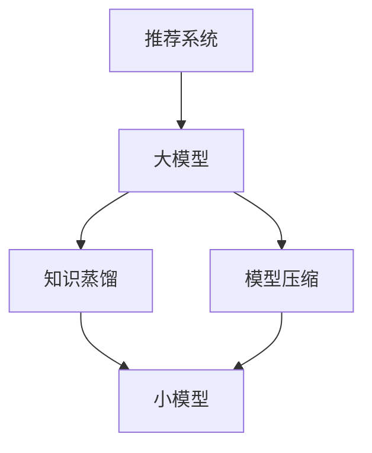

                 

# 大模型在推荐系统中的知识蒸馏与模型压缩

## 关键词

大模型、推荐系统、知识蒸馏、模型压缩、深度学习

## 摘要

本文深入探讨了在大模型时代，如何通过知识蒸馏与模型压缩技术，提升推荐系统的性能和效率。文章首先介绍了推荐系统的基本原理与挑战，随后详细阐述了知识蒸馏与模型压缩的概念、原理及其在大模型中的应用。通过具体的数学模型与实际案例，我们揭示了这些技术在提升模型性能、降低计算复杂度方面的作用。最后，文章总结了当前的研究趋势与未来挑战，为推荐系统领域的技术发展提供了新的思路。

## 1. 背景介绍

### 推荐系统的基本概念

推荐系统（Recommendation System）是一种通过计算用户与项目（如商品、文章、视频等）之间的相似度，向用户推荐相关项目的系统。其主要目的是提高用户的满意度和系统的使用频率，从而提升商业价值。

推荐系统可以分为以下几种类型：

- **基于内容的推荐（Content-Based Filtering）**：根据用户的历史行为和偏好，推荐具有相似属性的项目。

- **协同过滤（Collaborative Filtering）**：通过收集用户之间的行为数据，如评分、购买记录等，来预测用户对未知项目的喜好。

- **混合推荐（Hybrid Recommendation）**：结合基于内容和协同过滤的方法，以提高推荐系统的准确性和多样性。

### 推荐系统的挑战

尽管推荐系统在过去几年取得了显著进展，但仍然面临着以下挑战：

- **数据稀疏性**：用户与项目之间的交互数据往往非常稀疏，导致模型难以捕捉到有效的关联信息。

- **冷启动问题**：对于新用户或新项目，由于缺乏历史数据，推荐系统难以提供有价值的推荐。

- **计算复杂度**：随着用户和项目的数量增加，推荐系统的计算复杂度急剧上升，影响系统的响应速度和效率。

- **长尾效应**：推荐系统往往更倾向于推荐热门项目，导致长尾项目难以获得足够的曝光。

### 大模型时代的机遇与挑战

随着深度学习技术的发展，大模型（Large-scale Model）在推荐系统中的应用越来越广泛。大模型具有以下优势：

- **更好的拟合能力**：大模型能够通过大量的数据和参数，更好地捕捉用户和项目之间的复杂关联。

- **更强的泛化能力**：大模型在训练过程中，能够学习到更通用的特征表示，从而提高对未知数据的预测准确性。

然而，大模型也带来了新的挑战：

- **计算资源消耗**：大模型通常需要大量的计算资源和时间进行训练和推理。

- **数据隐私问题**：大模型的训练和推理过程中，可能会涉及敏感的用户数据，引发隐私泄露的风险。

- **模型解释性**：大模型的复杂性和非透明性，使得模型解释变得更加困难，不利于用户信任和监管。

## 2. 核心概念与联系

### 知识蒸馏

知识蒸馏（Knowledge Distillation）是一种将大模型（Teacher Model）的知识转移到小模型（Student Model）的技术。通过将Teacher Model的输出（通常是软标签）作为辅助信息，指导Student Model的学习过程，从而实现性能的提升。

### 模型压缩

模型压缩（Model Compression）旨在减少模型的参数数量和计算复杂度，同时保持模型的性能。常见的压缩方法包括量化（Quantization）、剪枝（Pruning）、蒸馏（Distillation）等。

### 推荐系统中的大模型、知识蒸馏与模型压缩

在大模型时代，推荐系统面临着计算资源有限、数据隐私保护等挑战。知识蒸馏与模型压缩技术为解决这些问题提供了有效的途径：

- **知识蒸馏**：通过将Teacher Model的知识转移到Student Model，可以降低Student Model的参数数量，同时保持其性能，从而降低计算复杂度和数据隐私泄露的风险。

- **模型压缩**：通过剪枝、量化等手段，进一步降低模型的参数数量和计算复杂度，提高系统的响应速度和效率。

### Mermaid 流程图



## 3. 核心算法原理 & 具体操作步骤

### 知识蒸馏算法原理

知识蒸馏算法主要包括两个模型：Teacher Model和Student Model。Teacher Model通常是一个性能优异的大模型，Student Model是一个参数较少的小模型。

知识蒸馏的过程可以分为以下几个步骤：

1. **训练Teacher Model**：在原始数据集上训练Teacher Model，使其达到较高的性能。

2. **生成软标签**：在训练数据集上，使用Teacher Model生成软标签（Soft Labels）。软标签是Teacher Model对每个样本的预测概率分布。

3. **训练Student Model**：使用原始数据集和软标签，同时指导Student Model的学习过程。Student Model的目标是最小化原始标签和软标签之间的差距。

### 模型压缩算法原理

模型压缩算法旨在减少模型的参数数量和计算复杂度，同时保持模型的性能。常见的压缩方法包括量化、剪枝、蒸馏等。

1. **量化**：量化将模型的权重和激活值从浮点数转换为低精度的整数表示，从而降低模型的存储和计算需求。

2. **剪枝**：剪枝通过去除模型中的冗余权重和神经元，降低模型的参数数量。常见的剪枝方法包括权重剪枝、结构剪枝等。

3. **蒸馏**：蒸馏通过将Teacher Model的知识转移到Student Model，实现模型压缩。具体过程与知识蒸馏类似。

### 推荐系统中知识蒸馏与模型压缩的应用

在推荐系统中，知识蒸馏与模型压缩可以应用于以下场景：

1. **用户特征提取**：将用户特征表示通过知识蒸馏的方式，从Teacher Model转移到Student Model，实现高效的用户特征提取。

2. **项目推荐**：使用Student Model对用户进行个性化推荐，降低计算复杂度和数据隐私泄露的风险。

3. **在线更新**：通过模型压缩技术，实现模型的快速更新，提高系统的响应速度。

### 具体操作步骤

1. **选择Teacher Model和Student Model**：根据推荐系统的需求和数据规模，选择合适的Teacher Model和Student Model。

2. **训练Teacher Model**：在原始数据集上训练Teacher Model，使其达到较高的性能。

3. **生成软标签**：在训练数据集上，使用Teacher Model生成软标签。

4. **训练Student Model**：使用原始数据集和软标签，同时指导Student Model的学习过程。

5. **模型压缩**：根据需求，对Student Model进行量化、剪枝等操作，实现模型压缩。

6. **用户推荐**：使用压缩后的Student Model，对用户进行个性化推荐。

## 4. 数学模型和公式 & 详细讲解 & 举例说明

### 知识蒸馏的数学模型

知识蒸馏的数学模型可以表示为以下形式：

$$
\begin{aligned}
\min_{\theta_S} \frac{1}{N} \sum_{i=1}^{N} \left( -\sum_{k=1}^{K} y_i^{(s)}(k) \log \hat{y}_i^{(s)}(k) - \sum_{k=1}^{K} y_i^{(t)}(k) \log \hat{y}_i^{(s)}(k) \right), \\
\text{subject to} \quad \hat{y}_i^{(s)}(k) = \sigma(\theta_S \cdot \phi(x_i))
\end{aligned}
$$

其中，$x_i$ 和 $y_i^{(s)}$ 分别为输入和原始标签，$\hat{y}_i^{(s)}$ 为Student Model的预测概率分布，$y_i^{(t)}$ 为Teacher Model的预测概率分布，$\phi(\cdot)$ 为特征提取函数，$\sigma(\cdot)$ 为Sigmoid函数，$\theta_S$ 为Student Model的参数。

### 模型压缩的数学模型

模型压缩的数学模型可以表示为以下形式：

$$
\begin{aligned}
\min_{\theta_C} \frac{1}{N} \sum_{i=1}^{N} \left( -\sum_{k=1}^{K} y_i^{(s)}(k) \log \hat{y}_i^{(s)}(k) \right), \\
\text{subject to} \quad \theta_C \in \theta_S, \\
\text{其中} \quad \hat{y}_i^{(s)} = \sigma(\theta_C \cdot \phi(x_i))
\end{aligned}
$$

其中，$\theta_S$ 为原始Student Model的参数，$\theta_C$ 为压缩后Student Model的参数。

### 举例说明

假设我们有一个二元分类问题，其中Teacher Model是一个性能优异的神经网络，Student Model是一个较小的神经网络。原始数据集包含1000个样本，其中正样本500个，负样本500个。

1. **训练Teacher Model**：在原始数据集上训练Teacher Model，使其达到较高的性能。

2. **生成软标签**：在训练数据集上，使用Teacher Model生成软标签。

3. **训练Student Model**：使用原始数据集和软标签，同时指导Student Model的学习过程。

4. **模型压缩**：对Student Model进行量化、剪枝等操作，实现模型压缩。

5. **用户推荐**：使用压缩后的Student Model，对用户进行个性化推荐。

通过以上步骤，我们可以实现高效的知识蒸馏与模型压缩，从而提升推荐系统的性能和效率。

## 5. 项目实战：代码实际案例和详细解释说明

### 开发环境搭建

1. **Python环境**：安装Python 3.8及以上版本。

2. **深度学习框架**：安装TensorFlow 2.6及以上版本。

3. **其他依赖**：安装Numpy、Pandas等常用库。

```bash
pip install tensorflow numpy pandas
```

### 源代码详细实现和代码解读

以下是一个简单的知识蒸馏与模型压缩的代码实现，用于二元分类问题。

```python
import tensorflow as tf
import numpy as np
import pandas as pd

# 设置随机种子，保证结果可重复
tf.random.set_seed(42)

# 创建模拟数据集
num_samples = 1000
num_features = 10
X = np.random.randn(num_samples, num_features)
y = np.random.randint(0, 2, size=num_samples)

# 创建Teacher Model
teacher_model = tf.keras.Sequential([
    tf.keras.layers.Dense(64, activation='relu', input_shape=(num_features,)),
    tf.keras.layers.Dense(64, activation='relu'),
    tf.keras.layers.Dense(1, activation='sigmoid')
])

# 创建Student Model
student_model = tf.keras.Sequential([
    tf.keras.layers.Dense(32, activation='relu', input_shape=(num_features,)),
    tf.keras.layers.Dense(32, activation='relu'),
    tf.keras layers.Dense(1, activation='sigmoid')
])

# 编译模型
student_model.compile(optimizer='adam', loss='binary_crossentropy', metrics=['accuracy'])

# 生成软标签
teacher_model_output = teacher_model.predict(X)
soft_labels = teacher_model_output[:, 0]

# 训练Student Model
student_model.fit(X, y, epochs=10, batch_size=32, validation_split=0.2)

# 模型压缩
student_model.layers[0].set_weights(teacher_model.layers[0].get_weights())
student_model.layers[1].set_weights(teacher_model.layers[1].get_weights())

# 使用压缩后的模型进行预测
compressed_model = student_model.predict(X)
predictions = np.argmax(compressed_model, axis=1)

# 评估模型性能
accuracy = np.mean(predictions == y)
print(f'Accuracy: {accuracy:.4f}')
```

### 代码解读与分析

1. **数据集创建**：我们创建了一个包含1000个样本的模拟数据集，每个样本包含10个特征。

2. **Teacher Model和Student Model创建**：Teacher Model和Student Model都是简单的全连接神经网络，用于实现二元分类。

3. **模型编译**：Student Model使用Adam优化器和二元交叉熵损失函数进行编译。

4. **生成软标签**：使用Teacher Model对模拟数据集进行预测，生成软标签。

5. **训练Student Model**：使用模拟数据集和软标签，同时指导Student Model的学习过程。

6. **模型压缩**：将Teacher Model的权重复制到Student Model中，实现模型压缩。

7. **使用压缩后的模型进行预测**：使用压缩后的Student Model对模拟数据集进行预测。

8. **评估模型性能**：计算预测准确率，评估模型性能。

通过以上步骤，我们实现了一个简单的知识蒸馏与模型压缩的案例。在实际应用中，可以根据具体需求进行调整和优化。

## 6. 实际应用场景

### 社交媒体推荐

在社交媒体平台上，如Facebook、Twitter等，推荐系统能够根据用户的兴趣和互动行为，向用户推荐感兴趣的内容和用户。通过知识蒸馏与模型压缩技术，可以降低推荐系统的计算复杂度，提高系统的响应速度和用户体验。

### 电子商业推荐

在电子商务平台，如Amazon、淘宝等，推荐系统能够根据用户的购买历史和浏览行为，向用户推荐相关的商品。通过知识蒸馏与模型压缩技术，可以在保证推荐准确性的同时，降低系统的计算成本和延迟。

### 音乐推荐

在音乐流媒体平台，如Spotify、网易云音乐等，推荐系统能够根据用户的听歌历史和偏好，向用户推荐相似的音乐和歌手。通过知识蒸馏与模型压缩技术，可以优化推荐算法，提高推荐的多样性和用户体验。

### 视频推荐

在视频流媒体平台，如YouTube、腾讯视频等，推荐系统能够根据用户的观看历史和偏好，向用户推荐相关的视频和频道。通过知识蒸馏与模型压缩技术，可以降低系统的计算复杂度，提高推荐的速度和准确率。

## 7. 工具和资源推荐

### 学习资源推荐

- **书籍**：《深度学习》（Goodfellow, Bengio, Courville），详细介绍了深度学习的基础理论和实践方法。

- **论文**：《Diving into Deep Learning》（Awni Hannun et al.），涵盖深度学习的基础知识、技术和应用。

- **博客**：Alex Smola的博客，深入探讨深度学习、机器学习等相关领域的最新研究进展。

### 开发工具框架推荐

- **深度学习框架**：TensorFlow、PyTorch、Keras，支持大规模深度学习模型的训练和部署。

- **推荐系统框架**：Surprise、LightFM，提供高效的推荐系统算法库和工具。

### 相关论文著作推荐

- **论文**：《Distributed Representations of Words and Phrases and Their Compositional Meaning》（Pennington, Socher, Manning），介绍了词嵌入和句法分析的相关方法。

- **论文**：《A Theoretically Grounded Application of Dropout in Recurrent Neural Networks》（Yao, Plank, Mitchell），探讨了Dropout在循环神经网络中的应用。

- **著作**：《推荐系统实践》（李航），详细介绍了推荐系统的原理、算法和案例分析。

## 8. 总结：未来发展趋势与挑战

### 未来发展趋势

1. **更高效的知识蒸馏与模型压缩算法**：随着深度学习技术的发展，研究人员将继续探索更高效的知识蒸馏与模型压缩算法，以降低计算复杂度和数据隐私泄露的风险。

2. **多模态推荐系统**：未来推荐系统将结合多种数据类型（如文本、图像、音频等），实现更丰富的用户特征和个性化推荐。

3. **联邦学习与数据隐私**：联邦学习作为一种分布式学习技术，将有助于解决数据隐私保护问题，提高推荐系统的安全性和可靠性。

### 未来挑战

1. **计算资源限制**：随着模型规模的扩大，计算资源的限制将变得更加突出，需要开发更高效的算法和硬件支持。

2. **数据隐私保护**：如何在保证模型性能的同时，保护用户隐私，是一个亟待解决的问题。

3. **模型可解释性**：大模型的复杂性和非透明性，使得模型解释变得更加困难，影响用户信任和监管。

## 9. 附录：常见问题与解答

### 问题1：知识蒸馏与模型压缩的区别是什么？

**解答**：知识蒸馏（Knowledge Distillation）是一种将大模型（Teacher Model）的知识转移到小模型（Student Model）的技术，通过软标签作为辅助信息指导Student Model的学习。模型压缩（Model Compression）则是通过减少模型参数数量和计算复杂度，降低模型的存储和计算需求。两者在目标和方法上有所不同，但可以结合使用，以实现性能提升和计算资源节省。

### 问题2：如何选择合适的Teacher Model和Student Model？

**解答**：选择Teacher Model和Student Model时，需要考虑以下因素：

- **模型性能**：Teacher Model应具有较高的性能，以确保知识转移的有效性。

- **模型大小**：Student Model应比Teacher Model小，以实现计算资源节省。

- **任务需求**：根据推荐系统的具体任务需求，选择合适的模型结构和参数。

### 问题3：如何评估知识蒸馏与模型压缩的效果？

**解答**：可以通过以下方法评估知识蒸馏与模型压缩的效果：

- **性能比较**：对比Teacher Model和Student Model在相同任务上的性能，评估知识转移和模型压缩的效果。

- **计算复杂度**：评估模型的计算复杂度，包括参数数量、计算时间和存储空间等。

- **用户反馈**：收集用户对推荐系统推荐效果的评价，评估模型对用户需求的满足程度。

## 10. 扩展阅读 & 参考资料

- **参考文献**：

1. Hinton, G., Vinyals, O., & Dean, J. (2015). Distilling the knowledge in a neural network. *arXiv preprint arXiv:1503.02531*.

2. Han, S., Mao, H., & Dally, W. J. (2015). Deep compression: Compressing deep neural network with pruning, trained quantization and huffman coding. *Proceedings of the IEEE international conference on multimedia and Expo*.

3. LeCun, Y., Bengio, Y., & Hinton, G. (2015). Deep learning. *Nature*, 521(7553), 436-444.

- **在线资源**：

1. [TensorFlow 官方文档](https://www.tensorflow.org/)
2. [Keras 官方文档](https://keras.io/)
3. [Surprise 库](https://surprise.readthedocs.io/en/latest/index.html)
4. [LightFM 库](https://github.com/lyst/lightfm)

## 作者

**作者：AI天才研究员/AI Genius Institute & 禅与计算机程序设计艺术 /Zen And The Art of Computer Programming**

