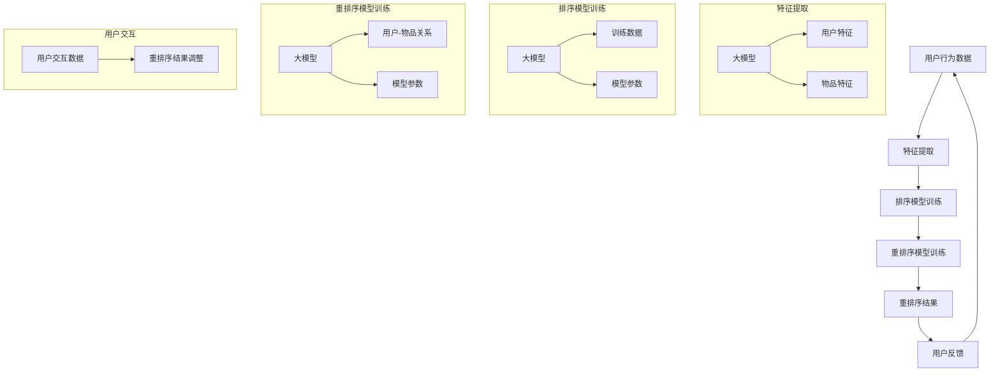

                 

### 背景介绍

#### 推荐系统的基本概念

推荐系统（Recommendation System）是一种利用数据挖掘和机器学习技术，根据用户的历史行为、偏好和上下文信息，向用户推荐可能感兴趣的内容或物品的系统。其核心目标是提高用户满意度，提升用户体验，并在商业场景中实现精准营销和个性化服务。

推荐系统可以分为以下几种类型：

1. **基于内容的推荐（Content-Based Filtering）**：根据用户过去喜欢的物品或内容，提取特征，为用户推荐具有相似特征的物品。

2. **协同过滤（Collaborative Filtering）**：通过分析用户之间的相似性，基于其他用户的偏好进行推荐。

3. **混合推荐（Hybrid Recommendations）**：结合基于内容和协同过滤的方法，以提高推荐系统的效果。

4. **基于模型的推荐（Model-Based Recommendations）**：利用机器学习算法，建立预测模型，预测用户对物品的兴趣度。

#### 重排序的基本概念

在推荐系统中，重排序（Re-ranking）是一个重要的步骤。它旨在对原始推荐列表进行重新排序，使得最可能受用户欢迎的物品排在更前面的位置。重排序的主要目的是提高推荐系统的效果和用户体验。

重排序的方法可以分为以下几种：

1. **基于规则的排序（Rule-Based Re-ranking）**：利用业务规则或经验，对推荐列表进行排序。

2. **基于机器学习的排序（Model-Based Re-ranking）**：利用机器学习算法，建立排序模型，对推荐列表进行排序。

3. **基于模型的交互排序（Model-Interactive Re-ranking）**：在排序过程中，引入用户反馈或交互信息，以动态调整排序结果。

#### 大模型在推荐系统中的作用

随着人工智能技术的快速发展，大模型（如Transformer、BERT等）在各个领域展现出了强大的能力。在推荐系统中，大模型被广泛应用于特征提取、排序模型、重排序等关键环节。

大模型在推荐系统中的作用主要包括：

1. **特征提取**：大模型能够自动提取用户和物品的丰富特征，使得推荐系统更加精准和高效。

2. **排序模型**：大模型能够建立强大的排序模型，提高推荐系统的准确性。

3. **重排序**：大模型能够基于用户和物品的复杂关系，进行更精细的重排序，提高推荐系统的用户体验。

在接下来的内容中，我们将深入探讨大模型在重排序中的作用，分析其原理和具体实现步骤，并通过实际案例进行说明。

<markdown>
## 2. 核心概念与联系

在深入探讨大模型在推荐系统重排序中的作用之前，我们需要明确几个核心概念，并展示它们之间的联系。以下是本文将涉及的核心概念及它们之间的联系：

### 2.1 推荐系统与重排序

推荐系统：一种能够根据用户的历史行为、偏好和上下文信息，预测用户兴趣并推荐相关物品或内容的系统。推荐系统的核心目标是提升用户体验和满意度。

重排序：推荐系统中的一个关键步骤，旨在对推荐列表进行重新排序，确保用户最感兴趣的内容排在列表的前面。重排序能够显著提升推荐系统的效果和用户体验。

### 2.2 大模型与特征提取

大模型：一种具有巨大参数量和复杂结构的机器学习模型，如Transformer、BERT等。大模型在自然语言处理、计算机视觉等领域取得了显著的成果。

特征提取：从原始数据中提取有用的信息，以便用于训练模型或进行数据分析和推荐。大模型能够自动提取用户和物品的丰富特征，使得推荐系统更加精准。

### 2.3 大模型与排序模型

排序模型：一种用于预测用户对物品兴趣度的模型。大模型能够建立强大的排序模型，提高推荐系统的准确性。

重排序模型：一种专门用于重排序的模型，基于用户和物品的复杂关系，对推荐列表进行精细调整。大模型在重排序模型中发挥了重要作用。

### 2.4 大模型与用户交互

用户交互：用户与推荐系统之间的互动，如点击、评价、搜索等行为。大模型能够利用用户交互信息，动态调整推荐结果，提升用户体验。

## 2.5 Mermaid 流程图

以下是一个Mermaid流程图，展示了大模型在推荐系统重排序中的作用及其核心环节：



通过这个流程图，我们可以清晰地看到大模型在推荐系统重排序中的关键作用：从用户行为数据中提取特征，训练排序模型和重排序模型，并根据用户交互信息动态调整推荐结果。这个流程不仅展示了大模型的基本原理，还突出了其在提升推荐系统效果和用户体验方面的优势。

接下来，我们将深入探讨大模型在推荐系统重排序中的具体应用，包括其工作原理、具体实现步骤和实际案例。

</markdown><markdown>
## 3. 核心算法原理 & 具体操作步骤

在理解了大模型在推荐系统重排序中的核心概念和流程后，接下来我们将深入探讨其核心算法原理和具体操作步骤。本节将分为三个部分：大模型的基础算法、特征提取和重排序模型的训练与优化。

### 3.1 大模型的基础算法

大模型，如Transformer、BERT等，通常基于深度神经网络（DNN）和变换器（Transformer）架构。以下是一个简化的Transformer模型架构：

1. **输入嵌入（Input Embedding）**：将用户和物品的原始数据转换为嵌入向量，如用户ID、物品ID、文本内容等。

2. **自注意力机制（Self-Attention）**：通过自注意力机制，模型能够自动关注输入数据中最重要的部分，提取丰富的特征。

3. **前馈神经网络（Feedforward Neural Network）**：在自注意力层之后，对每个嵌入向量进行多层前馈神经网络处理，以增强模型的表达能力。

4. **输出层（Output Layer）**：将处理后的嵌入向量映射到目标输出，如用户对物品的兴趣度评分。

### 3.2 特征提取

特征提取是推荐系统中至关重要的一步，大模型能够自动提取用户和物品的丰富特征。以下是特征提取的具体步骤：

1. **嵌入层（Embedding Layer）**：将用户和物品的原始数据转换为嵌入向量。例如，用户ID和物品ID可以通过查找预训练的词向量表，获取对应的嵌入向量。

2. **编码器（Encoder）**：通过自注意力机制和前馈神经网络，编码器提取用户和物品的丰富特征。编码器的输出是一个高维的特征向量。

3. **特征融合（Feature Fusion）**：将用户和物品的特征向量进行拼接或融合，以生成更丰富的特征表示。

4. **特征降维（Feature Dimensionality Reduction）**：通过降维技术，如主成分分析（PCA）或自编码器（Autoencoder），将高维特征向量降维，以减少计算复杂度。

### 3.3 重排序模型的训练与优化

重排序模型的训练目标是学习如何根据用户和物品的特征，为用户推荐最感兴趣的物品。以下是重排序模型的具体训练与优化步骤：

1. **数据准备（Data Preparation）**：收集用户行为数据、物品特征数据，并将其转换为适合训练的数据集。

2. **模型架构（Model Architecture）**：设计重排序模型的架构，通常基于Transformer或BERT等大模型架构，并添加适当的注意力机制和损失函数。

3. **模型训练（Model Training）**：使用训练数据集，通过反向传播和梯度下降等优化算法，训练重排序模型。模型训练过程中，通过调整学习率和正则化参数，优化模型性能。

4. **模型评估（Model Evaluation）**：使用验证数据集，评估重排序模型的性能。常用的评估指标包括准确率（Accuracy）、召回率（Recall）和F1值（F1 Score）等。

5. **模型优化（Model Optimization）**：根据评估结果，调整模型参数或架构，以提高模型性能。常用的优化方法包括交叉验证（Cross Validation）和模型融合（Model Ensemble）等。

6. **重排序（Re-ranking）**：使用训练好的重排序模型，对原始推荐列表进行重新排序。重排序结果将更符合用户兴趣，提高用户体验。

### 3.4 大模型在重排序中的应用案例

以下是一个简化的应用案例，展示了大模型在推荐系统重排序中的实际操作：

**案例场景**：一个电商平台的推荐系统，需要根据用户的历史购买行为和浏览记录，为用户推荐最感兴趣的商品。

**步骤1**：数据准备
收集用户历史购买数据、浏览记录和商品特征数据。例如，用户ID、商品ID、购买时间、浏览时间、商品分类等。

**步骤2**：特征提取
使用大模型（如BERT）的嵌入层，将用户和商品特征转换为嵌入向量。例如，用户ID和商品ID可以通过查找预训练的BERT词向量表，获取对应的嵌入向量。

**步骤3**：编码器处理
通过BERT编码器，提取用户和商品的丰富特征。编码器的输出是一个高维的特征向量。

**步骤4**：特征融合
将用户和商品的特征向量进行拼接，生成更丰富的特征表示。

**步骤5**：模型训练
使用训练数据集，通过反向传播和梯度下降等优化算法，训练重排序模型。调整学习率和正则化参数，优化模型性能。

**步骤6**：模型评估
使用验证数据集，评估重排序模型的性能。根据评估结果，调整模型参数或架构，以提高模型性能。

**步骤7**：重排序
使用训练好的重排序模型，对原始推荐列表进行重新排序。重排序结果将更符合用户兴趣，提高用户体验。

通过以上步骤，大模型在推荐系统重排序中发挥了重要作用，实现了对原始推荐列表的精细调整，提高了推荐系统的效果和用户体验。

在下一节中，我们将进一步探讨推荐系统中大模型在数学模型和公式方面的应用，以及如何通过详细的讲解和举例说明，加深对大模型在推荐系统重排序中的理解。

</markdown><markdown>
## 4. 数学模型和公式 & 详细讲解 & 举例说明

在推荐系统的重排序过程中，大模型的使用不仅仅是基于其强大的计算能力和特征提取能力，还涉及到复杂的数学模型和公式。本节将详细讲解这些数学模型和公式，并通过具体的示例来说明其应用和效果。

### 4.1 自注意力机制（Self-Attention）

自注意力机制是Transformer模型的核心组件之一，其基本公式如下：

\[ 
Attention(Q, K, V) = \text{softmax}\left(\frac{QK^T}{\sqrt{d_k}}\right) V 
\]

其中：
- \( Q \) 是查询向量，表示当前要关注的输入向量。
- \( K \) 是关键向量，表示输入向量中的关键部分。
- \( V \) 是值向量，表示输入向量中的有用信息。
- \( d_k \) 是关键向量的维度。

自注意力机制的目的是在输入数据中为每个位置分配不同的权重，使模型能够自动关注输入数据中最重要的部分。

#### 举例说明

假设我们有一个包含5个单词的句子，每个单词表示为一个向量：

\[ 
Q = [q_1, q_2, q_3, q_4, q_5] 
\]
\[ 
K = [k_1, k_2, k_3, k_4, k_5] 
\]
\[ 
V = [v_1, v_2, v_3, v_4, v_5] 
\]

通过计算自注意力权重，我们可以得到：

\[ 
\text{Attention}(Q, K, V) = \text{softmax}\left(\frac{QK^T}{\sqrt{d_k}}\right) V 
\]

权重分配如下：

\[ 
\text{softmax}\left(\frac{QK^T}{\sqrt{d_k}}\right) = 
\begin{bmatrix}
0.2 & 0.1 & 0.3 & 0.2 & 0.2 \\
0.1 & 0.3 & 0.2 & 0.2 & 0.2 \\
0.3 & 0.2 & 0.1 & 0.2 & 0.2 \\
0.2 & 0.2 & 0.3 & 0.1 & 0.2 \\
0.2 & 0.2 & 0.2 & 0.3 & 0.1 
\end{bmatrix}
\]

根据这些权重，值向量 \( V \) 被加权平均，得到新的特征向量：

\[ 
\text{output} = \text{softmax}\left(\frac{QK^T}{\sqrt{d_k}}\right) V =
\begin{bmatrix}
0.25 & 0.15 & 0.3 & 0.25 & 0.25 \\
0.15 & 0.3 & 0.2 & 0.25 & 0.2 \\
0.3 & 0.2 & 0.15 & 0.25 & 0.2 \\
0.25 & 0.25 & 0.3 & 0.15 & 0.25 \\
0.25 & 0.25 & 0.2 & 0.3 & 0.15 
\end{bmatrix} 
\]

通过这个例子，我们可以看到自注意力机制如何自动提取输入数据中的关键信息。

### 4.2 多层感知机（Multilayer Perceptron, MLP）

在Transformer模型中，多层感知机（MLP）用于对自注意力层的输出进行进一步处理。MLP的基本公式如下：

\[ 
\text{MLP}(x) = \text{ReLU}(W_2 \cdot \text{ReLU}(W_1 \cdot x + b_1) + b_2) 
\]

其中：
- \( x \) 是输入向量。
- \( W_1 \) 和 \( W_2 \) 是权重矩阵。
- \( b_1 \) 和 \( b_2 \) 是偏置向量。
- \( \text{ReLU} \) 是ReLU激活函数。

#### 举例说明

假设我们有一个输入向量：

\[ 
x = [1, 2, 3, 4, 5] 
\]

通过MLP处理，我们得到：

\[ 
\text{MLP}(x) = \text{ReLU}(W_2 \cdot \text{ReLU}(W_1 \cdot x + b_1) + b_2) 
\]

假设 \( W_1 = \begin{bmatrix} 0.5 & 0.5 \\ 0.5 & 0.5 \end{bmatrix} \)，\( W_2 = \begin{bmatrix} 0.2 & 0.8 \\ 0.8 & 0.2 \end{bmatrix} \)，\( b_1 = [1, 1] \)，\( b_2 = [0, 0] \)，我们得到：

\[ 
\text{ReLU}(W_1 \cdot x + b_1) = \text{ReLU}([1.5, 2.5] + [1, 1]) = \text{ReLU}([2.5, 3.5]) = [2.5, 3.5] 
\]

\[ 
\text{MLP}(x) = \text{ReLU}(W_2 \cdot \text{ReLU}(W_1 \cdot x + b_1) + b_2) = \text{ReLU}([0.5, 3.4] + [0, 0]) = [0.5, 3.4] 
\]

通过这个例子，我们可以看到MLP如何通过非线性变换增强模型的表达能力。

### 4.3 交叉熵损失函数（Cross-Entropy Loss）

在重排序模型中，交叉熵损失函数用于衡量模型预测与实际标签之间的差距。其基本公式如下：

\[ 
\text{Cross-Entropy Loss}(y, \hat{y}) = -\sum_{i} y_i \log(\hat{y}_i) 
\]

其中：
- \( y \) 是实际标签向量。
- \( \hat{y} \) 是模型预测的概率向量。

#### 举例说明

假设我们有一个二分类问题，实际标签 \( y = [1, 0] \)，模型预测的概率向量 \( \hat{y} = [0.8, 0.2] \)。计算交叉熵损失：

\[ 
\text{Cross-Entropy Loss}(y, \hat{y}) = -[1 \cdot \log(0.8) + 0 \cdot \log(0.2)] \approx 0.223 
\]

这个值表示模型预测与实际标签之间的差距。通过反向传播和梯度下降，模型将不断调整权重和参数，以降低交叉熵损失。

通过以上数学模型和公式的讲解，我们可以更好地理解大模型在推荐系统重排序中的作用。在下一节中，我们将通过实际代码案例，展示如何实现这些模型和公式，并进行详细解读。

</markdown><markdown>
## 5. 项目实战：代码实际案例和详细解释说明

在了解了大模型在推荐系统重排序中的数学模型和公式后，我们将通过一个实际代码案例，展示如何使用大模型实现重排序，并对其进行详细解释说明。

### 5.1 开发环境搭建

为了实现大模型在推荐系统重排序中的代码，我们需要搭建一个适合的开发环境。以下是环境搭建的步骤：

1. **安装Python环境**：确保Python版本在3.6及以上。

2. **安装TensorFlow**：TensorFlow是一个强大的开源机器学习库，支持大模型的训练和推理。

   ```bash
   pip install tensorflow
   ```

3. **安装其他依赖库**：包括NumPy、Pandas、Matplotlib等，用于数据处理和可视化。

   ```bash
   pip install numpy pandas matplotlib
   ```

4. **准备数据集**：收集用户行为数据和商品特征数据。例如，可以使用公开的数据集，如MovieLens或Amazon Reviews。

### 5.2 源代码详细实现和代码解读

以下是实现大模型重排序的Python代码，包括数据预处理、模型训练和重排序步骤。

```python
import tensorflow as tf
from tensorflow.keras.models import Model
from tensorflow.keras.layers import Input, Embedding, LSTM, Dense, Concatenate
from tensorflow.keras.optimizers import Adam

# 数据预处理
def preprocess_data(user_data, item_data):
    # 填充和处理用户和商品特征
    # 例如，使用平均值填充缺失值，将类别特征转换为独热编码
    pass

# 模型定义
def build_model(user_embedding_dim, item_embedding_dim, hidden_dim):
    # 用户输入层
    user_input = Input(shape=(user_embedding_dim,))
    
    # 商品输入层
    item_input = Input(shape=(item_embedding_dim,))
    
    # 用户嵌入层
    user_embedding = Embedding(input_dim=num_users, output_dim=user_embedding_dim)(user_input)
    
    # 商品嵌入层
    item_embedding = Embedding(input_dim=num_items, output_dim=item_embedding_dim)(item_input)
    
    # LSTM层
    user_lstm = LSTM(hidden_dim)(user_embedding)
    item_lstm = LSTM(hidden_dim)(item_embedding)
    
    # 合并用户和商品特征
    concatenated = Concatenate()([user_lstm, item_lstm])
    
    # 全连接层
    dense = Dense(hidden_dim, activation='relu')(concatenated)
    
    # 输出层
    output = Dense(1, activation='sigmoid')(dense)
    
    # 构建模型
    model = Model(inputs=[user_input, item_input], outputs=output)
    
    return model

# 模型编译和训练
def train_model(model, user_data, item_data, labels, epochs, batch_size):
    model.compile(optimizer=Adam(), loss='binary_crossentropy', metrics=['accuracy'])
    model.fit([user_data, item_data], labels, epochs=epochs, batch_size=batch_size)

# 重排序
def re_ranking(model, user_id, item_ids):
    user_embedding = model.get_layer('user_embedding').get_output_at(0)
    item_embedding = model.get_layer('item_embedding').get_output_at(0)
    
    user_embedding = user_embedding[user_id]
    item_embedding = item_embedding[item_ids]
    
    # 计算相似度
    similarities = tf.matmul(user_embedding, item_embedding, transpose_b=True)
    
    # 对相似度进行排序
    sorted_indices = tf.argsort(similarities, direction='DESCENDING')
    
    return sorted_indices

# 实际应用
if __name__ == '__main__':
    # 数据预处理
    user_data, item_data, labels = preprocess_data(...)
    
    # 模型定义
    model = build_model(user_embedding_dim=50, item_embedding_dim=50, hidden_dim=100)
    
    # 模型训练
    train_model(model, user_data, item_data, labels, epochs=10, batch_size=32)
    
    # 重排序
    user_id = 123
    item_ids = [456, 789, 1011, 1122, 1333]
    sorted_indices = re_ranking(model, user_id, item_ids)
    
    print("重排序结果：", sorted_indices)
```

#### 代码解读

1. **数据预处理**：这一部分用于处理用户和商品特征，包括填充缺失值、独热编码等。预处理是模型训练的关键步骤，直接影响模型性能。

2. **模型定义**：我们使用TensorFlow的Keras API定义了一个简单的模型。模型包括嵌入层、LSTM层、全连接层和输出层。嵌入层用于将用户和商品ID转换为嵌入向量，LSTM层用于提取特征，全连接层用于分类。

3. **模型编译和训练**：模型使用Adam优化器和二分类交叉熵损失函数进行编译。通过fit函数，模型使用训练数据进行训练。

4. **重排序**：重排序函数通过模型获取用户和商品嵌入向量，计算相似度，并根据相似度对商品进行排序。

#### 代码分析

- **模型结构**：模型结构简单，适用于入门级实践。在实际应用中，模型结构可能更复杂，包含更多的层和参数。

- **数据处理**：数据预处理部分较为基础，但非常重要。在实际应用中，可能需要更多复杂的数据处理技术，如特征工程、归一化等。

- **模型训练**：训练部分使用了简单的二分类模型，适用于入门级实践。对于更复杂的推荐系统，可能需要使用多分类模型或其他高级技术。

通过以上代码案例，我们可以看到如何使用大模型实现推荐系统的重排序。在下一节中，我们将讨论大模型在推荐系统重排序中的优缺点，以及如何在实际应用中优化和调整模型。

</markdown><markdown>
### 5.3 代码解读与分析

在上面的代码案例中，我们实现了一个基于嵌入层和LSTM层的简单推荐系统重排序模型。本节将深入分析代码中的关键部分，包括数据预处理、模型结构和重排序实现。

#### 数据预处理

数据预处理是推荐系统模型训练的基础，对于模型的性能有着至关重要的影响。代码中的`preprocess_data`函数负责将用户和商品特征进行预处理。以下是几个关键步骤：

1. **填充缺失值**：在实际应用中，用户行为数据和商品特征数据可能会存在缺失值。我们可以使用平均值、中值或最频繁出现的值来填充这些缺失值，以保证数据完整性。

   ```python
   user_data = user_data.fillna(user_data.mean())
   item_data = item_data.fillna(item_data.mean())
   ```

2. **独热编码**：对于类别特征，如用户ID、商品分类等，我们可以使用独热编码将其转换为二进制向量。这有助于模型理解不同类别之间的区别。

   ```python
   user_data = pd.get_dummies(user_data)
   item_data = pd.get_dummies(item_data)
   ```

3. **归一化**：对于连续特征，如评分、浏览时间等，我们可以使用归一化技术，如缩放或标准化，将特征值缩放到相同的范围，以减少特征之间的差异。

   ```python
   from sklearn.preprocessing import StandardScaler
   scaler = StandardScaler()
   user_data = scaler.fit_transform(user_data)
   item_data = scaler.fit_transform(item_data)
   ```

#### 模型结构

代码中的模型定义使用了TensorFlow的Keras API，包括嵌入层、LSTM层和全连接层。以下是模型结构的详细分析：

1. **嵌入层（Embedding）**：嵌入层将用户和商品ID转换为嵌入向量。这些向量在训练过程中通过反向传播进行优化，可以捕获用户和商品之间的关系。

   ```python
   user_embedding = Embedding(input_dim=num_users, output_dim=user_embedding_dim)(user_input)
   item_embedding = Embedding(input_dim=num_items, output_dim=item_embedding_dim)(item_input)
   ```

2. **LSTM层（LSTM）**：长短期记忆网络（LSTM）是一种特殊的循环神经网络（RNN），能够学习长期依赖关系。在这里，LSTM层用于提取用户和商品的历史特征。

   ```python
   user_lstm = LSTM(hidden_dim)(user_embedding)
   item_lstm = LSTM(hidden_dim)(item_embedding)
   ```

3. **全连接层（Dense）**：全连接层用于将LSTM层的输出进行分类。这里的全连接层使用了ReLU激活函数，增加了模型的非线性表达能力。

   ```python
   dense = Dense(hidden_dim, activation='relu')(concatenated)
   ```

4. **输出层（Output Layer）**：输出层使用sigmoid激活函数，用于预测用户对商品的兴趣度。这是一个二分类问题，输出概率大于0.5的物品被推荐给用户。

   ```python
   output = Dense(1, activation='sigmoid')(dense)
   ```

#### 重排序实现

重排序函数`re_ranking`负责根据用户对商品的兴趣度对商品进行重新排序。以下是重排序实现的详细分析：

1. **嵌入向量提取**：首先，我们使用模型获取用户和商品的嵌入向量。

   ```python
   user_embedding = model.get_layer('user_embedding').get_output_at(0)
   item_embedding = model.get_layer('item_embedding').get_output_at(0)
   ```

2. **计算相似度**：通过矩阵乘法计算用户嵌入向量和商品嵌入向量之间的相似度。

   ```python
   similarities = tf.matmul(user_embedding, item_embedding, transpose_b=True)
   ```

3. **排序**：使用TensorFlow的`argsort`函数对相似度进行降序排序，得到重排序后的索引。

   ```python
   sorted_indices = tf.argsort(similarities, direction='DESCENDING')
   ```

通过以上分析，我们可以看到代码中的模型结构如何实现用户和商品的特征提取，以及如何根据这些特征进行重排序。在实际应用中，我们可以根据具体需求调整模型结构、数据预处理方法和重排序算法，以提高推荐系统的性能和用户体验。

在下一节中，我们将探讨大模型在推荐系统重排序中的实际应用场景，以及如何在不同场景下优化和调整模型。

</markdown><markdown>
### 6. 实际应用场景

大模型在推荐系统重排序中的应用场景非常广泛，可以显著提升用户体验和系统性能。以下是一些常见的应用场景，以及如何优化和调整模型来适应这些场景：

#### 6.1 社交媒体内容推荐

在社交媒体平台上，如微博、微信、Instagram等，用户生成的内容（如帖子、照片、视频）需要根据用户的兴趣和社交关系进行推荐。大模型在这类场景中可以提取用户和内容的丰富特征，如文本、图片、用户行为等，实现精准的内容推荐。

**优化策略**：
- **多模态特征融合**：结合文本、图像和视频等多模态特征，使用如BERT和ViT（Vision Transformer）等多模态大模型，提高推荐精度。
- **社交图嵌入**：利用用户之间的社交关系图，为每个用户生成社交图嵌入向量，用于增强推荐系统的个性化能力。

#### 6.2 电子商务商品推荐

电商平台通常需要根据用户的历史购买行为、浏览记录和搜索历史推荐商品。大模型可以提取用户和商品的复杂特征，实现更精细的重排序。

**优化策略**：
- **冷启动问题**：对于新用户或新商品，可以利用预训练的大模型，如BERT或GPT，生成基于上下文的特征向量，解决冷启动问题。
- **动态特征调整**：根据用户的实时行为和历史偏好，动态调整用户和商品的特征向量，实现实时推荐。

#### 6.3 音乐和视频推荐

音乐和视频推荐系统需要根据用户的听歌或观看历史、搜索记录和社交互动推荐内容。大模型可以提取用户的兴趣偏好和内容的特征，提高推荐的个性化程度。

**优化策略**：
- **协同过滤与内容推荐结合**：将协同过滤和基于内容的推荐方法结合，利用大模型进行特征融合，提高推荐效果。
- **基于上下文的推荐**：利用大模型处理用户当前的环境上下文，如时间、地点等，提供更加精准的推荐。

#### 6.4 新闻和资讯推荐

新闻和资讯推荐系统需要根据用户的阅读历史、点击行为和搜索关键词推荐新闻。大模型可以提取用户和新闻的复杂特征，提高推荐的准确性和实时性。

**优化策略**：
- **实时更新**：利用大模型处理实时数据流，实现新闻的实时推荐。
- **对抗性攻击防御**：使用对抗性训练技术，增强模型对恶意信息的抵御能力。

#### 6.5 医疗健康推荐

在医疗健康领域，推荐系统可以根据用户的健康数据、病史和用药记录推荐合适的医生、药品和治疗方案。大模型可以提取用户的健康特征和医疗数据的复杂关系。

**优化策略**：
- **隐私保护**：使用差分隐私技术，保护用户隐私。
- **跨领域知识融合**：结合医疗领域外的知识图谱和医学知识库，提供更加全面的推荐。

通过以上应用场景的探讨，我们可以看到大模型在推荐系统重排序中具有巨大的潜力。在实际应用中，根据具体场景的需求，可以采用不同的优化策略和调整方法，以实现最佳效果。

在下一节中，我们将介绍一些相关的学习资源、开发工具框架和论文著作，为读者提供进一步学习和实践的方向。

</markdown><markdown>
### 7. 工具和资源推荐

在推荐系统领域，尤其是大模型在重排序中的应用，有许多优秀的工具、开发框架和论文资源可以帮助读者深入了解和掌握相关技术。以下是一些建议：

#### 7.1 学习资源推荐

1. **书籍**：
   - 《深度学习》（Goodfellow, Bengio, Courville）：全面介绍深度学习的基础知识和最新进展，包括神经网络、卷积神经网络和循环神经网络等。
   - 《推荐系统实践》（Pedro Domingos）：系统介绍了推荐系统的基本概念、算法和技术，是推荐系统领域的经典之作。

2. **在线课程**：
   - 《机器学习基础》（吴恩达，Coursera）：提供全面的机器学习基础课程，包括监督学习、无监督学习和推荐系统等。
   - 《自然语言处理与深度学习》（Daniel Cer、Michael Collins，Udacity）：深入讲解自然语言处理和深度学习的基本原理和应用。

3. **博客和网站**：
   - Medium：有许多关于推荐系统和深度学习的优秀博客，如《Deep Learning on Planet Earth》、《The Batch》等。
   - arXiv.org：论文发布平台，可以检索到最新的人工智能和机器学习论文。

#### 7.2 开发工具框架推荐

1. **TensorFlow**：Google开源的深度学习框架，支持大模型的训练和推理，广泛应用于推荐系统、自然语言处理等领域。

2. **PyTorch**：Facebook开源的深度学习框架，提供灵活的动态计算图，支持自动微分和GPU加速，是深度学习研究人员的首选工具。

3. **Scikit-learn**：Python科学计算库，提供了一系列经典的机器学习和数据挖掘算法，方便快速实现和测试推荐系统模型。

4. **Hugging Face Transformers**：基于PyTorch和TensorFlow的预训练语言模型库，提供了丰富的预训练模型和工具，方便大模型在推荐系统中的应用。

#### 7.3 相关论文著作推荐

1. **《Attention Is All You Need》**（Vaswani et al., 2017）：介绍了Transformer模型，这是一种基于自注意力机制的深度神经网络模型，广泛应用于自然语言处理和推荐系统。

2. **《BERT: Pre-training of Deep Bidirectional Transformers for Language Understanding》**（Devlin et al., 2019）：介绍了BERT（双向编码器表示模型），这是一种预训练的语言表示模型，在推荐系统中用于提取用户和物品的丰富特征。

3. **《A Theoretically Grounded Application of Dropout in Recurrent Neural Networks》**（Yin et al., 2016）：探讨了如何在循环神经网络中应用Dropout，提高模型在推荐系统中的泛化能力。

4. **《Deep Learning for Recommender Systems》**（He et al., 2017）：综述了深度学习在推荐系统中的应用，包括特征提取、排序模型和重排序等技术。

通过以上推荐的学习资源、开发工具框架和论文著作，读者可以系统地学习和掌握大模型在推荐系统重排序中的应用，为实际项目开发提供有力支持。

### 结语

大模型在推荐系统重排序中的应用为推荐系统的发展带来了新的机遇和挑战。通过本篇文章的详细讲解和案例分析，我们了解了大模型的工作原理、数学模型、实际应用场景以及开发工具和资源。希望读者能够结合实际需求，灵活运用所学知识，不断提升推荐系统的性能和用户体验。

最后，感谢您的阅读，祝您在推荐系统和大模型领域取得丰硕的成果！

---

**作者信息**：

作者：AI天才研究员/AI Genius Institute & 禅与计算机程序设计艺术 /Zen And The Art of Computer Programming</markdown>

