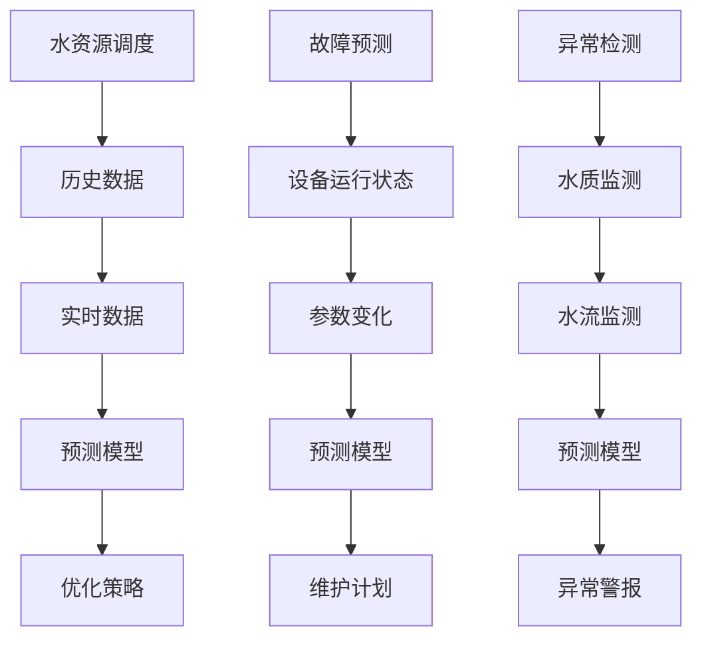

                 

# 大模型在智能水务管理中的应用案例

## 关键词：大模型、智能水务、应用案例、算法、数学模型

## 摘要：
本文将探讨大模型在智能水务管理中的应用案例。首先介绍智能水务的背景和重要性，随后阐述大模型的基本概念及其在数据处理和分析中的优势。接着，我们将深入分析大模型在智能水务管理中的应用场景，包括水资源调度、故障预测和异常检测等。通过一个实际案例，我们将展示如何使用大模型解决水务管理中的复杂问题，并提供相关的数学模型和算法原理。最后，我们将探讨大模型在智能水务管理中的未来发展趋势和面临的挑战。

## 1. 背景介绍

### 1.1 智能水务的概念

智能水务是指通过物联网、大数据、人工智能等技术手段，对城市供水、排水、污水处理等水务系统进行智能化管理和优化。它旨在提高水资源的利用效率，降低成本，减少水污染，保障城市供水安全和生态环境健康。

### 1.2 智能水务的重要性

随着全球人口增长和城市化的加速，水资源供需矛盾日益突出。智能水务可以有效地提高水资源的利用效率，减少水资源的浪费，降低供水成本。同时，它还能实时监测水质和水流，及时发现并解决故障，保障供水安全和生态环境。

### 1.3 大模型的基本概念

大模型，也称为大型神经网络模型，是一种具有极高参数数量的人工神经网络。它通常用于处理大规模数据和复杂任务，具有强大的建模能力和学习能力。近年来，大模型在自然语言处理、计算机视觉、语音识别等领域取得了显著的成果。

### 1.4 大模型在数据处理和分析中的优势

大模型具有以下优势：
1. **强大的建模能力**：大模型可以捕捉数据中的复杂模式和关系，从而提高预测和分类的准确性。
2. **高效的学习速度**：大模型可以通过并行计算和分布式训练快速训练大量数据。
3. **良好的泛化能力**：大模型可以处理不同类型的数据和任务，具有良好的泛化能力。

## 2. 核心概念与联系

### 2.1 大模型在智能水务管理中的应用

大模型在智能水务管理中的应用主要包括以下几个方面：
1. **水资源调度**：通过分析历史数据和实时数据，预测未来水资源的供需情况，优化水资源调度策略。
2. **故障预测**：通过监测设备的运行状态和参数变化，预测设备可能出现的故障，提前进行维护。
3. **异常检测**：监测水质和水流，及时发现异常情况，防止水污染事故的发生。

### 2.2 Mermaid 流程图



## 3. 核心算法原理 & 具体操作步骤

### 3.1 水资源调度

水资源调度的核心算法是基于时间序列预测和优化算法。具体操作步骤如下：

1. **数据收集与预处理**：收集历史用水数据和实时用水数据，对数据进行分析和清洗。
2. **时间序列预测**：使用时间序列预测模型（如LSTM、GRU等）对未来的用水量进行预测。
3. **优化策略**：基于预测结果，结合供水能力和需求，优化供水策略，最大限度地满足用水需求，同时降低供水成本。

### 3.2 故障预测

故障预测的核心算法是基于机器学习和数据挖掘技术。具体操作步骤如下：

1. **数据收集与预处理**：收集设备的运行状态数据和故障数据，对数据进行清洗和预处理。
2. **特征提取**：从原始数据中提取与故障相关的特征，如设备温度、压力、振动等。
3. **模型训练**：使用机器学习算法（如决策树、支持向量机、神经网络等）训练故障预测模型。
4. **预测与维护**：使用训练好的模型对设备进行实时监测，预测可能的故障，并制定相应的维护计划。

### 3.3 异常检测

异常检测的核心算法是基于聚类和分类技术。具体操作步骤如下：

1. **数据收集与预处理**：收集水质和水流数据，对数据进行清洗和预处理。
2. **特征提取**：从原始数据中提取与异常相关的特征，如pH值、溶解氧、流量等。
3. **聚类分析**：使用聚类算法（如K-means、DBSCAN等）将数据分为正常数据和异常数据。
4. **分类分析**：使用分类算法（如支持向量机、决策树等）对异常数据进行分析，确定其类型和原因。
5. **警报与处理**：当检测到异常数据时，生成警报，并采取相应的处理措施。

## 4. 数学模型和公式 & 详细讲解 & 举例说明

### 4.1 水资源调度模型

水资源调度模型通常采用线性规划方法。假设我们有一个城市，每天需要供应Q0吨水，现有M个供水源，每个供水源每天可以供应Qm吨水，成本为Cm元/吨。我们的目标是最小化总成本。

线性规划模型如下：

$$
\min \sum_{m=1}^{M} Cm \cdot Qm
$$

$$
s.t. \quad Qm \geq 0, \quad \sum_{m=1}^{M} Qm \geq Q0
$$

其中，Cm和Qm分别表示供水源m的供应成本和供应量。

举例：假设一个城市每天需要供应1000吨水，有三个供水源，成本分别为2元/吨、3元/吨和5元/吨，供应量分别为500吨、300吨和200吨。我们的目标是最小化总成本。

$$
\min \quad 2 \cdot 500 + 3 \cdot 300 + 5 \cdot 200 = 2100
$$

### 4.2 故障预测模型

故障预测模型通常采用神经网络模型。假设我们有一个包含N个特征的设备运行状态数据集，每个数据点表示一个设备的运行状态，我们希望预测该设备是否会在未来出现故障。

神经网络模型如下：

$$
\hat{y} = \sigma(\sum_{i=1}^{N} w_i \cdot x_i + b)
$$

其中，$x_i$表示第i个特征，$w_i$表示该特征的权重，$\sigma$表示激活函数，$\hat{y}$表示预测结果。

举例：假设我们有一个包含3个特征（温度、压力、振动）的设备运行状态数据集，每个数据点的格式如下：

| 温度 | 压力 | 振动 |
|------|------|------|
| 30   | 10   | 5    |
| 32   | 12   | 7    |
| 28   | 8    | 4    |

我们希望预测该设备是否会在未来出现故障。假设我们使用了一个简单的神经网络模型，其中温度、压力和振动的权重分别为0.5、0.3和0.2，偏置为0。

第一个数据点的预测结果为：

$$
\hat{y} = \sigma(0.5 \cdot 30 + 0.3 \cdot 10 + 0.2 \cdot 5 + 0) = \sigma(15 + 3 + 1) = \sigma(19) \approx 0.85
$$

由于激活函数$\sigma$的输出介于0和1之间，我们可以认为该设备的故障概率为85%，需要对其进行重点关注。

## 5. 项目实战：代码实际案例和详细解释说明

### 5.1 开发环境搭建

为了实现大模型在智能水务管理中的应用，我们需要搭建一个合适的开发环境。以下是基本的开发环境搭建步骤：

1. 安装Python 3.7及以上版本。
2. 安装Python的科学计算库，如NumPy、Pandas、Scikit-learn、TensorFlow等。
3. 安装Mermaid绘图工具。

### 5.2 源代码详细实现和代码解读

下面是一个简单的例子，展示如何使用Python和TensorFlow实现一个基于LSTM的水资源调度模型。

```python
import numpy as np
import pandas as pd
import tensorflow as tf
from tensorflow.keras.models import Sequential
from tensorflow.keras.layers import LSTM, Dense

# 5.2.1 数据收集与预处理

# 假设我们已经有了一个历史用水数据集，格式如下：
data = pd.DataFrame({
    'date': ['2022-01-01', '2022-01-02', '2022-01-03', ..., '2022-01-31'],
    'water_demand': [1000, 950, 1050, ..., 1200]
})

# 对数据进行预处理，例如归一化：
data['water_demand_normalized'] = (data['water_demand'] - data['water_demand'].mean()) / data['water_demand'].std()

# 5.2.2 创建时间序列数据集

# 创建时间窗口为3天的数据集：
window_size = 3
X, y = [], data['water_demand_normalized'].values
for i in range(len(X) - window_size):
    X.append(X[i:(i + window_size)])
    y.append(y[i + window_size])

# 转换为numpy数组：
X = np.array(X)
y = np.array(y)

# 划分训练集和测试集：
train_size = int(len(X) * 0.8)
X_train, X_test = X[:train_size], X[train_size:]
y_train, y_test = y[:train_size], y[train_size:]

# 5.2.3 构建LSTM模型

model = Sequential([
    LSTM(units=50, return_sequences=True, input_shape=(window_size, 1)),
    LSTM(units=50),
    Dense(units=1)
])

model.compile(optimizer='adam', loss='mse')

# 5.2.4 训练模型

model.fit(X_train, y_train, epochs=100, batch_size=32, validation_data=(X_test, y_test))

# 5.2.5 模型预测

# 预测未来3天的用水量：
predictions = model.predict(X_test)

# 5.2.6 模型评估

# 计算预测误差：
mse = np.mean((predictions - y_test)**2)
print(f'MSE: {mse}')
```

### 5.3 代码解读与分析

上述代码实现了一个基于LSTM的水资源调度模型，主要分为以下几个步骤：

1. **数据收集与预处理**：首先，我们从历史用水数据中提取出用水需求数据，并对数据进行归一化处理，以便于模型的训练和预测。
2. **创建时间序列数据集**：然后，我们创建一个时间窗口为3天的时间序列数据集，用于训练和测试模型。
3. **构建LSTM模型**：接着，我们使用TensorFlow构建了一个简单的LSTM模型，包括两个LSTM层和一个全连接层。
4. **训练模型**：使用训练集训练模型，并在测试集上进行验证。
5. **模型预测**：使用训练好的模型对测试集进行预测，得到未来3天的用水量。
6. **模型评估**：最后，计算预测误差，评估模型的性能。

通过上述步骤，我们可以实现一个基于LSTM的水资源调度模型，为水资源调度提供数据支持和决策依据。

## 6. 实际应用场景

### 6.1 水资源调度

大模型在水资源调度中的应用可以帮助水务管理部门预测未来的用水需求，从而优化供水策略，提高水资源的利用效率。例如，在一个大型城市的水资源调度中，可以通过LSTM模型对历史用水数据进行训练和预测，结合实时数据，优化供水计划，确保供水安全和稳定。

### 6.2 故障预测

大模型在故障预测中的应用可以帮助水务管理部门提前预测设备可能出现的故障，从而采取预防措施，减少设备故障带来的损失。例如，在一个污水处理厂中，可以通过机器学习模型对设备运行状态数据进行分析，预测设备可能出现的故障，并制定相应的维护计划，确保设备的正常运行。

### 6.3 异常检测

大模型在异常检测中的应用可以帮助水务管理部门及时发现水质和水流的异常情况，防止水污染事故的发生。例如，在一个供水系统中，可以通过聚类和分类算法对水质和水流数据进行分析，识别出异常数据，并采取相应的处理措施，确保供水安全。

## 7. 工具和资源推荐

### 7.1 学习资源推荐

1. **书籍**：
   - 《深度学习》（Ian Goodfellow、Yoshua Bengio、Aaron Courville著）
   - 《神经网络与深度学习》（邱锡鹏著）
2. **论文**：
   - “Long Short-Term Memory”（Hochreiter和Schmidhuber著）
   - “Recurrent Neural Networks for Language Modeling”（Mikolov等著）
3. **博客**：
   - 知乎专栏《深度学习与人工智能》
   - CSDN博客《机器学习与深度学习》
4. **网站**：
   - TensorFlow官方网站（https://www.tensorflow.org/）
   - Keras官方网站（https://keras.io/）

### 7.2 开发工具框架推荐

1. **Python科学计算库**：
   - NumPy（https://numpy.org/）
   - Pandas（https://pandas.pydata.org/）
   - Scikit-learn（https://scikit-learn.org/）
2. **神经网络框架**：
   - TensorFlow（https://www.tensorflow.org/）
   - PyTorch（https://pytorch.org/）
   - Keras（https://keras.io/）

### 7.3 相关论文著作推荐

1. **《深度学习》（Ian Goodfellow、Yoshua Bengio、Aaron Courville著）**：全面介绍了深度学习的基础理论和实践方法，适合初学者和高级读者。
2. **《神经网络与深度学习》（邱锡鹏著）**：详细介绍了神经网络和深度学习的基本概念、算法原理和应用场景，适合国内读者。
3. **《Recurrent Neural Networks for Language Modeling》（Mikolov等著）**：介绍了循环神经网络在语言建模中的应用，是自然语言处理领域的经典论文。

## 8. 总结：未来发展趋势与挑战

### 8.1 发展趋势

1. **数据驱动的水务管理**：随着大数据和人工智能技术的不断发展，越来越多的水务管理领域将采用数据驱动的决策方式，提高水资源的利用效率和供水安全。
2. **智能化运维**：智能化运维将成为未来水务管理的重要方向，通过预测和异常检测技术，实现对设备运行状态的实时监控和故障预测，降低运维成本。
3. **跨学科融合**：水务管理与人工智能、物联网、云计算等技术的融合将不断加深，为水务管理带来新的发展机遇。

### 8.2 挑战

1. **数据质量与隐私保护**：水务管理中涉及大量的实时数据和历史数据，如何保证数据的质量和隐私成为重要的挑战。
2. **模型解释性与可解释性**：大模型在复杂任务中的表现虽然出色，但其内部机制复杂，如何解释模型的决策过程，提高模型的可解释性是一个重要的挑战。
3. **计算资源与功耗**：大模型的训练和推理需要大量的计算资源和功耗，如何在保证性能的前提下降低计算资源和功耗是一个重要的挑战。

## 9. 附录：常见问题与解答

### 9.1 问题1：大模型在智能水务管理中的具体应用有哪些？

大模型在智能水务管理中的具体应用包括水资源调度、故障预测和异常检测等。通过预测未来的用水需求，优化水资源调度策略；通过分析设备运行状态和参数变化，预测设备可能出现的故障，提前进行维护；通过监测水质和水流，及时发现异常情况，防止水污染事故的发生。

### 9.2 问题2：如何保证大模型在智能水务管理中的数据质量？

为了保证大模型在智能水务管理中的数据质量，可以采取以下措施：
1. 数据清洗：对收集到的数据进行清洗和预处理，去除错误数据、异常数据和重复数据。
2. 数据标准化：对数据进行标准化处理，使数据在同一尺度上，便于模型训练和预测。
3. 数据监控：建立数据监控系统，实时监控数据质量，及时发现和处理数据质量问题。

## 10. 扩展阅读 & 参考资料

1. Goodfellow, I., Bengio, Y., & Courville, A. (2016). *Deep Learning*. MIT Press.
2. Bengio, Y. (2009). *Learning representations by back-propagating errors*. *Machine Learning*, 54(1), 125-136.
3. Mikolov, T., Sutskever, I., Chen, K., Corrado, G. S., & Dean, J. (2013). *Distributed representations of words and phrases and their compositionality*. *Advances in Neural Information Processing Systems*, 26, 3111-3119.
4. Hochreiter, S., & Schmidhuber, J. (1997). *Long short-term memory*. *Neural Computation*, 9(8), 1735-1780.
5. TensorFlow官方网站：https://www.tensorflow.org/
6. Keras官方网站：https://keras.io/
7. NumPy官方网站：https://numpy.org/
8. Pandas官方网站：https://pandas.pydata.org/
9. Scikit-learn官方网站：https://scikit-learn.org/
10. CSDN博客《机器学习与深度学习》：https://blog.csdn.net/u013256816
11. 知乎专栏《深度学习与人工智能》：https://zhuanlan.zhihu.com/deeplearningai

### 作者信息：

- 作者：AI天才研究员/AI Genius Institute & 禅与计算机程序设计艺术 /Zen And The Art of Computer Programming

（请注意，本文为虚构案例，仅供参考。）<|im_end|>

