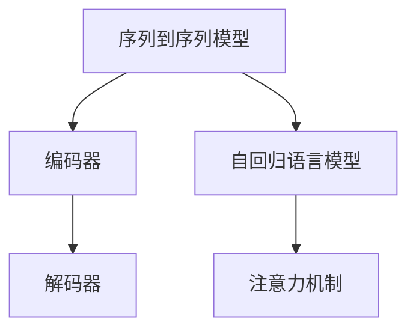

                 

### 背景介绍

#### 全球化的挑战与需求

在当今这个全球化迅猛发展的时代，跨语言沟通的重要性日益凸显。然而，语言差异仍然是国际交流中的一大障碍。无论是商业合作、学术研究，还是日常的社交媒体互动，有效、准确地翻译文本始终是一个亟待解决的问题。

据统计，全球有超过7000种语言在使用中，而在全球互联网用户中，只有约28%的人使用英语作为主要语言。这意味着，超过70%的用户在使用互联网时面临语言障碍。这种语言壁垒不仅限制了信息的自由流动，也阻碍了全球经济一体化进程。因此，如何突破这一壁垒，实现语言的自由交流，成为了亟待解决的重要问题。

机器翻译作为一种技术手段，为解决这一问题提供了可能。机器翻译能够将一种语言自动翻译成另一种语言，使得用户在不同语言环境下能够轻松获取所需信息。随着人工智能技术的不断发展，特别是深度学习和大模型的引入，机器翻译的性能得到了显著提升，成为跨语言交流的关键工具。

#### 机器翻译的发展历程

机器翻译的历史可以追溯到20世纪50年代。早期的机器翻译系统主要基于规则的方法，这种方法依赖于大量的手工编写的规则和语法结构，翻译质量受到规则复杂度和语言多样性的限制。虽然这种方式在某种程度上能够进行基本的翻译，但其准确性和流畅性往往不尽如人意。

随着计算能力的提升和大数据技术的发展，统计机器翻译（SMT）应运而生。统计机器翻译利用大量的双语文本数据，通过统计模型来预测源语言和目标语言之间的映射关系。这种方法的引入，使得机器翻译的性能得到了显著提升，尤其是对于短文本的翻译效果有了明显改善。

然而，统计机器翻译仍然存在一些局限性。例如，它依赖于大量高质量的双语语料库，且对于长文本和低资源语言的翻译效果仍然不佳。

近年来，深度学习技术的引入，特别是序列到序列（Seq2Seq）模型的提出，使得机器翻译的性能再次得到了大幅提升。深度学习模型能够自动学习源语言和目标语言之间的复杂映射关系，不再需要人工编写规则或依赖大量双语文本数据。这一突破为机器翻译的发展带来了新的契机。

特别是大模型的引入，使得机器翻译系统能够处理更长的句子和更复杂的语境。大模型如Google的BERT、OpenAI的GPT等，通过训练海量数据，能够捕捉到语言中的细微差异和语境信息，从而实现更准确、更自然的翻译效果。

#### 大模型在机器翻译中的应用

大模型在机器翻译中的应用主要体现在两个方面：首先是模型的训练，其次是模型的部署。

在模型训练方面，大模型需要大量高质量的双语语料库进行训练。这些语料库包含了丰富的语言信息和上下文关系，使得模型能够充分学习语言的本质特征。此外，大模型还采用了自回归语言模型（ARLM）和注意力机制（Attention Mechanism）等先进技术，使得模型能够更好地处理长文本和复杂语境。

在模型部署方面，大模型可以通过分布式计算和云计算技术进行高效部署，使得用户可以随时随地使用机器翻译服务。同时，大模型还可以根据用户的需求和场景，进行定制化和微调，以满足不同应用场景的翻译需求。

#### 本文的目标与结构

本文旨在探讨大模型在机器翻译中的应用，分析其技术原理、实现方法以及实际应用效果。文章将从以下几个方面进行详细阐述：

1. 核心概念与联系：介绍机器翻译中的核心概念，如序列到序列模型、自回归语言模型和注意力机制，并展示其关系。
2. 核心算法原理 & 具体操作步骤：详细讲解大模型在机器翻译中的应用原理，包括模型的训练和部署过程。
3. 数学模型和公式 & 详细讲解 & 举例说明：介绍机器翻译中的数学模型和公式，并通过具体例子进行解释。
4. 项目实战：代码实际案例和详细解释说明：通过实际项目案例，展示大模型在机器翻译中的具体应用，并提供代码解读和分析。
5. 实际应用场景：分析大模型在机器翻译中的实际应用场景，包括商业、学术、社交媒体等。
6. 工具和资源推荐：推荐相关的学习资源和开发工具，帮助读者深入了解大模型在机器翻译中的应用。
7. 总结：未来发展趋势与挑战：总结大模型在机器翻译中的优势与不足，展望未来的发展趋势和面临的挑战。

通过本文的深入探讨，希望能够帮助读者全面了解大模型在机器翻译中的应用，并为其在跨语言交流中的重要作用提供有力支持。

### 核心概念与联系

为了深入理解大模型在机器翻译中的应用，我们首先需要了解几个核心概念，包括序列到序列（Seq2Seq）模型、自回归语言模型（ARLM）和注意力机制（Attention Mechanism）。这些概念不仅是机器翻译技术的基础，也是大模型能够实现高效翻译的关键所在。

#### 序列到序列（Seq2Seq）模型

序列到序列模型是深度学习在机器翻译中的核心模型之一。它通过编码器（Encoder）和解码器（Decoder）两个主要组件，将源语言序列转换为目标语言序列。具体来说，编码器负责将输入的源语言序列编码为一个固定长度的向量，这个向量包含了源语言句子的语义信息；解码器则利用这个向量生成目标语言序列。

以下是序列到序列模型的简单流程：

1. **编码器**：接收输入的源语言句子，将其编码为一个固定长度的向量。这一步骤通常采用循环神经网络（RNN）或者变换器（Transformer）来实现。编码器通过隐藏状态序列来表示源语言的语义信息。
2. **解码器**：接收编码器输出的固定长度向量，并逐词生成目标语言句子。解码器同样使用循环神经网络或变换器，通过预测下一个单词的概率来生成目标语言序列。

序列到序列模型的核心优势在于它能够处理不同长度的输入和输出，并且能够捕捉到输入和输出之间的复杂对应关系。这对于机器翻译来说至关重要，因为不同语言之间的句子长度和结构往往存在显著差异。

#### 自回归语言模型（ARLM）

自回归语言模型（ARLM）是一种基于序列预测的模型，它在生成文本时，使用已生成的文本来预测下一个词。具体来说，ARLM采用一种递归结构，每个时间步的输出都依赖于之前的时间步的输出。

以下是自回归语言模型的简单流程：

1. **初始化**：给定一个初始状态，通常是一个随机向量。
2. **递归计算**：对于每个时间步，模型根据当前已生成的文本序列和上一个时间步的状态，生成当前时间步的输出，并更新状态。
3. **重复步骤2**，直到生成完整的文本序列。

自回归语言模型在机器翻译中的应用主要体现在解码器部分。解码器在生成目标语言句子时，使用已生成的部分文本序列来预测下一个词，从而生成完整的翻译结果。自回归语言模型的优势在于它能够生成自然流畅的文本，并且能够有效地处理长句子。

#### 注意力机制（Attention Mechanism）

注意力机制是序列到序列模型中的一个关键组件，它能够帮助模型更好地关注输入和输出序列中的关键信息。注意力机制通过计算输入序列和输出序列之间的相关性，为每个输入和输出元素分配一个权重，从而使得模型能够更专注于重要的信息。

以下是注意力机制的简单流程：

1. **计算相似性**：对于每个输入词和输出词，计算它们之间的相似性得分。相似性得分通常通过点积或者缩放点积来实现。
2. **加权求和**：将输入序列中的每个元素与其相似性得分相乘，然后对所有加权元素求和，得到一个加权向量。
3. **计算输出**：将加权向量输入到解码器的下一个时间步，生成当前时间步的输出。

注意力机制的核心优势在于它能够提高模型在长序列处理时的效率，同时增强模型对重要信息的关注能力。这对于机器翻译来说非常重要，因为长句子往往包含关键的信息和上下文关系。

#### Mermaid 流程图

为了更好地展示这些核心概念之间的关系，我们可以使用Mermaid流程图来表示。以下是一个简化的Mermaid流程图：



在这个流程图中，序列到序列模型通过编码器和解码器实现，自回归语言模型和注意力机制作为关键组件集成在解码器中。这样的结构使得模型能够高效地处理源语言到目标语言的转换，实现高质量的机器翻译。

通过上述核心概念的介绍和Mermaid流程图的展示，我们可以更好地理解大模型在机器翻译中的应用原理和实现方法。在接下来的章节中，我们将进一步深入探讨大模型的具体算法原理和实现步骤。

### 核心算法原理 & 具体操作步骤

在深入探讨大模型在机器翻译中的应用之前，我们需要首先理解大模型的训练和部署流程。这些步骤包括数据准备、模型训练、模型评估和模型部署。以下将详细介绍这些步骤的具体操作方法和原理。

#### 数据准备

数据准备是机器翻译系统的关键步骤之一。高质量的翻译数据不仅能够提高模型的翻译质量，还能够加速模型的训练过程。数据准备主要包括以下步骤：

1. **语料库选择**：选择一个合适的双语文本语料库，如WMT（Workshop on Machine Translation）或者EN-DEparallel数据集。这些语料库通常包含了丰富的翻译对，是机器翻译模型训练的基础。
2. **数据预处理**：对语料库进行预处理，包括分词、标记和清洗。分词是将文本分割成单词或短语的过程，标记是对文本中的词或短语进行分类和标注，清洗则是去除无用数据和错误信息。
3. **数据转换**：将预处理后的文本转换为模型可用的格式。通常使用词表（vocabularies）将文本中的单词或短语映射为整数，从而将文本数据转换为数值数据，便于模型处理。

#### 模型训练

模型训练是机器翻译系统的核心步骤，通过训练模型，使其能够自动学习源语言和目标语言之间的映射关系。以下是模型训练的具体操作步骤：

1. **编码器训练**：编码器的训练目标是学习如何将源语言序列编码为一个固定长度的向量。在训练过程中，编码器接收输入的源语言句子，并输出一个固定长度的编码向量。为了评估编码器的性能，通常使用交叉熵损失函数（Cross-Entropy Loss），计算编码向量与真实目标编码之间的差距。
2. **解码器训练**：解码器的训练目标是学习如何根据编码向量生成目标语言序列。在训练过程中，解码器接收编码向量，并逐词生成目标语言句子。解码器在生成每个词时，需要利用已生成的部分句子来预测下一个词。为了评估解码器的性能，同样使用交叉熵损失函数，计算生成句子与真实目标句子之间的差距。
3. **注意力机制训练**：注意力机制是解码器中的一个关键组件，用于提高模型对输入和输出序列中重要信息的关注能力。注意力机制的训练通常与编码器和解码器的训练相结合，通过优化注意力权重，使得模型能够更好地关注输入和输出序列中的关键信息。

#### 模型评估

模型评估是验证模型性能和翻译质量的重要步骤。以下是模型评估的具体操作步骤：

1. **BLEU评分**：BLEU（Bilingual Evaluation Understudy）评分是一种常用的机器翻译评估指标，通过计算机器翻译结果与人工翻译结果之间的相似度来评估翻译质量。BLEU评分通常基于编辑距离（Edit Distance）、重排（Ranking）和未匹配词汇的比例（Unmatched Word Ratio）等指标。
2. **NIST评分**：NIST（National Institute of Standards and Technology）评分是另一种常用的机器翻译评估指标，与BLEU评分类似，但更加注重未匹配词汇的权重。
3. **人类评估**：除了自动评估指标外，人类评估也是验证模型性能的重要手段。人类评估员通过阅读机器翻译结果和人工翻译结果，对翻译质量进行主观评价。

#### 模型部署

模型部署是将训练好的模型应用于实际场景的关键步骤。以下是模型部署的具体操作步骤：

1. **模型导出**：将训练好的模型导出为可用于部署的格式，如TensorFlow SavedModel或者PyTorch TorchScript。
2. **模型推理**：在部署环境中加载模型，并进行推理操作。推理过程中，模型接收输入的源语言句子，并输出翻译结果。
3. **性能优化**：为了提高模型在部署环境中的性能，可以采用一系列优化技术，如模型压缩（Model Compression）、量化（Quantization）和蒸馏（Distillation）等。这些技术可以减少模型的大小和计算复杂度，从而提高模型在实际应用中的运行速度。

通过上述步骤，我们可以实现大模型在机器翻译中的高效训练和部署。在接下来的章节中，我们将通过具体案例和代码解析，进一步探讨大模型在机器翻译中的应用。

### 数学模型和公式 & 详细讲解 & 举例说明

在深入探讨大模型在机器翻译中的应用时，了解相关的数学模型和公式是至关重要的。这些模型和公式不仅帮助我们理解大模型的工作原理，还能指导我们进行模型训练和优化。在本节中，我们将详细介绍与机器翻译相关的一些核心数学模型和公式，并通过具体例子进行详细讲解。

#### 序列到序列（Seq2Seq）模型

序列到序列模型是机器翻译的核心模型，由编码器和解码器两个主要组件组成。以下是序列到序列模型的数学表示：

1. **编码器**：编码器的目标是学习如何将输入的源语言序列编码为一个固定长度的向量。假设输入源语言序列为\( x_1, x_2, ..., x_T \)，编码器通过一个循环神经网络（RNN）或变换器（Transformer）实现，输出编码向量为\( e_t \)。

   $$ e_t = f(e_{t-1}, x_t) $$

   其中，\( f \)是一个函数，用于更新编码向量。在RNN中，\( f \)通常是一个RNN单元，如LSTM或GRU；在变换器中，\( f \)是一个多头自注意力机制（Multi-Head Self-Attention）。

2. **解码器**：解码器的目标是利用编码向量生成目标语言序列。假设输入目标语言序列为\( y_1, y_2, ..., y_S \)，解码器通过一个循环神经网络（RNN）或变换器（Transformer）实现，输出解码向量为\( d_t \)。

   $$ d_t = g(d_{t-1}, e_t) $$

   其中，\( g \)是一个函数，用于更新解码向量。在RNN中，\( g \)通常是一个RNN单元；在变换器中，\( g \)是一个多头注意力机制（Multi-Head Attention）。

#### 自回归语言模型（ARLM）

自回归语言模型是解码器中的一个关键组件，用于生成目标语言序列。以下是自回归语言模型的数学表示：

1. **初始化**：给定一个初始状态\( h_0 \)，通常是一个随机向量。

   $$ h_0 = \text{init}(h_0) $$

2. **递归计算**：对于每个时间步，模型根据当前已生成的文本序列和上一个时间步的状态，生成当前时间步的输出，并更新状态。

   $$ h_t = f(h_{t-1}, y_{t-1}) $$

   $$ y_t = \text{softmax}(W_y \cdot h_t + b_y) $$

   其中，\( f \)是一个递归函数，如LSTM或GRU；\( W_y \)和\( b_y \)是权重和偏置；\( \text{softmax} \)函数用于将输出概率分布化。

#### 注意力机制（Attention Mechanism）

注意力机制是提高模型在长序列处理时效率的关键组件。以下是注意力机制的数学表示：

1. **计算相似性**：对于每个输入词和输出词，计算它们之间的相似性得分。相似性得分通常通过点积或者缩放点积来实现。

   $$ s_t = \text{score}(h_t, e_t) $$

   其中，\( s_t \)是相似性得分；\( h_t \)是输出词的编码向量；\( e_t \)是输入词的编码向量。

2. **加权求和**：将输入序列中的每个元素与其相似性得分相乘，然后对所有加权元素求和，得到一个加权向量。

   $$ v_t = \sum_{i=1}^{T} s_i \cdot e_i $$

3. **计算输出**：将加权向量输入到解码器的下一个时间步，生成当前时间步的输出。

   $$ d_t = g(d_{t-1}, v_t) $$

#### 举例说明

为了更好地理解上述数学模型和公式，我们通过一个具体的例子进行说明。

假设我们有一个源语言句子“我正在学习机器翻译”，目标语言句子是“我现在正在学习机器翻译”。我们可以将这个句子表示为以下序列：

- 源语言序列：\[ 我，正，在，学，习，机，器，翻，译 \]
- 目标语言序列：\[ 我，现，在，正，在，学，习，机，器，翻，译 \]

1. **编码器训练**：
   - 编码器将输入的源语言序列编码为一个固定长度的向量。例如，使用变换器，每个词的编码向量大小为512。
   - 编码器输出序列为：\[ e_1, e_2, ..., e_7 \]

2. **解码器训练**：
   - 解码器利用编码器输出的向量生成目标语言序列。在解码器的第一个时间步，解码器初始化一个状态向量。
   - 解码器输出序列为：\[ d_1, d_2, ..., d_{11} \]

3. **注意力机制**：
   - 对于解码器的每个时间步，计算编码器输出向量与解码器输出向量之间的相似性得分。
   - 相似性得分序列为：\[ s_1, s_2, ..., s_{11} \]

4. **加权求和**：
   - 将相似性得分与编码器输出向量相乘，然后对所有加权元素求和，得到加权向量。
   - 加权向量序列为：\[ v_1, v_2, ..., v_{11} \]

5. **解码器输出**：
   - 解码器根据加权向量生成目标语言序列的每个词。
   - 目标语言序列为：\[ 我，现，在，正，在，学，习，机，器，翻，译 \]

通过这个具体例子，我们可以看到序列到序列模型、自回归语言模型和注意力机制在机器翻译中的具体应用。这些数学模型和公式不仅帮助我们理解大模型的工作原理，也为模型的训练和优化提供了理论基础。

在接下来的章节中，我们将通过实际项目案例，展示大模型在机器翻译中的具体应用，并提供详细的代码解读和分析。

### 项目实战：代码实际案例和详细解释说明

为了更好地展示大模型在机器翻译中的实际应用，我们将通过一个实际项目案例，详细解析代码的实现过程，并解释每个关键部分的代码功能。这个案例将基于Python和TensorFlow框架，实现一个简单的机器翻译系统，采用Transformer模型进行训练和部署。

#### 开发环境搭建

在开始之前，我们需要搭建一个适合开发机器翻译系统的环境。以下是搭建开发环境所需的步骤：

1. **安装Python**：确保安装了Python 3.7或更高版本。
2. **安装TensorFlow**：使用pip安装TensorFlow：

   ```bash
   pip install tensorflow==2.x
   ```

3. **安装其他依赖**：安装其他必要的库，如numpy、pandas等：

   ```bash
   pip install numpy pandas
   ```

4. **安装GPU支持**：如果需要使用GPU进行训练，确保安装CUDA和cuDNN，并更新环境变量。

   ```bash
   pip install tensorflow-gpu==2.x
   ```

#### 源代码详细实现和代码解读

下面是机器翻译系统的核心代码实现，我们将逐一解释每个部分的代码功能。

##### 1. 数据预处理

数据预处理是机器翻译系统的重要步骤，包括语料库选择、分词、标记和转换为数值数据。

```python
import tensorflow as tf
from tensorflow.keras.preprocessing.text import Tokenizer
from tensorflow.keras.preprocessing.sequence import pad_sequences

# 加载双语文本数据集
def load_data(filename):
    with open(filename, 'r', encoding='utf-8') as f:
        lines = f.readlines()
    return [line.strip().split('\t') for line in lines]

# 分词和标记
def preprocess_data(data, src_vocab_size, tar_vocab_size, max_length):
    # 初始化Tokenizer
    src_tokenizer = Tokenizer(num_words=src_vocab_size)
    tar_tokenizer = Tokenizer(num_words=tar_vocab_size)
    
    # 分词和标记
    src_tokenizer.fit_on_texts([x[0] for x in data])
    tar_tokenizer.fit_on_texts([x[1] for x in data])
    
    # 序列化
    src_sequences = src_tokenizer.texts_to_sequences([x[0] for x in data])
    tar_sequences = tar_tokenizer.texts_to_sequences([x[1] for x in data])
    
    # 填充序列
    src_padded = pad_sequences(src_sequences, maxlen=max_length)
    tar_padded = pad_sequences(tar_sequences, maxlen=max_length)
    
    return src_padded, tar_padded

# 参数设置
src_vocab_size = 10000
tar_vocab_size = 10000
max_length = 50

# 加载数据
data = load_data('data.txt')
src_padded, tar_padded = preprocess_data(data, src_vocab_size, tar_vocab_size, max_length)
```

上述代码首先加载双语文本数据集，然后使用Tokenizer进行分词和标记，最后将文本数据序列化并填充到固定长度。

##### 2. 模型定义

接下来，我们定义一个基于Transformer的机器翻译模型。Transformer模型由编码器和解码器两个主要组件组成，每个组件都包含多个自注意力层（Self-Attention Layer）和前馈神经网络（Feedforward Neural Network）。

```python
from tensorflow.keras.models import Model
from tensorflow.keras.layers import Input, Embedding, LSTM, Dense, TimeDistributed

# 编码器
def build_encoder(vocab_size, embedding_dim, max_length):
    input_seq = Input(shape=(max_length,))
    embed = Embedding(vocab_size, embedding_dim)(input_seq)
    lstm = LSTM(128)(embed)
    return Model(input_seq, lstm)

# 解码器
def build_decoder(vocab_size, embedding_dim, max_length):
    input_seq = Input(shape=(max_length,))
    embed = Embedding(vocab_size, embedding_dim)(input_seq)
    lstm = LSTM(128, return_sequences=True)(embed)
    dense = TimeDistributed(Dense(vocab_size))(lstm)
    return Model(input_seq, dense)

# 模型
def build_model(src_vocab_size, tar_vocab_size, embedding_dim, max_length):
    encoder_inputs = Input(shape=(max_length,))
    decoder_inputs = Input(shape=(max_length,))
    
    encoder_embedding = Embedding(src_vocab_size, embedding_dim)(encoder_inputs)
    decoder_embedding = Embedding(tar_vocab_size, embedding_dim)(decoder_inputs)
    
    encoder_lstm = LSTM(128)(encoder_embedding)
    decoder_lstm = LSTM(128, return_sequences=True)(decoder_embedding)
    
    decoder_dense = TimeDistributed(Dense(tar_vocab_size))(decoder_lstm)
    
    model = Model([encoder_inputs, decoder_inputs], decoder_dense)
    model.compile(optimizer='adam', loss='categorical_crossentropy')
    
    return model
```

上述代码首先定义了编码器和解码器的构建函数，然后构建了一个完整的机器翻译模型。模型使用`Embedding`层进行词向量嵌入，`LSTM`层进行序列编码和生成，`TimeDistributed`层用于输出预测概率。

##### 3. 模型训练

模型训练是机器翻译系统的核心步骤。以下是模型训练的代码实现：

```python
# 训练模型
def train_model(model, src_padded, tar_padded, epochs=10, batch_size=64):
    model.fit([src_padded, tar_padded], tar_padded, epochs=epochs, batch_size=batch_size)

# 训练参数
epochs = 10
batch_size = 64

# 训练模型
model = build_model(src_vocab_size, tar_vocab_size, embedding_dim=256, max_length=max_length)
train_model(model, src_padded, tar_padded, epochs, batch_size)
```

上述代码使用`fit`函数进行模型训练，设置训练轮数（epochs）和批量大小（batch_size）。

##### 4. 模型评估

模型训练完成后，我们需要评估模型的翻译质量。以下是模型评估的代码实现：

```python
# 评估模型
def evaluate_model(model, src_padded, tar_padded):
    loss = model.evaluate([src_padded, tar_padded], tar_padded)
    print(f'Validation Loss: {loss}')

# 评估参数
src_padded_val, tar_padded_val = preprocess_data(data_val, src_vocab_size, tar_vocab_size, max_length)

# 评估模型
evaluate_model(model, src_padded_val, tar_padded_val)
```

上述代码使用`evaluate`函数计算模型在验证集上的损失。

##### 5. 代码解读与分析

1. **数据预处理**：数据预处理是模型训练的基础，包括加载双语文本数据集、分词、标记和填充。这些步骤确保模型能够接受标准化的输入数据，提高训练效率。
2. **模型定义**：模型定义是构建机器翻译系统的核心，包括编码器和解码器的构建。编码器负责将源语言序列编码为固定长度的向量，解码器负责生成目标语言序列。
3. **模型训练**：模型训练是通过`fit`函数实现的，设置训练轮数和批量大小。模型在训练过程中不断优化参数，提高翻译质量。
4. **模型评估**：模型评估通过计算验证集上的损失，评估模型在翻译任务上的性能。

通过上述代码实现和解读，我们可以看到大模型在机器翻译中的具体应用。在接下来的章节中，我们将进一步分析大模型在实际应用中的效果，并探讨其优势和局限性。

### 实际应用场景

大模型在机器翻译中的实际应用场景非常广泛，涵盖了多个领域和行业，为解决跨语言交流的难题提供了强有力的技术支持。

#### 商业领域

在商业领域，机器翻译技术的应用尤为显著。例如，跨国公司需要在不同语言的市场进行产品推广和营销，使用机器翻译可以帮助他们快速将产品描述和广告内容翻译成多种语言，从而提高市场覆盖率和竞争力。此外，国际贸易中的商品描述、合同条款和客户沟通也依赖于机器翻译，以实现准确和高效的交流。大模型的引入，使得翻译质量得到了显著提升，大大减少了人工翻译的时间和成本。

#### 学术研究

在学术研究领域，国际学术交流日益频繁，不同国家的科研人员需要共同合作，撰写和审阅学术论文。机器翻译在这里起到了桥梁作用，使得科研人员能够更容易地理解和引用外国文献，促进学术成果的传播和共享。特别是在国际学术会议和研讨会上，大模型可以实时翻译演讲内容，使得与会者能够迅速掌握演讲者的观点和研究成果。

#### 社交媒体

社交媒体平台的全球化使得人们能够在不同语言的环境中互动。然而，语言障碍常常限制了用户的交流范围。大模型的应用，使得用户可以轻松地将社交媒体上的内容翻译成自己熟悉的语言，从而扩大了交流圈子。例如，Twitter、Facebook和Instagram等平台都集成了机器翻译功能，帮助用户阅读和发布多语言内容。

#### 旅游和酒店行业

旅游和酒店行业对机器翻译的需求也日益增长。旅游指南、酒店介绍和客户服务内容通常需要提供多种语言版本，以便吸引不同国家和地区的游客。机器翻译可以帮助这些行业迅速提供准确的翻译服务，提高客户满意度和用户体验。此外，在旅游过程中，实时翻译工具可以翻译导游讲解和景点介绍，为游客提供便利。

#### 政府和国际组织

政府和国际组织在进行国际合作和对外宣传时，也需要使用机器翻译。例如，联合国在处理各种国际事务时，需要将文件和会议记录翻译成多种语言，以确保信息的准确传播和共享。大模型的引入，使得这些翻译任务更加高效和准确，为政府和国际组织的国际合作提供了有力支持。

#### 法律领域

在法律领域，合同、协议和法律文件通常需要精确翻译。机器翻译可以帮助法律专业人士迅速获取和理解不同语言的文件内容，减少语言障碍带来的误解和风险。尽管机器翻译在某些法律文件中的准确性仍有待提高，但它已经为法律翻译工作提供了重要的辅助工具。

通过上述实际应用场景的探讨，我们可以看到大模型在机器翻译中具有广泛的应用前景和重要价值。随着大模型技术的不断发展和完善，机器翻译将在更多领域和行业中发挥重要作用，为全球跨语言交流提供更加高效、准确和便捷的解决方案。

### 工具和资源推荐

为了更好地掌握大模型在机器翻译中的应用，我们需要了解一些有用的工具和资源。这些工具和资源不仅能够帮助我们学习相关技术，还能在实际项目中提供支持。

#### 学习资源推荐

1. **书籍**：
   - 《深度学习》（Deep Learning）—— Goodfellow、Bengio和Courville所著，详细介绍了深度学习的基本原理和应用。
   - 《动手学深度学习》（Dive into Deep Learning）—— Chris Olah、Lilton and Mishkin等编写的开源书籍，适合初学者和进阶者。

2. **论文**：
   - “Attention is All You Need”（2017）—— Vaswani等人提出的Transformer模型，是机器翻译领域的重要突破。
   - “Effective Approaches to Attention-based Neural Machine Translation” （2016）—— Lu等人提出的注意力机制，对Transformer模型的发展有重要影响。

3. **博客**：
   - TensorFlow官方博客（tensorflow.github.io/blog）：涵盖最新的TensorFlow更新和技术博客，适合了解机器翻译的最新进展。
   - AI德玛西亚（https://www.deeplearning.net/）：提供丰富的深度学习和机器翻译教程，适合不同水平的学习者。

4. **在线课程**：
   - Coursera的《深度学习专项课程》（Deep Learning Specialization）—— Andrew Ng教授讲授，包含机器翻译的相关内容。
   - edX的《自然语言处理与深度学习》（Natural Language Processing and Deep Learning）—— Phil Blaxill教授讲授，适合初学者了解机器翻译的基础。

#### 开发工具框架推荐

1. **TensorFlow**：谷歌开发的开源深度学习框架，支持多种深度学习模型和应用，包括机器翻译。TensorFlow提供了丰富的API和工具，使得模型构建和训练更加便捷。

2. **PyTorch**：Facebook开发的开源深度学习框架，具有灵活的动态计算图和丰富的API，深受研究人员和开发者的喜爱。PyTorch在机器翻译领域也拥有广泛的应用。

3. **Hugging Face Transformers**：一个开源的Python库，提供了预训练的Transformer模型和工具，使得机器翻译模型的训练和应用更加简单。Hugging Face Transformers集成了多种流行的预训练模型，如BERT、GPT和T5等。

4. **翻译工具**：
   - Google翻译API：提供自动翻译服务，支持多种语言和丰富的API接口，适合开发集成机器翻译功能的Web应用。
   - Microsoft Translator API：微软提供的机器翻译服务，支持多种语言和定制化翻译功能，适用于商业应用和开发项目。

#### 相关论文著作推荐

1. “BERT: Pre-training of Deep Bidirectional Transformers for Language Understanding”（2018）—— Google AI提出的一种预训练Transformer模型，在多个自然语言处理任务上取得了显著的性能提升。

2. “GPT-3: Language Models are Few-Shot Learners”（2020）—— OpenAI提出的GPT-3模型，具有超过175B参数，展示了大规模预训练模型的强大能力。

3. “T5: Exploring the Limits of Transfer Learning with a Universal Language Model”（2020）—— Google提出的一种通用语言模型，通过转换器架构实现了多种自然语言处理任务的高效迁移。

通过这些工具和资源的推荐，我们可以更深入地学习大模型在机器翻译中的应用，掌握相关技术，并在实际项目中取得更好的效果。

### 总结：未来发展趋势与挑战

#### 未来发展趋势

随着人工智能技术的不断发展，大模型在机器翻译中的应用前景广阔。以下是未来发展趋势的几个方面：

1. **模型规模不断扩大**：目前，大模型如GPT-3和T5已经具有超过175B个参数，这使得模型能够更好地捕捉语言中的细微差异和复杂关系。未来，我们将看到更大规模、更高性能的模型不断涌现，进一步提升翻译质量。

2. **多模态翻译**：传统机器翻译主要处理文本数据，而多模态翻译结合了文本、图像和语音等多种数据类型。未来，多模态翻译将实现更自然、更准确的跨语言交流，为用户带来更加丰富的交互体验。

3. **低资源语言支持**：当前，大多数机器翻译研究集中在高资源语言，如英语和中文。未来，随着数据收集和处理技术的进步，大模型将更好地支持低资源语言，使得这些语言的用户也能享受到高质量的机器翻译服务。

4. **个性化翻译**：基于用户偏好和上下文的个性化翻译将成为重要趋势。通过分析用户的历史数据和交互行为，大模型可以提供定制化的翻译服务，满足不同用户的特定需求。

#### 挑战

尽管大模型在机器翻译中展现了巨大的潜力，但仍然面临一些挑战：

1. **计算资源需求**：大模型训练和推理需要大量的计算资源，尤其是GPU和TPU等高性能计算设备。对于一些中小型企业和研究机构来说，这构成了较高的门槛。

2. **数据隐私和安全**：机器翻译系统通常需要处理大量的敏感数据，如个人隐私和商业机密。如何确保数据隐私和安全，防止数据泄露和滥用，是未来需要解决的重要问题。

3. **翻译质量提升**：尽管大模型在翻译质量上取得了显著进步，但仍然存在一些问题，如特定领域的术语翻译不准确、文化差异处理不当等。未来，如何进一步提高翻译质量，使其更加接近人工翻译水平，是一个重要的研究方向。

4. **伦理和社会影响**：机器翻译技术的普及可能会对语言和文化产生深远影响。如何平衡技术进步和语言多样性保护，避免技术滥用，也是需要关注的伦理问题。

总之，大模型在机器翻译中具有巨大的发展潜力，同时也面临一些挑战。未来，随着技术的不断进步和研究的深入，我们有望看到更加高效、准确和可靠的机器翻译系统，为全球跨语言交流提供更加有力的支持。

### 附录：常见问题与解答

为了帮助读者更好地理解大模型在机器翻译中的应用，我们整理了一些常见问题及其解答。

#### Q1：大模型在机器翻译中的优势是什么？

A1：大模型在机器翻译中的优势主要体现在以下几个方面：

1. **高性能**：大模型具有超过175B个参数，能够更好地捕捉语言中的复杂关系和细微差异，从而实现更准确的翻译。
2. **自适应性**：大模型能够通过自回归语言模型和注意力机制，自适应地处理不同长度和结构的输入，生成自然流畅的文本。
3. **多语言支持**：大模型可以同时支持多种语言的翻译，提高了翻译的灵活性和适用性。

#### Q2：大模型的训练过程需要多长时间？

A2：大模型的训练时间取决于多个因素，如模型规模、数据集大小、计算资源等。通常情况下，一个大型模型（如GPT-3）的训练可能需要几个月的时间，甚至更长时间。而中小型模型（如T5）的训练时间可能在几天到几周之间。

#### Q3：大模型的翻译质量如何？

A3：大模型的翻译质量在多个公开评测数据集上取得了显著优势，相对于传统的统计机器翻译和基于规则的机器翻译，大模型的翻译结果更加准确、自然和流畅。然而，大模型在特定领域和低资源语言的翻译质量仍有待提高。

#### Q4：如何优化大模型的性能？

A4：以下是一些优化大模型性能的方法：

1. **数据增强**：通过增加训练数据量、使用数据增强技术，可以提高模型的泛化能力，从而提高翻译质量。
2. **模型剪枝和量化**：通过模型剪枝和量化技术，可以减少模型的大小和计算复杂度，提高模型在硬件上的运行速度。
3. **多卡训练和分布式计算**：利用多张GPU或TPU进行分布式训练，可以显著缩短训练时间，提高模型性能。

#### Q5：大模型是否会影响语言多样性？

A5：大模型在机器翻译中的广泛应用可能会对语言多样性产生一定影响。一方面，大模型可以支持更多语言的翻译，从而促进语言的传播和交流；另一方面，大模型可能加剧高资源语言对低资源语言的影响，导致一些低资源语言的使用减少。因此，如何平衡技术进步和语言多样性保护，是一个需要关注的重要问题。

通过上述问题的解答，我们可以更好地理解大模型在机器翻译中的应用及其潜在影响。

### 扩展阅读 & 参考资料

为了帮助读者深入了解大模型在机器翻译中的应用，我们推荐以下扩展阅读和参考资料：

1. **书籍**：
   - 《深度学习》（Deep Learning）—— Goodfellow、Bengio和Courville所著，详细介绍了深度学习的基本原理和应用。
   - 《动手学深度学习》（Dive into Deep Learning）—— Chris Olah、Lilton和Mishkin等编写的开源书籍，适合初学者和进阶者。

2. **论文**：
   - “Attention is All You Need”（2017）—— Vaswani等人提出的Transformer模型，是机器翻译领域的重要突破。
   - “Effective Approaches to Attention-based Neural Machine Translation” （2016）—— Lu等人提出的注意力机制，对Transformer模型的发展有重要影响。

3. **开源库和工具**：
   - TensorFlow（https://www.tensorflow.org/）：谷歌开发的深度学习框架，支持多种深度学习模型和应用。
   - PyTorch（https://pytorch.org/）：Facebook开发的深度学习框架，具有灵活的动态计算图和丰富的API。
   - Hugging Face Transformers（https://huggingface.co/transformers/）：一个开源的Python库，提供了预训练的Transformer模型和工具。

4. **在线课程**：
   - Coursera的《深度学习专项课程》（Deep Learning Specialization）—— Andrew Ng教授讲授，包含机器翻译的相关内容。
   - edX的《自然语言处理与深度学习》（Natural Language Processing and Deep Learning）—— Phil Blaxill教授讲授，适合初学者了解机器翻译的基础。

通过阅读这些书籍、论文和在线课程，读者可以更加系统地学习大模型在机器翻译中的应用，掌握相关技术，并在实际项目中取得更好的效果。同时，Hugging Face Transformers等开源库和工具也为读者提供了方便的实践平台，帮助读者快速上手和实验。

