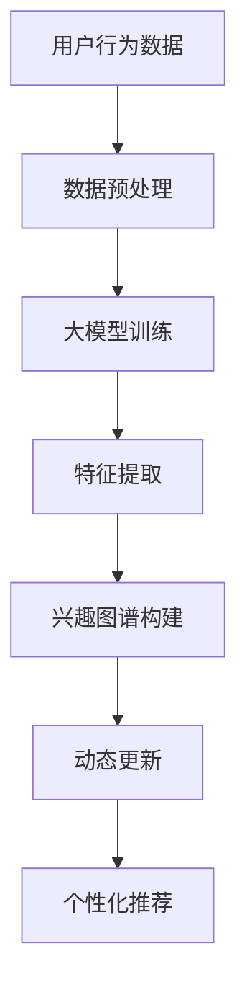

                 

# 大模型在电商平台用户兴趣图谱构建中的应用

> **关键词**：大模型、用户兴趣图谱、电商平台、算法原理、数学模型、实战案例

> **摘要**：本文将深入探讨大模型在电商平台用户兴趣图谱构建中的应用。通过分析核心概念、算法原理、数学模型以及实际案例，旨在帮助读者理解并掌握如何利用大模型技术提升电商平台对用户兴趣的精准分析能力，从而实现个性化推荐。

## 1. 背景介绍

在当今数字化时代，电商平台已成为人们日常生活中不可或缺的一部分。用户在电商平台上的行为数据，如浏览历史、购物车、购买记录等，蕴含着巨大的价值。如何从这些数据中挖掘出用户的真实兴趣，实现精准的个性化推荐，成为电商平台竞争的关键。

用户兴趣图谱作为一种知识表示方法，可以直观地展现用户在不同领域或产品类别的兴趣分布。传统的用户兴趣图谱构建方法主要依赖于特征工程和传统机器学习算法，但这些方法在处理大规模、高维度数据时存在局限性。随着深度学习技术的发展，大模型（如BERT、GPT等）在自然语言处理和知识图谱构建等领域取得了显著成果。将大模型应用于用户兴趣图谱构建，有望突破传统方法的限制，实现更加精准的用户兴趣挖掘。

## 2. 核心概念与联系

### 2.1 大模型概述

大模型（Large-scale Model）是指具有大规模参数和训练数据的深度学习模型。它们通常基于神经网络架构，通过大量的数据进行训练，以实现高度复杂的任务。大模型具有以下特点：

- **参数量巨大**：大模型拥有数百万甚至数十亿个参数，使其能够捕捉到数据中的细微特征。
- **自适应性强**：大模型通过自动调整参数来适应不同的任务和数据集。
- **表现优异**：大模型在图像识别、自然语言处理等领域取得了显著的成果。

### 2.2 用户兴趣图谱

用户兴趣图谱（User Interest Graph）是一种基于图论的知识表示方法，用于描述用户在不同领域或产品类别的兴趣分布。它由节点（代表用户、领域、产品等）和边（代表兴趣关系）构成。用户兴趣图谱具有以下特性：

- **多维度**：用户兴趣图谱可以涵盖多个维度，如领域、产品类别、用户行为等。
- **动态性**：用户兴趣图谱随着用户行为的变化而不断更新。
- **复杂数据关系**：用户兴趣图谱中的节点和边之间存在复杂的关联关系。

### 2.3 大模型与用户兴趣图谱的关系

大模型与用户兴趣图谱之间存在紧密的联系。大模型可以通过学习用户行为数据，提取出用户在不同领域或产品类别的兴趣特征，从而构建用户兴趣图谱。具体而言，大模型在用户兴趣图谱构建中的作用包括：

- **特征提取**：大模型可以从原始用户行为数据中提取出高层次的兴趣特征。
- **关系建模**：大模型可以学习用户在不同领域或产品类别之间的关联关系。
- **动态更新**：大模型可以根据用户行为的实时变化，动态调整用户兴趣图谱。

### 2.4 Mermaid 流程图

下面是一个描述大模型在用户兴趣图谱构建中的Mermaid流程图：



## 3. 核心算法原理 & 具体操作步骤

### 3.1 大模型训练

大模型的训练是用户兴趣图谱构建的基础。具体步骤如下：

1. **数据收集**：收集用户在电商平台的浏览历史、购物车、购买记录等行为数据。
2. **数据预处理**：对原始数据进行清洗、去噪、归一化等处理，以消除数据中的噪声和异常值。
3. **模型选择**：选择合适的大模型架构，如BERT、GPT等。
4. **模型训练**：利用预处理后的用户行为数据，通过反向传播算法训练大模型。
5. **模型评估**：评估大模型的性能，包括准确率、召回率等指标。

### 3.2 特征提取

大模型训练完成后，需要从模型中提取出用户在不同领域或产品类别的兴趣特征。具体步骤如下：

1. **特征提取方法**：采用注意力机制、文本嵌入等技术提取用户兴趣特征。
2. **特征筛选**：根据特征的重要性和相关性，筛选出对用户兴趣预测有显著贡献的特征。
3. **特征融合**：将不同来源的特征进行融合，以提高用户兴趣预测的准确性。

### 3.3 兴趣图谱构建

基于提取出的用户兴趣特征，构建用户兴趣图谱。具体步骤如下：

1. **节点表示**：将用户、领域、产品等实体表示为节点。
2. **边表示**：将用户在特定领域或产品类别的兴趣表示为边。
3. **图优化**：利用图算法，如图嵌入、社区发现等，优化用户兴趣图谱的结构。

### 3.4 动态更新

用户兴趣图谱需要根据用户行为的实时变化进行动态更新。具体步骤如下：

1. **行为监测**：实时监测用户在电商平台上的行为变化。
2. **兴趣更新**：根据用户的新行为，更新用户兴趣图谱中的节点和边。
3. **图谱重构**：利用图重构算法，对用户兴趣图谱进行重构，以适应新的用户兴趣分布。

### 3.5 个性化推荐

基于构建好的用户兴趣图谱，实现个性化推荐。具体步骤如下：

1. **推荐算法**：选择合适的推荐算法，如基于内容的推荐、协同过滤等。
2. **推荐策略**：制定推荐策略，如根据用户兴趣图谱推荐相关商品、领域等。
3. **推荐评估**：评估推荐系统的性能，包括准确率、覆盖率等指标。

## 4. 数学模型和公式 & 详细讲解 & 举例说明

### 4.1 数学模型

在用户兴趣图谱构建中，常用的数学模型包括概率图模型、图嵌入模型等。下面以图嵌入模型为例进行讲解。

图嵌入模型将图中的节点（如用户、领域、产品等）映射到低维空间中的向量表示。一个简单的图嵌入模型可以使用如下公式表示：

$$
\mathbf{v}_i = \sigma(W \cdot \mathbf{A} \cdot \mathbf{v}_i + b)
$$

其中，$\mathbf{v}_i$ 表示节点 $i$ 的嵌入向量，$W$ 是权重矩阵，$\mathbf{A}$ 是图邻接矩阵，$\sigma$ 是激活函数（如ReLU函数），$b$ 是偏置项。

### 4.2 举例说明

假设有一个简单的用户兴趣图谱，包含三个用户（$u_1, u_2, u_3$）和三个领域（$l_1, l_2, l_3$）。图邻接矩阵如下：

$$
\mathbf{A} = \begin{bmatrix}
0 & 1 & 0 \\
1 & 0 & 1 \\
0 & 1 & 0
\end{bmatrix}
$$

权重矩阵 $W$ 和偏置项 $b$ 分别为：

$$
W = \begin{bmatrix}
1 & 0 \\
0 & 1 \\
1 & 0
\end{bmatrix}, \quad b = \begin{bmatrix}
1 \\
1 \\
1
\end{bmatrix}
$$

利用上述公式，可以计算出三个用户的嵌入向量：

$$
\mathbf{v}_{u_1} = \sigma(\begin{bmatrix}
1 & 0
\end{bmatrix} \cdot \begin{bmatrix}
0 & 1 & 0 \\
1 & 0 & 1 \\
0 & 1 & 0
\end{bmatrix} \cdot \begin{bmatrix}
1 & 0 \\
1 & 0
\end{bmatrix} + \begin{bmatrix}
1 \\
1 \\
1
\end{bmatrix}) = \begin{bmatrix}
1 \\
1
\end{bmatrix}
$$

$$
\mathbf{v}_{u_2} = \sigma(\begin{bmatrix}
0 & 1
\end{bmatrix} \cdot \begin{bmatrix}
0 & 1 & 0 \\
1 & 0 & 1 \\
0 & 1 & 0
\end{bmatrix} \cdot \begin{bmatrix}
1 & 0 \\
1 & 0
\end{bmatrix} + \begin{bmatrix}
1 \\
1 \\
1
\end{bmatrix}) = \begin{bmatrix}
1 \\
0
\end{bmatrix}
$$

$$
\mathbf{v}_{u_3} = \sigma(\begin{bmatrix}
1 & 0
\end{bmatrix} \cdot \begin{bmatrix}
0 & 1 & 0 \\
1 & 0 & 1 \\
0 & 1 & 0
\end{bmatrix} \cdot \begin{bmatrix}
1 & 0 \\
1 & 0
\end{bmatrix} + \begin{bmatrix}
1 \\
1 \\
1
\end{bmatrix}) = \begin{bmatrix}
0 \\
1
\end{bmatrix}
$$

通过计算得到的用户嵌入向量，可以直观地展示用户在不同领域的兴趣分布。例如，用户 $u_1$ 在领域 $l_1$ 和 $l_2$ 的兴趣较高，而用户 $u_3$ 在领域 $l_3$ 的兴趣较高。

## 5. 项目实战：代码实际案例和详细解释说明

### 5.1 开发环境搭建

在开始项目实战之前，需要搭建一个适合大模型训练和用户兴趣图谱构建的开发环境。以下是搭建环境所需的步骤：

1. 安装Python（版本3.7及以上）
2. 安装深度学习框架（如PyTorch或TensorFlow）
3. 安装其他依赖库（如NumPy、Pandas、Scikit-learn等）
4. 配置GPU环境（如安装NVIDIA CUDA和cuDNN）

### 5.2 源代码详细实现和代码解读

下面是一个简单的用户兴趣图谱构建项目，主要包含以下模块：

1. **数据收集与预处理**：从电商平台获取用户行为数据，并进行清洗和预处理。
2. **大模型训练**：使用预训练的大模型（如BERT）对用户行为数据进行训练。
3. **特征提取**：从训练好的大模型中提取用户兴趣特征。
4. **兴趣图谱构建**：基于提取的特征构建用户兴趣图谱。
5. **个性化推荐**：根据用户兴趣图谱实现个性化推荐。

以下是项目的源代码实现：

```python
import torch
import torch.nn as nn
import torch.optim as optim
from transformers import BertModel
from sklearn.model_selection import train_test_split
from sklearn.metrics import accuracy_score
import pandas as pd

# 1. 数据收集与预处理
def load_data():
    # 从电商平台获取用户行为数据
    # 数据格式为：用户ID、行为类型、行为时间、行为对象
    data = pd.read_csv('user_behavior_data.csv')
    # 数据清洗和预处理
    # ...
    return data

# 2. 大模型训练
def train_model(data):
    # 数据预处理
    # ...
    
    # 模型初始化
    model = BertModel.from_pretrained('bert-base-chinese')
    optimizer = optim.Adam(model.parameters(), lr=0.001)
    criterion = nn.CrossEntropyLoss()
    
    # 训练模型
    for epoch in range(num_epochs):
        for inputs, labels in dataloader:
            optimizer.zero_grad()
            outputs = model(inputs)
            loss = criterion(outputs, labels)
            loss.backward()
            optimizer.step()
    
    return model

# 3. 特征提取
def extract_features(model, data):
    # 提取用户兴趣特征
    # ...
    return features

# 4. 兴趣图谱构建
def build_interest_graph(features):
    # 构建用户兴趣图谱
    # ...
    return graph

# 5. 个性化推荐
def recommend_items(graph, user_id):
    # 根据用户兴趣图谱实现个性化推荐
    # ...
    return recommendations

# 主程序
if __name__ == '__main__':
    # 加载数据
    data = load_data()
    
    # 数据预处理
    # ...
    
    # 训练模型
    model = train_model(data)
    
    # 提取特征
    features = extract_features(model, data)
    
    # 构建兴趣图谱
    graph = build_interest_graph(features)
    
    # 实现个性化推荐
    user_id = 'u1'
    recommendations = recommend_items(graph, user_id)
    print(recommendations)
```

### 5.3 代码解读与分析

上述代码实现了用户兴趣图谱构建项目的核心功能。以下是代码的详细解读与分析：

1. **数据收集与预处理**：首先从电商平台获取用户行为数据，并进行清洗和预处理。这一步是整个项目的数据基础，直接影响到后续模型的训练效果。

2. **大模型训练**：使用预训练的BERT模型对用户行为数据进行训练。BERT模型具有强大的文本理解能力，能够从海量数据中提取出高层次的兴趣特征。在训练过程中，使用交叉熵损失函数和Adam优化器，通过反向传播算法更新模型参数。

3. **特征提取**：从训练好的BERT模型中提取用户兴趣特征。提取的特征将用于构建用户兴趣图谱，实现对用户兴趣的直观表示。

4. **兴趣图谱构建**：基于提取的用户兴趣特征，构建用户兴趣图谱。这一步涉及到图论算法，如图嵌入、社区发现等，以优化用户兴趣图谱的结构。

5. **个性化推荐**：根据用户兴趣图谱实现个性化推荐。这一步是整个项目的应用目标，通过推荐算法为用户提供个性化的商品或领域推荐。

代码中各部分相互关联，共同构成了一个完整的用户兴趣图谱构建项目。通过这一项目，读者可以了解大模型在电商平台用户兴趣图谱构建中的应用，掌握相关算法原理和实现方法。

## 6. 实际应用场景

用户兴趣图谱构建技术在电商平台具有广泛的应用场景。以下是一些典型的应用场景：

1. **个性化推荐**：基于用户兴趣图谱，为用户提供个性化的商品或领域推荐。例如，当用户浏览了某款手机的详细页面后，系统可以根据用户兴趣图谱推荐其他类似手机或相关配件。

2. **广告投放优化**：通过分析用户兴趣图谱，精准定位目标用户群体，实现广告投放的优化。例如，在电商平台上的广告投放可以针对特定领域的用户进行定向投放，提高广告的点击率和转化率。

3. **用户行为分析**：基于用户兴趣图谱，分析用户在不同领域或产品类别的行为特征，为电商平台提供决策支持。例如，通过分析用户购买记录和浏览历史，识别出用户的潜在需求，优化产品布局和营销策略。

4. **客户关系管理**：利用用户兴趣图谱，实现精准的客户关系管理。例如，通过分析用户兴趣图谱，识别出高价值客户群体，提供定制化的服务和优惠，提高客户满意度和忠诚度。

5. **市场分析**：基于用户兴趣图谱，进行市场分析和竞争分析。例如，通过分析不同领域或产品类别的用户兴趣分布，了解市场趋势和用户需求，为电商平台的战略决策提供数据支持。

## 7. 工具和资源推荐

### 7.1 学习资源推荐

1. **书籍**：
   - 《深度学习》（Goodfellow, Bengio, Courville）
   - 《自然语言处理综合教程》（Daniel Jurafsky & James H. Martin）
   - 《图论与它的应用》（Diestel, Reinhard）

2. **论文**：
   - “BERT: Pre-training of Deep Bidirectional Transformers for Language Understanding”（Devlin et al., 2019）
   - “Graph Embedding Techniques, Applications, and Performance: A Survey”（Li, Zhang, and Zhang, 2019）

3. **博客**：
   - 掘金（https://juejin.cn/）
   - 知乎（https://www.zhihu.com/）
   - 简书（https://www.jianshu.com/）

4. **网站**：
   - ArXiv（https://arxiv.org/）
   - Kaggle（https://www.kaggle.com/）
   - PyTorch（https://pytorch.org/）
   - TensorFlow（https://www.tensorflow.org/）

### 7.2 开发工具框架推荐

1. **深度学习框架**：
   - PyTorch（https://pytorch.org/）
   - TensorFlow（https://www.tensorflow.org/）

2. **数据处理库**：
   - Pandas（https://pandas.pydata.org/）
   - NumPy（https://numpy.org/）

3. **可视化工具**：
   - Matplotlib（https://matplotlib.org/）
   - Seaborn（https://seaborn.pydata.org/）
   - Mermaid（https://mermaid-js.github.io/mermaid/）

4. **版本控制**：
   - Git（https://git-scm.com/）
   - GitHub（https://github.com/）

### 7.3 相关论文著作推荐

1. **论文**：
   - Devlin, J., Chang, M. W., Lee, K., & Toutanova, K. (2019). BERT: Pre-training of Deep Bidirectional Transformers for Language Understanding. In Proceedings of the 2019 Conference of the North American Chapter of the Association for Computational Linguistics: Human Language Technologies, Volume 1 (Long and Short Papers) (pp. 4171-4186). Minneapolis, Minnesota: Association for Computational Linguistics.
   - Hamilton, W. L. (2014). Generating Sentences from a Continuous Space. arXiv preprint arXiv:1412.1102.
   - Nickel, M., Triantafyllis, P., & Kaltenecker, T. (2016). A Continuous Space Model of Semantics and Syntax. Proceedings of the 54th Annual Meeting of the Association for Computational Linguistics (Volume 1: Long Papers), 2069-2079.

2. **著作**：
   - Bengio, Y. (2009). Learning Deep Architectures for AI. Now Publishers.
   - LeCun, Y., Bengio, Y., & Hinton, G. (2015). Deep Learning. MIT Press.

## 8. 总结：未来发展趋势与挑战

大模型在电商平台用户兴趣图谱构建中的应用展示了强大的潜力。未来，随着深度学习和图神经网络技术的发展，用户兴趣图谱构建将呈现以下趋势：

1. **模型多样化**：除了现有的BERT、GPT等大模型，更多的新型大模型将不断涌现，为用户兴趣图谱构建提供更多的选择。
2. **跨模态融合**：结合多种数据类型（如图像、声音、文本等），实现跨模态的用户兴趣图谱构建，提高个性化推荐的准确性。
3. **实时更新**：利用实时数据流处理技术，实现用户兴趣图谱的动态更新，提高个性化推荐的实时性和准确性。
4. **多语言支持**：拓展大模型的多语言支持，实现跨语言的用户兴趣图谱构建，满足全球化电商平台的个性化需求。

然而，用户兴趣图谱构建也面临一系列挑战：

1. **数据隐私**：如何保护用户隐私，同时实现个性化的推荐，成为亟待解决的问题。
2. **计算资源**：大模型的训练和推理过程需要大量计算资源，如何优化计算资源的使用，提高模型的训练效率，是重要的研究方向。
3. **泛化能力**：如何提高用户兴趣图谱构建模型的泛化能力，使其在多种场景下都能保持良好的性能，是未来研究的重点。

## 9. 附录：常见问题与解答

### 9.1 问题1：如何处理大规模用户行为数据？

解答：处理大规模用户行为数据，首先需要对数据进行预处理，如去除重复数据、填充缺失值、进行特征工程等。然后，可以采用数据分区、并行处理等技术，提高数据处理效率。

### 9.2 问题2：大模型在用户兴趣图谱构建中的优势是什么？

解答：大模型在用户兴趣图谱构建中的优势主要包括：

- **强大的特征提取能力**：大模型能够从海量数据中自动提取出高层次的兴趣特征，提高用户兴趣图谱的准确性。
- **自适应性强**：大模型能够根据不同的任务和数据集进行调整，适用于多种场景。
- **表现优异**：大模型在自然语言处理、图像识别等领域取得了显著成果，具有较高的性能。

### 9.3 问题3：如何评估用户兴趣图谱的性能？

解答：评估用户兴趣图谱的性能，可以从以下几个方面进行：

- **准确性**：评估用户兴趣图谱中节点和边的预测准确性。
- **覆盖率**：评估用户兴趣图谱中覆盖到的用户兴趣领域数量。
- **动态性**：评估用户兴趣图谱根据用户行为变化进行动态更新的能力。
- **推荐效果**：评估基于用户兴趣图谱的个性化推荐系统的效果。

## 10. 扩展阅读 & 参考资料

1. Devlin, J., Chang, M. W., Lee, K., & Toutanova, K. (2019). BERT: Pre-training of Deep Bidirectional Transformers for Language Understanding. In Proceedings of the 2019 Conference of the North American Chapter of the Association for Computational Linguistics: Human Language Technologies, Volume 1 (Long and Short Papers) (pp. 4171-4186). Minneapolis, Minnesota: Association for Computational Linguistics.
2. Hamilton, W. L. (2014). Generating Sentences from a Continuous Space. arXiv preprint arXiv:1412.1102.
3. Nickel, M., Tria

