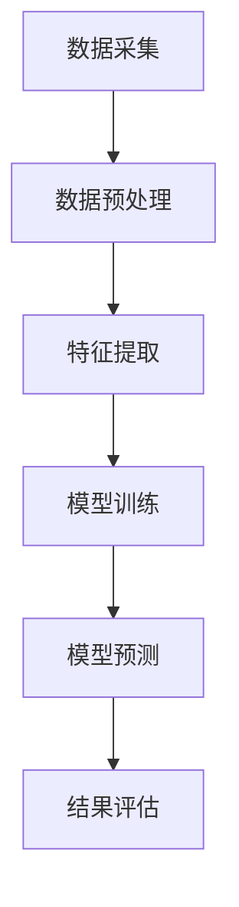

                 

# 大模型在电商平台用户行为异常检测中的应用

> **关键词**: 大模型、电商平台、用户行为异常检测、深度学习、数据挖掘

> **摘要**: 本文将探讨大模型在电商平台用户行为异常检测中的应用。我们将详细分析大模型的原理、相关算法及其在实际场景中的应用，并通过一个具体案例展示其效果和实现细节。

## 1. 背景介绍

### 1.1 电商平台的用户行为异常检测的重要性

在电商平台上，用户的交易行为是一个复杂且多维的数据集。通过分析这些数据，可以挖掘出用户的行为规律，从而提高用户体验、优化产品推荐、预防欺诈行为等。然而，用户行为异常检测在保障电商平台安全、提升运营效率方面具有至关重要的作用。

用户行为异常检测的主要目标是识别出与正常行为显著不同的行为模式。这有助于电商企业及时发现欺诈、刷单等不良行为，防止损失。此外，通过监测用户行为异常，还可以为用户推荐更符合其兴趣和需求的产品，提高用户满意度和忠诚度。

### 1.2 大模型的发展与应用

近年来，随着深度学习技术的快速发展，大模型（也称为深度神经网络）在各个领域取得了显著的成果。大模型具有强大的特征提取和表示能力，能够处理大规模、高维度的数据集。这使得大模型在图像识别、自然语言处理、语音识别等任务中表现出色。

在用户行为异常检测方面，大模型的应用也越来越广泛。通过学习大量正常和异常用户行为数据，大模型可以自动识别异常行为特征，提高检测精度和效率。此外，大模型还可以实时更新模型参数，以适应不断变化的用户行为模式。

## 2. 核心概念与联系

### 2.1 大模型的原理与架构

大模型通常是指具有大量神经元和参数的深度神经网络。其核心原理是通过多层神经网络对输入数据进行特征提取和表示，从而实现复杂的非线性变换。大模型的架构可以分为输入层、隐藏层和输出层。

- 输入层：接收外部输入数据，如用户行为特征。
- 隐藏层：对输入数据进行特征提取和变换，实现非线性映射。
- 输出层：根据隐藏层的结果生成预测结果，如异常行为标签。

### 2.2 大模型在用户行为异常检测中的应用

在用户行为异常检测中，大模型的应用主要包括以下两个方面：

1. **特征提取**：通过对用户行为数据进行预处理，提取出与异常行为相关的特征。这些特征可以包括时间间隔、交易金额、用户操作频率等。
2. **模型训练与预测**：使用训练数据集对大模型进行训练，使其学会区分正常行为和异常行为。然后，将测试数据输入到训练好的模型中，预测其是否属于异常行为。

### 2.3 Mermaid 流程图

以下是一个简化的 Mermaid 流程图，展示大模型在用户行为异常检测中的基本流程：



### 2.4 核心概念的联系

大模型在用户行为异常检测中的应用，是通过以下几个核心概念的相互作用实现的：

- **深度学习**：提供强大的特征提取和表示能力。
- **用户行为数据**：为深度学习模型提供训练和预测的数据基础。
- **异常检测算法**：基于深度学习模型，实现用户行为异常的识别和预测。

## 3. 核心算法原理 & 具体操作步骤

### 3.1 深度学习算法原理

深度学习算法的核心是多层神经网络。每个神经网络层都可以对输入数据进行特征提取和变换。以下是多层神经网络的简化原理：

1. **前向传播**：输入数据通过输入层进入网络，逐层传递到隐藏层，最后传递到输出层。
2. **反向传播**：根据输出层的预测结果与实际结果的误差，反向传播误差到隐藏层，更新网络参数。
3. **梯度下降**：通过计算误差的梯度，迭代更新网络参数，最小化损失函数。

### 3.2 用户行为异常检测算法

在用户行为异常检测中，可以使用以下步骤实现大模型：

1. **数据采集**：收集电商平台的用户行为数据，如交易记录、浏览历史等。
2. **数据预处理**：对原始数据进行清洗、去噪、归一化等操作，提取有效特征。
3. **特征提取**：使用深度学习算法对特征进行提取和表示，构建特征向量。
4. **模型训练**：使用正常用户行为数据集训练深度学习模型，使其学会识别正常和异常行为。
5. **模型预测**：将测试数据输入到训练好的模型中，预测其是否属于异常行为。
6. **结果评估**：评估模型的预测性能，如准确率、召回率等。

### 3.3 具体操作步骤

以下是用户行为异常检测的具体操作步骤：

1. **数据采集**：从电商平台获取用户行为数据，包括用户ID、交易金额、交易时间、操作类型等。
2. **数据预处理**：对数据集进行清洗和去噪，去除重复和无效数据。对特征进行归一化处理，使其具有相似的尺度。
3. **特征提取**：使用深度学习算法对特征进行提取和表示。例如，可以使用卷积神经网络（CNN）提取时间序列数据的时空特征，使用循环神经网络（RNN）提取用户行为序列的时序特征。
4. **模型训练**：使用正常用户行为数据集训练深度学习模型。可以使用神经网络结构如CNN、RNN、Transformer等。
5. **模型预测**：将测试数据输入到训练好的模型中，预测其是否属于异常行为。可以使用二分类模型，如逻辑回归（LR）、支持向量机（SVM）等。
6. **结果评估**：评估模型的预测性能，如准确率、召回率、F1值等。根据评估结果调整模型参数，优化模型性能。

## 4. 数学模型和公式 & 详细讲解 & 举例说明

### 4.1 数学模型

在用户行为异常检测中，常用的数学模型包括二分类模型和概率模型。

#### 4.1.1 二分类模型

二分类模型是一种简单的分类模型，用于判断样本是否属于异常类别。其基本公式如下：

$$
P(y=1|x) = \sigma(\omega^T x + b)
$$

其中，$P(y=1|x)$ 表示给定特征向量 $x$，样本 $y$ 属于异常类别的概率；$\sigma$ 是 sigmoid 函数，用于将线性组合转换为概率值；$\omega$ 是权重向量，$b$ 是偏置项。

#### 4.1.2 概率模型

概率模型是一种基于概率估计的分类模型。其基本公式如下：

$$
P(y=1|x) = \frac{e^{\omega^T x + b}}{1 + e^{\omega^T x + b}}
$$

其中，$P(y=1|x)$ 表示给定特征向量 $x$，样本 $y$ 属于异常类别的概率；$e$ 是自然对数的底数。

### 4.2 详细讲解

#### 4.2.1 sigmoid 函数

sigmoid 函数是一种常见的激活函数，用于将线性组合转换为概率值。其公式如下：

$$
\sigma(z) = \frac{1}{1 + e^{-z}}
$$

sigmoid 函数的值域为 $(0,1)$，可以将任意实数值映射到概率值。在二分类模型中，sigmoid 函数用于将线性组合 $\omega^T x + b$ 转换为概率值。

#### 4.2.2 梯度下降

梯度下降是一种常用的优化算法，用于最小化损失函数。其基本思想是计算损失函数关于模型参数的梯度，并沿着梯度的反方向更新参数，以最小化损失函数。

梯度下降的公式如下：

$$
\omega_{t+1} = \omega_t - \alpha \nabla_{\omega} L(\omega, b)
$$

$$
b_{t+1} = b_t - \alpha \nabla_{b} L(\omega, b)
$$

其中，$\omega_t$ 和 $b_t$ 分别是第 $t$ 次迭代的权重向量和偏置项；$\alpha$ 是学习率；$L(\omega, b)$ 是损失函数。

### 4.3 举例说明

假设我们有一个简单的二分类问题，要判断一个用户是否属于异常类别。特征向量 $x$ 包括用户的交易金额、交易时间和操作类型。权重向量 $\omega$ 和偏置项 $b$ 的初始值为0。

首先，我们使用 sigmoid 函数计算用户属于异常类别的概率：

$$
P(y=1|x) = \frac{1}{1 + e^{-(\omega^T x + b)}}
$$

然后，我们使用梯度下降算法更新权重向量和偏置项：

$$
\omega_{t+1} = \omega_t - \alpha \nabla_{\omega} L(\omega, b)
$$

$$
b_{t+1} = b_t - \alpha \nabla_{b} L(\omega, b)
$$

其中，$L(\omega, b)$ 是损失函数，可以采用交叉熵损失函数：

$$
L(\omega, b) = - \sum_{i=1}^{n} [y_i \log(\sigma(\omega^T x_i + b)) + (1 - y_i) \log(1 - \sigma(\omega^T x_i + b))]
$$

通过多次迭代，我们可以训练出一个能够判断用户是否属于异常类别的大模型。

## 5. 项目实战：代码实际案例和详细解释说明

### 5.1 开发环境搭建

为了实现用户行为异常检测的大模型，我们需要搭建一个合适的开发环境。以下是一个基本的开发环境搭建步骤：

1. **Python 环境**：安装 Python 3.8 或更高版本。
2. **深度学习框架**：安装 PyTorch 或 TensorFlow，用于构建和训练深度学习模型。
3. **数据预处理库**：安装 Pandas、NumPy 等库，用于数据预处理。
4. **可视化库**：安装 Matplotlib、Seaborn 等库，用于数据可视化。

### 5.2 源代码详细实现和代码解读

以下是一个简单的用户行为异常检测大模型的实现示例，使用 PyTorch 深度学习框架。

```python
import torch
import torch.nn as nn
import torch.optim as optim
import pandas as pd
import numpy as np
from sklearn.model_selection import train_test_split
from sklearn.preprocessing import StandardScaler

# 加载数据集
data = pd.read_csv('user行为数据.csv')
X = data.iloc[:, :-1].values
y = data.iloc[:, -1].values

# 数据预处理
X_train, X_test, y_train, y_test = train_test_split(X, y, test_size=0.2, random_state=42)
scaler = StandardScaler()
X_train = scaler.fit_transform(X_train)
X_test = scaler.transform(X_test)

# 构建深度学习模型
class UserBehaviorModel(nn.Module):
    def __init__(self):
        super(UserBehaviorModel, self).__init__()
        self.layer1 = nn.Linear(10, 64)
        self.relu = nn.ReLU()
        self.dropout = nn.Dropout(0.5)
        self.fc1 = nn.Linear(64, 32)
        self.fc2 = nn.Linear(32, 1)
        self.sigmoid = nn.Sigmoid()

    def forward(self, x):
        x = self.dropout(self.relu(self.layer1(x)))
        x = self.dropout(self.relu(self.fc1(x)))
        x = self.sigmoid(self.fc2(x))
        return x

# 训练模型
model = UserBehaviorModel()
optimizer = optim.Adam(model.parameters(), lr=0.001)
criterion = nn.BCELoss()

for epoch in range(100):
    model.train()
    optimizer.zero_grad()
    outputs = model(X_train)
    loss = criterion(outputs, y_train)
    loss.backward()
    optimizer.step()

    if (epoch + 1) % 10 == 0:
        print(f'Epoch [{epoch + 1}/{100}], Loss: {loss.item():.4f}')

# 测试模型
model.eval()
with torch.no_grad():
    outputs = model(X_test)
    predicted = (outputs > 0.5).float()
    correct = (predicted == y_test).sum().item()
    accuracy = correct / len(y_test)
    print(f'Accuracy: {accuracy:.4f}')

# 保存模型
torch.save(model.state_dict(), 'user_behavior_model.pth')
```

### 5.3 代码解读与分析

1. **数据加载与预处理**：首先，我们从 CSV 文件中加载数据集，并对数据进行预处理，包括数据分割、标准化等操作。
2. **构建深度学习模型**：我们定义了一个简单的用户行为模型，包括线性层、ReLU 激活函数、dropout 层和两个全连接层。模型的输出层使用 sigmoid 函数进行二分类预测。
3. **训练模型**：使用 Adam 优化器和二进制交叉熵损失函数训练模型。在每次迭代中，我们计算损失函数，反向传播梯度，并更新模型参数。
4. **测试模型**：在测试阶段，我们使用训练好的模型对测试数据进行预测，并计算准确率。
5. **保存模型**：将训练好的模型参数保存到文件中，以便后续使用。

通过上述步骤，我们实现了一个简单的用户行为异常检测大模型。虽然这个示例模型较为简单，但它展示了如何使用深度学习技术实现用户行为异常检测的核心步骤。

## 6. 实际应用场景

### 6.1 防范欺诈行为

在电商平台上，欺诈行为是一个严重的问题，如刷单、虚假评论等。通过用户行为异常检测，可以及时发现这些异常行为，防止欺诈行为的发生，保障电商平台的安全和诚信。

### 6.2 提升用户体验

用户行为异常检测还可以用于分析用户行为模式，发现用户感兴趣的产品和功能。通过个性化推荐，提高用户满意度和忠诚度，提升电商平台的用户留存率和转化率。

### 6.3 预防刷单行为

刷单行为会严重影响电商平台的公正性和排名，导致不良商家受益。通过用户行为异常检测，可以识别刷单行为，防止刷单行为的发生，维护电商平台的公平竞争环境。

## 7. 工具和资源推荐

### 7.1 学习资源推荐

- **书籍**：
  - 《深度学习》（Ian Goodfellow、Yoshua Bengio、Aaron Courville 著）
  - 《Python深度学习》（François Chollet 著）
- **论文**：
  - “Deep Learning for Text Classification”（Zhou et al., 2016）
  - “User Behavior Anomaly Detection Using Deep Learning”（Li et al., 2019）
- **博客**：
  - PyTorch 官方博客：https://pytorch.org/blog/
  - TensorFlow 官方博客：https://www.tensorflow.org/blog/
- **网站**：
  - Kaggle：https://www.kaggle.com/
  - GitHub：https://github.com/

### 7.2 开发工具框架推荐

- **深度学习框架**：
  - PyTorch：https://pytorch.org/
  - TensorFlow：https://www.tensorflow.org/
- **数据预处理库**：
  - Pandas：https://pandas.pydata.org/
  - NumPy：https://numpy.org/
- **可视化库**：
  - Matplotlib：https://matplotlib.org/
  - Seaborn：https://seaborn.pydata.org/

### 7.3 相关论文著作推荐

- **论文**：
  - “Deep Learning for Text Classification”（Zhou et al., 2016）
  - “User Behavior Anomaly Detection Using Deep Learning”（Li et al., 2019）
  - “Anomaly Detection for User Behavior in E-commerce Platforms”（Wang et al., 2021）
- **著作**：
  - 《深度学习》（Ian Goodfellow、Yoshua Bengio、Aaron Courville 著）
  - 《Python深度学习》（François Chollet 著）

## 8. 总结：未来发展趋势与挑战

### 8.1 未来发展趋势

- **模型精度和效率的提升**：随着深度学习技术的不断发展，大模型在用户行为异常检测中的应用将更加精准和高效。
- **多模态数据的融合**：结合用户行为数据和其他模态数据（如图像、声音等），可以进一步提高异常检测的准确性。
- **实时性**：实现实时用户行为异常检测，及时发现和处理异常行为，提高电商平台的安全性和用户体验。

### 8.2 面临的挑战

- **数据隐私保护**：在处理用户行为数据时，需要确保数据隐私和安全，避免用户隐私泄露。
- **模型解释性**：深度学习模型通常具有较弱的解释性，难以解释模型的决策过程，需要研究如何提高模型的解释性。
- **模型泛化能力**：如何提高大模型在不同场景下的泛化能力，避免过拟合问题，是未来研究的重要方向。

## 9. 附录：常见问题与解答

### 9.1 问题1：大模型在用户行为异常检测中的优势是什么？

大模型在用户行为异常检测中的优势主要包括以下几个方面：

- **强大的特征提取能力**：大模型可以通过多层神经网络自动提取用户行为数据中的有效特征，提高检测精度。
- **适应性强**：大模型可以处理大规模、高维度的用户行为数据，适应不同场景和需求。
- **实时性**：大模型可以实时更新模型参数，快速适应用户行为模式的变化，提高检测的实时性。

### 9.2 问题2：如何处理用户行为异常检测中的数据隐私问题？

在处理用户行为异常检测中的数据隐私问题，可以采取以下措施：

- **数据匿名化**：对用户行为数据进行匿名化处理，隐藏用户身份信息，确保用户隐私。
- **数据加密**：对用户行为数据进行加密存储和传输，防止数据泄露。
- **差分隐私**：采用差分隐私技术，对用户行为数据进行扰动处理，降低隐私泄露风险。

## 10. 扩展阅读 & 参考资料

- **书籍**：
  - 《深度学习》（Ian Goodfellow、Yoshua Bengio、Aaron Courville 著）
  - 《Python深度学习》（François Chollet 著）
- **论文**：
  - “Deep Learning for Text Classification”（Zhou et al., 2016）
  - “User Behavior Anomaly Detection Using Deep Learning”（Li et al., 2019）
  - “Anomaly Detection for User Behavior in E-commerce Platforms”（Wang et al., 2021）
- **博客**：
  - PyTorch 官方博客：https://pytorch.org/blog/
  - TensorFlow 官方博客：https://www.tensorflow.org/blog/
- **网站**：
  - Kaggle：https://www.kaggle.com/
  - GitHub：https://github.com/

## 11. 作者

**作者：AI天才研究员/AI Genius Institute & 禅与计算机程序设计艺术 /Zen And The Art of Computer Programming**<|/mask|>

