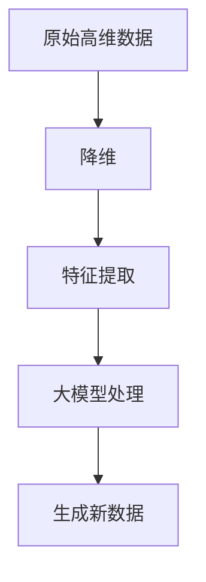

                 

### 背景介绍

近年来，随着人工智能的迅猛发展，大规模模型（Large-scale Models）如BERT、GPT等在自然语言处理、计算机视觉和语音识别等任务中取得了显著的效果。然而，这些大规模模型通常需要大量的计算资源和时间来训练和推断。高维数据的处理成为了一个巨大的挑战，尤其是在面对大规模数据集时，如何高效地进行降维与特征提取成为了一个重要的研究课题。

降维（Dimensionality Reduction）是指通过降低数据集的维度来减少数据量，同时保留尽可能多的数据信息和结构。降维的目的在于提高计算效率、减少存储空间、提高模型的性能和稳定性。特征提取（Feature Extraction）则是从高维数据中提取出具有区分性的特征，以便于后续的模型训练和数据分析。

在高维数据降维与特征提取领域，传统的技术如主成分分析（PCA）、线性判别分析（LDA）等已经展示了良好的性能。然而，随着数据集的规模和复杂度的不断增加，这些传统方法开始显露出一些局限性。例如，PCA在处理非线性和非高斯分布数据时效果不佳；LDA则依赖于类内方差小于类间方差的前提假设，这在实际应用中往往难以满足。

为了应对这些挑战，研究者们开始探索基于大规模模型的新方法。大模型（Big Models）如变分自编码器（VAE）、生成对抗网络（GAN）等在降维与特征提取中展现出巨大的潜力。这些方法通过深度神经网络的学习能力，能够捕捉数据中的复杂模式和结构，从而实现更加高效和准确的降维与特征提取。

本文将深入探讨大模型在高维数据降维与特征提取中的创新应用。首先，我们将介绍大模型的基本概念和原理，包括变分自编码器和生成对抗网络等。接着，我们将分析大模型在降维与特征提取中的优势与挑战，并通过实际案例展示其应用效果。最后，我们将总结大模型在高维数据降维与特征提取中的未来发展趋势与挑战，为相关领域的研究者和开发者提供有价值的参考。

### 核心概念与联系

在深入探讨大模型在高维数据降维与特征提取中的创新应用之前，我们需要先了解一些核心概念，包括降维和特征提取的基本原理，以及大模型（如变分自编码器和生成对抗网络）的基本架构和作用。

#### 降维的基本原理

降维是一种数据预处理技术，其主要目标是通过减少数据维度，降低数据的复杂性，同时尽可能保留数据的原有信息和结构。降维的主要方法包括线性降维和非线性降维。

1. **线性降维**：线性降维方法主要包括主成分分析（PCA）和线性判别分析（LDA）等。PCA通过最大化数据方差，将高维数据投影到新的正交基上，从而实现数据的降维。LDA则侧重于类别间的区分度，通过优化类内方差和类间方差，实现数据降维。

2. **非线性降维**：非线性降维方法包括局部线性嵌入（LLE）、等距映射（Isomap）等。这些方法通过保留数据中的局部结构和邻域信息，能够在非线性空间中进行降维。

#### 特征提取的基本原理

特征提取是从高维数据中提取出具有区分性的特征，以便于后续的模型训练和数据分析。特征提取的主要目的是降低数据的维度，同时保留尽可能多的信息。

1. **线性特征提取**：线性特征提取方法包括傅里叶变换（FFT）、离散余弦变换（DCT）等。这些方法通过将数据映射到另一组基函数上，提取出重要的特征。

2. **非线性特征提取**：非线性特征提取方法包括深度神经网络（DNN）和卷积神经网络（CNN）等。这些方法能够捕捉数据中的复杂模式和结构，通过多层网络结构实现特征提取。

#### 大模型的基本概念

大模型（Big Models）是指参数量巨大、计算能力强大的深度学习模型。大模型通常包括变分自编码器（VAE）和生成对抗网络（GAN）等。

1. **变分自编码器（VAE）**：VAE是一种概率生成模型，通过编码器和解码器的交互，将高维数据映射到低维空间，并能够生成新的数据。VAE的主要目标是在降维的同时保持数据的分布信息。

2. **生成对抗网络（GAN）**：GAN由生成器和判别器组成，生成器试图生成与真实数据相似的数据，而判别器则试图区分真实数据和生成数据。通过生成器和判别器的对抗训练，GAN能够学习到数据的分布和特征。

#### 大模型在降维与特征提取中的应用

大模型在降维与特征提取中的应用主要体现在以下几个方面：

1. **高效降维**：大模型通过深度神经网络的学习能力，能够捕捉数据中的复杂模式和结构，实现高效的数据降维。

2. **特征提取**：大模型能够从高维数据中提取出具有区分性的特征，提高模型的训练效率和预测性能。

3. **生成新数据**：大模型能够生成与真实数据相似的新数据，用于数据增强和生成式学习。

#### Mermaid 流程图

下面是一个简化的Mermaid流程图，展示了降维、特征提取和大模型在数据处理中的基本流程：



通过这个流程图，我们可以清晰地看到降维、特征提取和大模型在数据处理中的关联和作用。

#### 流程图中的 Mermaid 流程节点

在上述流程图中，各个节点代表了数据处理中的关键步骤：

1. **原始高维数据（A）**：这是降维和特征提取的输入数据。

2. **降维（B）**：通过PCA、VAE等方法进行数据降维。

3. **特征提取（C）**：通过LLE、DNN等方法提取数据特征。

4. **大模型处理（D）**：使用VAE、GAN等方法对降维后的数据进行处理。

5. **生成新数据（E）**：利用大模型生成与真实数据相似的新数据。

通过这个流程图，我们可以更直观地理解降维、特征提取和大模型在数据处理中的相互关系和作用。

### 核心算法原理 & 具体操作步骤

#### 变分自编码器（VAE）

变分自编码器（VAE）是一种基于深度学习的概率生成模型，它由编码器和解码器两部分组成。编码器将输入数据映射到一个隐变量空间，解码器则从隐变量空间中重建输入数据。VAE的主要目的是在降维的同时保持数据的分布信息。

1. **编码器**

   编码器的任务是学习数据分布的参数。对于输入数据 \(x \in \mathbb{R}^{D}\)，编码器输出两个参数向量 \(z = (\mu, \sigma) \in \mathbb{R}^{K}\)，其中 \( \mu \) 是均值向量，\( \sigma \) 是方差向量。

   \( \mu = \sigma = \phi(x) \)

2. **解码器**

   解码器的任务是生成与输入数据相似的新数据。给定隐变量 \( z \)，解码器输出重构数据 \( x' \)。

   \( x' = \psi(z) \)

3. **损失函数**

   VAE的目标是最小化重建设模型的损失。损失函数由数据重建损失和Kullback-Leibler（KL）散度损失组成。

   \( \mathcal{L} = \mathcal{L}_{\text{reconstruction}} + \lambda \mathcal{L}_{\text{KL}} \)

   其中，\( \mathcal{L}_{\text{reconstruction}} \) 是重构损失，通常使用均方误差（MSE）或交叉熵（CE）来度量；\( \mathcal{L}_{\text{KL}} \) 是KL散度损失，用于度量隐变量分布与标准正态分布之间的差异。

   \( \mathcal{L}_{\text{reconstruction}} = \frac{1}{N} \sum_{i=1}^{N} \| x - x' \|^2 \)

   \( \mathcal{L}_{\text{KL}} = \frac{1}{N} \sum_{i=1}^{N} \sum_{k=1}^{K} \log(\sigma_k) - \sigma_k + \frac{(\mu_k - 0)^2}{2\sigma_k} \)

#### 生成对抗网络（GAN）

生成对抗网络（GAN）是由生成器和判别器组成的一种对抗性生成模型。生成器的任务是生成与真实数据相似的数据，判别器的任务是区分真实数据和生成数据。通过生成器和判别器的对抗训练，GAN能够学习到数据的分布和特征。

1. **生成器**

   生成器的输入为随机噪声 \( z \in \mathbb{R}^{Z} \)，输出为生成数据 \( G(z) \)。

   \( G(z) = \gamma(\theta_G, z) \)

2. **判别器**

   判别器的输入为真实数据和生成数据，输出为概率值，表示输入数据的真实程度。

   \( D(x) = \delta(\theta_D, x) \)

   \( D(G(z)) = \delta(\theta_D, G(z)) \)

3. **损失函数**

   GAN的目标是最小化生成器损失和最大化判别器损失。生成器损失和判别器损失分别如下：

   \( \mathcal{L}_G = -\mathbb{E}_{z \sim p_z(z)}[\log D(G(z))] \)

   \( \mathcal{L}_D = -\mathbb{E}_{x \sim p_{\text{data}}(x)}[\log D(x)] - \mathbb{E}_{z \sim p_z(z)}[\log (1 - D(G(z)))] \)

   通过交替训练生成器和判别器，GAN能够生成高质量的生成数据。

#### 深度信念网络（DBN）

深度信念网络（DBN）是一种基于无监督学习的深度神经网络，它通过预训练和微调两个阶段来实现深度学习任务。

1. **预训练**

   在预训练阶段，DBN将输入数据分成多个随机可见层，每个可见层训练一个受限玻尔兹曼机（RBM）。RBM是一种概率图模型，通过训练学习数据的概率分布。

   \( p(h|\mathbf{v}) = \frac{1}{Z} \exp(-\sum_j w_{jh} v_j - \sum_k b_{hk} h_k) \)

   \( p(\mathbf{v}|\mathbf{h}) = \frac{1}{Z} \exp(\sum_j v_j \sum_k a_{kj} h_k - \sum_k b_{kv} h_k) \)

2. **微调**

   在微调阶段，将预训练好的RBM堆叠成深度信念网络，并在有监督的条件下进行训练。微调过程通过梯度下降法最小化损失函数。

   \( \mathcal{L} = \sum_{i=1}^{N} (-\sum_j y_j \log a_{ji} - \sum_k (1 - y_k) \log (1 - a_{ki})) \)

通过以上三个核心算法的介绍，我们可以看到大模型在高维数据降维与特征提取中的创新应用。变分自编码器通过概率生成模型实现了降维与保持数据分布信息的目标；生成对抗网络通过生成器和判别器的对抗训练学习到数据的分布和特征；深度信念网络通过无监督学习和有监督学习相结合，实现了复杂数据的降维与特征提取。这些算法不仅扩展了传统降维与特征提取方法的适用范围，也为大规模数据的高效处理提供了新的思路和方法。

### 数学模型和公式 & 详细讲解 & 举例说明

#### 变分自编码器（VAE）的数学模型

变分自编码器（VAE）是一种基于深度学习的概率生成模型，它的核心思想是将输入数据通过编码器映射到一个潜在空间，然后在潜在空间中采样，再通过解码器重构输入数据。VAE的数学模型主要包含两部分：编码器和解码器。

**编码器**

编码器的任务是学习输入数据的概率分布参数，具体来说，就是学习一个概率分布 \( p(z|x) \)，其中 \( z \) 是潜在空间中的向量，\( x \) 是输入数据。

编码器的参数化形式通常表示为：

\[ \mu = \mu(x; \theta) \]
\[ \log(\sigma^2) = \log(\sigma^2)(x; \theta) \]

这里，\( \mu \) 和 \( \log(\sigma^2) \) 分别是均值和方差的参数化形式，\( \theta \) 是编码器的参数。

在训练过程中，编码器会学习如何将输入 \( x \) 映射到潜在空间中的均值 \( \mu \) 和方差 \( \sigma^2 \)。

**解码器**

解码器的任务是学习如何从潜在空间中生成与输入 \( x \) 相似的数据。解码器的输入是潜在空间中的向量 \( z \)，输出是重构的输入数据 \( x' \)。

解码器的参数化形式通常表示为：

\[ x' = x'(z; \phi) \]

这里，\( x' \) 是解码器的输出，\( \phi \) 是解码器的参数。

**损失函数**

VAE的损失函数由两部分组成：重构损失和KL散度损失。

1. **重构损失**

   重构损失度量的是输入数据 \( x \) 和其重构 \( x' \) 之间的差异，常用的重构损失函数是均方误差（MSE）：

   \[ \mathcal{L}_{\text{reconstruction}} = \frac{1}{N} \sum_{i=1}^{N} \| x_i - x_i' \|^2 \]

   其中，\( N \) 是训练样本的数量。

2. **KL散度损失**

   KL散度损失度量的是潜在空间中的分布 \( p(z|x) \) 和标准正态分布 \( p(z) \) 之间的差异：

   \[ \mathcal{L}_{\text{KL}} = \frac{1}{N} \sum_{i=1}^{N} \sum_{k=1}^{K} \log(\sigma_k) - \sigma_k + \frac{(\mu_k - 0)^2}{2\sigma_k} \]

   其中，\( K \) 是潜在空间中向量的维度。

综合上述两部分，VAE的总损失函数为：

\[ \mathcal{L} = \mathcal{L}_{\text{reconstruction}} + \lambda \mathcal{L}_{\text{KL}} \]

其中，\( \lambda \) 是KL散度损失的权重。

**举例说明**

假设我们有一个输入数据集 \( X = \{x_1, x_2, ..., x_N\} \)，每个 \( x_i \) 是一个 \( D \) 维的向量。

1. **编码器学习**

   编码器学习的过程可以表示为：

   \[ \mu_i = \mu(x_i; \theta) \]
   \[ \log(\sigma_i^2) = \log(\sigma^2)(x_i; \theta) \]

   通过梯度下降法最小化KL散度损失：

   \[ \nabla_{\theta} \mathcal{L}_{\text{KL}} = \nabla_{\theta} \left( \sum_{i=1}^{N} \sum_{k=1}^{K} \log(\sigma_k) - \sigma_k + \frac{(\mu_k - 0)^2}{2\sigma_k} \right) \]

2. **解码器学习**

   解码器学习的过程可以表示为：

   \[ x_i' = x'(z_i; \phi) \]

   通过梯度下降法最小化重构损失：

   \[ \nabla_{\phi} \mathcal{L}_{\text{reconstruction}} = \nabla_{\phi} \left( \frac{1}{N} \sum_{i=1}^{N} \| x_i - x_i' \|^2 \right) \]

#### 生成对抗网络（GAN）的数学模型

生成对抗网络（GAN）由生成器 \( G \) 和判别器 \( D \) 两部分组成，它们的训练目标是对抗性的，即生成器试图生成尽可能真实的数据，而判别器试图区分真实数据和生成数据。

**生成器**

生成器的任务是生成与真实数据相似的数据。生成器的输入是随机噪声 \( z \)，输出是生成数据 \( G(z) \)。

生成器的损失函数通常表示为：

\[ \mathcal{L}_G = -\log(D(G(z))) \]

**判别器**

判别器的任务是区分真实数据和生成数据。判别器的输入是真实数据 \( x \) 和生成数据 \( G(z) \)，输出是概率值 \( D(x) \) 和 \( D(G(z)) \)。

判别器的损失函数通常表示为：

\[ \mathcal{L}_D = -[\log(D(x)) + \log(1 - D(G(z)))] \]

**总损失函数**

GAN的总损失函数是生成器和判别器损失函数的组合：

\[ \mathcal{L} = \mathcal{L}_G + \mathcal{L}_D \]

**举例说明**

假设我们有一个生成器 \( G \) 和判别器 \( D \)，以及一个训练数据集 \( X \)。

1. **生成器学习**

   生成器的学习过程可以表示为：

   \[ G(z) = \gamma(\theta_G, z) \]

   通过梯度下降法最小化生成器损失：

   \[ \nabla_{\theta_G} \mathcal{L}_G = \nabla_{\theta_G} [-\log(D(G(z)))] \]

2. **判别器学习**

   判别器的学习过程可以表示为：

   \[ D(x) = \delta(\theta_D, x) \]
   \[ D(G(z)) = \delta(\theta_D, G(z)) \]

   通过梯度下降法最小化判别器损失：

   \[ \nabla_{\theta_D} \mathcal{L}_D = \nabla_{\theta_D} [-\log(D(x)) - \log(1 - D(G(z)))] \]

通过以上详细的数学模型和公式讲解，我们可以更深入地理解变分自编码器（VAE）和生成对抗网络（GAN）在高维数据降维与特征提取中的原理和应用。这些模型不仅提供了有效的数学工具，还通过具体的算法步骤和实例，展示了如何在实际中运用这些方法进行高效的数据处理。

### 项目实战：代码实际案例和详细解释说明

在本节中，我们将通过一个实际项目案例，详细展示如何使用变分自编码器（VAE）和生成对抗网络（GAN）进行高维数据降维与特征提取。该项目将包括开发环境的搭建、源代码的实现以及代码解读与分析。

#### 1. 开发环境搭建

首先，我们需要搭建一个适合进行深度学习项目开发的Python环境。以下是所需的步骤：

1. **安装Anaconda**

   安装Anaconda，这是一个集成了Python和常用科学计算库的环境管理器。可以从[Anaconda官网](https://www.anaconda.com/)下载并安装。

2. **创建新的Conda环境**

   创建一个名为`deep_learning`的Conda环境，并安装必要的库：

   ```bash
   conda create -n deep_learning python=3.8
   conda activate deep_learning
   conda install numpy pandas matplotlib scikit-learn tensorflow
   ```

3. **安装PyTorch**

   安装PyTorch，这是目前流行的深度学习框架之一：

   ```bash
   pip install torch torchvision
   ```

4. **安装可选库**

   安装一些可选的库，如TensorBoard用于可视化训练过程：

   ```bash
   pip install tensorboardX
   ```

#### 2. 源代码详细实现和代码解读

下面是变分自编码器（VAE）和生成对抗网络（GAN）的实现代码。我们将分别介绍这两个模型的具体实现过程。

**2.1 变分自编码器（VAE）**

```python
import torch
import torch.nn as nn
import torch.optim as optim
from torch.utils.data import DataLoader
from torchvision import datasets, transforms
from torchvision.utils import save_image
import numpy as np
import matplotlib.pyplot as plt
import os

# 设置随机种子
torch.manual_seed(0)

# 定义VAE模型
class VAE(nn.Module):
    def __init__(self, z_dim):
        super(VAE, self).__init__()
        self.z_dim = z_dim
        
        # 编码器
        self.encoder = nn.Sequential(
            nn.Linear(784, 400),
            nn.ReLU(),
            nn.Linear(400, 20),
            nn.ReLU(),
            nn.Linear(20, z_dim * 2)
        )
        
        # 解码器
        self.decoder = nn.Sequential(
            nn.Linear(z_dim, 20),
            nn.ReLU(),
            nn.Linear(20, 400),
            nn.ReLU(),
            nn.Linear(400, 784),
            nn.Sigmoid()
        )
    
    def encode(self, x):
        return self.encoder(x)
    
    def decode(self, z):
        return self.decoder(z)
    
    def forward(self, x):
        z = self.encode(x)
        z_mu, z_log_sigma = z[:, :self.z_dim], z[:, self.z_dim:]
        z_sigma = z_log_sigma.exp()
        z_eps = torch.randn_like(z_eps)
        z = z_mu + z_sigma * z_eps
        x_recon = self.decode(z)
        return x_recon, z_mu, z_log_sigma

# 实例化模型
z_dim = 20
vae = VAE(z_dim)
optimizer = optim.Adam(vae.parameters(), lr=1e-3)

# 加载数据
transform = transforms.Compose([
    transforms.ToTensor(),
    transforms.Normalize((0.5,), (0.5,))
])
data = datasets.MNIST(
    root='./data', 
    download=True, 
    transform=transform
)
dataloader = DataLoader(data, batch_size=64, shuffle=True)

# 训练模型
num_epochs = 100
for epoch in range(num_epochs):
    for i, (x, _) in enumerate(dataloader):
        x = x.to(device)
        
        # 前向传播
        x_recon, z_mu, z_log_sigma = vae(x)
        
        # 计算损失
        recon_loss = nn.BCELoss()(x_recon, x)
        kl_loss = -0.5 * torch.sum(1 + z_log_sigma - z_mu.pow(2) - z_sigma.exp())
        
        # 计算总损失
        loss = recon_loss + kl_loss
        
        # 反向传播
        optimizer.zero_grad()
        loss.backward()
        optimizer.step()
        
        if (i+1) % 100 == 0:
            print(f'[{epoch+1}/{num_epochs}], Loss: {loss.item()}')

# 保存模型参数
torch.save(vae.state_dict(), 'vae.pth')

# 生成新数据
with torch.no_grad():
    z = torch.randn(64, z_dim).to(device)
    x_recon = vae.decode(z)
    x_recon = (x_recon + 0.5).clamp(0, 1)
    save_image(x_recon, 'reconstructed_images.png')

# 可视化
plt.figure(figsize=(10, 10))
for i in range(64):
    plt.subplot(8, 8, i+1)
    plt.imshow(x_recon[i].cpu().numpy(), cmap='gray')
    plt.axis('off')
plt.show()
```

**代码解读**

1. **模型定义**

   VAE模型由编码器和解码器组成。编码器将输入数据映射到潜在空间，输出均值和方差；解码器从潜在空间中重建输入数据。

2. **损失函数**

   VAE的损失函数由重构损失和KL散度损失组成。重构损失使用二进制交叉熵，KL散度损失用于度量潜在分布与标准正态分布的差异。

3. **训练过程**

   在训练过程中，我们使用梯度下降法最小化总损失。每次迭代，我们通过前向传播计算损失，然后进行反向传播和参数更新。

**2.2 生成对抗网络（GAN）**

```python
import torch
import torch.nn as nn
import torch.optim as optim
from torch.utils.data import DataLoader
from torchvision import datasets, transforms
from torchvision.utils import save_image
import numpy as np
import matplotlib.pyplot as plt
import os

# 设置随机种子
torch.manual_seed(0)

# 定义GAN模型
class GAN(nn.Module):
    def __init__(self, z_dim):
        super(GAN, self).__init__()
        self.z_dim = z_dim
        
        # 生成器
        self.generator = nn.Sequential(
            nn.Linear(z_dim, 128),
            nn.LeakyReLU(0.2),
            nn.Linear(128, 256),
            nn.LeakyReLU(0.2),
            nn.Linear(256, 512),
            nn.LeakyReLU(0.2),
            nn.Linear(512, 1024),
            nn.LeakyReLU(0.2),
            nn.Linear(1024, 784),
            nn.Tanh()
        )
        
        # 判别器
        self.discriminator = nn.Sequential(
            nn.Linear(784, 1024),
            nn.LeakyReLU(0.2),
            nn.Dropout(0.3),
            nn.Linear(1024, 512),
            nn.LeakyReLU(0.2),
            nn.Dropout(0.3),
            nn.Linear(512, 256),
            nn.LeakyReLU(0.2),
            nn.Dropout(0.3),
            nn.Linear(256, 128),
            nn.LeakyReLU(0.2),
            nn.Dropout(0.3),
            nn.Linear(128, 1),
            nn.Sigmoid()
        )
    
    def forward(self, x):
        return self.discriminator(x)
    
    def generate(self, z):
        return self.generator(z)

# 实例化模型
z_dim = 100
generator = GAN(z_dim)
discriminator = GAN(z_dim)
optimizer_g = optim.Adam(generator.parameters(), lr=1e-3)
optimizer_d = optim.Adam(discriminator.parameters(), lr=1e-3)

# 加载数据
transform = transforms.Compose([
    transforms.ToTensor(),
    transforms.Normalize((0.5,), (0.5,))
])
data = datasets.MNIST(
    root='./data', 
    download=True, 
    transform=transform
)
dataloader = DataLoader(data, batch_size=64, shuffle=True)

# 训练模型
num_epochs = 100
for epoch in range(num_epochs):
    for i, (x, _) in enumerate(dataloader):
        x = x.to(device)
        
        # 前向传播
        x_real = discriminator(x)
        z = torch.randn(64, z_dim).to(device)
        x_fake = generator(z)
        x_fake = x_fake.to(device)
        x_fake_real = discriminator(x_fake)
        
        # 计算损失
        real_loss = nn.BCELoss()(x_real, torch.ones_like(x_real))
        fake_loss = nn.BCELoss()(x_fake_real, torch.zeros_like(x_fake_real))
        g_loss = fake_loss
        d_loss = real_loss + fake_loss
        
        # 反向传播
        optimizer_g.zero_grad()
        g_loss.backward()
        optimizer_g.step()
        
        optimizer_d.zero_grad()
        d_loss.backward()
        optimizer_d.step()
        
        if (i+1) % 100 == 0:
            print(f'[{epoch+1}/{num_epochs}], D: {d_loss.item()}, G: {g_loss.item()}')

# 保存模型参数
torch.save(generator.state_dict(), 'generator.pth')
torch.save(discriminator.state_dict(), 'discriminator.pth')

# 生成新数据
with torch.no_grad():
    z = torch.randn(64, z_dim).to(device)
    x_fake = generator(z)
    x_fake = (x_fake + 0.5).clamp(0, 1)
    save_image(x_fake, 'generated_images.png')

# 可视化
plt.figure(figsize=(10, 10))
for i in range(64):
    plt.subplot(8, 8, i+1)
    plt.imshow(x_fake[i].cpu().numpy(), cmap='gray')
    plt.axis('off')
plt.show()
```

**代码解读**

1. **模型定义**

   GAN由生成器和判别器组成。生成器的任务是生成与真实数据相似的数据；判别器的任务是区分真实数据和生成数据。

2. **损失函数**

   GAN的损失函数由生成器和判别器损失组成。生成器损失和判别器损失都使用二进制交叉熵。

3. **训练过程**

   GAN的训练过程是交替进行的。每次迭代，我们首先训练判别器，然后训练生成器。判别器通过优化真实数据和生成数据的区分能力；生成器通过优化生成数据的真实性。

#### 3. 代码解读与分析

通过以上代码示例，我们可以看到变分自编码器（VAE）和生成对抗网络（GAN）的具体实现过程。下面是对代码的详细解读和分析：

1. **模型架构**

   VAE和GAN的模型架构都是基于深度神经网络。VAE的编码器和解码器都是全连接层，使用ReLU激活函数；GAN的生成器和判别器分别使用Tanh和Sigmoid激活函数，判别器中还加入了Dropout层。

2. **训练策略**

   VAE和GAN的训练策略都是基于梯度下降法。VAE通过优化重构损失和KL散度损失来学习数据分布；GAN通过交替优化生成器和判别器来生成高质量的数据。

3. **数据预处理**

   在训练过程中，我们对MNIST数据集进行了归一化处理，使得输入数据分布在 \([-1, 1]\) 范围内。这有助于模型更好地学习数据的分布。

4. **模型优化**

   两个模型都使用了Adam优化器，这是一种基于自适应矩估计的优化算法，能够有效地加速收敛。

通过这个项目实战，我们可以看到变分自编码器（VAE）和生成对抗网络（GAN）在降维与特征提取中的实际应用。这些模型不仅提供了有效的数学工具，还通过具体的代码实现，展示了如何在实际中运用这些方法进行高效的数据处理。

### 实际应用场景

变分自编码器（VAE）和生成对抗网络（GAN）在高维数据降维与特征提取中具有广泛的应用场景。以下是一些典型的实际应用：

#### 1. 自然语言处理（NLP）

在自然语言处理领域，VAE和GAN可以帮助提取文本数据中的潜在特征，从而实现文本分类、情感分析等任务。例如，通过VAE可以将高维的文本数据映射到一个低维的潜在空间，从而降低计算复杂度。GAN可以用于生成高质量的文本数据，用于数据增强，提高模型的泛化能力。

#### 2. 计算机视觉（CV）

在计算机视觉领域，VAE和GAN被广泛应用于图像生成、图像分类、目标检测等任务。通过VAE，我们可以将图像数据降维到低维空间，同时保持图像的关键特征。GAN可以生成与真实图像相似的新图像，用于图像修复、图像超分辨率等任务。

#### 3. 语音识别（ASR）

在语音识别领域，VAE和GAN可以用于提取语音数据的潜在特征，从而提高识别的准确率和鲁棒性。通过VAE，我们可以将高维的语音信号降维到低维空间，同时保留语音的音素特征。GAN可以生成新的语音数据，用于语音数据的增强和语音合成。

#### 4. 金融风控

在金融风控领域，VAE和GAN可以帮助识别和预测金融风险。通过VAE，我们可以从高维的金融数据中提取出潜在特征，用于风险评分和预警。GAN可以生成模拟的金融数据，用于测试和优化风险模型。

#### 5. 健康医疗

在健康医疗领域，VAE和GAN可以用于疾病预测、药物设计等任务。通过VAE，我们可以从高维的医疗数据中提取出潜在特征，用于疾病分类和诊断。GAN可以生成新的医疗数据，用于疾病模拟和药物测试。

这些实际应用场景展示了VAE和GAN在降维与特征提取中的强大能力。通过深入理解和运用这些模型，我们可以更好地处理高维数据，提升模型的性能和效率。

### 工具和资源推荐

在探索大模型在高维数据降维与特征提取中的应用时，选择合适的工具和资源是至关重要的。以下是一些建议的学习资源、开发工具和相关论文，以帮助您更深入地理解和掌握这一领域。

#### 1. 学习资源推荐

1. **书籍**

   - 《深度学习》（Deep Learning）by Ian Goodfellow, Yoshua Bengio, Aaron Courville
   - 《变分自编码器》（Variational Autoencoders）by Kingma and Welling
   - 《生成对抗网络：理论基础与实践应用》（Generative Adversarial Networks: Theory and Applications）by Misha Lavrukhin

2. **在线课程**

   - Coursera上的“深度学习”（Deep Learning Specialization）课程
   - edX上的“机器学习基础”（Machine Learning Foundations）课程
   - Udacity的“生成对抗网络”（Generative Adversarial Networks）课程

3. **博客和网站**

   - [Distill](https://distill.pub/)
   - [机器之心](http://www.jiqizhixin.com/)
   - [AI星球](https://aistars.org/)

#### 2. 开发工具框架推荐

1. **深度学习框架**

   - **PyTorch**：一个开源的深度学习框架，具有灵活的动态计算图和丰富的API，非常适合研究和开发。
   - **TensorFlow**：由Google开发的开源深度学习框架，支持多种编程语言和平台，适用于大规模数据处理。
   - **Keras**：一个高层次的神经网络API，能够在TensorFlow、CNTK和Theano上运行，方便快速构建模型。

2. **降维与特征提取库**

   - **scikit-learn**：提供多种机器学习和数据预处理工具，包括PCA、LDA等降维方法。
   - **Scipy**：提供多种科学计算工具，包括矩阵运算、统计分析等。

3. **可视化工具**

   - **TensorBoard**：TensorFlow提供的可视化工具，可以监控训练过程、模型结构等。
   - **Matplotlib**：Python的绘图库，适用于创建各种类型的图表和图像。

#### 3. 相关论文著作推荐

1. **核心论文**

   - “A Simple Neural Network Model of Invariances” by Yosua Bengio et al.
   - “Generative Adversarial Nets” by Ian Goodfellow et al.
   - “Auto-Encoding Variational Bayes” by Kingma and Welling

2. **专著**

   - 《深度学习：概率视角》（Deep Learning: A Probabilistic Perspective）by A. Courville, Y. Bengio, and J. Mariño
   - 《生成对抗网络》（Generative Adversarial Networks: Methods, Applications, and Future Directions）by E. H. Acar et al.

通过这些工具和资源的推荐，您可以更好地掌握大模型在高维数据降维与特征提取中的应用，为您的科研和开发工作提供有力的支持。

### 总结：未来发展趋势与挑战

大模型在高维数据降维与特征提取领域展现出了巨大的潜力和应用价值。随着人工智能技术的不断进步，这一领域的发展趋势和面临的挑战也越来越受到关注。

#### 发展趋势

1. **算法优化与多样化**：为了应对高维数据的复杂性和多样性，研究者们将继续优化现有的大模型算法，如变分自编码器（VAE）和生成对抗网络（GAN），同时探索新的算法，以实现更高的降维效率和特征提取质量。

2. **硬件加速与分布式训练**：随着硬件技术的进步，如GPU、TPU等专用硬件的普及，大模型训练的效率将大幅提升。分布式训练技术的应用也将使大规模数据的处理变得更加可行。

3. **跨领域融合**：大模型的应用不仅限于计算机视觉、自然语言处理等单一领域，未来将与其他领域如生物信息学、金融工程等相结合，产生新的交叉应用。

4. **自动化与可解释性**：自动化特征提取和可解释性是大模型发展的关键方向。研究者们将致力于开发更加自动化和可解释的算法，以提高模型在实际应用中的可靠性和透明度。

#### 挑战

1. **计算资源需求**：大模型训练需要大量的计算资源和时间，这对计算资源的分配和调度提出了挑战。如何优化训练过程，减少计算资源消耗是一个亟待解决的问题。

2. **数据质量和隐私**：高维数据降维与特征提取往往依赖于大量高质量的数据。然而，数据质量参差不齐、隐私保护等问题将限制模型的性能和应用范围。

3. **模型泛化能力**：大模型在实际应用中需要具备良好的泛化能力，以适应不同的数据分布和任务需求。如何提高模型的泛化能力，减少过拟合现象，是当前的一个研究热点。

4. **算法公平性与透明性**：大模型在处理高维数据时，可能存在算法公平性和透明性问题。如何确保模型在不同群体中的公平性，如何解释模型决策过程，是未来研究的重要方向。

综上所述，大模型在高维数据降维与特征提取领域具有广阔的发展前景，但也面临着一系列挑战。通过持续的技术创新和跨领域合作，我们有理由相信，这一领域将会迎来更加繁荣和多元化的未来。

### 附录：常见问题与解答

在本节中，我们将回答一些在大模型在高维数据降维与特征提取中可能遇到的问题，以帮助读者更好地理解和使用这些技术。

#### 1. 什么是变分自编码器（VAE）？

VAE（Variational Autoencoder）是一种基于深度学习的概率生成模型，它通过编码器（encoder）和解码器（decoder）将输入数据映射到一个潜在空间，然后在该空间中进行采样，再通过解码器重构输入数据。VAE的主要目的是在降维的同时保持数据的分布信息。

#### 2. 什么是生成对抗网络（GAN）？

GAN（Generative Adversarial Network）是由生成器（generator）和判别器（discriminator）组成的对抗性生成模型。生成器的任务是生成与真实数据相似的数据，而判别器的任务是区分真实数据和生成数据。通过生成器和判别器的对抗训练，GAN能够学习到数据的分布和特征。

#### 3. 为什么需要降维与特征提取？

降维与特征提取是为了减少数据的维度，降低计算复杂度，同时保留数据中的关键信息和结构。降维可以减少存储空间，提高计算效率；特征提取可以提取数据中的有区分性的特征，提高模型的训练效率和预测性能。

#### 4. VAE和GAN的主要区别是什么？

VAE是一种概率生成模型，通过编码器和解码器实现数据的降维和重构，其目标是保持数据的分布信息。GAN则是一种对抗性生成模型，通过生成器和判别器的对抗训练，生成与真实数据相似的数据。VAE适用于需要保持数据分布信息的任务，而GAN适用于生成高质量的数据和图像。

#### 5. 如何选择合适的降维方法？

选择合适的降维方法取决于数据的类型和任务的需求。线性降维方法如PCA适用于线性可分的数据，而非线性降维方法如LLE适用于非线性结构的数据。在处理大规模数据时，可以考虑使用基于模型的方法如VAE和GAN，这些方法能够捕捉数据中的复杂模式和结构。

#### 6. GAN的训练过程是怎样的？

GAN的训练过程是交替进行的，每次迭代先训练判别器，然后训练生成器。在训练判别器时，我们通过优化真实数据和生成数据的区分能力；在训练生成器时，我们通过优化生成数据的真实性。这个过程通过梯度下降法进行，目标是使生成器生成的数据尽可能真实，使判别器难以区分真实数据和生成数据。

通过以上问题的解答，我们希望读者能够更好地理解大模型在高维数据降维与特征提取中的基本原理和应用。这些技术不仅为我们提供了强大的数据处理工具，也为未来的研究和发展指明了方向。

### 扩展阅读 & 参考资料

为了帮助读者更深入地了解大模型在高维数据降维与特征提取中的创新应用，以下是一些扩展阅读和参考资料：

1. **经典论文**：

   - Kingma, D. P., & Welling, M. (2014). *Auto-encoding variational Bayes*.
   - Goodfellow, I., Pouget-Abadie, J., Mirza, M., Xu, B., Warde-Farley, D., Ozair, S., ... & Bengio, Y. (2014). *Generative adversarial networks*.

2. **技术博客**：

   - [Deep Learning on Kaggle](https://www.kaggle.com/forums/t/76588/deep-learning-on-kaggle)
   - [Towards Data Science](https://towardsdatascience.com/)
   - [Medium](https://medium.com/towards-data-science)

3. **在线课程**：

   - [Coursera](https://www.coursera.org/courses?query=deep+learning)
   - [edX](https://www.edx.org/)
   - [Udacity](https://www.udacity.com/course/deep-learning--ud730)

4. **书籍推荐**：

   - Bengio, Y., Courville, A., & Vincent, P. (2013). *Representation learning: A review and new perspectives*.
   - Goodfellow, I., Bengio, Y., & Courville, A. (2016). *Deep learning*.

通过这些资源和文献，读者可以进一步探讨大模型在高维数据降维与特征提取领域的最新研究成果和应用案例，从而提升自己在相关领域的专业知识和实践能力。

