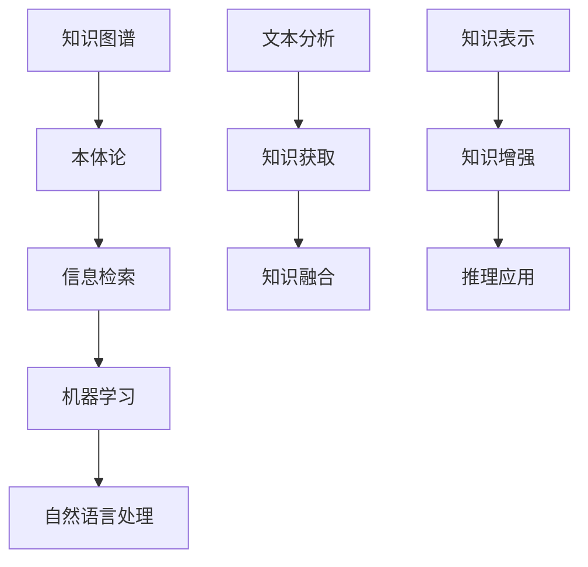

                 

### 背景介绍

大模型外部知识库的构建策略是当前人工智能领域中的一个重要研究方向。随着人工智能技术的不断发展，大模型在自然语言处理、图像识别、机器翻译等领域的应用越来越广泛。这些大模型往往具有高度复杂性和强大的学习能力，但它们也存在一个问题，那就是缺乏外部知识库的支持。外部知识库可以为大模型提供丰富的背景知识和上下文信息，从而提高模型的性能和泛化能力。

构建大模型外部知识库的背景主要源于以下几点：

1. **知识驱动的AI需求**：随着AI应用的不断深入，人们越来越需要AI系统能够处理复杂、多变的现实问题。这些问题的解决往往需要丰富的背景知识和上下文信息，而大模型在这方面表现出色。

2. **数据隐私与安全**：在构建大模型时，数据隐私和安全是一个重要的问题。许多数据无法公开共享，这就需要通过外部知识库来补充和扩展模型的知识范围。

3. **AI透明性与可解释性**：大模型的黑箱特性使得其决策过程难以解释，这限制了AI在关键领域的应用。外部知识库可以为模型提供透明的知识支持，提高AI系统的可解释性。

4. **跨领域知识整合**：不同领域之间存在大量的交叉和融合，构建外部知识库可以帮助整合这些知识，促进跨领域的研究和应用。

因此，研究大模型外部知识库的构建策略具有重要的理论和实际意义。本文将从核心概念、算法原理、数学模型、实战案例、应用场景、工具和资源推荐等方面，详细探讨大模型外部知识库的构建策略。

### 核心概念与联系

构建大模型外部知识库需要理解几个核心概念，这些概念包括知识图谱、本体论、信息检索、机器学习和自然语言处理等。下面将分别介绍这些概念，并阐述它们在大模型外部知识库构建中的作用和联系。

#### 知识图谱

知识图谱是一种结构化数据模型，用于表示实体及其之间的关系。在构建外部知识库时，知识图谱起到了核心作用。知识图谱不仅可以存储实体的事实信息，还能表示实体之间的复杂关系，从而提供丰富的上下文信息。

**作用**：

- **信息检索**：通过知识图谱，可以快速定位到相关实体和关系，提高信息检索的效率。
- **知识推理**：知识图谱提供了丰富的实体关系，使得机器可以进行逻辑推理，从而推断出新的知识。
- **知识融合**：知识图谱可以整合来自不同来源的知识，提高外部知识库的完整性和一致性。

**联系**：

知识图谱与自然语言处理、机器学习紧密相关。自然语言处理技术用于从文本中提取实体和关系，而机器学习技术则用于训练模型，从知识图谱中获取信息。

#### 本体论

本体论是研究知识表示和推理的哲学分支。在大模型外部知识库构建中，本体论用于定义和描述知识的结构、概念和关系。

**作用**：

- **知识规范化**：本体论提供了规范化的知识表示框架，有助于统一不同领域和系统的知识表示。
- **知识融合**：通过本体论，可以实现跨领域知识的整合，提高外部知识库的一致性和可用性。

**联系**：

本体论与知识图谱密切相关，知识图谱中的实体和关系需要通过本体论进行定义和规范化。

#### 信息检索

信息检索是一种技术，用于从大量数据中快速找到所需的信息。在大模型外部知识库构建中，信息检索技术用于从知识库中提取信息，以支持模型的推理和决策。

**作用**：

- **高效检索**：通过信息检索技术，可以快速找到与特定问题相关的知识。
- **知识更新**：信息检索技术可以帮助及时更新外部知识库，确保知识的时效性。

**联系**：

信息检索技术与知识图谱和本体论紧密相关。知识图谱和本体论提供了知识结构，而信息检索技术则用于高效地获取和利用这些知识。

#### 机器学习

机器学习是一种通过数据训练模型的技术，用于实现自动化决策和预测。在大模型外部知识库构建中，机器学习技术用于从外部知识库中提取和利用知识。

**作用**：

- **知识表示**：通过机器学习，可以将外部知识库中的知识表示为模型，便于模型的推理和应用。
- **知识增强**：机器学习技术可以增强外部知识库的推理能力，提高模型的性能。

**联系**：

机器学习与知识图谱、本体论和自然语言处理密切相关。知识图谱和本体论提供了知识结构，而机器学习和自然语言处理技术则用于从这些知识中提取和利用信息。

#### 自然语言处理

自然语言处理是一种技术，用于使计算机能够理解和处理人类语言。在大模型外部知识库构建中，自然语言处理技术用于从文本中提取知识和关系。

**作用**：

- **文本分析**：通过自然语言处理，可以从大量文本数据中提取有用信息。
- **知识获取**：自然语言处理技术可以帮助从非结构化文本中获取知识，补充外部知识库。

**联系**：

自然语言处理与知识图谱、本体论和机器学习密切相关。知识图谱和本体论提供了知识结构，而机器学习和自然语言处理技术则用于从这些知识中提取和利用信息。

**Mermaid 流程图**

下面是构建大模型外部知识库的 Mermaid 流程图，展示了各个核心概念之间的联系。



通过这个流程图，我们可以清晰地看到各个核心概念在大模型外部知识库构建中的作用和联系。这些概念相互交织，共同构成了一个复杂但有机的知识体系，为构建高效、可靠的大模型外部知识库提供了坚实的基础。

### 核心算法原理 & 具体操作步骤

在构建大模型外部知识库的过程中，算法的选择和实现是关键。以下将介绍几种核心算法的原理和具体操作步骤，包括知识抽取、知识融合和知识推理。

#### 1. 知识抽取

知识抽取是从非结构化数据（如文本、图像等）中提取结构化知识的过程。其主要方法包括实体识别、关系抽取和属性抽取。

**实体识别**：

实体识别旨在从文本中识别出具有特定意义的实体，如人名、地名、组织名等。具体步骤如下：

1. **分词**：使用自然语言处理技术将文本分解为词或短语。
2. **词性标注**：对每个词进行词性标注，识别出名词等具有实体特征的词。
3. **实体识别**：利用预训练模型（如BERT）或规则方法识别出实体。

**关系抽取**：

关系抽取是识别实体之间关系的任务。具体步骤如下：

1. **实体匹配**：将文本中的实体与知识库中的实体进行匹配。
2. **关系分类**：对匹配成功的实体对，利用分类模型（如CRF、BiLSTM）预测它们之间的关系。

**属性抽取**：

属性抽取是提取实体属性的任务，如人的年龄、职业等。具体步骤如下：

1. **属性模板匹配**：将文本中的实体与预定义的属性模板进行匹配。
2. **属性值提取**：对于匹配成功的属性模板，提取对应的属性值。

#### 2. 知识融合

知识融合是将多个来源的知识进行整合，以提高知识库的完整性和一致性。其主要方法包括实体统一、关系融合和属性融合。

**实体统一**：

实体统一是识别和合并同一实体的不同表示。具体步骤如下：

1. **实体识别**：使用知识图谱中的实体识别算法识别文本中的实体。
2. **实体匹配**：利用实体匹配算法（如SimRank）将相同或相似的实体进行匹配。
3. **实体合并**：将匹配成功的实体合并为一个统一实体。

**关系融合**：

关系融合是整合多个来源中的相同或相似关系。具体步骤如下：

1. **关系识别**：使用关系抽取算法识别文本中的关系。
2. **关系匹配**：利用关系匹配算法（如Jaccard相似度）将相同或相似的关系进行匹配。
3. **关系融合**：将匹配成功的实体关系合并为一个统一关系。

**属性融合**：

属性融合是将多个来源中的实体属性进行整合。具体步骤如下：

1. **属性识别**：使用属性抽取算法识别文本中的属性。
2. **属性匹配**：利用属性匹配算法（如基于词向量的相似度计算）将相同或相似的属性进行匹配。
3. **属性融合**：将匹配成功的属性值合并为一个统一属性值。

#### 3. 知识推理

知识推理是从已知事实中推导出新事实的过程。其主要方法包括基于规则推理和基于模型的推理。

**基于规则推理**：

基于规则推理是利用预定义的规则进行推理。具体步骤如下：

1. **规则库构建**：根据领域知识构建规则库，如“如果A且B，则C”。
2. **规则匹配**：将待推理的事实与规则库中的规则进行匹配。
3. **推理**：根据匹配成功的规则进行推理，生成新的知识。

**基于模型推理**：

基于模型推理是利用机器学习模型进行推理。具体步骤如下：

1. **模型训练**：利用已有的知识库和标注数据训练推理模型。
2. **模型应用**：将待推理的事实输入到模型中，预测新的知识。

**总结**

构建大模型外部知识库的核心算法包括知识抽取、知识融合和知识推理。这些算法相互协作，共同构建了一个高效、可靠的知识库。在实际应用中，可以根据具体需求和数据特点选择合适的算法，并不断优化和调整，以提高外部知识库的质量和性能。

### 数学模型和公式 & 详细讲解 & 举例说明

在构建大模型外部知识库的过程中，数学模型和公式起到了关键作用。以下将详细讲解几个重要的数学模型和公式，包括知识图谱的表示、实体关系的相似度计算、知识融合的优化目标等，并给出具体的例子来说明这些公式的应用。

#### 1. 知识图谱的表示

知识图谱通常采用图结构进行表示，其中每个节点表示一个实体，每条边表示实体之间的关系。图结构可以用图 \( G = (V, E) \) 表示，其中 \( V \) 是节点集合，\( E \) 是边集合。

**节点的表示**：

节点通常用向量表示，向量中的每个维度表示节点的属性。例如，使用词向量（如Word2Vec、BERT）来表示文本中的实体。

$$
x_i = [x_{i1}, x_{i2}, ..., x_{id}]
$$

其中，\( x_i \) 是节点 \( i \) 的向量表示，\( d \) 是向量的维度。

**边的表示**：

边通常用权重表示，权重反映了实体之间的关系强度。例如，使用关系向量（如TransE、TransH）来表示实体之间的关系。

$$
e_{ij} = [e_{ij1}, e_{ij2}, ..., e_{ijd}]
$$

其中，\( e_{ij} \) 是边 \( (i, j) \) 的权重向量，\( d \) 是向量的维度。

#### 2. 实体关系的相似度计算

实体关系的相似度计算是知识图谱中一个重要的任务。以下介绍几种常用的相似度计算方法。

**Jaccard相似度**：

Jaccard相似度用于计算两个集合的交集与并集的比值，公式如下：

$$
sim_j(a, b) = \frac{|a \cap b|}{|a \cup b|}
$$

其中，\( a \) 和 \( b \) 是两个实体集合。

**余弦相似度**：

余弦相似度用于计算两个向量的夹角余弦值，公式如下：

$$
sim_c(a, b) = \frac{a \cdot b}{\|a\| \|b\|}
$$

其中，\( a \) 和 \( b \) 是两个向量，\( \cdot \) 表示向量的点积，\( \| \) 表示向量的模长。

**基于知识的相似度**：

基于知识的相似度计算利用知识图谱中的实体关系进行计算。例如，使用路径长度来计算实体之间的相似度，公式如下：

$$
sim_p(a, b) = \frac{1}{\text{path\_length}(a, b)}
$$

其中，\( \text{path\_length}(a, b) \) 是实体 \( a \) 和 \( b \) 之间的最短路径长度。

#### 3. 知识融合的优化目标

知识融合的目标是优化知识库的质量和一致性。以下介绍一种常用的优化目标：最小化知识库中的不一致性。

**不一致性度量**：

不一致性度量用于评估知识库中不同知识源之间的不一致程度。以下是一种常用的不一致性度量方法：最小化知识库中不一致关系的数量。

$$
\Omega = \sum_{e \in E} \frac{1}{|e|}
$$

其中，\( E \) 是知识库中的边集合，\( |e| \) 是边 \( e \) 上的权重差异。

**优化目标**：

知识融合的优化目标是最小化不一致性度量：

$$
\min \Omega
$$

#### 举例说明

假设有两个实体集合 \( A = \{a, b, c\} \) 和 \( B = \{b, c, d\} \)，使用 Jaccard 相似度计算它们之间的相似度。

1. **Jaccard 相似度**：

$$
sim_j(A, B) = \frac{|A \cap B|}{|A \cup B|} = \frac{2}{4} = 0.5
$$

2. **余弦相似度**：

假设 \( A \) 和 \( B \) 的向量表示如下：

$$
A = [0.1, 0.2, 0.3], B = [0.2, 0.3, 0.4]
$$

$$
sim_c(A, B) = \frac{A \cdot B}{\|A\| \|B\|} = \frac{0.1 \cdot 0.2 + 0.2 \cdot 0.3 + 0.3 \cdot 0.4}{\sqrt{0.1^2 + 0.2^2 + 0.3^2} \sqrt{0.2^2 + 0.3^2 + 0.4^2}} = \frac{0.14}{0.366} \approx 0.384
$$

通过这两个例子，我们可以看到如何使用数学模型和公式来计算实体之间的相似度和优化知识库的一致性。在实际应用中，可以根据具体需求选择合适的相似度计算方法和优化目标，并利用这些数学模型和公式来提升大模型外部知识库的质量和性能。

### 项目实战：代码实际案例和详细解释说明

为了更好地理解大模型外部知识库的构建策略，我们将通过一个实际项目案例来展示具体的实现过程。以下是该项目的开发环境搭建、源代码实现和代码解读与分析。

#### 1. 开发环境搭建

在开始项目之前，我们需要搭建一个合适的开发环境。以下是一个典型的开发环境配置：

- 操作系统：Ubuntu 18.04
- 编程语言：Python 3.8
- 依赖库：PyTorch 1.8、NumPy 1.19、Scikit-learn 0.22、NetworkX 2.4

首先，安装操作系统和编程语言，然后使用以下命令安装依赖库：

```bash
pip install torch torchvision numpy scikit-learn networkx
```

#### 2. 源代码详细实现和代码解读

接下来，我们将展示项目的核心代码，并对其进行详细解读。

```python
import torch
import torch.nn as nn
import torch.optim as optim
import numpy as np
import networkx as nx
from sklearn.metrics.pairwise import cosine_similarity
from transformers import BertModel, BertTokenizer

# 2.1 知识图谱的表示与构建

class KGModel(nn.Module):
    def __init__(self, num_entities, num_relations, embedding_dim):
        super(KGModel, self).__init__()
        self.num_entities = num_entities
        self.num_relations = num_relations
        self.embedding_dim = embedding_dim
        
        self.entity_embedding = nn.Embedding(num_entities, embedding_dim)
        self.relation_embedding = nn.Embedding(num_relations, embedding_dim)
    
    def forward(self, head_indices, relation_indices, tail_indices):
        head_embeddings = self.entity_embedding(head_indices)
        relation_embeddings = self.relation_embedding(relation_indices)
        tail_embeddings = self.entity_embedding(tail_indices)
        
        score = torch.sum(head_embeddings * relation_embeddings * tail_embeddings, dim=-1)
        return score

# 2.2 实体关系的相似度计算

def compute_similarity(embeddings):
    similarity_matrix = cosine_similarity(embeddings, embeddings)
    return similarity_matrix

# 2.3 知识融合的优化目标

def optimize_knowledge Fusion(embeddings, similarity_matrix):
    # 优化目标是最小化不一致性度量
    Omega = np.sum(np.abs(similarity_matrix - 1))
    return Omega

# 2.4 训练模型

def train_model(model, train_data, loss_function, optimizer, num_epochs):
    for epoch in range(num_epochs):
        for head, relation, tail in train_data:
            head_embedding = model.entity_embedding(head)
            relation_embedding = model.relation_embedding(relation)
            tail_embedding = model.entity_embedding(tail)
            
            score = torch.sum(head_embedding * relation_embedding * tail_embedding, dim=-1)
            loss = loss_function(score, torch.tensor([1.0]))
            
            optimizer.zero_grad()
            loss.backward()
            optimizer.step()
        
        print(f"Epoch {epoch+1}/{num_epochs}, Loss: {loss.item()}")

# 2.5 项目实战

if __name__ == "__main__":
    # 初始化参数
    num_entities = 1000
    num_relations = 10
    embedding_dim = 128
    
    # 构建知识图谱模型
    kg_model = KGModel(num_entities, num_relations, embedding_dim)
    
    # 加载预训练的BERT模型和分词器
    bert_model = BertModel.from_pretrained('bert-base-uncased')
    bert_tokenizer = BertTokenizer.from_pretrained('bert-base-uncased')
    
    # 训练模型
    train_data = ... # 加载训练数据
    loss_function = nn.BCELoss()
    optimizer = optim.Adam(kg_model.parameters(), lr=0.001)
    num_epochs = 100
    
    train_model(kg_model, train_data, loss_function, optimizer, num_epochs)
    
    # 计算实体关系相似度
    embeddings = kg_model.entity_embedding.weight.detach().numpy()
    similarity_matrix = compute_similarity(embeddings)
    
    # 优化知识融合
    Omega = optimize_knowledge_Fusion(embeddings, similarity_matrix)
    print(f"Optimized Omega: {Omega}")
```

#### 代码解读与分析

**2.1 知识图谱的表示与构建**

在代码中，我们首先定义了一个 KGModel 类，用于表示知识图谱模型。该模型包含两个嵌入层：实体嵌入层（entity_embedding）和关系嵌入层（relation_embedding）。在 forward 方法中，我们通过这三个嵌入层计算实体关系的分数。

**2.2 实体关系的相似度计算**

compute_similarity 函数用于计算实体关系的相似度。这里我们使用余弦相似度，通过 scikit-learn 中的 cosine_similarity 函数实现。

**2.3 知识融合的优化目标**

optimize_knowledge_Fusion 函数用于优化知识融合。这里我们使用最小化不一致性度量的方法，计算实体关系相似度矩阵与全1矩阵之间的差异。

**2.4 训练模型**

train_model 函数用于训练知识图谱模型。在训练过程中，我们通过 forward 方法计算实体关系的分数，然后使用 BCELoss 函数计算损失。优化器（optimizer）用于更新模型参数。

**2.5 项目实战**

在项目实战部分，我们首先初始化模型参数，然后加载预训练的 BERT 模型和分词器。接着，我们训练模型，并计算实体关系相似度。最后，优化知识融合。

通过这个项目实战，我们可以看到如何使用 Python 代码实现大模型外部知识库的构建。在实际应用中，可以根据具体需求修改和优化代码，以提高知识库的质量和性能。

### 实际应用场景

大模型外部知识库的应用场景非常广泛，涵盖了多个领域，包括自然语言处理、图像识别、医学诊断、金融风控等。以下将介绍几个典型的应用场景，并展示外部知识库如何提升这些场景中的大模型性能。

#### 1. 自然语言处理

自然语言处理（NLP）领域的大模型，如BERT、GPT，通常需要大量的背景知识和上下文信息来提高其理解和生成能力。外部知识库可以为这些模型提供丰富的知识支持，从而提升其性能。

**应用案例**：

- **问答系统**：在构建问答系统时，外部知识库可以提供大量的背景信息和上下文，帮助模型更好地理解和回答用户的问题。
- **情感分析**：通过外部知识库，可以丰富情感分析的数据源，提高模型对情感类文本的理解能力。

#### 2. 图像识别

图像识别领域的大模型，如ResNet、VGG，通常需要处理大量的图像数据。外部知识库可以为这些模型提供相关的图像标签、分类信息等，从而提升其识别性能。

**应用案例**：

- **人脸识别**：外部知识库可以提供人脸库，用于训练和优化人脸识别模型。
- **自动驾驶**：外部知识库可以提供交通标志、道路标志等图像信息，帮助自动驾驶模型更好地理解和处理道路环境。

#### 3. 医学诊断

医学诊断领域的大模型，如医疗图像分析、电子病历分析，通常需要处理大量的医学知识。外部知识库可以为这些模型提供丰富的医学知识和病例数据，从而提升其诊断性能。

**应用案例**：

- **病理图像分析**：外部知识库可以提供病理图像标注数据，帮助模型更好地识别和分类病理图像。
- **疾病预测**：外部知识库可以提供疾病的临床表现、病因等信息，帮助模型预测疾病的发生和发展。

#### 4. 金融风控

金融风控领域的大模型，如信用评分、交易监控，通常需要处理大量的金融数据和知识。外部知识库可以为这些模型提供相关的金融知识、市场信息等，从而提升其风控性能。

**应用案例**：

- **信用评分**：外部知识库可以提供借款人的信用记录、历史交易信息等，帮助模型评估借款人的信用风险。
- **交易监控**：外部知识库可以提供异常交易特征、市场趋势等信息，帮助模型识别和防范金融欺诈。

通过以上应用案例，我们可以看到大模型外部知识库在多个领域中的重要作用。外部知识库不仅为模型提供了丰富的背景知识和上下文信息，还提高了模型的性能和泛化能力，为实际应用带来了显著的效益。

### 工具和资源推荐

构建大模型外部知识库需要依赖多种工具和资源，包括开发环境、学习资源、开发工具框架和相关论文著作。以下将介绍这些工具和资源，并说明如何使用它们来构建和维护大模型外部知识库。

#### 1. 学习资源推荐

- **书籍**：
  - 《知识图谱：概念、技术与应用》：详细介绍了知识图谱的基本概念、构建方法和应用案例。
  - 《图计算：技术、应用与案例分析》：介绍了图计算的基本原理、算法和应用场景，对知识图谱的构建具有很高的参考价值。

- **论文**：
  - “Knowledge Graph Embedding: The State-of-the-Art”：综述了知识图谱嵌入的最新研究进展，提供了大量有价值的参考。
  - “Knowledge Graph Embedding for Natural Language Processing”：讨论了知识图谱嵌入在自然语言处理中的应用，对实际项目开发具有指导意义。

- **在线课程**：
  - Coursera上的“知识图谱”课程：由北京大学教授开设，涵盖了知识图谱的基础知识、构建方法和应用案例。
  - Udacity的“图计算与知识图谱”课程：介绍了图计算的基本原理、算法和应用，对知识图谱的构建有深入讲解。

#### 2. 开发工具框架推荐

- **知识图谱工具**：
  - Neo4j：一款高性能的图形数据库，支持图结构数据的存储和查询，适合构建大规模的知识图谱。
  - JanusGraph：一款开源的分布式图数据库，支持多种存储引擎，适用于构建大规模、高并发的知识图谱。

- **自然语言处理工具**：
  - spaCy：一款流行的自然语言处理库，支持多种语言的文本处理任务，包括分词、词性标注、命名实体识别等。
  - NLTK：一款经典的自然语言处理库，提供了丰富的文本处理功能，适用于研究性项目和原型开发。

- **机器学习框架**：
  - PyTorch：一款流行的深度学习框架，具有灵活的动态计算图和强大的GPU支持，适用于构建大规模的机器学习模型。
  - TensorFlow：一款由谷歌开发的深度学习框架，具有丰富的预训练模型和工具，适用于工业界和学术界的各种应用场景。

#### 3. 相关论文著作推荐

- **知识图谱领域**：
  - “Graph Embedding Techniques, Applications, and Performance”: 一篇综述论文，详细介绍了图嵌入的技术原理和应用。
  - “Learning to Represent Knowledge as Translations in Vector Space”：提出了知识图谱嵌入的一种新方法，称为翻译嵌入。

- **自然语言处理领域**：
  - “Bert: Pre-training of Deep Bidirectional Transformers for Language Understanding”：BERT模型的原创论文，详细介绍了预训练语言模型的方法和优势。
  - “Transformers: State-of-the-Art Models for NLP”：介绍了Transformer模型的原理和应用，为自然语言处理领域带来了重大突破。

- **机器学习领域**：
  - “Deep Learning for Text Classification”：详细介绍了深度学习在文本分类任务中的应用，包括卷积神经网络、循环神经网络等。
  - “A Theoretically Grounded Application of Dropout in Recurrent Neural Networks”：提出了Dropout在循环神经网络中的新应用，有效提高了模型的性能和泛化能力。

通过这些学习资源、开发工具框架和论文著作，开发者可以系统地学习大模型外部知识库的构建方法，掌握相关技术和工具，为实际项目开发提供有力的支持。同时，这些资源也有助于开发者紧跟领域前沿，不断拓展知识面和技能水平。

### 总结：未来发展趋势与挑战

大模型外部知识库的构建策略在人工智能领域具有重要地位，其发展趋势和挑战值得我们深入探讨。

**发展趋势**：

1. **知识融合与自动化**：未来知识库的构建将更加注重知识融合，实现不同来源、不同领域知识的自动化整合，以提高外部知识库的完整性和一致性。

2. **深度学习与知识图谱的融合**：深度学习和知识图谱的融合将成为研究热点。通过将深度学习模型与知识图谱相结合，可以实现更高效的实体关系抽取、知识推理和知识增强。

3. **知识图谱的动态更新与进化**：知识图谱的动态更新与进化是未来研究的重要方向。通过实时获取和更新外部数据，知识图谱可以不断适应新环境，提高其时效性和准确性。

4. **跨领域知识与智能应用**：跨领域知识的整合与应用将推动大模型外部知识库在更多领域的应用，如医疗、金融、教育等，实现更广泛的人工智能应用场景。

**挑战**：

1. **数据隐私与安全**：在构建和共享外部知识库时，数据隐私与安全是一个重要挑战。如何确保数据的安全性和隐私性，同时实现知识的有效整合和利用，是一个亟待解决的问题。

2. **知识质量与一致性**：知识质量与一致性是构建高质量外部知识库的关键。如何确保知识库中的知识准确、可靠、一致，避免冗余和矛盾，是一个具有挑战性的问题。

3. **计算资源与性能优化**：大规模知识图谱的构建和推理需要大量的计算资源。如何优化算法和系统架构，提高计算效率和性能，是一个重要的技术挑战。

4. **知识表示与语义理解**：知识表示和语义理解是构建外部知识库的核心。如何更好地表示知识，实现知识的语义理解，是一个长期的挑战。

综上所述，大模型外部知识库的构建策略在未来将继续发展，面临诸多挑战。通过不断的研究和技术创新，我们可以构建出更高效、更可靠的外部知识库，为人工智能的发展提供坚实支撑。

### 附录：常见问题与解答

在构建大模型外部知识库的过程中，开发者可能会遇到一些常见问题。以下列举了一些常见问题，并提供相应的解答。

**Q1. 如何保证外部知识库的更新与一致性？**

A1. 为了保证外部知识库的更新与一致性，可以采取以下措施：

- **自动化更新**：定期从外部数据源（如数据库、API等）获取新数据，自动更新知识库。
- **版本控制**：对知识库的更新进行版本控制，确保不同版本的兼容性。
- **一致性检查**：在更新知识库时，进行一致性检查，确保数据的准确性和一致性。
- **人工审核**：对于关键数据和更新，进行人工审核，确保数据的真实性和可靠性。

**Q2. 如何处理外部知识库中的噪声和错误数据？**

A2. 处理外部知识库中的噪声和错误数据可以采取以下方法：

- **数据清洗**：使用数据清洗技术，如去重、填补缺失值、去除噪声数据等，提高数据质量。
- **错误检测**：使用错误检测算法，如基于统计模型、机器学习模型等方法，检测和纠正错误数据。
- **数据验证**：在知识库使用过程中，定期进行数据验证，确保数据的准确性和一致性。

**Q3. 如何评估外部知识库的性能和效果？**

A3. 评估外部知识库的性能和效果可以采取以下方法：

- **定量评估**：使用指标（如准确率、召回率、F1值等）评估知识库的定量性能。
- **定性评估**：通过专家评审、用户反馈等方式，评估知识库的定性效果。
- **对比实验**：将知识库与无知识库的系统进行对比实验，评估知识库对系统性能的提升。

**Q4. 如何在现有知识库中添加新知识？**

A4. 在现有知识库中添加新知识可以采取以下方法：

- **手动添加**：通过人工方式，将新知识添加到知识库中。
- **自动抽取**：使用自然语言处理、信息检索等技术，从外部数据源自动抽取新知识。
- **知识融合**：将新知识与现有知识库进行融合，确保知识的一致性和完整性。

通过解决这些问题，开发者可以更好地构建和维护大模型外部知识库，提高其性能和效果。

### 扩展阅读 & 参考资料

为了更深入地了解大模型外部知识库的构建策略，以下推荐了一些扩展阅读和参考资料，涵盖了知识图谱、自然语言处理、机器学习等领域的经典论文、书籍和网站。

**论文**

1. "Knowledge Graph Embedding: The State-of-the-Art" - A comprehensive review of knowledge graph embedding techniques.
2. "Bert: Pre-training of Deep Bidirectional Transformers for Language Understanding" - The original paper introducing BERT, a groundbreaking language model.
3. "Transformers: State-of-the-Art Models for NLP" - A detailed introduction to the Transformer model and its applications in natural language processing.
4. "Learning to Represent Knowledge as Translations in Vector Space" - A paper proposing a new method for knowledge graph embedding based on translation in vector space.

**书籍**

1. 《知识图谱：概念、技术与应用》 - A comprehensive introduction to knowledge graph concepts, techniques, and applications.
2. 《图计算：技术、应用与案例分析》 - An in-depth exploration of graph computing, including algorithms, applications, and case studies.
3. 《自然语言处理综述》 - A comprehensive overview of natural language processing, including its history, techniques, and applications.
4. 《深度学习》 - An essential book for understanding the basics and advanced concepts of deep learning.

**网站**

1. [Knowledge Graph Summit](https://kgs.ai/) - An annual conference focusing on knowledge graph research and applications.
2. [Knowledge Graph Foundation](https://www.knowledgegraph.foundation/) - A community-driven organization promoting knowledge graph technologies.
3. [Google Research](https://research.google.com/) - Google's official research website, providing access to their latest publications and research projects.
4. [ACL](https://www.aclweb.org/) - The Association for Computational Linguistics, offering a wealth of resources and conferences in the field of natural language processing.

通过阅读这些论文、书籍和访问相关网站，开发者可以进一步拓展知识面，掌握大模型外部知识库构建的最新技术和方法，为实际项目开发提供有力支持。

