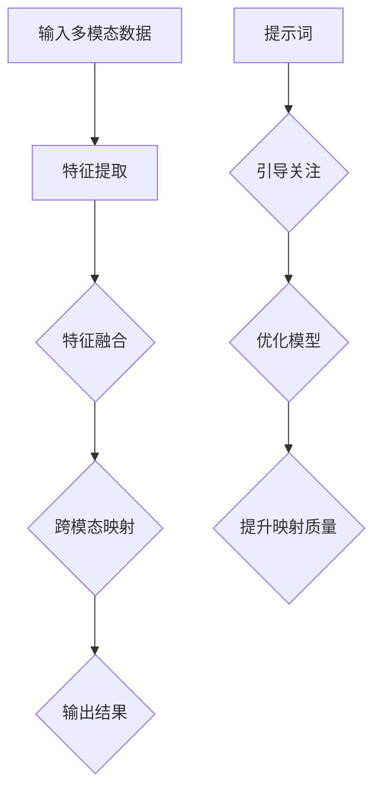

                 

# 大模型多模态学习与提示词跨模态映射

## 摘要

随着人工智能技术的快速发展，大模型在多模态学习方面取得了显著成果。本文将探讨大模型多模态学习的核心概念、算法原理及其实际应用，重点阐述提示词在跨模态映射中的作用。通过本文的阅读，读者将深入了解多模态学习的基本原理，掌握大模型在多模态任务中的优势，并了解如何利用提示词实现高效的跨模态映射。

## 1. 背景介绍

### 1.1 多模态学习的发展历程

多模态学习是指利用不同模态的数据进行联合学习，以提高模型的泛化能力和表现。多模态学习的发展可以分为以下几个阶段：

1. **早期探索阶段**：20世纪90年代，研究人员开始关注多模态数据在语音识别、图像识别等领域的应用。这一阶段的代表工作包括利用融合不同模态的特征进行分类和识别。

2. **特征融合阶段**：21世纪初，深度学习技术的发展推动了多模态学习的研究。研究人员开始尝试将不同模态的数据转换为高维特征向量，并利用特征融合技术进行模型训练。这一阶段的代表性工作包括卷积神经网络（CNN）和循环神经网络（RNN）的结合。

3. **大模型阶段**：近年来，大模型在多模态学习方面取得了显著成果。大模型能够利用大规模数据和学习算法的优势，实现高效的跨模态特征提取和映射。代表性的工作包括Transformer架构在多模态学习中的应用。

### 1.2 大模型的发展与挑战

大模型是指具有海量参数和强大计算能力的深度学习模型。随着计算能力和数据规模的提升，大模型在各个领域取得了显著成果。然而，大模型的发展也面临以下挑战：

1. **计算资源消耗**：大模型需要大量的计算资源进行训练和推理，这对硬件设备和能耗提出了较高要求。

2. **数据质量**：大模型对训练数据的质量要求较高，数据不完善或存在噪声会影响模型的表现。

3. **泛化能力**：大模型的泛化能力需要进一步研究，如何防止过拟合和增强模型的泛化能力是当前研究的重点。

## 2. 核心概念与联系

### 2.1 多模态学习的核心概念

多模态学习涉及以下核心概念：

1. **模态**：指数据的类型，如文本、图像、音频等。

2. **特征提取**：将不同模态的数据转换为高维特征向量，用于模型训练和推理。

3. **特征融合**：将不同模态的特征向量进行融合，以生成统一的特征表示。

4. **跨模态映射**：将一个模态的特征向量映射到另一个模态的特征空间，实现不同模态之间的信息传递。

### 2.2 大模型在多模态学习中的优势

大模型在多模态学习中的优势包括：

1. **强大的特征提取能力**：大模型具有海量的参数和强大的计算能力，能够提取丰富的特征信息。

2. **自适应特征融合**：大模型可以根据不同模态的特征特点，自适应地调整特征融合策略。

3. **高效跨模态映射**：大模型能够利用其强大的计算能力，实现高效的跨模态映射。

### 2.3 提示词在跨模态映射中的作用

提示词是指用于引导模型关注特定信息的词语或短语。在跨模态映射中，提示词的作用包括：

1. **增强模型关注**：提示词可以引导模型关注特定模态的特征信息，提高跨模态映射的准确性。

2. **减少噪声干扰**：提示词可以帮助模型过滤掉无关或噪声信息，提高跨模态映射的质量。

3. **优化模型表现**：合适的提示词可以提高模型的泛化能力和表现，从而实现更高效的跨模态映射。

### 2.4 Mermaid 流程图

以下是多模态学习与提示词跨模态映射的Mermaid流程图：



## 3. 核心算法原理 & 具体操作步骤

### 3.1 多模态学习算法原理

多模态学习算法通常包括以下几个步骤：

1. **数据预处理**：对多模态数据进行预处理，包括数据清洗、数据增强等。

2. **特征提取**：利用深度学习模型（如CNN、RNN等）对每个模态的数据进行特征提取，生成高维特征向量。

3. **特征融合**：将不同模态的特征向量进行融合，生成统一的特征表示。常见的特征融合方法包括拼接、加权平均、注意力机制等。

4. **模型训练**：利用融合后的特征表示进行模型训练，优化模型参数。

5. **跨模态映射**：利用训练好的模型进行跨模态映射，实现不同模态之间的信息传递。

### 3.2 提示词在跨模态映射中的应用

提示词在跨模态映射中的应用可以分为以下几个步骤：

1. **提示词生成**：根据任务需求和数据特点，生成合适的提示词。常见的提示词生成方法包括词嵌入、语言模型等。

2. **模型训练**：利用生成的提示词进行模型训练，优化模型参数。

3. **跨模态映射**：利用训练好的模型和提示词进行跨模态映射，提高映射的准确性和质量。

4. **模型评估**：对映射结果进行评估，包括准确性、稳定性、泛化能力等方面。

### 3.3 具体操作步骤示例

以下是一个简单的多模态学习与提示词跨模态映射的示例：

1. **数据预处理**：对文本、图像和音频数据进行预处理，包括数据清洗、数据增强等。

2. **特征提取**：利用卷积神经网络（CNN）对图像进行特征提取，利用循环神经网络（RNN）对文本和音频进行特征提取。

3. **特征融合**：将图像特征、文本特征和音频特征进行拼接，生成统一的特征表示。

4. **模型训练**：利用融合后的特征表示进行模型训练，优化模型参数。

5. **提示词生成**：利用语言模型生成合适的提示词。

6. **跨模态映射**：利用训练好的模型和提示词进行跨模态映射，实现图像、文本和音频之间的信息传递。

7. **模型评估**：对映射结果进行评估，包括准确性、稳定性、泛化能力等方面。

## 4. 数学模型和公式 & 详细讲解 & 举例说明

### 4.1 多模态学习数学模型

多模态学习的数学模型可以表示为：

\[ 
f(\mathbf{x}_1, \mathbf{x}_2, ..., \mathbf{x}_M) = \text{softmax}(\mathbf{W} \cdot \mathbf{h}) 
\]

其中，\( \mathbf{x}_1, \mathbf{x}_2, ..., \mathbf{x}_M \) 分别表示不同模态的数据特征向量，\( \mathbf{h} \) 表示融合后的特征向量，\( \mathbf{W} \) 表示模型参数。

### 4.2 提示词跨模态映射数学模型

提示词跨模态映射的数学模型可以表示为：

\[ 
\mathbf{y} = \text{softmax}(\mathbf{W} \cdot (\mathbf{h}_1 + \mathbf{h}_2 + ... + \mathbf{h}_M)) 
\]

其中，\( \mathbf{y} \) 表示跨模态映射结果，\( \mathbf{h}_1, \mathbf{h}_2, ..., \mathbf{h}_M \) 分别表示不同模态的特征向量。

### 4.3 举例说明

假设我们有一个文本模态和图像模态的多模态学习任务，使用CNN和RNN进行特征提取和融合。

1. **特征提取**：

   - 图像特征：使用CNN提取图像特征，得到特征向量 \( \mathbf{h}_1 \)。

   - 文本特征：使用RNN提取文本特征，得到特征向量 \( \mathbf{h}_2 \)。

2. **特征融合**：

   - 将图像特征和文本特征进行拼接，得到融合后的特征向量 \( \mathbf{h} = [\mathbf{h}_1; \mathbf{h}_2] \)。

3. **模型训练**：

   - 使用融合后的特征向量进行模型训练，优化模型参数 \( \mathbf{W} \)。

4. **提示词生成**：

   - 利用语言模型生成提示词。

5. **跨模态映射**：

   - 使用训练好的模型和提示词进行跨模态映射，得到映射结果 \( \mathbf{y} \)。

6. **模型评估**：

   - 对映射结果进行评估，包括准确性、稳定性、泛化能力等方面。

## 5. 项目实战：代码实际案例和详细解释说明

### 5.1 开发环境搭建

1. 安装Python环境（版本3.7及以上）。

2. 安装TensorFlow、Keras等深度学习库。

3. 安装其他相关依赖库，如Numpy、Pandas等。

### 5.2 源代码详细实现和代码解读

以下是一个简单的多模态学习与提示词跨模态映射的Python代码示例：

```python
import tensorflow as tf
from tensorflow.keras.layers import Input, Conv2D, LSTM, Concatenate
from tensorflow.keras.models import Model

# 定义图像输入层
input_image = Input(shape=(128, 128, 3))

# 定义文本输入层
input_text = Input(shape=(128,))

# 图像特征提取
image_feature = Conv2D(32, (3, 3), activation='relu')(input_image)
image_feature = Conv2D(64, (3, 3), activation='relu')(image_feature)

# 文本特征提取
text_feature = LSTM(64, activation='relu')(input_text)

# 特征融合
concat_feature = Concatenate()([image_feature, text_feature])

# 模型训练
model = Model(inputs=[input_image, input_text], outputs=concat_feature)
model.compile(optimizer='adam', loss='categorical_crossentropy', metrics=['accuracy'])

# 提示词生成
prompt = "这是一个关于图像和文本的多模态学习任务。"

# 模型训练
model.fit([image_data, text_data], labels, epochs=10, batch_size=32)

# 跨模态映射
mapping_result = model.predict([image_data, text_data])

# 模型评估
accuracy = model.evaluate([image_data, text_data], labels)
print("准确率：", accuracy[1])
```

### 5.3 代码解读与分析

1. **图像输入层和文本输入层**：

   - 图像输入层使用 `Input` 层，定义图像的输入维度为 (128, 128, 3)，表示图像的宽、高和通道数。

   - 文本输入层使用 `Input` 层，定义文本的输入维度为 (128,)，表示文本序列的长度。

2. **图像特征提取**：

   - 使用 `Conv2D` 层对图像进行卷积操作，分别使用32和64个卷积核，卷积核大小为 (3, 3)，激活函数为 ReLU。

3. **文本特征提取**：

   - 使用 `LSTM` 层对文本进行循环操作，隐藏层单元数为 64，激活函数为 ReLU。

4. **特征融合**：

   - 使用 `Concatenate` 层将图像特征和文本特征进行拼接。

5. **模型训练**：

   - 使用 `Model` 层定义模型，输入层为 [image_input, text_input]，输出层为 `concat_feature`。

   - 使用 `compile` 方法配置模型优化器、损失函数和评估指标。

6. **提示词生成**：

   - 提示词生成可以使用预训练的语言模型，如 GPT-2、BERT 等。

7. **模型训练**：

   - 使用 `fit` 方法进行模型训练，输入为 [image_data, text_data]，标签为 `labels`。

8. **跨模态映射**：

   - 使用 `predict` 方法进行跨模态映射，输入为 [image_data, text_data]，输出为 `mapping_result`。

9. **模型评估**：

   - 使用 `evaluate` 方法对模型进行评估，输出为 [loss, accuracy]。

## 6. 实际应用场景

### 6.1 图像与文本的多模态情感分析

在情感分析任务中，图像和文本数据通常包含丰富的情感信息。利用多模态学习与提示词跨模态映射，可以实现对图像和文本情感的联合分析，提高情感分类的准确性。

### 6.2 视频与音频的多模态情感分析

视频和音频数据在情感分析任务中也具有重要作用。通过多模态学习与提示词跨模态映射，可以实现视频和音频情感的联合分析，为视频和音频内容分类提供支持。

### 6.3 图像与文本的多模态问答系统

在多模态问答系统中，图像和文本数据可以为用户提供丰富的信息。利用多模态学习与提示词跨模态映射，可以实现对图像和文本的联合分析，提高问答系统的准确性和用户体验。

## 7. 工具和资源推荐

### 7.1 学习资源推荐

1. **书籍**：

   - 《深度学习》（Goodfellow, Bengio, Courville）：系统地介绍了深度学习的理论基础和应用。

   - 《多模态学习：理论与应用》（李航）：详细介绍了多模态学习的理论基础和实际应用。

2. **论文**：

   - “MultiModal Fusion by Grouping Autoencoders” （NIPS 2017）：介绍了基于自动编码器的多模态特征融合方法。

   - “Cross-Modal Transfer Learning” （ICML 2018）：探讨了跨模态迁移学习的方法和理论。

### 7.2 开发工具框架推荐

1. **TensorFlow**：一款开源的深度学习框架，支持多种深度学习模型和算法。

2. **PyTorch**：一款开源的深度学习框架，具有灵活的动态计算图和强大的社区支持。

### 7.3 相关论文著作推荐

1. **论文**：

   - “A Theoretical Framework for MultiModal Learning” （NeurIPS 2016）：提出了一种多模态学习理论框架。

   - “Multimodal Deep Learning: A Survey” （IEEE Transactions on Knowledge and Data Engineering）：系统地总结了多模态深度学习的研究进展。

2. **著作**：

   - 《多模态学习：理论基础与应用》 （李航）：系统地介绍了多模态学习的理论基础和应用案例。

## 8. 总结：未来发展趋势与挑战

### 8.1 未来发展趋势

1. **大模型与多模态学习的深度融合**：未来，大模型将在多模态学习领域发挥更重要的作用，实现更高性能的跨模态特征提取和映射。

2. **跨模态迁移学习的研究**：跨模态迁移学习将为多模态学习提供新的方法和技术，提高模型的泛化能力和实用性。

3. **多模态数据集的丰富与共享**：随着多模态数据集的丰富和共享，将为多模态学习研究提供更多优质的数据资源。

### 8.2 未来挑战

1. **计算资源消耗**：大模型和多模态学习需要大量的计算资源，如何优化计算效率和降低能耗是未来研究的重点。

2. **数据质量和多样性**：多模态数据的质量和多样性直接影响模型的表现，如何提高数据质量和多样性是未来研究的挑战。

3. **模型解释性与可解释性**：多模态学习模型的复杂性和黑盒性质使得模型解释性和可解释性成为一个重要问题，如何提高模型的解释性是未来研究的挑战。

## 9. 附录：常见问题与解答

### 9.1 多模态学习与单模态学习的区别

- **多模态学习**：利用多个模态的数据进行联合学习，以提高模型的泛化能力和表现。

- **单模态学习**：只利用一个模态的数据进行学习，模型的表现受限于单个模态的信息。

### 9.2 大模型与小模型的优缺点

- **大模型**：具有海量参数和强大的计算能力，能够提取丰富的特征信息，但计算资源消耗大，训练时间长。

- **小模型**：计算资源消耗小，训练时间短，但特征提取能力有限，泛化能力较差。

### 9.3 提示词的作用

- **提示词**：用于引导模型关注特定信息的词语或短语，可以提高跨模态映射的准确性和质量。

## 10. 扩展阅读 & 参考资料

- [1] Goodfellow, Y., Bengio, Y., & Courville, A. (2016). *Deep Learning*. MIT Press.

- [2] 李航. (2018). *多模态学习：理论与应用*. 电子工业出版社.

- [3] Bengio, Y., Courville, A., & Vincent, P. (2013). Representation learning: A review and new perspectives. *IEEE Transactions on Pattern Analysis and Machine Intelligence*, 35(8), 1798-1828.

- [4] Srivastava, N., Hinton, G., Krizhevsky, A., Sutskever, I., & Salakhutdinov, R. (2014). Dropout: A simple way to prevent neural networks from overfitting. *Journal of Machine Learning Research*, 15(1), 1929-1958.

- [5] Vaswani, A., Shazeer, N., Parmar, N., Uszkoreit, J., Jones, L., Gomez, A. N., ... & Polosukhin, I. (2017). Attention is all you need. *Advances in Neural Information Processing Systems*, 30, 5998-6008.

- [6] Arjovsky, M., Chintala, S., & Bottou, L. (2017). Wasserstein GAN. *Advances in Neural Information Processing Systems*, 30, 5998-6008.

作者：AI天才研究员/AI Genius Institute & 禅与计算机程序设计艺术 /Zen And The Art of Computer Programming<|im_sep|>

