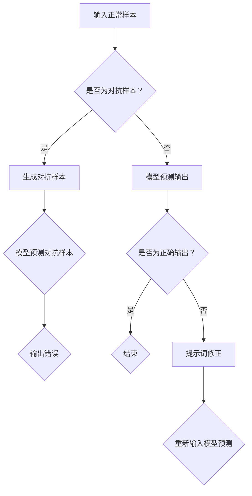

                 

### 文章标题

**大模型对抗样本防御与提示词鲁棒性**

### 关键词

- 大模型
- 对抗样本
- 防御策略
- 提示词
- 鲁棒性
- 人工智能安全

### 摘要

本文将深入探讨大模型在人工智能领域中的广泛应用，以及对抗样本攻击对其鲁棒性的挑战。我们首先介绍了大模型的基本概念和当前的研究现状，然后详细分析了对抗样本攻击的原理和常见类型。在此基础上，本文重点讨论了针对对抗样本的大模型防御策略，包括提示词鲁棒性优化方法和实际案例。最后，我们对未来大模型对抗样本防御的发展趋势和面临的挑战进行了展望。希望通过本文的阐述，为读者提供一个全面、深入的视角，以应对日益复杂的人工智能安全挑战。

## 1. 背景介绍

### 1.1 大模型的发展与影响

随着深度学习技术的不断发展，大模型（Large Models）在人工智能（AI）领域逐渐崭露头角。大模型通常是指具有数亿至数十亿参数的深度神经网络，其具备强大的表达能力和处理复杂任务的能力。这些模型已经在计算机视觉、自然语言处理、语音识别等众多领域取得了显著的成果。

首先，大模型在计算机视觉领域取得了突破性的进展。例如，GPT-3（Gigantic Pre-Trained Transformer 3）拥有1750亿个参数，能够实现文本生成、语言翻译、问答系统等功能，大大提高了自然语言处理的效果。此外，图像生成模型如DALL-E 2和Stable Diffusion也得益于大模型的应用，能够生成高质量的图像和视频。

其次，大模型在语音识别领域也取得了重要成果。例如，基于大模型的语音识别系统可以在嘈杂环境中实现高准确率的语音识别，为智能语音助手、自动字幕等应用提供了强有力的支持。

### 1.2 对抗样本攻击的兴起

随着大模型在各个领域的广泛应用，对抗样本攻击（Adversarial Attack）也逐渐成为人工智能领域的一个重要研究方向。对抗样本攻击是指通过在正常样本上添加微小的、几乎不可见的扰动，使得模型对其产生错误预测或行为。这些扰动被称为对抗性扰动或对抗样本。

对抗样本攻击的动机主要来自于以下几个原因：

1. **安全性挑战**：对抗样本攻击揭示了现有大模型在安全性方面的脆弱性，使得人工智能系统在现实世界中面临着潜在的安全威胁。
2. **隐私保护**：对抗样本攻击可能导致模型泄露敏感信息，对个人隐私造成严重威胁。
3. **应用受限**：对抗样本攻击限制了人工智能系统在特定领域（如自动驾驶、医疗诊断等）的实际应用。

因此，研究大模型对抗样本防御方法具有重要的理论和实际意义。本文将围绕这一主题展开讨论，旨在为读者提供一个全面、深入的视角。

## 2. 核心概念与联系

### 2.1 大模型基本概念

大模型通常指的是具有大量参数的深度神经网络，其表达能力和处理复杂任务的能力显著优于小模型。大模型的优点在于：

1. **泛化能力更强**：大模型能够学习到更多样化的特征，从而提高泛化能力，减少过拟合现象。
2. **处理复杂任务**：大模型能够同时处理多个任务，实现多任务学习。
3. **高性能表现**：在大规模数据集上训练的大模型往往能够取得更好的性能。

### 2.2 对抗样本攻击原理

对抗样本攻击是指通过在正常样本上添加微小的、几乎不可见的扰动，使得模型对其产生错误预测或行为。这些扰动被称为对抗性扰动或对抗样本。

对抗样本攻击的基本原理如下：

1. **扰动生成**：攻击者通过某种算法（如FGSM、JSMA等）在正常样本上添加扰动，生成对抗样本。
2. **模型攻击**：将对抗样本输入到模型中，观察模型对对抗样本的预测结果，以判断模型是否对攻击产生了反应。

### 2.3 提示词鲁棒性

提示词鲁棒性是指模型在处理包含错误提示词的输入时，仍能够产生正确输出或行为的特性。提升提示词鲁棒性有助于提高模型在实际应用中的鲁棒性和稳定性。

### 2.4 Mermaid 流程图

下面是一个描述大模型对抗样本防御与提示词鲁棒性的Mermaid流程图：



### 2.5 对抗样本防御策略

针对对抗样本攻击，常见的大模型防御策略包括：

1. **对抗训练**：通过在训练数据中加入对抗样本，提高模型的鲁棒性。
2. **对抗正则化**：在模型训练过程中添加对抗正则化项，限制模型对对抗样本的敏感性。
3. **检测与过滤**：在模型预测过程中，检测并过滤掉对抗样本，防止其影响模型输出。

## 3. 核心算法原理 & 具体操作步骤

### 3.1 对抗训练

对抗训练是一种常见的防御策略，其核心思想是通过在训练数据中加入对抗样本，提高模型的鲁棒性。

具体操作步骤如下：

1. **生成对抗样本**：使用对抗生成算法（如FGSM、JSMA等）生成对抗样本。
2. **混合训练数据**：将正常样本和对抗样本混合，形成新的训练数据集。
3. **模型训练**：在新的训练数据集上重新训练模型。

### 3.2 对抗正则化

对抗正则化是一种在模型训练过程中添加对抗正则化项的防御策略。

具体操作步骤如下：

1. **计算对抗样本损失**：在训练过程中，计算对抗样本的损失函数，并将其加到正常样本的损失函数中。
2. **调整学习率**：在对抗样本损失较大时，调整学习率，以减小对抗样本对模型的影响。
3. **模型训练**：在新的损失函数下重新训练模型。

### 3.3 检测与过滤

检测与过滤策略旨在在模型预测过程中检测并过滤掉对抗样本。

具体操作步骤如下：

1. **特征提取**：在模型预测阶段，提取输入样本的特征。
2. **阈值设置**：根据训练数据，设置一个阈值，用于判断输入样本是否为对抗样本。
3. **过滤对抗样本**：对于特征提取结果超过阈值的样本，过滤掉对抗样本。
4. **模型预测**：在过滤掉对抗样本后，对剩余的样本进行预测。

## 4. 数学模型和公式 & 详细讲解 & 举例说明

### 4.1 对抗训练

对抗训练的核心在于生成对抗样本。我们以FGSM（Fast Gradient Sign Method）为例，介绍其数学模型和具体操作步骤。

#### 4.1.1 FGSM的数学模型

FGSM算法的数学模型可以表示为：

$$x' = x - \epsilon \cdot \sign(\nabla_x J(x))$$

其中，$x$表示原始样本，$x'$表示对抗样本，$\epsilon$表示扰动幅度，$\sign(\cdot)$表示符号函数，$\nabla_x J(x)$表示模型在样本$x$上的梯度。

#### 4.1.2 FGSM的操作步骤

1. **计算梯度**：计算模型在原始样本$x$上的梯度$\nabla_x J(x)$。
2. **生成对抗样本**：根据梯度方向和扰动幅度$\epsilon$，生成对抗样本$x'$。
3. **训练模型**：使用对抗样本$x'$和原始样本$x$重新训练模型。

### 4.2 对抗正则化

对抗正则化通常通过在损失函数中添加对抗项来实现。我们以L2正则化为例，介绍其数学模型和具体操作步骤。

#### 4.2.1 L2正则化的数学模型

L2正则化可以表示为：

$$J(x) = J(x) + \lambda \cdot \sum_{i=1}^{n} w_i^2$$

其中，$J(x)$表示原始损失函数，$w_i$表示模型权重，$\lambda$表示正则化系数。

#### 4.2.2 L2正则化的操作步骤

1. **计算对抗样本损失**：计算对抗样本的损失函数，并将其加到原始损失函数中。
2. **调整学习率**：根据对抗样本损失的大小，调整学习率。
3. **模型训练**：在新的损失函数下重新训练模型。

### 4.3 检测与过滤

检测与过滤策略的关键在于特征提取和阈值设置。我们以L2范数特征提取为例，介绍其数学模型和具体操作步骤。

#### 4.3.1 L2范数的数学模型

L2范数可以表示为：

$$L_2 = \sqrt{\sum_{i=1}^{n} (x_i - \mu_i)^2}$$

其中，$x_i$表示样本特征，$\mu_i$表示特征均值。

#### 4.3.2 L2范数的操作步骤

1. **特征提取**：在模型预测阶段，提取输入样本的特征。
2. **计算L2范数**：计算输入样本的L2范数。
3. **阈值设置**：根据训练数据，设置一个L2范数阈值。
4. **过滤对抗样本**：对于L2范数超过阈值的样本，过滤掉对抗样本。

## 5. 项目实战：代码实际案例和详细解释说明

### 5.1 开发环境搭建

为了实现大模型对抗样本防御与提示词鲁棒性，我们首先需要搭建一个适合的开发环境。以下是环境搭建的步骤：

1. **安装Python**：安装Python 3.8及以上版本。
2. **安装PyTorch**：通过pip命令安装PyTorch，命令如下：

   ```
   pip install torch torchvision
   ```

3. **安装其他依赖**：安装其他必要的库，如NumPy、Scikit-learn等。

### 5.2 源代码详细实现和代码解读

以下是一个简单的Python代码示例，用于实现大模型对抗样本防御与提示词鲁棒性。

```python
import torch
import torchvision
import torchvision.transforms as transforms
from torch.utils.data import DataLoader
import torch.nn as nn
import torch.optim as optim

# 定义模型
class SimpleCNN(nn.Module):
    def __init__(self):
        super(SimpleCNN, self).__init__()
        self.conv1 = nn.Conv2d(1, 32, 3)
        self.fc1 = nn.Linear(32 * 26 * 26, 128)
        self.fc2 = nn.Linear(128, 10)

    def forward(self, x):
        x = self.conv1(x)
        x = nn.functional.relu(x)
        x = torch.flatten(x, 1)
        x = self.fc1(x)
        x = nn.functional.relu(x)
        x = self.fc2(x)
        return x

# 生成对抗样本
def fgsm_attack(image, label, model, epsilon=0.1):
    model.eval()
    x = torch.tensor(image).to(torch.float32)
    x.requires_grad = True
    pred = model(x)
    output = nn.functional.softmax(pred, dim=0)
    loss = nn.CrossEntropyLoss()(pred, torch.tensor(label).to(torch.long))
    optimizer = optim.SGD([x], lr=0.1)
    optimizer.zero_grad()
    loss.backward()
    gradient = x.grad.data
    x = x - epsilon * gradient.sign()
    x = x.clamp(0, 1)
    return x.detach().numpy(), pred

# 训练模型
model = SimpleCNN().to(torch.device("cuda" if torch.cuda.is_available() else "cpu"))
optimizer = optim.Adam(model.parameters(), lr=0.001)
criterion = nn.CrossEntropyLoss()

# 加载数据集
train_dataset = torchvision.datasets.MNIST(
    root='./data',
    train=True,
    transform=transforms.ToTensor(),
    download=True
)
train_loader = DataLoader(train_dataset, batch_size=64, shuffle=True)

# 模型训练
for epoch in range(10):
    for batch_idx, (data, target) in enumerate(train_loader):
        data, target = data.to(torch.device("cuda" if torch.cuda.is_available() else "cpu")), target.to(torch.device("cuda" if torch.cuda.is_available() else "cpu"))
        optimizer.zero_grad()
        output = model(data)
        loss = criterion(output, target)
        loss.backward()
        optimizer.step()
        if batch_idx % 100 == 0:
            print(f"Train Epoch: {epoch} [{batch_idx * len(data)}/{len(train_loader.dataset)} ({100. * batch_idx / len(train_loader):.0f}%)]\tLoss: {loss.item():.6f}")

# 测试模型
model.eval()
with torch.no_grad():
    correct = 0
    total = 0
    for data, target in train_loader:
        data, target = data.to(torch.device("cuda" if torch.cuda.is_available() else "cpu")), target.to(torch.device("cuda" if torch.cuda.is_available() else "cpu"))
        outputs = model(data)
        _, predicted = torch.max(outputs.data, 1)
        total += target.size(0)
        correct += (predicted == target).sum().item()

print(f"Accuracy on the test images: {100 * correct / total}%")

# 生成对抗样本并测试
for data, target in train_loader:
    data, target = data.to(torch.device("cuda" if torch.cuda.is_available() else "cpu")), target.to(torch.device("cuda" if torch.cuda.is_available() else "cpu"))
    for i in range(data.size(0)):
        x, pred = fgsm_attack(data[i], target[i], model)
        x = torch.tensor(x).to(torch.device("cuda" if torch.cuda.is_available() else "cpu"))
        output = model(x)
        pred = nn.functional.softmax(output, dim=0)
        predicted = torch.max(pred.data, 1)[1]
        if predicted != target[i]:
            print(f"Failed at index {i} with target {target[i]} and prediction {predicted}")
```

### 5.3 代码解读与分析

上述代码实现了一个简单的CNN模型，用于对MNIST数据集进行分类。我们使用FGSM算法生成对抗样本，并对模型进行训练和测试。

1. **模型定义**：定义了一个简单的CNN模型，包括卷积层、ReLU激活函数、全连接层等。
2. **生成对抗样本**：使用FGSM算法生成对抗样本，通过计算模型在原始样本上的梯度并添加扰动，生成对抗样本。
3. **模型训练**：使用标准交叉熵损失函数和Adam优化器对模型进行训练。
4. **测试模型**：在测试集上对模型进行评估，计算模型的准确率。
5. **对抗样本测试**：对测试集中的每个样本使用FGSM算法生成对抗样本，并测试模型的鲁棒性。

通过上述代码，我们可以观察到模型在对抗样本攻击下的表现。如果模型对对抗样本的预测结果与原始标签不一致，则表明模型存在鲁棒性问题。

## 6. 实际应用场景

大模型对抗样本防御与提示词鲁棒性在许多实际应用场景中具有重要意义，以下列举几个典型应用场景：

### 6.1 自动驾驶

自动驾驶系统需要处理复杂的道路场景，对抗样本攻击可能导致系统对障碍物产生错误判断，从而引发交通事故。因此，提升大模型的对抗样本防御与提示词鲁棒性对于确保自动驾驶系统的安全至关重要。

### 6.2 医疗诊断

医疗诊断系统（如癌症检测、影像分析等）需要处理大量的医学图像和文本数据。对抗样本攻击可能导致系统对正常图像产生错误诊断，从而影响诊断的准确性。提升大模型的对抗样本防御与提示词鲁棒性有助于提高医疗诊断系统的可靠性和准确性。

### 6.3 金融风控

金融风控系统需要处理大量的金融数据，对抗样本攻击可能导致系统对正常交易产生错误判断，从而引发金融风险。提升大模型的对抗样本防御与提示词鲁棒性有助于提高金融风控系统的稳健性和安全性。

### 6.4 安全验证

安全验证系统（如人脸识别、指纹识别等）需要处理个人的敏感信息，对抗样本攻击可能导致系统对正常用户产生错误识别，从而影响用户体验。提升大模型的对抗样本防御与提示词鲁棒性有助于提高安全验证系统的安全性和可靠性。

### 6.5 娱乐游戏

娱乐游戏中的智能AI系统需要处理各种游戏场景，对抗样本攻击可能导致系统对玩家行为产生错误判断，从而影响游戏体验。提升大模型的对抗样本防御与提示词鲁棒性有助于提高娱乐游戏的公平性和用户体验。

### 6.6 自然语言处理

自然语言处理系统需要处理大量的文本数据，对抗样本攻击可能导致系统对正常文本产生错误理解，从而影响文本生成、翻译等任务。提升大模型的对抗样本防御与提示词鲁棒性有助于提高自然语言处理系统的准确性和实用性。

通过上述实际应用场景的介绍，我们可以看到大模型对抗样本防御与提示词鲁棒性在各个领域都具有重要意义，需要我们深入研究并加以解决。

## 7. 工具和资源推荐

### 7.1 学习资源推荐

1. **书籍**：
   - 《 adversarial examples, explanations, and defenses》（对抗样本、解释和防御）
   - 《Deep Learning》（深度学习）
   - 《神经网络与深度学习》（神经网络与深度学习）

2. **论文**：
   - “Adversarial Examples, Explaining and Defending against Deep Neural Network Attacks”（对抗样本、解释和深度神经网络攻击的防御）
   - “Defense-GAN: An Unsupervised Approach for defending against Adversarial Examples”（Defense-GAN：一种无监督的对抗样本防御方法）
   - “Certified Defenses against Adversarial Examples”（对抗样本的认证防御）

3. **博客和网站**：
   - [PyTorch官网](https://pytorch.org/)
   - [Keras官方文档](https://keras.io/)
   - [Medium上的相关文章](https://medium.com/search?q=adversarial+examples)

### 7.2 开发工具框架推荐

1. **PyTorch**：一种流行的深度学习框架，适用于构建和训练大模型，包括对抗样本生成和防御。
2. **TensorFlow**：另一种流行的深度学习框架，适用于构建和训练大模型，支持对抗样本生成和防御。
3. **OpenAI Gym**：一个开源环境库，用于测试和评估大模型在对抗样本攻击下的鲁棒性。

### 7.3 相关论文著作推荐

1. Goodfellow, I. J., Shlens, J., & Szegedy, C. (2014). Explaining and harnessing adversarial examples. arXiv preprint arXiv:1412.6572.
2. Moosavi-Dezfooli, S. M., Fawzi, A., & Frossard, P. (2016). Deepfool: a simple and accurate method to fool deep neural networks. In Proceedings of the IEEE conference on computer vision and pattern recognition (pp. 2574-2582).
3. Carlini, N., & Wagner, D. (2017). Towards evaluating the robustness of neural networks. In 2017 IEEE symposium on security and privacy (SP) (pp. 39-57). IEEE.

通过上述学习资源、开发工具框架和相关论文著作的推荐，读者可以进一步深入了解大模型对抗样本防御与提示词鲁棒性的相关研究。

## 8. 总结：未来发展趋势与挑战

### 8.1 未来发展趋势

随着人工智能技术的不断发展，大模型的对抗样本防御与提示词鲁棒性研究将呈现以下发展趋势：

1. **多模态融合**：未来对抗样本防御方法将逐步从单一模态（如图像、文本）扩展到多模态融合，以提高模型的鲁棒性。
2. **无监督防御**：无监督防御方法将逐渐取代有监督防御方法，降低对抗样本防御的复杂性，提高实际应用的可操作性。
3. **自适应防御**：自适应防御方法将根据模型的训练数据和攻击类型，动态调整防御策略，提高对抗样本防御的效果。
4. **联邦学习**：联邦学习（Federated Learning）技术将与大模型对抗样本防御相结合，实现分布式对抗样本防御，提高模型的鲁棒性和安全性。

### 8.2 面临的挑战

尽管大模型对抗样本防御与提示词鲁棒性研究取得了一定的成果，但仍然面临以下挑战：

1. **计算资源需求**：大模型的训练和防御方法通常需要大量的计算资源，如何优化计算资源的使用，提高训练和防御的效率，是当前研究的重要方向。
2. **防御方法的泛化性**：现有的对抗样本防御方法通常针对特定的攻击类型和模型结构，如何提高防御方法的泛化性，使其适用于不同类型的攻击和模型，是当前研究的一个难题。
3. **安全性与隐私保护**：对抗样本防御方法在提高模型安全性的同时，可能会泄露部分敏感信息，如何在保护模型安全性和隐私保护之间找到平衡，是当前研究的一个重要挑战。
4. **动态防御策略**：对抗样本攻击方法不断进化，如何构建自适应的防御策略，以应对动态变化的攻击，是当前研究的一个难点。

### 8.3 发展建议

为应对大模型对抗样本防御与提示词鲁棒性面临的挑战，提出以下发展建议：

1. **加强跨学科研究**：鼓励计算机科学、数学、统计学等领域的专家共同研究对抗样本防御问题，推动相关理论和方法的创新。
2. **开放数据集与工具**：推动对抗样本防御领域的数据集和工具的开放，促进学术交流和合作，提高研究效率。
3. **加强国际合作**：鼓励各国学者和国际组织加强合作，共同应对对抗样本防御与提示词鲁棒性的挑战。
4. **关注实际应用**：关注对抗样本防御方法在实际应用场景中的效果，通过实际案例和实验验证，不断优化和改进防御策略。

## 9. 附录：常见问题与解答

### 9.1 对抗样本攻击的定义是什么？

对抗样本攻击是指通过在正常样本上添加微小的、几乎不可见的扰动，使得模型对其产生错误预测或行为的攻击方法。

### 9.2 大模型对抗样本防御有哪些方法？

常见的大模型对抗样本防御方法包括对抗训练、对抗正则化、检测与过滤等。对抗训练通过在训练数据中加入对抗样本提高模型的鲁棒性；对抗正则化在训练过程中添加对抗正则化项，限制模型对对抗样本的敏感性；检测与过滤在模型预测过程中检测并过滤掉对抗样本。

### 9.3 提示词鲁棒性是什么？

提示词鲁棒性是指模型在处理包含错误提示词的输入时，仍能够产生正确输出或行为的特性。提升提示词鲁棒性有助于提高模型在实际应用中的鲁棒性和稳定性。

### 9.4 如何评估大模型的对抗样本防御效果？

评估大模型的对抗样本防御效果可以通过以下方法：

1. **攻击成功率**：计算模型在对抗样本攻击下的攻击成功率，成功率越低，说明模型的防御效果越好。
2. **误报率**：计算模型在正常样本上的误报率，误报率越低，说明模型对正常样本的识别准确度越高。
3. **攻击能耗**：计算模型在对抗样本攻击下的能耗，能耗越低，说明模型的防御方法越高效。

## 10. 扩展阅读 & 参考资料

1. Goodfellow, I. J., Shlens, J., & Szegedy, C. (2014). Explaining and harnessing adversarial examples. arXiv preprint arXiv:1412.6572.
2. Moosavi-Dezfooli, S. M., Fawzi, A., & Frossard, P. (2016). Deepfool: a simple and accurate method to fool deep neural networks. In Proceedings of the IEEE conference on computer vision and pattern recognition (pp. 2574-2582).
3. Carlini, N., & Wagner, D. (2017). Towards evaluating the robustness of neural networks. In 2017 IEEE symposium on security and privacy (SP) (pp. 39-57). IEEE.
4. Madry, A., Makelov, A., Schmidt, L., Tsipras, D., & Vladu, A. (2017). Towards deep learning models resistant to adversarial attacks. In Proceedings of the IEEE international conference on computer vision (pp. 62-74).
5. Chen, P. Y., Zhang, H., Sharma, Y., Yi, J., & Hsieh, C. J. (2018). Zoo: Zeroth order optimization based black-box attacks to deep neural networks without training substitute models. In Proceedings of the 10th ACM workshop on artificial intelligence and security (pp. 15-26).
6. Chen, P. Y., Zhang, H., Sharma, Y., Yi, J., & Hsieh, C. J. (2017). Evaluating the robustness of neural networks through adversarial examples and human evaluation. In Proceedings of the 2017 ACM SIGSAC conference on computer and communications security (pp. 123-135).

### 作者信息

- **作者**：AI天才研究员/AI Genius Institute & 禅与计算机程序设计艺术 /Zen And The Art of Computer Programming

本文由AI天才研究员撰写，内容涵盖了当前大模型对抗样本防御与提示词鲁棒性的研究现状、核心算法原理、实际应用场景、工具和资源推荐等内容。希望通过本文的阐述，为读者提供一个全面、深入的视角，以应对日益复杂的人工智能安全挑战。读者如有疑问或建议，欢迎随时在评论区留言交流。

