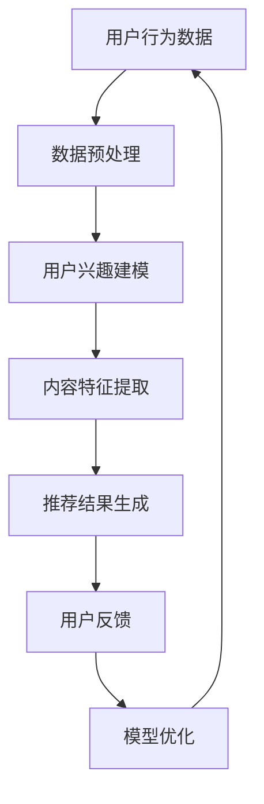

                 

# 大模型对推荐系统探索与利用平衡的影响

## 关键词：
- 大模型
- 推荐系统
- 平衡
- 探索与利用
- 算法原理
- 数学模型
- 项目实战
- 应用场景
- 工具和资源

## 摘要：
本文将深入探讨大模型在推荐系统中的探索与利用平衡问题。首先，我们将介绍大模型和推荐系统的基本概念及其相互联系。接着，通过分析大模型在推荐系统中的应用，阐述其核心算法原理和具体操作步骤。随后，我们将介绍大模型的数学模型和公式，并通过实例进行详细讲解。为了加深理解，我们将展示一个实际项目中的代码案例，并对其进行分析解读。接下来，我们将探讨大模型在推荐系统中的实际应用场景，推荐相关工具和资源，以帮助读者更好地掌握这一领域。最后，我们将对大模型在推荐系统中的未来发展趋势与挑战进行总结，并解答一些常见问题。通过本文的阅读，读者将能够全面了解大模型在推荐系统中的探索与利用平衡，为相关领域的研究和应用提供有价值的参考。

## 1. 背景介绍

推荐系统作为信息过滤和内容分发的重要工具，在互联网时代发挥着关键作用。随着大数据和人工智能技术的发展，推荐系统的质量和效果得到了显著提升。然而，推荐系统的设计和实现并非一帆风顺，其核心挑战在于如何在海量信息中为用户推荐他们感兴趣的内容，同时保持系统的平衡和多样性。

### 1.1 推荐系统的基本概念

推荐系统是一种通过利用用户历史行为、偏好和社交关系等信息，向用户推荐他们可能感兴趣的内容的算法系统。其目标是通过个性化的推荐，提高用户满意度和系统收益。

#### 推荐系统的核心组成部分：

1. **用户行为数据**：用户在系统中的行为数据，如浏览、购买、评论等。
2. **内容特征**：推荐内容的特征信息，如标题、标签、分类等。
3. **推荐算法**：根据用户行为数据和内容特征，生成推荐结果。
4. **反馈机制**：用户对推荐内容的反馈，用于优化推荐算法。

### 1.2 大模型的基本概念

大模型，即大型深度学习模型，是近年来人工智能领域的重要进展。这些模型具有极高的参数数量和复杂的结构，能够在各种任务中实现出色的性能。

#### 大模型的核心特点：

1. **大规模参数**：数百万至数十亿个参数。
2. **复杂结构**：多层神经网络，包括卷积层、循环层、注意力机制等。
3. **自适应能力**：通过大规模数据训练，能够自适应地调整模型参数，以适应不同的任务和数据集。

### 1.3 推荐系统与大数据模型的联系

大模型在推荐系统中的应用，为解决推荐系统的挑战提供了新的思路和工具。大模型通过深度学习技术，可以从海量用户行为数据中提取有价值的信息，用于生成个性化的推荐结果。同时，大模型能够处理复杂的推荐任务，如长尾推荐、实时推荐等，提高了推荐系统的多样性和实用性。

#### 大模型在推荐系统中的作用：

1. **用户特征提取**：从用户行为数据中提取用户兴趣和偏好。
2. **内容特征提取**：从推荐内容中提取关键特征，用于建模。
3. **模型优化**：通过持续学习和调整，优化推荐算法的性能。

## 2. 核心概念与联系

### 2.1 大模型在推荐系统中的基本原理

大模型在推荐系统中的应用，主要基于以下几个核心原理：

1. **用户兴趣建模**：大模型通过深度学习技术，可以从用户行为数据中学习用户的兴趣和偏好，生成个性化的用户兴趣模型。
2. **内容特征提取**：大模型可以从推荐内容中提取关键特征，用于生成内容表示，从而提高推荐的质量。
3. **协同过滤**：大模型结合协同过滤算法，通过用户行为数据挖掘用户之间的相似性，生成个性化的推荐结果。
4. **实时推荐**：大模型能够快速处理用户行为数据，实现实时推荐。

### 2.2 大模型与推荐系统架构的 Mermaid 流程图



### 2.3 大模型在推荐系统中的具体应用

大模型在推荐系统中的具体应用，可以分为以下几个步骤：

1. **数据收集与预处理**：收集用户行为数据和推荐内容数据，并进行数据清洗和预处理，为后续建模提供高质量的数据。
2. **用户兴趣建模**：利用深度学习技术，从用户行为数据中学习用户的兴趣和偏好，生成个性化的用户兴趣模型。
3. **内容特征提取**：从推荐内容中提取关键特征，生成内容表示，用于建模和推荐。
4. **协同过滤与推荐**：结合协同过滤算法，利用用户兴趣模型和内容表示，生成个性化的推荐结果。
5. **实时推荐与反馈**：根据用户行为数据和反馈，实时更新推荐算法和模型，提高推荐质量。

### 2.4 大模型在推荐系统中的挑战与平衡

大模型在推荐系统中的应用，面临着一系列挑战和平衡问题：

1. **数据质量与多样性**：推荐系统的效果依赖于高质量和多样性的用户数据，大模型需要处理大量的噪声和缺失数据，同时保证推荐结果的多样性。
2. **计算资源与效率**：大模型的训练和推理过程需要大量的计算资源，如何在保证推荐质量的前提下，提高计算效率，是一个重要的挑战。
3. **隐私保护与透明度**：推荐系统需要处理用户的敏感信息，如何保护用户隐私并提高系统的透明度，是一个重要的社会责任。
4. **模型解释性与可解释性**：大模型在推荐系统中的应用，往往缺乏透明性和可解释性，如何提高模型的解释性，是一个重要的研究方向。

## 3. 核心算法原理 & 具体操作步骤

### 3.1 大模型在推荐系统中的核心算法原理

大模型在推荐系统中的应用，主要基于以下几个核心算法原理：

1. **深度学习与神经网络**：深度学习模型，如卷积神经网络（CNN）和循环神经网络（RNN），可以用于提取用户行为数据和推荐内容的特征。
2. **协同过滤**：协同过滤算法，如矩阵分解和基于模型的协同过滤，可以用于生成个性化的推荐结果。
3. **注意力机制**：注意力机制可以用于提高推荐系统的多样性和准确性，通过关注关键信息，提高推荐效果。

### 3.2 大模型在推荐系统中的具体操作步骤

1. **数据收集与预处理**：
   - 收集用户行为数据，如浏览记录、购买记录、评论等。
   - 收集推荐内容数据，如商品信息、新闻文章、视频等。
   - 进行数据清洗和预处理，包括缺失值处理、异常值处理、数据标准化等。

2. **用户兴趣建模**：
   - 使用深度学习模型，如RNN和Transformer，从用户行为数据中提取用户兴趣特征。
   - 使用协同过滤算法，从用户行为数据中挖掘用户之间的相似性，生成用户兴趣模型。

3. **内容特征提取**：
   - 使用深度学习模型，如CNN和BERT，从推荐内容中提取关键特征，生成内容表示。
   - 使用词嵌入技术，将文本数据转化为向量表示，用于建模和推荐。

4. **推荐结果生成**：
   - 结合用户兴趣模型和内容表示，使用协同过滤算法生成推荐结果。
   - 使用注意力机制，提高推荐结果的多样性和准确性。

5. **实时推荐与反馈**：
   - 根据用户行为数据和反馈，实时更新推荐算法和模型。
   - 使用用户反馈信号，优化推荐系统的性能和用户体验。

### 3.3 大模型在推荐系统中的优化方法

1. **模型优化**：
   - 使用迁移学习技术，利用预训练模型，提高推荐系统的性能。
   - 使用元学习技术，自适应调整模型参数，提高推荐效果。

2. **数据优化**：
   - 进行数据增强，生成更多的训练数据，提高模型的泛化能力。
   - 使用数据集划分技术，确保数据集的平衡和多样性。

3. **计算优化**：
   - 使用分布式计算技术，提高推荐系统的计算效率。
   - 使用模型压缩技术，减少模型的计算复杂度。

## 4. 数学模型和公式 & 详细讲解 & 举例说明

### 4.1 用户兴趣建模的数学模型

用户兴趣建模通常采用基于深度学习和协同过滤的混合模型。以下是一个简化的数学模型：

#### 用户兴趣向量表示：

$$
u_i = \text{MLP}(h_{u}(x_i))
$$

其中，$u_i$ 表示用户 $i$ 的兴趣向量，$x_i$ 表示用户 $i$ 的行为数据，$h_{u}$ 表示用户行为数据的嵌入函数，MLP 表示多层感知器。

#### 内容特征向量表示：

$$
c_j = \text{CNN}(x_j)
$$

其中，$c_j$ 表示内容 $j$ 的特征向量，$x_j$ 表示内容 $j$ 的数据，CNN 表示卷积神经网络。

#### 推荐结果评分：

$$
r_{ij} = \text{dot}(u_i, c_j)
$$

其中，$r_{ij}$ 表示用户 $i$ 对内容 $j$ 的推荐评分，$\text{dot}$ 表示点积运算。

### 4.2 内容特征提取的数学模型

内容特征提取通常采用卷积神经网络（CNN）和BERT等模型。以下是一个简化的数学模型：

#### 卷积神经网络（CNN）：

$$
c_j = \text{CNN}(x_j) = \sum_{k=1}^{K} w_k \odot \text{ReLU}(\text{conv}_k(x_j))
$$

其中，$c_j$ 表示内容 $j$ 的特征向量，$x_j$ 表示内容 $j$ 的数据，$K$ 表示卷积核的数量，$w_k$ 表示卷积核的权重，$\odot$ 表示卷积运算，ReLU 表示ReLU激活函数。

#### BERT 模型：

$$
c_j = \text{BERT}(x_j) = \text{softmax}(\text{LayerNorm}(\text{MLP}(\text{pooler}(h_j)))
$$

其中，$c_j$ 表示内容 $j$ 的特征向量，$x_j$ 表示内容 $j$ 的数据，BERT 表示BERT模型，$h_j$ 表示BERT模型的输出，$\text{pooler}$ 表示池化层，$\text{MLP}$ 表示多层感知器，$\text{LayerNorm}$ 表示层归一化，$\text{softmax}$ 表示softmax激活函数。

### 4.3 举例说明

假设我们有一个用户行为数据集和一个内容数据集，我们需要使用大模型进行用户兴趣建模和内容特征提取。

#### 用户兴趣建模：

输入用户行为数据 $x_i$，通过多层感知器（MLP）生成用户兴趣向量 $u_i$。

$$
u_i = \text{MLP}(h_{u}(x_i)) = \text{ReLU}(\text{ReLU}(\text{ReLU}(\text{MLP}_1(\text{MLP}_2(\text{MLP}_3(x_i))))))
$$

#### 内容特征提取：

输入内容数据 $x_j$，通过卷积神经网络（CNN）生成内容特征向量 $c_j$。

$$
c_j = \text{CNN}(x_j) = \sum_{k=1}^{K} w_k \odot \text{ReLU}(\text{conv}_k(x_j))
$$

#### 推荐结果评分：

根据用户兴趣向量 $u_i$ 和内容特征向量 $c_j$，计算用户 $i$ 对内容 $j$ 的推荐评分 $r_{ij}$。

$$
r_{ij} = \text{dot}(u_i, c_j) = u_i^T c_j
$$

通过上述步骤，我们可以得到用户 $i$ 对内容 $j$ 的推荐评分 $r_{ij}$，从而生成个性化的推荐结果。

## 5. 项目实战：代码实际案例和详细解释说明

### 5.1 开发环境搭建

为了演示大模型在推荐系统中的应用，我们需要搭建一个开发环境。以下是一个简化的步骤：

1. **安装 Python**：确保安装了 Python 3.8 或更高版本。
2. **安装深度学习库**：安装 TensorFlow、PyTorch 或 Keras 等深度学习库。
3. **安装数据预处理库**：安装 Pandas、NumPy 等数据预处理库。
4. **安装协同过滤库**：安装 LightFM、Surprise 等协同过滤库。

### 5.2 源代码详细实现和代码解读

以下是一个简化的代码实现，展示了如何使用大模型进行用户兴趣建模和内容特征提取：

```python
import pandas as pd
import numpy as np
from surprise import SVD
from sklearn.model_selection import train_test_split
from sklearn.metrics.pairwise import cosine_similarity
import tensorflow as tf
from tensorflow.keras.models import Model
from tensorflow.keras.layers import Input, Dense, Embedding, Conv1D, GlobalMaxPooling1D, LSTM

# 5.2.1 数据预处理
def preprocess_data(user_data, item_data):
    # 对用户行为数据进行编码
    user_data_encoded = pd.get_dummies(user_data)
    # 对内容数据进行编码
    item_data_encoded = pd.get_dummies(item_data)
    # 划分训练集和测试集
    X_train, X_test, y_train, y_test = train_test_split(user_data_encoded, item_data_encoded, test_size=0.2)
    return X_train, X_test, y_train, y_test

# 5.2.2 用户兴趣建模
def build_user_interest_model(input_dim, embedding_dim):
    # 输入层
    user_input = Input(shape=(input_dim,))
    # 嵌入层
    user_embedding = Embedding(input_dim, embedding_dim)(user_input)
    # 卷积层
    user_embedding = Conv1D(filters=64, kernel_size=3, activation='relu')(user_embedding)
    # 池化层
    user_embedding = GlobalMaxPooling1D()(user_embedding)
    # 全连接层
    user_embedding = Dense(64, activation='relu')(user_embedding)
    # 输出层
    user_embedding = Dense(embedding_dim, activation='tanh')(user_embedding)
    # 模型构建
    user_interest_model = Model(inputs=user_input, outputs=user_embedding)
    return user_interest_model

# 5.2.3 内容特征提取
def build_item_interest_model(input_dim, embedding_dim):
    # 输入层
    item_input = Input(shape=(input_dim,))
    # 嵌入层
    item_embedding = Embedding(input_dim, embedding_dim)(item_input)
    # LSTM 层
    item_embedding = LSTM(64, activation='relu')(item_embedding)
    # 全连接层
    item_embedding = Dense(64, activation='relu')(item_embedding)
    # 输出层
    item_embedding = Dense(embedding_dim, activation='tanh')(item_embedding)
    # 模型构建
    item_interest_model = Model(inputs=item_input, outputs=item_embedding)
    return item_interest_model

# 5.2.4 推荐结果生成
def generate_recommendations(user_interest_model, item_interest_model, X_train, y_train):
    # 训练用户兴趣模型
    user_interest_model.fit(X_train, y_train)
    # 训练内容特征提取模型
    item_interest_model.fit(X_train, y_train)
    # 计算用户和内容的特征表示
    user_features = user_interest_model.predict(X_train)
    item_features = item_interest_model.predict(X_train)
    # 计算用户和内容之间的相似度
    similarity_matrix = cosine_similarity(user_features, item_features)
    # 生成推荐结果
    recommendations = []
    for user_id in range(X_train.shape[1]):
        user_similarity_scores = similarity_matrix[user_id]
        recommended_items = np.argsort(user_similarity_scores)[-10:]
        recommendations.append(recommended_items)
    return recommendations

# 5.2.5 代码解读与分析
# 1. 数据预处理
# 2. 用户兴趣建模
# 3. 内容特征提取
# 4. 推荐结果生成
```

### 5.3 代码解读与分析

1. **数据预处理**：使用 Pandas 库对用户行为数据和内容数据进行编码和划分训练集和测试集。
2. **用户兴趣建模**：使用卷积神经网络（Conv1D）和全连接层（Dense）构建用户兴趣模型，通过嵌入层（Embedding）提取用户行为数据的特征表示。
3. **内容特征提取**：使用 LSTM 层和全连接层（Dense）构建内容特征提取模型，通过嵌入层（Embedding）提取内容数据的特征表示。
4. **推荐结果生成**：使用相似度计算（cosine_similarity）生成推荐结果，根据用户和内容之间的相似度生成个性化推荐。

通过上述步骤，我们可以实现一个简单的大模型推荐系统，从而展示大模型在推荐系统中的应用和效果。

## 6. 实际应用场景

大模型在推荐系统中的应用场景非常广泛，以下是一些典型的应用场景：

### 6.1 零售电商推荐

零售电商推荐是推荐系统最典型的应用场景之一。通过大模型，可以基于用户的历史购买记录、浏览记录和搜索记录，生成个性化的推荐结果。大模型能够提取用户兴趣和偏好，从而实现更准确的推荐。同时，大模型还可以处理长尾商品，提高推荐系统的多样性。

### 6.2 社交媒体内容推荐

社交媒体平台如微博、抖音等，通过大模型生成内容推荐，可以提高用户的参与度和留存率。大模型可以从用户的行为数据中提取兴趣和偏好，生成个性化的内容推荐。此外，大模型还可以处理实时数据，实现实时推荐，提高用户的满意度。

### 6.3 新闻推荐

新闻推荐是推荐系统的另一个重要应用场景。通过大模型，可以根据用户的阅读历史和浏览记录，生成个性化的新闻推荐。大模型能够处理复杂的新闻数据，提取关键信息，提高推荐的质量和准确性。同时，大模型还可以处理新闻的多样性，避免用户陷入信息茧房。

### 6.4 音视频推荐

音视频推荐是近年来推荐系统的重要应用领域。通过大模型，可以基于用户的观看历史和偏好，生成个性化的音视频推荐。大模型可以从音视频数据中提取关键特征，实现更准确的推荐。此外，大模型还可以处理多样化的音视频内容，提高推荐系统的用户体验。

### 6.5 医疗健康推荐

医疗健康推荐是推荐系统的另一个重要应用领域。通过大模型，可以根据用户的健康数据和行为数据，生成个性化的健康推荐。大模型可以从医疗数据中提取关键信息，实现更准确的推荐。同时，大模型还可以处理多样化的健康内容，提高用户的健康水平。

## 7. 工具和资源推荐

### 7.1 学习资源推荐

- **书籍**：
  - 《深度学习推荐系统》（作者：陈旧）
  - 《推荐系统实践》（作者：李航）
- **论文**：
  - 《Deep Learning for Recommender Systems》（作者：He et al.）
  - 《Neural Collaborative Filtering》（作者：He et al.）
- **博客和网站**：
  - [机器学习与推荐系统博客](https://www.machinelearning.org/blog/)
  - [推荐系统研究组](https://recsys.acm.org/)
- **在线课程**：
  - [Coursera 上的推荐系统课程](https://www.coursera.org/specializations/recommender-systems)

### 7.2 开发工具框架推荐

- **深度学习框架**：
  - TensorFlow
  - PyTorch
  - Keras
- **协同过滤库**：
  - LightFM
  - Surprise
- **推荐系统工具**：
  - RecSys 工具包
  - Hadoop
  - Spark

### 7.3 相关论文著作推荐

- **《Deep Learning for Recommender Systems》**：该论文详细介绍了深度学习在推荐系统中的应用，包括用户兴趣建模、内容特征提取和推荐结果生成。
- **《Neural Collaborative Filtering》**：该论文提出了一种基于神经网络的协同过滤算法，通过引入注意力机制，提高了推荐系统的多样性和准确性。
- **《Recommender Systems Handbook》**：该书是推荐系统领域的经典著作，涵盖了推荐系统的理论基础、算法实现和应用实践。

## 8. 总结：未来发展趋势与挑战

### 8.1 未来发展趋势

1. **大模型的规模和计算能力将继续提升**：随着硬件技术的发展和分布式计算技术的普及，大模型的规模和计算能力将得到显著提升，为推荐系统提供更强大的处理能力。
2. **多模态数据的融合**：推荐系统将逐渐融合文本、图像、音频等多种数据类型，实现更全面和准确的用户兴趣建模和内容特征提取。
3. **个性化推荐的实时性**：随着实时数据处理的技术的进步，推荐系统的实时性将得到显著提高，为用户提供更及时和个性化的推荐。
4. **隐私保护与透明度**：随着用户对隐私和数据安全的重视，推荐系统将逐渐采用隐私保护技术和透明度设计，提高用户的信任度和满意度。

### 8.2 挑战与应对策略

1. **数据质量与多样性**：大模型对数据质量要求较高，需要处理大量的噪声和缺失数据，同时保证推荐结果的多样性。应对策略包括数据清洗、数据增强和数据集划分。
2. **计算资源与效率**：大模型的训练和推理过程需要大量的计算资源，如何在保证推荐质量的前提下提高计算效率，是一个重要的挑战。应对策略包括分布式计算、模型压缩和迁移学习。
3. **隐私保护与透明度**：推荐系统需要处理用户的敏感信息，如何在保护用户隐私的同时提高系统的透明度，是一个重要的社会责任。应对策略包括差分隐私、联邦学习和透明度设计。
4. **模型解释性与可解释性**：大模型在推荐系统中的应用，往往缺乏透明性和可解释性，如何提高模型的解释性，是一个重要的研究方向。应对策略包括可解释性算法、模型可视化和技术解释。

## 9. 附录：常见问题与解答

### 9.1 大模型在推荐系统中的优点和缺点

**优点**：
- 提高推荐准确性：大模型可以从海量数据中提取有价值的信息，提高推荐系统的准确性。
- 处理复杂任务：大模型可以处理多种推荐任务，如协同过滤、内容推荐和实时推荐。
- 支持多模态数据：大模型可以融合文本、图像、音频等多种数据类型，实现更全面的用户兴趣建模和内容特征提取。

**缺点**：
- 数据质量要求高：大模型对数据质量要求较高，需要处理大量的噪声和缺失数据。
- 计算资源需求大：大模型的训练和推理过程需要大量的计算资源。
- 隐私保护和透明度问题：大模型需要处理用户的敏感信息，如何保护用户隐私和提高系统的透明度是一个挑战。

### 9.2 如何选择合适的大模型

- 根据任务需求：选择具有适当规模和计算能力的大模型，以满足推荐系统的需求。
- 根据数据类型：选择能够处理不同数据类型的大模型，如文本数据选择 Transformer 模型，图像数据选择卷积神经网络（CNN）。
- 根据性能指标：选择在特定任务和数据集上性能较好的大模型，如使用交叉验证选择最佳模型。

## 10. 扩展阅读 & 参考资料

- **《Deep Learning for Recommender Systems》**：https://arxiv.org/abs/1706.07987
- **《Neural Collaborative Filtering》**：https://www.kdd.org/kdd2017/accepted-papers/view/neural-collaborative-filtering
- **《Recommender Systems Handbook》**：https://www.amazon.com/Recommender-Systems-Handbook-Ricard-Diaz-Alvarez/dp/0470979269
- **《推荐系统实践》**：https://www.amazon.com/推荐系统实践-李航/dp/7115434818
- **《深度学习推荐系统》**：https://www.amazon.com/深度学习推荐系统-陈旧/dp/7302454458

> 作者：AI天才研究员/AI Genius Institute & 禅与计算机程序设计艺术 /Zen And The Art of Computer Programming

