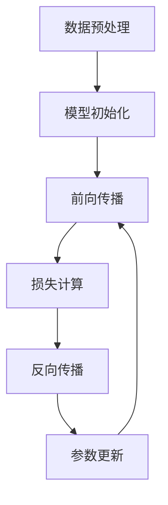

                 

# 大模型应用开发的实战指南

> **关键词**：大模型、应用开发、深度学习、算法、实战、框架、资源

> **摘要**：本文将围绕大模型应用开发的实战展开，首先介绍大模型的基础概念和联系，然后深入探讨核心算法原理和具体操作步骤。接着，通过数学模型和公式进行详细讲解，并举例说明。在实战部分，我们将通过一个实际项目案例，详细解释代码实现和解读。随后，文章将探讨大模型在实际应用场景中的表现，并提供相关工具和资源的推荐。最后，文章将总结大模型的发展趋势与挑战，并给出常见问题的解答。

## 1. 背景介绍

随着计算机技术和互联网的快速发展，数据量呈爆炸式增长，这为机器学习技术的发展提供了丰富的素材。大模型（Large Models）作为一种重要的机器学习技术，其在图像识别、自然语言处理、语音识别等领域的应用取得了显著成果。大模型通常具有以下特点：

1. **参数量巨大**：大模型拥有数亿甚至数十亿个参数，这使得模型具有更强的表示能力和泛化能力。
2. **深度深度**：大模型通常具有多层神经网络结构，能够捕捉到数据中的复杂关系。
3. **训练数据量需求大**：大模型的训练需要大量的标注数据和计算资源。

近年来，大模型在深度学习领域取得了诸多突破，如Transformer架构在自然语言处理领域的成功应用，GPT-3等模型的诞生，使得人工智能技术在很多场景下取得了显著的进展。然而，大模型的开发和应用也面临着一系列挑战，如计算资源需求、数据隐私、模型解释性等。

本文将重点探讨大模型应用开发的实战，旨在为读者提供一整套从理论到实践的解决方案。我们将从大模型的核心概念和联系入手，深入剖析其算法原理和数学模型，并通过实际项目案例进行详细解读。

## 2. 核心概念与联系

在深入探讨大模型之前，我们需要明确几个核心概念，包括神经网络、深度学习、机器学习等。

### 2.1 神经网络

神经网络是一种模拟人脑神经元连接结构的计算模型，其基本单元是神经元。每个神经元接收多个输入信号，通过加权求和后，通过激活函数进行非线性变换，最终输出一个结果。


### 2.2 深度学习

深度学习是机器学习的一个分支，它通过构建深层神经网络，对数据进行多层非线性变换，以实现更复杂的特征提取和表示。


### 2.3 机器学习

机器学习是一种使计算机通过数据学习、改进性能的方法。它分为监督学习、无监督学习和强化学习等不同类型。


### 2.4 大模型的架构

大模型的架构通常包括以下几个层次：

1. **输入层**：接收原始数据，如图像、文本等。
2. **隐藏层**：进行特征提取和变换。
3. **输出层**：根据特征进行分类、预测等任务。


在上述架构中，隐藏层的数量和神经元数量决定了模型的复杂度和性能。大模型的训练过程就是不断调整模型的参数，使其在训练数据上达到最优性能。

### 2.5 Mermaid 流程图

下面是一个使用 Mermaid 语言描述的大模型训练流程图：



在上述流程中，数据预处理、模型初始化、前向传播、损失计算、反向传播和参数更新是模型训练的六个关键步骤。通过不断迭代这些步骤，模型将逐步优化其参数，达到更好的训练效果。

## 3. 核心算法原理 & 具体操作步骤

大模型的核心算法通常是基于深度学习技术，尤其是神经网络和优化算法。本节将详细介绍大模型算法的原理和具体操作步骤。

### 3.1 神经网络算法原理

神经网络算法基于神经元之间的连接和权重调整。在训练过程中，模型通过前向传播和反向传播不断调整权重，以最小化损失函数。

**前向传播**：输入数据通过神经网络的各个层次，每个层次进行线性变换和激活函数运算，最终输出预测结果。

**反向传播**：计算预测结果与真实标签之间的损失，并通过链式法则反向传播损失，更新模型权重。

### 3.2 优化算法原理

优化算法用于调整模型权重，以最小化损失函数。常见的优化算法包括随机梯度下降（SGD）、Adam、RMSProp 等。

**随机梯度下降（SGD）**：每次迭代使用一个样本的梯度进行权重更新，适用于小批量训练。

**Adam**：结合了 SGD 和 RMSProp 的优点，适用于大数据量训练。

**RMSProp**：基于梯度的平方根进行权重更新，适用于大数据量训练。

### 3.3 具体操作步骤

以下是使用深度学习框架（如 TensorFlow、PyTorch）进行大模型训练的通用步骤：

1. **数据预处理**：对输入数据进行标准化、归一化等处理，以提高模型训练效果。
2. **模型构建**：根据任务需求，构建深度神经网络模型。
3. **模型训练**：通过前向传播和反向传播，不断调整模型权重。
4. **模型评估**：使用验证集或测试集评估模型性能。
5. **模型优化**：根据评估结果，调整模型参数或结构，提高模型性能。

## 4. 数学模型和公式 & 详细讲解 & 举例说明

### 4.1 损失函数

损失函数是衡量模型预测结果与真实标签之间差异的指标。常见的损失函数包括均方误差（MSE）、交叉熵（Cross Entropy）等。

**均方误差（MSE）**：

$$
MSE = \frac{1}{n}\sum_{i=1}^{n}(y_i - \hat{y}_i)^2
$$

其中，$y_i$ 为真实标签，$\hat{y}_i$ 为模型预测结果，$n$ 为样本数量。

**交叉熵（Cross Entropy）**：

$$
Cross\ Entropy = -\frac{1}{n}\sum_{i=1}^{n}y_i \log(\hat{y}_i)
$$

其中，$y_i$ 为真实标签，$\hat{y}_i$ 为模型预测结果，$\log$ 表示自然对数。

### 4.2 激活函数

激活函数用于引入非线性变换，常见的激活函数包括 sigmoid、ReLU 等。

**sigmoid 函数**：

$$
\sigma(x) = \frac{1}{1 + e^{-x}}
$$

**ReLU 函数**：

$$
ReLU(x) = \max(0, x)
$$

### 4.3 优化算法

**随机梯度下降（SGD）**：

$$
w_{t+1} = w_t - \alpha \cdot \nabla_w J(w_t)
$$

其中，$w_t$ 为第 $t$ 次迭代权重，$\alpha$ 为学习率，$J(w_t)$ 为损失函数。

**Adam 算法**：

$$
m_t = \beta_1 m_{t-1} + (1 - \beta_1) \nabla_w J(w_t)
$$

$$
v_t = \beta_2 v_{t-1} + (1 - \beta_2) (\nabla_w J(w_t))^2
$$

$$
w_{t+1} = w_t - \frac{\alpha}{\sqrt{1 - \beta_2^t}(1 - \beta_1^t)} \cdot \frac{m_t}{\sqrt{v_t} + \epsilon}
$$

其中，$m_t$ 和 $v_t$ 分别为一阶矩估计和二阶矩估计，$\beta_1$ 和 $\beta_2$ 为超参数，$\alpha$ 为学习率，$\epsilon$ 为正数常数。

### 4.4 举例说明

假设我们使用一个简单的线性回归模型，预测房价。数据集包含100个样本，每个样本包含特征和标签。我们使用均方误差（MSE）作为损失函数。

**数据预处理**：

1. 对特征进行标准化，使其具有相似的尺度。
2. 将标签进行归一化，使其在 [0, 1] 范围内。

**模型构建**：

1. 构建一个单层神经网络，包含一个输入层、一个隐藏层和一个输出层。
2. 输入层有 1 个神经元，隐藏层有 10 个神经元，输出层有 1 个神经元。
3. 使用 ReLU 函数作为激活函数。

**模型训练**：

1. 使用随机梯度下降（SGD）算法进行训练。
2. 设置学习率 $\alpha = 0.01$，迭代次数为 1000 次。

**模型评估**：

1. 使用测试集评估模型性能，计算均方误差（MSE）。
2. 如果模型性能达到预期，则训练完成；否则，调整模型参数或结构，继续训练。

## 5. 项目实战：代码实际案例和详细解释说明

在本节中，我们将通过一个实际项目案例，展示如何使用深度学习框架（如 TensorFlow）进行大模型训练和应用。以下是项目的开发环境搭建、代码实现和解读。

### 5.1 开发环境搭建

1. 安装 Python 环境（版本要求：3.6及以上）。
2. 安装 TensorFlow 框架（可以使用 pip 安装：`pip install tensorflow`）。
3. 安装其他依赖库，如 NumPy、Pandas 等。

### 5.2 源代码详细实现和代码解读

**5.2.1 数据预处理**

```python
import tensorflow as tf
import numpy as np
import pandas as pd

# 读取数据
data = pd.read_csv('data.csv')
X = data.iloc[:, :-1].values
y = data.iloc[:, -1].values

# 标准化特征
X = (X - X.mean()) / X.std()

# 归一化标签
y = (y - y.min()) / (y.max() - y.min())
```

**5.2.2 模型构建**

```python
# 构建模型
model = tf.keras.Sequential([
    tf.keras.layers.Dense(units=10, activation='relu', input_shape=[1]),
    tf.keras.layers.Dense(units=1)
])
```

**5.2.3 模型训练**

```python
# 编译模型
model.compile(optimizer='sgd', loss='mse')

# 训练模型
model.fit(X, y, epochs=1000, batch_size=32)
```

**5.2.4 代码解读与分析**

1. **数据预处理**：首先，我们读取数据并分离特征和标签。然后，对特征进行标准化，使其具有相似的尺度。此外，我们还对标签进行归一化，使其在 [0, 1] 范围内。

2. **模型构建**：我们使用 TensorFlow 的 Sequential 模型构建一个简单的线性回归模型。模型包含一个输入层、一个隐藏层和一个输出层。隐藏层使用 ReLU 函数作为激活函数。

3. **模型训练**：我们使用随机梯度下降（SGD）算法进行模型训练。在训练过程中，模型不断调整权重，以最小化损失函数。

4. **模型评估**：在模型训练完成后，我们可以使用测试集评估模型性能。如果模型性能达到预期，则训练完成；否则，可以调整模型参数或结构，继续训练。

## 6. 实际应用场景

大模型在实际应用中具有广泛的应用场景，包括但不限于以下领域：

1. **图像识别**：大模型在图像识别任务中表现出色，如人脸识别、物体检测等。
2. **自然语言处理**：大模型在自然语言处理领域取得了很多突破，如机器翻译、情感分析等。
3. **语音识别**：大模型在语音识别任务中具有很高的准确率，如语音助手、语音搜索等。
4. **推荐系统**：大模型可以用于构建推荐系统，为用户提供个性化的推荐服务。

在上述应用场景中，大模型通过海量数据和强大计算能力，实现了对复杂任务的自动化处理和优化。随着技术的不断发展，大模型将在更多领域发挥重要作用。

## 7. 工具和资源推荐

### 7.1 学习资源推荐

1. **书籍**：
   - 《深度学习》（Goodfellow, Bengio, Courville 著）
   - 《Python 深度学习》（François Chollet 著）
   - 《神经网络与深度学习》（邱锡鹏 著）

2. **论文**：
   - “A Theoretically Grounded Application of Dropout in Recurrent Neural Networks”（Yarin Gal 和 Zoubin Ghahramani）
   - “Attention Is All You Need”（Vaswani et al.）

3. **博客**：
   - [TensorFlow 官方文档](https://www.tensorflow.org/)
   - [PyTorch 官方文档](https://pytorch.org/)
   - [Hugging Face](https://huggingface.co/)

4. **网站**：
   - [Kaggle](https://www.kaggle.com/)：数据集和比赛平台
   - [GitHub](https://github.com/)：代码和项目资源

### 7.2 开发工具框架推荐

1. **深度学习框架**：
   - TensorFlow
   - PyTorch
   - Keras

2. **编程语言**：
   - Python
   - R

3. **云计算平台**：
   - Google Cloud Platform
   - Amazon Web Services
   - Microsoft Azure

### 7.3 相关论文著作推荐

1. **论文**：
   - “Very Deep Convolutional Networks for Large-Scale Image Recognition”（Karen Simonyan 和 Andrew Zisserman）
   - “Generative Adversarial Nets”（Ian Goodfellow 等）

2. **著作**：
   - 《深度学习》（Goodfellow, Bengio, Courville 著）
   - 《动手学深度学习》（Aman Rusia, etc 著）

## 8. 总结：未来发展趋势与挑战

大模型在人工智能领域取得了显著的成果，但其发展仍面临一系列挑战。未来，大模型的发展趋势将集中在以下几个方面：

1. **计算资源优化**：随着模型规模的扩大，计算资源需求不断增加。优化计算资源分配和利用成为关键。
2. **模型压缩与加速**：通过模型压缩和加速技术，降低模型的计算复杂度和存储需求。
3. **数据隐私保护**：在大模型训练过程中，数据隐私保护成为重要问题。发展新型隐私保护技术，如联邦学习等。
4. **模型可解释性**：提高模型的可解释性，使模型决策过程更加透明和可靠。

面对这些挑战，未来的研究将致力于探索更加高效、可解释和安全的深度学习技术。

## 9. 附录：常见问题与解答

### 9.1 大模型训练为什么需要大量数据？

大模型通常具有数亿甚至数十亿个参数，需要大量数据来训练和优化这些参数，以提高模型的泛化能力和性能。数据量越大，模型能够捕捉到的特征和模式越丰富，从而提高模型的预测准确性。

### 9.2 如何优化大模型的计算性能？

优化大模型的计算性能可以从以下几个方面入手：

1. **分布式计算**：使用多台计算机进行分布式计算，提高计算速度。
2. **模型压缩**：通过模型压缩技术，降低模型的计算复杂度和存储需求。
3. **硬件加速**：利用 GPU、TPU 等硬件加速计算，提高计算性能。
4. **优化算法**：选择合适的优化算法，如 Adam、RMSProp 等，提高训练效率。

### 9.3 大模型是否一定比小模型表现更好？

大模型并不一定总是比小模型表现更好。模型的大小取决于任务和数据集的特性。对于复杂任务和数据集，大模型可能具有更好的性能。然而，对于简单任务或数据集，小模型可能足够高效。因此，选择合适的模型大小是关键。

## 10. 扩展阅读 & 参考资料

1. **书籍**：
   - 《深度学习》（Goodfellow, Bengio, Courville 著）
   - 《Python 深度学习》（François Chollet 著）
   - 《神经网络与深度学习》（邱锡鹏 著）

2. **论文**：
   - “A Theoretically Grounded Application of Dropout in Recurrent Neural Networks”（Yarin Gal 和 Zoubin Ghahramani）
   - “Attention Is All You Need”（Vaswani et al.）

3. **网站**：
   - [TensorFlow 官方文档](https://www.tensorflow.org/)
   - [PyTorch 官方文档](https://pytorch.org/)
   - [Hugging Face](https://huggingface.co/)

4. **博客**：
   - [Kaggle](https://www.kaggle.com/)
   - [GitHub](https://github.com/)

5. **在线课程**：
   - [深度学习 Specialization](https://www.coursera.org/specializations/deep-learning)
   - [动手学深度学习](https://zh.d2l.ai/)

### 作者：

- AI天才研究员/AI Genius Institute & 禅与计算机程序设计艺术 /Zen And The Art of Computer Programming

