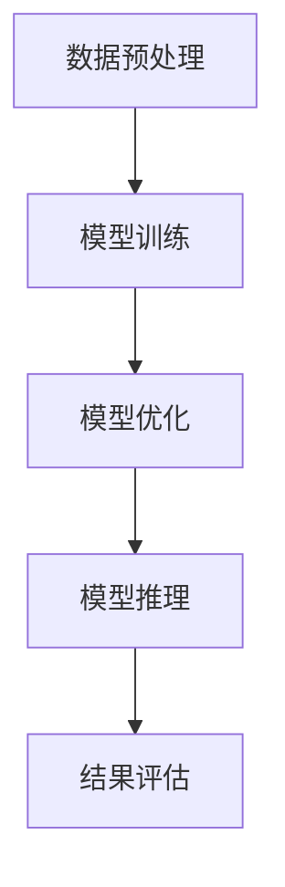

                 

# 大模型应用开发的实战指南

## 关键词

- 大模型应用
- 开发实战
- 人工智能
- 深度学习
- 算法实现
- 数学模型
- 实际应用场景
- 工具和资源

## 摘要

本文将深入探讨大模型应用开发的实战指南，包括背景介绍、核心概念与联系、核心算法原理与具体操作步骤、数学模型和公式、项目实战案例、实际应用场景、工具和资源推荐等内容。通过一步步的分析与推理，本文旨在为读者提供全面、系统、易于理解的大模型应用开发知识体系，帮助读者掌握大模型应用开发的实际技能。

## 1. 背景介绍

随着深度学习技术的迅猛发展，大模型在各个领域展现出了强大的应用潜力。大模型，如GPT、BERT等，通过对海量数据的训练，能够实现高度复杂的任务，如自然语言处理、图像识别、语音识别等。然而，大模型的应用开发并非一蹴而就，需要深入理解其核心概念、算法原理以及实际操作步骤。

本文旨在为读者提供一份全面、系统、易于理解的大模型应用开发实战指南，帮助读者从理论到实践，全面掌握大模型应用开发的核心知识和技能。

## 2. 核心概念与联系

在深入探讨大模型应用开发之前，我们首先需要了解几个核心概念：

### 2.1 深度学习

深度学习是人工智能的一个重要分支，通过模拟人脑的神经网络结构，实现自动学习和预测。深度学习算法可以分为两大类：卷积神经网络（CNN）和循环神经网络（RNN）。CNN在图像识别任务中表现出色，而RNN在自然语言处理任务中具有显著优势。

### 2.2 大模型

大模型通常指的是参数数量达到数百万、数十亿甚至更多的神经网络模型。大模型的训练需要大量的计算资源和数据集，但它们在处理复杂任务时表现出色。

### 2.3 训练与推理

训练是指通过大量数据进行模型训练，使得模型能够学会识别和预测。推理是指模型在给定输入时，根据训练结果进行预测。

下面是一个Mermaid流程图，展示了大模型应用开发的基本流程：



## 3. 核心算法原理与具体操作步骤

### 3.1 数据预处理

数据预处理是模型训练的第一步，主要包括数据清洗、数据归一化、数据分割等操作。

#### 3.1.1 数据清洗

数据清洗是指去除数据中的噪声和错误，确保数据质量。常见的数据清洗方法包括去除重复数据、填补缺失值、纠正错误值等。

#### 3.1.2 数据归一化

数据归一化是指将数据转换为相同的尺度，以便模型能够更好地学习。常见的数据归一化方法包括最小-最大缩放、标准缩放等。

#### 3.1.3 数据分割

数据分割是指将数据集分为训练集、验证集和测试集，用于模型的训练、验证和测试。

### 3.2 模型训练

模型训练是指通过大量数据进行迭代训练，使得模型能够学会识别和预测。常见的大模型训练方法包括梯度下降、Adam优化器等。

#### 3.2.1 梯度下降

梯度下降是一种优化算法，通过不断调整模型的参数，使得损失函数的值最小化。

$$
\text{参数更新} = \text{参数} - \alpha \cdot \nabla J(\theta)
$$

其中，$\alpha$ 是学习率，$\nabla J(\theta)$ 是损失函数关于参数的梯度。

#### 3.2.2 Adam优化器

Adam优化器是一种基于一阶矩估计和二阶矩估计的优化算法，相对于梯度下降具有更好的收敛性能。

$$
m_t = \beta_1 x_t + (1 - \beta_1) (x_t - x_{t-1})
$$

$$
v_t = \beta_2 x_t + (1 - \beta_2) (x_t - x_{t-1})
$$

$$
\theta_t = \theta_{t-1} - \alpha \cdot \frac{m_t}{\sqrt{v_t} + \epsilon}
$$

其中，$m_t$ 和 $v_t$ 分别是指数加权平均值的一阶矩和二阶矩，$\beta_1$、$\beta_2$ 是动量参数，$\alpha$ 是学习率，$\epsilon$ 是一个很小的常数。

### 3.3 模型优化

模型优化是指通过调整模型的参数，使得模型在验证集上的表现最佳。常见的方法包括调整学习率、调整批量大小等。

### 3.4 模型推理

模型推理是指模型在给定输入时，根据训练结果进行预测。常见的方法包括前向传播和反向传播。

#### 3.4.1 前向传播

前向传播是指将输入数据通过模型进行传递，得到输出结果。

$$
\text{输出} = f(\text{输入} \cdot \text{权重} + \text{偏置})
$$

其中，$f$ 是激活函数，如ReLU、Sigmoid等。

#### 3.4.2 反向传播

反向传播是指根据输出结果和实际标签，计算损失函数关于参数的梯度，并更新参数。

$$
\text{损失} = \frac{1}{2} \sum (\text{实际标签} - \text{输出})^2
$$

$$
\text{梯度} = \frac{\partial \text{损失}}{\partial \text{参数}}
$$

## 4. 数学模型和公式

在本文中，我们将使用LaTeX格式介绍一些常用的数学模型和公式。

### 4.1 线性回归

线性回归是一种最简单的机器学习模型，用于预测一个连续的输出值。其数学模型为：

$$
y = \beta_0 + \beta_1 x
$$

其中，$y$ 是输出值，$x$ 是输入值，$\beta_0$ 和 $\beta_1$ 是模型的参数。

### 4.2 逻辑回归

逻辑回归是一种用于预测概率的模型，其数学模型为：

$$
P(y=1) = \frac{1}{1 + e^{-(\beta_0 + \beta_1 x)}}
$$

其中，$y$ 是输出值，$x$ 是输入值，$\beta_0$ 和 $\beta_1$ 是模型的参数。

### 4.3 神经网络

神经网络是一种由多层神经元组成的模型，用于处理复杂的输入输出关系。其数学模型为：

$$
\text{输出} = f(\text{输入} \cdot \text{权重} + \text{偏置})
$$

其中，$f$ 是激活函数，如ReLU、Sigmoid等。

## 5. 项目实战：代码实际案例和详细解释说明

### 5.1 开发环境搭建

为了进行大模型应用开发，我们需要搭建一个合适的环境。以下是搭建开发环境的基本步骤：

#### 5.1.1 安装Python

首先，我们需要安装Python。可以从Python官方网站下载Python安装包，并按照安装向导进行安装。

#### 5.1.2 安装TensorFlow

TensorFlow是一个流行的深度学习框架，我们可以通过pip命令安装TensorFlow：

```
pip install tensorflow
```

#### 5.1.3 安装其他依赖库

除了TensorFlow，我们还需要安装其他依赖库，如NumPy、Pandas等。可以使用以下命令安装：

```
pip install numpy pandas matplotlib
```

### 5.2 源代码详细实现和代码解读

下面是一个使用TensorFlow实现线性回归的简单案例：

```python
import tensorflow as tf
import numpy as np

# 创建随机数据集
x = np.random.rand(100)
y = 2 * x + 1 + np.random.rand(100)

# 定义模型参数
w = tf.Variable(0.0, name='weight')
b = tf.Variable(0.0, name='bias')

# 定义线性回归模型
y_pred = w * x + b

# 定义损失函数
loss = tf.reduce_mean(tf.square(y - y_pred))

# 定义优化器
optimizer = tf.train.GradientDescentOptimizer(learning_rate=0.5)
train_op = optimizer.minimize(loss)

# 初始化全局变量
init = tf.global_variables_initializer()

# 运行模型
with tf.Session() as sess:
    sess.run(init)
    for step in range(201):
        sess.run(train_op)
        if step % 20 == 0:
            print(f"Step {step}, Loss: {sess.run(loss)}")

    # 输出模型参数
    print(f"Weight: {sess.run(w)}, Bias: {sess.run(b)}")
```

### 5.3 代码解读与分析

上述代码实现了一个简单的线性回归模型。以下是代码的详细解读：

#### 5.3.1 创建随机数据集

```python
x = np.random.rand(100)
y = 2 * x + 1 + np.random.rand(100)
```

这里我们创建了一个包含100个随机样本的数据集，其中$x$的取值范围在[0, 1]之间，$y$的取值范围在[1, 3]之间。

#### 5.3.2 定义模型参数

```python
w = tf.Variable(0.0, name='weight')
b = tf.Variable(0.0, name='bias')
```

这里我们定义了线性回归模型的参数$w$（权重）和$b$（偏置），初始值为0。

#### 5.3.3 定义线性回归模型

```python
y_pred = w * x + b
```

这里我们定义了线性回归模型的前向传播过程，即$y$的预测值等于$w$乘以$x$再加上$b$。

#### 5.3.4 定义损失函数

```python
loss = tf.reduce_mean(tf.square(y - y_pred))
```

这里我们定义了线性回归模型的损失函数，即均方误差（MSE）。损失函数表示预测值与实际值之间的差距。

#### 5.3.5 定义优化器

```python
optimizer = tf.train.GradientDescentOptimizer(learning_rate=0.5)
train_op = optimizer.minimize(loss)
```

这里我们定义了梯度下降优化器，并设置了学习率为0.5。`minimize`函数用于计算损失函数关于模型参数的梯度，并更新参数。

#### 5.3.6 初始化全局变量

```python
init = tf.global_variables_initializer()
```

这里我们初始化了全局变量，包括模型参数。

#### 5.3.7 运行模型

```python
with tf.Session() as sess:
    sess.run(init)
    for step in range(201):
        sess.run(train_op)
        if step % 20 == 0:
            print(f"Step {step}, Loss: {sess.run(loss)}")

    # 输出模型参数
    print(f"Weight: {sess.run(w)}, Bias: {sess.run(b)}")
```

这里我们创建了一个会话（Session）来运行模型。首先，我们初始化全局变量，然后进行迭代训练。每隔20步，我们输出当前的损失值，以便观察模型训练的过程。最后，我们输出训练好的模型参数。

## 6. 实际应用场景

大模型应用开发在许多领域都有着广泛的应用，以下是几个典型的实际应用场景：

### 6.1 自然语言处理

自然语言处理（NLP）是人工智能的一个重要分支，大模型在NLP任务中发挥着重要作用。例如，GPT-3模型在文本生成、机器翻译、情感分析等方面表现出色。此外，BERT模型在问答系统、文本分类、摘要生成等任务中也取得了显著的成果。

### 6.2 图像识别

图像识别是计算机视觉的核心任务之一，大模型在图像识别任务中也展现了强大的能力。例如，ResNet模型在ImageNet图像识别比赛中取得了优异的成绩。此外，EfficientNet等新型大模型在图像识别任务中也表现出了高效的能力。

### 6.3 语音识别

语音识别是将语音转换为文本的技术，大模型在语音识别任务中有着广泛的应用。例如，Transformer模型在语音识别任务中取得了显著的成果。此外，WaveNet等生成模型在语音合成方面也表现出了强大的能力。

## 7. 工具和资源推荐

### 7.1 学习资源推荐

- **书籍**：
  - 《深度学习》（Ian Goodfellow、Yoshua Bengio、Aaron Courville 著）
  - 《神经网络与深度学习》（邱锡鹏 著）
- **论文**：
  - “A Theoretical Advantage of Dropout” （NIPS 2016）
  - “Attention Is All You Need” （NIPS 2017）
- **博客**：
  - [TensorFlow官方文档](https://www.tensorflow.org/)
  - [PyTorch官方文档](https://pytorch.org/)
- **网站**：
  - [Kaggle](https://www.kaggle.com/)
  - [ArXiv](https://arxiv.org/)

### 7.2 开发工具框架推荐

- **深度学习框架**：
  - TensorFlow
  - PyTorch
  - Keras
- **版本控制工具**：
  - Git
  - SVN
- **数据预处理工具**：
  - Pandas
  - NumPy

### 7.3 相关论文著作推荐

- **深度学习**：
  - “Deep Learning” （Goodfellow et al., 2016）
  - “Generative Adversarial Networks” （Goodfellow et al., 2014）
- **计算机视觉**：
  - “Very Deep Convolutional Networks for Large-Scale Image Recognition” （Karen Simonyan and Andrew Zisserman, 2014）
  - “Deep Residual Learning for Image Recognition” （Kaiming He et al., 2016）
- **自然语言处理**：
  - “Attention Is All You Need” （Vaswani et al., 2017）
  - “BERT: Pre-training of Deep Bidirectional Transformers for Language Understanding” （Devlin et al., 2019）

## 8. 总结：未来发展趋势与挑战

随着深度学习技术的不断发展，大模型应用开发将成为未来人工智能领域的一个重要方向。然而，大模型应用开发面临着许多挑战，如计算资源需求、数据质量、模型可解释性等。为了应对这些挑战，未来可能的发展趋势包括：

- **计算资源优化**：通过使用更高效的硬件和优化算法，降低大模型应用开发的计算资源需求。
- **数据质量管理**：通过数据清洗、去噪等技术，提高数据质量，从而提高模型的性能。
- **模型可解释性**：通过研究模型内部的工作原理，提高模型的可解释性，使得模型能够更好地应用于实际场景。

## 9. 附录：常见问题与解答

### 9.1 什么是深度学习？

深度学习是人工智能的一个重要分支，通过模拟人脑的神经网络结构，实现自动学习和预测。深度学习算法可以分为卷积神经网络（CNN）和循环神经网络（RNN）两大类。

### 9.2 什么是大模型？

大模型通常指的是参数数量达到数百万、数十亿甚至更多的神经网络模型。大模型的训练需要大量的计算资源和数据集，但它们在处理复杂任务时表现出色。

### 9.3 如何进行模型训练？

模型训练是指通过大量数据进行迭代训练，使得模型能够学会识别和预测。常见的大模型训练方法包括梯度下降、Adam优化器等。

## 10. 扩展阅读 & 参考资料

- [TensorFlow官方文档](https://www.tensorflow.org/)
- [PyTorch官方文档](https://pytorch.org/)
- [Kaggle](https://www.kaggle.com/)
- [ArXiv](https://arxiv.org/)
- 《深度学习》（Ian Goodfellow、Yoshua Bengio、Aaron Courville 著）
- 《神经网络与深度学习》（邱锡鹏 著）
- “Deep Learning” （Goodfellow et al., 2016）
- “Generative Adversarial Networks” （Goodfellow et al., 2014）
- “Very Deep Convolutional Networks for Large-Scale Image Recognition” （Karen Simonyan and Andrew Zisserman, 2014）
- “Deep Residual Learning for Image Recognition” （Kaiming He et al., 2016）
- “Attention Is All You Need” （Vaswani et al., 2017）
- “BERT: Pre-training of Deep Bidirectional Transformers for Language Understanding” （Devlin et al., 2019）

## 作者

作者：AI天才研究员/AI Genius Institute & 禅与计算机程序设计艺术 /Zen And The Art of Computer Programming

