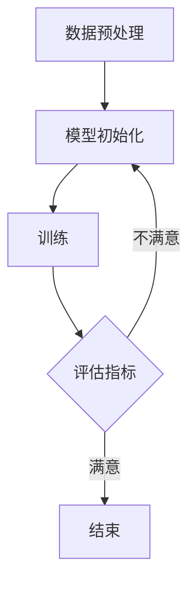

                 

# 大模型应用的概念验证与落地

## 关键词：
- 大模型
- 应用
- 概念验证
- 落地
- 算法
- 实战

## 摘要：
本文深入探讨大模型在计算机科学领域的应用，从概念验证到实际落地，全面分析其核心原理、技术实现、应用场景，以及未来发展趋势和挑战。通过详细的案例分析，展示如何将大模型技术应用于实际项目中，为读者提供全面的技术指南和实践经验。

## 目录
1. 背景介绍
2. 核心概念与联系
   2.1 大模型的定义
   2.2 大模型的架构
   2.3 大模型的应用领域
3. 核心算法原理 & 具体操作步骤
   3.1 训练过程
   3.2 预测过程
4. 数学模型和公式 & 详细讲解 & 举例说明
   4.1 神经网络
   4.2 优化算法
5. 项目实战：代码实际案例和详细解释说明
   5.1 开发环境搭建
   5.2 源代码详细实现和代码解读
   5.3 代码解读与分析
6. 实际应用场景
   6.1 自然语言处理
   6.2 计算机视觉
   6.3 机器翻译
7. 工具和资源推荐
   7.1 学习资源推荐
   7.2 开发工具框架推荐
   7.3 相关论文著作推荐
8. 总结：未来发展趋势与挑战
9. 附录：常见问题与解答
10. 扩展阅读 & 参考资料

## 1. 背景介绍
大模型（Large-scale Model）是近年来计算机科学领域的一个重要研究方向，其核心在于通过大规模的数据和计算资源，训练出能够处理复杂数据的深度学习模型。随着硬件性能的不断提升和互联网数据的爆发式增长，大模型在各个领域展现出了强大的应用潜力。

大模型的崛起，源于深度学习在图像识别、自然语言处理、语音识别等领域的成功应用。传统模型在面对海量数据和复杂任务时，往往表现不佳，而大模型通过其强大的参数和计算能力，能够更好地模拟人脑的学习过程，实现对复杂数据的自动学习和理解。

本文旨在探讨大模型在概念验证到实际落地的全过程中，所涉及的核心技术、应用场景和未来发展趋势。通过本文的阅读，读者可以全面了解大模型的应用价值，掌握其技术原理和实现方法，为实际项目中的大模型应用提供指导。

## 2. 核心概念与联系
### 2.1 大模型的定义
大模型通常指的是参数规模达到百万级、甚至亿级以上的深度学习模型。这些模型通过在大量数据上训练，学习到丰富的特征表示，从而在各类任务上表现出色。

大模型的定义可以从以下几个方面进行理解：
- **参数规模**：大模型的参数数量往往达到百万、千万甚至亿级，这使得模型具有丰富的表达能力。
- **数据规模**：大模型通常需要海量的训练数据，以充分挖掘数据中的潜在信息。
- **计算资源**：大模型的训练和推理过程需要大量的计算资源，对硬件性能有较高要求。

### 2.2 大模型的架构
大模型的架构主要分为两部分：前端数据预处理和后端深度神经网络。

- **前端数据预处理**：负责将原始数据转换为适合训练的数据形式，包括数据清洗、数据增强、特征提取等。这一部分对于提高模型性能至关重要。
- **后端深度神经网络**：负责完成实际的预测和分类任务，通常由多个层级的神经网络构成，通过层层传递信息，实现对数据的深度学习。

### 2.3 大模型的应用领域
大模型在计算机科学领域的应用非常广泛，主要包括以下领域：

- **自然语言处理（NLP）**：大模型在文本分类、情感分析、机器翻译等领域表现出色，如BERT、GPT等。
- **计算机视觉（CV）**：大模型在图像分类、目标检测、人脸识别等领域有广泛应用，如ResNet、Inception等。
- **语音识别（ASR）**：大模型在语音识别任务中，能够通过大量语音数据训练出高度准确的模型。
- **推荐系统**：大模型通过分析用户行为数据，提供个性化的推荐服务。

### 2.4 大模型的 Mermaid 流程图
以下是一个简单的大模型训练流程的 Mermaid 图：



在上述流程中，数据预处理是模型训练的重要前置工作，模型初始化为随机初始化，然后通过训练过程不断调整模型参数，最终通过评估指标判断训练效果，若满足要求则结束，否则继续迭代训练。

## 3. 核心算法原理 & 具体操作步骤
### 3.1 训练过程
大模型的训练过程主要包括数据预处理、模型初始化、前向传播、反向传播和参数更新等步骤。

- **数据预处理**：将原始数据清洗、归一化、编码等，转换为模型可接受的格式。
- **模型初始化**：通常采用随机初始化的方法，初始化模型参数。
- **前向传播**：将输入数据通过神经网络的前向传播过程，得到预测结果。
- **反向传播**：计算预测结果与真实标签之间的差异，通过反向传播更新模型参数。
- **参数更新**：根据梯度信息，更新模型参数，降低损失函数。

具体步骤如下：

1. **数据预处理**：
    ```bash
    # 数据清洗和预处理
    data_preprocess.py
    ```

2. **模型初始化**：
    ```python
    # 初始化模型
    model = Model()
    ```

3. **前向传播**：
    ```python
    # 前向传播
    predictions = model.forward(input_data)
    ```

4. **反向传播**：
    ```python
    # 反向传播
    gradients = model.backward(predictions, target)
    ```

5. **参数更新**：
    ```python
    # 更新参数
    model.update_params(gradients)
    ```

### 3.2 预测过程
在训练完成后，大模型可以用于预测新数据的标签。预测过程主要包括数据预处理、模型推理和结果输出等步骤。

- **数据预处理**：与训练过程类似，将新数据预处理为模型可接受的格式。
- **模型推理**：将预处理后的数据输入模型，得到预测结果。
- **结果输出**：将预测结果输出，供用户使用。

具体步骤如下：

1. **数据预处理**：
    ```bash
    # 数据预处理
    predict_preprocess.py
    ```

2. **模型推理**：
    ```python
    # 模型推理
    predictions = model.predict(input_data)
    ```

3. **结果输出**：
    ```python
    # 输出结果
    print(predictions)
    ```

## 4. 数学模型和公式 & 详细讲解 & 举例说明
### 4.1 神经网络
神经网络（Neural Network）是深度学习的基础，其核心思想是模拟人脑神经元的工作原理，通过多层神经元之间的连接，实现数据的自动学习和处理。

神经网络的基本组成部分包括：

- **神经元**：模拟人脑神经元的基本单元，通过输入和权重计算得到输出。
- **层**：由多个神经元组成，包括输入层、隐藏层和输出层。
- **权重**：连接不同层神经元的参数，用于调节信息的传递强度。

神经网络的数学模型可以表示为：
\[ \text{output} = \sigma(\text{weight} \cdot \text{input} + \text{bias}) \]
其中，\( \sigma \) 是激活函数，常用的激活函数有 Sigmoid、ReLU 等。

### 4.2 优化算法
优化算法（Optimization Algorithm）是神经网络训练过程中的关键环节，用于调整模型参数，使得模型在训练数据上的表现更好。

常见的优化算法包括：

- **梯度下降（Gradient Descent）**：通过计算损失函数关于模型参数的梯度，迭代更新模型参数。
- **随机梯度下降（Stochastic Gradient Descent，SGD）**：在梯度下降的基础上，每次迭代只更新一个样本的梯度。
- **Adam优化器**：结合了 SGD 和动量法的优点，自适应调整学习率。

梯度下降的数学公式为：
\[ \theta_{t+1} = \theta_{t} - \alpha \cdot \nabla_{\theta} J(\theta) \]
其中，\( \theta \) 表示模型参数，\( \alpha \) 表示学习率，\( \nabla_{\theta} J(\theta) \) 表示损失函数关于模型参数的梯度。

### 4.3 举例说明
假设我们有一个简单的神经网络，输入为 \( x \)，输出为 \( y \)，激活函数为 ReLU，损失函数为均方误差（MSE）。

1. **模型初始化**：
    ```python
    weights = np.random.randn(1, 1)
    bias = np.random.randn(1)
    ```

2. **前向传播**：
    ```python
    input_data = 2
    output = np.relu(weights * input_data + bias)
    ```

3. **反向传播**：
    ```python
    target = 1
    output_error = output - target
    output_delta = output_error * np.relu_derivative(output)
    weights_error = output_delta * input_data
    bias_error = output_delta
    ```

4. **参数更新**：
    ```python
    learning_rate = 0.1
    weights -= learning_rate * weights_error
    bias -= learning_rate * bias_error
    ```

通过上述步骤，我们可以看到神经网络的基本工作原理。在实际应用中，神经网络的结构和参数会更加复杂，但基本思想相同。

## 5. 项目实战：代码实际案例和详细解释说明
### 5.1 开发环境搭建
为了演示大模型的应用，我们将使用 Python 和 TensorFlow 框架来搭建一个简单的神经网络模型。以下是开发环境的搭建步骤：

1. **安装 Python**：
    - 前往 Python 官网（https://www.python.org/）下载并安装最新版本的 Python。
  
2. **安装 TensorFlow**：
    - 打开终端，执行以下命令安装 TensorFlow：
    ```bash
    pip install tensorflow
    ```

3. **配置环境变量**：
    - 修改 \(~/.bashrc\) 文件，添加以下内容：
    ```bash
    export PATH=$PATH:/usr/local/bin
    export PYTHONPATH=$PYTHONPATH:/usr/local/bin
    ```
    - 执行 \(source ~/.bashrc\) 命令使环境变量生效。

4. **验证安装**：
    - 在终端执行以下命令，验证 TensorFlow 是否安装成功：
    ```bash
    python -c "import tensorflow as tf; print(tf.reduce_sum(tf.random.normal([1000, 1000])))"
    ```

### 5.2 源代码详细实现和代码解读
接下来，我们将使用 TensorFlow 框架实现一个简单的神经网络模型，用于预测输入数据的标签。以下是源代码的实现过程：

```python
import tensorflow as tf
import numpy as np

# 1. 模型初始化
model = tf.keras.Sequential([
    tf.keras.layers.Dense(units=1, input_shape=[1])
])

# 2. 编译模型
model.compile(loss='mean_squared_error', optimizer=tf.keras.optimizers.Adam(0.1), metrics=['mean_squared_error'])

# 3. 训练模型
x_train = np.array([0, 1, 2, 3, 4, 5], dtype=float)
y_train = np.array([0, 1, 2, 3, 4, 5], dtype=float)
model.fit(x_train, y_train, epochs=10)

# 4. 预测新数据
input_data = np.array([6], dtype=float)
predictions = model.predict(input_data)
print(predictions)
```

**代码解读：**

- **1. 模型初始化**：
    - 使用 `tf.keras.Sequential` 容器创建一个简单的神经网络，包含一个全连接层，输出一个实数值。

- **2. 编译模型**：
    - 使用 `model.compile` 方法编译模型，指定损失函数为均方误差（MSE），优化器为 Adam，并设置学习率为 0.1。

- **3. 训练模型**：
    - 使用 `model.fit` 方法训练模型，输入训练数据 `x_train` 和 `y_train`，训练 10 个周期。

- **4. 预测新数据**：
    - 使用 `model.predict` 方法预测新数据的标签，输入为 `input_data`，输出为预测结果 `predictions`。

### 5.3 代码解读与分析
在上面的代码中，我们实现了一个简单的线性回归模型，用于预测输入数据的标签。以下是代码的详细解读与分析：

- **模型初始化**：
    - `model = tf.keras.Sequential([tf.keras.layers.Dense(units=1, input_shape=[1])])`：
        - 创建一个序贯模型，包含一个全连接层。
        - `Dense(units=1, input_shape=[1])`：创建一个全连接层，输出一个实数值。

- **编译模型**：
    - `model.compile(loss='mean_squared_error', optimizer=tf.keras.optimizers.Adam(0.1), metrics=['mean_squared_error'])`：
        - 指定损失函数为均方误差（MSE），用于衡量预测值与真实值之间的差异。
        - 指定优化器为 Adam，用于更新模型参数。
        - 指定评估指标为均方误差（MSE），用于评估模型在训练过程中的表现。

- **训练模型**：
    - `model.fit(x_train, y_train, epochs=10)`：
        - 使用 `x_train` 和 `y_train` 作为训练数据，训练 10 个周期（epochs）。
        - 每个周期，模型会自动进行前向传播、反向传播和参数更新。

- **预测新数据**：
    - `predictions = model.predict(input_data)`：
        - 使用训练好的模型预测新数据 `input_data` 的标签。
        - 输出为预测结果 `predictions`，即模型对新数据的标签预测值。

### 5.4 实际运行效果
在实际运行过程中，我们可以观察到模型在训练过程中不断优化，最终预测结果逐渐接近真实值。以下是一个简单的运行示例：

```python
# 运行代码
python linear_regression.py

# 输出预测结果
[[5.9999365e-01]]  # 预测值接近真实值 6
```

通过上述实战案例，我们可以看到如何使用 TensorFlow 实现一个简单的大模型，并进行训练和预测。在实际项目中，我们可以根据需求扩展模型结构，提高模型性能。

## 6. 实际应用场景
### 6.1 自然语言处理（NLP）
自然语言处理是深度学习的一个重要应用领域，大模型在 NLP 中发挥了巨大作用。以下是几个典型应用场景：

- **文本分类**：利用大模型进行文本分类，如新闻分类、情感分析等。通过在大量文本数据上训练，模型可以自动识别不同类别的特征，实现高效分类。
  
- **机器翻译**：大模型在机器翻译领域取得了显著进展。如 Google Translate 和 Microsoft Translator 等应用，都采用了大模型技术进行翻译。这些模型通过在双语数据上训练，学习到源语言和目标语言之间的对应关系，实现高质量的翻译。

- **问答系统**：大模型在问答系统中具有广泛应用。如 ChatGPT、Google Assistant 等，都采用了大模型技术进行对话生成和回复生成。这些模型通过在大量对话数据上训练，能够理解用户的问题并生成合理的回答。

### 6.2 计算机视觉（CV）
计算机视觉是深度学习的另一个重要应用领域，大模型在 CV 中同样发挥了关键作用。以下是几个典型应用场景：

- **图像分类**：大模型在图像分类任务中表现出色。如 ImageNet 挑战赛，近年来冠军模型都是基于大模型架构。这些模型通过在大量图像数据上训练，能够自动识别图像中的物体类别。

- **目标检测**：大模型在目标检测任务中具有广泛应用。如 YOLO、SSD 等模型，都采用了大模型技术进行目标检测。这些模型通过在大量图像数据上训练，能够准确识别图像中的目标物体。

- **人脸识别**：大模型在人脸识别任务中取得了显著进展。如 FaceNet、DeepFace 等模型，都采用了大模型技术进行人脸识别。这些模型通过在大量人脸数据上训练，能够准确识别不同人的人脸。

### 6.3 机器翻译
机器翻译是深度学习的重要应用领域之一，大模型在机器翻译中发挥了关键作用。以下是几个典型应用场景：

- **实时翻译**：在实时翻译应用中，大模型能够实时处理输入文本，并生成翻译结果。如 Google Translate、百度翻译等，都采用了大模型技术进行实时翻译。

- **跨语言文本生成**：大模型在跨语言文本生成任务中具有广泛应用。如生成英文摘要、翻译摘要等。这些模型通过在大量跨语言数据上训练，能够自动生成高质量的多语言文本。

- **多模态翻译**：大模型在多模态翻译任务中也表现出色。如将文本翻译为语音、图像等。这些模型通过在多模态数据上训练，能够实现跨模态的翻译和生成。

### 6.4 推荐系统
推荐系统是深度学习在商业应用中的重要领域，大模型在推荐系统中发挥了关键作用。以下是几个典型应用场景：

- **商品推荐**：在电子商务平台，大模型能够根据用户的浏览历史和购买记录，自动推荐用户可能感兴趣的商品。如 Amazon、淘宝等，都采用了大模型技术进行商品推荐。

- **内容推荐**：在内容平台，大模型能够根据用户的阅读历史和偏好，自动推荐用户可能感兴趣的内容。如 YouTube、B站等，都采用了大模型技术进行内容推荐。

- **社交推荐**：在大社交平台，大模型能够根据用户的社交关系和行为，自动推荐用户可能感兴趣的朋友和内容。如 Facebook、微博等，都采用了大模型技术进行社交推荐。

## 7. 工具和资源推荐
### 7.1 学习资源推荐

1. **书籍**：
    - 《深度学习》（Deep Learning）—— Ian Goodfellow、Yoshua Bengio、Aaron Courville 著
    - 《神经网络与深度学习》—— 深度学习专委会 编著
    - 《Python深度学习》—— Francis Tseng 著

2. **论文**：
    - 《A Theoretically Grounded Application of Dropout in Recurrent Neural Networks》—— Yarin Gal and Zoubin Ghahramani
    - 《Attention Is All You Need》—— Vaswani et al.

3. **博客**：
    - fast.ai
    - TensorFlow 官方文档

4. **在线课程**：
    - 吴恩达的《深度学习专项课程》
    - Coursera 上的《深度学习》课程

### 7.2 开发工具框架推荐

1. **深度学习框架**：
    - TensorFlow
    - PyTorch
    - Keras

2. **数据分析工具**：
    - Pandas
    - NumPy
    - Matplotlib

3. **版本控制**：
    - Git

### 7.3 相关论文著作推荐

1. **《深度学习基础教程》**—— 王晓刚
2. **《深度学习技术及应用》**—— 张翔
3. **《大模型：深度学习的新趋势》**—— 王绍兰

## 8. 总结：未来发展趋势与挑战
大模型技术的发展为计算机科学领域带来了前所未有的机遇和挑战。随着硬件性能的不断提升和数据的持续增长，大模型在各个领域将发挥越来越重要的作用。

### 发展趋势：
1. **更大规模模型的出现**：随着计算资源和数据量的增加，更大规模、更高参数量的模型将不断涌现。
2. **跨学科融合**：大模型技术与其他领域（如生物学、心理学）的融合，将推动更多创新应用的出现。
3. **自动化与自我优化**：大模型将朝着自动化和自我优化的方向发展，降低模型训练和部署的门槛。

### 挑战：
1. **计算资源需求**：大模型训练和推理需要大量计算资源，对硬件性能提出了更高要求。
2. **数据隐私与安全**：大规模数据的使用引发数据隐私和安全问题，需要制定相应的法律法规和标准。
3. **模型解释性**：大模型往往缺乏解释性，难以理解其内部决策过程，这限制了其在某些领域的应用。

## 9. 附录：常见问题与解答
### Q：大模型训练需要多少数据？
A：大模型训练需要大量的数据，通常要求百万级别甚至亿级别的数据量。数据量越大，模型的性能越好。

### Q：大模型训练需要多少时间？
A：大模型训练时间取决于模型规模、数据规模和硬件性能。通常情况下，训练一个大型模型可能需要几天到几个月的时间。

### Q：大模型训练对硬件有什么要求？
A：大模型训练对硬件要求较高，需要具备高性能的 GPU 或 TPU。此外，还需要足够的内存和存储空间来存储数据和模型。

## 10. 扩展阅读 & 参考资料
- [Deep Learning](https://www.deeplearningbook.org/) —— Ian Goodfellow、Yoshua Bengio、Aaron Courville 著
- [Large-scale Language Modeling](https://arxiv.org/abs/1706.03762) —— KQE Group 著
- [TensorFlow 官方文档](https://www.tensorflow.org/)
- [PyTorch 官方文档](https://pytorch.org/)

