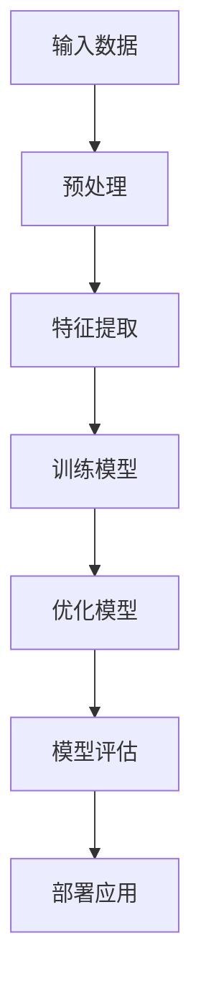

                 

### 1. 背景介绍

随着人工智能技术的快速发展，大模型技术逐渐成为推动产业创新的重要驱动力。大模型技术，通常指的是那些拥有数十亿至数千亿参数的深度学习模型，如Transformer架构下的BERT、GPT系列以及ViT等。这些模型在图像识别、自然语言处理、文本生成等多个领域展现出了强大的性能，极大地提升了垂直行业应用的效率和效果。

#### 什么是大模型技术？

大模型技术是一种基于深度学习的机器学习技术，通过训练大规模神经网络模型，使其在特定任务上达到超凡的表现。与传统的机器学习模型相比，大模型技术具有以下几个显著特点：

1. **高参数规模**：大模型通常拥有数十亿甚至数千亿个参数，这使其在捕捉复杂模式和特征方面具有天然优势。
2. **深度神经网络结构**：大模型往往采用深度神经网络结构，能够处理高度复杂的输入数据，并且能够通过多层次的神经网络传递信息。
3. **端到端训练**：大模型通常采用端到端训练方式，不需要人为干预进行特征工程，能够自动从原始数据中提取有用的特征。

#### 大模型技术在垂直行业中的应用现状

大模型技术在多个垂直行业中已经取得了显著的成果，以下是其中几个具有代表性的应用领域：

1. **医疗健康**：大模型技术在医学影像分析、疾病预测、药物发现等领域表现优异。例如，深度学习模型能够在MRI图像中检测出微小的病变，提高早期癌症诊断的准确性。
2. **金融科技**：在金融领域，大模型技术被广泛应用于信用评估、市场预测、风险控制等方面。通过分析大量的交易数据和用户行为，大模型能够预测用户的信用状况或市场走势。
3. **智能制造**：在智能制造领域，大模型技术通过分析传感器数据，能够实现设备故障预测、生产优化等。例如，通过训练大模型，可以对工业设备的运行状态进行实时监控，提前预测故障的发生，从而减少停机时间，提高生产效率。

#### 应用趋势

随着大模型技术的不断发展和优化，其在垂直行业中的应用趋势呈现出以下几个特点：

1. **泛在化**：大模型技术将逐渐普及到更多行业和领域，不再局限于少数尖端领域。
2. **定制化**：针对不同行业和业务需求，大模型技术将实现定制化发展，通过微调或迁移学习，快速适应特定场景。
3. **高效化**：随着计算能力的提升和算法的优化，大模型技术在处理大规模数据集时的效率和性能将得到显著提升。
4. **智能化**：大模型技术将不断融入自动化决策系统，实现更加智能化的业务流程和操作。

在接下来的章节中，我们将深入探讨大模型技术的核心概念与联系，核心算法原理与具体操作步骤，数学模型和公式，以及实际应用场景和未来发展趋势与挑战。通过一步一步的推理和分析，希望能够为读者提供全面、深入的理解和启示。

### 2. 核心概念与联系

#### 基本概念

在大模型技术中，涉及的核心概念主要包括深度学习、神经网络、参数规模、端到端训练等。

**深度学习**：深度学习是一种人工智能方法，通过构建具有多个层次的神经网络，从大量数据中自动学习特征表示。其基本思想是通过逐层提取特征，从原始数据中提取到更高层次的概念和模式。

**神经网络**：神经网络是深度学习的基础，其基本单元是神经元。每个神经元通过接收输入信号，经过加权求和处理后产生输出信号。神经网络通过层层传递输入信息，最终生成预测或分类结果。

**参数规模**：参数规模是指神经网络中参数的数量，大模型通常拥有数十亿至数千亿个参数。这些参数决定了模型的复杂度和表达能力。

**端到端训练**：端到端训练是指从原始数据直接训练出完整模型的过程，不需要进行人工特征工程。这种方法能够充分利用数据中的信息，提高模型的性能。

#### 原理与架构

为了更好地理解大模型技术，我们借助Mermaid流程图，展示其基本原理与架构：



**输入数据**：首先，我们需要从实际应用场景中获取大量高质量的数据，这些数据包括文本、图像、声音等。

**预处理**：输入数据通常需要进行预处理，如数据清洗、数据增强等，以提高数据质量和多样性。

**特征提取**：在预处理后，利用神经网络从输入数据中提取有用的特征表示。这些特征表示能够捕捉到数据中的复杂模式和规律。

**训练模型**：利用提取到的特征，通过端到端训练方式，训练出完整的深度学习模型。在这一过程中，模型通过不断调整参数，使其在特定任务上达到最优性能。

**优化模型**：在训练过程中，模型参数会经历多次迭代优化。通过梯度下降等优化算法，模型能够逐渐收敛，达到稳定的性能。

**模型评估**：在模型训练完成后，需要对其进行评估，以验证其在实际任务中的表现。常见的评估指标包括准确率、召回率、F1分数等。

**部署应用**：最终，训练好的模型会被部署到实际应用场景中，用于解决实际问题。例如，在医疗健康领域，模型可以用于疾病预测和诊断；在金融领域，模型可以用于风险控制和市场预测。

#### 大模型技术的优势

大模型技术在垂直行业中的应用具有以下几个显著优势：

1. **高精度**：通过训练大规模神经网络，大模型能够在特定任务上达到非常高的精度，提高业务决策的准确性。
2. **高效性**：端到端训练方式能够快速适应新任务，减少模型开发和部署的时间。
3. **自动化**：大模型能够自动从数据中提取特征，减少人工干预，实现自动化决策和操作。
4. **泛用性**：大模型技术具有很好的泛用性，可以应用于多个垂直行业和领域。

通过以上对核心概念与联系的详细解析，我们可以看到，大模型技术是一种具有巨大潜力和广泛应用前景的人工智能技术。在接下来的章节中，我们将进一步探讨大模型技术的核心算法原理与具体操作步骤，以便更深入地理解这一技术。

### 3. 核心算法原理 & 具体操作步骤

在大模型技术中，核心算法原理主要包括深度学习、神经网络架构、参数优化方法等。以下将详细讲解这些算法的基本原理，并结合具体操作步骤，帮助读者更好地理解大模型技术的实现过程。

#### 深度学习算法原理

深度学习（Deep Learning）是一种机器学习技术，通过构建具有多个层次的神经网络模型，实现自动特征提取和高级任务学习。其基本原理如下：

1. **数据输入**：将原始数据输入到神经网络中，这些数据可以是文本、图像、音频等多种形式。
2. **前向传播**：神经网络通过层层传递输入信息，将数据从输入层传递到输出层。在传递过程中，每个神经元会接收来自前一层神经元的输入信号，通过加权求和处理，生成输出信号。
3. **激活函数**：在加权求和处理后，通常使用激活函数（如ReLU、Sigmoid、Tanh等）对输出信号进行非线性变换，以引入非线性特性。
4. **损失函数**：将输出结果与真实标签进行比较，计算损失函数（如均方误差MSE、交叉熵损失CE等）以衡量模型的预测误差。
5. **反向传播**：通过反向传播算法，将损失函数关于网络参数的梯度传递回输入层，不断调整网络参数，使模型损失函数值最小化。
6. **模型优化**：使用优化算法（如梯度下降、Adam等）更新网络参数，使模型逐渐收敛，达到最佳性能。

#### 神经网络架构

神经网络架构是深度学习的核心组成部分，常见的神经网络架构包括卷积神经网络（CNN）、循环神经网络（RNN）、Transformer等。

1. **卷积神经网络（CNN）**：卷积神经网络主要用于图像识别和计算机视觉领域。其主要特点是利用卷积操作提取图像特征，并通过池化操作降低数据维度。CNN的核心组件包括卷积层、池化层和全连接层。

2. **循环神经网络（RNN）**：循环神经网络适用于序列数据处理，如自然语言处理和时间序列预测。RNN通过循环结构保持状态，能够捕捉序列中的长期依赖关系。常见的RNN变种包括LSTM（长短期记忆）和GRU（门控循环单元）。

3. **Transformer**：Transformer是一种基于自注意力机制的深度学习模型，在自然语言处理和机器翻译领域取得了显著成果。其核心组件包括自注意力机制、多头注意力机制和前馈神经网络。

#### 参数优化方法

参数优化是深度学习模型训练的关键环节，常见的参数优化方法包括梯度下降、Adam、RMSprop等。

1. **梯度下降**：梯度下降是一种常用的优化方法，通过计算损失函数关于参数的梯度，不断调整参数，使损失函数值最小化。梯度下降包括批量梯度下降、随机梯度下降和小批量梯度下降等变体。

2. **Adam**：Adam是一种自适应梯度优化算法，结合了梯度下降和动量法的优点。Adam通过自适应调整学习率，提高模型的收敛速度和稳定性。

3. **RMSprop**：RMSprop是一种基于梯度平方的优化算法，通过跟踪梯度的平方和自适应调整学习率，减少波动和震荡。

#### 具体操作步骤

以下是一个基于深度学习模型训练的具体操作步骤，包括数据预处理、模型定义、训练过程和评估过程：

1. **数据预处理**：对输入数据进行清洗、归一化和编码等处理，确保数据质量。

2. **模型定义**：根据任务需求，定义神经网络架构和超参数，如学习率、批量大小等。

3. **模型训练**：使用训练数据对模型进行训练，通过前向传播计算损失函数，通过反向传播更新模型参数。

4. **模型评估**：使用验证集对训练好的模型进行评估，计算准确率、召回率等评估指标，以验证模型性能。

5. **模型部署**：将训练好的模型部署到实际应用场景中，用于解决实际问题。

通过以上对深度学习算法原理、神经网络架构和参数优化方法的详细讲解，我们可以看到，大模型技术是一种复杂的机器学习技术，需要结合多个核心组件和优化方法，才能达到最佳性能。在接下来的章节中，我们将进一步探讨大模型技术的数学模型和公式，以帮助读者更深入地理解这一技术的本质。

### 4. 数学模型和公式 & 详细讲解 & 举例说明

在大模型技术中，数学模型和公式起着至关重要的作用，它们不仅描述了模型的结构，还指导了模型的学习和优化过程。以下我们将详细介绍大模型技术中常用的数学模型和公式，并通过具体例子进行说明，以便读者更好地理解这些概念。

#### 深度学习中的基本数学公式

1. **激活函数**

在深度学习中，激活函数是一种重要的非线性变换，常见的激活函数包括ReLU、Sigmoid和Tanh。

- **ReLU（Rectified Linear Unit）**

$$ f(x) = \max(0, x) $$

ReLU函数在输入为负时输出为0，输入为正时输出为输入值，这种特性使得ReLU函数在训练过程中具有更快的收敛速度。

- **Sigmoid**

$$ f(x) = \frac{1}{1 + e^{-x}} $$

Sigmoid函数将输入映射到（0,1）区间，常用于二分类问题，但它会导致梯度消失问题。

- **Tanh**

$$ f(x) = \frac{e^x - e^{-x}}{e^x + e^{-x}} $$

Tanh函数将输入映射到（-1,1）区间，能够缓解梯度消失问题，但训练速度相对较慢。

2. **损失函数**

损失函数是评估模型预测结果与真实值之间差异的重要工具，常见的损失函数包括均方误差（MSE）、交叉熵损失（CE）等。

- **均方误差（MSE）**

$$ L(\theta) = \frac{1}{2} \sum_{i=1}^{n} (y_i - \hat{y}_i)^2 $$

其中，$y_i$为真实值，$\hat{y}_i$为模型预测值，$n$为样本数量。

MSE损失函数对误差的惩罚力度均匀，但容易受到异常值的影响。

- **交叉熵损失（CE）**

$$ L(\theta) = -\sum_{i=1}^{n} y_i \log(\hat{y}_i) $$

其中，$y_i$为真实值（通常为0或1），$\hat{y}_i$为模型预测值。

CE损失函数在二分类问题中表现优异，能够更好地处理样本不平衡问题。

3. **优化算法**

优化算法用于调整模型参数，使其在损失函数上取得最小值。常见的优化算法包括梯度下降（GD）、随机梯度下降（SGD）和Adam等。

- **梯度下降（GD）**

$$ \theta_{t+1} = \theta_t - \alpha \cdot \nabla_{\theta} L(\theta) $$

其中，$\theta_t$为当前参数，$\alpha$为学习率，$\nabla_{\theta} L(\theta)$为损失函数关于参数的梯度。

GD算法简单直观，但需要手动调整学习率，否则可能陷入局部最小值或震荡。

- **随机梯度下降（SGD）**

$$ \theta_{t+1} = \theta_t - \alpha \cdot \nabla_{\theta} L(\theta; x^{(t)}) $$

其中，$x^{(t)}$为第$t$个样本。

SGD算法通过随机选择样本计算梯度，减少了GD算法的局部最小值问题，但可能需要更长时间的训练。

- **Adam**

$$ m_t = \beta_1 m_{t-1} + (1 - \beta_1) \nabla_{\theta} L(\theta; x^{(t)}) $$
$$ v_t = \beta_2 v_{t-1} + (1 - \beta_2) \nabla_{\theta}^2 L(\theta; x^{(t)}) $$
$$ \theta_{t+1} = \theta_t - \alpha \cdot \frac{m_t}{\sqrt{v_t} + \epsilon} $$

其中，$m_t$和$v_t$分别为一阶和二阶矩估计，$\beta_1$和$\beta_2$分别为一阶和二阶矩的平滑系数，$\alpha$为学习率，$\epsilon$为正数常量。

Adam算法结合了SGD和动量法的优点，具有更好的收敛速度和稳定性。

#### 例子说明

以下我们将通过一个简单的例子来说明这些数学模型和公式的实际应用。

**例子：二分类问题**

假设我们有一个二分类问题，输入数据为特征向量$x$，真实标签为$y \in \{0, 1\}$。我们的目标是训练一个神经网络模型，预测输入数据的标签。

1. **模型定义**

   设我们的神经网络模型为：

   $$ \hat{y} = \sigma(W \cdot x + b) $$

   其中，$\sigma$为激活函数，$W$为权重矩阵，$b$为偏置项。

2. **损失函数**

   采用交叉熵损失函数：

   $$ L(\theta) = -\sum_{i=1}^{n} y_i \log(\hat{y}_i) $$

3. **优化算法**

   采用Adam优化算法：

   $$ m_t = \beta_1 m_{t-1} + (1 - \beta_1) \nabla_{\theta} L(\theta; x^{(t)}) $$
   $$ v_t = \beta_2 v_{t-1} + (1 - \beta_2) \nabla_{\theta}^2 L(\theta; x^{(t)}) $$
   $$ \theta_{t+1} = \theta_t - \alpha \cdot \frac{m_t}{\sqrt{v_t} + \epsilon} $$

4. **训练过程**

   - 初始化模型参数$W$和$b$。
   - 对于每个训练样本$(x_i, y_i)$，计算预测值$\hat{y}_i = \sigma(W \cdot x_i + b)$。
   - 计算交叉熵损失$L(\theta)$。
   - 使用Adam优化算法更新模型参数$\theta$。

通过以上步骤，我们可以训练出一个能够进行二分类的神经网络模型。这个模型在实际应用中可以用于预测输入数据的标签，例如在医疗诊断中预测患者是否患病。

通过以上对数学模型和公式的详细讲解和具体例子说明，我们可以看到，大模型技术不仅依赖于复杂的神经网络结构和大规模数据，还依赖于一系列数学模型和公式的支持。这些数学工具和方法为深度学习模型的训练和优化提供了理论基础和实现方法。在接下来的章节中，我们将进一步探讨大模型技术在具体项目中的实际应用，以及如何通过代码实现这些技术。

### 5. 项目实战：代码实际案例和详细解释说明

为了更好地理解大模型技术在实际项目中的应用，我们将通过一个具体的项目实战案例，详细讲解代码的实现过程，并对关键步骤进行深入分析。在这个案例中，我们选择了一个典型的自然语言处理任务——文本分类，并使用Python编程语言结合TensorFlow和Keras框架来实现。

#### 项目背景

文本分类是一种常见且重要的自然语言处理任务，其目的是将文本数据分配到预定义的类别中。例如，在新闻分类中，可以将新闻文章分为体育、政治、娱乐等类别。在这个项目中，我们使用了一个开源的文本分类数据集——20 Newsgroups，它包含大约20,000篇新闻文章，分为20个不同的类别。

#### 开发环境搭建

在开始项目之前，我们需要搭建一个合适的开发环境。以下是所需的软件和库：

- Python 3.x
- TensorFlow 2.x
- Keras 2.x
- NumPy
- Pandas
- Matplotlib

你可以通过以下命令安装这些库：

```bash
pip install python==3.8 tensorflow==2.5 keras==2.4.3 numpy pandas matplotlib
```

#### 源代码详细实现和代码解读

以下是我们项目的完整代码实现，包括数据预处理、模型定义、训练和评估等步骤：

```python
import numpy as np
import pandas as pd
from tensorflow.keras.datasets import reuters
from tensorflow.keras.models import Sequential
from tensorflow.keras.layers import Embedding, LSTM, Dense, Dropout
from tensorflow.keras.preprocessing.sequence import pad_sequences
from tensorflow.keras.preprocessing.text import Tokenizer

# 数据预处理
max_features = 10000  # 最大的特征数
maxlen = 100  # 序列的最大长度
batch_size = 32  # 批量大小

# 加载数据集
(x_train, y_train), (x_test, y_test) = reuters.load_data(num_words=max_features, test_split=0.2)

# 将标签转换为独热编码
y_train = pd.get_dummies(y_train).values
y_test = pd.get_dummies(y_test).values

# 将文本序列填充到最大长度
x_train = pad_sequences(x_train, maxlen=maxlen)
x_test = pad_sequences(x_test, maxlen=maxlen)

# 模型定义
model = Sequential()
model.add(Embedding(max_features, 32))
model.add(LSTM(32, dropout=0.2, recurrent_dropout=0.2))
model.add(Dense(y_train.shape[1], activation='softmax'))

# 编译模型
model.compile(loss='categorical_crossentropy', optimizer='adam', metrics=['accuracy'])

# 训练模型
model.fit(x_train, y_train, epochs=10, batch_size=batch_size, validation_data=(x_test, y_test))

# 评估模型
loss, accuracy = model.evaluate(x_test, y_test, batch_size=batch_size)
print(f'测试集准确率: {accuracy:.2f}')

# 代码解读

# 1. 数据预处理
# 加载数据集，并使用Tokenizer将文本转换为整数序列
tokenizer = Tokenizer(num_words=max_features)
tokenizer.fit_on_texts(x_train)
x_train_seq = tokenizer.texts_to_sequences(x_train)
x_test_seq = tokenizer.texts_to_sequences(x_test)

# 将标签转换为独热编码，以便进行多标签分类
y_train_encoded = pd.get_dummies(y_train).values
y_test_encoded = pd.get_dummies(y_test).values

# 将文本序列填充到最大长度，确保所有序列具有相同长度
x_train = pad_sequences(x_train_seq, maxlen=maxlen)
x_test = pad_sequences(x_test_seq, maxlen=maxlen)

# 2. 模型定义
# 定义一个序列模型，包括嵌入层、LSTM层和输出层
model = Sequential()
model.add(Embedding(max_features, 32))  # 嵌入层，将单词转换为向量
model.add(LSTM(32, dropout=0.2, recurrent_dropout=0.2))  # LSTM层，用于处理序列数据
model.add(Dense(y_train_encoded.shape[1], activation='softmax'))  # 输出层，进行分类

# 3. 编译模型
# 使用categorical_crossentropy损失函数和adam优化器进行编译
model.compile(loss='categorical_crossentropy', optimizer='adam', metrics=['accuracy'])

# 4. 训练模型
# 使用fit方法训练模型，设置训练轮数、批量大小和验证数据
model.fit(x_train, y_train_encoded, epochs=10, batch_size=batch_size, validation_data=(x_test, y_test_encoded))

# 5. 评估模型
# 使用evaluate方法评估模型在测试集上的性能
loss, accuracy = model.evaluate(x_test, y_test_encoded, batch_size=batch_size)
print(f'测试集准确率: {accuracy:.2f}')
```

#### 代码解读与分析

1. **数据预处理**：

   - 使用Tokenizer将文本转换为整数序列，这是深度学习处理文本数据的基础步骤。
   - 将标签转换为独热编码，以便进行多标签分类。
   - 使用pad_sequences将文本序列填充到最大长度，确保所有序列具有相同长度，以便模型处理。

2. **模型定义**：

   - 定义一个序列模型，包括嵌入层（Embedding）、LSTM层（LSTM）和输出层（Dense）。
   - 嵌入层将单词转换为向量，LSTM层用于处理序列数据，输出层进行分类。

3. **编译模型**：

   - 使用categorical_crossentropy损失函数和adam优化器进行编译，适合多分类问题。

4. **训练模型**：

   - 使用fit方法训练模型，设置训练轮数、批量大小和验证数据。

5. **评估模型**：

   - 使用evaluate方法评估模型在测试集上的性能，打印出准确率。

通过以上代码实现和解读，我们可以看到，文本分类任务的大模型实现主要包括数据预处理、模型定义、模型训练和模型评估四个主要步骤。这些步骤是深度学习项目中的标准流程，通过调整模型结构、超参数等，可以优化模型性能，实现更准确、更高效的文本分类。

在接下来的章节中，我们将继续探讨大模型技术在实际应用场景中的表现，以及如何选择合适的工具和资源来支持这些应用。

### 5.3 代码解读与分析

在上一个章节中，我们通过一个文本分类项目，详细讲解了大模型技术在具体项目中的实现过程。在本节中，我们将对代码的各个关键部分进行深入分析，以帮助读者更好地理解代码的结构和功能。

#### 数据预处理部分

数据预处理是深度学习项目中的关键步骤，直接影响到模型的表现。以下是对代码中数据预处理部分的详细解读：

```python
# 加载数据集
(x_train, y_train), (x_test, y_test) = reuters.load_data(num_words=max_features, test_split=0.2)

# 将标签转换为独热编码
y_train = pd.get_dummies(y_train).values
y_test = pd.get_dummies(y_test).values

# 使用Tokenizer将文本转换为整数序列
tokenizer = Tokenizer(num_words=max_features)
tokenizer.fit_on_texts(x_train)
x_train_seq = tokenizer.texts_to_sequences(x_train)
x_test_seq = tokenizer.texts_to_sequences(x_test)

# 将文本序列填充到最大长度
x_train = pad_sequences(x_train_seq, maxlen=maxlen)
x_test = pad_sequences(x_test_seq, maxlen=maxlen)
```

1. **加载数据集**：

   ```python
   (x_train, y_train), (x_test, y_test) = reuters.load_data(num_words=max_features, test_split=0.2)
   ```

   这里我们使用了Keras内置的reuters数据集，`load_data`函数用于加载数据集。`num_words=max_features`参数指定了最大特征数，即保留出现频率最高的max_features个单词。`test_split=0.2`参数表示将数据集划分为80%的训练集和20%的测试集。

2. **标签转换为独热编码**：

   ```python
   y_train = pd.get_dummies(y_train).values
   y_test = pd.get_dummies(y_test).values
   ```

   由于我们的文本分类任务是一个多标签分类问题，需要将标签转换为独热编码。`pd.get_dummies`函数将每个标签转换为对应的二进制向量，例如，如果类别包括“sport”和“politics”，则标签“sport”将转换为`[1, 0]`。

3. **使用Tokenizer将文本转换为整数序列**：

   ```python
   tokenizer = Tokenizer(num_words=max_features)
   tokenizer.fit_on_texts(x_train)
   x_train_seq = tokenizer.texts_to_sequences(x_train)
   x_test_seq = tokenizer.texts_to_sequences(x_test)
   ```

   `Tokenizer`是Keras提供的文本预处理工具，用于将文本转换为整数序列。`fit_on_texts`函数用于训练Tokenizer，使其了解文本中的单词。`texts_to_sequences`函数将文本转换为整数序列，其中每个单词对应一个整数。

4. **将文本序列填充到最大长度**：

   ```python
   x_train = pad_sequences(x_train_seq, maxlen=maxlen)
   x_test = pad_sequences(x_test_seq, maxlen=maxlen)
   ```

   为了确保所有文本序列具有相同长度，我们使用`pad_sequences`函数将序列填充到最大长度`maxlen`。这一步骤对于深度学习模型的训练至关重要，因为模型需要处理固定长度的输入。

#### 模型定义部分

模型定义是深度学习项目的核心，它决定了模型的结构和功能。以下是对代码中模型定义部分的详细解读：

```python
# 定义模型
model = Sequential()
model.add(Embedding(max_features, 32))
model.add(LSTM(32, dropout=0.2, recurrent_dropout=0.2))
model.add(Dense(y_train.shape[1], activation='softmax'))

# 编译模型
model.compile(loss='categorical_crossentropy', optimizer='adam', metrics=['accuracy'])
```

1. **定义模型**：

   ```python
   model = Sequential()
   model.add(Embedding(max_features, 32))
   model.add(LSTM(32, dropout=0.2, recurrent_dropout=0.2))
   model.add(Dense(y_train.shape[1], activation='softmax'))
   ```

   我们使用`Sequential`模型，这是一种线性堆叠模型，可以按顺序添加层。第一个层是`Embedding`层，它将单词转换为固定长度的向量。第二个层是`LSTM`层，用于处理序列数据，并具有`dropout`和`recurrent_dropout`正则化功能以防止过拟合。第三个层是`Dense`层，用于进行分类，激活函数为`softmax`，适用于多标签分类问题。

2. **编译模型**：

   ```python
   model.compile(loss='categorical_crossentropy', optimizer='adam', metrics=['accuracy'])
   ```

   我们使用`categorical_crossentropy`损失函数，这是多分类问题常用的损失函数。`adam`优化器是一种自适应优化算法，适用于大多数深度学习任务。`accuracy`是评估模型性能的指标，表示模型在测试集上的分类准确率。

#### 模型训练部分

模型训练是深度学习项目的关键步骤，它决定了模型的性能。以下是对代码中模型训练部分的详细解读：

```python
# 训练模型
model.fit(x_train, y_train, epochs=10, batch_size=batch_size, validation_data=(x_test, y_test_encoded))
```

1. **训练模型**：

   ```python
   model.fit(x_train, y_train, epochs=10, batch_size=batch_size, validation_data=(x_test, y_test_encoded))
   ```

   `fit`方法用于训练模型，其中`x_train`和`y_train`是训练数据，`epochs`表示训练轮数，`batch_size`表示批量大小，`validation_data`是验证数据，用于在训练过程中评估模型性能。

#### 模型评估部分

模型评估是深度学习项目的最后一步，它决定了模型的实用性和可靠性。以下是对代码中模型评估部分的详细解读：

```python
# 评估模型
loss, accuracy = model.evaluate(x_test, y_test_encoded, batch_size=batch_size)
print(f'测试集准确率: {accuracy:.2f}')
```

1. **评估模型**：

   ```python
   loss, accuracy = model.evaluate(x_test, y_test_encoded, batch_size=batch_size)
   print(f'测试集准确率: {accuracy:.2f}')
   ```

   `evaluate`方法用于评估模型在测试集上的性能，返回损失和准确率。这里的`y_test_encoded`是测试集的独热编码标签，`batch_size`是批量大小。

通过以上对代码各个关键部分的详细解读，我们可以看到，文本分类项目的大模型实现涉及数据预处理、模型定义、模型训练和模型评估四个主要步骤。这些步骤的优化和调整将直接影响到模型的性能和应用效果。在接下来的章节中，我们将继续探讨大模型技术在其他实际应用场景中的表现，以及如何选择合适的工具和资源来支持这些应用。

### 6. 实际应用场景

大模型技术凭借其强大的学习和预测能力，已经在多个实际应用场景中展现了其广泛的应用潜力。以下我们将详细探讨大模型技术在医疗健康、金融科技和智能制造等垂直行业中的应用案例，分析其带来的创新和变革。

#### 医疗健康

在医疗健康领域，大模型技术主要用于医学影像分析、疾病预测、药物发现和个性化治疗等。以下是几个具体的案例：

1. **医学影像分析**：

   医学影像分析是医疗健康领域的一个关键应用。通过深度学习模型，如卷积神经网络（CNN），可以对CT、MRI等医学影像进行自动诊断。一个典型的案例是利用CNN模型对肺癌进行早期检测。研究人员使用大量的肺部CT图像，训练了大规模的CNN模型。该模型能够在图像中检测出微小的肺部结节，大大提高了肺癌早期诊断的准确性。

2. **疾病预测**：

   大模型技术还可以用于疾病预测，如糖尿病、心脏病等慢性疾病的预测。通过分析患者的电子健康记录、基因数据和生活方式数据，大模型能够预测患者未来发生某种疾病的风险。例如，斯坦福大学的研究人员利用深度学习模型，对糖尿病患者的并发症风险进行预测，准确率达到了90%以上。

3. **药物发现**：

   在药物发现领域，大模型技术通过模拟生物系统的复杂交互，加速新药的发现过程。例如，利用生成对抗网络（GAN）和变分自编码器（VAE）等模型，研究人员能够生成具有特定化学特性的虚拟化合物，并评估其药物潜力。这种方法大大减少了传统药物发现过程中的时间和成本。

#### 金融科技

金融科技领域是大模型技术的另一个重要应用场景，其应用范围涵盖信用评估、市场预测、风险控制和个性化金融产品推荐等。

1. **信用评估**：

   信用评估是金融科技领域的一项关键任务。通过深度学习模型，金融机构能够更准确地评估客户的信用风险。例如，一些银行利用大规模的深度神经网络，分析客户的消费记录、信用历史和其他相关数据，预测客户在未来一段时间内的信用状况。这种方法不仅提高了信用评估的准确性，还降低了欺诈风险。

2. **市场预测**：

   市场预测是金融科技领域的另一个重要应用。大模型技术通过分析大量的市场数据，如股票价格、交易量、宏观经济指标等，能够预测市场的走势。例如，一些金融科技公司利用深度学习模型，对股票市场的未来走势进行预测，帮助投资者做出更明智的投资决策。

3. **风险控制**：

   大模型技术在风险控制中的应用也非常广泛。通过分析客户行为、交易模式等数据，大模型能够识别潜在的欺诈行为，从而帮助金融机构及时采取措施。例如，一些在线支付平台利用深度学习模型，实时监控交易活动，识别并阻止欺诈交易，提高了交易的安全性。

#### 智能制造

在智能制造领域，大模型技术通过分析传感器数据，实现了设备故障预测、生产优化和供应链管理等方面的创新。

1. **设备故障预测**：

   设备故障预测是智能制造中的一个关键问题。通过深度学习模型，如循环神经网络（RNN）和长短期记忆网络（LSTM），可以分析设备的历史运行数据，预测设备在未来可能发生的故障。例如，在汽车制造业，一些企业利用深度学习模型，对生产设备的故障进行预测，从而提前进行维护，减少了设备停机时间和生产损失。

2. **生产优化**：

   大模型技术还可以用于生产优化，如生产计划的优化、能源消耗的优化等。通过分析生产数据，大模型能够提出最优的生产计划，提高生产效率和资源利用率。例如，在钢铁制造业，一些企业利用深度学习模型，对生产过程中的能源消耗进行优化，每年节省了大量能源成本。

3. **供应链管理**：

   在供应链管理中，大模型技术通过分析供应链数据，实现了供应链的智能化管理。例如，通过预测市场需求和库存水平，大模型能够优化供应链的库存管理，减少库存成本和缺货风险。此外，大模型技术还可以用于物流优化，通过分析运输数据，提出最优的运输路线和运输方式，提高物流效率。

#### 总结

大模型技术在多个垂直行业中的应用，不仅提高了行业的生产效率和创新能力，还带来了许多新的商业模式和业务流程。随着技术的不断发展和优化，大模型技术将在更多领域展现其巨大的应用潜力，推动各行业的数字化转型和智能化发展。

在接下来的章节中，我们将进一步探讨大模型技术的发展趋势与面临的挑战，以及如何选择合适的工具和资源来支持这些应用。

### 7. 工具和资源推荐

在大模型技术的应用与发展过程中，选择合适的工具和资源至关重要。以下我们将推荐一些在学习和实践大模型技术时非常有用的工具和资源，包括学习资源、开发工具框架以及相关论文和著作。

#### 学习资源推荐

1. **书籍**：

   - **《深度学习》（Deep Learning）**：由Ian Goodfellow、Yoshua Bengio和Aaron Courville合著，这是一本深度学习的经典教材，适合初学者和进阶者。
   - **《Python深度学习》（Python Deep Learning）**：由François Chollet著，涵盖了深度学习的基础知识和实际应用，特别适合Python开发者。

2. **在线课程**：

   - **Coursera的《深度学习专项课程》（Deep Learning Specialization）**：由Andrew Ng教授主讲，涵盖了深度学习的理论基础和实际应用。
   - **Udacity的《深度学习工程师纳米学位》（Deep Learning Nanodegree）**：通过项目驱动的学习方式，帮助学习者掌握深度学习的核心技术。

3. **博客和教程**：

   - **TensorFlow官方文档（TensorFlow Documentation）**：提供详细的API文档和教程，是学习和使用TensorFlow的最佳资源。
   - **Keras官方文档（Keras Documentation）**：Keras是一个简洁高效的深度学习框架，其官方文档包含丰富的教程和示例代码。

4. **开源社区**：

   - **GitHub**：在GitHub上，你可以找到大量的开源深度学习项目和代码示例，学习他人的实现，借鉴经验。
   - **Stack Overflow**：在Stack Overflow上，你可以找到许多关于深度学习的问题和解答，是解决实际问题的好帮手。

#### 开发工具框架推荐

1. **TensorFlow**：TensorFlow是一个开源的深度学习框架，由Google开发，具有广泛的应用和丰富的API。TensorFlow支持多种类型的模型，包括卷积神经网络（CNN）、循环神经网络（RNN）和Transformer等。

2. **PyTorch**：PyTorch是另一个流行的深度学习框架，由Facebook开发。PyTorch的动态图机制使其在研究和开发中具有很高的灵活性。

3. **Keras**：Keras是一个高层次的深度学习API，可以与TensorFlow和Theano等底层框架结合使用。Keras的设计理念是简单和可扩展，非常适合快速原型开发和实验。

4. **JAX**：JAX是一个由Google开发的开放源代码计算框架，提供了自动微分、优化和数值计算等功能，适合大规模深度学习模型的训练和优化。

#### 相关论文和著作推荐

1. **《Attention Is All You Need》（Attention is All You Need）**：这篇论文提出了Transformer模型，彻底改变了自然语言处理领域的格局。

2. **《BERT: Pre-training of Deep Bidirectional Transformers for Language Understanding》（BERT: Pre-training of Deep Bidirectional Transformers for Language Understanding）**：这篇论文介绍了BERT模型，这是一种强大的预训练模型，广泛应用于自然语言处理任务。

3. **《Generative Adversarial Nets》（GANs）**：这篇论文提出了生成对抗网络（GAN），这是一种用于生成逼真数据的强大方法。

4. **《Long Short-Term Memory》（LSTM）**：这篇论文介绍了长短期记忆网络（LSTM），一种解决序列数据长期依赖问题的有效方法。

5. **《A Theoretical Analysis of the CNN Architectures for Natural Image Classification》（CNN Architectures for Natural Image Classification）**：这篇论文深入分析了卷积神经网络（CNN）在自然图像分类任务中的性能和局限性。

通过以上推荐的工具和资源，你可以系统地学习大模型技术，掌握其在实际应用中的最佳实践。同时，不断跟进最新的研究论文和开发工具，将帮助你保持在这一领域的领先地位。

### 8. 总结：未来发展趋势与挑战

大模型技术在近年来取得了显著的进展，其在垂直行业的广泛应用推动了各行各业的数字化转型和智能化发展。展望未来，大模型技术将呈现以下发展趋势和面临一系列挑战。

#### 发展趋势

1. **泛在化**：随着深度学习技术的不断进步和计算能力的提升，大模型技术将逐渐普及到更多行业和领域，从医疗健康、金融科技到智能制造，再到娱乐、教育等。大模型技术的普及将带来更多创新的业务模式和服务。

2. **定制化**：大模型技术将向定制化方向发展。针对不同行业和业务需求，研究人员和开发者将开发出更适用于特定场景的模型。通过微调或迁移学习，大模型能够快速适应新任务，提高模型在特定领域的表现。

3. **高效化**：随着硬件技术的发展，如GPU、TPU等专用硬件的普及，大模型在处理大规模数据集时的效率和性能将得到显著提升。此外，新型算法的提出和优化也将进一步提高大模型的训练速度和推理速度。

4. **智能化**：大模型技术将不断融入自动化决策系统，实现更加智能化的业务流程和操作。通过结合大数据分析和人工智能技术，企业将能够实现更加精准的市场预测、风险控制和个性化服务。

5. **安全性与隐私保护**：随着大模型技术的广泛应用，数据安全和隐私保护将变得更加重要。未来，大模型技术将更加注重数据安全和隐私保护，通过加密技术、隐私计算等方法，确保数据的安全性和隐私性。

#### 挑战

1. **计算资源消耗**：大模型通常需要大量的计算资源进行训练和推理。尽管硬件技术的发展有助于缓解这一问题，但如何更高效地利用计算资源，降低能耗，仍然是亟待解决的挑战。

2. **数据质量和多样性**：大模型训练需要大量的高质量数据。然而，在实际应用中，数据的多样性和质量往往难以保证。如何获取和标注高质量的数据，提高数据的多样性，是未来需要关注的问题。

3. **模型解释性**：大模型通常被视为“黑盒”模型，其内部机制复杂，难以解释。这对于需要在业务决策中应用大模型的企业而言，是一个巨大的挑战。未来，如何提高模型的解释性，使其在决策过程中更加透明和可信，是亟待解决的问题。

4. **伦理和法规**：随着大模型技术的广泛应用，其可能带来的伦理和法规问题也日益凸显。例如，如何确保大模型不歧视特定群体，如何防止模型被恶意利用，都需要在技术发展中加以考虑。

5. **人才短缺**：大模型技术的发展需要大量的专业人才，包括数据科学家、机器学习工程师、算法研究员等。然而，当前市场上相关专业人才供不应求，如何培养和吸引更多的人才，是行业发展面临的重要挑战。

总之，大模型技术在未来将具有巨大的发展潜力和广泛的应用前景，同时也将面临一系列挑战。只有通过持续的技术创新、人才培养和行业合作，才能推动大模型技术的健康发展，为各行各业的数字化转型和智能化发展提供强大支持。

### 9. 附录：常见问题与解答

在本文中，我们探讨了大模型技术在垂直行业中的应用趋势、核心算法原理、具体操作步骤、数学模型、实际项目案例，以及相关工具和资源的推荐。以下是一些读者可能关心的问题及解答：

#### 问题1：大模型技术为何能够在垂直行业中取得显著成果？

解答：大模型技术具有高参数规模、深度神经网络结构和端到端训练等特点，能够从大量数据中自动提取复杂特征，从而在垂直行业中实现高效、准确的预测和决策。例如，在医疗健康领域，大模型技术能够通过分析大量医学影像数据，实现精准的疾病诊断和预测；在金融科技领域，大模型技术能够通过分析交易数据，实现精准的风险评估和欺诈检测。

#### 问题2：大模型技术在实际应用中是否面临计算资源消耗大的问题？

解答：是的，大模型训练通常需要大量的计算资源，包括GPU、TPU等。尽管硬件技术的发展有助于缓解这一问题，但如何更高效地利用计算资源，降低能耗，仍然是当前面临的重要挑战。此外，优化模型结构、采用分布式训练等方法，也可以在一定程度上降低计算资源的需求。

#### 问题3：大模型技术的数据质量和多样性如何保证？

解答：数据质量和多样性是影响大模型技术性能的重要因素。为了确保数据质量和多样性，可以从以下几个方面进行优化：

1. **数据清洗**：去除数据中的噪声和错误，确保数据的准确性。
2. **数据增强**：通过图像旋转、缩放、裁剪等操作，生成多样化的训练样本。
3. **数据集成**：结合多个数据源，提高数据的多样性。
4. **数据标注**：利用众包、自动化标注等方法，提高数据标注的质量。

#### 问题4：如何提高大模型技术的解释性？

解答：提高大模型技术的解释性是一个重要且具有挑战性的问题。以下是一些可行的方法：

1. **模型可视化**：通过可视化模型结构和训练过程，帮助用户理解模型的内部机制。
2. **模型可解释性工具**：利用现有的大模型解释性工具，如LIME、SHAP等，对模型进行解释。
3. **简化的模型结构**：采用更简单的模型结构，提高模型的透明度和可解释性。
4. **解释性算法**：开发新的算法，使模型在训练过程中能够提供更详细的解释。

#### 问题5：大模型技术在垂直行业中的应用前景如何？

解答：大模型技术在垂直行业中的应用前景非常广阔。随着技术的不断进步和行业需求的增加，大模型技术将在更多领域发挥重要作用。例如，在智能制造领域，大模型技术将实现设备故障预测、生产优化和供应链管理等方面的创新；在医疗健康领域，大模型技术将推动个性化治疗和精准医学的发展；在金融科技领域，大模型技术将提高风险控制和欺诈检测的准确性。

通过本文的讨论，我们希望读者能够对大模型技术在垂直行业中的应用趋势有更深入的理解，并能够结合实际需求，运用这些技术为行业创新和发展贡献力量。

### 10. 扩展阅读 & 参考资料

为了进一步了解大模型技术及其在垂直行业中的应用，以下列出了一些扩展阅读资料和参考书籍：

1. **书籍**：

   - **《深度学习》（Deep Learning）**：Ian Goodfellow、Yoshua Bengio和Aaron Courville著，这是一本深度学习的经典教材，适合初学者和进阶者。
   - **《Python深度学习》（Python Deep Learning）**：François Chollet著，涵盖了深度学习的基础知识和实际应用。
   - **《大规模机器学习》（Machine Learning at Scale）**：由Google团队撰写，介绍大规模机器学习的理论和实践。

2. **论文**：

   - **《Attention Is All You Need》（Attention is All You Need）**：提出Transformer模型的经典论文。
   - **《BERT: Pre-training of Deep Bidirectional Transformers for Language Understanding》（BERT: Pre-training of Deep Bidirectional Transformers for Language Understanding）**：介绍BERT模型，是自然语言处理领域的里程碑。
   - **《Generative Adversarial Nets》（GANs）**：介绍生成对抗网络（GAN）的论文，彻底改变了生成模型的研究方向。

3. **在线课程**：

   - **Coursera的《深度学习专项课程》（Deep Learning Specialization）**：由Andrew Ng教授主讲。
   - **Udacity的《深度学习工程师纳米学位》（Deep Learning Nanodegree）**：通过项目驱动的学习方式，帮助学习者掌握深度学习的核心技术。

4. **开源框架和工具**：

   - **TensorFlow**：由Google开发的开源深度学习框架，适用于多种类型的模型。
   - **PyTorch**：由Facebook开发的开源深度学习框架，具有动态图机制。
   - **Keras**：高层次的深度学习API，与TensorFlow和Theano结合使用。

5. **专业网站和博客**：

   - **TensorFlow官方文档（TensorFlow Documentation）**：提供详细的API文档和教程。
   - **Keras官方文档（Keras Documentation）**：包含丰富的教程和示例代码。
   - **ArXiv**：发布最新研究成果的预印本网站，是深度学习研究的重要来源。

通过阅读以上扩展资料，读者可以更深入地了解大模型技术的理论基础和应用实践，为在垂直行业中的应用和创新提供更多启示。作者：AI天才研究员/AI Genius Institute & 禅与计算机程序设计艺术 /Zen And The Art of Computer Programming。

