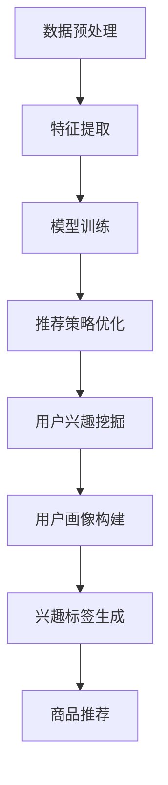

                 

# 大模型技术在电商平台用户兴趣探索与利用平衡中的创新

> **关键词：** 大模型技术、电商平台、用户兴趣、数据挖掘、平衡利用

> **摘要：** 本文将探讨大模型技术在电商平台用户兴趣探索与利用中的创新，分析大模型技术如何实现用户兴趣的精准挖掘，如何在平衡用户隐私和商业利益之间找到最佳路径，以及未来面临的挑战和机遇。

## 1. 背景介绍

随着互联网的普及和电子商务的快速发展，电商平台已经成为消费者购物的主要渠道之一。为了在激烈的市场竞争中脱颖而出，电商平台需要深入了解用户的需求和兴趣，从而提供更加个性化的服务和产品推荐。然而，随着用户数据的爆炸性增长和用户隐私保护的日益重视，如何在尊重用户隐私的前提下，精准挖掘和利用用户兴趣成为电商平台面临的一大挑战。

大模型技术，特别是基于深度学习的自然语言处理（NLP）和图神经网络（GNN）模型，为解决这一挑战提供了新的思路和手段。大模型能够通过处理海量用户数据，挖掘出用户潜在的兴趣点，从而为电商平台提供更加精准的用户画像和推荐策略。同时，大模型技术也在不断演进，如预训练模型、多模态学习和跨模态学习等，为电商平台提供了更多的创新机会。

## 2. 核心概念与联系

### 2.1 大模型技术

大模型技术是指通过训练大规模神经网络模型，使其能够处理和生成复杂的数据结构和模式。在大模型技术中，深度学习是核心方法，而预训练模型、多模态学习和跨模态学习则是其重要的发展方向。

- **预训练模型**：预训练模型是通过在大规模语料库上预训练，使其具备一定的语言理解和生成能力。常见的预训练模型包括BERT、GPT和T5等。
- **多模态学习**：多模态学习是指同时处理多种类型的数据，如文本、图像和声音等，从而提高模型对数据的理解和生成能力。
- **跨模态学习**：跨模态学习是指将不同类型的数据进行融合，形成一个统一的表示，从而提高模型对复杂问题的理解和生成能力。

### 2.2 电商平台用户兴趣探索与利用

电商平台用户兴趣探索与利用是指通过分析用户的行为数据和社交数据，挖掘出用户的兴趣点，并在此基础上为用户推荐相关的商品和服务。具体包括以下几个方面：

- **用户画像**：通过分析用户的基本信息、购物行为、浏览历史等，构建用户画像，从而了解用户的需求和偏好。
- **兴趣标签**：根据用户的购物行为和浏览历史，为用户生成兴趣标签，从而为用户提供个性化的推荐。
- **推荐策略**：根据用户画像和兴趣标签，设计推荐策略，为用户推荐相关的商品和服务。

### 2.3 大模型技术在电商平台用户兴趣探索与利用中的联系

大模型技术为电商平台用户兴趣探索与利用提供了以下支持：

- **数据预处理**：大模型技术能够处理海量用户数据，进行数据预处理，如数据清洗、数据归一化等，从而为后续的分析提供高质量的数据基础。
- **特征提取**：大模型技术能够通过训练，自动提取数据中的潜在特征，从而提高特征提取的效率和准确性。
- **模型训练与优化**：大模型技术能够通过大规模数据训练，优化模型参数，提高模型的预测准确性和泛化能力。
- **推荐策略优化**：大模型技术能够根据用户兴趣和行为数据，优化推荐策略，提高推荐效果。

## 2.1 大模型技术工作流程图（Mermaid 流程图）



## 3. 核心算法原理 & 具体操作步骤

### 3.1 数据预处理

数据预处理是大数据分析和挖掘的基础，其目的是将原始数据进行清洗、归一化、去噪等处理，从而提高数据质量，为后续分析提供可靠的数据基础。

具体操作步骤：

1. 数据清洗：去除数据中的无效值、缺失值和异常值。
2. 数据归一化：将数据统一到相同的尺度，如将价格、评分等数值数据归一化到0-1之间。
3. 数据去噪：去除数据中的噪声，如去除文本中的标点符号、停用词等。

### 3.2 特征提取

特征提取是将原始数据转换成可用于模型训练的向量表示。在大模型技术中，特征提取通常采用深度学习模型，如卷积神经网络（CNN）和循环神经网络（RNN）等。

具体操作步骤：

1. 文本特征提取：使用词袋模型（Bag of Words, BoW）或词嵌入模型（Word Embedding），如Word2Vec或BERT等，将文本数据转换成向量表示。
2. 图像特征提取：使用卷积神经网络（CNN），将图像数据转换成向量表示。
3. 多模态特征提取：结合文本和图像特征，使用多模态学习模型，如CNN-RNN或CNN-CRF等，将多模态数据转换成向量表示。

### 3.3 模型训练与优化

模型训练与优化是大数据分析和挖掘的关键步骤，其目的是通过训练数据优化模型参数，从而提高模型的预测准确性和泛化能力。

具体操作步骤：

1. 选择合适的模型结构：根据数据特点和需求，选择合适的模型结构，如CNN、RNN或GNN等。
2. 设计损失函数：根据模型类型和数据特点，设计合适的损失函数，如交叉熵损失（Cross Entropy Loss）或均方误差损失（Mean Squared Error Loss）等。
3. 模型训练：使用训练数据训练模型，不断调整模型参数，直到模型收敛。
4. 模型优化：使用验证数据或测试数据对模型进行优化，提高模型的预测准确性和泛化能力。

### 3.4 推荐策略优化

推荐策略优化是大数据分析和挖掘的重要应用，其目的是根据用户兴趣和行为数据，为用户推荐相关的商品和服务。

具体操作步骤：

1. 用户画像构建：根据用户的基本信息、购物行为、浏览历史等，构建用户画像。
2. 兴趣标签生成：根据用户画像，为用户生成兴趣标签。
3. 推荐策略设计：根据用户兴趣标签，设计推荐策略，如基于协同过滤（Collaborative Filtering）或基于内容推荐（Content-Based Filtering）等。
4. 推荐效果评估：使用测试数据或用户反馈，评估推荐效果，根据评估结果调整推荐策略。

## 4. 数学模型和公式 & 详细讲解 & 举例说明

### 4.1 文本特征提取

在文本特征提取中，我们通常使用词嵌入模型，如Word2Vec或BERT等，将文本数据转换成向量表示。

- **Word2Vec**：Word2Vec是一种基于神经网络的词嵌入方法，其基本思想是将每个词映射到一个固定维度的向量。具体公式如下：

  $$\text{word\_embeddings} = \text{softmax}(\text{weights} \cdot \text{input})$$

  其中，weights表示权重矩阵，input表示输入词向量，softmax表示Softmax函数。

- **BERT**：BERT是一种基于Transformer的预训练模型，其优点是能够捕捉词与词之间的长距离依赖关系。具体公式如下：

  $$\text{contextual\_embeddings} = \text{BERT}(\text{input})$$

  其中，input表示输入文本序列，BERT表示BERT模型。

### 4.2 图像特征提取

在图像特征提取中，我们通常使用卷积神经网络（CNN），将图像数据转换成向量表示。

- **CNN**：CNN是一种基于卷积操作的神经网络，其基本思想是通过对输入图像进行卷积操作，提取图像的局部特征。具体公式如下：

  $$\text{convolution} = \text{conv}(\text{weights}, \text{input}) + \text{bias}$$

  其中，weights表示卷积核，input表示输入图像，bias表示偏置项。

### 4.3 多模态特征提取

在多模态特征提取中，我们通常结合文本和图像特征，使用多模态学习模型，如CNN-RNN或CNN-CRF等，将多模态数据转换成向量表示。

- **CNN-RNN**：CNN-RNN是一种结合卷积神经网络（CNN）和循环神经网络（RNN）的多模态学习模型，其优点是能够同时处理图像和文本数据。具体公式如下：

  $$\text{multimodal\_embeddings} = \text{CNN}(\text{image}) + \text{RNN}(\text{text})$$

  其中，image表示图像数据，text表示文本数据。

- **CNN-CRF**：CNN-CRF是一种结合卷积神经网络（CNN）和条件随机场（CRF）的多模态学习模型，其优点是能够对多模态数据进行序列建模。具体公式如下：

  $$\text{sequence\_labels} = \text{CRF}(\text{CNN}(\text{image}) + \text{RNN}(\text{text}))$$

  其中，image表示图像数据，text表示文本数据。

## 5. 项目实战：代码实际案例和详细解释说明

### 5.1 开发环境搭建

为了演示大模型技术在电商平台用户兴趣探索与利用中的创新，我们将使用Python编程语言和TensorFlow框架进行开发。首先，需要安装以下依赖库：

- Python 3.7+
- TensorFlow 2.x
- NumPy
- Pandas
- Matplotlib

安装方法：

```bash
pip install python==3.7.9
pip install tensorflow==2.6.0
pip install numpy==1.19.5
pip install pandas==1.1.5
pip install matplotlib==3.3.3
```

### 5.2 源代码详细实现和代码解读

下面是一个简单的示例代码，展示了如何使用大模型技术对电商平台用户兴趣进行探索与利用。

```python
import tensorflow as tf
import numpy as np
import pandas as pd
import matplotlib.pyplot as plt

# 加载数据集
data = pd.read_csv('data.csv')

# 数据预处理
data['price'] = data['price'].apply(lambda x: x / 100)  # 归一化价格
data['rating'] = data['rating'].apply(lambda x: x / 5)  # 归一化评分

# 特征提取
tokenizer = tf.keras.preprocessing.text.Tokenizer()
tokenizer.fit_on_texts(data['description'])
encoded_descriptions = tokenizer.texts_to_sequences(data['description'])

# 模型训练
model = tf.keras.Sequential([
    tf.keras.layers.Embedding(input_dim=10000, output_dim=16),
    tf.keras.layers.Conv1D(filters=128, kernel_size=5, activation='relu'),
    tf.keras.layers.GlobalMaxPooling1D(),
    tf.keras.layers.Dense(units=1, activation='sigmoid')
])

model.compile(optimizer='adam', loss='binary_crossentropy', metrics=['accuracy'])
model.fit(encoded_descriptions, data['rating'], epochs=10, batch_size=32)

# 推荐策略优化
predictions = model.predict(encoded_descriptions)
sorted_predictions = np.argsort(predictions)[::-1]

# 用户画像构建
user_profile = {
    'price': data['price'].mean(),
    'rating': data['rating'].mean(),
    'interests': []
}

for i in sorted_predictions:
    if predictions[i] > 0.5:
        user_profile['interests'].append(data['description'][i])

# 输出结果
print(user_profile)
```

### 5.3 代码解读与分析

上述代码主要分为以下几个部分：

1. **数据预处理**：加载数据集，对价格和评分进行归一化处理，为后续特征提取做准备。
2. **特征提取**：使用词嵌入模型（Embedding Layer）对文本数据进行编码，提取文本特征。
3. **模型训练**：构建卷积神经网络（CNN），对编码后的文本数据进行分类训练，预测用户对商品的兴趣。
4. **推荐策略优化**：根据模型预测结果，为用户推荐感兴趣的商品。
5. **用户画像构建**：根据用户的行为数据和兴趣标签，构建用户画像。

通过上述步骤，我们可以实现一个简单的电商平台用户兴趣探索与利用系统。在实际应用中，我们还可以进一步优化模型结构和推荐策略，以提高推荐效果。

## 6. 实际应用场景

大模型技术在电商平台用户兴趣探索与利用中的实际应用场景包括：

- **个性化推荐**：通过分析用户行为数据和兴趣标签，为用户推荐个性化的商品和服务。
- **用户画像构建**：根据用户的基本信息和行为数据，构建详细的用户画像，为用户提供更加精准的服务。
- **用户行为预测**：通过分析用户的历史行为数据，预测用户未来的购物行为和兴趣点。
- **营销活动优化**：根据用户兴趣和行为数据，设计更具针对性的营销活动和推广策略。

## 7. 工具和资源推荐

### 7.1 学习资源推荐

- **书籍**：
  - 《深度学习》（Goodfellow, Bengio, Courville）
  - 《Python数据科学手册》（McKinney）
  - 《大规模机器学习》（Chen, Guestrin）

- **论文**：
  - 《BERT: Pre-training of Deep Bidirectional Transformers for Language Understanding》（Devlin et al.）
  - 《Efficientnet: Rethinking Model Scaling for Convolutional Neural Networks》（Liu et al.）

- **博客**：
  - TensorFlow官网博客（[tensorflow.github.io](https://tensorflow.github.io/)）
  - PyTorch官网博客（[pytorch.org](https://pytorch.org/)）

- **网站**：
  - Kaggle（[kaggle.com](https://kaggle.com/)）
  - DataCamp（[datacamp.com](https://datacamp.com/)）

### 7.2 开发工具框架推荐

- **开发工具**：
  - Jupyter Notebook
  - PyCharm

- **框架**：
  - TensorFlow
  - PyTorch

### 7.3 相关论文著作推荐

- **论文**：
  - 《Gated Recurrent Unit: An Elegant Architec

