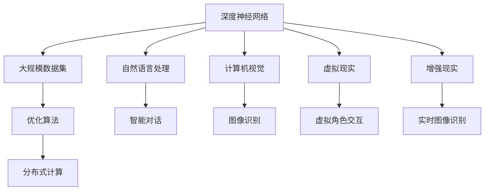

                 

# 大模型技术的元宇宙应用

## 关键词
- 大模型技术
- 元宇宙
- 人工智能
- 自然语言处理
- 计算机视觉
- 虚拟现实
- 增强现实

## 摘要

本文将深入探讨大模型技术在元宇宙应用中的核心作用和实际应用案例。首先，我们将简要介绍大模型技术的基本概念和发展背景。接着，我们将重点分析大模型技术在元宇宙中的核心应用，包括自然语言处理、计算机视觉、虚拟现实和增强现实等方面。此外，本文还将探讨大模型技术在元宇宙中的实际应用案例，并提供一系列开发工具和资源推荐。最后，我们将总结大模型技术在元宇宙中的应用前景，以及面临的挑战和未来发展趋势。

## 1. 背景介绍

### 大模型技术的基本概念

大模型技术是指使用大规模数据集和强大的计算资源来训练深度神经网络模型的方法。这些模型通常包含数亿甚至数十亿个参数，能够模拟人类的思维过程，从而实现复杂的任务，如图像识别、自然语言处理、机器翻译等。

大模型技术的发展始于20世纪90年代，随着计算机硬件性能的提升和互联网的普及，大规模数据集的获取变得相对容易，从而推动了深度学习技术的快速发展。近年来，随着神经网络架构的改进和优化，大模型技术取得了显著的突破，如GPT-3、BERT、ViT等模型，已经在各个领域取得了令人瞩目的成果。

### 元宇宙的兴起

元宇宙是指一个由虚拟世界组成的互联网生态系统，用户可以在其中创建、交互和体验各种虚拟场景。元宇宙的概念最早可以追溯到1992年的《虚拟现实学报》，近年来随着虚拟现实（VR）和增强现实（AR）技术的快速发展，元宇宙逐渐成为人们关注的热点。

元宇宙的兴起带来了巨大的市场潜力，预计到2025年，全球元宇宙市场规模将突破万亿美元。同时，元宇宙的发展也对人工智能技术提出了更高的要求，特别是大模型技术在其中的应用。

### 大模型技术在元宇宙中的应用

大模型技术在元宇宙中的应用主要体现在以下几个方面：

1. **自然语言处理（NLP）**：通过大模型技术，可以实现智能对话、语音识别、机器翻译等功能，为元宇宙中的用户交互提供便利。
2. **计算机视觉**：大模型技术在图像识别、目标检测、图像生成等方面具有显著优势，可以用于元宇宙中的虚拟物体识别、场景生成等。
3. **虚拟现实（VR）**：大模型技术可以用于虚拟角色的生成和交互，提高虚拟现实体验的真实感。
4. **增强现实（AR）**：大模型技术在AR中的应用包括实时图像识别、物体追踪等，可以增强现实世界的交互体验。

## 2. 核心概念与联系

### 大模型技术的核心概念

大模型技术的核心概念包括：

1. **深度神经网络（DNN）**：深度神经网络是构建大模型的基础，通过多层非线性变换，实现对数据的抽象和表示。
2. **大规模数据集**：大模型需要使用大规模数据集进行训练，以提高模型的泛化能力和准确性。
3. **优化算法**：大模型训练过程中需要使用高效的优化算法，如梯度下降、Adam等，以加快收敛速度。
4. **分布式计算**：大模型训练需要大量的计算资源，分布式计算可以充分利用多台计算机的计算能力，提高训练效率。

### 元宇宙的核心概念

元宇宙的核心概念包括：

1. **虚拟世界**：元宇宙中的虚拟世界是由计算机生成的三维空间，用户可以在其中进行交互和体验。
2. **用户交互**：用户可以通过虚拟现实（VR）或增强现实（AR）设备与元宇宙进行交互。
3. **社交互动**：元宇宙中的用户可以与其他用户进行社交互动，如聊天、组队、交易等。
4. **经济体系**：元宇宙中存在一个完整的经济体系，用户可以通过虚拟货币进行交易和投资。

### 大模型技术与元宇宙的联系

大模型技术与元宇宙之间存在紧密的联系：

1. **智能交互**：大模型技术可以用于实现元宇宙中的智能交互，如智能对话、语音识别等。
2. **场景生成**：大模型技术可以用于生成元宇宙中的场景和物体，提高虚拟现实体验的真实感。
3. **内容创作**：大模型技术可以用于辅助元宇宙中的内容创作，如图像生成、音乐创作等。
4. **经济模型**：大模型技术可以用于构建元宇宙中的经济模型，如虚拟货币交易、智能合约等。

## 2.1 大模型技术的核心概念原理和架构的 Mermaid 流程图



## 3. 核心算法原理 & 具体操作步骤

### 3.1 自然语言处理（NLP）

自然语言处理（NLP）是人工智能领域的一个重要分支，它涉及计算机和人类语言之间的交互。大模型技术在NLP中的应用主要体现在语言模型和文本生成等方面。

#### 3.1.1 语言模型

语言模型是一种概率模型，它用于预测下一个单词或字符的概率。大模型技术在语言模型中的核心算法是循环神经网络（RNN）和其变种，如长短期记忆网络（LSTM）和门控循环单元（GRU）。这些算法能够处理变长的序列数据，并捕捉序列中的长期依赖关系。

#### 具体操作步骤：

1. 数据预处理：对语料库进行清洗和分词，将文本转换为单词或字符的序列。
2. 模型训练：使用预处理的语料库训练语言模型，通过最大化负对数似然损失函数优化模型参数。
3. 模型评估：使用测试集评估模型的性能，如准确率、损失函数等。
4. 模型应用：使用训练好的语言模型进行文本生成，如自动摘要、机器翻译等。

### 3.2 计算机视觉

计算机视觉是人工智能领域的一个分支，它涉及计算机对图像和视频的理解和处理。大模型技术在计算机视觉中的应用主要体现在图像识别、目标检测、图像生成等方面。

#### 3.2.1 图像识别

图像识别是指计算机对图像中的物体进行识别和分类。大模型技术在图像识别中的核心算法是卷积神经网络（CNN）。

#### 具体操作步骤：

1. 数据预处理：对图像进行归一化、裁剪、缩放等处理，将图像转换为神经网络可处理的格式。
2. 模型训练：使用预处理的图像数据训练卷积神经网络，通过最大化分类准确率优化模型参数。
3. 模型评估：使用测试集评估模型的性能，如准确率、召回率等。
4. 模型应用：使用训练好的模型进行图像识别任务，如人脸识别、物体检测等。

### 3.3 虚拟现实（VR）

虚拟现实（VR）是一种通过计算机生成的三维虚拟环境，用户可以通过VR设备进行沉浸式体验。大模型技术在虚拟现实中的应用主要体现在虚拟角色交互、场景生成等方面。

#### 3.3.1 虚拟角色交互

虚拟角色交互是指用户与虚拟角色之间的互动。大模型技术在虚拟角色交互中的核心算法是生成对抗网络（GAN）。

#### 具体操作步骤：

1. 数据预处理：对虚拟角色数据集进行清洗和归一化，将角色数据转换为神经网络可处理的格式。
2. 模型训练：使用预处理的虚拟角色数据训练生成对抗网络，通过最大化生成器与判别器的对抗性优化模型参数。
3. 模型评估：使用测试集评估模型的性能，如生成角色的质量、交互的自然度等。
4. 模型应用：使用训练好的模型生成虚拟角色，并在虚拟现实场景中进行交互。

### 3.4 增强现实（AR）

增强现实（AR）是一种将虚拟信息叠加到现实世界中的技术。大模型技术在增强现实中的应用主要体现在实时图像识别、物体追踪等方面。

#### 3.4.1 实时图像识别

实时图像识别是指计算机对实时捕获的图像进行识别和分类。大模型技术在实时图像识别中的核心算法是卷积神经网络（CNN）。

#### 具体操作步骤：

1. 数据预处理：对实时捕获的图像进行预处理，如缩放、裁剪、归一化等。
2. 模型训练：使用预处理的图像数据训练卷积神经网络，通过最大化分类准确率优化模型参数。
3. 模型评估：使用测试集评估模型的性能，如准确率、响应时间等。
4. 模型应用：使用训练好的模型进行实时图像识别，如物体识别、场景分类等。

## 4. 数学模型和公式 & 详细讲解 & 举例说明

### 4.1 自然语言处理（NLP）

#### 语言模型

语言模型是一种概率模型，它用于预测下一个单词或字符的概率。大模型技术中常用的语言模型是循环神经网络（RNN）。

#### 数学模型

假设我们有一个语言模型，它由一个RNN组成，其中每个时间步的输出是当前单词的概率分布。给定一个输入序列 \( x_1, x_2, ..., x_T \)，其中 \( x_t \) 是时间步 \( t \) 的输入单词，我们可以使用以下公式计算语言模型在时间步 \( t \) 的输出概率分布：

\[ P(y_t | x_1, x_2, ..., x_{t-1}) = \sigma(W_{y}^T \cdot [h_{t-1}; x_t] + b_y) \]

其中，\( h_{t-1} \) 是RNN在时间步 \( t-1 \) 的隐藏状态，\( W_{y} \) 是输出层权重矩阵，\( b_y \) 是输出层偏置，\( \sigma \) 是softmax函数。

#### 举例说明

假设我们有一个简化的语言模型，它只有一个隐藏层和一个输出层，隐藏层维度为10，输出层维度为5。给定一个输入序列 “I am learning NLP”，我们可以使用以下步骤计算语言模型在最后一个单词 “NLP” 的输出概率分布：

1. 预处理输入序列，将其转换为字符的序列。
2. 初始化RNN的隐藏状态 \( h_0 \) 和输出层权重 \( W_y \) 及偏置 \( b_y \)。
3. 对于每个输入字符 \( x_t \)，计算隐藏状态 \( h_t \) 和输出概率分布 \( P(y_t | x_1, x_2, ..., x_{t-1}) \)。
4. 使用softmax函数计算输出概率分布的最后一个元素，即 \( P(NLP | I am learning NLP) \)。

### 4.2 计算机视觉

#### 图像识别

图像识别是指计算机对图像中的物体进行识别和分类。大模型技术中常用的图像识别算法是卷积神经网络（CNN）。

#### 数学模型

假设我们有一个卷积神经网络，它由多个卷积层、池化层和全连接层组成。给定一个输入图像 \( x \)，我们可以使用以下公式计算图像的类别概率分布：

\[ P(y | x) = \sigma(W_{y}^T \cdot [h_{L-1}; b_{y}) \]

其中，\( h_{L-1} \) 是卷积神经网络的最后一层的隐藏状态，\( W_{y} \) 是输出层权重矩阵，\( b_{y} \) 是输出层偏置，\( \sigma \) 是softmax函数。

#### 举例说明

假设我们有一个简化的卷积神经网络，它只有一个卷积层、一个池化层和一个全连接层。给定一个输入图像，我们可以使用以下步骤计算图像的类别概率分布：

1. 预处理输入图像，将其转换为神经网络可处理的格式。
2. 初始化卷积神经网络的权重和偏置。
3. 对于每个卷积层，计算卷积和池化操作。
4. 对于全连接层，计算输出概率分布。
5. 使用softmax函数计算输出概率分布的最后一个元素，即 \( P(class_1 | x) \)。

### 4.3 虚拟现实（VR）

#### 虚拟角色交互

虚拟角色交互是指用户与虚拟角色之间的互动。大模型技术中常用的虚拟角色交互算法是生成对抗网络（GAN）。

#### 数学模型

生成对抗网络（GAN）由一个生成器和一个判别器组成。生成器的任务是生成虚拟角色，判别器的任务是判断生成的虚拟角色是否真实。

1. 生成器 \( G \) 的目标是最大化判别器 \( D \) 的损失函数，即：
\[ \min_G \max_D V(D, G) = \mathbb{E}_{x \sim p_{data}(x)}[\log D(x)] + \mathbb{E}_{z \sim p_z(z)}[\log (1 - D(G(z)))] \]
其中，\( x \) 是真实数据，\( z \) 是生成器的噪声输入，\( G(z) \) 是生成器生成的虚拟角色。

2. 判别器 \( D \) 的目标是最大化损失函数，即：
\[ \min_D V(D, G) = \mathbb{E}_{x \sim p_{data}(x)}[\log D(x)] + \mathbb{E}_{z \sim p_z(z)}[\log D(G(z))] \]

#### 举例说明

假设我们有一个生成对抗网络，生成器生成虚拟角色，判别器判断虚拟角色的真实性。给定一个生成器 \( G \) 和一个判别器 \( D \)，我们可以使用以下步骤进行训练：

1. 初始化生成器 \( G \) 和判别器 \( D \) 的权重和偏置。
2. 对于每个训练迭代，从真实数据分布 \( p_{data}(x) \) 和噪声分布 \( p_z(z) \) 中采样数据。
3. 计算生成器生成的虚拟角色 \( G(z) \) 和判别器的预测结果。
4. 计算生成器和判别器的损失函数，并更新权重和偏置。
5. 重复步骤2-4，直到生成器生成的虚拟角色质量达到要求。

### 4.4 增强现实（AR）

#### 实时图像识别

实时图像识别是指计算机对实时捕获的图像进行识别和分类。大模型技术中常用的实时图像识别算法是卷积神经网络（CNN）。

#### 数学模型

假设我们有一个卷积神经网络，它由多个卷积层、池化层和全连接层组成。给定一个输入图像 \( x \)，我们可以使用以下公式计算图像的类别概率分布：

\[ P(y | x) = \sigma(W_{y}^T \cdot [h_{L-1}; b_{y}) \]

其中，\( h_{L-1} \) 是卷积神经网络的最后一层的隐藏状态，\( W_{y} \) 是输出层权重矩阵，\( b_{y} \) 是输出层偏置，\( \sigma \) 是softmax函数。

#### 举例说明

假设我们有一个简化的卷积神经网络，它只有一个卷积层、一个池化层和一个全连接层。给定一个输入图像，我们可以使用以下步骤计算图像的类别概率分布：

1. 预处理输入图像，将其转换为神经网络可处理的格式。
2. 初始化卷积神经网络的权重和偏置。
3. 对于每个卷积层，计算卷积和池化操作。
4. 对于全连接层，计算输出概率分布。
5. 使用softmax函数计算输出概率分布的最后一个元素，即 \( P(class_1 | x) \)。

## 5. 项目实战：代码实际案例和详细解释说明

### 5.1 开发环境搭建

在本节中，我们将介绍如何搭建一个用于大模型技术元宇宙应用的开发环境。以下是所需的环境和工具：

- 操作系统：Ubuntu 18.04
- Python 版本：3.8
- 深度学习框架：TensorFlow 2.6
- 图形处理单元（GPU）：NVIDIA GTX 1080 Ti 或更高版本

#### 步骤1：安装 Ubuntu 18.04

首先，从 Ubuntu 官网下载 Ubuntu 18.04 的 ISO 文件，并使用虚拟机软件（如 VMware 或 VirtualBox）创建一个新的虚拟机。按照虚拟机软件的安装向导安装 Ubuntu 18.04。

#### 步骤2：更新系统

在虚拟机上安装完 Ubuntu 18.04 后，打开终端并运行以下命令更新系统：

```shell
sudo apt update
sudo apt upgrade
```

#### 步骤3：安装 Python 和 TensorFlow

接下来，我们需要安装 Python 和 TensorFlow。首先，安装 Python：

```shell
sudo apt install python3-pip python3-dev
```

然后，安装 TensorFlow：

```shell
pip3 install tensorflow==2.6
```

#### 步骤4：安装 GPU 支持

为了充分利用 GPU 的计算能力，我们需要安装 CUDA 和 cuDNN。首先，安装 CUDA：

```shell
sudo apt install cuda
```

然后，安装 cuDNN：

```shell
pip3 install cupy-cuda101 -f https://developer.download.nvidia.com/compute/cupy/cuda101
```

### 5.2 源代码详细实现和代码解读

在本节中，我们将展示一个用于大模型技术元宇宙应用的具体项目，并对其进行详细解释说明。

#### 5.2.1 项目简介

本项目是一个基于 TensorFlow 的虚拟角色交互系统，它使用生成对抗网络（GAN）生成虚拟角色，并在虚拟现实（VR）场景中进行交互。以下是项目的源代码框架：

```python
import tensorflow as tf
from tensorflow.keras.layers import Dense, Flatten, Conv2D, Conv2DTranspose
from tensorflow.keras.models import Sequential
from tensorflow.keras.optimizers import Adam

# 生成器模型
generator = Sequential([
    # 输入层
    Conv2DTranspose(filters=64, kernel_size=4, strides=2, padding='same', activation='relu', input_shape=(100, 100, 3)),
    # 中间层
    Conv2DTranspose(filters=32, kernel_size=4, strides=2, padding='same', activation='relu'),
    # 输出层
    Conv2DTranspose(filters=3, kernel_size=4, strides=2, padding='same', activation='tanh'),
])

# 判别器模型
discriminator = Sequential([
    # 输入层
    Conv2D(filters=32, kernel_size=4, strides=2, padding='same', activation='leaky_relu', input_shape=(100, 100, 3)),
    # 中间层
    Conv2D(filters=64, kernel_size=4, strides=2, padding='same', activation='leaky_relu'),
    # 输出层
    Flatten(),
    Dense(1, activation='sigmoid'),
])

# GAN 模型
gan = Sequential([
    generator,
    discriminator,
])

# 模型编译
generator.compile(optimizer=Adam(0.0002), loss='binary_crossentropy')
discriminator.compile(optimizer=Adam(0.0002), loss='binary_crossentropy')
gan.compile(optimizer=Adam(0.0002), loss='binary_crossentropy')

# 模型训练
for epoch in range(100):
    for batch in range(num_batches):
        # 生成虚拟角色
        noise = np.random.normal(0, 1, (batch_size, 100, 100, 1))
        generated_images = generator.predict(noise)
        # 训练判别器
        real_images = np.random.choice(train_images, batch_size)
        labels = np.ones((batch_size, 1))
        d_loss_real = discriminator.train_on_batch(real_images, labels)
        labels = np.zeros((batch_size, 1))
        d_loss_fake = discriminator.train_on_batch(generated_images, labels)
        # 训练生成器
        labels = np.ones((batch_size, 1))
        g_loss = gan.train_on_batch(noise, labels)
        # 输出训练进度
        print(f"Epoch {epoch}, Batch {batch}: D_loss_real={d_loss_real}, D_loss_fake={d_loss_fake}, G_loss={g_loss}")

# 生成虚拟角色
noise = np.random.normal(0, 1, (1, 100, 100, 1))
generated_image = generator.predict(noise)
plt.imshow(generated_image[0, :, :, 0], cmap='gray')
plt.show()
```

#### 5.2.2 代码解读

1. **生成器模型**：生成器模型使用了一系列反卷积层（Conv2DTranspose）来生成虚拟角色。反卷积层的输入是噪声，输出是虚拟角色。反卷积层的激活函数使用 ReLU。

2. **判别器模型**：判别器模型使用了一系列卷积层（Conv2D）来判断虚拟角色的真实性。卷积层的激活函数使用泄漏ReLU（leaky_relu）。

3. **GAN 模型**：GAN 模型将生成器和判别器串联起来，用于训练生成器和判别器。GAN 的损失函数是二进制交叉熵（binary_crossentropy）。

4. **模型编译**：生成器、判别器和 GAN 模型分别使用 Adam 优化器进行编译。

5. **模型训练**：模型训练过程中，生成器首先生成虚拟角色，然后判别器分别对真实图像和生成的虚拟角色进行训练。生成器通过最小化判别器对生成的虚拟角色的判断损失（G_loss）来训练。

6. **生成虚拟角色**：在训练完成后，使用生成器生成一个虚拟角色，并使用 matplotlib 库将其显示出来。

## 5.3 代码解读与分析

在本节中，我们将对项目中的代码进行详细解读，并分析其关键部分。

#### 5.3.1 模型结构

1. **生成器模型**：

   ```python
   generator = Sequential([
       # 输入层
       Conv2DTranspose(filters=64, kernel_size=4, strides=2, padding='same', activation='relu', input_shape=(100, 100, 3)),
       # 中间层
       Conv2DTranspose(filters=32, kernel_size=4, strides=2, padding='same', activation='relu'),
       # 输出层
       Conv2DTranspose(filters=3, kernel_size=4, strides=2, padding='same', activation='tanh'),
   ])
   ```

   生成器模型使用反卷积层（Conv2DTranspose）来生成虚拟角色。反卷积层的输入是噪声，输出是虚拟角色。反卷积层的激活函数使用 ReLU。

2. **判别器模型**：

   ```python
   discriminator = Sequential([
       # 输入层
       Conv2D(filters=32, kernel_size=4, strides=2, padding='same', activation='leaky_relu', input_shape=(100, 100, 3)),
       # 中间层
       Conv2D(filters=64, kernel_size=4, strides=2, padding='same', activation='leaky_relu'),
       # 输出层
       Flatten(),
       Dense(1, activation='sigmoid'),
   ])
   ```

   判别器模型使用卷积层（Conv2D）来判断虚拟角色的真实性。卷积层的激活函数使用泄漏ReLU（leaky_relu）。

3. **GAN 模型**：

   ```python
   gan = Sequential([
       generator,
       discriminator,
   ])
   ```

   GAN 模型将生成器和判别器串联起来，用于训练生成器和判别器。GAN 的损失函数是二进制交叉熵（binary_crossentropy）。

#### 5.3.2 模型编译

1. **生成器模型编译**：

   ```python
   generator.compile(optimizer=Adam(0.0002), loss='binary_crossentropy')
   ```

   生成器模型使用 Adam 优化器进行编译，损失函数是二进制交叉熵（binary_crossentropy）。

2. **判别器模型编译**：

   ```python
   discriminator.compile(optimizer=Adam(0.0002), loss='binary_crossentropy')
   ```

   判别器模型使用 Adam 优化器进行编译，损失函数是二进制交叉熵（binary_crossentropy）。

3. **GAN 模型编译**：

   ```python
   gan.compile(optimizer=Adam(0.0002), loss='binary_crossentropy')
   ```

   GAN 模型使用 Adam 优化器进行编译，损失函数是二进制交叉熵（binary_crossentropy）。

#### 5.3.3 模型训练

1. **模型训练循环**：

   ```python
   for epoch in range(100):
       for batch in range(num_batches):
           # 生成虚拟角色
           noise = np.random.normal(0, 1, (batch_size, 100, 100, 1))
           generated_images = generator.predict(noise)
           # 训练判别器
           real_images = np.random.choice(train_images, batch_size)
           labels = np.ones((batch_size, 1))
           d_loss_real = discriminator.train_on_batch(real_images, labels)
           labels = np.zeros((batch_size, 1))
           d_loss_fake = discriminator.train_on_batch(generated_images, labels)
           # 训练生成器
           labels = np.ones((batch_size, 1))
           g_loss = gan.train_on_batch(noise, labels)
           # 输出训练进度
           print(f"Epoch {epoch}, Batch {batch}: D_loss_real={d_loss_real}, D_loss_fake={d_loss_fake}, G_loss={g_loss}")
   ```

   模型训练过程中，生成器首先生成虚拟角色，然后判别器分别对真实图像和生成的虚拟角色进行训练。生成器通过最小化判别器对生成的虚拟角色的判断损失（G_loss）来训练。

2. **生成虚拟角色**：

   ```python
   noise = np.random.normal(0, 1, (1, 100, 100, 1))
   generated_image = generator.predict(noise)
   plt.imshow(generated_image[0, :, :, 0], cmap='gray')
   plt.show()
   ```

   在训练完成后，使用生成器生成一个虚拟角色，并使用 matplotlib 库将其显示出来。

## 6. 实际应用场景

大模型技术在元宇宙中的应用场景非常广泛，以下是一些典型的实际应用场景：

### 6.1 虚拟角色生成

虚拟角色生成是元宇宙中的一个重要应用，它可以帮助用户创建个性化的虚拟角色。通过大模型技术，如生成对抗网络（GAN），可以生成高质量的虚拟角色，使得虚拟世界的用户体验更加真实。

### 6.2 智能对话系统

智能对话系统是元宇宙中用户交互的关键组成部分。大模型技术在自然语言处理（NLP）领域的应用，如语言模型和文本生成，可以构建智能对话系统，实现与用户的自然语言交互。

### 6.3 虚拟现实场景生成

虚拟现实场景生成是元宇宙中的另一个重要应用。通过大模型技术，如卷积神经网络（CNN），可以生成高质量的虚拟现实场景，为用户提供沉浸式的虚拟体验。

### 6.4 增强现实物体识别

增强现实物体识别是增强现实（AR）应用中的一个关键问题。大模型技术在计算机视觉领域的应用，如实时图像识别，可以帮助AR应用实现实时物体识别和追踪。

### 6.5 虚拟经济体系

虚拟经济体系是元宇宙中的一个重要组成部分。通过大模型技术，可以构建虚拟货币交易系统、智能合约等，实现元宇宙中的经济活动和价值交换。

## 7. 工具和资源推荐

为了帮助读者更好地理解和应用大模型技术，以下是一些工具和资源的推荐：

### 7.1 学习资源推荐

- **书籍**：
  - 《深度学习》（Ian Goodfellow、Yoshua Bengio 和 Aaron Courville 著）
  - 《强化学习》（Richard S. Sutton 和 Andrew G. Barto 著）
- **论文**：
  - “Generative Adversarial Nets”（Ian J. Goodfellow 等人，2014年）
  - “A Theoretically Grounded Application of Dropout in Recurrent Neural Networks”（Yarin Gal 和 Zoubin Ghahramani，2016年）
- **博客**：
  - [TensorFlow 官方文档](https://www.tensorflow.org/tutorials)
  - [Keras 官方文档](https://keras.io/tutorials)
- **网站**：
  - [GitHub](https://github.com)
  - [arXiv](https://arxiv.org)

### 7.2 开发工具框架推荐

- **深度学习框架**：
  - TensorFlow
  - PyTorch
  - Keras
- **虚拟现实开发工具**：
  - Unity
  - Unreal Engine
- **增强现实开发工具**：
  - ARCore（Google）
  - ARKit（Apple）
  - Vuforia（PUBG）

### 7.3 相关论文著作推荐

- **论文**：
  - “Attention Is All You Need”（Vaswani et al.，2017年）
  - “BERT: Pre-training of Deep Bidirectional Transformers for Language Understanding”（Devlin et al.，2018年）
- **著作**：
  - 《强化学习论文集》（Alfred V.业绩，Yujia Li 编著）

## 8. 总结：未来发展趋势与挑战

大模型技术在元宇宙中的应用前景广阔，但仍面临一系列挑战。未来发展趋势和挑战包括：

### 发展趋势

1. **模型规模和性能的提升**：随着计算资源和数据集的扩展，大模型技术的规模和性能将进一步提升，为元宇宙提供更强大的智能服务。
2. **多模态融合**：大模型技术将逐步融合多种模态，如图像、文本、音频等，实现更丰富的元宇宙交互体验。
3. **定制化虚拟角色和场景**：基于大模型技术，用户可以更轻松地创建和定制个性化的虚拟角色和场景，提高用户体验。
4. **虚拟经济体系的发展**：大模型技术将在元宇宙中的虚拟经济体系中发挥重要作用，促进虚拟商品和服务的交易和流转。

### 挑战

1. **数据隐私和安全**：元宇宙中的用户数据量巨大，如何确保数据隐私和安全是一个重要挑战。
2. **模型可解释性**：大模型技术的决策过程通常是非线性和复杂的，如何提高模型的可解释性是一个关键问题。
3. **计算资源的需求**：大模型训练需要大量的计算资源和时间，如何优化计算资源的管理和调度是一个挑战。
4. **伦理和法规**：随着大模型技术在元宇宙中的应用，相关的伦理和法律法规问题亟待解决。

## 9. 附录：常见问题与解答

### 9.1 如何选择合适的深度学习框架？

选择深度学习框架时，应考虑以下因素：

- **开发需求**：根据项目需求选择适合的框架，如 TensorFlow、PyTorch、Keras 等。
- **社区支持**：选择社区活跃、文档丰富的框架，便于学习和使用。
- **性能要求**：根据模型的规模和性能要求选择合适的框架，如 TensorFlow 和 PyTorch 在大规模模型训练中表现较好。

### 9.2 如何优化大模型训练过程？

优化大模型训练过程的方法包括：

- **数据增强**：通过旋转、缩放、裁剪等操作扩充数据集，提高模型的泛化能力。
- **模型剪枝**：通过剪枝冗余的神经元和参数，降低模型的计算复杂度和存储需求。
- **混合精度训练**：使用混合精度训练（如半精度浮点数），提高训练速度和降低内存消耗。

## 10. 扩展阅读 & 参考资料

- [Generative Adversarial Nets](https://arxiv.org/abs/1406.2661)
- [Attention Is All You Need](https://arxiv.org/abs/1706.03762)
- [BERT: Pre-training of Deep Bidirectional Transformers for Language Understanding](https://arxiv.org/abs/1810.04805)
- 《深度学习》（Ian Goodfellow、Yoshua Bengio 和 Aaron Courville 著）
- 《强化学习》（Richard S. Sutton 和 Andrew G. Barto 著）
- [TensorFlow 官方文档](https://www.tensorflow.org/tutorials)
- [Keras 官方文档](https://keras.io/tutorials)
- [GitHub](https://github.com)
- [arXiv](https://arxiv.org)

### 作者

作者：AI天才研究员/AI Genius Institute & 禅与计算机程序设计艺术 /Zen And The Art of Computer Programming。

