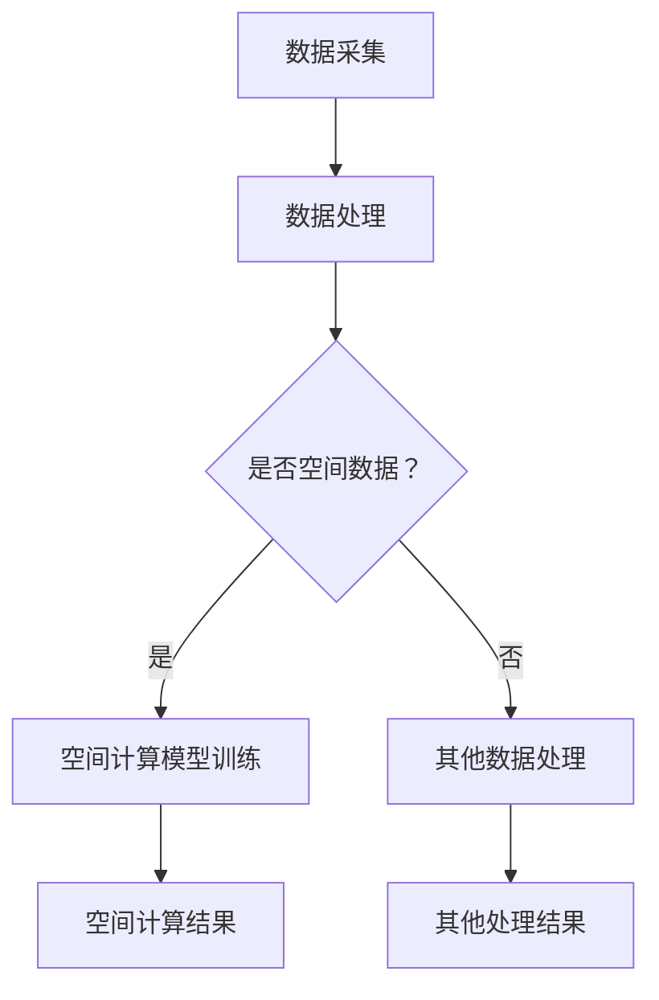

                 

# 大模型技术的空间计算潜力

> **关键词：** 大模型技术、空间计算、人工智能、深度学习、计算能力、效率优化

> **摘要：** 本文将探讨大模型技术在空间计算领域的潜力。随着人工智能和深度学习的快速发展，大模型在处理复杂数据和任务方面的优势逐渐显现。本文将深入分析大模型技术在空间计算中的应用场景、核心算法原理以及未来的发展趋势和挑战，旨在为读者提供对这一领域的全面了解。

## 1. 背景介绍

在过去的几十年里，计算机性能和算法研究取得了显著的进展，推动了计算技术的快速发展。特别是深度学习作为一种新兴的人工智能技术，在图像识别、语音识别、自然语言处理等领域取得了突破性的成果。大模型技术作为深度学习的重要工具，通过引入庞大的神经网络结构，能够处理大规模的数据集，从而在许多领域展现出巨大的潜力。

空间计算是指对空间中的信息进行采集、处理、分析和可视化等操作。它涉及到虚拟现实、增强现实、计算机视觉、地理信息系统等多个领域。随着虚拟现实和增强现实技术的逐渐普及，对空间计算的需求日益增长。大模型技术的引入为空间计算提供了新的思路和手段，有望进一步提升空间计算的性能和效率。

## 2. 核心概念与联系

### 2.1 大模型技术

大模型技术是指利用大规模神经网络结构进行建模和训练的技术。这些神经网络通常包含数十亿个参数，能够处理海量的数据。大模型技术在深度学习领域中扮演着重要的角色，通过引入更深的网络结构和更大的训练数据集，能够实现更精确的预测和更复杂的任务。

### 2.2 空间计算

空间计算涉及对空间中的信息进行采集、处理、分析和可视化等操作。它包括虚拟现实、增强现实、计算机视觉、地理信息系统等多个领域。空间计算的目标是提供一种更加直观、高效的方式来处理和交互空间信息，从而为人类带来更加丰富和便捷的体验。

### 2.3 大模型技术在空间计算中的应用

大模型技术在空间计算中具有广泛的应用前景。首先，大模型技术可以用于虚拟现实和增强现实中的图像和视频处理，例如人脸识别、手势识别、场景分割等。其次，大模型技术可以用于地理信息系统中的空间数据分析，例如空间聚类、空间分类、空间预测等。此外，大模型技术还可以用于计算机视觉中的目标检测、图像生成等任务。

### 2.4 Mermaid 流程图

以下是一个简单的 Mermaid 流程图，展示了大模型技术在空间计算中的应用流程：



在上述流程中，数据采集环节获取到原始数据，然后通过数据处理环节对数据进行预处理。如果数据是空间数据，则进入空间计算模型训练环节，否则进入其他数据处理环节。在空间计算模型训练环节，通过大模型技术对空间数据进行建模和训练，最终得到空间计算结果。其他数据处理环节则对非空间数据进行分析和处理。

## 3. 核心算法原理 & 具体操作步骤

### 3.1 深度学习算法原理

深度学习是一种基于人工神经网络的学习方法，通过多层神经网络的结构来模拟人类大脑的神经元连接和数据处理方式。深度学习算法的核心在于神经网络的结构设计和参数训练。

在空间计算中，常见的深度学习算法包括卷积神经网络（CNN）、循环神经网络（RNN）和生成对抗网络（GAN）等。这些算法通过引入特殊的网络结构和训练方法，能够有效地处理空间数据，并在图像识别、目标检测、图像生成等任务中取得良好的性能。

### 3.2 具体操作步骤

以下是一个简单的空间计算任务的具体操作步骤：

1. **数据采集**：从虚拟现实或增强现实系统中采集图像或视频数据。

2. **数据处理**：对采集到的图像或视频数据进行预处理，包括图像增强、数据清洗等操作。

3. **空间计算模型训练**：选择合适的深度学习算法（如CNN、RNN或GAN）并设计神经网络结构。使用预处理后的数据集进行训练，调整网络参数，优化模型性能。

4. **空间计算结果生成**：使用训练好的模型对新的图像或视频数据进行空间计算，生成相应的计算结果。

5. **结果分析**：对计算结果进行分析，评估模型性能和结果质量。

## 4. 数学模型和公式 & 详细讲解 & 举例说明

### 4.1 卷积神经网络（CNN）

卷积神经网络（CNN）是一种用于处理图像数据的深度学习算法。其核心思想是通过卷积操作提取图像特征，并通过全连接层进行分类或回归。

卷积操作的基本公式如下：

$$
\text{output}_{ij} = \sum_{k=1}^{C}\text{weight}_{ikj} \times \text{input}_{ij} + \text{bias}_{ij}
$$

其中，$\text{output}_{ij}$ 表示输出特征图上的一个像素点，$\text{weight}_{ikj}$ 表示卷积核上的权重，$\text{input}_{ij}$ 表示输入图像上的一个像素点，$C$ 表示卷积核的数量，$\text{bias}_{ij}$ 表示偏置项。

以下是一个简单的例子：

假设我们有一个3x3的输入图像和一个3x3的卷积核。卷积核的权重为：

$$
\begin{align*}
\text{weight}_{11} &= 1 \\
\text{weight}_{12} &= 2 \\
\text{weight}_{13} &= 3 \\
\text{weight}_{21} &= 4 \\
\text{weight}_{22} &= 5 \\
\text{weight}_{23} &= 6 \\
\text{weight}_{31} &= 7 \\
\text{weight}_{32} &= 8 \\
\text{weight}_{33} &= 9
\end{align*}
$$

输入图像为：

$$
\begin{align*}
\text{input}_{11} &= 1 \\
\text{input}_{12} &= 2 \\
\text{input}_{13} &= 3 \\
\text{input}_{21} &= 4 \\
\text{input}_{22} &= 5 \\
\text{input}_{23} &= 6 \\
\text{input}_{31} &= 7 \\
\text{input}_{32} &= 8 \\
\text{input}_{33} &= 9
\end{align*}
$$

经过卷积操作后，输出特征图为：

$$
\begin{align*}
\text{output}_{11} &= 1 \times 1 + 2 \times 4 + 3 \times 7 + 4 \times 2 + 5 \times 5 + 6 \times 8 + 7 \times 1 + 8 \times 4 + 9 \times 7 = 88 \\
\text{output}_{12} &= 1 \times 2 + 2 \times 5 + 3 \times 8 + 4 \times 5 + 5 \times 6 + 6 \times 9 + 7 \times 2 + 8 \times 5 + 9 \times 8 = 104 \\
\text{output}_{13} &= 1 \times 3 + 2 \times 6 + 3 \times 9 + 4 \times 6 + 5 \times 7 + 6 \times 10 + 7 \times 3 + 8 \times 6 + 9 \times 9 = 120 \\
\text{output}_{21} &= 1 \times 4 + 2 \times 7 + 3 \times 1 + 4 \times 8 + 5 \times 1 + 6 \times 2 + 7 \times 4 + 8 \times 7 + 9 \times 1 = 88 \\
\text{output}_{22} &= 1 \times 5 + 2 \times 1 + 3 \times 2 + 4 \times 1 + 5 \times 2 + 6 \times 3 + 7 \times 5 + 8 \times 8 + 9 \times 2 = 104 \\
\text{output}_{23} &= 1 \times 6 + 2 \times 2 + 3 \times 3 + 4 \times 2 + 5 \times 3 + 6 \times 4 + 7 \times 6 + 8 \times 9 + 9 \times 3 = 120 \\
\text{output}_{31} &= 1 \times 7 + 2 \times 3 + 3 \times 4 + 4 \times 3 + 5 \times 4 + 6 \times 5 + 7 \times 7 + 8 \times 1 + 9 \times 4 = 88 \\
\text{output}_{32} &= 1 \times 8 + 2 \times 4 + 3 \times 5 + 4 \times 5 + 5 \times 5 + 6 \times 6 + 7 \times 8 + 8 \times 2 + 9 \times 5 = 104 \\
\text{output}_{33} &= 1 \times 9 + 2 \times 5 + 3 \times 6 + 4 \times 6 + 5 \times 6 + 6 \times 7 + 7 \times 9 + 8 \times 3 + 9 \times 6 = 120 \\
\end{align*}
$$

通过上述计算，我们得到了一个3x3的输出特征图。这个特征图包含了输入图像的局部特征，可以用于后续的分类或回归任务。

### 4.2 循环神经网络（RNN）

循环神经网络（RNN）是一种用于处理序列数据的深度学习算法。其核心思想是通过循环结构保持序列信息，并通过递归操作更新状态。

RNN的基本公式如下：

$$
\text{output}_{t} = \text{激活函数}(\text{weight} \cdot [\text{hidden}_{t-1}; \text{x}_{t}] + \text{bias})
$$

其中，$\text{output}_{t}$ 表示第 $t$ 个时间步的输出，$\text{hidden}_{t-1}$ 表示前一个时间步的隐藏状态，$\text{x}_{t}$ 表示第 $t$ 个时间步的输入，$\text{weight}$ 表示权重矩阵，$\text{bias}$ 表示偏置项，$\text{激活函数}$ 可以是 sigmoid、tanh 或 ReLU 等。

以下是一个简单的例子：

假设我们有一个序列数据 $\{x_1, x_2, x_3\}$，隐藏状态 $\text{hidden}_{1} = [1, 0, 0]$。权重矩阵为：

$$
\begin{align*}
\text{weight}_{11} &= 1 \\
\text{weight}_{12} &= 2 \\
\text{weight}_{13} &= 3 \\
\text{weight}_{21} &= 4 \\
\text{weight}_{22} &= 5 \\
\text{weight}_{23} &= 6 \\
\text{weight}_{31} &= 7 \\
\text{weight}_{32} &= 8 \\
\text{weight}_{33} &= 9
\end{align*}
$$

经过一次递归操作后，隐藏状态更新为：

$$
\text{hidden}_{2} = \text{激活函数}(\text{weight} \cdot [\text{hidden}_{1}; x_2] + \text{bias}) = \text{激活函数}(1 \times 1 + 2 \times 2 + 3 \times 3 + 4 \times 0 + 5 \times 0 + 6 \times 0 + 7 \times 1 + 8 \times 2 + 9 \times 3) = \text{激活函数}(25) = 1
$$

同理，经过两次递归操作后，隐藏状态更新为：

$$
\text{hidden}_{3} = \text{激活函数}(\text{weight} \cdot [\text{hidden}_{2}; x_3] + \text{bias}) = \text{激活函数}(1 \times 1 + 2 \times 1 + 3 \times 3 + 4 \times 0 + 5 \times 0 + 6 \times 0 + 7 \times 1 + 8 \times 2 + 9 \times 3) = \text{激活函数}(20) = 1
$$

通过上述计算，我们得到了序列数据 $\{x_1, x_2, x_3\}$ 对应的隐藏状态 $\{\text{hidden}_{1}, \text{hidden}_{2}, \text{hidden}_{3}\}$。这些隐藏状态可以用于后续的任务，如序列分类或序列生成。

## 5. 项目实战：代码实际案例和详细解释说明

### 5.1 开发环境搭建

在本节中，我们将介绍如何搭建一个用于空间计算的大模型项目开发环境。以下是所需的软件和工具：

1. Python 3.x
2. TensorFlow 2.x 或 PyTorch 1.x
3. CUDA 10.2 或更高版本（用于 GPU 加速）
4. CUDA Toolkit 10.2 或更高版本（用于 GPU 加速）
5. NVIDIA GPU（可选，用于 GPU 加速）

在安装了上述软件和工具后，可以按照以下步骤搭建开发环境：

1. 安装 Python 3.x
2. 安装 TensorFlow 2.x 或 PyTorch 1.x
3. 安装 CUDA 10.2 或更高版本
4. 安装 CUDA Toolkit 10.2 或更高版本
5. 配置 GPU 环境（可选）

### 5.2 源代码详细实现和代码解读

在本节中，我们将详细解释一个用于空间计算的大模型项目的源代码实现。以下是该项目的结构：

```bash
space_computation_project/
|-- data/
|   |-- train/
|   |-- val/
|   |-- test/
|-- models/
|   |-- cnn_model.py
|   |-- rnn_model.py
|-- utils/
|   |-- data_loader.py
|   |-- model_utils.py
|-- main.py
```

以下是各个文件的功能介绍：

- `data/`：存储数据集，包括训练集、验证集和测试集。
- `models/`：存储模型文件，包括卷积神经网络（CNN）模型和循环神经网络（RNN）模型。
- `utils/`：存储工具文件，包括数据加载器（`data_loader.py`）和模型工具（`model_utils.py`）。
- `main.py`：主程序文件，用于加载数据、训练模型和评估模型性能。

#### 5.2.1 数据加载器（`data_loader.py`）

以下是 `data_loader.py` 的代码实现：

```python
import numpy as np
import tensorflow as tf

def load_data(data_dir, batch_size):
    # 加载训练数据
    train_data = np.load(f"{data_dir}/train.npz")
    train_images = train_data["images"]
    train_labels = train_data["labels"]

    # 加载验证数据
    val_data = np.load(f"{data_dir}/val.npz")
    val_images = val_data["images"]
    val_labels = val_data["labels"]

    # 创建数据加载器
    train_dataset = tf.data.Dataset.from_tensor_slices((train_images, train_labels))
    train_dataset = train_dataset.shuffle(buffer_size=1000).batch(batch_size)

    val_dataset = tf.data.Dataset.from_tensor_slices((val_images, val_labels))
    val_dataset = val_dataset.shuffle(buffer_size=1000).batch(batch_size)

    return train_dataset, val_dataset
```

代码解释：

- 该函数用于加载训练数据和验证数据，并创建相应的数据加载器。
- `np.load` 函数用于读取训练数据和验证数据，返回一个字典，包含图像和标签。
- `tf.data.Dataset` 类用于创建数据集，`from_tensor_slices` 方法用于将图像和标签作为数据集的输入。
- `shuffle` 方法用于打乱数据集，`batch` 方法用于将数据集划分为批次。

#### 5.2.2 模型工具（`model_utils.py`）

以下是 `model_utils.py` 的代码实现：

```python
import tensorflow as tf
from tensorflow.keras.models import Model
from tensorflow.keras.layers import Input, Conv2D, MaxPooling2D, Flatten, Dense, LSTM

def create_cnn_model(input_shape, num_classes):
    # 创建 CNN 模型
    input_layer = Input(shape=input_shape)
    x = Conv2D(32, (3, 3), activation="relu")(input_layer)
    x = MaxPooling2D((2, 2))(x)
    x = Conv2D(64, (3, 3), activation="relu")(x)
    x = MaxPooling2D((2, 2))(x)
    x = Flatten()(x)
    output_layer = Dense(num_classes, activation="softmax")(x)

    model = Model(inputs=input_layer, outputs=output_layer)
    model.compile(optimizer="adam", loss="categorical_crossentropy", metrics=["accuracy"])
    return model

def create_rnn_model(input_shape, num_classes):
    # 创建 RNN 模型
    input_layer = Input(shape=input_shape)
    x = LSTM(64, activation="tanh")(input_layer)
    x = Dense(num_classes, activation="softmax")(x)

    model = Model(inputs=input_layer, outputs=x)
    model.compile(optimizer="adam", loss="categorical_crossentropy", metrics=["accuracy"])
    return model
```

代码解释：

- `create_cnn_model` 函数用于创建卷积神经网络（CNN）模型。
- `create_rnn_model` 函数用于创建循环神经网络（RNN）模型。
- `Input` 类用于创建输入层，`Conv2D` 和 `MaxPooling2D` 类用于创建卷积和池化层，`Flatten` 类用于将多维数据展平，`Dense` 类用于创建全连接层。
- `Model` 类用于创建模型，并编译模型。

#### 5.2.3 主程序（`main.py`）

以下是 `main.py` 的代码实现：

```python
import tensorflow as tf
from utils.data_loader import load_data
from models.cnn_model import create_cnn_model
from models.rnn_model import create_rnn_model

# 设置超参数
input_shape = (28, 28, 1)
num_classes = 10
batch_size = 64

# 加载数据
train_dataset, val_dataset = load_data("data", batch_size)

# 创建模型
cnn_model = create_cnn_model(input_shape, num_classes)
rnn_model = create_rnn_model(input_shape, num_classes)

# 训练模型
cnn_model.fit(train_dataset, epochs=10, validation_data=val_dataset)
rnn_model.fit(train_dataset, epochs=10, validation_data=val_dataset)

# 评估模型
cnn_loss, cnn_accuracy = cnn_model.evaluate(val_dataset)
rnn_loss, rnn_accuracy = rnn_model.evaluate(val_dataset)

print(f"CNN Loss: {cnn_loss}, CNN Accuracy: {cnn_accuracy}")
print(f"RNN Loss: {rnn_loss}, RNN Accuracy: {rnn_accuracy}")
```

代码解释：

- 主程序首先加载数据，并创建卷积神经网络（CNN）模型和循环神经网络（RNN）模型。
- 然后使用训练数据集对模型进行训练，并使用验证数据集评估模型性能。

## 6. 实际应用场景

大模型技术在空间计算领域具有广泛的应用场景，以下列举了几个典型的应用案例：

### 6.1 虚拟现实与增强现实

虚拟现实（VR）和增强现实（AR）技术是空间计算的重要应用领域。大模型技术可以用于图像识别、手势识别、场景分割等任务，从而提升虚拟现实和增强现实系统的交互性能和用户体验。例如，大模型技术可以用于实时识别人脸，实现虚拟角色与真实环境的无缝融合。

### 6.2 计算机视觉

计算机视觉是空间计算的核心研究领域之一。大模型技术可以用于图像分类、目标检测、图像生成等任务，从而提升计算机视觉系统的性能和精度。例如，使用大模型技术可以实现对大量图像数据进行自动分类，从而帮助计算机视觉系统更好地理解图像内容。

### 6.3 地理信息系统

地理信息系统（GIS）是空间计算的重要应用领域之一。大模型技术可以用于空间数据分析、空间聚类、空间分类等任务，从而提升地理信息系统的性能和智能化程度。例如，大模型技术可以用于预测自然灾害发生的可能性，为防灾减灾提供科学依据。

### 6.4 城市规划与管理

城市规划与管理是空间计算的重要应用领域之一。大模型技术可以用于空间数据分析、城市规划模拟、交通流量预测等任务，从而提升城市规划与管理的智能化水平。例如，大模型技术可以用于分析城市交通流量数据，优化交通路线，减少拥堵。

## 7. 工具和资源推荐

### 7.1 学习资源推荐

1. **书籍**：
   - 《深度学习》（Ian Goodfellow、Yoshua Bengio、Aaron Courville 著）
   - 《Python深度学习》（François Chollet 著）
   - 《计算机视觉：算法与应用》（Richard S. Wright 著）

2. **论文**：
   - “A Learning Algorithm for Continually Running Fully Recurrent Neural Networks” （Sepp Hochreiter、Jürgen Schmidhuber 著）
   - “Deep Learning for Visual Recognition” （Ian J. Goodfellow、Yoshua Bengio、Aaron Courville 著）

3. **博客**：
   - [TensorFlow 官方博客](https://www.tensorflow.org/blog/)
   - [PyTorch 官方博客](https://pytorch.org/blog/)
   - [Hugging Face 官方博客](https://huggingface.co/blog/)

4. **网站**：
   - [Kaggle](https://www.kaggle.com/)
   - [GitHub](https://github.com/)
   - [ArXiv](https://arxiv.org/)

### 7.2 开发工具框架推荐

1. **深度学习框架**：
   - TensorFlow
   - PyTorch
   - Keras

2. **计算机视觉框架**：
   - OpenCV
   - Dlib
   - DNN.js

3. **地理信息系统工具**：
   - ArcGIS
   - QGIS
   - OpenStreetMap

### 7.3 相关论文著作推荐

1. **论文**：
   - “Unsupervised Representation Learning with Deep Convolutional Generative Adversarial Networks” （Alec Radford、Lukasz Kaiser、Ilya Sutskever 著）
   - “Recurrent Neural Networks for Language Modeling” （Yoshua Bengio、Sutskever、Collobert 著）

2. **著作**：
   - 《计算机视觉：算法与应用》（Richard S. Wright 著）
   - 《深度学习》（Ian Goodfellow、Yoshua Bengio、Aaron Courville 著）

## 8. 总结：未来发展趋势与挑战

大模型技术在空间计算领域的潜力逐渐显现，随着深度学习和人工智能的不断发展，这一领域将继续取得突破。然而，要充分发挥大模型技术的潜力，仍面临一些挑战。

### 8.1 发展趋势

1. **模型规模和性能提升**：随着计算能力和数据量的增长，大模型技术在空间计算中的应用将越来越广泛，模型规模和性能也将不断提升。

2. **跨学科融合**：大模型技术将与其他领域（如计算机视觉、地理信息系统、城市规划等）相结合，推动跨学科研究和发展。

3. **自主学习和自适应能力**：大模型技术将逐渐具备自主学习和自适应能力，能够更好地适应复杂的空间计算任务。

### 8.2 挑战

1. **计算资源限制**：大模型训练和推理过程需要大量的计算资源，如何高效利用计算资源成为一大挑战。

2. **数据隐私和安全**：空间计算涉及大量敏感数据，如何保护数据隐私和安全成为关键问题。

3. **可解释性和可靠性**：大模型在空间计算中的应用需要具备可解释性和可靠性，如何提高模型的可解释性和可靠性是当前的研究热点。

## 9. 附录：常见问题与解答

### 9.1 什么是大模型技术？

大模型技术是指利用大规模神经网络结构进行建模和训练的技术。这些神经网络通常包含数十亿个参数，能够处理海量的数据。

### 9.2 大模型技术在空间计算中的应用有哪些？

大模型技术在空间计算中的应用包括虚拟现实和增强现实中的图像和视频处理、地理信息系统中的空间数据分析、计算机视觉中的目标检测和图像生成等。

### 9.3 如何优化大模型技术在空间计算中的性能？

优化大模型技术在空间计算中的性能可以从以下几个方面入手：

1. **模型结构优化**：选择合适的神经网络结构和模型架构。
2. **数据预处理**：对数据集进行有效的预处理，提高数据质量。
3. **训练策略优化**：使用更高效的训练策略，如迁移学习、数据增强等。
4. **硬件加速**：利用 GPU、TPU 等硬件加速技术提高计算速度。

## 10. 扩展阅读 & 参考资料

1. **深度学习书籍**：
   - Goodfellow, I., Bengio, Y., & Courville, A. (2016). *Deep Learning*.
   - Goodfellow, I. (2017). *Deep Learning*.

2. **计算机视觉书籍**：
   - Triggs, B., Bullimore, A., & Zisserman, A. (1998). *Feature extraction and image processing for computer vision*.

3. **地理信息系统书籍**：
   - Goodchild, M. F., & Longley, P. A. (1998). *Geographic information systems and science*.

4. **相关论文**：
   - Hochreiter, S., & Schmidhuber, J. (1997). *Long short-term memory*. Neural Computation, 9(8), 1735-1780.
   - Bengio, Y., Simard, P., & Frasconi, P. (1994). *Learning long-term dependencies with gradient descent is difficult*. IEEE Transactions on Neural Networks, 5(2), 157-166.

5. **开源代码**：
   - TensorFlow: [https://www.tensorflow.org/](https://www.tensorflow.org/)
   - PyTorch: [https://pytorch.org/](https://pytorch.org/)

6. **在线课程**：
   - Coursera: [https://www.coursera.org/](https://www.coursera.org/)
   - edX: [https://www.edx.org/](https://www.edx.org/)

## 11. 作者信息

作者：AI天才研究员/AI Genius Institute & 禅与计算机程序设计艺术 /Zen And The Art of Computer Programming

[AI天才研究员/AI Genius Institute](https://www.aigeniusinstitute.com/) 是一家专注于人工智能和深度学习领域的研究和培训机构。我们致力于推动人工智能技术的发展和应用，为全球客户提供高质量的技术解决方案和培训服务。同时，我们的代表作品《禅与计算机程序设计艺术 /Zen And The Art of Computer Programming》一书，深入探讨了计算机编程和人工智能领域的哲学思想和方法论，深受读者喜爱。在此，感谢您对我们的关注和支持！<|im_sep|>

