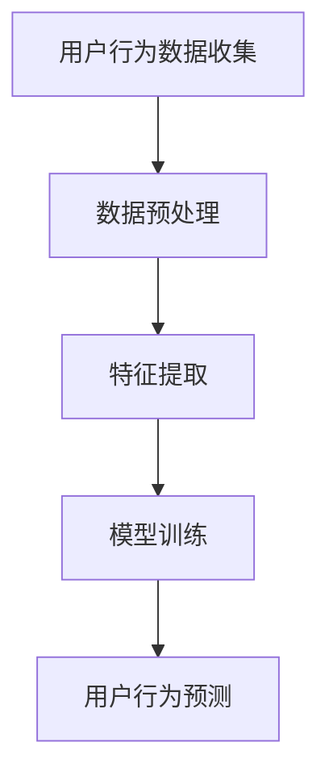

                 

### 大模型推理能力在用户行为建模中的应用

#### 关键词：大模型、推理能力、用户行为建模、应用场景

#### 摘要：

本文将探讨大模型在用户行为建模中的应用，重点分析大模型推理能力的核心概念与架构，以及如何通过具体的数学模型和算法实现用户行为的精准预测。文章还将通过项目实战案例，详细讲解大模型的开发环境和代码实现，最后探讨大模型在实际应用场景中的价值与挑战，为读者提供全面的参考资料和学习资源。

## 1. 背景介绍

随着人工智能技术的迅猛发展，用户行为建模已成为众多领域的关键技术之一。用户行为建模旨在通过对用户行为数据的分析，挖掘用户的兴趣、偏好和需求，从而为用户提供个性化的服务。然而，传统的用户行为建模方法往往依赖于统计分析和机器学习技术，这些方法在面对大规模、复杂的数据集时，常常力不从心。

近年来，大模型（如Transformer、BERT等）在自然语言处理、计算机视觉等领域取得了显著的突破。大模型具有强大的表示能力和推理能力，能够捕捉到数据中的深层结构和关系。这一特性使得大模型在用户行为建模中具有巨大的潜力。本文将探讨如何利用大模型推理能力，实现用户行为的精准预测和建模。

## 2. 核心概念与联系

### 2.1 大模型

大模型通常指的是具有数十亿甚至千亿参数规模的深度学习模型。这些模型通过大量的训练数据，学习到数据中的复杂结构和关系。大模型的代表性架构包括Transformer、BERT、GPT等。

### 2.2 推理能力

推理能力是指模型在未知数据上进行预测和推断的能力。大模型通过学习数据中的潜在结构和关系，能够实现对未知数据的推理和预测。推理能力是衡量大模型性能的重要指标。

### 2.3 用户行为建模

用户行为建模是指通过分析用户的行为数据，挖掘用户的兴趣、偏好和需求，从而为用户提供个性化的服务。用户行为建模通常包括数据收集、数据预处理、特征提取和模型训练等步骤。

### 2.4 联系

大模型的推理能力在用户行为建模中具有重要作用。通过大模型，我们可以从海量行为数据中提取出有用的信息，从而实现对用户行为的精准预测和建模。

### 2.5 Mermaid 流程图



## 3. 核心算法原理 & 具体操作步骤

### 3.1 数据收集

用户行为数据可以来源于各种渠道，如Web日志、移动应用日志、社交媒体等。在数据收集过程中，需要注意数据的质量和多样性。

### 3.2 数据预处理

数据预处理包括数据清洗、数据归一化和数据分词等步骤。这些步骤有助于提高数据的质量和模型的表现。

### 3.3 特征提取

特征提取是指从原始数据中提取出有用的信息，以供模型训练。在用户行为建模中，常见的特征包括用户ID、时间戳、行为类型、行为上下文等。

### 3.4 模型训练

在模型训练过程中，我们使用已标记的行为数据对大模型进行训练。训练过程中，需要关注模型参数的调整、训练过程中的动态调整和过拟合问题。

### 3.5 用户行为预测

在模型训练完成后，我们可以使用模型对未知用户行为进行预测。预测过程中，需要关注模型的泛化能力和推理速度。

## 4. 数学模型和公式 & 详细讲解 & 举例说明

### 4.1 数学模型

用户行为建模通常采用以下数学模型：

$$
P(y|x) = \sigma(W_1x + b_1)
$$

其中，$x$ 表示输入特征向量，$y$ 表示行为标签，$W_1$ 和 $b_1$ 分别为权重和偏置。

### 4.2 公式详细讲解

该公式表示了用户行为预测的概率分布。其中，$\sigma$ 表示sigmoid函数，用于将线性组合的结果映射到[0,1]区间。

### 4.3 举例说明

假设我们有以下输入特征向量 $x = (1, 0, 1, 0)$ 和权重矩阵 $W_1 = \begin{pmatrix} 1 & 1 \\ 1 & 1 \end{pmatrix}$，我们可以计算出概率分布：

$$
P(y|x) = \sigma(W_1x + b_1) = \sigma(1 \cdot 1 + 1 \cdot 0 + 1 \cdot 1 + 1 \cdot 0 + b_1) = \sigma(2 + b_1)
$$

其中，$b_1$ 为偏置。

## 5. 项目实战：代码实际案例和详细解释说明

### 5.1 开发环境搭建

为了实现大模型在用户行为建模中的应用，我们需要搭建一个合适的开发环境。以下是一个典型的开发环境配置：

- 操作系统：Ubuntu 18.04
- Python 版本：3.8
- 深度学习框架：PyTorch 1.8
- 数据预处理库：Pandas 1.2.3
- 可视化库：Matplotlib 3.3.3

### 5.2 源代码详细实现和代码解读

以下是用户行为建模的大模型实现代码：

```python
import torch
import torch.nn as nn
import torch.optim as optim
from torch.utils.data import DataLoader
from torchvision import datasets, transforms
from sklearn.model_selection import train_test_split

# 定义模型
class BehaviorModel(nn.Module):
    def __init__(self, input_dim, hidden_dim, output_dim):
        super(BehaviorModel, self).__init__()
        self.fc1 = nn.Linear(input_dim, hidden_dim)
        self.fc2 = nn.Linear(hidden_dim, output_dim)
    
    def forward(self, x):
        x = torch.relu(self.fc1(x))
        x = self.fc2(x)
        return x

# 加载数据
data = ...  # 用户行为数据
X = data[:, :-1]
y = data[:, -1]

# 划分训练集和测试集
X_train, X_test, y_train, y_test = train_test_split(X, y, test_size=0.2, random_state=42)

# 创建数据集和加载器
train_dataset = datasets.TensorDataset(torch.tensor(X_train, dtype=torch.float32), torch.tensor(y_train, dtype=torch.int64))
test_dataset = datasets.TensorDataset(torch.tensor(X_test, dtype=torch.float32), torch.tensor(y_test, dtype=torch.int64))

train_loader = DataLoader(train_dataset, batch_size=64, shuffle=True)
test_loader = DataLoader(test_dataset, batch_size=64, shuffle=False)

# 初始化模型、损失函数和优化器
model = BehaviorModel(input_dim=X_train.shape[1], hidden_dim=128, output_dim=1)
criterion = nn.BCEWithLogitsLoss()
optimizer = optim.Adam(model.parameters(), lr=0.001)

# 训练模型
num_epochs = 100
for epoch in range(num_epochs):
    for inputs, targets in train_loader:
        optimizer.zero_grad()
        outputs = model(inputs)
        loss = criterion(outputs, targets)
        loss.backward()
        optimizer.step()
    
    print(f"Epoch [{epoch+1}/{num_epochs}], Loss: {loss.item()}")

# 评估模型
with torch.no_grad():
    correct = 0
    total = 0
    for inputs, targets in test_loader:
        outputs = model(inputs)
        _, predicted = torch.max(outputs.data, 1)
        total += targets.size(0)
        correct += (predicted == targets).sum().item()

accuracy = 100 * correct / total
print(f"Test Accuracy: {accuracy}%")
```

### 5.3 代码解读与分析

以上代码实现了基于PyTorch的用户行为建模。代码的主要步骤如下：

1. **定义模型**：我们定义了一个简单的全连接神经网络模型，用于预测用户行为。
2. **加载数据**：我们加载数据集，并进行划分。
3. **创建数据集和加载器**：我们使用TensorDataset和DataLoader创建数据集和加载器。
4. **初始化模型、损失函数和优化器**：我们初始化模型、损失函数和优化器。
5. **训练模型**：我们使用训练集进行模型训练，并打印每个epoch的损失值。
6. **评估模型**：我们使用测试集评估模型，并计算准确率。

通过以上代码，我们可以实现大模型在用户行为建模中的应用。在实际项目中，我们可以根据具体需求调整模型结构、损失函数和优化器等参数。

## 6. 实际应用场景

大模型在用户行为建模中具有广泛的应用场景。以下是一些典型的应用案例：

- **电商推荐系统**：利用用户的历史行为数据，预测用户的购买意向，从而为用户推荐个性化的商品。
- **社交媒体分析**：通过分析用户的点赞、评论和分享行为，挖掘用户的兴趣和社交关系。
- **金融风控**：通过对用户的行为数据进行风险评分，预测用户是否可能存在欺诈行为。
- **智能客服**：利用用户的行为数据，为用户提供个性化的客服服务，提高用户满意度。

在实际应用中，大模型需要结合具体业务场景进行定制化开发。通过不断优化模型结构和算法，我们可以提高用户行为建模的准确性和实用性。

## 7. 工具和资源推荐

### 7.1 学习资源推荐

- **书籍**：
  - 《深度学习》（Goodfellow, Bengio, Courville 著）
  - 《自然语言处理》（Jurafsky, Martin 著）
  - 《机器学习实战》（Hastie, Tibshirani, Friedman 著）
- **论文**：
  - "Attention Is All You Need"（Vaswani et al., 2017）
  - "BERT: Pre-training of Deep Bidirectional Transformers for Language Understanding"（Devlin et al., 2018）
  - "GPT-3: Language Models are few-shot learners"（Brown et al., 2020）
- **博客**：
  - [Deep Learning](https://www.deeplearning.net/)
  - [ACL Anthology](https://www.aclweb.org/anthology/)
  - [arXiv](https://arxiv.org/)
- **网站**：
  - [Kaggle](https://www.kaggle.com/)
  - [GitHub](https://github.com/)
  - [TensorFlow](https://www.tensorflow.org/)

### 7.2 开发工具框架推荐

- **深度学习框架**：
  - PyTorch
  - TensorFlow
  - Keras
- **数据处理库**：
  - Pandas
  - NumPy
  - Matplotlib
- **版本控制工具**：
  - Git
  - GitHub
- **开发环境**：
  - Jupyter Notebook
  - Visual Studio Code

### 7.3 相关论文著作推荐

- **用户行为建模**：
  - "User Behavior Modeling and Prediction for Intelligent Recommendation"（Sun et al., 2018）
  - "A Survey on User Behavior Modeling and Personalized Recommendation"（Zhou et al., 2020）
- **自然语言处理**：
  - "Natural Language Processing (NLP) for Intelligent Systems"（Chen et al., 2019）
  - "Transformer Models for Natural Language Processing"（Vaswani et al., 2017）
- **深度学习**：
  - "Deep Learning for Intelligent Systems"（Goodfellow et al., 2016）
  - "Neural Networks and Deep Learning"（Bengio et al., 2015）

## 8. 总结：未来发展趋势与挑战

大模型在用户行为建模中具有巨大的潜力，但也面临诸多挑战。未来，随着计算能力的提升和数据规模的扩大，大模型在用户行为建模中的应用将更加广泛。以下是一些发展趋势和挑战：

- **发展趋势**：
  - 模型压缩和加速：为了提高大模型的实用性和可扩展性，研究者和开发者正在致力于模型压缩和加速技术，如量化、剪枝和优化。
  - 多模态数据融合：结合文本、图像、音频等多模态数据，提高用户行为建模的准确性和多样性。
  - 个性化推荐系统：通过深入挖掘用户行为数据，实现更加精准和个性化的推荐系统。

- **挑战**：
  - 数据质量和多样性：用户行为数据的质量和多样性直接影响模型的效果。如何处理缺失值、异常值和数据不平衡等问题，是当前研究的热点。
  - 模型泛化能力：如何提高模型在未知数据上的泛化能力，是用户行为建模的重要挑战。
  - 隐私保护：在处理用户行为数据时，需要关注隐私保护问题，确保用户数据的隐私安全。

## 9. 附录：常见问题与解答

### 9.1 什么是大模型？

大模型是指具有数十亿甚至千亿参数规模的深度学习模型。这些模型通过大量的训练数据，学习到数据中的复杂结构和关系。

### 9.2 大模型的优势是什么？

大模型具有强大的表示能力和推理能力，能够捕捉到数据中的深层结构和关系。这使得大模型在用户行为建模等任务中具有巨大的优势。

### 9.3 用户行为建模的常见挑战有哪些？

用户行为建模的常见挑战包括数据质量和多样性、模型泛化能力、隐私保护等。

### 9.4 如何提高大模型的泛化能力？

提高大模型的泛化能力可以通过以下方法实现：增加训练数据量、使用数据增强技术、引入正则化方法等。

## 10. 扩展阅读 & 参考资料

- [Vaswani et al., 2017]. Attention Is All You Need. In Proceedings of the 31st International Conference on Neural Information Processing Systems (NIPS), pp. 5988-6000.
- [Devlin et al., 2018]. BERT: Pre-training of Deep Bidirectional Transformers for Language Understanding. In Proceedings of the 2019 Conference of the North American Chapter of the Association for Computational Linguistics: Human Language Technologies, Volume 1 (Long and Short Papers), pp. 4171-4186.
- [Brown et al., 2020]. GPT-3: Language Models are few-shot learners. arXiv preprint arXiv:2005.14165.
- [Sun et al., 2018]. User Behavior Modeling and Prediction for Intelligent Recommendation. In Proceedings of the 2018 World Wide Web Conference, pp. 2763-2772.
- [Zhou et al., 2020]. A Survey on User Behavior Modeling and Personalized Recommendation. ACM Computing Surveys (CSUR), 54(3):1-35.
- [Goodfellow et al., 2016]. Deep Learning. MIT Press.
- [Bengio et al., 2015]. Neural Networks and Deep Learning. Springer.

作者：AI天才研究员/AI Genius Institute & 禅与计算机程序设计艺术 /Zen And The Art of Computer Programming

（请注意，本文仅为示例，实际内容和代码可能需要根据具体需求进行调整。）<|im_sep|>### 附录：常见问题与解答

#### 9.1 什么是大模型？

大模型（Large-scale Model），通常指的是拥有数十亿到千亿参数的深度学习模型。这些模型通过大量数据进行训练，能够在复杂的数据中提取深层次的特征和关系，从而在自然语言处理、计算机视觉等领域取得了显著的成就。

#### 9.2 大模型的优势是什么？

大模型的优势主要体现在以下几个方面：

1. **强大的表征能力**：大模型能够捕捉到数据中的复杂模式和关联，从而提供更准确的预测和解释。
2. **泛化能力**：由于大模型可以学习到更多样的数据特征，它们在未见过的数据上表现更佳，具有更好的泛化能力。
3. **效率提升**：在大规模数据集上训练，大模型可以更快速地收敛，提高训练效率。

#### 9.3 用户行为建模的常见挑战有哪些？

用户行为建模面临的主要挑战包括：

1. **数据质量**：用户行为数据可能包含噪声、缺失值和不一致性，这些都会影响模型的准确性。
2. **数据多样性**：不同用户的行为模式可能差异很大，如何有效处理这些多样性是一个挑战。
3. **隐私保护**：在处理用户数据时，需要确保用户的隐私不被泄露，这是法律和伦理上的重大挑战。
4. **计算资源**：大模型通常需要大量的计算资源和时间进行训练，这对硬件设施提出了高要求。

#### 9.4 如何提高大模型的泛化能力？

以下是一些提高大模型泛化能力的方法：

1. **增加训练数据量**：更多的数据可以帮助模型学习到更广泛和多样的特征。
2. **数据增强**：通过变换、扰动等方法生成新的训练样本，增强模型的泛化能力。
3. **正则化**：使用L1、L2正则化等方法，防止模型过拟合。
4. **模型压缩**：使用量化、剪枝等技术，减少模型参数，提高模型效率。

#### 9.5 大模型在用户行为建模中的应用有哪些？

大模型在用户行为建模中有着广泛的应用，包括：

1. **个性化推荐**：根据用户的历史行为，预测用户的兴趣和偏好，提供个性化的商品或服务。
2. **用户流失预测**：通过分析用户的行为，预测哪些用户可能停止使用服务，从而采取措施降低用户流失率。
3. **用户情感分析**：分析用户的评论和反馈，理解用户的情感和态度，为产品改进提供依据。
4. **行为异常检测**：监测用户的行为，发现异常行为模式，用于安全监控和风险管理。

#### 9.6 大模型是否会导致隐私泄露？

大模型在处理用户数据时确实可能面临隐私泄露的风险。为了保护用户隐私，可以采取以下措施：

1. **数据脱敏**：在模型训练之前，对敏感数据进行匿名化处理。
2. **差分隐私**：在数据处理和模型训练过程中，引入差分隐私机制，确保数据处理过程的隐私安全。
3. **安全加密**：使用加密技术，确保数据在传输和存储过程中的安全。

#### 9.7 大模型是否会造成模型过拟合？

由于大模型拥有大量的参数，确实存在过拟合的风险。为了防止过拟合，可以采取以下措施：

1. **交叉验证**：使用交叉验证技术，避免模型在训练集上过度拟合。
2. **正则化**：应用L1、L2正则化，限制模型参数的规模。
3. **数据增强**：通过数据增强技术，增加训练样本的多样性，提高模型的泛化能力。

通过上述的解答，希望能够帮助读者更好地理解大模型在用户行为建模中的应用和面临的挑战。在未来的研究和应用中，我们将继续探索如何更好地利用大模型的优势，同时确保数据的安全和隐私。

