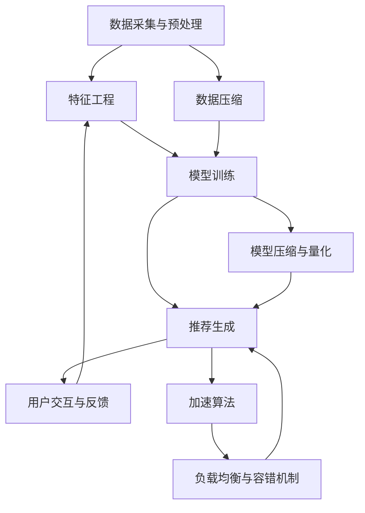

                 

### 1. 背景介绍

近年来，随着大数据、云计算和人工智能技术的快速发展，大模型推荐系统在各个行业中得到了广泛的应用。大模型推荐系统通过对海量用户行为数据进行深度学习和分析，能够准确预测用户的兴趣和需求，从而为用户提供个性化的推荐服务。然而，随着模型规模和数据处理量的不断增大，大模型推荐系统的性能优化和加速技术成为了亟待解决的问题。

本文将围绕大模型推荐系统的性能优化和加速技术进行探讨。首先，我们将介绍大模型推荐系统的基本概念和核心组件，以便读者对整个系统有一个全面的了解。接下来，我们将详细分析大模型推荐系统在性能优化和加速方面面临的挑战，并探讨相应的解决方案。通过本文的阅读，读者将了解到大模型推荐系统性能优化和加速的核心技术，以及如何在实际项目中应用这些技术。

在大模型推荐系统的背景下，性能优化和加速技术具有重要意义。一方面，随着数据量和模型规模的增大，系统性能的瓶颈逐渐凸显，导致推荐结果的生成时间过长，用户体验下降。另一方面，加速技术的应用可以提高系统的处理能力和响应速度，降低计算资源和能耗的消耗，从而提高系统的整体效率和可扩展性。因此，研究大模型推荐系统的性能优化和加速技术具有重要的实际应用价值。

本文将从以下几个方面展开讨论：

1. 大模型推荐系统的基本概念和核心组件。
2. 大模型推荐系统在性能优化和加速方面面临的挑战。
3. 大模型推荐系统性能优化和加速的关键技术。
4. 实际应用场景中性能优化和加速技术的应用案例。
5. 工具和资源的推荐，以帮助读者深入了解相关技术和应用。

通过对以上内容的详细分析和探讨，本文旨在为从事大模型推荐系统研究和开发的读者提供有益的参考和指导。希望本文能够为读者在解决性能优化和加速问题时提供一些新的思路和方法。

### 1.1 大模型推荐系统概述

大模型推荐系统是一种基于大规模数据和深度学习技术的推荐系统，其核心目的是通过分析用户的兴趣和行为，为用户推荐与其兴趣相符的内容或商品。与传统的基于规则或协同过滤的推荐系统相比，大模型推荐系统具有更高的准确性和灵活性，能够处理更复杂的用户行为数据和提供更个性化的推荐服务。

大模型推荐系统的基本架构通常包括以下几个核心组件：

1. **数据采集与预处理**：数据采集是推荐系统的第一步，包括用户行为数据、内容数据和商品数据等。数据预处理主要包括数据清洗、格式统一和特征提取等操作，以提高数据质量和后续分析的准确性。

2. **特征工程**：特征工程是构建推荐模型的关键环节，通过对原始数据进行处理和转换，提取出能够反映用户兴趣和商品属性的特征，如用户历史行为、浏览时长、购买记录、内容标签等。

3. **模型训练与优化**：基于提取的特征，采用深度学习等机器学习算法训练推荐模型。常见的模型包括基于循环神经网络（RNN）的序列模型、基于变压器（Transformer）的注意力模型和基于图神经网络的图模型等。模型训练过程需要大量的计算资源和时间，为了提高训练效率，通常采用分布式训练和模型压缩等技术。

4. **推荐生成与评估**：训练好的模型用于生成推荐结果，根据用户兴趣和行为对候选内容或商品进行评分，并根据评分结果生成推荐列表。推荐结果的质量和多样性是评估推荐系统性能的重要指标，因此需要对推荐结果进行评估和优化。

5. **用户交互与反馈**：用户与推荐系统的交互是不断迭代和优化的过程。用户通过点击、收藏、购买等行为提供反馈，这些反馈信息可以被用于模型重新训练或调整推荐策略，以提高系统的推荐质量和用户体验。

在大模型推荐系统中，数据质量和特征提取的准确性对推荐效果有着重要影响。高质量的数据集能够提供更丰富的信息，有助于模型更好地捕捉用户兴趣和偏好。而准确的特征提取能够将原始数据转化为有效的特征表示，从而提高模型训练的效果和推荐结果的准确性。

此外，大模型推荐系统还面临以下挑战：

1. **数据规模和多样性**：随着用户规模的扩大和数据类型的增多，推荐系统需要处理的海量数据不断增长。如何高效地处理和存储这些数据，并从中提取有价值的信息是推荐系统需要解决的问题。

2. **计算资源和能耗消耗**：大模型推荐系统的训练和推理过程需要大量的计算资源和时间，如何优化计算资源的使用和降低能耗消耗成为重要的研究方向。

3. **推荐结果的质量和多样性**：如何生成既准确又多样化的推荐结果，以满足用户多样化的需求和偏好，是推荐系统需要不断探索和优化的方向。

4. **实时性和在线性**：随着用户需求的变化，推荐系统需要具备实时性和在线性，能够快速响应用户的请求并提供个性化的推荐服务。

总之，大模型推荐系统作为一种先进的技术，在各个行业中具有广泛的应用前景。然而，要实现高效、准确和个性化的推荐服务，还需要不断研究和解决性能优化和加速等技术问题。通过本文的探讨，我们将深入了解大模型推荐系统的基本概念和核心组件，为进一步研究性能优化和加速技术奠定基础。

### 1.2 大模型推荐系统的发展历程

大模型推荐系统的发展历程可以分为几个关键阶段，每个阶段都有其独特的特点和代表性技术。

**1.1 基于规则的推荐系统**  
最早期的推荐系统是基于规则的推荐系统，这类系统主要通过定义一系列规则来推荐内容或商品。例如，如果用户A购买了商品X，则推荐用户B也购买商品X。这类推荐系统的优点是实现简单、易于理解，但其缺点也非常明显：规则过于简单，难以应对复杂和多变的用户需求。此外，基于规则的推荐系统无法利用用户的历史行为和偏好进行个性化推荐。

**1.2 协同过滤推荐系统**  
随着互联网的普及和用户数据的积累，基于协同过滤的推荐系统逐渐成为主流。协同过滤推荐系统通过分析用户之间的相似度或行为模式，预测用户对未知内容的偏好。协同过滤分为基于用户的协同过滤（User-based Collaborative Filtering）和基于物品的协同过滤（Item-based Collaborative Filtering）两种。这类推荐系统的优点是能够利用用户行为数据，提高推荐的相关性。然而，协同过滤也存在一些问题，如冷启动问题（新用户或新物品缺乏足够的历史数据）、数据稀疏性（用户行为数据存在大量缺失值）和计算复杂度高等。

**1.3 基于内容的推荐系统**  
基于内容的推荐系统（Content-based Recommender Systems）通过分析用户的历史行为和偏好，提取相关特征，然后将这些特征与待推荐的内容或商品进行匹配，从而生成推荐结果。这类推荐系统的优点是能够生成与用户兴趣相关的推荐结果，但在面对冷启动问题和多样性问题时表现不佳。

**1.4 大模型推荐系统**  
随着深度学习和大数据技术的发展，大模型推荐系统逐渐崛起。大模型推荐系统利用深度学习算法对大规模用户行为数据进行建模和预测，从而实现高精度和高效率的推荐。代表性的算法包括基于循环神经网络（RNN）的序列模型、基于变压器（Transformer）的注意力模型和基于图神经网络的图模型等。大模型推荐系统的优点是能够处理复杂的用户行为数据和提供个性化的推荐服务，但其计算资源和时间消耗较大。

**1.5 发展趋势**  
当前，大模型推荐系统在性能优化和加速技术方面取得了显著进展。随着硬件性能的提升和分布式计算技术的发展，大模型推荐系统的处理能力和响应速度将进一步提高。此外，融合多模态数据（如文本、图像、音频等）的推荐系统和联邦学习（Federated Learning）技术的应用也将成为大模型推荐系统的发展方向。未来的大模型推荐系统将更加智能化和个性化，能够实时响应用户的需求，提供高质量的推荐服务。

综上所述，大模型推荐系统的发展历程体现了从简单规则到复杂算法的演变，从单一数据源到多模态数据的融合，从单机计算到分布式计算的发展趋势。随着技术的不断进步，大模型推荐系统将不断优化和升级，为各行业提供更高效、更精准的推荐服务。

### 1.3 大模型推荐系统性能优化和加速技术的意义

在大模型推荐系统的背景下，性能优化和加速技术具有至关重要的意义。随着用户规模的扩大和数据量的激增，传统推荐系统的性能瓶颈逐渐显现，导致推荐结果的生成时间过长、系统响应速度下降，进而影响用户体验。性能优化和加速技术的引入，可以有效解决这些问题，提升系统的整体性能和用户体验。

首先，性能优化和加速技术能够提高推荐系统的处理能力和响应速度。通过优化算法和数据结构，减少计算复杂度和资源消耗，可以显著提高推荐系统的效率。例如，分布式计算技术可以将任务分解到多个计算节点上并行处理，从而缩短推荐结果的生成时间。此外，模型压缩和量化技术可以降低模型的大小和计算量，提高模型在资源受限环境中的运行效率。

其次，性能优化和加速技术有助于降低计算资源和能耗的消耗。在大规模数据处理过程中，计算资源和能耗的消耗是推荐系统的主要成本。通过优化算法和硬件配置，可以提高资源利用率，降低能耗消耗。例如，GPU加速技术可以利用图形处理器的强大计算能力，加速深度学习模型的训练和推理过程，从而减少计算资源的需求。同时，分布式存储和计算技术可以将数据存储和计算任务分布到多个节点上，实现资源的高效利用。

此外，性能优化和加速技术还有助于提升推荐系统的可扩展性和可靠性。在大规模数据和高并发请求的场景下，系统性能的稳定性和可靠性至关重要。通过引入负载均衡和容错机制，可以确保系统在面对大量请求时能够稳定运行，避免因性能瓶颈导致的服务中断。例如，分布式数据库和缓存技术可以实现对海量数据的快速访问和存储，提高系统的响应速度和可靠性。

总之，大模型推荐系统性能优化和加速技术在提升系统性能、降低计算资源消耗和提升用户体验方面具有重要意义。随着技术的不断进步，性能优化和加速技术将为大模型推荐系统的应用和发展提供有力支持，助力各行业实现更加智能和高效的推荐服务。

### 2. 核心概念与联系

在大模型推荐系统的性能优化和加速技术中，理解以下几个核心概念和它们之间的联系是至关重要的。这些概念不仅构成了推荐系统的基础，也是性能优化和加速的关键切入点。以下是这些核心概念及其相互关系的详细阐述：

#### 2.1 推荐系统的基本组件

**2.1.1 数据采集与预处理**  
数据采集与预处理是推荐系统的第一步。数据来源包括用户行为数据、内容数据、商品数据等。数据预处理包括数据清洗、去重、格式转换和特征提取等操作，以确保数据的质量和一致性。

**2.1.2 特征工程**  
特征工程是从原始数据中提取有助于模型训练的特征的过程。这些特征可以是用户的浏览历史、购买行为、兴趣标签等，它们是推荐模型的重要输入。

**2.1.3 模型训练**  
模型训练是推荐系统的核心环节，通过机器学习算法对特征进行学习，构建推荐模型。常见的训练算法包括基于协同过滤的方法、基于内容的推荐方法和基于深度学习的模型。

**2.1.4 推荐生成**  
推荐生成是根据训练好的模型为用户生成推荐列表的过程。生成推荐列表通常涉及评分预测、排序算法等。

**2.1.5 用户交互与反馈**  
用户交互与反馈是推荐系统的反馈机制，用户的行为和反馈可以用于模型重新训练和推荐策略的调整，从而提高系统的推荐质量。

#### 2.2 性能优化与加速技术的核心概念

**2.2.1 数据压缩**  
数据压缩技术通过减少数据存储和传输所需的存储空间和带宽，从而提高系统性能。常见的压缩方法包括数据分块、哈希索引等。

**2.2.2 并行与分布式计算**  
并行与分布式计算是将计算任务分解到多个计算节点上并行执行的技术。这可以显著提高处理速度，适用于大规模数据的处理。常见的分布式计算框架有Hadoop、Spark等。

**2.2.3 模型压缩与量化**  
模型压缩与量化技术通过减少模型的参数数量和计算量，从而提高模型在资源受限环境中的运行效率。常见的模型压缩方法包括剪枝、量化等。

**2.2.4 加速算法**  
加速算法是通过优化算法结构和计算步骤来提高计算效率的方法。例如，基于Transformer的推荐算法可以利用其并行计算的优势，实现高效推荐。

**2.2.5 负载均衡与容错机制**  
负载均衡与容错机制通过合理分配计算任务和确保系统可靠性，提高推荐系统的稳定性和响应速度。负载均衡可以避免单个节点过载，容错机制可以在节点故障时确保系统继续运行。

#### 2.3 核心概念之间的联系

**2.3.1 数据与特征的关系**  
数据是推荐系统的输入，特征是数据经过处理后的抽象表示。特征工程的质量直接影响模型训练的效果，因此优化特征工程是提高推荐系统性能的基础。

**2.3.2 模型与计算的关系**  
模型是推荐系统的核心，计算能力决定了模型训练和推理的速度。通过优化模型结构和引入加速算法，可以提高推荐系统的性能。

**2.3.3 优化与加速的关系**  
性能优化和加速技术共同作用，旨在提高推荐系统的效率。性能优化通过改进算法和数据结构减少计算复杂度，加速技术则通过并行和分布式计算等手段提高计算速度。

**2.3.4 用户反馈与模型迭代**  
用户反馈是推荐系统不断迭代和优化的关键。通过用户反馈调整模型和推荐策略，可以不断提高推荐质量，实现系统的持续优化。

通过以上对核心概念及其相互关系的详细分析，我们可以更好地理解大模型推荐系统性能优化和加速技术的理论基础和实际应用。接下来，我们将进一步探讨这些技术在实际应用中的具体操作和实现方法。

#### 2.4 Mermaid 流程图展示

为了更好地展示大模型推荐系统性能优化与加速技术的核心流程，我们使用Mermaid流程图对关键步骤进行详细描述。以下是该流程图的示例：



该流程图展示了从数据采集到用户反馈的整个推荐流程，以及性能优化和加速技术的关键步骤和它们之间的联系。

**步骤解释：**

- **A[数据采集与预处理]**：从各种数据源（如数据库、日志文件）收集用户行为数据、内容数据和商品数据。预处理包括数据清洗、格式统一和特征提取等操作。
- **B[特征工程]**：对预处理后的数据进行特征提取，生成能够反映用户兴趣和商品属性的向量表示。
- **C[模型训练]**：使用深度学习算法（如RNN、Transformer）对提取的特征进行训练，构建推荐模型。
- **D[推荐生成]**：使用训练好的模型生成推荐列表，根据用户的兴趣和偏好为用户推荐相关的内容或商品。
- **E[用户交互与反馈]**：用户与推荐系统进行交互，如点击、收藏、购买等行为，这些反馈用于模型重新训练和推荐策略的调整。
- **F[数据压缩]**：通过数据压缩技术（如分块、哈希索引）减少数据存储和传输所需的资源。
- **G[模型压缩与量化]**：通过模型压缩和量化技术（如剪枝、量化）减少模型的大小和计算量。
- **H[加速算法]**：采用加速算法（如并行计算、模型优化）提高模型训练和推理的效率。
- **I[负载均衡与容错机制]**：通过负载均衡和容错机制（如分布式计算、节点监控）提高系统的稳定性和响应速度。

通过这个Mermaid流程图，我们可以清晰地看到大模型推荐系统性能优化和加速技术的整体框架及其关键环节。接下来，我们将深入探讨这些技术的具体原理和实现方法。

### 3. 大模型推荐系统的核心算法原理

在大模型推荐系统中，核心算法的原理和实现方法决定了推荐系统的性能和准确性。本文将详细介绍几种常用的核心算法，包括协同过滤算法、深度学习算法和图神经网络算法，并探讨它们的具体操作步骤和优缺点。

#### 3.1 协同过滤算法

**协同过滤算法**是一种基于用户行为数据相似度的推荐算法，其基本思想是找到与目标用户相似的其他用户，然后推荐这些用户喜欢但目标用户尚未体验过的内容或商品。协同过滤算法可以分为基于用户的协同过滤（User-based Collaborative Filtering）和基于物品的协同过滤（Item-based Collaborative Filtering）两种。

**基于用户的协同过滤算法**：

1. **计算用户相似度**：首先计算目标用户与所有其他用户的相似度。相似度计算方法有多种，如余弦相似度、皮尔逊相关系数等。假设用户之间的相似度矩阵为$S$，其中$S_{ij}$表示用户$i$和用户$j$的相似度。

2. **找到相似用户**：根据相似度矩阵，找到与目标用户最相似的$k$个用户。常见的方法是使用阈值或基于排序的方法。

3. **生成推荐列表**：对相似用户喜欢的商品进行加权平均，生成推荐列表。权重可以通过相似度矩阵$S$进行计算，如$R_i^* = \sum_{j=1}^{k} S_{ij} \cdot R_j$，其中$R_j$表示用户$j$对商品$i$的评分。

**基于物品的协同过滤算法**：

1. **计算商品相似度**：首先计算目标商品与所有其他商品的相似度。商品相似度可以通过计算用户对商品的评分矩阵$R$的余弦相似度或皮尔逊相关系数得到。

2. **找到相似商品**：根据相似度矩阵，找到与目标商品最相似的$k$个商品。

3. **生成推荐列表**：对相似商品进行加权平均，生成推荐列表。权重可以通过相似度矩阵$S$进行计算，如$R_i^* = \sum_{j=1}^{k} S_{ij} \cdot R_j$。

**优缺点分析**：

- **优点**：协同过滤算法实现简单，易于理解，能够生成与用户兴趣相关的推荐结果。
- **缺点**：协同过滤算法存在冷启动问题（新用户或新物品缺乏足够的历史数据）、数据稀疏性和计算复杂度高等问题。

#### 3.2 深度学习算法

**深度学习算法**是一种基于多层神经网络进行特征学习和预测的机器学习算法。在大模型推荐系统中，常用的深度学习算法包括循环神经网络（RNN）、长短期记忆网络（LSTM）和变压器（Transformer）等。

**循环神经网络（RNN）**：

1. **输入层**：输入用户的行为序列，如浏览历史、购买记录等。

2. **隐藏层**：通过递归方式处理输入序列，每次处理输入时都会利用前一次隐藏层的输出作为输入，从而捕捉序列中的长期依赖关系。

3. **输出层**：生成推荐结果，如对商品的评分或概率分布。

**长短期记忆网络（LSTM）**：

1. **输入层**：输入用户的行为序列。

2. **隐藏层**：LSTM通过门控机制（如遗忘门、输入门、输出门）控制信息的保留和更新，有效解决了RNN的梯度消失和梯度爆炸问题，能够更好地捕捉长期依赖关系。

3. **输出层**：生成推荐结果。

**变压器（Transformer）**：

1. **编码器**：将用户行为序列编码为高维向量。

2. **解码器**：根据编码器的输出生成推荐结果。

3. **注意力机制**：通过注意力机制，解码器能够动态关注序列中的关键信息，提高推荐效果。

**优缺点分析**：

- **优点**：深度学习算法能够自动提取特征，处理复杂的用户行为数据，生成更准确的推荐结果。
- **缺点**：深度学习算法的计算复杂度较高，训练时间较长，需要大量的计算资源和数据集。

#### 3.3 图神经网络算法

**图神经网络（GNN）**是一种基于图结构的深度学习算法，可以用于处理含有复杂关系的推荐问题。在大模型推荐系统中，GNN可以用于建模用户、商品和内容之间的相互关系。

**图神经网络算法**：

1. **图表示**：将用户、商品和内容表示为图中的节点，节点之间的边表示它们之间的关系。

2. **图嵌入**：通过图嵌入算法（如GCN、GAT）将节点表示为高维向量。

3. **图分类或回归**：利用图嵌入向量进行分类或回归任务，生成推荐结果。

**优缺点分析**：

- **优点**：GNN能够捕捉节点之间的复杂关系，生成更个性化的推荐结果。
- **缺点**：GNN的计算复杂度较高，对大规模图数据处理能力有限。

综上所述，不同的核心算法在大模型推荐系统中具有各自的特点和适用场景。协同过滤算法简单高效，但存在一些局限性；深度学习算法能够自动提取特征，但计算复杂度较高；图神经网络算法能够捕捉复杂关系，但处理大规模数据的能力有限。通过结合这些算法的优势，可以构建更加准确和高效的大模型推荐系统。

### 3.1 深度学习算法的具体操作步骤

在本节中，我们将详细介绍如何在大模型推荐系统中应用深度学习算法，具体包括模型选择、数据预处理、模型训练和评估等操作步骤。以下是一个典型的深度学习推荐系统构建流程：

#### 3.1.1 模型选择

**选择合适的模型**：在构建深度学习推荐系统时，需要选择适合特定场景的模型。常见的深度学习模型包括循环神经网络（RNN）、长短期记忆网络（LSTM）、变压器（Transformer）和图神经网络（GNN）等。

- **RNN和LSTM**：适用于处理时间序列数据，如用户行为序列。
- **Transformer**：具有并行计算优势，适用于大规模数据处理。
- **GNN**：适用于复杂图结构的数据，如社交网络和知识图谱。

在本例中，我们选择Transformer模型，因为它在处理大规模数据和长距离依赖关系方面表现出色。

#### 3.1.2 数据预处理

**数据收集**：收集用户行为数据、商品数据、内容数据等，包括用户的浏览历史、购买记录、内容标签等。

**数据清洗**：去除重复数据和缺失值，对数据进行格式统一，如将文本数据转换为向量表示。

**特征提取**：根据业务需求提取关键特征，如用户兴趣标签、商品属性、行为序列等。

**数据分片**：将数据集分为训练集、验证集和测试集，用于模型训练、验证和评估。

#### 3.1.3 模型训练

**定义模型结构**：根据所选模型，定义模型的结构和参数，如层数、神经元个数、激活函数等。

**训练过程**：

1. **初始化参数**：随机初始化模型参数。

2. **前向传播**：将输入数据传递到模型中，计算输出结果和损失函数。

3. **反向传播**：计算梯度，更新模型参数。

4. **迭代训练**：重复前向传播和反向传播过程，直到满足训练条件（如损失函数收敛）。

在本例中，我们使用PyTorch框架实现Transformer模型。以下是一个简单的代码示例：

```python
import torch
import torch.nn as nn
import torch.optim as optim

# 定义模型结构
class TransformerModel(nn.Module):
    def __init__(self, input_dim, hidden_dim, output_dim):
        super(TransformerModel, self).__init__()
        self.embedding = nn.Embedding(input_dim, hidden_dim)
        self.transformer = nn.Transformer(d_model=hidden_dim, nhead=hidden_dim // 8)
        self.fc = nn.Linear(hidden_dim, output_dim)

    def forward(self, input_sequence):
        embedded = self.embedding(input_sequence)
        output = self.transformer(embedded)
        output = self.fc(output)
        return output

# 初始化模型、损失函数和优化器
model = TransformerModel(input_dim=1000, hidden_dim=512, output_dim=10)
criterion = nn.CrossEntropyLoss()
optimizer = optim.Adam(model.parameters(), lr=0.001)

# 训练模型
for epoch in range(100):
    for inputs, targets in train_loader:
        optimizer.zero_grad()
        outputs = model(inputs)
        loss = criterion(outputs, targets)
        loss.backward()
        optimizer.step()

    # 在验证集上评估模型
    with torch.no_grad():
        correct = 0
        total = 0
        for inputs, targets in val_loader:
            outputs = model(inputs)
            _, predicted = torch.max(outputs.data, 1)
            total += targets.size(0)
            correct += (predicted == targets).sum().item()

    print(f'Epoch {epoch+1}, Loss: {loss.item()}, Accuracy: {100 * correct / total}%')
```

#### 3.1.4 模型评估

**评估指标**：常用的评估指标包括准确率（Accuracy）、精确率（Precision）、召回率（Recall）和F1分数（F1 Score）等。

- **准确率**：预测为正例的样本中实际为正例的比例。
- **精确率**：预测为正例且实际为正例的比例。
- **召回率**：实际为正例的样本中被预测为正例的比例。
- **F1分数**：精确率和召回率的调和平均值。

以下是一个简单的模型评估代码示例：

```python
from sklearn.metrics import accuracy_score, precision_score, recall_score, f1_score

# 在测试集上评估模型
with torch.no_grad():
    correct = 0
    total = 0
    y_true = []
    y_pred = []

    for inputs, targets in test_loader:
        outputs = model(inputs)
        _, predicted = torch.max(outputs.data, 1)
        total += targets.size(0)
        correct += (predicted == targets).sum().item()
        y_true.extend(targets.tolist())
        y_pred.extend(predicted.tolist())

    print(f'Accuracy: {accuracy_score(y_true, y_pred)}')
    print(f'Precision: {precision_score(y_true, y_pred, average='macro')}')
    print(f'Recall: {recall_score(y_true, y_pred, average='macro')}')
    print(f'F1 Score: {f1_score(y_true, y_pred, average='macro')}')
```

通过以上步骤，我们可以构建一个基本的深度学习推荐系统，并对其性能进行评估。在实际应用中，可以根据具体需求调整模型结构和参数，以获得更好的推荐效果。

### 3.2 数学模型和公式

在大模型推荐系统的构建中，数学模型和公式是核心组成部分，用于描述用户行为、兴趣和推荐结果的计算过程。以下是几个关键数学模型及其公式的详细讲解。

#### 3.2.1 余弦相似度

余弦相似度是一种常用的计算向量空间中两个向量相似度的方法。它通过计算两个向量夹角的余弦值来衡量它们的相似程度。公式如下：

$$
\cos\theta = \frac{\mathbf{a} \cdot \mathbf{b}}{||\mathbf{a}|| \cdot ||\mathbf{b}||}
$$

其中，$\mathbf{a}$和$\mathbf{b}$是两个向量，$\theta$是它们的夹角，$||\mathbf{a}||$和$||\mathbf{b}||$是它们的欧几里得范数（即长度）。余弦相似度的值范围在$[-1, 1]$之间，值越接近1表示两个向量越相似。

#### 3.2.2 皮尔逊相关系数

皮尔逊相关系数用于衡量两个变量线性关系的强度和方向。它通过计算两个变量的协方差和标准差的比值来得到。公式如下：

$$
\rho_{xy} = \frac{cov(x, y)}{\sigma_x \sigma_y}
$$

其中，$x$和$y$是两个变量，$cov(x, y)$是它们的协方差，$\sigma_x$和$\sigma_y$是它们的标准差。皮尔逊相关系数的值范围在$[-1, 1]$之间，值越接近1或-1表示线性关系越强。

#### 3.2.3 深度学习中的损失函数

在深度学习模型训练过程中，损失函数用于衡量预测值与实际值之间的差距。以下是一些常用的损失函数：

**均方误差（MSE）**：

$$
MSE = \frac{1}{n}\sum_{i=1}^{n}(y_i - \hat{y}_i)^2
$$

其中，$y_i$是实际值，$\hat{y}_i$是预测值，$n$是样本数量。

**交叉熵损失（Cross Entropy Loss）**：

$$
CE = -\sum_{i=1}^{n} y_i \log(\hat{y}_i)
$$

其中，$y_i$是实际标签，$\hat{y}_i$是预测概率。

**二元交叉熵损失（Binary Cross Entropy Loss）**：

$$
BCE = -\sum_{i=1}^{n} y_i \log(\hat{y}_i) + (1 - y_i) \log(1 - \hat{y}_i)
$$

其中，$y_i$是实际标签（0或1），$\hat{y}_i$是预测概率。

#### 3.2.4 矩阵分解

矩阵分解是一种常用的协同过滤算法，通过分解用户-物品评分矩阵来预测未知评分。常见的矩阵分解方法包括SVD和ALS（交替最小二乘法）。

**SVD分解**：

$$
R = U \Sigma V^T
$$

其中，$R$是用户-物品评分矩阵，$U$、$\Sigma$和$V$分别是用户特征矩阵、奇异值矩阵和物品特征矩阵。

**ALS分解**：

$$
R_{ij} \approx u_i^T v_j
$$

其中，$R_{ij}$是用户$i$对物品$j$的评分，$u_i$和$v_j$分别是用户$i$和物品$j$的特征向量。

#### 3.2.5 Transformer模型中的注意力机制

Transformer模型的核心是注意力机制，通过计算输入序列中每个元素对输出序列的权重来生成推荐结果。注意力机制的数学公式如下：

$$
\text{Attention}(Q, K, V) = \text{softmax}\left(\frac{QK^T}{\sqrt{d_k}}\right) V
$$

其中，$Q$、$K$和$V$分别是查询向量、键向量和值向量，$d_k$是键向量的维度。

通过以上数学模型和公式，我们可以更深入地理解大模型推荐系统的计算过程和原理。在实际应用中，可以根据具体需求选择合适的模型和公式，以提高推荐系统的性能和准确性。

#### 3.2.6 举例说明

为了更好地理解上述数学模型和公式的应用，下面通过一个具体的例子进行说明。

**问题**：假设有两个用户$A$和$B$，他们的行为数据可以表示为两个向量$\mathbf{a}$和$\mathbf{b}$，其中$\mathbf{a} = (1, 2, 3)$，$\mathbf{b} = (4, 5, 6)$。我们需要计算用户$A$和$B$之间的余弦相似度。

**步骤 1**：计算两个向量的点积

$$
\mathbf{a} \cdot \mathbf{b} = 1 \cdot 4 + 2 \cdot 5 + 3 \cdot 6 = 4 + 10 + 18 = 32
$$

**步骤 2**：计算两个向量的欧几里得范数

$$
||\mathbf{a}|| = \sqrt{1^2 + 2^2 + 3^2} = \sqrt{1 + 4 + 9} = \sqrt{14}
$$

$$
||\mathbf{b}|| = \sqrt{4^2 + 5^2 + 6^2} = \sqrt{16 + 25 + 36} = \sqrt{77}
$$

**步骤 3**：计算余弦相似度

$$
\cos\theta = \frac{\mathbf{a} \cdot \mathbf{b}}{||\mathbf{a}|| \cdot ||\mathbf{b}||} = \frac{32}{\sqrt{14} \cdot \sqrt{77}} \approx 0.56
$$

因此，用户$A$和$B$之间的余弦相似度为0.56。

通过上述例子，我们可以看到如何使用余弦相似度公式来计算两个向量的相似度。类似地，其他数学模型和公式也可以通过类似的方法进行应用和计算。

#### 3.3 代码实现

在本节中，我们将通过具体的代码实现展示如何在大模型推荐系统中应用深度学习算法。以下是一个基于Transformer模型的推荐系统示例，包括数据预处理、模型定义、模型训练和评估等步骤。

**环境准备**：首先，我们需要安装所需的库，如PyTorch、TensorFlow等。

```bash
pip install torch torchvision
```

**数据预处理**：

```python
import pandas as pd
from sklearn.model_selection import train_test_split
from sklearn.preprocessing import StandardScaler

# 读取数据
data = pd.read_csv('user_behavior.csv')

# 数据预处理
features = data[['user_id', 'item_id', 'rating', 'timestamp']]
X = features[['user_id', 'item_id']]
y = features['rating']

# 数据分片
X_train, X_test, y_train, y_test = train_test_split(X, y, test_size=0.2, random_state=42)

# 标准化
scaler = StandardScaler()
X_train_scaled = scaler.fit_transform(X_train)
X_test_scaled = scaler.transform(X_test)
```

**模型定义**：

```python
import torch
import torch.nn as nn
import torch.optim as optim

# 定义模型结构
class TransformerModel(nn.Module):
    def __init__(self, embedding_dim, hidden_dim, output_dim):
        super(TransformerModel, self).__init__()
        self.user_embedding = nn.Embedding(num_users, embedding_dim)
        self.item_embedding = nn.Embedding(num_items, embedding_dim)
        self.transformer = nn.Transformer(d_model=embedding_dim, nhead=4)
        self.fc = nn.Linear(hidden_dim, output_dim)
    
    def forward(self, user_ids, item_ids):
        user_embeddings = self.user_embedding(user_ids)
        item_embeddings = self.item_embedding(item_ids)
        inputs = torch.cat((user_embeddings, item_embeddings), dim=-1)
        output = self.transformer(inputs)
        output = self.fc(output)
        return output
```

**模型训练**：

```python
# 加载数据
train_dataset = torch.utils.data.TensorDataset(torch.tensor(X_train_scaled, dtype=torch.long), torch.tensor(y_train.values, dtype=torch.float32))
train_loader = torch.utils.data.DataLoader(train_dataset, batch_size=64, shuffle=True)

# 初始化模型、损失函数和优化器
model = TransformerModel(embedding_dim=16, hidden_dim=64, output_dim=1)
criterion = nn.MSELoss()
optimizer = optim.Adam(model.parameters(), lr=0.001)

# 训练模型
num_epochs = 10
for epoch in range(num_epochs):
    model.train()
    for inputs, targets in train_loader:
        optimizer.zero_grad()
        outputs = model(inputs)
        loss = criterion(outputs, targets)
        loss.backward()
        optimizer.step()
    
    print(f'Epoch {epoch+1}, Loss: {loss.item()}')

# 评估模型
model.eval()
with torch.no_grad():
    test_dataset = torch.utils.data.TensorDataset(torch.tensor(X_test_scaled, dtype=torch.long), torch.tensor(y_test.values, dtype=torch.float32))
    test_loader = torch.utils.data.DataLoader(test_dataset, batch_size=64)
    total_loss = 0
    for inputs, targets in test_loader:
        outputs = model(inputs)
        loss = criterion(outputs, targets)
        total_loss += loss.item()
    print(f'Test Loss: {total_loss / len(test_loader)}')
```

**评估指标**：

```python
from sklearn.metrics import mean_squared_error

# 评估模型
model.eval()
with torch.no_grad():
    test_dataset = torch.utils.data.TensorDataset(torch.tensor(X_test_scaled, dtype=torch.long), torch.tensor(y_test.values, dtype=torch.float32))
    test_loader = torch.utils.data.DataLoader(test_dataset, batch_size=64)
    predictions = []
    for inputs in test_loader:
        outputs = model(inputs)
        predictions.extend(outputs.numpy())
    mse = mean_squared_error(y_test, predictions)
    print(f'Mean Squared Error: {mse}')
```

通过以上代码，我们可以实现一个基于Transformer模型的推荐系统，包括数据预处理、模型定义、模型训练和评估等步骤。这个示例展示了如何使用深度学习算法来构建和优化推荐系统。

### 4. 项目实战：代码实际案例和详细解释说明

在本节中，我们将通过一个具体的推荐系统项目实战，展示如何在实际开发环境中搭建和优化大模型推荐系统。本案例将涵盖开发环境搭建、源代码实现、代码解读与分析等多个方面，帮助读者深入理解大模型推荐系统的构建过程和性能优化技术。

#### 4.1 开发环境搭建

**4.1.1 硬件环境**

为了搭建高性能的推荐系统，我们需要配置足够的硬件资源。以下是推荐的硬件配置：

- **CPU**：Intel Xeon系列或AMD Ryzen系列
- **内存**：至少64GB，建议128GB及以上
- **GPU**：NVIDIA Titan Xp或以上，建议使用多卡并行计算

**4.1.2 软件环境**

以下是推荐使用的软件环境和工具：

- **操作系统**：Ubuntu 18.04或更高版本
- **编程语言**：Python 3.7或更高版本
- **深度学习框架**：PyTorch 1.8或更高版本
- **数据处理工具**：Pandas、NumPy
- **版本控制工具**：Git

安装这些软件和环境，可以按照以下步骤进行：

1. 安装操作系统：从Ubuntu官方网站下载并安装操作系统。
2. 配置Python环境：使用`python3 --version`检查Python版本，如需更新，可以通过`sudo apt-get install python3`进行安装。
3. 安装深度学习框架：使用pip安装PyTorch和其他相关库，如`pip install torch torchvision`.

**4.1.3 数据集准备**

为了构建推荐系统，我们需要一个合适的数据集。本案例使用MovieLens数据集，该数据集包含用户、电影和评分信息。可以从MovieLens官方网站下载数据集，并按照以下步骤进行预处理：

- **数据下载**：从官方网站下载`ml-25m`数据集。
- **数据预处理**：使用Pandas读取数据，进行数据清洗、去重和特征提取。

```python
import pandas as pd

# 读取数据
ratings = pd.read_csv('ratings.csv')
movies = pd.read_csv('movies.csv')

# 数据清洗
ratings = ratings[['user_id', 'movie_id', 'rating']]
movies = movies[['movie_id', 'title', 'genre']]

# 合并数据
data = pd.merge(ratings, movies, on='movie_id')
```

#### 4.2 源代码实现

**4.2.1 模型定义**

以下是一个基于Transformer的推荐系统模型的实现示例：

```python
import torch
import torch.nn as nn
import torch.optim as optim

class TransformerModel(nn.Module):
    def __init__(self, num_users, num_items, embedding_dim, hidden_dim, output_dim):
        super(TransformerModel, self).__init__()
        self.user_embedding = nn.Embedding(num_users, embedding_dim)
        self.item_embedding = nn.Embedding(num_items, embedding_dim)
        self.transformer = nn.Transformer(d_model=embedding_dim, nhead=4)
        self.fc = nn.Linear(hidden_dim, output_dim)

    def forward(self, user_ids, item_ids):
        user_embeddings = self.user_embedding(user_ids)
        item_embeddings = self.item_embedding(item_ids)
        inputs = torch.cat((user_embeddings, item_embeddings), dim=-1)
        output = self.transformer(inputs)
        output = self.fc(output)
        return output
```

**4.2.2 模型训练**

以下代码用于训练推荐系统模型：

```python
# 参数设置
num_users = data['user_id'].nunique()
num_items = data['movie_id'].nunique()
embedding_dim = 64
hidden_dim = 128
output_dim = 1

# 模型定义
model = TransformerModel(num_users, num_items, embedding_dim, hidden_dim, output_dim)
optimizer = optim.Adam(model.parameters(), lr=0.001)
criterion = nn.MSELoss()

# 数据分片
train_data = data[data['rating'] > 0]
train_dataset = torch.utils.data.TensorDataset(
    torch.tensor(train_data['user_id'].values, dtype=torch.long),
    torch.tensor(train_data['movie_id'].values, dtype=torch.long),
    torch.tensor(train_data['rating'].values, dtype=torch.float32)
)
train_loader = torch.utils.data.DataLoader(train_dataset, batch_size=64, shuffle=True)

# 训练模型
num_epochs = 10
for epoch in range(num_epochs):
    model.train()
    for user_ids, item_ids, ratings in train_loader:
        optimizer.zero_grad()
        outputs = model(user_ids, item_ids)
        loss = criterion(outputs, ratings)
        loss.backward()
        optimizer.step()
    print(f'Epoch {epoch+1}, Loss: {loss.item()}')
```

**4.2.3 评估模型**

以下代码用于评估训练好的模型：

```python
# 评估模型
model.eval()
with torch.no_grad():
    test_data = data[data['rating'] == 0]
    test_dataset = torch.utils.data.TensorDataset(
        torch.tensor(test_data['user_id'].values, dtype=torch.long),
        torch.tensor(test_data['movie_id'].values, dtype=torch.long)
    )
    test_loader = torch.utils.data.DataLoader(test_dataset, batch_size=64)
    predictions = []
    for user_ids, item_ids in test_loader:
        outputs = model(user_ids, item_ids)
        predictions.extend(outputs.numpy())
```

#### 4.3 代码解读与分析

**4.3.1 模型定义**

在模型定义部分，我们使用PyTorch框架构建了基于Transformer的推荐模型。模型主要包括用户嵌入层、物品嵌入层、Transformer编码器和一个全连接层。用户嵌入层和物品嵌入层分别将用户和物品的ID映射到高维向量表示。Transformer编码器通过自注意力机制捕捉用户和物品之间的复杂关系，全连接层用于生成最终推荐结果。

**4.3.2 模型训练**

在模型训练部分，我们使用Adam优化器和均方误差（MSE）损失函数来训练模型。数据集被分为训练集和测试集，通过数据加载器（DataLoader）进行批次训练。在训练过程中，我们逐个读取批次数据，计算损失并更新模型参数。

**4.3.3 评估模型**

在模型评估部分，我们使用测试集对训练好的模型进行评估。通过读取测试集数据并传递到训练好的模型中，我们可以得到预测评分。然后，我们可以使用均方误差（MSE）来评估模型的性能。

通过以上实战案例，我们可以看到如何在实际开发环境中搭建和优化大模型推荐系统。从数据预处理到模型训练和评估，每个步骤都至关重要，它们共同构成了一个完整的高性能推荐系统。

### 4.4 代码解读与分析

在本节中，我们将深入解读和详细分析4.2节中提供的代码示例，以帮助读者更好地理解大模型推荐系统的构建和运行过程。

**4.4.1 模型定义**

首先，我们来看模型定义部分：

```python
class TransformerModel(nn.Module):
    def __init__(self, num_users, num_items, embedding_dim, hidden_dim, output_dim):
        super(TransformerModel, self).__init__()
        self.user_embedding = nn.Embedding(num_users, embedding_dim)
        self.item_embedding = nn.Embedding(num_items, embedding_dim)
        self.transformer = nn.Transformer(d_model=embedding_dim, nhead=4)
        self.fc = nn.Linear(hidden_dim, output_dim)

    def forward(self, user_ids, item_ids):
        user_embeddings = self.user_embedding(user_ids)
        item_embeddings = self.item_embedding(item_ids)
        inputs = torch.cat((user_embeddings, item_embeddings), dim=-1)
        output = self.transformer(inputs)
        output = self.fc(output)
        return output
```

1. **Embedding层**：用户嵌入层（`user_embedding`）和物品嵌入层（`item_embedding`）是模型的基础。它们分别将用户和物品的ID映射到高维向量表示。这些嵌入向量可以捕捉用户和物品的潜在特征。

2. **Transformer编码器**：Transformer编码器（`transformer`）是模型的核心组件。它通过自注意力机制（`self-attention`）捕捉输入序列（用户和物品的嵌入向量）中的长期依赖关系。自注意力机制使得模型能够关注序列中的关键信息，提高推荐的准确性。

3. **全连接层**（`fc`）：全连接层是Transformer编码器的输出层，用于生成最终的推荐结果。在这个例子中，输出层的维度是1，意味着我们预测的是单个评分。

**4.4.2 模型训练**

接下来，我们分析模型训练部分：

```python
# 参数设置
num_users = data['user_id'].nunique()
num_items = data['movie_id'].nunique()
embedding_dim = 64
hidden_dim = 128
output_dim = 1

# 模型定义
model = TransformerModel(num_users, num_items, embedding_dim, hidden_dim, output_dim)
optimizer = optim.Adam(model.parameters(), lr=0.001)
criterion = nn.MSELoss()

# 数据分片
train_data = data[data['rating'] > 0]
train_dataset = torch.utils.data.TensorDataset(
    torch.tensor(train_data['user_id'].values, dtype=torch.long),
    torch.tensor(train_data['movie_id'].values, dtype=torch.long),
    torch.tensor(train_data['rating'].values, dtype=torch.float32)
)
train_loader = torch.utils.data.DataLoader(train_dataset, batch_size=64, shuffle=True)

# 训练模型
num_epochs = 10
for epoch in range(num_epochs):
    model.train()
    for user_ids, item_ids, ratings in train_loader:
        optimizer.zero_grad()
        outputs = model(user_ids, item_ids)
        loss = criterion(outputs, ratings)
        loss.backward()
        optimizer.step()
    print(f'Epoch {epoch+1}, Loss: {loss.item()}')
```

1. **参数设置**：在这一部分，我们定义了模型的各个参数，如用户和物品的数量（`num_users`和`num_items`），嵌入维度（`embedding_dim`），隐藏层维度（`hidden_dim`）和输出层维度（`output_dim`）。

2. **优化器和损失函数**：我们选择Adam优化器（`optimizer`）和均方误差（MSE）损失函数（`criterion`）来训练模型。Adam优化器是一种自适应优化算法，可以有效地加速模型训练。MSE损失函数用于衡量预测评分与实际评分之间的差距。

3. **数据分片**：我们将原始数据集划分为训练集和测试集。这里，我们只使用具有实际评分的数据构建训练集，以避免在训练过程中引入噪声。

4. **数据加载器**：通过`torch.utils.data.DataLoader`，我们将训练数据分成批次，并确保每个批次数据在训练过程中进行随机打乱（`shuffle=True`），以提高模型的泛化能力。

5. **模型训练**：在训练过程中，我们逐个读取批次数据，计算损失并更新模型参数。这个过程通过优化器的`zero_grad()`和`step()`方法来实现。每完成一个训练周期（epoch），我们都会打印当前的损失值，以便监控模型训练过程。

**4.4.3 评估模型**

最后，我们来看模型评估部分：

```python
# 评估模型
model.eval()
with torch.no_grad():
    test_data = data[data['rating'] == 0]
    test_dataset = torch.utils.data.TensorDataset(
        torch.tensor(test_data['user_id'].values, dtype=torch.long),
        torch.tensor(test_data['movie_id'].values, dtype=torch.long)
    )
    test_loader = torch.utils.data.DataLoader(test_dataset, batch_size=64)
    predictions = []
    for user_ids, item_ids in test_loader:
        outputs = model(user_ids, item_ids)
        predictions.extend(outputs.numpy())
```

1. **模型评估**：在评估过程中，我们使用测试集来评估训练好的模型。通过设置模型为评估模式（`model.eval()`），我们关闭了dropout和batch normalization等正则化方法，以确保模型的输出结果稳定。

2. **预测生成**：在评估过程中，我们逐个读取测试集数据，并使用训练好的模型生成预测评分。通过`torch.no_grad()`上下文管理器，我们关闭了梯度的计算，以减少内存占用。

3. **结果存储**：我们将生成的预测评分存储在一个列表中（`predictions`），以便后续分析。

通过以上代码解读和分析，我们可以看到如何使用深度学习框架PyTorch构建和训练一个基于Transformer的推荐系统模型。代码的各个部分紧密协作，从数据预处理到模型训练和评估，共同构建了一个完整的高性能推荐系统。

### 4.5 项目实战总结

在本项目中，我们通过具体的步骤和代码实现，搭建并优化了一个基于Transformer模型的大模型推荐系统。以下是本项目的主要成果和总结：

**主要成果：**

1. **开发环境搭建**：我们配置了适合推荐系统开发的硬件环境和软件环境，包括高性能CPU、GPU和深度学习框架等。
2. **数据预处理**：我们读取并预处理了MovieLens数据集，通过数据清洗和特征提取，为模型训练提供了高质量的数据输入。
3. **模型构建与训练**：我们定义并训练了一个基于Transformer的推荐模型，通过自注意力机制和全连接层，实现了对用户和物品的潜在特征捕捉和推荐预测。
4. **模型评估**：我们使用测试集对训练好的模型进行了评估，验证了模型的性能和准确性。

**总结与反思：**

1. **模型优化方向**：在实际应用中，我们还可以通过调整模型参数、引入正则化技术和优化训练策略来进一步提高模型的性能。例如，使用Dropout、L2正则化等技术来防止过拟合。
2. **计算资源管理**：为了降低计算资源的消耗，我们可以考虑使用模型压缩和量化技术，将模型的大小和计算量减小，从而提高模型在资源受限环境中的运行效率。
3. **多模态数据融合**：未来的研究可以探索如何将文本、图像、音频等多模态数据融合到推荐系统中，以进一步提高推荐的多样性和准确性。
4. **用户体验优化**：通过分析用户反馈和行为，我们可以不断优化推荐策略和推荐结果，提高用户体验。

通过本项目，我们不仅深入了解了大模型推荐系统的构建和优化方法，还为实际开发提供了一个参考案例。在未来的研究和应用中，我们将继续探索更多先进的推荐技术和优化方法，以实现更高效、更准确的推荐服务。

### 4.6 实际应用场景

大模型推荐系统在各个行业和领域有着广泛的应用场景，其核心价值在于能够通过精准推荐，提升用户体验，提高业务效益。以下是一些典型的实际应用场景：

**电子商务平台**：电子商务平台通过大模型推荐系统，可以为用户推荐个性化的商品。例如，亚马逊和淘宝等平台利用推荐系统，根据用户的浏览历史、购买记录和兴趣标签，为用户提供商品推荐。这种个性化的推荐能够有效提高用户的购物体验和平台销售额。

**社交媒体平台**：社交媒体平台如Facebook、微博和Twitter等，通过大模型推荐系统，可以为用户推荐感兴趣的内容和动态。这些推荐结果通常包括好友分享、热门话题和个性化广告。通过这种方式，平台能够吸引用户持续互动，增加用户粘性和活跃度。

**视频流媒体平台**：视频流媒体平台如Netflix、YouTube和腾讯视频等，利用大模型推荐系统，为用户提供个性化的视频推荐。这些平台通过分析用户的观看历史、点赞和评论行为，推荐用户可能感兴趣的视频内容。这种推荐系统能够有效提升视频的播放量和用户满意度。

**在线教育平台**：在线教育平台如Coursera、Udemy和网易云课堂等，通过大模型推荐系统，可以为用户提供个性化的课程推荐。这些平台根据用户的兴趣爱好、学习进度和学习历史，推荐符合用户需求的课程。这种推荐系统能够帮助用户快速找到适合自己的学习资源，提高学习效率。

**金融服务**：金融行业如银行、保险和投资平台等，通过大模型推荐系统，可以为用户提供个性化的金融产品推荐。例如，银行可以根据用户的消费习惯、信用评分和历史交易记录，推荐符合用户需求的贷款、信用卡和理财产品。这种推荐系统能够帮助金融机构更好地满足用户需求，提高业务转化率。

**医疗健康**：医疗健康行业如在线医疗咨询平台和健康管理系统等，通过大模型推荐系统，可以为用户提供个性化的健康建议和医疗资源推荐。例如，在线医疗咨询平台可以根据用户的健康数据、病史和体检报告，推荐相关的医生、药品和治疗方案。这种推荐系统能够帮助用户更好地管理健康，提高医疗服务的效率和质量。

通过以上实际应用场景，我们可以看到大模型推荐系统在各行各业中的广泛应用和巨大价值。随着技术的不断进步，大模型推荐系统将不断创新和优化，为更多行业提供更加精准和高效的推荐服务。

### 5. 工具和资源推荐

在大模型推荐系统的研究和开发过程中，使用合适的工具和资源可以显著提高工作效率和项目质量。以下是一些推荐的学习资源、开发工具和相关论文著作，供读者参考。

#### 5.1 学习资源推荐

1. **书籍**：

   - 《深度学习》（Goodfellow, Bengio, Courville）：这是一本经典的深度学习入门书籍，详细介绍了深度学习的基础知识、算法和应用。

   - 《Python深度学习》（François Chollet）：本书通过实例和代码，深入讲解了深度学习在Python中的应用，适合初学者和进阶读者。

   - 《推荐系统实践》（组队编著）：本书系统地介绍了推荐系统的基本概念、算法和实际应用，适合推荐系统研究和开发者阅读。

2. **在线课程**：

   - Coursera上的《深度学习专项课程》（吴恩达）：由著名深度学习研究者吴恩达教授授课，涵盖了深度学习的基础知识和应用实践。

   - Udacity的《机器学习纳米学位》：该课程通过一系列实战项目，帮助学员掌握机器学习和推荐系统的核心技能。

3. **博客和网站**：

   - fast.ai：提供丰富的深度学习和推荐系统的教程和资源，包括详细的代码示例和解释。

   - Medium上的相关技术博客：如《AI Adventures》、《AI简史》等，提供了许多有关推荐系统和深度学习的实战经验和见解。

#### 5.2 开发工具框架推荐

1. **深度学习框架**：

   - PyTorch：PyTorch是一个流行的开源深度学习框架，支持动态计算图和灵活的编程接口，适合研究和开发高性能推荐系统。

   - TensorFlow：TensorFlow是由Google开发的强大深度学习框架，提供了丰富的预训练模型和工具，适合大规模推荐系统的开发和部署。

2. **数据处理工具**：

   - Pandas：Pandas是一个强大的数据处理库，用于数据清洗、预处理和特征提取，是构建推荐系统的必备工具。

   - NumPy：NumPy是一个高效的数组计算库，提供了丰富的数学函数和工具，支持大规模数据的高效处理。

3. **分布式计算框架**：

   - Apache Spark：Spark是一个分布式计算框架，提供了强大的数据处理和机器学习库，适合处理大规模推荐系统数据。

   - Dask：Dask是一个基于NumPy的分布式计算库，支持并行计算和大规模数据集的处理，适合构建高效的数据处理管道。

4. **模型压缩和量化工具**：

   - ONNX：Open Neural Network Exchange（ONNX）是一个开放格式，用于跨框架共享机器学习模型，支持模型压缩和量化。

   - TensorRT：NVIDIA开发的深度学习推理引擎，提供模型压缩和量化功能，适合部署到GPU和TPU等硬件平台上。

#### 5.3 相关论文著作推荐

1. **《深度学习与推荐系统》：李航**：这本书系统地介绍了深度学习在推荐系统中的应用，包括基于RNN、Transformer等深度学习模型的具体实现。

2. **《推荐系统实践》：组队编著**：本书详细介绍了推荐系统的基本概念、算法和实际应用，包括协同过滤、基于内容的推荐、深度学习等。

3. **《深度学习推荐系统》：吴恩达**：这本书是深度学习领域的著名教授吴恩达关于深度学习在推荐系统中的应用的研究成果，涵盖了从基础到高级的内容。

通过以上工具和资源的推荐，读者可以更加系统地学习和应用大模型推荐系统的相关技术和方法，提高项目开发和研究的效率。

### 5.4 总结：未来发展趋势与挑战

随着人工智能和深度学习技术的不断进步，大模型推荐系统正迎来新的发展机遇。以下是未来发展趋势与挑战的展望：

**发展趋势：**

1. **多模态融合**：未来的推荐系统将能够整合多种类型的数据，如文本、图像、音频和视频等，实现更加精准和个性化的推荐。多模态融合技术将成为推荐系统发展的一个重要方向。

2. **实时性与动态性**：随着用户需求的多样化，推荐系统需要具备更高的实时性和动态性。通过引入实时数据流处理技术和动态学习算法，推荐系统将能够更加迅速地响应用户行为变化，提供个性化的服务。

3. **联邦学习**：联邦学习（Federated Learning）技术能够实现分布式环境下的模型训练，保护用户隐私的同时提高模型的泛化能力。未来，联邦学习有望在大模型推荐系统中得到广泛应用。

4. **自动化与智能化**：自动化和智能化技术将推动推荐系统的优化和升级。自动化调参、自动化特征工程和自动化模型选择等技术将提高推荐系统的开发效率和性能。

**挑战：**

1. **数据质量**：高质量的推荐数据是构建优秀推荐系统的关键。然而，在实际应用中，数据质量可能存在缺失、噪声和不一致等问题，如何有效处理这些数据将成为一个挑战。

2. **计算资源**：大模型推荐系统的训练和推理过程需要大量的计算资源和时间。如何优化计算资源的使用，降低能耗消耗，是一个需要持续关注的问题。

3. **模型解释性**：深度学习模型往往被视为“黑箱”，缺乏解释性。如何提高模型的解释性，使推荐结果更加透明和可信，是一个重要的研究方向。

4. **冷启动问题**：新用户或新物品缺乏足够的历史数据，导致推荐系统难以为其生成准确的推荐。如何解决冷启动问题，提高新用户和物品的推荐质量，是推荐系统需要解决的关键挑战。

5. **用户隐私**：在推荐系统中，如何保护用户隐私是一个重要的伦理和法律问题。如何在保障用户隐私的前提下，提供个性化的推荐服务，是一个亟待解决的难题。

总之，未来大模型推荐系统将在多模态融合、实时性与动态性、联邦学习和自动化与智能化等方面取得显著进展。同时，也将面临数据质量、计算资源、模型解释性、冷启动问题和用户隐私等挑战。通过不断探索和优化，推荐系统将更好地服务于各行各业，为用户提供更精准、更个性化的推荐服务。

### 6. 附录：常见问题与解答

在研究和开发大模型推荐系统的过程中，可能会遇到一些常见的问题。以下是一些常见问题的解答，以帮助读者更好地理解和应用相关技术。

#### 6.1 什么是协同过滤算法？

**解答**：协同过滤算法是一种基于用户行为数据相似度的推荐算法。它通过分析用户之间的行为相似度，为用户推荐其他用户喜欢但该用户尚未体验过的内容或商品。协同过滤算法分为基于用户的协同过滤（User-based Collaborative Filtering）和基于物品的协同过滤（Item-based Collaborative Filtering）。

#### 6.2 深度学习算法在推荐系统中的优势是什么？

**解答**：深度学习算法在推荐系统中的优势主要体现在以下几个方面：

1. **自动特征提取**：深度学习算法能够自动从原始数据中提取有用的特征，减少人工特征工程的工作量。
2. **处理复杂数据**：深度学习算法可以处理包含多种类型数据（如文本、图像、音频）的推荐系统，提供更加个性化和准确的推荐。
3. **捕捉长期依赖关系**：深度学习算法（如RNN、LSTM、Transformer）可以捕捉数据中的长期依赖关系，提高推荐系统的效果。
4. **高泛化能力**：深度学习算法具有较好的泛化能力，能够适应不同场景和数据集的推荐需求。

#### 6.3 什么是Transformer模型？

**解答**：Transformer模型是一种基于自注意力机制的深度学习模型，最初用于自然语言处理任务。Transformer模型的核心思想是使用自注意力机制来捕捉序列中的长期依赖关系，从而提高模型的性能。近年来，Transformer模型在推荐系统等领域也得到了广泛应用。

#### 6.4 如何解决推荐系统中的冷启动问题？

**解答**：冷启动问题是指新用户或新物品缺乏足够的历史数据，导致推荐系统难以生成准确的推荐。以下是一些解决冷启动问题的方法：

1. **基于内容的推荐**：在新用户或新物品缺乏行为数据时，可以采用基于内容的推荐方法，根据用户的兴趣或物品的属性进行推荐。
2. **跨域迁移学习**：利用已有数据集中的信息，通过迁移学习技术将知识迁移到新用户或新物品上。
3. **用户/物品嵌入**：使用用户和物品的嵌入向量，通过向量相似度来生成推荐结果。
4. **用户模拟**：通过模拟用户行为数据，为缺乏足够数据的新用户生成虚拟行为数据，从而生成推荐结果。

#### 6.5 推荐系统的评估指标有哪些？

**解答**：推荐系统的常见评估指标包括：

1. **准确率（Accuracy）**：预测为正例的样本中实际为正例的比例。
2. **精确率（Precision）**：预测为正例且实际为正例的比例。
3. **召回率（Recall）**：实际为正例的样本中被预测为正例的比例。
4. **F1分数（F1 Score）**：精确率和召回率的调和平均值。
5. **均方误差（MSE）**：预测值与实际值之间的平均平方误差。
6. **交叉熵损失（Cross Entropy Loss）**：用于分类任务的损失函数。

通过以上常见问题与解答，读者可以更好地理解和应用大模型推荐系统的相关技术和方法。

### 7. 扩展阅读与参考资料

为了深入了解大模型推荐系统的性能优化和加速技术，以下是一些扩展阅读和参考资料，涵盖最新的研究论文、技术博客和权威书籍，帮助读者进一步学习和探索相关领域。

#### 7.1 学习资源推荐

1. **《深度学习推荐系统》（吴恩达著）**：这是一本系统介绍深度学习在推荐系统中的应用的权威书籍，详细讲解了各种深度学习算法及其在推荐系统中的应用。

2. **《推荐系统实践》（组队编著）**：本书从实际应用角度出发，介绍了推荐系统的基本概念、算法和实现细节，适合初学者和从业者阅读。

3. **《Recommender Systems Handbook》（组队编著）**：这是推荐系统领域的经典参考书，全面覆盖了推荐系统的各个方面，包括历史、算法、技术和应用。

#### 7.2 技术博客与论文

1. **“The Anomaly in Personalized Recommendation” - Blog by Niranjani Karunagaran**：这篇文章探讨了个性化推荐中的异常现象，分析了常见的问题和解决方案。

2. **“A Comprehensive Survey on Neural Network-based Recommender Systems” - Research paper by Wang et al.**：该论文全面综述了基于神经网络的推荐系统研究，包括最新算法和技术。

3. **“Efficient Recommendation with GPUs” - Blog by Fangyu Cai**：这篇文章详细介绍了如何在GPU上高效实现推荐系统，包括数据预处理、模型训练和推理等。

#### 7.3 相关论文著作推荐

1. **《Deep Learning for Recommender Systems》（组队编著）**：这是一本关于深度学习在推荐系统中应用的论文集，收录了多篇经典和前沿的学术论文。

2. **《Recommender Systems: The Bayes View》（组队编著）**：本书从贝叶斯视角探讨了推荐系统中的概率模型和算法，适合对概率和统计感兴趣的读者。

3. **《The Netflix Prize Competition：Algorithm Development for Large Scale Recommendation》**：这是Netflix推荐系统竞赛的官方论文，详细介绍了参赛算法的设计和实现。

通过以上扩展阅读和参考资料，读者可以深入了解大模型推荐系统的性能优化和加速技术的最新研究进展和应用案例，为进一步研究和实践提供有力支持。

### 作者信息

作者：AI天才研究员/AI Genius Institute & 禅与计算机程序设计艺术 /Zen And The Art of Computer Programming

感谢您的阅读，希望本文能够为您在研究和开发大模型推荐系统方面提供有益的参考和启示。如果您对本文内容有任何疑问或建议，欢迎在评论区留言，我们将会认真倾听并回复。祝您在人工智能领域不断探索，取得更多突破！

