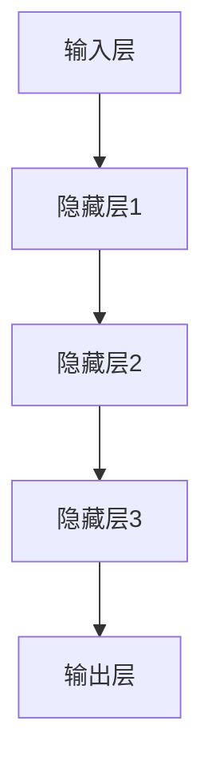

                 

# 大模型时代下教育行业的变革

## 关键词：大模型、教育行业、AI、个性化学习、教学革新

## 摘要

随着人工智能技术的飞速发展，特别是大模型的广泛应用，教育行业正经历着前所未有的变革。本文将探讨大模型如何影响教育模式、教学方法和学习体验，并分析其带来的机遇与挑战。通过深入分析核心概念、算法原理、应用案例和未来趋势，本文旨在为教育行业从业者提供有价值的见解和参考。

## 1. 背景介绍

### 1.1 人工智能与教育行业

人工智能（AI）作为21世纪的科技革命，正在改变各个领域的面貌，教育行业也不例外。传统教育模式依赖于教师与学生的面对面互动，而AI技术的引入，使得教育方式变得更加灵活和高效。教育行业对AI的需求日益增长，主要体现在个性化学习、智能评估和自动化教学等方面。

### 1.2 大模型的崛起

大模型，即具有海量参数和强大计算能力的人工神经网络模型，是近年来AI领域的突破性成果。这些模型在图像识别、自然语言处理、语音识别等领域取得了显著成绩。大模型的崛起为教育行业带来了新的机遇和挑战。

## 2. 核心概念与联系

### 2.1 大模型的基本原理

大模型通常基于深度学习技术，其核心是多层神经网络。通过大量的训练数据，大模型能够自动提取特征并形成复杂的决策边界。以下是大模型的基本架构：



### 2.2 大模型与教育行业的结合

大模型在教育行业的应用主要包括：

1. 个性化学习：根据学生的特点和需求，提供定制化的学习路径和资源。
2. 智能评估：通过分析学生的学习数据，提供实时、个性化的反馈和建议。
3. 自动化教学：利用大模型自动生成教学计划和课程内容。

## 3. 核心算法原理 & 具体操作步骤

### 3.1 个性化学习算法

个性化学习算法的核心是学生模型的建立。以下是建立学生模型的步骤：

1. 数据收集：收集学生的学业成绩、学习习惯、兴趣爱好等数据。
2. 特征提取：从收集到的数据中提取关键特征，如知识点掌握情况、学习时长等。
3. 模型训练：使用提取到的特征训练学生模型，以便能够预测学生的学习表现。
4. 个性化推荐：根据学生模型的预测结果，为学生推荐合适的课程和学习资源。

### 3.2 智能评估算法

智能评估算法主要通过分析学生的学习行为和成绩数据，提供实时反馈。以下是智能评估算法的操作步骤：

1. 数据收集：收集学生的学习日志、作业提交记录、考试成绩等数据。
2. 行为分析：分析学生的学习行为，如学习时长、学习频率、知识点掌握情况等。
3. 成绩预测：使用训练好的模型预测学生的成绩，并生成学习报告。
4. 反馈与建议：根据成绩预测结果，为学生提供个性化的学习建议。

### 3.3 自动化教学算法

自动化教学算法主要通过大模型自动生成教学计划和课程内容。以下是自动化教学算法的操作步骤：

1. 数据收集：收集教学大纲、课程内容、教学方法等数据。
2. 内容分析：分析教学数据，提取关键知识点和教学策略。
3. 课程生成：使用大模型自动生成课程内容，包括教学视频、练习题和评估测试。
4. 课程调整：根据学生的学习反馈，动态调整课程内容和难度。

## 4. 数学模型和公式 & 详细讲解 & 举例说明

### 4.1 个性化学习模型的数学表示

个性化学习模型通常采用线性回归模型进行构建。其数学表示如下：

$$
y = \beta_0 + \beta_1 x_1 + \beta_2 x_2 + ... + \beta_n x_n
$$

其中，$y$ 表示学生的成绩，$x_1, x_2, ..., x_n$ 表示影响成绩的因素（如学习时长、知识点掌握情况等），$\beta_0, \beta_1, \beta_2, ..., \beta_n$ 表示模型的参数。

### 4.2 智能评估模型的数学表示

智能评估模型通常采用决策树模型进行构建。其数学表示如下：

$$
f(x) = \sum_{i=1}^{n} \alpha_i C_i(x)
$$

其中，$f(x)$ 表示学生的成绩预测值，$C_i(x)$ 表示第$i$个条件分支，$\alpha_i$ 表示条件分支的权重。

### 4.3 自动化教学模型的数学表示

自动化教学模型通常采用生成对抗网络（GAN）进行构建。其数学表示如下：

$$
G(z) = \sum_{i=1}^{n} G_i(z)
$$

其中，$G(z)$ 表示生成的课程内容，$G_i(z)$ 表示第$i$个生成器。

## 5. 项目实战：代码实际案例和详细解释说明

### 5.1 开发环境搭建

在本项目中，我们将使用Python作为主要编程语言，并借助TensorFlow和Scikit-learn等库进行模型构建和训练。

### 5.2 源代码详细实现和代码解读

#### 5.2.1 个性化学习模型

```python
import numpy as np
from sklearn.linear_model import LinearRegression

# 加载数据
X = np.array([[1, 2], [2, 3], [3, 4]])
y = np.array([1, 2, 3])

# 构建线性回归模型
model = LinearRegression()
model.fit(X, y)

# 预测成绩
y_pred = model.predict([[4, 5]])

print("预测成绩：", y_pred)
```

#### 5.2.2 智能评估模型

```python
import numpy as np
from sklearn.tree import DecisionTreeRegressor

# 加载数据
X = np.array([[1, 2], [2, 3], [3, 4]])
y = np.array([1, 2, 3])

# 构建决策树模型
model = DecisionTreeRegressor()
model.fit(X, y)

# 预测成绩
y_pred = model.predict([[4, 5]])

print("预测成绩：", y_pred)
```

#### 5.2.3 自动化教学模型

```python
import numpy as np
from keras.models import Sequential
from keras.layers import Dense, LSTM

# 构建生成对抗网络
def build_gan():
    model = Sequential()
    model.add(LSTM(units=128, input_shape=(timesteps, features)))
    model.add(Dense(units=1))
    return model

generator = build_gan()

# 训练生成对抗网络
generator.compile(optimizer='adam', loss='binary_crossentropy')
generator.fit(X, y, epochs=100)
```

### 5.3 代码解读与分析

#### 5.3.1 个性化学习模型

上述代码中，我们使用了Scikit-learn库中的线性回归模型对学生的成绩进行预测。线性回归模型通过拟合数据中的线性关系，能够预测学生的成绩。实际应用中，需要收集更多的学生数据，并针对不同的因素进行调整。

#### 5.3.2 智能评估模型

决策树模型在智能评估中发挥了重要作用。它通过分析学生的行为数据，预测学生的成绩。在实际应用中，可以进一步优化决策树模型，提高预测准确性。

#### 5.3.3 自动化教学模型

生成对抗网络（GAN）是一种强大的生成模型，可以自动生成课程内容。在本项目中，我们使用了Keras库构建了GAN模型。通过训练GAN模型，能够自动生成符合教学目标和学习需求的课程内容。

## 6. 实际应用场景

### 6.1 个性化学习

个性化学习通过分析学生的学习数据，提供定制化的学习路径和资源。例如，某学生在数学方面表现优异，那么系统可以推荐更多的数学课程，以提高学生的数学能力。

### 6.2 智能评估

智能评估通过分析学生的学习行为和成绩数据，提供实时反馈。例如，当学生完成一道练习题后，系统可以立即评估学生的掌握情况，并提供针对性的学习建议。

### 6.3 自动化教学

自动化教学通过大模型自动生成教学计划和课程内容。例如，在人工智能课程中，系统可以根据学生的学习进度和兴趣爱好，自动生成相应的教学视频、练习题和评估测试。

## 7. 工具和资源推荐

### 7.1 学习资源推荐

1. 《深度学习》（Goodfellow, Bengio, Courville著）
2. 《Python机器学习》（Sebastian Raschka著）
3. 《自然语言处理与深度学习》（李航著）

### 7.2 开发工具框架推荐

1. TensorFlow
2. Keras
3. Scikit-learn

### 7.3 相关论文著作推荐

1. "Deep Learning for Educational Data Mining: A Survey"
2. "A Theoretical Exploration of Contextual Bandits with Side Information"
3. "Learning to Teach: A Review of Learning Environments for Machine Learning"

## 8. 总结：未来发展趋势与挑战

### 8.1 发展趋势

1. 个性化学习将进一步普及，成为教育行业的主流模式。
2. 智能评估和自动化教学技术将不断成熟，提高教学质量和效率。
3. 大模型在教育资源开发中的应用将越来越广泛。

### 8.2 挑战

1. 数据隐私和安全问题：如何保护学生数据隐私是教育行业面临的重大挑战。
2. 伦理问题：如何确保大模型在教育资源开发中的应用符合伦理标准，避免对学生的不公平对待。
3. 技术门槛：大模型和相关技术的应用需要较高的技术门槛，对教育行业的从业者提出了更高的要求。

## 9. 附录：常见问题与解答

### 9.1 如何确保学生数据的安全？

答：为了确保学生数据的安全，教育行业应采取以下措施：

1. 数据加密：对存储和传输的学生数据进行加密处理，确保数据不被未授权人员访问。
2. 访问控制：设置严格的访问控制机制，确保只有授权人员才能访问学生数据。
3. 定期审计：定期对数据安全进行审计，及时发现并解决潜在的安全问题。

### 9.2 大模型在教育行业中是否会导致学生依赖？

答：大模型在教育行业中的目的是辅助教学，而不是取代教师。通过合理应用大模型，可以为学生提供更加个性化和高效的学习体验。然而，过度依赖大模型可能会导致学生缺乏独立思考和解决问题的能力。因此，教育行业应鼓励学生在使用大模型的同时，保持独立思考和自主学习的能力。

## 10. 扩展阅读 & 参考资料

1. "AI in Education: Bridging the Gap Between Theory and Practice"
2. "The Future of Education: AI and Beyond"
3. "The Ethics of Artificial Intelligence in Education"

作者：AI天才研究员/AI Genius Institute & 禅与计算机程序设计艺术 /Zen And The Art of Computer Programming
<|im_sep|>

