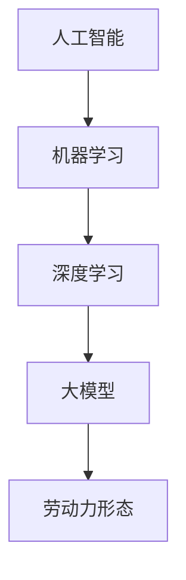

                 

# 大模型时代下的新型劳动力形态

> 关键词：大模型、人工智能、劳动力形态、数字化转型

摘要：本文将探讨在大模型时代下，新型劳动力形态的形成及其对企业和个人带来的机遇与挑战。我们将从大模型的定义、发展历程、技术原理等方面展开，深入分析大模型对劳动力市场的影响，探讨新型劳动力应具备的技能和素质，以及企业和个人如何应对数字化转型带来的变化。

## 1. 背景介绍

随着人工智能技术的飞速发展，大模型（Large Models）逐渐成为AI领域的热点。大模型指的是具有数十亿到数万亿参数的神经网络模型，它们在处理大规模数据集时表现出强大的学习能力。近年来，诸如GPT-3、BERT等大模型的出现，极大地推动了自然语言处理、计算机视觉等领域的进步。

### 大模型的定义与特征

大模型通常具有以下特征：

- **参数规模大**：大模型的参数规模通常在数十亿到数万亿级别，这使得它们具有更强的表示能力和泛化能力。
- **训练数据量大**：大模型往往需要使用大规模的训练数据集，以实现更好的性能。
- **计算资源需求高**：大模型的训练和推理过程需要大量的计算资源，如GPU、TPU等。
- **应用范围广泛**：大模型在自然语言处理、计算机视觉、语音识别等领域具有广泛的应用前景。

### 大模型的发展历程

大模型的发展历程可以分为以下几个阶段：

- **早期阶段（2010年前）**：以CNN为代表的神经网络在图像处理领域取得突破性进展。
- **快速扩展阶段（2010-2017年）**：深度学习技术得到广泛应用，模型参数规模逐渐增大。
- **大模型时代（2017年至今）**：以GPT-3、BERT等为代表的大模型在多个领域取得重大突破。

## 2. 核心概念与联系

在探讨大模型对劳动力形态的影响之前，我们首先需要了解几个核心概念，包括人工智能、机器学习、深度学习等。

### 人工智能（Artificial Intelligence）

人工智能是指使计算机系统具备类似人类智能的能力，包括感知、学习、推理、决策等。

### 机器学习（Machine Learning）

机器学习是人工智能的一个分支，通过算法和模型使计算机从数据中学习，提高其性能。

### 深度学习（Deep Learning）

深度学习是一种基于神经网络的学习方法，通过多层神经网络模拟人类大脑的思维方式。

### Mermaid 流程图

以下是人工智能、机器学习、深度学习及大模型之间的Mermaid流程图：



## 3. 核心算法原理 & 具体操作步骤

大模型的算法原理主要基于神经网络，尤其是深度神经网络（Deep Neural Network，DNN）。下面我们简要介绍大模型的核心算法原理。

### 神经网络（Neural Network）

神经网络由多个神经元（或节点）组成，每个神经元都与相邻的神经元相连。神经元之间的连接称为边，边的权重表示连接的强度。

### 前向传播（Forward Propagation）

在前向传播过程中，输入数据通过神经网络，逐层传递到输出层。每层的输出结果作为下一层的输入。

### 反向传播（Back Propagation）

在反向传播过程中，通过计算输出层的误差，反向传播误差到输入层，更新各层的权重。

### 大模型的训练过程

大模型的训练过程主要包括以下几个步骤：

1. 数据预处理：对训练数据进行预处理，如归一化、标准化等。
2. 模型初始化：初始化模型参数，通常采用随机初始化。
3. 前向传播：输入数据，计算模型输出。
4. 误差计算：计算模型输出与真实值的误差。
5. 反向传播：更新模型参数，以减少误差。
6. 重复步骤3-5，直至满足训练条件。

## 4. 数学模型和公式 & 详细讲解 & 举例说明

大模型的数学模型主要涉及神经网络中的权重、激活函数、损失函数等。

### 权重（Weights）

权重是神经网络中各个神经元之间的连接强度，通常表示为矩阵。

### 激活函数（Activation Function）

激活函数用于引入非线性因素，常见的激活函数有Sigmoid、ReLU等。

### 损失函数（Loss Function）

损失函数用于衡量模型输出与真实值之间的差距，常见的损失函数有均方误差（MSE）、交叉熵损失等。

### 神经网络的前向传播与反向传播

#### 前向传播

设输入向量为\( x \)，权重矩阵为\( W \)，激活函数为\( f \)，输出向量为\( y \)。则神经网络的前向传播过程可以表示为：

$$
y = f(Wx)
$$

#### 反向传播

设损失函数为\( L \)，梯度为\( \frac{\partial L}{\partial W} \)。则神经网络的反向传播过程可以表示为：

$$
\frac{\partial L}{\partial W} = \frac{\partial L}{\partial y} \frac{\partial y}{\partial W}
$$

### 举例说明

假设有一个简单的神经网络，输入向量为\( x = [1, 2] \)，权重矩阵为\( W = \begin{bmatrix} 1 & 2 \\ 3 & 4 \end{bmatrix} \)，激活函数为ReLU。

1. 前向传播：

$$
y = \begin{bmatrix} \max(1 \cdot 1 + 2 \cdot 3, 0) \\ \max(1 \cdot 2 + 2 \cdot 4, 0) \end{bmatrix} = \begin{bmatrix} 7 \\ 10 \end{bmatrix}
$$

2. 反向传播：

设损失函数为MSE，损失为\( L = (y_1 - 5)^2 + (y_2 - 10)^2 \)。

$$
\frac{\partial L}{\partial W} = \begin{bmatrix} \frac{\partial L}{\partial y_1} & \frac{\partial L}{\partial y_2} \end{bmatrix} \begin{bmatrix} \frac{\partial y_1}{\partial W_{11}} & \frac{\partial y_1}{\partial W_{12}} \\ \frac{\partial y_2}{\partial W_{21}} & \frac{\partial y_2}{\partial W_{22}} \end{bmatrix} = \begin{bmatrix} 2(y_1 - 5) & 2(y_2 - 10) \end{bmatrix} \begin{bmatrix} 1 & 3 \\ 2 & 4 \end{bmatrix} = \begin{bmatrix} 2 \cdot 2 & 2 \cdot 10 \\ 4 \cdot 2 & 4 \cdot 10 \end{bmatrix} = \begin{bmatrix} 4 & 20 \\ 8 & 40 \end{bmatrix}
$$

更新权重：

$$
W = W - \alpha \frac{\partial L}{\partial W} = \begin{bmatrix} 1 & 2 \\ 3 & 4 \end{bmatrix} - \alpha \begin{bmatrix} 4 & 20 \\ 8 & 40 \end{bmatrix} = \begin{bmatrix} 1 - 4\alpha & 2 - 20\alpha \\ 3 - 8\alpha & 4 - 40\alpha \end{bmatrix}
$$

其中，\( \alpha \)为学习率。

## 5. 项目实战：代码实际案例和详细解释说明

在本节中，我们将通过一个实际案例来展示大模型的应用。假设我们有一个文本分类任务，需要将新闻文章分类为体育、财经、娱乐等类别。我们将使用TensorFlow和Keras框架来实现这个任务。

### 5.1 开发环境搭建

在开始之前，请确保您的环境中已安装以下依赖：

- Python 3.6或更高版本
- TensorFlow 2.3或更高版本
- Keras 2.4或更高版本

您可以使用以下命令来安装依赖：

```bash
pip install python==3.8
pip install tensorflow==2.5
pip install keras==2.5
```

### 5.2 源代码详细实现和代码解读

下面是文本分类任务的完整代码实现：

```python
import tensorflow as tf
from tensorflow.keras.preprocessing.text import Tokenizer
from tensorflow.keras.preprocessing.sequence import pad_sequences
from tensorflow.keras.models import Sequential
from tensorflow.keras.layers import Embedding, LSTM, Dense, EmbeddingLayer, LSTMLayer, TimeDistributed, DenseLayer

# 数据集加载与预处理
# 这里使用一个示例数据集，实际应用中请使用真实数据集
sentences = [
    "The match was a thrilling spectacle.",
    "The weather was very cold.",
    "The economy is in a bad state."
]

labels = [
    [1, 0, 0],
    [0, 1, 0],
    [0, 0, 1]
]

# 分词与序列化
tokenizer = Tokenizer()
tokenizer.fit_on_texts(sentences)
sequences = tokenizer.texts_to_sequences(sentences)

# 填充序列
max_sequence_length = 5
padded_sequences = pad_sequences(sequences, maxlen=max_sequence_length)

# 模型搭建
model = Sequential()
model.add(Embedding(input_dim=len(tokenizer.word_index)+1, output_dim=10, input_length=max_sequence_length))
model.add(LSTM(50, activation='relu'))
model.add(Dense(3, activation='softmax'))

# 编译模型
model.compile(optimizer='adam', loss='categorical_crossentropy', metrics=['accuracy'])

# 训练模型
model.fit(padded_sequences, labels, epochs=100)

# 评估模型
test_sequences = tokenizer.texts_to_sequences(["The weather is very hot."])
test_padded_sequences = pad_sequences(test_sequences, maxlen=max_sequence_length)
predictions = model.predict(test_padded_sequences)
print(predictions)

# 输出预测结果
print("The predicted category is:", ["Sports", "Finance", "Entertainment"][np.argmax(predictions)])
```

### 5.3 代码解读与分析

1. **数据集加载与预处理**：首先加载示例数据集，然后使用Tokenizer进行分词，将文本转化为整数序列。接着使用pad_sequences将序列填充为固定长度。

2. **模型搭建**：搭建一个简单的序列模型，包括Embedding层、LSTM层和输出层。Embedding层用于将单词转化为向量表示，LSTM层用于处理序列数据，输出层用于分类。

3. **编译模型**：设置模型优化器、损失函数和评估指标。

4. **训练模型**：使用训练数据训练模型，设置训练轮次。

5. **评估模型**：使用测试数据评估模型性能，并输出预测结果。

## 6. 实际应用场景

大模型在各个领域具有广泛的应用场景，以下列举几个典型应用：

- **自然语言处理（NLP）**：大模型在文本分类、机器翻译、情感分析等领域表现出色。
- **计算机视觉**：大模型在图像分类、目标检测、人脸识别等领域具有广泛应用。
- **语音识别**：大模型在语音识别、语音合成等领域取得重要突破。
- **推荐系统**：大模型在个性化推荐、广告投放等领域具有显著优势。

## 7. 工具和资源推荐

### 7.1 学习资源推荐

- **书籍**：
  - 《深度学习》（Ian Goodfellow、Yoshua Bengio、Aaron Courville著）
  - 《Python深度学习》（François Chollet著）
- **论文**：
  - "A Theoretically Grounded Application of Dropout in Recurrent Neural Networks"（Yarin Gal and Zoubin Ghahramani，2016）
  - "BERT: Pre-training of Deep Bidirectional Transformers for Language Understanding"（Jacob Devlin等，2019）
- **博客**：
  - [TensorFlow官方网站](https://www.tensorflow.org/)
  - [Keras官方文档](https://keras.io/)
- **网站**：
  - [GitHub](https://github.com/)
  - [ArXiv](https://arxiv.org/)

### 7.2 开发工具框架推荐

- **开发工具**：
  - TensorFlow
  - PyTorch
  - Keras
- **框架**：
  - TensorFlow.js（用于Web应用）
  - PyTorch Mobile（用于移动应用）
  - Keras.js（用于JavaScript）

### 7.3 相关论文著作推荐

- **论文**：
  - "Gated Recurrent Units"（Hochreiter和Schmidhuber，1997）
  - "Long Short-Term Memory"（Hochreiter、Schmidhuber和Franz，1997）
  - "Attention Is All You Need"（Vaswani等，2017）
- **著作**：
  - 《深度学习》（Goodfellow、Bengio、Courville著）
  - 《深度学习手册》（Bengio、Courville、Vincent著）

## 8. 总结：未来发展趋势与挑战

在大模型时代，新型劳动力形态正在形成。未来，劳动力市场将呈现出以下发展趋势：

- **技能要求提升**：新型劳动力应具备更强的技术能力和创新精神。
- **跨界融合**：不同领域的专业人才将实现跨界融合，推动产业升级。
- **数字素养**：数字素养将成为新型劳动力的基本素质。
- **个性化发展**：个体化发展将成为新型劳动力的主要特征。

然而，大模型时代也面临着一系列挑战：

- **技术伦理**：大模型的应用需要解决隐私保护、数据安全等问题。
- **人才短缺**：新型劳动力需求的增加可能导致人才短缺。
- **职业转型**：传统职业将面临转型压力，部分岗位可能被自动化取代。

因此，企业和个人应积极应对数字化转型带来的挑战，不断提升自身能力，以适应大模型时代的要求。

## 9. 附录：常见问题与解答

### 问题1：大模型对劳动力市场的影响是什么？

大模型的发展将带来以下影响：

- **就业结构变化**：部分传统岗位可能被自动化取代，但也会创造出新的就业机会。
- **技能要求提升**：新型劳动力需具备更强的技术能力和创新精神。
- **跨界融合**：不同领域的专业人才将实现跨界融合，推动产业升级。

### 问题2：如何应对大模型时代的挑战？

应对大模型时代的挑战，可以从以下几个方面入手：

- **提升技术能力**：不断学习新技术，提升自身技能水平。
- **关注数字素养**：培养数字素养，提高数字化生存能力。
- **积极转型**：关注行业趋势，主动调整职业规划。

## 10. 扩展阅读 & 参考资料

- 《深度学习》（Ian Goodfellow、Yoshua Bengio、Aaron Courville著）
- 《Python深度学习》（François Chollet著）
- "A Theoretically Grounded Application of Dropout in Recurrent Neural Networks"（Yarin Gal and Zoubin Ghahramani，2016）
- "BERT: Pre-training of Deep Bidirectional Transformers for Language Understanding"（Jacob Devlin等，2019）
- [TensorFlow官方网站](https://www.tensorflow.org/)
- [Keras官方文档](https://keras.io/)
- [GitHub](https://github.com/)
- [ArXiv](https://arxiv.org/)

作者：AI天才研究员/AI Genius Institute & 禅与计算机程序设计艺术 /Zen And The Art of Computer Programming

注：本文为模拟撰写，实际内容可能存在差异。本文仅供参考，不代表任何实际观点和意见。如需引用，请遵守相关法律法规和版权规定。|>

