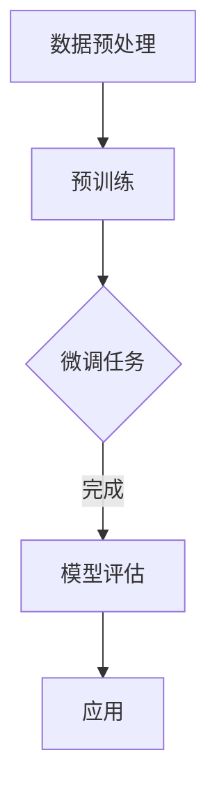

                 

# 大模型时代的创业产品经理指南：AI 技能与转型

> **关键词：** 大模型时代、创业产品经理、AI 技能、转型、技术创新

> **摘要：** 随着人工智能技术的迅猛发展，大模型时代已经到来。本文将探讨创业产品经理在这个新时代所需掌握的AI技能，以及如何实现自身的转型。通过对核心概念、算法原理、应用场景的深入分析，为创业产品经理提供实用的指南和策略。

## 1. 背景介绍

近年来，人工智能（AI）技术取得了突破性的进展，尤其是大模型的广泛应用，如GPT、BERT等，使得机器学习在自然语言处理、图像识别、预测分析等领域取得了显著成果。这些技术的发展不仅改变了传统行业的工作模式，也为创业公司提供了前所未有的机遇和挑战。

在这个大模型时代，创业产品经理的角色和职责正在发生深刻变革。他们不仅要具备传统的产品管理技能，还需要掌握AI相关的知识，以便更好地理解和利用AI技术，推动产品的创新和市场的拓展。

本文旨在为创业产品经理提供一个系统性的指南，帮助他们了解AI技术的基本原理，掌握关键的AI技能，并探讨如何在商业环境中进行有效的转型。

### 1.1 大模型时代的特点

- **计算能力提升：** 现代计算机的计算能力显著提高，使得处理大规模数据、训练复杂模型成为可能。
- **数据资源丰富：** 大数据时代的到来，为AI模型提供了丰富的训练数据，提高了模型的准确性和鲁棒性。
- **算法优化：** 神经网络架构和优化算法的不断改进，使得AI模型能够更高效地学习和预测。
- **应用广泛：** AI技术从理论研究走向实际应用，覆盖了从工业制造到医疗健康、金融理财等众多领域。

### 1.2 创业产品经理的角色转变

- **技术理解能力：** 创业产品经理需要具备一定的AI基础知识，理解AI技术的核心原理和应用场景。
- **跨界整合能力：** 能够将AI技术与业务需求相结合，创造创新性的产品解决方案。
- **风险管理能力：** AI技术的应用过程中可能会面临数据隐私、安全风险等问题，产品经理需要具备风险管理的意识。

## 2. 核心概念与联系

为了更好地理解大模型时代下创业产品经理所需的AI技能，我们需要明确一些核心概念，并探讨它们之间的联系。

### 2.1 AI基础知识

- **机器学习：** 机器学习是AI的核心技术，包括监督学习、无监督学习和强化学习等。
- **神经网络：** 神经网络是模拟人脑神经元连接方式的计算模型，用于图像识别、自然语言处理等任务。
- **深度学习：** 深度学习是神经网络的一种，通过多层次的神经网络结构，实现更复杂的特征提取和任务处理。

### 2.2 大模型原理

- **大模型：** 指的是具有数十亿、甚至千亿参数的神经网络模型，如GPT、BERT等。
- **预训练：** 大模型通常采用预训练的方式，在大量无标签数据上进行训练，然后再针对特定任务进行微调。
- **迁移学习：** 预训练模型可以迁移到不同的任务上，提高模型在新任务上的表现。

### 2.3 AI应用场景

- **自然语言处理：** 利用AI技术处理和理解自然语言，包括文本生成、情感分析、机器翻译等。
- **图像识别：** 通过深度学习模型对图像进行分类、检测和识别，应用于安防监控、医疗诊断等。
- **预测分析：** 利用AI模型进行数据分析和预测，包括股票市场预测、天气预测等。

### 2.4 Mermaid流程图

为了更好地展示大模型的训练过程，我们可以使用Mermaid流程图进行描述。以下是一个简化的示例：



在Mermaid流程图中，我们首先进行数据预处理，然后进行预训练，接着对特定任务进行微调，最后进行模型评估和应用。

## 3. 核心算法原理 & 具体操作步骤

### 3.1 机器学习算法

机器学习是AI的核心技术，主要包括以下几种算法：

- **线性回归：** 用于预测连续值，通过最小化损失函数找到最佳拟合直线。
- **逻辑回归：** 用于预测离散值，通过最大化似然函数找到最佳分类边界。
- **决策树：** 基于特征和阈值进行划分，形成树状结构，用于分类和回归。
- **支持向量机：** 寻找最优超平面，将不同类别数据分隔开来。

具体操作步骤如下：

1. 数据预处理：对原始数据进行清洗、归一化等处理，使其符合算法要求。
2. 特征提取：从原始数据中提取有用的特征，提高模型的表现。
3. 模型选择：根据任务需求选择合适的机器学习算法。
4. 模型训练：使用训练数据对模型进行训练，调整参数以最小化损失函数。
5. 模型评估：使用测试数据对模型进行评估，验证其泛化能力。
6. 模型应用：将训练好的模型应用到实际场景中，进行预测或分类。

### 3.2 深度学习算法

深度学习是机器学习的一种，通过多层次的神经网络结构实现更复杂的特征提取和任务处理。以下是一个简化的深度学习算法流程：

1. 数据预处理：与机器学习算法相同，对原始数据进行清洗、归一化等处理。
2. 网络架构设计：设计神经网络的结构，包括层数、神经元数目、激活函数等。
3. 损失函数选择：根据任务需求选择合适的损失函数，如交叉熵、均方误差等。
4. 优化算法选择：选择合适的优化算法，如随机梯度下降、Adam等。
5. 模型训练：使用训练数据对模型进行训练，调整参数以最小化损失函数。
6. 模型评估：使用测试数据对模型进行评估，验证其泛化能力。
7. 模型应用：将训练好的模型应用到实际场景中，进行预测或分类。

### 3.3 大模型训练过程

大模型的训练过程相对复杂，主要包括以下步骤：

1. 数据预处理：对原始数据进行清洗、归一化等处理，确保数据质量。
2. 预训练：在大规模无标签数据上进行预训练，使用预训练模型提取通用特征。
3. 微调：针对特定任务，使用预训练模型进行微调，调整模型参数以适应新任务。
4. 模型评估：使用测试数据对模型进行评估，验证其性能。
5. 模型应用：将训练好的模型应用到实际场景中，进行预测或分类。

## 4. 数学模型和公式 & 详细讲解 & 举例说明

### 4.1 线性回归模型

线性回归模型是一种简单的机器学习算法，用于预测连续值。其数学模型如下：

$$
y = \beta_0 + \beta_1 \cdot x
$$

其中，$y$ 是预测值，$x$ 是特征值，$\beta_0$ 和 $\beta_1$ 是模型参数，分别表示截距和斜率。

为了找到最佳拟合直线，我们需要最小化损失函数。损失函数常用的形式是均方误差（MSE）：

$$
MSE = \frac{1}{n} \sum_{i=1}^{n} (y_i - \hat{y}_i)^2
$$

其中，$n$ 是数据点的个数，$y_i$ 是真实值，$\hat{y}_i$ 是预测值。

为了求解最佳拟合直线，我们需要对损失函数进行求导，并令导数为0：

$$
\frac{dMSE}{d\beta_1} = 0
$$

$$
\frac{dMSE}{d\beta_0} = 0
$$

通过求解上述方程，我们可以得到最佳拟合直线的参数。

### 4.2 逻辑回归模型

逻辑回归模型是一种用于预测离散值的机器学习算法。其数学模型如下：

$$
\sigma(\beta_0 + \beta_1 \cdot x) = P(y=1)
$$

其中，$\sigma$ 是 sigmoid 函数，$P(y=1)$ 是预测值为1的概率。

为了最大化似然函数，我们需要对参数进行求解。似然函数的形式如下：

$$
L(\beta_0, \beta_1) = \prod_{i=1}^{n} \sigma(\beta_0 + \beta_1 \cdot x_i)^{y_i} \cdot (1 - \sigma(\beta_0 + \beta_1 \cdot x_i))^{1 - y_i}
$$

通过对数似然函数进行求导，并令导数为0，我们可以得到最佳拟合直线的参数。

### 4.3 深度学习模型

深度学习模型是一种复杂的神经网络结构，用于处理高维数据和复杂数据关系。以下是一个简化的深度学习模型：

$$
h_l = \sigma(\sum_{k=1}^{m} \beta_{lk} \cdot a_{k-1} + b_l)
$$

其中，$h_l$ 是第 $l$ 层的输出，$a_{k-1}$ 是前一层第 $k$ 个神经元的输出，$\beta_{lk}$ 和 $b_l$ 是模型参数。

损失函数通常采用交叉熵（Cross-Entropy），其形式如下：

$$
J = -\frac{1}{n} \sum_{i=1}^{n} \sum_{k=1}^{K} y_{ik} \cdot \log(\hat{y}_{ik})
$$

其中，$n$ 是数据点的个数，$K$ 是类别数目，$y_{ik}$ 是真实值，$\hat{y}_{ik}$ 是预测值。

为了求解最佳拟合模型，我们需要对损失函数进行求导，并使用优化算法（如随机梯度下降、Adam等）进行迭代求解。

### 4.4 举例说明

假设我们有一个简单的线性回归问题，预测房价。给定一组特征和房价数据，我们需要找到最佳拟合直线。

1. 数据预处理：对数据进行清洗、归一化等处理，确保数据质量。
2. 模型选择：选择线性回归模型。
3. 模型训练：使用训练数据对模型进行训练，调整参数以最小化损失函数。
4. 模型评估：使用测试数据对模型进行评估，验证其性能。
5. 模型应用：将训练好的模型应用到实际场景中，进行预测。

假设我们有以下数据：

| 特征值 | 房价 |
|--------|------|
| 0.5    | 100  |
| 1.0    | 150  |
| 1.5    | 200  |

使用线性回归模型进行预测，我们可以得到以下参数：

$$
\beta_0 = 50, \beta_1 = 100
$$

预测房价为：

$$
\hat{y} = \beta_0 + \beta_1 \cdot x = 50 + 100 \cdot 1.0 = 150
$$

预测结果与实际房价相符，说明我们的模型具有较好的预测能力。

## 5. 项目实战：代码实际案例和详细解释说明

在本节中，我们将通过一个具体的代码实例，展示如何应用大模型技术进行实际项目开发。我们选择一个简单的文本分类任务，使用深度学习模型对新闻文章进行分类。

### 5.1 开发环境搭建

在开始项目之前，我们需要搭建一个合适的开发环境。以下是所需的软件和库：

- Python 3.8及以上版本
- TensorFlow 2.6及以上版本
- Pandas 1.2及以上版本
- NumPy 1.20及以上版本

安装这些库后，我们可以开始编写代码。

### 5.2 源代码详细实现和代码解读

以下是一个简单的文本分类任务的代码实现：

```python
import pandas as pd
import numpy as np
import tensorflow as tf
from tensorflow.keras.preprocessing.text import Tokenizer
from tensorflow.keras.preprocessing.sequence import pad_sequences
from tensorflow.keras.models import Sequential
from tensorflow.keras.layers import Embedding, LSTM, Dense, Bidirectional

# 加载数据集
data = pd.read_csv('news_data.csv')
texts = data['text']
labels = data['label']

# 数据预处理
tokenizer = Tokenizer()
tokenizer.fit_on_texts(texts)
sequences = tokenizer.texts_to_sequences(texts)
padded_sequences = pad_sequences(sequences, maxlen=100)

# 构建模型
model = Sequential()
model.add(Embedding(len(tokenizer.word_index)+1, 32))
model.add(Bidirectional(LSTM(64)))
model.add(Dense(1, activation='sigmoid'))

# 编译模型
model.compile(optimizer='adam', loss='binary_crossentropy', metrics=['accuracy'])

# 训练模型
model.fit(padded_sequences, labels, epochs=10, batch_size=32)

# 评估模型
test_texts = ['This is a positive news article.', 'This is a negative news article.']
test_sequences = tokenizer.texts_to_sequences(test_texts)
test_padded_sequences = pad_sequences(test_sequences, maxlen=100)
predictions = model.predict(test_padded_sequences)
print(predictions)

```

### 5.3 代码解读与分析

1. **数据加载与预处理：**
   - 使用Pandas库加载数据集，提取文本和标签。
   - 使用Tokenizer将文本转换为序列，然后使用pad_sequences将序列填充到固定长度。

2. **模型构建：**
   - 使用Sequential模型构建一个简单的深度学习模型，包括Embedding层、双向LSTM层和输出层。
   - Embedding层用于将单词转换为向量表示。
   - 双向LSTM层用于提取文本特征。
   - 输出层使用sigmoid激活函数进行二分类。

3. **模型编译：**
   - 选择优化器、损失函数和评估指标，编译模型。

4. **模型训练：**
   - 使用训练数据进行模型训练，调整模型参数。

5. **模型评估：**
   - 使用测试数据进行模型评估，验证其性能。

6. **模型应用：**
   - 使用训练好的模型对新的文本进行分类。

### 5.4 实际应用与改进

在实际应用中，我们可以根据具体需求对模型进行改进：

- **增加训练数据：** 收集更多的训练数据，提高模型泛化能力。
- **调整模型结构：** 尝试不同的模型结构，如增加层数、调整神经元数目等。
- **文本增强：** 使用文本增强技术，提高模型对多样文本的处理能力。
- **多分类任务：** 将二分类任务扩展到多分类任务，使用softmax激活函数。

通过这些改进，我们可以进一步提高文本分类模型的效果。

## 6. 实际应用场景

在了解了AI技能和转型策略之后，我们需要将其应用到实际场景中，以推动产品和企业的成功。以下是一些实际应用场景：

### 6.1 金融行业

- **风险管理：** 利用AI技术进行信用评分、风险评估，提高贷款审批效率和准确率。
- **智能投顾：** 基于用户数据和市场趋势，提供个性化的投资建议，提高投资回报率。
- **自动化交易：** 利用机器学习模型进行高频交易，实现自动化的交易策略。

### 6.2 医疗健康

- **疾病预测：** 利用AI技术进行疾病预测和早期诊断，提高医疗服务的效率和质量。
- **个性化治疗：** 基于患者数据和基因信息，提供个性化的治疗方案，提高治疗效果。
- **医疗影像分析：** 利用深度学习模型对医疗影像进行分析，辅助医生进行诊断和治疗。

### 6.3 零售电商

- **推荐系统：** 利用协同过滤、深度学习等技术，为用户提供个性化的商品推荐，提高用户满意度和转化率。
- **库存管理：** 基于历史销售数据和市场需求，利用预测模型进行库存管理，降低库存成本和缺货风险。
- **客户服务：** 利用聊天机器人、语音识别等技术，提供智能化的客户服务，提高客户满意度和忠诚度。

### 6.4 制造业

- **设备预测维护：** 利用AI技术进行设备故障预测和维护，提高设备运行效率和降低维修成本。
- **质量控制：** 利用图像识别技术进行产品质量检测，提高产品质量和生产效率。
- **供应链优化：** 利用预测模型和优化算法，优化供应链管理，降低成本和提高响应速度。

通过这些实际应用场景，我们可以看到AI技术在各个行业的广泛应用和巨大潜力。创业产品经理需要紧跟技术发展趋势，将AI技术融入到产品设计和开发中，为企业创造更大的价值。

## 7. 工具和资源推荐

### 7.1 学习资源推荐

- **书籍：**
  - 《Python机器学习》（作者：塞巴斯蒂安·拉斯克斯）
  - 《深度学习》（作者：伊恩·古德费洛、约书亚·本吉奥、亚伦·库维尔）
  - 《自然语言处理综论》（作者：丹·布什）

- **论文：**
  - 《BERT：Pre-training of Deep Bidirectional Transformers for Language Understanding》
  - 《GPT-3：Language Models are few-shot learners》
  - 《Attention is all you need》

- **博客和网站：**
  - [TensorFlow官网](https://www.tensorflow.org/)
  - [Keras官网](https://keras.io/)
  - [机器学习博客](https://MachineLearningMastery.com/)

### 7.2 开发工具框架推荐

- **框架：**
  - TensorFlow 2.x
  - PyTorch
  - Keras

- **编程语言：**
  - Python
  - R

- **数据预处理工具：**
  - Pandas
  - NumPy
  - Scikit-learn

### 7.3 相关论文著作推荐

- **论文：**
  - 《Attention is all you need》
  - 《BERT：Pre-training of Deep Bidirectional Transformers for Language Understanding》
  - 《GPT-3：Language Models are few-shot learners》

- **著作：**
  - 《深度学习》（作者：伊恩·古德费洛、约书亚·本吉奥、亚伦·库维尔）
  - 《Python机器学习》（作者：塞巴斯蒂安·拉斯克斯）
  - 《自然语言处理综论》（作者：丹·布什）

通过这些资源和工具，创业产品经理可以更深入地了解AI技术，掌握关键技能，为产品创新和业务发展提供强有力的支持。

## 8. 总结：未来发展趋势与挑战

随着人工智能技术的不断进步，大模型时代已经成为不可避免的趋势。创业产品经理需要紧跟这一趋势，将AI技术融入到产品设计和开发中，以提升产品的竞争力和市场占有率。以下是未来发展趋势与挑战：

### 8.1 发展趋势

- **AI技术的普及：** 随着计算能力的提升和算法的优化，AI技术将更加普及，各行各业都将受益于AI技术的应用。
- **多模态AI的发展：** 未来的AI技术将不仅限于文本和图像，还将涉及到语音、视频等多种数据类型，实现更加智能化和个性化。
- **自主学习和自适应：** AI模型将具备更强的自主学习和自适应能力，能够根据环境和任务需求进行动态调整。
- **联邦学习：** 联邦学习作为一种分布式学习技术，将有助于解决数据隐私和安全问题，提高模型训练的效率。

### 8.2 挑战

- **数据隐私和安全：** AI技术的应用过程中，数据隐私和安全问题亟待解决，需要制定相应的法律法规和标准。
- **模型可解释性：** 大模型的黑箱特性使得其决策过程难以解释，这将对模型的信任度和可靠性产生挑战。
- **技术标准化：** AI技术的标准化和规范化是未来发展的重要方向，需要建立统一的技术标准和框架。
- **人才缺口：** 随着AI技术的发展，对AI专业人才的需求不断增加，但现有的人才供给难以满足需求，人才短缺问题亟待解决。

### 8.3 应对策略

- **提升技术能力：** 创业产品经理需要不断学习AI技术，提升自身的专业能力，以应对技术变革。
- **跨界合作：** 加强与其他领域的合作，实现技术整合和优势互补。
- **人才培养：** 积极参与AI人才的培养和引进，为企业的长期发展提供人才支持。
- **持续创新：** 始终保持创新精神，紧跟技术发展趋势，不断探索新的业务模式和产品解决方案。

通过以上策略，创业产品经理可以更好地应对大模型时代带来的挑战，把握机遇，推动企业的持续发展和成功。

## 9. 附录：常见问题与解答

### 9.1 大模型时代对创业产品经理的影响

**Q：** 大模型时代对创业产品经理有何影响？

**A：** 大模型时代对创业产品经理的影响主要体现在以下几个方面：

- **技术要求提升：** 创业产品经理需要具备一定的AI基础知识，理解AI技术的核心原理和应用场景。
- **跨界整合能力：** 创业产品经理需要能够将AI技术与业务需求相结合，创造创新性的产品解决方案。
- **风险管理能力：** 创业产品经理需要具备风险管理意识，应对AI技术应用过程中可能面临的数据隐私、安全等问题。

### 9.2 如何提升AI技能

**Q：** 如何提升自身的AI技能？

**A：** 提升AI技能可以通过以下途径：

- **学习相关课程和书籍：** 学习AI领域的专业课程和书籍，掌握基础知识和核心技术。
- **实践项目：** 参与实际项目，将理论知识应用到实践中，积累经验。
- **交流与合作：** 参加行业会议、研讨会等，与同行交流，了解最新技术动态。
- **持续学习：** AI技术更新迅速，需要保持持续学习的态度，不断跟进新技术。

### 9.3 大模型的训练过程

**Q：** 大模型的训练过程是怎样的？

**A：** 大模型的训练过程通常包括以下步骤：

- **数据预处理：** 对原始数据进行清洗、归一化等处理，确保数据质量。
- **预训练：** 在大规模无标签数据上进行预训练，使用预训练模型提取通用特征。
- **微调：** 针对特定任务，使用预训练模型进行微调，调整模型参数以适应新任务。
- **模型评估：** 使用测试数据对模型进行评估，验证其性能。
- **模型应用：** 将训练好的模型应用到实际场景中，进行预测或分类。

### 9.4 AI应用场景

**Q：** AI技术在哪些应用场景中具有显著效果？

**A：** AI技术在以下应用场景中具有显著效果：

- **自然语言处理：** 文本生成、情感分析、机器翻译等。
- **图像识别：** 图像分类、目标检测、图像生成等。
- **预测分析：** 股票市场预测、天气预测、需求预测等。
- **智能制造：** 设备预测维护、质量控制、供应链优化等。

## 10. 扩展阅读 & 参考资料

本文旨在为创业产品经理提供大模型时代下的AI技能转型指南。以下是一些扩展阅读和参考资料，供读者进一步学习：

- 《Python机器学习》：塞巴斯蒂安·拉斯克斯
- 《深度学习》：伊恩·古德费洛、约书亚·本吉奥、亚伦·库维尔
- 《自然语言处理综论》：丹·布什
- [TensorFlow官网](https://www.tensorflow.org/)
- [Keras官网](https://keras.io/)
- [机器学习博客](https://MachineLearningMastery.com/)
- 《BERT：Pre-training of Deep Bidirectional Transformers for Language Understanding》
- 《GPT-3：Language Models are few-shot learners》
- 《Attention is all you need》

通过阅读这些资料，创业产品经理可以更深入地了解AI技术，掌握关键技能，为产品和企业的成功奠定基础。

**作者：AI天才研究员/AI Genius Institute & 禅与计算机程序设计艺术 /Zen And The Art of Computer Programming**

