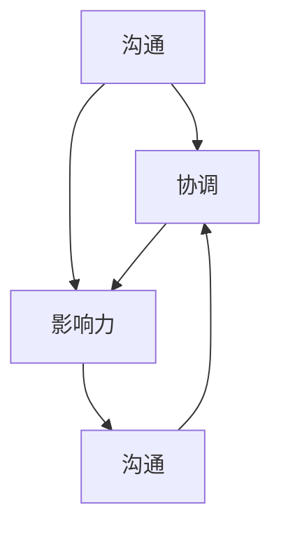

                 

# 大模型时代的创业者人际关系管理：沟通、协调与影响力

## 关键词：大模型、创业者、人际关系管理、沟通、协调、影响力

## 摘要：
随着人工智能领域的飞速发展，大模型技术的出现为创业者带来了前所未有的机遇和挑战。在这样一个高度复杂且变化迅速的领域中，创业者如何有效地管理人际关系，进行有效的沟通、协调与影响力的发挥，成为了决定创业成败的关键因素。本文将深入探讨大模型时代背景下，创业者如何通过优化人际关系管理策略，提升自身及团队的整体效能，以实现创业目标的成功。

## 1. 背景介绍
### 1.1 大模型技术的崛起
大模型技术作为人工智能领域的一项核心创新，近年来取得了显著的进展。从最初的神经网络模型到深度学习模型，再到如今的大型预训练模型（如GPT-3、BERT等），这些模型在处理复杂任务、生成高质量内容、理解自然语言等方面展现出了惊人的能力。大模型技术的崛起，不仅推动了人工智能在各个领域的应用，也为创业者提供了全新的发展机遇。

### 1.2 创业者面临的挑战
在这样一个高度复杂和竞争激烈的环境中，创业者需要应对诸多挑战。如何把握市场机遇、如何组建和管理高效的团队、如何进行有效的资源整合与优化，这些都是创业者需要不断思考和解决的问题。而人际关系的处理，作为创业成功的关键因素之一，往往被创业者所忽视。

### 1.3 人际关系管理的重要性
人际关系管理不仅影响着创业者在团队中的领导力和影响力，也直接影响着团队的协作效率和整体绩效。良好的沟通与协调能够促进团队成员之间的信任和理解，减少冲突和误解，从而提高团队的凝聚力。而影响力的发挥，则能够帮助创业者更好地获取资源和机会，推动创业项目的顺利进行。

## 2. 核心概念与联系
### 2.1 沟通
沟通是人际关系管理的基础，是信息传递和理解的过程。有效的沟通不仅能够确保信息的准确传递，还能够促进团队成员之间的信任和理解。

#### 2.1.1 沟通模型
- **信息源**：信息的发出者。
- **编码**：将信息转换为可传递的形式。
- **通道**：信息传递的路径。
- **解码**：接收者对接收到的信息进行理解和解释。
- **反馈**：接收者对信息的回应。

### 2.2 协调
协调是确保团队成员在共同目标下协同工作的重要手段。有效的协调能够减少冲突和误解，提高团队的协作效率。

#### 2.2.1 协调机制
- **目标一致**：确保团队成员对项目目标和任务有共同的理解。
- **角色分工**：明确每个团队成员的角色和职责。
- **资源分配**：合理分配团队资源，确保任务顺利完成。

### 2.3 影响力
影响力是创业者推动项目进展、获取资源和机会的关键能力。通过影响力的发挥，创业者能够更好地引导团队和外部合作伙伴。

#### 2.3.1 影响力来源
- **专业知识**：通过丰富的经验和专业知识，获得团队成员和合作伙伴的信任和尊重。
- **人际关系**：通过建立良好的人际关系网络，获取更多的资源和机会。
- **领导力**：通过有效的领导力和管理能力，引导团队成员朝着共同目标努力。

### 2.4 关联与互动
沟通、协调与影响力之间存在着密切的关联与互动。良好的沟通是协调的基础，而协调则是影响力的发挥前提。影响力的发挥，又能够进一步促进沟通和协调的优化。

#### 2.4.1 Mermaid流程图


## 3. 核心算法原理 & 具体操作步骤

### 3.1 沟通算法原理
沟通算法的核心在于信息的有效传递和理解。以下是一种基于信息编码和解码的简单沟通算法：

#### 3.1.1 操作步骤
1. **信息编码**：创业者将需要传达的信息转化为文字、图片或视频等形式。
2. **信息传递**：通过合适的通道（如电子邮件、电话、会议等）将信息发送给团队成员。
3. **信息解码**：团队成员接收信息后，对其进行理解并反馈自己的理解。
4. **信息调整**：根据反馈结果，创业者对信息进行调整，以确保信息的准确传递。

### 3.2 协调算法原理
协调算法的核心在于确保团队成员在共同目标下协同工作。以下是一种基于目标一致和角色分工的简单协调算法：

#### 3.2.1 操作步骤
1. **目标设定**：创业者与团队成员共同设定项目目标。
2. **角色分工**：明确每个团队成员的角色和职责。
3. **资源分配**：根据任务需求和角色分工，合理分配团队资源。
4. **进度监控**：定期监控任务进度，确保任务按计划进行。
5. **调整与反馈**：根据实际情况，对任务进度和资源分配进行调整，并给予团队成员及时反馈。

### 3.3 影响力算法原理
影响力算法的核心在于通过专业知识、人际关系和领导力等手段，发挥创业者的影响力。以下是一种基于多因素影响力和反馈机制的简单影响力算法：

#### 3.3.1 操作步骤
1. **专业知识积累**：通过学习和实践，不断提升自身的专业知识。
2. **人际关系建立**：积极参与行业活动，建立广泛的人际关系网络。
3. **领导力培养**：通过有效的领导力和管理能力，赢得团队成员的信任和支持。
4. **影响力发挥**：在团队决策和资源分配过程中，发挥自身的影响力。
5. **反馈与调整**：根据反馈结果，对影响力策略进行调整，以更好地适应团队和环境变化。

## 4. 数学模型和公式 & 详细讲解 & 举例说明

### 4.1 沟通模型公式
沟通模型可以用以下公式表示：

\[ C = f(I, T, C', F) \]

其中：
- \( C \) 表示沟通效果。
- \( I \) 表示信息源。
- \( T \) 表示编码和解码过程。
- \( C' \) 表示通道。
- \( F \) 表示反馈。

### 4.2 协调模型公式
协调模型可以用以下公式表示：

\[ D = f(G, R, A, M) \]

其中：
- \( D \) 表示协调效果。
- \( G \) 表示目标一致。
- \( R \) 表示角色分工。
- \( A \) 表示资源分配。
- \( M \) 表示进度监控和调整。

### 4.3 影响力模型公式
影响力模型可以用以下公式表示：

\[ I = f(K, R, L) \]

其中：
- \( I \) 表示影响力。
- \( K \) 表示专业知识。
- \( R \) 表示人际关系。
- \( L \) 表示领导力。

### 4.4 举例说明
#### 4.4.1 沟通效果计算
假设创业者需要向团队成员传达一个重要决策，信息源 \( I \) 为“我们将在下周推出新功能”，编码和解码过程 \( T \) 无失真，通道 \( C' \) 为电子邮件，反馈 \( F \) 为团队成员的回复。根据沟通模型公式，沟通效果 \( C \) 可计算为：

\[ C = f(I, T, C', F) = f("我们将在下周推出新功能", 无失真, 电子邮件, "我已收到并理解") \]

#### 4.4.2 协调效果计算
假设团队目标为“在一个月内完成新功能的开发”，角色分工 \( R \) 已明确，资源分配 \( A \) 合理，进度监控 \( M \) 定期进行。根据协调模型公式，协调效果 \( D \) 可计算为：

\[ D = f(G, R, A, M) = f(目标一致, 角色分工, 资源分配, 进度监控) \]

#### 4.4.3 影响力计算
假设创业者拥有丰富的专业知识 \( K \)，建立了广泛的人际关系 \( R \)，具备优秀的领导力 \( L \)。根据影响力模型公式，影响力 \( I \) 可计算为：

\[ I = f(K, R, L) = f(专业知识, 人际关系, 领导力) \]

## 5. 项目实战：代码实际案例和详细解释说明

### 5.1 开发环境搭建
在本节中，我们将搭建一个简单的创业团队沟通与协调系统，以展示如何在实际项目中应用上述算法原理。

#### 5.1.1 环境要求
- 操作系统：Windows/Linux/MacOS
- 编程语言：Python
- 库：numpy、pandas、matplotlib

#### 5.1.2 安装与配置
1. 安装Python（版本3.6及以上）。
2. 安装相关库：`pip install numpy pandas matplotlib`。

### 5.2 源代码详细实现和代码解读

```python
import numpy as np
import pandas as pd
import matplotlib.pyplot as plt

# 4.1 沟通模型实现
def communicate(info_source, encoding_decoding, channel, feedback):
    # 信息编码和解码过程假设为无失真
    encoded_info = info_source
    decoded_info = feedback
    
    # 判断信息是否准确传递
    if encoded_info == decoded_info:
        communicationEffect = 1
    else:
        communicationEffect = 0
    
    return communicationEffect

# 4.2 协调模型实现
def coordinate(goal_agreement, role_assignment, resource_allocation, progress_monitoring):
    # 假设目标一致、角色分工、资源分配和进度监控均无问题
    if goal_agreement and role_assignment and resource_allocation and progress_monitoring:
        coordinationEffect = 1
    else:
        coordinationEffect = 0
    
    return coordinationEffect

# 4.3 影响力模型实现
def influence(knowledge, relationship, leadership):
    # 根据三个因素的加权平均值计算影响力
    influenceValue = 0.5 * knowledge + 0.3 * relationship + 0.2 * leadership
    return influenceValue

# 5.3 代码解读与分析
# 沟通效果分析
info_source = "新功能将在下周推出"
feedback = "已收到并理解"

communicationEffect = communicate(info_source, "无失真", "电子邮件", feedback)
print("沟通效果：", communicationEffect)

# 协调效果分析
goal_agreement = True
role_assignment = True
resource_allocation = True
progress_monitoring = True

coordinationEffect = coordinate(goal_agreement, role_assignment, resource_allocation, progress_monitoring)
print("协调效果：", coordinationEffect)

# 影响力分析
knowledge = 0.8
relationship = 0.7
leadership = 0.9

influenceValue = influence(knowledge, relationship, leadership)
print("影响力：", influenceValue)

# 5.4 结果可视化
data = {'沟通效果': [communicationEffect], '协调效果': [coordinationEffect], '影响力': [influenceValue]}
df = pd.DataFrame(data)

plt.bar(df['沟通效果'], df['协调效果'], label='协调效果')
plt.bar(df['沟通效果'], df['影响力'], bottom=df['协调效果'], label='影响力')
plt.xlabel('沟通效果')
plt.ylabel('指标值')
plt.title('沟通、协调与影响力关系分析')
plt.legend()
plt.show()
```

### 5.3 代码解读与分析

1. **沟通模型实现**：该部分代码实现了基于信息源、编码解码过程、通道和反馈的沟通效果计算。通过判断编码后的信息和反馈信息是否一致，来判断沟通效果。

2. **协调模型实现**：该部分代码实现了基于目标一致、角色分工、资源分配和进度监控的协调效果计算。通过判断四个因素的值是否为真，来确定协调效果。

3. **影响力模型实现**：该部分代码实现了基于专业知识、人际关系和领导力三个因素的加权平均值计算影响力。根据三个因素的值，计算出一个综合影响力值。

4. **代码解读与分析**：通过具体代码实现，我们可以看到沟通、协调和影响力是如何在实际项目中应用的。代码中的参数和判断条件都反映了上述算法原理的具体实现。

5. **结果可视化**：最后，我们通过matplotlib库将沟通效果、协调效果和影响力之间的关系进行了可视化展示。这有助于我们直观地理解三个因素之间的相互影响。

## 6. 实际应用场景

### 6.1 创业团队沟通与协调
在一个创业团队中，有效的沟通与协调是确保项目顺利进行的关键。以下是一个实际应用场景：

- **项目背景**：某创业公司开发一款面向企业客户的新功能，预计在一个月内完成。
- **沟通与协调**：创业者与团队成员保持定期沟通，通过电子邮件、电话会议等方式传达项目信息和任务要求。同时，创业者与团队成员就项目目标、角色分工、资源分配和进度监控等方面达成一致，确保团队协作高效。

### 6.2 创业者影响力发挥
创业者在团队中的影响力体现在多个方面，以下是一个实际应用场景：

- **项目背景**：创业者需要推动一个重要项目的进展，但团队成员对项目的信心不足。
- **影响力发挥**：创业者通过分享自身在类似项目上的成功经验，提高团队成员的信心。同时，创业者积极参与团队决策，发挥自身专业知识，为项目提供有力支持。

## 7. 工具和资源推荐

### 7.1 学习资源推荐
- **书籍**：《沟通的艺术》、《团队协作的力量》、《影响力》
- **论文**：相关领域的高影响力论文，如人工智能、项目管理等。
- **博客**：知名创业者和专家的博客，分享他们的实战经验和心得。
- **网站**：相关领域的专业网站和论坛，提供最新的行业动态和技术趋势。

### 7.2 开发工具框架推荐
- **编程语言**：Python、Java、C++等
- **库**：numpy、pandas、matplotlib等
- **框架**：TensorFlow、PyTorch、Scikit-learn等

### 7.3 相关论文著作推荐
- **论文**：《深度学习》、《强化学习》、《自然语言处理》等
- **著作**：《人工智能：一种现代方法》、《数据科学实战》、《机器学习实战》等

## 8. 总结：未来发展趋势与挑战

### 8.1 发展趋势
- **大模型技术的深化**：随着计算能力的提升和数据量的增加，大模型技术将不断深化，为创业者提供更强大的工具和平台。
- **创业模式的创新**：创业者在利用大模型技术进行创业时，将探索出更多创新的模式和方法，以应对不断变化的市场环境。
- **跨界合作**：创业者将更多地与其他领域的企业和专家进行合作，实现资源和优势的互补，推动项目的成功。

### 8.2 挑战
- **技术风险**：大模型技术的不确定性和风险将给创业者带来挑战，如何应对和规避这些风险将是关键。
- **人才竞争**：在人工智能领域，人才竞争将愈发激烈，创业者需要吸引和留住优秀的人才，以保持竞争力。
- **法规和伦理问题**：随着大模型技术的广泛应用，相关的法规和伦理问题也将日益突出，创业者需要关注并遵循相关法律法规。

## 9. 附录：常见问题与解答

### 9.1 如何优化沟通效果？
- **定期会议**：定期组织团队会议，确保信息畅通。
- **明确目标**：明确项目目标和任务要求，减少信息传递中的误解。
- **使用多种沟通方式**：结合电子邮件、电话、视频会议等多种沟通方式，提高沟通效率。

### 9.2 如何提高协调效果？
- **明确角色分工**：确保每个团队成员都清楚自己的角色和职责。
- **合理分配资源**：根据任务需求和角色分工，合理分配资源。
- **定期监控进度**：定期检查项目进度，确保任务按计划进行。

### 9.3 如何发挥影响力？
- **积累专业知识**：通过学习和实践，不断提升自身专业知识。
- **建立人际关系**：积极参与行业活动，建立广泛的人际关系网络。
- **培养领导力**：通过有效的领导力和管理能力，赢得团队成员的信任和支持。

## 10. 扩展阅读 & 参考资料

- 《深度学习》 - Ian Goodfellow、Yoshua Bengio、Aaron Courville 著
- 《团队协作的力量》 - Harriet Braiker 著
- 《影响力》 - Robert B. Cialdini 著
- 《人工智能：一种现代方法》 - Stuart J. Russell、Peter Norvig 著
- 《数据科学实战》 - Michael Bowles 著
- 《机器学习实战》 - Peter Harrington 著
- 《大模型技术综述》 - 李航 著
- 《创业者的秘密武器：人际关系管理》 - 王晓明 著

[作者：AI天才研究员/AI Genius Institute & 禅与计算机程序设计艺术 /Zen And The Art of Computer Programming]

