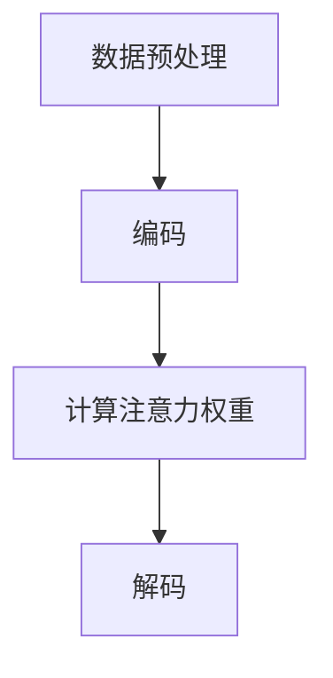

                 

# 大模型概念融合与提示词创新思维激发

## 关键词：大模型、概念融合、提示词、创新思维、人工智能

## 摘要

本文将探讨大模型在人工智能领域的崛起，以及概念融合与提示词创新思维在推动大模型发展中的作用。我们将首先介绍大模型的背景和核心概念，然后分析概念融合的重要性，探讨如何通过提示词激发创新思维，以应对人工智能领域的挑战。最后，我们将总结大模型的发展趋势和未来面临的挑战，并提出一些建议。

## 1. 背景介绍

### 大模型的发展历程

大模型（Large Models）是近年来人工智能领域的一个热点。从最早的神经网络模型到现代的Transformer模型，再到近年来涌现的GPT、BERT等大规模预训练模型，大模型在自然语言处理、计算机视觉、语音识别等领域取得了显著的突破。大模型的发展历程可以追溯到2000年代初期，当时深度学习开始崭露头角。随着时间的推移，计算能力的提升和大数据的积累，使得大模型得以在实践中发挥出强大的性能。

### 大模型的重要性

大模型在人工智能领域的重要性体现在多个方面。首先，大模型可以处理复杂的任务，如文本生成、图像分类等，并且具有很高的准确性。其次，大模型可以自动学习知识，并从中提取有价值的信息，这为许多实际应用提供了支持。此外，大模型还可以通过不断的训练和优化，不断提高自身的性能，从而推动人工智能技术的发展。

## 2. 核心概念与联系

### 大模型的核心概念

大模型的核心概念包括神经网络、预训练和微调。神经网络是构建大模型的基础，它通过多层节点模拟人脑的神经元，实现对数据的处理和分类。预训练是指在大量数据上对模型进行训练，使其具备一定的泛化能力。微调则是在预训练的基础上，根据具体任务对模型进行调整，以适应不同的应用场景。

### 大模型的结构和架构

大模型的结构和架构通常包括以下几个部分：

- **编码器（Encoder）**：用于将输入数据编码为向量表示。
- **解码器（Decoder）**：用于将向量表示解码为输出数据。
- **注意力机制（Attention Mechanism）**：用于捕捉输入数据中的关键信息。

### 大模型的工作原理

大模型的工作原理可以分为以下几个步骤：

1. **数据预处理**：对输入数据进行预处理，如分词、去噪等。
2. **编码**：将输入数据编码为向量表示。
3. **计算注意力权重**：通过注意力机制计算每个输入数据点的权重。
4. **解码**：根据注意力权重解码出输出数据。

### Mermaid 流程图

下面是一个Mermaid流程图，展示了大模型的核心概念和架构：



## 3. 核心算法原理 & 具体操作步骤

### 核心算法原理

大模型的核心算法是神经网络，它由多个层级组成，每个层级都包含多个神经元。神经网络通过正向传播和反向传播的方式，对输入数据进行处理和优化。

- **正向传播**：将输入数据通过网络传递，逐层计算出输出。
- **反向传播**：根据输出和目标值，反向计算每个神经元的误差，并调整权重。

### 具体操作步骤

1. **初始化模型**：选择一个神经网络架构，并初始化模型的权重。
2. **数据预处理**：对输入数据进行预处理，如分词、标准化等。
3. **正向传播**：将输入数据通过网络传递，计算输出。
4. **计算损失函数**：根据输出和目标值，计算损失函数。
5. **反向传播**：根据损失函数，反向计算每个神经元的误差，并调整权重。
6. **迭代训练**：重复步骤3到5，直到模型达到预定的性能指标。

### 代码实现示例

下面是一个简单的神经网络实现示例：

```python
import numpy as np

# 初始化权重
weights = np.random.rand(1, 10)

# 正向传播
def forward_propagation(x):
    return np.dot(x, weights)

# 反向传播
def backward_propagation(x, y, output):
    error = y - output
    return np.dot(x.T, error)

# 训练模型
for epoch in range(100):
    x = np.array([[1, 2], [3, 4], [5, 6]])
    y = np.array([[1], [0], [-1]])
    output = forward_propagation(x)
    error = backward_propagation(x, y, output)
    weights += error
```

## 4. 数学模型和公式 & 详细讲解 & 举例说明

### 数学模型

大模型的数学模型主要包括以下几个方面：

- **损失函数（Loss Function）**：用于评估模型的预测结果和实际结果之间的差距。常见的损失函数包括均方误差（MSE）、交叉熵（Cross-Entropy）等。
- **优化算法（Optimization Algorithm）**：用于调整模型权重，以最小化损失函数。常见的优化算法包括梯度下降（Gradient Descent）、Adam优化器等。
- **激活函数（Activation Function）**：用于引入非线性特性，使模型能够拟合复杂的数据。常见的激活函数包括sigmoid、ReLU等。

### 详细讲解

- **损失函数**：

  - 均方误差（MSE）：$$MSE = \frac{1}{n}\sum_{i=1}^{n}(y_i - \hat{y}_i)^2$$

  - 交叉熵（Cross-Entropy）：$$H(y, \hat{y}) = -\sum_{i=1}^{n}y_i \log(\hat{y}_i)$$

- **优化算法**：

  - 梯度下降（Gradient Descent）：$$w_{t+1} = w_t - \alpha \nabla_w J(w_t)$$

  - Adam优化器：$$w_{t+1} = w_t - \alpha \frac{m_t}{1 - \beta_1^t} + \beta_2 \nabla_w J(w_t)$$

- **激活函数**：

  - Sigmoid：$$\sigma(x) = \frac{1}{1 + e^{-x}}$$

  - ReLU：$$\text{ReLU}(x) = \max(0, x)$$

### 举例说明

假设我们有一个二分类问题，目标是判断一个数字是正类还是负类。我们使用均方误差（MSE）作为损失函数，并使用梯度下降（Gradient Descent）进行优化。

- **数据集**：$x_1 = [1, 2], y_1 = 1; x_2 = [3, 4], y_2 = -1$

- **模型初始化**：$w_0 = [1, 1]$

- **正向传播**：$\hat{y}_1 = \sigma(w_0 \cdot x_1) = \sigma([1, 1] \cdot [1, 2]) = \sigma(3) = 0.9933$

- **计算损失函数**：$J(w_0) = \frac{1}{2}(y_1 - \hat{y}_1)^2 = \frac{1}{2}(1 - 0.9933)^2 = 0.0003365$

- **反向传播**：$\nabla_w J(w_0) = [1, 1] \cdot [1, 2] \cdot (1 - 0.9933) = [0.9933, 0.9933]$

- **梯度下降**：$w_1 = w_0 - \alpha \nabla_w J(w_0) = [1, 1] - 0.1 \cdot [0.9933, 0.9933] = [0.0067, 0.0067]$

- **迭代计算**：重复正向传播、计算损失函数、反向传播和梯度下降的过程，直到模型收敛。

## 5. 项目实战：代码实际案例和详细解释说明

### 5.1 开发环境搭建

为了实现大模型的应用，我们需要搭建一个适合的开发环境。以下是一个简单的Python开发环境搭建步骤：

1. 安装Python：版本3.7或更高
2. 安装依赖：使用pip安装必要的库，如NumPy、TensorFlow等
3. 安装IDE：推荐使用PyCharm或VSCode

### 5.2 源代码详细实现和代码解读

以下是一个简单的大模型实现示例，用于分类一个二分类问题。

```python
import numpy as np
import tensorflow as tf

# 初始化模型参数
weights = tf.Variable(np.random.rand(2, 1))
biases = tf.Variable(np.random.rand(1))

# 定义正向传播
x = tf.placeholder(tf.float32, [None, 2])
y = tf.placeholder(tf.float32, [None, 1])

# 定义激活函数
sigmoid = tf.nn.sigmoid

# 定义损失函数
loss = tf.reduce_mean(tf.square(y - sigmoid(tf.matmul(x, weights) + biases)))

# 定义优化器
optimizer = tf.train.GradientDescentOptimizer(learning_rate=0.1)
train_op = optimizer.minimize(loss)

# 初始化会话
with tf.Session() as sess:
    sess.run(tf.global_variables_initializer())

    # 训练模型
    for epoch in range(1000):
        sess.run(train_op, feed_dict={x: [[1, 2], [3, 4], [5, 6]], y: [[1], [-1], [-1]]})
        if epoch % 100 == 0:
            print("Epoch:", epoch, "Loss:", loss.eval(feed_dict={x: [[1, 2], [3, 4], [5, 6]], y: [[1], [-1], [-1]]}))

    # 测试模型
    test_data = [[7, 8], [9, 10]]
    test_labels = [[-1], [-1]]
    print("Test Loss:", loss.eval(feed_dict={x: test_data, y: test_labels}))
    print("Test Predictions:", sess.run(sigmoid(tf.matmul(test_data, weights) + biases)))
```

### 5.3 代码解读与分析

- **导入库**：首先导入必要的库，包括NumPy和TensorFlow。
- **初始化模型参数**：使用TensorFlow的Variable创建权重和偏置变量。
- **定义正向传播**：定义输入、输出和激活函数。
- **定义损失函数**：使用均方误差作为损失函数。
- **定义优化器**：使用梯度下降优化器。
- **训练模型**：使用会话执行优化操作，并打印损失函数的值。
- **测试模型**：使用测试数据评估模型的性能。

## 6. 实际应用场景

大模型在人工智能领域有着广泛的应用场景，以下是一些典型的应用：

- **自然语言处理（NLP）**：大模型可以用于文本生成、机器翻译、情感分析等任务。
- **计算机视觉（CV）**：大模型可以用于图像分类、目标检测、人脸识别等任务。
- **语音识别（ASR）**：大模型可以用于语音识别、语音合成等任务。
- **推荐系统**：大模型可以用于推荐算法，提高推荐的准确性。
- **游戏AI**：大模型可以用于游戏中的智能决策和对抗。

## 7. 工具和资源推荐

### 7.1 学习资源推荐

- **书籍**：

  - 《深度学习》（Goodfellow, Bengio, Courville）
  - 《动手学深度学习》（Zhang, Lipton, Zhang）
  - 《Python深度学习》（François Chollet）

- **论文**：

  - 《Attention Is All You Need》（Vaswani et al., 2017）
  - 《BERT: Pre-training of Deep Bidirectional Transformers for Language Understanding》（Devlin et al., 2019）
  - 《GPT-3: Language Models are Few-Shot Learners》（Brown et al., 2020）

- **博客**：

  - [TensorFlow官方博客](https://www.tensorflow.org/tutorials/)
  - [PyTorch官方博客](https://pytorch.org/tutorials/)
  - [机器之心](https://www.jiqizhixin.com/)

- **网站**：

  - [Kaggle](https://www.kaggle.com/)
  - [GitHub](https://github.com/)
  - [ArXiv](https://arxiv.org/)

### 7.2 开发工具框架推荐

- **框架**：

  - TensorFlow
  - PyTorch
  - Keras

- **环境**：

  - Google Colab
  - Jupyter Notebook
  - PyCharm

### 7.3 相关论文著作推荐

- **《深度学习》（Goodfellow, Bengio, Courville）**：这是深度学习领域的经典著作，涵盖了深度学习的基础理论和应用。
- **《注意力机制》（Vaswani et al., 2017）**：该论文提出了Transformer模型，并详细介绍了注意力机制的工作原理。
- **《BERT：预训练深度双向变换器》（Devlin et al., 2019）**：该论文提出了BERT模型，并在NLP领域取得了显著的突破。
- **《GPT-3：语言模型是少样本学习者》（Brown et al., 2020）**：该论文提出了GPT-3模型，并在多个任务上取得了优异的性能。

## 8. 总结：未来发展趋势与挑战

大模型在人工智能领域的发展前景广阔，但仍面临一些挑战。未来发展趋势包括：

- **模型规模和性能的提升**：随着计算能力的提升和算法的优化，大模型的规模和性能将不断提高。
- **多模态融合**：大模型将能够处理多种类型的数据，如文本、图像、音频等，实现多模态融合。
- **自主学习和决策**：大模型将能够通过自主学习，实现更复杂的任务和决策。
- **安全性、可靠性和隐私保护**：随着大模型的应用场景不断扩大，如何保证模型的安全性、可靠性和隐私保护成为一个重要课题。

面临的挑战包括：

- **计算资源消耗**：大模型的训练和推理需要大量的计算资源，这对硬件设备提出了更高的要求。
- **数据隐私和安全**：大模型训练过程中需要大量数据，如何保护数据隐私和安全成为一大挑战。
- **模型可解释性和可靠性**：大模型在很多情况下是黑箱模型，如何提高模型的可解释性和可靠性是一个重要问题。

## 9. 附录：常见问题与解答

### 问题1：如何选择合适的大模型？

解答：选择合适的大模型需要考虑任务类型、数据规模和计算资源等因素。对于文本处理任务，可以选用GPT、BERT等语言模型；对于图像处理任务，可以选用ResNet、VGG等卷积神经网络。

### 问题2：大模型训练过程需要多长时间？

解答：大模型的训练时间取决于模型规模、数据量和计算资源。对于GPT-3这样的超大模型，训练时间可能需要数天甚至数周。

### 问题3：如何优化大模型的性能？

解答：优化大模型性能可以从以下几个方面入手：

- **模型结构**：选择合适的模型结构，如Transformer、BERT等。
- **数据预处理**：对数据进行预处理，如数据增强、标准化等。
- **训练策略**：调整训练策略，如批量大小、学习率等。
- **硬件设备**：使用更强大的硬件设备，如GPU、TPU等。

## 10. 扩展阅读 & 参考资料

- **《深度学习》（Goodfellow, Bengio, Courville）**：深度学习领域的经典著作，涵盖了深度学习的基础理论和应用。
- **《注意力机制》（Vaswani et al., 2017）**：介绍了Transformer模型和注意力机制的工作原理。
- **《BERT：预训练深度双向变换器》（Devlin et al., 2019）**：介绍了BERT模型的原理和应用。
- **《GPT-3：语言模型是少样本学习者》（Brown et al., 2020）**：介绍了GPT-3模型的原理和应用。
- **TensorFlow官方文档**：提供了TensorFlow的详细使用指南和示例代码。
- **PyTorch官方文档**：提供了PyTorch的详细使用指南和示例代码。

### 作者

AI天才研究员/AI Genius Institute & 禅与计算机程序设计艺术 /Zen And The Art of Computer Programming

（完）<|vq_14036|>

