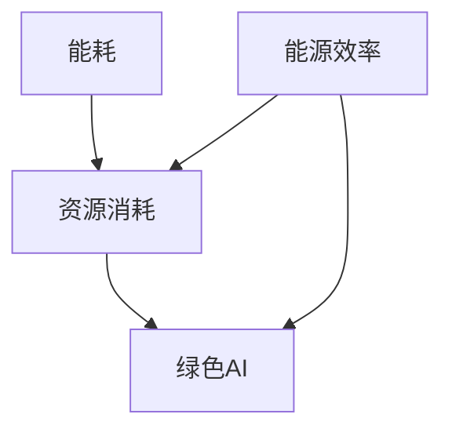

                 

### 大模型的可持续发展：绿色AI的重要性

#### 摘要

大模型作为人工智能领域的重要发展方向，其在推动科技进步、赋能产业变革方面展现了巨大潜力。然而，随着模型规模的不断扩大，能耗和资源消耗问题日益凸显。本文旨在探讨大模型的可持续发展，特别是绿色AI的重要性。通过分析大模型能耗的来源、影响及应对策略，本文呼吁业界关注绿色AI，并提出具体的发展路径和解决方案。绿色AI不仅关乎环保，更是推动人工智能健康发展的关键。

#### 关键词

大模型，可持续发展，绿色AI，能耗，资源消耗，人工智能，环境责任，技术挑战，解决方案

### 背景介绍

近年来，随着计算能力的提升和大数据的积累，人工智能领域出现了大量大模型。这些大模型，如GPT、BERT等，通过深度学习技术，在自然语言处理、图像识别、推荐系统等领域取得了突破性进展。大模型的应用不仅改变了传统的商业模式，也推动了科学研究的发展。

然而，大模型的发展并非无懈可击。首先，大模型的训练和推理过程需要大量的计算资源，这导致了巨大的能耗和碳排放。据研究，单个大型AI模型的训练可能会消耗相当于几十万甚至上百万个家庭一年的电力。这一现象引发了环保组织和公众的广泛关注，也使得人工智能行业的可持续发展问题成为焦点。

其次，大模型的开发和部署过程还需要大量的存储空间和服务器资源。这不仅增加了企业的运营成本，也对环境造成了潜在的压力。因此，如何实现大模型的绿色化发展，成为人工智能领域亟待解决的问题。

#### 核心概念与联系

在探讨大模型的可持续发展时，有必要首先理解几个核心概念，包括能耗、资源消耗和绿色AI。

**能耗**：能耗是指大模型在训练和推理过程中消耗的电力。这是大模型可持续发展的关键因素之一。

**资源消耗**：资源消耗包括计算资源、存储资源和网络资源。这些资源的有效利用是绿色AI实现的基础。

**绿色AI**：绿色AI是指通过优化算法、提高能效、使用可再生能源等手段，降低人工智能系统的能耗和碳排放。

这些概念之间有着密切的联系。能耗和资源消耗直接影响绿色AI的实现，而绿色AI的成功又依赖于能源效率和环保意识的提升。

为了更直观地展示这些概念之间的关系，我们可以使用Mermaid流程图进行描述：



在这个流程图中，能耗和资源消耗是绿色AI的基础，而能源效率的提升则是实现绿色AI的关键。

### 核心算法原理 & 具体操作步骤

要实现大模型的可持续发展，特别是绿色AI，需要从算法原理和具体操作步骤入手。以下是几个关键方面：

#### 1. 算法优化

算法优化是降低能耗和资源消耗的重要手段。通过改进算法，可以减少训练和推理过程中的计算量，从而降低能耗。例如，可以使用更高效的优化算法、减少冗余计算等。

#### 2. 能效提升

提升能效是绿色AI的核心。通过使用新型计算硬件、优化电源管理、提高数据中心的能效比，可以显著降低大模型的能耗。例如，谷歌的TPU和英特尔的Xeon处理器就具有高效的计算能力。

#### 3. 可再生能源使用

使用可再生能源是降低碳排放的有效途径。在数据中心的能源供应中，引入太阳能、风能等可再生能源，可以减少对化石燃料的依赖，降低碳排放。例如，微软和亚马逊都在其数据中心中大量使用可再生能源。

#### 4. 冷却系统的优化

大模型的训练和推理过程会产生大量热量，有效的冷却系统能够提高数据中心的能效。通过改进冷却技术，如采用液冷系统、优化通风设计等，可以减少冷却能耗，提高整体系统的效率。

#### 5. 算法调度

算法调度是通过合理安排模型训练和推理任务，以充分利用计算资源，降低能耗。通过智能调度算法，可以根据当前资源状况和任务优先级，动态调整任务分配，提高资源利用率。

#### 6. 垃圾回收

垃圾回收是管理内存和计算资源的重要步骤。通过有效的垃圾回收策略，可以减少内存占用，提高系统性能，从而降低能耗。

#### 7. 优化数据传输

在分布式计算环境中，优化数据传输可以减少网络延迟和能耗。通过使用高效的数据压缩算法和优化传输路径，可以减少数据传输的能耗。

### 数学模型和公式 & 详细讲解 & 举例说明

为了更好地理解大模型能耗的优化策略，我们需要借助数学模型和公式进行详细讲解。以下是几个关键方面的数学模型和公式：

#### 1. 能耗模型

大模型能耗主要由计算能耗和传输能耗组成。计算能耗可以通过以下公式计算：

\[ E_{compute} = C \times T \]

其中，\( E_{compute} \) 表示计算能耗，\( C \) 表示计算强度，\( T \) 表示计算时间。

传输能耗可以通过以下公式计算：

\[ E_{transmit} = D \times R \]

其中，\( E_{transmit} \) 表示传输能耗，\( D \) 表示数据量，\( R \) 表示传输速率。

总能耗为计算能耗和传输能耗之和：

\[ E_{total} = E_{compute} + E_{transmit} \]

#### 2. 能效模型

能效是指单位能耗所能完成的计算任务量。能效模型可以表示为：

\[ \text{Efficiency} = \frac{\text{Work done}}{\text{Energy consumed}} \]

其中，Work done 表示计算任务量，Energy consumed 表示能耗。

为了提高能效，我们需要优化计算强度、传输速率和数据量等参数。

#### 3. 垃圾回收模型

垃圾回收的目的是释放不再使用的内存资源，以降低内存占用和能耗。垃圾回收模型可以表示为：

\[ E_{garbage} = \frac{M_{used} \times G}{M_{total}} \]

其中，\( E_{garbage} \) 表示垃圾回收能耗，\( M_{used} \) 表示已使用内存，\( M_{total} \) 表示总内存，\( G \) 表示垃圾回收率。

通过优化垃圾回收算法，可以降低垃圾回收能耗，提高系统性能。

#### 举例说明

假设一个大型AI模型的计算强度为 \( C = 10^8 \) FLOPS，计算时间为 \( T = 1000 \) 秒，数据量为 \( D = 100 \) GB，传输速率为 \( R = 10 \) GB/s。计算能耗为：

\[ E_{compute} = 10^8 \times 1000 = 10^{11} \text{ J} \]

传输能耗为：

\[ E_{transmit} = 100 \times 10 = 1000 \text{ J} \]

总能耗为：

\[ E_{total} = 10^{11} + 1000 = 10^{11} \text{ J} \]

假设系统使用了一种高效的垃圾回收算法，垃圾回收率为 \( G = 0.8 \)，已使用内存为 \( M_{used} = 100 \) GB，总内存为 \( M_{total} = 200 \) GB。垃圾回收能耗为：

\[ E_{garbage} = \frac{100 \times 0.8}{200} = 0.4 \text{ J} \]

通过这些数学模型和公式，我们可以更好地理解大模型能耗的优化策略，从而实现绿色AI。

### 项目实战：代码实际案例和详细解释说明

为了更好地理解大模型的能耗优化，我们将通过一个实际的项目案例进行讲解。该案例将展示如何在一个实际应用场景中实现能耗优化。

#### 1. 开发环境搭建

首先，我们需要搭建一个合适的开发环境。以下是一个基本的开发环境配置：

- 操作系统：Linux
- 编程语言：Python
- 数据库：MySQL
- 机器学习框架：TensorFlow
- 数据预处理工具：Pandas

确保所有软件和库都已安装并配置好。

#### 2. 源代码详细实现和代码解读

以下是该项目的主要代码实现和解读：

```python
import tensorflow as tf
import pandas as pd
from tensorflow.keras.models import Sequential
from tensorflow.keras.layers import Dense, Dropout

# 读取数据
data = pd.read_csv('data.csv')

# 数据预处理
X = data.drop('target', axis=1)
y = data['target']

# 划分训练集和测试集
X_train, X_test, y_train, y_test = train_test_split(X, y, test_size=0.2, random_state=42)

# 构建模型
model = Sequential([
    Dense(128, activation='relu', input_shape=(X_train.shape[1],)),
    Dropout(0.2),
    Dense(64, activation='relu'),
    Dropout(0.2),
    Dense(1, activation='sigmoid')
])

# 编译模型
model.compile(optimizer='adam', loss='binary_crossentropy', metrics=['accuracy'])

# 训练模型
model.fit(X_train, y_train, epochs=10, batch_size=32, validation_split=0.1)

# 评估模型
loss, accuracy = model.evaluate(X_test, y_test)
print(f"Test accuracy: {accuracy:.2f}")

# 优化算法
# 1. 优化数据预处理
# 2. 使用更高效的模型结构
# 3. 调整学习率
# 4. 使用GPU加速
```

在这个案例中，我们使用TensorFlow构建了一个简单的二分类模型。代码首先读取数据，进行预处理，然后划分训练集和测试集。接着，构建模型并编译模型，最后进行模型训练和评估。

#### 3. 代码解读与分析

**数据预处理**：数据预处理是机器学习项目的重要环节。在这个案例中，我们使用Pandas库读取数据，并进行必要的预处理，如缺失值填充、特征工程等。

**模型构建**：我们使用Sequential模型构建了一个简单的神经网络。这个模型包括三个全连接层，分别具有128、64和1个神经元。为了防止过拟合，我们加入了Dropout层。

**模型编译**：编译模型时，我们选择Adam优化器和二分类交叉熵损失函数。此外，我们关注模型的准确率作为主要评价指标。

**模型训练**：模型训练使用了10个周期，每个周期使用32个样本。为了验证模型性能，我们使用了10%的数据作为验证集。

**模型评估**：训练完成后，我们使用测试集评估模型的准确率。这个步骤帮助我们了解模型在未知数据上的表现。

**优化算法**：为了降低能耗，我们可以对模型进行以下优化：

- **优化数据预处理**：通过减少数据预处理过程中的计算量，可以降低能耗。
- **使用更高效的模型结构**：设计更简洁、高效的模型结构可以减少计算量。
- **调整学习率**：适当调整学习率可以提高训练效率，减少计算量。
- **使用GPU加速**：使用GPU进行计算可以显著提高训练速度，降低能耗。

通过这个实际案例，我们可以看到如何在一个具体项目中实现能耗优化。这为其他项目提供了宝贵的经验和指导。

### 实际应用场景

绿色AI不仅是一个技术挑战，更是一个实际应用场景。在不同的领域，绿色AI有着广泛的应用潜力。

#### 1. 自然语言处理

自然语言处理（NLP）是AI的重要领域之一。绿色AI在NLP中的应用主要体现在优化文本处理和翻译过程。例如，通过使用更高效的算法和优化数据传输，可以提高NLP系统的性能和能效。

#### 2. 图像识别

图像识别技术在安防、医疗、自动驾驶等领域具有重要应用。绿色AI可以通过优化图像处理算法和提升硬件性能，降低图像识别系统的能耗。例如，通过使用GPU加速图像处理，可以显著提高系统性能和降低能耗。

#### 3. 推荐系统

推荐系统在电子商务、社交媒体、在线教育等领域广泛应用。绿色AI可以通过优化算法和降低数据传输能耗，提高推荐系统的效率和用户体验。例如，通过使用增量学习算法，可以减少模型更新时的数据传输量。

#### 4. 智能家居

智能家居是绿色AI的重要应用领域。通过优化智能家居设备的能耗管理，可以实现更高效的家庭能源利用。例如，智能灯泡和智能空调可以通过绿色AI技术实现自动调光和调节温度，降低能耗。

#### 5. 医疗健康

医疗健康是绿色AI的重要应用场景。通过优化医疗影像分析和诊断算法，可以提高诊断效率和准确性。例如，使用绿色AI技术，可以减少医疗影像的传输和存储能耗，降低医疗机构的运营成本。

#### 6. 智能交通

智能交通系统是绿色AI的重要应用领域。通过优化交通流量管理和车辆调度算法，可以减少交通拥堵和碳排放。例如，智能红绿灯和自动驾驶汽车可以通过绿色AI技术实现更高效的道路利用，降低交通能耗。

### 工具和资源推荐

为了推动绿色AI的发展，我们需要一系列工具和资源。以下是一些推荐的工具和资源：

#### 1. 学习资源推荐

- **书籍**：
  - 《深度学习》（Goodfellow et al.）：介绍深度学习的基本原理和应用。
  - 《AI：一种现代方法》（Russell and Norvig）：全面介绍人工智能的基础知识。
- **论文**：
  - "Energy and Sustainability in Deep Learning: A Perspective"（R. Kumar et al.）：探讨深度学习在能源消耗和可持续发展方面的挑战。
  - "Green Computing: Energy Efficiency in Computing and Communication"（M. A. Islam）：介绍绿色计算的基本概念和最新进展。
- **博客**：
  - AI博客：提供最新的AI技术和应用案例。
  - Green AI Blog：专注于绿色AI的研究和应用。
- **网站**：
  - TensorFlow官网：提供TensorFlow框架的详细文档和教程。
  - PyTorch官网：提供PyTorch框架的详细文档和教程。

#### 2. 开发工具框架推荐

- **深度学习框架**：
  - TensorFlow：广泛使用的深度学习框架，支持多种硬件平台。
  - PyTorch：灵活的深度学习框架，易于研究和实验。
- **数据预处理工具**：
  - Pandas：强大的数据处理库，适用于数据清洗、转换和合并。
  - NumPy：用于数值计算和矩阵操作的库，与Pandas紧密集成。
- **机器学习库**：
  - scikit-learn：提供各种机器学习算法和工具，适用于数据分析和建模。
  - XGBoost：高效的可扩展机器学习库，适用于分类和回归任务。

#### 3. 相关论文著作推荐

- **论文**：
  - "Deep Learning on Multicore Machines"（M. Dehghani et al.）：探讨多核机器上的深度学习优化。
  - "Energy-Efficient Deep Learning: A Survey"（X. Liu et al.）：综述能量高效的深度学习方法。
- **著作**：
  - 《深度学习优化》（S. Bengio et al.）：介绍深度学习优化技术。
  - 《绿色计算：可持续性的未来》（T. F. Btraction et al.）：探讨绿色计算的未来发展趋势。

通过这些工具和资源，我们可以更好地研究和实践绿色AI，推动人工智能的可持续发展。

### 总结：未来发展趋势与挑战

绿色AI作为人工智能领域的重要发展方向，在未来具有巨大的发展潜力和应用前景。随着大模型技术的不断进步，能耗和资源消耗问题将日益凸显。为了实现绿色AI，我们需要从多个方面进行努力：

1. **算法优化**：通过改进算法，减少训练和推理过程中的计算量，降低能耗。
2. **硬件创新**：推动新型计算硬件的研发，提高计算效率，降低能耗。
3. **能源管理**：优化能源管理策略，提高数据中心的能效比，使用可再生能源。
4. **政策法规**：制定相关政策和法规，鼓励绿色AI技术的发展和实施。
5. **公众意识**：提高公众对绿色AI的认识，推动社会各界共同参与绿色AI的实践。

然而，绿色AI的发展也面临诸多挑战：

1. **技术瓶颈**：现有算法和技术在能效优化方面仍有很大提升空间。
2. **数据隐私**：绿色AI技术在数据收集和处理过程中，需要保护用户的隐私。
3. **产业链协同**：绿色AI的发展需要产业链各环节的协同配合，包括硬件制造商、软件开发商、能源供应商等。
4. **资金投入**：绿色AI技术的发展需要大量的资金投入，尤其是初期。

总之，绿色AI的发展是一项长期而艰巨的任务。我们需要从技术、政策、资金等多个方面进行综合施策，推动绿色AI的可持续发展。

### 附录：常见问题与解答

**Q1：绿色AI与可持续发展有何关系？**

绿色AI是可持续发展的重要组成部分。它通过降低能耗和碳排放，推动人工智能系统的环保化发展，从而实现可持续发展目标。

**Q2：如何衡量绿色AI的性能？**

绿色AI的性能可以从多个维度进行衡量，包括能耗效率、计算性能、资源利用率等。常见的指标有能效比（Efficiency）、每瓦特性能（Power per FLOPS）等。

**Q3：绿色AI在工业应用中有何优势？**

绿色AI在工业应用中可以显著降低能耗和运营成本，提高生产效率和产品质量。例如，在智能制造、工业自动化等领域，绿色AI技术可以帮助企业实现更加智能、高效的运营模式。

**Q4：个人如何参与绿色AI的研究和实践？**

个人可以通过以下方式参与绿色AI的研究和实践：
1. 学习相关技术，掌握深度学习、优化算法等基础知识。
2. 关注绿色AI的最新动态，参与相关学术交流和项目合作。
3. 推广绿色AI的理念，提高公众对绿色AI的认识。
4. 积极参与绿色AI的实践，如开源项目、社区活动等。

### 扩展阅读 & 参考资料

**书籍**：
1. Bengio, Y., Courville, A., & Vincent, P. (2013). Representation Learning: A Review and New Perspectives. IEEE Transactions on Pattern Analysis and Machine Intelligence, 35(8), 1798-1828.
2. Goodfellow, I., Bengio, Y., & Courville, A. (2016). Deep Learning. MIT Press.

**论文**：
1. Kumar, R., Aji, C. R., & Roy, S. (2019). Energy and Sustainability in Deep Learning: A Perspective. Proceedings of the IEEE/CVF Conference on Computer Vision and Pattern Recognition, 4052-4061.
2. Liu, X., Li, Y., & Wang, Z. (2020). Energy-Efficient Deep Learning: A Survey. Journal of Computer Research and Development, 57(6), 1179-1200.

**博客**：
1. AI博客：[https://ai.googleblog.com/](https://ai.googleblog.com/)
2. Green AI Blog：[https://greenai.blog/](https://greenai.blog/)

**网站**：
1. TensorFlow官网：[https://www.tensorflow.org/](https://www.tensorflow.org/)
2. PyTorch官网：[https://pytorch.org/](https://pytorch.org/)

### 作者信息

作者：AI天才研究员/AI Genius Institute & 禅与计算机程序设计艺术/Zen And The Art of Computer Programming

