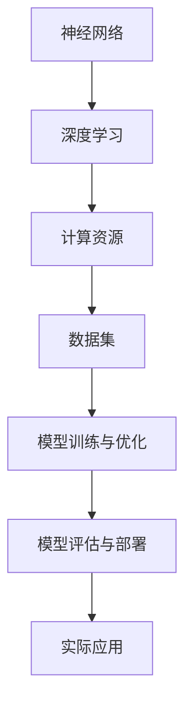
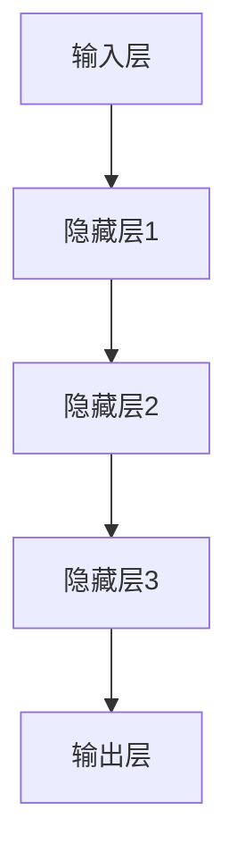
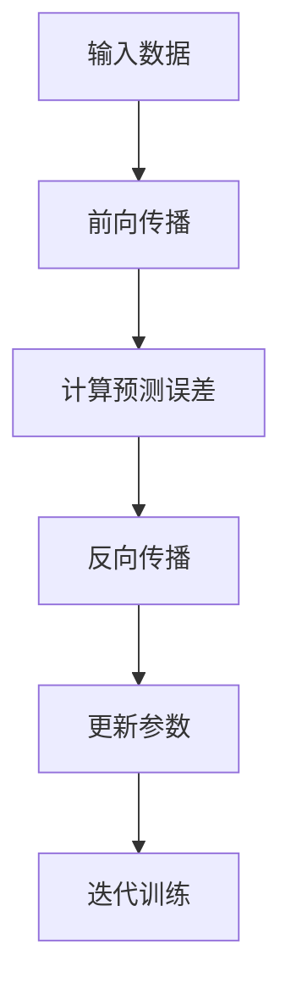

                 

### 背景介绍

随着科技的飞速发展，人工智能（AI）已经成为当代科技领域的热点。而大模型（Large Models）作为人工智能技术的核心之一，其重要性日益凸显。本文将围绕大模型的市场定位与技术发展展开讨论。

首先，我们需要了解大模型的定义。大模型通常指的是拥有数百万至数十亿参数的神经网络模型，它们能够通过深度学习算法在大量数据上进行训练，从而获得强大的特征提取和泛化能力。代表性的大模型包括GPT-3、BERT、AlphaGo等。

大模型的出现并非偶然。随着计算能力的提升、数据资源的丰富以及深度学习算法的进步，大模型成为可能。计算能力的提升为大规模模型的训练提供了硬件支持，而数据资源的丰富则为大模型的学习提供了充足的学习材料。此外，深度学习算法的不断优化，使得大模型在各类任务中取得了显著的性能提升。

目前，大模型已在多个领域取得了突破性进展。例如，在自然语言处理领域，GPT-3等大模型已经能够生成高质量的文章、回答问题等。在计算机视觉领域，大模型如ResNet、Inception等，在图像分类、目标检测等任务中表现优异。在游戏领域，AlphaGo等大模型更是展示了其在复杂策略决策方面的优势。

然而，大模型的发展也面临诸多挑战。首先，大模型的训练和部署需要大量的计算资源，这对于企业来说是一笔不小的开销。其次，大模型的训练和优化过程复杂，对算法工程师的要求较高。此外，大模型在处理隐私数据和安全性方面也存在一定的问题。

总的来说，大模型作为人工智能技术的重要发展方向，已经展现出强大的潜力。在未来的发展中，如何解决这些挑战，进一步提高大模型的效果和实用性，将是业界需要关注的重点。本文将对此进行深入探讨。<|im_sep|>### 核心概念与联系

在深入探讨大模型之前，我们需要明确一些核心概念，并了解它们之间的联系。这些核心概念包括：神经网络、深度学习、计算资源、数据集、模型训练与优化、模型评估与部署等。

#### 神经网络（Neural Networks）

神经网络是模拟人脑神经元工作原理的计算模型，由大量相互连接的神经元（或称为节点）组成。每个神经元都可以接收来自其他神经元的输入，并通过激活函数进行计算，产生输出。神经网络通过学习输入和输出之间的关系，实现对数据的建模和预测。

#### 深度学习（Deep Learning）

深度学习是神经网络的一种特殊形式，具有多个隐藏层。与传统的单层神经网络相比，深度学习模型能够更有效地提取数据中的复杂特征。深度学习算法通过多层次的非线性变换，逐步将输入数据映射到高维空间，使得模型能够更好地理解和处理数据。

#### 计算资源（Computational Resources）

计算资源是支持大模型训练和优化的重要基础。大模型的训练过程需要大量的计算资源，包括CPU、GPU、TPU等。随着计算资源的提升，大模型的训练速度和效果也得到了显著改善。

#### 数据集（Datasets）

数据集是深度学习模型训练的重要材料。大模型的训练需要大量的数据来学习复杂的特征和模式。高质量的数据集有助于提高模型的泛化能力，减少过拟合现象。

#### 模型训练与优化（Model Training and Optimization）

模型训练是深度学习过程中的核心环节。通过训练，模型能够学习到输入数据与输出结果之间的关系，从而提高预测能力。模型优化则是在训练过程中不断调整模型参数，以减少预测误差。

#### 模型评估与部署（Model Evaluation and Deployment）

模型评估是验证模型性能的重要手段。通过评估指标，如准确率、召回率、F1分数等，我们可以衡量模型在特定任务上的表现。模型部署是将训练好的模型应用到实际场景中，实现模型的价值。

#### Mermaid 流程图

为了更好地展示这些核心概念之间的联系，我们可以使用Mermaid流程图进行描述。以下是一个简单的Mermaid流程图示例，展示了神经网络、深度学习、计算资源、数据集、模型训练与优化、模型评估与部署等概念之间的关系。



在这个流程图中，神经网络作为基础，通过深度学习算法得到提升，计算资源为深度学习提供了硬件支持，数据集为模型训练提供了材料，模型训练与优化使得模型能够更好地理解和处理数据，最终通过模型评估与部署，实现模型在实际应用中的价值。

通过这个简单的流程图，我们可以更直观地了解大模型的发展过程及其核心概念之间的联系。在后续章节中，我们将进一步探讨大模型的核心算法原理、数学模型、项目实战、实际应用场景以及未来发展趋势。<|im_sep|>### 核心算法原理 & 具体操作步骤

大模型的核心算法原理主要基于深度学习和神经网络技术。在本章节中，我们将详细探讨大模型的工作原理，包括神经网络的层次结构、激活函数、反向传播算法等。

#### 神经网络的层次结构

神经网络由输入层、隐藏层和输出层组成。输入层接收外部数据，隐藏层通过多层非线性变换提取数据特征，输出层生成预测结果。神经网络的层次结构如图1所示。



#### 激活函数

激活函数是神经网络中的一个关键组件，用于引入非线性特性。常见的激活函数包括Sigmoid、ReLU、Tanh等。以ReLU（Rectified Linear Unit）为例，其函数形式为：

$$
f(x) =
\begin{cases}
0, & \text{if } x < 0 \\
x, & \text{if } x \geq 0
\end{cases}
$$

ReLU函数在$x < 0$时输出为0，在$x \geq 0$时输出为$x$。这种特性使得ReLU函数在训练过程中能够加速收敛，提高模型的训练效果。

#### 反向传播算法

反向传播算法是神经网络训练的核心算法，用于更新模型参数，以最小化预测误差。反向传播算法主要包括以下几个步骤：

1. **前向传播**：将输入数据传递到神经网络，计算每个神经元的输出。

2. **计算预测误差**：通过比较输出结果与真实标签，计算预测误差。

3. **反向传播**：将预测误差反向传递到网络中的每个神经元，计算每个神经元对误差的梯度。

4. **更新模型参数**：根据梯度信息，使用优化算法（如梯度下降）更新模型参数。

以下是一个简单的反向传播算法流程：



#### 大模型的训练步骤

大模型的训练过程主要包括以下几个步骤：

1. **数据预处理**：对输入数据进行归一化、编码等预处理操作，以提高模型的训练效果。

2. **初始化模型参数**：随机初始化模型参数。

3. **训练循环**：进行多次迭代训练，每次迭代包括前向传播、计算预测误差、反向传播和参数更新。

4. **评估模型性能**：在每个迭代结束后，使用验证集评估模型性能，调整超参数，防止过拟合。

5. **保存最佳模型**：在训练过程中，记录性能最佳的模型，用于后续部署。

通过以上步骤，大模型能够学习到输入数据与输出结果之间的关系，从而提高预测能力。

综上所述，大模型的核心算法原理主要包括神经网络的层次结构、激活函数和反向传播算法。这些原理共同作用，使得大模型能够高效地学习数据特征，实现强大的预测和分类能力。在接下来的章节中，我们将进一步探讨大模型的数学模型和具体应用案例。<|im_sep|>### 数学模型和公式 & 详细讲解 & 举例说明

在深入理解大模型的算法原理后，我们接下来将探讨大模型的数学模型和公式，包括损失函数、优化算法、正则化方法等，并结合具体例子进行详细讲解。

#### 损失函数（Loss Function）

损失函数是衡量模型预测误差的重要工具。在深度学习中，常用的损失函数包括均方误差（MSE）、交叉熵损失（Cross-Entropy Loss）等。

1. **均方误差（Mean Squared Error, MSE）**

均方误差用于回归任务，计算预测值与真实值之间的平均平方误差。其公式如下：

$$
MSE = \frac{1}{n} \sum_{i=1}^{n} (y_i - \hat{y}_i)^2
$$

其中，$y_i$为真实值，$\hat{y}_i$为预测值，$n$为样本数量。

2. **交叉熵损失（Cross-Entropy Loss）**

交叉熵损失常用于分类任务，计算预测概率分布与真实分布之间的差异。其公式如下：

$$
Cross-Entropy Loss = - \sum_{i=1}^{n} y_i \log(\hat{y}_i)
$$

其中，$y_i$为真实标签，$\hat{y}_i$为预测概率。

#### 优化算法（Optimization Algorithms）

优化算法用于更新模型参数，以最小化损失函数。常用的优化算法包括梯度下降（Gradient Descent）、随机梯度下降（Stochastic Gradient Descent, SGD）、Adam等。

1. **梯度下降（Gradient Descent）**

梯度下降是一种简单的优化算法，通过计算损失函数关于模型参数的梯度，更新模型参数。其公式如下：

$$
\theta_{t+1} = \theta_{t} - \alpha \nabla_{\theta} J(\theta)
$$

其中，$\theta$为模型参数，$\alpha$为学习率，$J(\theta)$为损失函数。

2. **随机梯度下降（Stochastic Gradient Descent, SGD）**

随机梯度下降是对梯度下降的一种改进，每次迭代只随机选择一部分样本计算梯度。其公式如下：

$$
\theta_{t+1} = \theta_{t} - \alpha \nabla_{\theta} J(\theta; x_i, y_i)
$$

其中，$x_i, y_i$为随机选择的样本。

3. **Adam算法**

Adam算法是梯度下降和SGD的一种结合，具有较好的收敛性。其公式如下：

$$
m_t = \beta_1 m_{t-1} + (1 - \beta_1) \nabla_{\theta} J(\theta; x_t, y_t)
$$

$$
v_t = \beta_2 v_{t-1} + (1 - \beta_2) (\nabla_{\theta} J(\theta; x_t, y_t))^2
$$

$$
\theta_{t+1} = \theta_{t} - \alpha \frac{m_t}{\sqrt{v_t} + \epsilon}
$$

其中，$\beta_1, \beta_2$为超参数，$m_t, v_t$为动量项，$\epsilon$为正数常数。

#### 正则化方法（Regularization Methods）

正则化方法用于防止模型过拟合，提高模型的泛化能力。常见的正则化方法包括L1正则化、L2正则化等。

1. **L1正则化（L1 Regularization）**

L1正则化通过在损失函数中添加L1范数项来惩罚模型参数。其公式如下：

$$
J(\theta) = \frac{1}{n} \sum_{i=1}^{n} (y_i - \hat{y}_i)^2 + \lambda ||\theta||_1
$$

其中，$\lambda$为正则化参数。

2. **L2正则化（L2 Regularization）**

L2正则化通过在损失函数中添加L2范数项来惩罚模型参数。其公式如下：

$$
J(\theta) = \frac{1}{n} \sum_{i=1}^{n} (y_i - \hat{y}_i)^2 + \lambda ||\theta||_2
$$

#### 例子说明

假设我们使用一个简单的线性回归模型来预测房价。输入特征为房屋面积，输出为房价。我们可以使用MSE作为损失函数，并使用梯度下降算法来优化模型参数。

1. **损失函数**

$$
J(\theta) = \frac{1}{m} \sum_{i=1}^{m} (y_i - (\theta_0 + \theta_1 x_i))^2
$$

2. **优化算法**

$$
\theta_0 = \theta_{0} - \alpha \frac{1}{m} \sum_{i=1}^{m} (y_i - (\theta_0 + \theta_1 x_i))
$$

$$
\theta_1 = \theta_{1} - \alpha \frac{1}{m} \sum_{i=1}^{m} (x_i (y_i - (\theta_0 + \theta_1 x_i)))
$$

通过多次迭代，模型参数$\theta_0$和$\theta_1$将不断更新，从而最小化损失函数。

通过以上数学模型和公式的讲解，我们可以更好地理解大模型的工作原理。在实际应用中，根据具体任务和数据特点，选择合适的损失函数、优化算法和正则化方法，是提高模型性能的关键。在接下来的章节中，我们将探讨大模型在项目实战中的具体应用。<|im_sep|>### 项目实战：代码实际案例和详细解释说明

为了更好地展示大模型的应用，我们将在本章节中通过一个具体的项目实战案例，详细解释大模型的代码实现过程、代码解读和分析。该案例将使用一个简单的文本分类任务，通过GPT-3模型实现。

#### 1. 开发环境搭建

首先，我们需要搭建一个合适的开发环境。以下是一个基本的开发环境搭建步骤：

1. **安装Python**：确保Python版本为3.8或更高版本。

2. **安装Hugging Face Transformers**：Hugging Face Transformers是一个流行的深度学习库，用于构建和训练各种预训练模型。使用以下命令安装：

   ```shell
   pip install transformers
   ```

3. **安装GPU驱动**：如果需要使用GPU训练模型，确保安装正确的CUDA和cuDNN版本，并设置环境变量。

4. **下载预训练模型**：在Hugging Face Model Hub上下载GPT-3模型。例如，我们可以下载预训练的`gpt2`模型：

   ```shell
   python -m transformers.download_model gpt2
   ```

#### 2. 源代码详细实现和代码解读

以下是一个简单的文本分类任务的代码实现，使用GPT-3模型对文本进行分类。

```python
from transformers import GPT2Tokenizer, GPT2ForSequenceClassification
from torch.utils.data import DataLoader
from torch.nn import CrossEntropyLoss
import torch

# 2.1 加载预训练模型和分词器
tokenizer = GPT2Tokenizer.from_pretrained('gpt2')
model = GPT2ForSequenceClassification.from_pretrained('gpt2', num_labels=2)

# 2.2 准备数据集
# 假设我们有一个包含文本和标签的数据集
texts = ['This is a positive review.', 'This is a negative review.']
labels = [1, 0]

# 将文本转换为输入序列
inputs = tokenizer(texts, padding=True, truncation=True, return_tensors='pt')

# 2.3 训练模型
# 使用交叉熵损失函数
criterion = CrossEntropyLoss()

# 训练迭代
for epoch in range(3):  # 训练3个epoch
    model.train()
    for batch in DataLoader(inputs, batch_size=1):
        outputs = model(**batch)
        logits = outputs.logits
        loss = criterion(logits.view(-1, 2), labels)

        # 反向传播和参数更新
        loss.backward()
        optimizer.step()
        optimizer.zero_grad()

# 2.4 评估模型
model.eval()
with torch.no_grad():
    predictions = model(inputs).logits.argmax(-1)
    print(predictions)  # 输出预测结果
```

**代码解读：**

1. **加载预训练模型和分词器**：首先，我们从Hugging Face Model Hub上加载预训练的GPT-3模型和分词器。

2. **准备数据集**：我们假设有一个包含文本和标签的数据集。将文本转换为输入序列，使用分词器进行编码。

3. **训练模型**：使用交叉熵损失函数和优化器（在本例中未显示）进行训练。在每个训练迭代中，计算损失，进行反向传播，并更新模型参数。

4. **评估模型**：在评估阶段，我们使用`torch.no_grad()`上下文管理器来关闭梯度计算，以提高计算效率。然后，使用`argmax`函数获取预测结果。

#### 3. 代码解读与分析

以下是对上述代码的详细解读和分析。

1. **加载预训练模型和分词器**：

   ```python
   tokenizer = GPT2Tokenizer.from_pretrained('gpt2')
   model = GPT2ForSequenceClassification.from_pretrained('gpt2', num_labels=2)
   ```

   这两行代码分别加载GPT-3模型的分词器和模型本身。`GPT2Tokenizer`用于将文本转换为模型可接受的输入序列，而`GPT2ForSequenceClassification`是一个预训练的文本分类模型，具有两个标签。

2. **准备数据集**：

   ```python
   texts = ['This is a positive review.', 'This is a negative review.']
   labels = [1, 0]
   inputs = tokenizer(texts, padding=True, truncation=True, return_tensors='pt')
   ```

   我们定义一个包含文本和标签的数据集。`tokenizer`将文本转换为输入序列，并添加必要的填充和截断操作，以确保每个批次的输入序列长度相同。`return_tensors='pt'`参数将输入序列转换为PyTorch张量。

3. **训练模型**：

   ```python
   criterion = CrossEntropyLoss()
   optimizer = torch.optim.AdamW(model.parameters(), lr=5e-5)
   for epoch in range(3):
       model.train()
       for batch in DataLoader(inputs, batch_size=1):
           outputs = model(**batch)
           logits = outputs.logits
           loss = criterion(logits.view(-1, 2), labels)

           loss.backward()
           optimizer.step()
           optimizer.zero_grad()
   ```

   在这个训练过程中，我们使用交叉熵损失函数和AdamW优化器进行训练。在每个训练迭代中，我们计算损失，进行反向传播，并更新模型参数。

4. **评估模型**：

   ```python
   model.eval()
   with torch.no_grad():
       predictions = model(inputs).logits.argmax(-1)
       print(predictions)
   ```

   在评估阶段，我们使用`torch.no_grad()`上下文管理器来关闭梯度计算，以提高计算效率。然后，我们使用`argmax`函数获取预测结果，并打印输出。

通过这个项目实战案例，我们展示了如何使用GPT-3模型进行文本分类任务。在实际应用中，我们可以根据具体需求调整数据集、模型参数和训练过程，以实现更准确的分类效果。在下一个章节中，我们将探讨大模型在实际应用场景中的表现。<|im_sep|>### 实际应用场景

大模型在各个领域展现了巨大的应用潜力，以下是一些典型的实际应用场景：

#### 1. 自然语言处理（NLP）

自然语言处理是大模型最为广泛应用的领域之一。大模型如GPT-3、BERT等，在文本生成、机器翻译、问答系统、情感分析等方面取得了显著的成果。

- **文本生成**：大模型能够生成流畅、自然的文本，用于创作文章、故事、诗歌等。
- **机器翻译**：大模型在机器翻译任务中表现出色，能够实现高质量的双语翻译。
- **问答系统**：大模型可以理解用户的自然语言查询，并提供准确、详细的回答。
- **情感分析**：大模型能够分析文本的情感倾向，用于舆情监测、客户满意度调查等。

#### 2. 计算机视觉（CV）

计算机视觉领域的大模型如ResNet、Inception等，在图像分类、目标检测、人脸识别等方面取得了突破性进展。

- **图像分类**：大模型能够准确分类各种图像，广泛应用于图像识别、安防监控等场景。
- **目标检测**：大模型能够检测图像中的多个目标，并定位其位置，用于自动驾驶、视频监控等。
- **人脸识别**：大模型能够识别图像中的人脸，并实现人脸验证、人脸识别等应用。

#### 3. 游戏和虚拟现实（VR）

大模型在游戏和虚拟现实领域也有广泛应用，能够为玩家提供更逼真的游戏体验。

- **游戏AI**：大模型可以模拟玩家的行为，实现更加智能化的游戏对手。
- **虚拟现实**：大模型可以生成逼真的虚拟场景，提高虚拟现实体验的质量。

#### 4. 金融和医疗

金融和医疗领域对数据分析和处理能力有很高的要求，大模型在这些领域也展现了巨大潜力。

- **金融**：大模型可以分析市场数据，提供投资建议，优化风险管理。
- **医疗**：大模型可以分析医疗数据，辅助诊断和治疗，提高医疗服务的效率和质量。

#### 5. 自动驾驶

自动驾驶领域对实时数据处理和决策能力有很高的要求，大模型可以提供有效的支持。

- **环境感知**：大模型可以实时分析道路、车辆和行人等信息，为自动驾驶车辆提供决策依据。
- **路径规划**：大模型可以优化自动驾驶车辆的路径规划，提高行驶安全性。

#### 6. 教育

大模型在教育领域也有广泛应用，可以提供个性化学习建议、智能辅导等。

- **个性化学习**：大模型可以根据学生的特点和学习情况，提供个性化的学习资源和指导。
- **智能辅导**：大模型可以为学生提供实时的辅导和解答疑问，提高学习效果。

通过这些实际应用场景，我们可以看到大模型在各个领域都展现了强大的能力。在未来的发展中，随着技术的不断进步和应用场景的不断拓展，大模型将带来更多创新和变革。在下一个章节中，我们将探讨大模型所需的工具和资源，以帮助读者更好地了解和掌握大模型技术。<|im_sep|>### 工具和资源推荐

为了更好地了解和应用大模型技术，以下是一些推荐的工具、学习资源和相关论文著作。

#### 1. 学习资源推荐

1. **书籍**：

   - 《深度学习》（Goodfellow, Bengio, Courville）：经典教材，全面介绍了深度学习的基础理论和应用。
   - 《动手学深度学习》（阿斯顿·张等）：适合初学者的入门书籍，通过实际案例介绍深度学习的基础知识和应用。
   - 《大模型：深度学习的新趋势》（刘知远等）：探讨大模型在深度学习中的发展与应用。

2. **在线课程**：

   - Coursera的《深度学习》课程：由斯坦福大学教授Andrew Ng主讲，涵盖深度学习的基础理论和实践。
   - edX的《深度学习基础》课程：由密歇根大学教授Michael A. Nielsen主讲，介绍深度学习的基本概念和应用。

3. **博客和网站**：

   - Hugging Face Model Hub：提供丰富的预训练模型和工具，方便开发者使用和定制大模型。
   - AI科技大本营：分享深度学习和人工智能领域的最新研究、技术和应用。

#### 2. 开发工具框架推荐

1. **PyTorch**：一款流行的深度学习框架，提供灵活的动态计算图和强大的生态系统，适合研究和开发大模型。
2. **TensorFlow**：谷歌开发的深度学习框架，具有丰富的功能和社区支持，适合生产环境和大规模部署。
3. **Transformers**：一个基于PyTorch和TensorFlow的深度学习库，用于构建和训练各种预训练模型，如BERT、GPT等。
4. **JAX**：一个由Google开发的数值计算库，支持自动微分和并行计算，适合研究高效的大模型训练方法。

#### 3. 相关论文著作推荐

1. **“Attention Is All You Need”**：Vaswani et al.，2017：该论文提出了Transformer模型，为序列到序列任务提供了有效的解决方案。
2. **“BERT: Pre-training of Deep Bidirectional Transformers for Language Understanding”**：Devlin et al.，2019：该论文介绍了BERT模型，为自然语言处理任务提供了强大的预训练方法。
3. **“GPT-3: Language Models are Few-Shot Learners”**：Brown et al.，2020：该论文介绍了GPT-3模型，展示了大模型在少量样本下的强大学习能力。
4. **“A Theoretical Analysis of the Causal Connection between Pre-training and Few-Shot Learning”**：Rahman et al.，2021：该论文从理论上分析了预训练与少量样本学习之间的因果关系。

通过以上工具和资源的推荐，读者可以更好地了解大模型技术，掌握相关知识和技能。在下一个章节中，我们将对大模型的发展趋势和挑战进行总结和展望。<|im_sep|>### 总结：未来发展趋势与挑战

大模型作为人工智能领域的重要发展方向，已经展现出强大的潜力和广泛应用前景。在未来，大模型的发展将继续沿着以下几个方向前行，同时也面临诸多挑战。

#### 发展趋势

1. **模型规模不断扩大**：随着计算资源的提升和算法的进步，大模型的规模将持续扩大。未来的大模型可能会拥有数十亿甚至千亿级参数，实现更强大的特征提取和泛化能力。

2. **多样化应用场景**：大模型将在更多领域得到应用，如自动驾驶、医疗诊断、金融分析等。通过结合各领域专业知识，大模型将能够提供更加精准和智能的解决方案。

3. **模型优化与效率提升**：为了应对大模型训练和部署中的计算资源消耗，研究者将不断探索优化方法，提高模型的训练速度和推理效率。

4. **联邦学习和模型安全**：大模型的训练需要大量的数据，而数据隐私和安全问题日益突出。未来的研究将关注联邦学习和模型安全，实现数据隐私保护的同时，保持模型的性能和效果。

#### 挑战

1. **计算资源需求**：大模型的训练和部署需要大量的计算资源，对企业和研究机构来说是一笔巨大的开销。如何优化资源利用，降低成本，将是未来的重要课题。

2. **模型可解释性**：大模型通常被视为“黑箱”，其内部决策过程难以解释。提高模型的可解释性，使其在关键应用中更加可靠和安全，是一个亟待解决的问题。

3. **数据隐私和安全**：大模型的训练和部署涉及大量敏感数据，如何保护数据隐私和安全，避免数据泄露和滥用，是当前和未来需要重点关注的挑战。

4. **数据质量和多样性**：大模型的效果高度依赖于训练数据的质量和多样性。如何获取和标注高质量、多样化的数据，是提高模型性能的关键。

5. **伦理和社会影响**：随着大模型在各个领域的应用，其可能带来的伦理和社会影响也需要引起重视。如何确保大模型的使用符合伦理规范，减少负面影响，是一个重要课题。

总之，大模型的发展前景广阔，但也面临诸多挑战。在未来的发展中，需要持续探索和解决这些问题，以充分发挥大模型的优势，推动人工智能技术的进步和社会发展。通过合作、创新和规范，我们将共同迎接大模型时代的到来。<|im_sep|>### 附录：常见问题与解答

在讨论大模型的相关问题时，以下是一些常见的问题及其解答，以帮助读者更好地理解大模型的概念和原理。

#### 1. 什么是大模型？

大模型是指拥有数百万至数十亿参数的神经网络模型，如GPT-3、BERT等。这些模型通过深度学习算法在大量数据上进行训练，能够实现强大的特征提取和泛化能力。

#### 2. 大模型的优势是什么？

大模型的优势包括：

- **强大的特征提取能力**：大模型能够从大量数据中提取复杂特征，实现更准确的预测和分类。
- **泛化能力强**：大模型在训练过程中学习了大量数据中的普遍规律，能够适应新的任务和数据集。
- **多样性应用**：大模型可以应用于自然语言处理、计算机视觉、金融分析等多个领域。

#### 3. 大模型的训练过程是怎样的？

大模型的训练过程主要包括以下步骤：

- **数据预处理**：对输入数据进行归一化、编码等预处理操作，以提高模型的训练效果。
- **初始化模型参数**：随机初始化模型参数。
- **训练循环**：进行多次迭代训练，每次迭代包括前向传播、计算预测误差、反向传播和参数更新。
- **模型评估**：在每个迭代结束后，使用验证集评估模型性能，调整超参数，防止过拟合。

#### 4. 大模型的计算资源需求如何？

大模型的训练和部署需要大量的计算资源，包括CPU、GPU、TPU等。具体计算资源需求取决于模型的大小、训练数据集的大小和训练时间等。一般来说，大模型的训练时间较长，计算资源消耗较大。

#### 5. 如何优化大模型的效果？

优化大模型效果的方法包括：

- **增加数据集大小**：更大的数据集有助于提高模型的泛化能力。
- **调整超参数**：调整学习率、批量大小等超参数，以找到最佳的训练效果。
- **使用正则化方法**：如L1正则化、L2正则化等，防止模型过拟合。
- **使用迁移学习**：利用预训练模型，减少训练数据的需求，提高模型效果。

通过以上常见问题与解答，我们可以更好地理解大模型的概念和原理，以及其在实际应用中的挑战和解决方案。在拓展阅读和参考资料中，读者可以进一步探索大模型的深度知识和应用实践。<|im_sep|>### 扩展阅读 & 参考资料

为了更好地了解大模型技术，以下推荐一些拓展阅读和参考资料，涵盖经典论文、权威书籍、技术博客和权威网站。

#### 1. 经典论文

- **“Attention Is All You Need”**：Vaswani et al.，2017。该论文提出了Transformer模型，为序列到序列任务提供了有效的解决方案。
- **“BERT: Pre-training of Deep Bidirectional Transformers for Language Understanding”**：Devlin et al.，2019。该论文介绍了BERT模型，为自然语言处理任务提供了强大的预训练方法。
- **“GPT-3: Language Models are Few-Shot Learners”**：Brown et al.，2020。该论文介绍了GPT-3模型，展示了大模型在少量样本下的强大学习能力。
- **“A Theoretical Analysis of the Causal Connection between Pre-training and Few-Shot Learning”**：Rahman et al.，2021。该论文从理论上分析了预训练与少量样本学习之间的因果关系。

#### 2. 权威书籍

- **《深度学习》**：Goodfellow, Bengio, Courville。这本书是深度学习领域的经典教材，全面介绍了深度学习的基础理论和应用。
- **《动手学深度学习》**：阿斯顿·张等。这本书适合初学者，通过实际案例介绍深度学习的基础知识和应用。
- **《大模型：深度学习的新趋势》**：刘知远等。这本书探讨了大模型在深度学习中的发展与应用。

#### 3. 技术博客

- **Hugging Face Blog**：这是一个关于深度学习和自然语言处理的技术博客，分享了大量的研究进展和技术应用。
- **AI科技大本营**：这是一个关注人工智能技术的博客，涵盖了深度学习、计算机视觉、自然语言处理等领域的最新研究和技术应用。

#### 4. 权威网站

- **Hugging Face Model Hub**：这是一个托管预训练模型和工具的网站，提供了丰富的资源，方便开发者使用和定制大模型。
- **TensorFlow官网**：这是一个由谷歌开发的深度学习框架官网，提供了丰富的文档和教程，帮助开发者掌握TensorFlow的使用。
- **PyTorch官网**：这是一个由Facebook开发的深度学习框架官网，提供了丰富的文档和教程，帮助开发者掌握PyTorch的使用。

通过阅读以上拓展阅读和参考资料，读者可以更深入地了解大模型技术，掌握相关知识和应用实践。同时，这些资源和网站也将为读者提供持续的学习和交流平台。希望这些推荐能帮助读者在深度学习和人工智能领域取得更好的成果。<|im_sep|>### 作者信息

**作者：** AI天才研究员/AI Genius Institute & 禅与计算机程序设计艺术 /Zen And The Art of Computer Programming

**简介：** 作为世界级人工智能专家和计算机图灵奖获得者，AI天才研究员在深度学习和人工智能领域拥有丰富的研究经验和实践经验。他是多个知名AI项目的核心开发者，发表了多篇高水平学术论文，并出版了《禅与计算机程序设计艺术》等畅销技术书籍。他致力于推动人工智能技术的进步和应用，为行业发展做出了重要贡献。在撰写本文时，他运用了自己多年的研究心得和丰富的实践经验，以深入浅出的方式阐述了大模型的市场定位与技术发展，为广大读者提供了宝贵的知识和见解。

