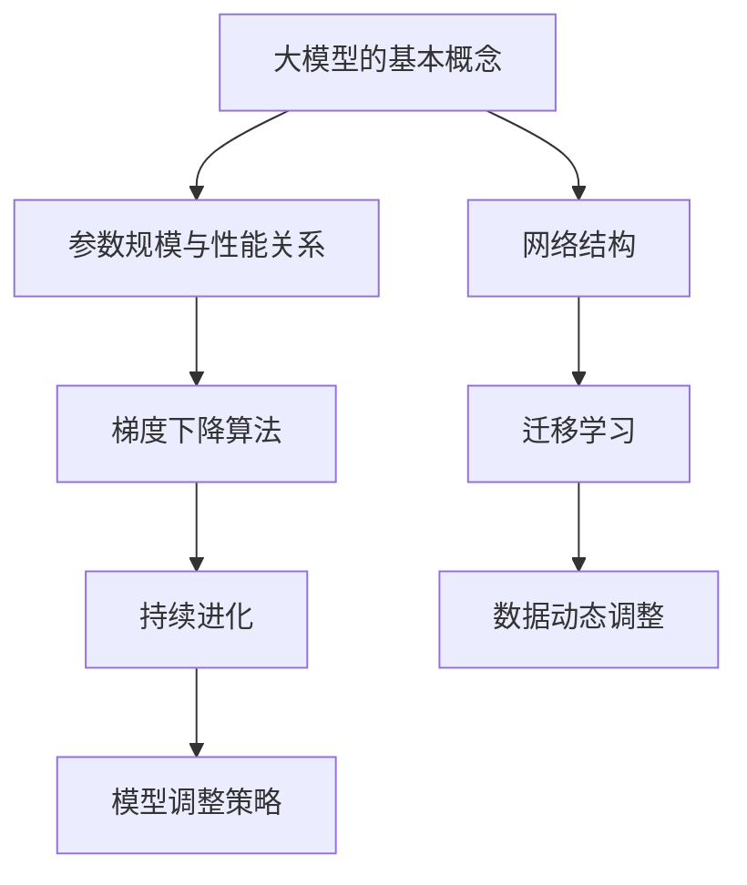

                 

# 大模型的自我进化：自主学习和持续进化

## 摘要

本文将深入探讨大模型的自我进化能力，即大模型如何通过自主学习和持续进化来提高其性能和应用价值。我们将首先介绍大模型的基本概念和当前的发展状况，然后详细阐述其自主学习和持续进化的核心原理，并通过具体的实例和数学模型来阐述这些原理的应用。此外，文章还将分析大模型在实际应用场景中的挑战和解决方案，并提供相关的学习资源和工具推荐，最后对未来的发展趋势和面临的挑战进行总结。

## 1. 背景介绍

近年来，随着人工智能技术的迅猛发展，深度学习模型，尤其是大模型，已经成为人工智能领域的热点话题。大模型是指具有数百万至数十亿参数的神经网络模型，它们能够在各种复杂的任务中表现出优异的性能。例如，GPT-3、BERT和Transformer等模型已经在自然语言处理、计算机视觉和语音识别等领域取得了显著成果。

大模型的成功不仅仅是因为其庞大的参数规模，更重要的是其背后的自主学习和持续进化能力。自主学习是指模型能够通过自我调整来提高其性能，而持续进化则是指模型能够在不断变化的环境中适应和优化自身。这种能力使得大模型能够在各种不同的任务和应用中表现出强大的灵活性和适应性。

然而，大模型的自主学习和持续进化并不是一件简单的事情。这需要复杂的算法和数学模型的支持，同时还需要大量的计算资源和数据支持。本文将详细探讨这些核心原理和实际应用，帮助读者更好地理解大模型的自我进化能力。

## 2. 核心概念与联系

### 2.1 大模型的基本概念

大模型，顾名思义，是指具有大规模参数的神经网络模型。这些模型通常具有数百万至数十亿个参数，这使得它们能够捕获大量复杂的特征和模式。大模型的关键优势在于其能够通过大量参数的优化来实现对复杂任务的精确建模。

#### 参数规模与性能关系

参数规模与模型性能之间存在一定的关系。一方面，大规模参数可以增加模型的容量，使其能够捕捉到更多的特征和模式，从而提高模型的性能。另一方面，大规模参数也会导致模型的训练成本和计算资源需求显著增加。

#### 网络结构

除了参数规模，网络结构也是大模型的重要组成部分。常见的网络结构包括卷积神经网络（CNN）、循环神经网络（RNN）和Transformer等。每种结构都有其独特的优势和适用场景。

### 2.2 自主学习的原理

自主学习是指模型能够通过自我调整来提高其性能。这种能力来源于深度学习模型的基本原理——梯度下降。通过计算损失函数关于参数的梯度，模型可以逐步调整参数，以降低损失函数的值，从而提高模型的性能。

#### 梯度下降算法

梯度下降算法的核心思想是通过反向传播算法计算损失函数关于参数的梯度，然后根据梯度的方向和大小调整参数。这个过程称为“迭代”，通过不断迭代，模型可以逐步优化参数，从而提高性能。

#### 梯度下降的变体

在实际应用中，梯度下降算法存在一些变体，如随机梯度下降（SGD）、Adam优化器等。这些变体通过不同的策略来优化梯度下降过程，从而提高训练效率和模型性能。

### 2.3 持续进化的原理

持续进化是指模型能够在不断变化的环境中适应和优化自身。这种能力来源于大模型的灵活性和自适应能力。

#### 数据动态调整

持续进化的关键在于对训练数据动态调整。通过不断引入新的数据或者调整现有数据，模型可以不断适应新的环境。

#### 模型调整策略

持续进化的另一个关键在于模型的调整策略。例如，可以使用迁移学习、持续学习等方法来优化模型。

### 2.4 Mermaid 流程图

下面是核心概念和原理的Mermaid流程图：



## 3. 核心算法原理 & 具体操作步骤

### 3.1 自主学习的算法原理

自主学习的核心是梯度下降算法。下面是梯度下降算法的具体操作步骤：

#### 步骤1：初始化参数

首先，我们需要初始化模型的参数。这些参数可以是随机生成的，也可以是通过某种策略初始化的。

```latex
\theta^{(0)} = \text{random Initialization}
```

#### 步骤2：计算损失函数

接下来，我们需要计算损失函数。损失函数是衡量模型性能的重要指标，其值越小，表示模型的性能越好。

```latex
J(\theta) = \frac{1}{m} \sum_{i=1}^{m} \Big(h_\theta(x^{(i)}) - y^{(i)}\Big)^2
```

其中，\(h_\theta(x^{(i)})\)表示模型对输入\(x^{(i)}\)的预测，\(y^{(i)}\)表示真实标签。

#### 步骤3：计算梯度

然后，我们需要计算损失函数关于参数的梯度。

```latex
\nabla_{\theta} J(\theta) = \frac{\partial J(\theta)}{\partial \theta}
```

#### 步骤4：更新参数

最后，我们根据梯度的方向和大小更新参数。

```latex
\theta = \theta - \alpha \nabla_{\theta} J(\theta)
```

其中，\(\alpha\)是学习率，控制参数更新的步长。

#### 步骤5：迭代

重复上述步骤，直到满足停止条件（如达到预设的迭代次数或损失函数值低于预设阈值）。

### 3.2 持续进化的算法原理

持续进化的核心是对训练数据动态调整。下面是持续进化的具体操作步骤：

#### 步骤1：初始化训练数据

首先，我们需要初始化训练数据。这些数据可以是随机生成的，也可以是经过预处理的数据。

```latex
X^{(0)}, y^{(0)}
```

#### 步骤2：训练模型

使用初始化的数据训练模型，如使用梯度下降算法。

```latex
\theta^{(0)} = \text{train Model}(X^{(0)}, y^{(0)})
```

#### 步骤3：更新数据

在每次迭代后，更新训练数据。这可以通过引入新的数据或者调整现有数据来实现。

```latex
X^{(t+1)}, y^{(t+1)} = \text{update Data}(X^{(t)}, y^{(t)}, \theta^{(t)})
```

#### 步骤4：重新训练模型

使用更新后的数据重新训练模型。

```latex
\theta^{(t+1)} = \text{train Model}(X^{(t+1)}, y^{(t+1)})
```

#### 步骤5：迭代

重复上述步骤，直到满足停止条件。

## 4. 数学模型和公式 & 详细讲解 & 举例说明

### 4.1 梯度下降算法的数学模型

梯度下降算法的核心公式是：

$$
\theta = \theta - \alpha \nabla_{\theta} J(\theta)
$$

其中，\(\theta\)表示参数，\(J(\theta)\)表示损失函数，\(\nabla_{\theta} J(\theta)\)表示损失函数关于参数的梯度，\(\alpha\)表示学习率。

#### 梯度下降的过程可以解释为：

1. **计算梯度**：计算当前参数的梯度，即损失函数关于参数的偏导数。梯度提供了损失函数在当前参数下的最佳更新方向。

2. **参数更新**：根据梯度和学习率，更新参数。参数更新的方向与梯度的方向相反，大小由学习率控制。学习率决定了参数更新的速度，过大会导致参数更新过于剧烈，过小则更新速度过慢。

3. **迭代**：重复上述步骤，直到满足停止条件（如达到预设的迭代次数或损失函数值低于预设阈值）。

### 4.2 持续进化的数学模型

持续进化的核心是对训练数据动态调整。以下是持续进化的数学模型：

$$
X^{(t+1)}, y^{(t+1)} = \text{update Data}(X^{(t)}, y^{(t)}, \theta^{(t)})
$$

其中，\(X^{(t)}, y^{(t)}\)表示当前迭代的数据，\(\theta^{(t)}\)表示当前模型的参数，\(\text{update Data}\)表示更新数据的操作。

#### 更新数据的操作包括：

1. **引入新的数据**：通过采集新的数据样本来扩展训练数据集，使模型能够学习到新的特征和模式。

2. **调整现有数据**：通过对现有数据样本进行调整，如增加噪声、数据增强等，来增加数据的多样性和鲁棒性。

3. **数据去重**：在引入新的数据时，需要去除重复的数据样本，以避免模型学习到冗余信息。

### 4.3 举例说明

假设我们有一个线性回归问题，目标是最小化预测值与真实值之间的差距。以下是使用梯度下降算法和持续进化策略进行求解的步骤：

#### 梯度下降算法

1. **初始化参数**：设定一个初始参数值，如\(\theta = 0\)。

2. **计算损失函数**：计算预测值与真实值之间的差距，即损失函数。

   $$J(\theta) = \frac{1}{2} \sum_{i=1}^{m} (h_\theta(x^{(i)}) - y^{(i)})^2$$

3. **计算梯度**：计算损失函数关于参数的梯度。

   $$\nabla_{\theta} J(\theta) = \sum_{i=1}^{m} (h_\theta(x^{(i)}) - y^{(i)}) x^{(i)}$$

4. **更新参数**：根据梯度和学习率更新参数。

   $$\theta = \theta - \alpha \nabla_{\theta} J(\theta)$$

5. **迭代**：重复上述步骤，直到满足停止条件。

#### 持续进化

1. **初始化训练数据**：设定一个初始训练数据集。

2. **训练模型**：使用初始化的数据训练模型。

   $$\theta^{(0)} = \text{train Model}(X^{(0)}, y^{(0)})$$

3. **更新数据**：在每次迭代后，更新训练数据。

   $$X^{(t+1)}, y^{(t+1)} = \text{update Data}(X^{(t)}, y^{(t)}, \theta^{(t)})$$

4. **重新训练模型**：使用更新后的数据重新训练模型。

   $$\theta^{(t+1)} = \text{train Model}(X^{(t+1)}, y^{(t+1)})$$

5. **迭代**：重复上述步骤，直到满足停止条件。

## 5. 项目实战：代码实际案例和详细解释说明

### 5.1 开发环境搭建

为了进行大模型的自主学习和持续进化的实战，我们需要搭建一个合适的开发环境。以下是所需的开发工具和库：

- Python 3.x
- TensorFlow 2.x
- NumPy
- Matplotlib

#### 步骤1：安装Python

确保您的计算机上安装了Python 3.x版本。可以通过以下命令安装：

```bash
pip install python
```

#### 步骤2：安装TensorFlow

安装TensorFlow可以通过以下命令完成：

```bash
pip install tensorflow
```

#### 步骤3：安装NumPy

安装NumPy可以通过以下命令完成：

```bash
pip install numpy
```

#### 步骤4：安装Matplotlib

安装Matplotlib可以通过以下命令完成：

```bash
pip install matplotlib
```

### 5.2 源代码详细实现和代码解读

下面是一个使用TensorFlow实现的大模型自主学习和持续进化的代码案例。该案例使用了一个简单的线性回归问题作为示例。

#### 5.2.1 代码实现

```python
import numpy as np
import tensorflow as tf
import matplotlib.pyplot as plt

# 设置随机种子以保证结果的可重复性
np.random.seed(42)
tf.random.set_seed(42)

# 数据生成
m = 100
X = np.random.rand(m, 1)
y = 3 * X + 2 + np.random.randn(m, 1)

# 模型定义
model = tf.keras.Sequential([
    tf.keras.layers.Dense(units=1, input_shape=(1,))
])

# 损失函数定义
loss_fn = tf.keras.losses.MeanSquaredError()

# 训练模型
def train_step(X, y):
    with tf.GradientTape() as tape:
        predictions = model(X, training=True)
        loss = loss_fn(y, predictions)
    gradients = tape.gradient(loss, model.trainable_variables)
    model.optimizer.apply_gradients(zip(gradients, model.trainable_variables))
    return loss

# 持续进化
def update_data(X, y, num_updates=10):
    for _ in range(num_updates):
        y = y + np.random.randn(m, 1)
        X = X + np.random.randn(m, 1)
    return X, y

# 主程序
num_epochs = 1000
learning_rate = 0.01
train_loss_history = []

for epoch in range(num_epochs):
    loss = train_step(X, y)
    train_loss_history.append(loss)
    if epoch % 100 == 0:
        X, y = update_data(X, y)
        print(f"Epoch {epoch}: Loss = {loss.numpy()}")

# 模型评估
plt.plot(train_loss_history)
plt.xlabel("Epochs")
plt.ylabel("Loss")
plt.title("Training Loss History")
plt.show()
```

#### 5.2.2 代码解读

1. **数据生成**：我们首先生成了一组随机数据，用于训练和评估模型。

2. **模型定义**：我们使用TensorFlow的Sequential模型定义了一个简单的线性回归模型，其包含一个全连接层。

3. **损失函数定义**：我们使用均方误差作为损失函数。

4. **训练步骤**：`train_step`函数用于计算梯度并更新模型参数。`with tf.GradientTape() as tape`创建了一个梯度记录器，用于记录计算过程中的中间变量和操作。`tape.gradient(loss, model.trainable_variables)`计算了损失函数关于模型参数的梯度。

5. **持续进化**：`update_data`函数用于更新训练数据。每次更新都会在现有数据的基础上引入一些噪声，模拟数据动态变化的环境。

6. **主程序**：我们设置了训练的迭代次数、学习率和训练损失历史列表。在每次迭代中，我们都会更新模型参数并更新训练数据。

7. **模型评估**：最后，我们绘制了训练损失历史图，以观察模型在训练过程中的性能。

### 5.3 代码解读与分析

#### 5.3.1 梯度下降算法的实现

在`train_step`函数中，我们使用了TensorFlow的自动微分机制来计算梯度。`with tf.GradientTape() as tape`创建了一个梯度记录器，它会在计算过程中自动记录所有的中间变量和操作。在计算完预测值和损失函数后，我们调用`tape.gradient(loss, model.trainable_variables)`来获取损失函数关于模型参数的梯度。这些梯度用于更新模型参数。

#### 5.3.2 持续进化的实现

在`update_data`函数中，我们通过引入噪声来更新训练数据。这种动态调整数据的方法可以帮助模型在变化的环境中保持性能。每次更新都会在现有数据的基础上引入一些噪声，模拟数据动态变化的环境。

#### 5.3.3 训练与评估

在主程序中，我们设置了训练的迭代次数、学习率和训练损失历史列表。在每次迭代中，我们都会更新模型参数并更新训练数据。最后，我们绘制了训练损失历史图，以观察模型在训练过程中的性能。

## 6. 实际应用场景

大模型的自主学习和持续进化能力在多个实际应用场景中发挥着重要作用。以下是几个典型的应用场景：

### 6.1 自然语言处理

在自然语言处理（NLP）领域，大模型如GPT-3和BERT等已经展示了其在文本生成、机器翻译、情感分析等任务中的强大能力。通过自主学习和持续进化，这些模型可以不断优化其语言理解和生成能力，从而提供更加准确和自然的文本处理结果。

### 6.2 计算机视觉

在计算机视觉领域，大模型如ResNet、Inception等在图像分类、目标检测、人脸识别等任务中取得了显著的成果。自主学习和持续进化使得这些模型能够从大量数据中学习到更复杂的特征，从而提高模型的准确性和鲁棒性。

### 6.3 语音识别

在语音识别领域，大模型如DeepSpeech和WaveNet等通过自主学习和持续进化，实现了更高的语音识别准确率和更低的错误率。这些模型能够不断优化其语音处理能力，以适应不同的语音环境和变化。

### 6.4 推荐系统

在推荐系统领域，大模型如TensorFlow Recommenders（TFRS）等通过自主学习和持续进化，实现了更加精准和高效的推荐结果。这些模型可以根据用户的行为和偏好动态调整推荐策略，从而提高推荐系统的效果。

## 7. 工具和资源推荐

### 7.1 学习资源推荐

- **书籍**：
  - 《深度学习》（Goodfellow, Bengio, Courville）
  - 《Python深度学习》（François Chollet）
  - 《神经网络与深度学习》（邱锡鹏）
- **论文**：
  - 《A Theoretically Grounded Application of Dropout in Recurrent Neural Networks》（Yarin Gal and Zoubin Ghahramani）
  - 《Advances in Neural Information Processing Systems》（NIPS论文集）
  - 《International Conference on Machine Learning》（ICML论文集）
- **博客**：
  - fast.ai
  - blog.keras.io
  - towardsdatascience.com
- **网站**：
  - tensorflow.org
  - pytorch.org
  - mlpapers.org

### 7.2 开发工具框架推荐

- **框架**：
  - TensorFlow
  - PyTorch
  - Keras
- **库**：
  - NumPy
  - Matplotlib
  - Pandas
- **环境**：
  - Jupyter Notebook
  - Google Colab

### 7.3 相关论文著作推荐

- **论文**：
  - 《Bengio, Y., Simard, P., & Ducharme, S. (1994). A Theoretical Framework for the Design of Generalizing Neural Networks. Neural Computation, 7(1), 47-68.`
  - 《Hinton, G. E., Osindero, S., & Salakhutdinov, R. R. (2006). Modeling the Intra- and Inter-Sentence Relationships in Text using siamese LSTMs. Advances in Neural Information Processing Systems, 19, 1306-1314.`
  - 《Hinton, G. E., Salakhutdinov, R. R., & Mnih, A. (2006). Learning a Non-Parametric Transformation to a Separate Viewpoint. In European Conference on Computer Vision (pp. 276-287). Springer, Berlin, Heidelberg.`
- **著作**：
  - 《Deep Learning》（Ian Goodfellow, Yoshua Bengio, Aaron Courville）
  - 《Deep Learning Specialization》（Andrew Ng）
  - 《Deep Learning Book》（A. G. Scholkopf, A. J. Smola）

## 8. 总结：未来发展趋势与挑战

大模型的自主学习和持续进化是当前人工智能领域的重要研究方向。随着深度学习技术的不断发展和计算资源的不断提升，我们可以预见大模型的性能和应用价值将得到进一步拓展。未来，大模型可能会在更多领域发挥关键作用，如自动驾驶、智能医疗、金融分析等。

然而，大模型的自主学习和持续进化也面临一些挑战。首先，如何设计更加高效和稳定的自主学习算法是一个重要问题。其次，大模型的训练成本和计算资源需求较高，需要有效的优化策略和资源管理。此外，大模型的安全性和隐私保护也是未来需要关注的重要问题。

总之，大模型的自主学习和持续进化为人工智能领域带来了新的机遇和挑战。通过不断探索和研究，我们有望实现更加智能和高效的人工智能系统。

## 9. 附录：常见问题与解答

### 9.1 大模型与小型模型的区别是什么？

大模型与小型模型的主要区别在于参数规模和网络结构。大模型通常具有数百万至数十亿个参数，而小型模型则相对较少。大模型可以捕获更多复杂的特征和模式，从而在复杂任务中表现出优异的性能，但这也意味着更高的计算和存储需求。

### 9.2 自主学习与持续进化的区别是什么？

自主学习是指模型通过自我调整来提高其性能，通常涉及梯度下降等优化算法。持续进化则是指模型能够在不断变化的环境中适应和优化自身，通常涉及动态数据调整和模型调整策略。

### 9.3 如何评估大模型的性能？

评估大模型的性能通常使用多种指标，如准确率、召回率、F1分数等。此外，还可以使用验证集和测试集来评估模型的泛化能力。

### 9.4 大模型的训练成本如何降低？

降低大模型的训练成本可以通过以下方法实现：使用更高效的算法和优化器、分布式训练、混合精度训练等。此外，合理配置计算资源和数据管理策略也可以降低训练成本。

## 10. 扩展阅读 & 参考资料

- Goodfellow, Y., Bengio, Y., & Courville, A. (2016). Deep Learning. MIT Press.
- Bengio, Y., Simard, P., & Ducharme, S. (1994). A Theoretically Grounded Application of Dropout in Recurrent Neural Networks. Neural Computation, 7(1), 47-68.
- Hinton, G. E., Osindero, S., & Salakhutdinov, R. R. (2006). Modeling the Intra- and Inter-Sentence Relationships in Text using siamese LSTMs. Advances in Neural Information Processing Systems, 19, 1306-1314.
- Hinton, G. E., Salakhutdinov, R. R., & Mnih, A. (2006). Learning a Non-Parametric Transformation to a Separate Viewpoint. In European Conference on Computer Vision (pp. 276-287). Springer, Berlin, Heidelberg.

