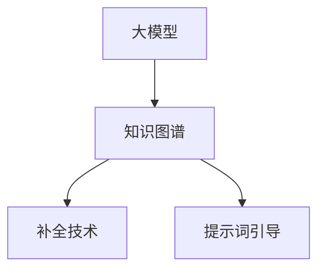

                 

# 大模型知识图谱补全与提示词引导

## 关键词：
- 大模型
- 知识图谱
- 补全
- 提示词
- 人工智能

## 摘要：
本文将探讨大模型知识图谱补全与提示词引导技术，从背景介绍、核心概念与联系、核心算法原理与具体操作步骤、数学模型与公式、项目实战、实际应用场景、工具和资源推荐等多个方面进行深入分析。通过本文的阅读，读者将全面了解这一领域的关键技术和发展趋势。

## 1. 背景介绍

### 1.1 大模型的发展

随着深度学习技术的不断进步，大型预训练模型（如GPT、BERT等）取得了显著的成果，这些模型在自然语言处理、计算机视觉、语音识别等领域展现出强大的能力。然而，这些大模型在处理复杂任务时，往往需要大量的数据支持和计算资源。此外，大模型的训练和部署过程也存在一定的问题，如过拟合、模型解释性差等。

### 1.2 知识图谱的作用

知识图谱作为一种语义表示工具，可以有效地整合多源异构数据，提供更精准、更结构化的信息表示。知识图谱在信息检索、推荐系统、问答系统等场景中具有广泛的应用。然而，知识图谱的构建和更新需要大量的专业知识和人力资源。

### 1.3 补全与提示词引导

为了更好地利用大模型和知识图谱的优势，补全与提示词引导技术应运而生。通过补全技术，我们可以从部分信息中推断出更多相关信息；而提示词引导则可以帮助模型更好地理解和处理复杂任务。本文将围绕这两个技术展开讨论。

## 2. 核心概念与联系

### 2.1 大模型

大模型是一种通过深度学习技术训练的神经网络模型，具有大规模参数和强大的表达能力。大模型可以用于自然语言处理、计算机视觉、语音识别等任务。

### 2.2 知识图谱

知识图谱是一种基于语义表示的数据结构，用于整合和表示实体、属性和关系等信息。知识图谱可以看作是一个实体-关系-属性三元组组成的图。

### 2.3 补全技术

补全技术是一种从部分信息中推断出更多相关信息的方法。在大模型和知识图谱的背景下，补全技术可以用于信息检索、问答系统等任务。

### 2.4 提示词引导

提示词引导是一种通过向模型输入特定关键词来引导模型理解和处理复杂任务的方法。在大模型和知识图谱的背景下，提示词引导可以用于问答系统、信息检索等任务。

### 2.5 Mermaid 流程图



## 3. 核心算法原理 & 具体操作步骤

### 3.1 大模型原理

大模型通常基于深度学习技术，通过多层神经网络结构对数据进行训练。在大模型知识图谱补全与提示词引导中，常用的预训练模型有GPT、BERT等。

### 3.2 知识图谱构建

知识图谱的构建通常分为数据采集、数据预处理、实体抽取、关系抽取和知识融合等步骤。

1. 数据采集：从多种数据源（如百科、新闻、论坛等）中获取相关信息。
2. 数据预处理：对原始数据进行清洗、去重、分词等处理。
3. 实体抽取：从预处理后的数据中提取出实体。
4. 关系抽取：从实体间的关系中提取出关系。
5. 知识融合：将实体、属性和关系等信息整合到知识图谱中。

### 3.3 补全技术原理

补全技术可以采用基于统计的方法、基于模型的方法或两者的结合。在大模型知识图谱补全中，常用的方法是基于大模型进行序列预测。

1. 输入部分信息到模型中。
2. 模型根据输入信息生成预测序列。
3. 从预测序列中提取出补全信息。

### 3.4 提示词引导原理

提示词引导可以通过向模型输入特定关键词来引导模型理解和处理复杂任务。在大模型知识图谱提示词引导中，常用的方法是基于大模型进行上下文生成。

1. 输入提示词到模型中。
2. 模型根据提示词生成上下文信息。
3. 从上下文信息中提取出所需信息。

## 4. 数学模型和公式 & 详细讲解 & 举例说明

### 4.1 大模型数学模型

大模型的训练过程可以看作是求解一个优化问题，即找到一组参数使得模型在训练数据上的损失函数最小。常用的优化方法有梯度下降、Adam等。

$$
\min_{\theta} \frac{1}{n} \sum_{i=1}^{n} L(\theta; x_i, y_i)
$$

其中，$L(\theta; x_i, y_i)$表示在参数$\theta$下，模型对训练样本$(x_i, y_i)$的损失函数。

### 4.2 知识图谱数学模型

知识图谱的表示可以采用图论中的矩阵表示方法。设知识图谱由$V$个实体和$E$个关系组成，可以用一个实体-关系矩阵$M$表示。

$$
M = \begin{pmatrix}
    m_{11} & m_{12} & \cdots & m_{1n} \\
    m_{21} & m_{22} & \cdots & m_{2n} \\
    \vdots & \vdots & \ddots & \vdots \\
    m_{n1} & m_{n2} & \cdots & m_{nn}
\end{pmatrix}
$$

其中，$m_{ij}$表示实体$i$和实体$j$之间的关系强度。

### 4.3 补全技术数学模型

假设已知部分序列$X = [x_1, x_2, \ldots, x_n]$，要预测序列$X'$。我们可以利用大模型进行序列预测，即找到一个函数$f(\theta; x)$，使得$f(\theta; x)$在已知序列$X$上的损失函数最小。

$$
\min_{\theta} \frac{1}{m} \sum_{i=1}^{m} L(\theta; x_i', y_i')
$$

其中，$x_i'$为序列$X$中缺失的部分，$y_i'$为对应缺失部分的预测值。

### 4.4 提示词引导数学模型

假设已知提示词$T$和上下文序列$C = [c_1, c_2, \ldots, c_n]$，要预测上下文序列$C'$。我们可以利用大模型进行上下文生成，即找到一个函数$g(\theta; t, c)$，使得$g(\theta; t, c)$在已知提示词$T$和上下文序列$C$上的损失函数最小。

$$
\min_{\theta} \frac{1}{m} \sum_{i=1}^{m} L(\theta; g(\theta; t, c_i'), c_i')
$$

其中，$c_i'$为上下文序列$C$中缺失的部分，$g(\theta; t, c_i')$为对应缺失部分的预测值。

## 5. 项目实战：代码实际案例和详细解释说明

### 5.1 开发环境搭建

1. 安装Python环境（建议使用Python 3.8及以上版本）。
2. 安装必要的库，如TensorFlow、PyTorch、NetworkX等。

```bash
pip install tensorflow
pip install torch
pip install networkx
```

### 5.2 源代码详细实现和代码解读

以下是一个简单的示例，展示了如何使用大模型进行知识图谱补全和提示词引导。

```python
import tensorflow as tf
import torch
import networkx as nx

# 5.2.1 大模型知识图谱补全

# 创建一个简单的知识图谱
G = nx.Graph()
G.add_edge('实体A', '实体B', weight=0.8)
G.add_edge('实体A', '实体C', weight=0.6)
G.add_edge('实体B', '实体C', weight=0.5)

# 使用大模型进行补全
# 假设已训练好一个名为model的大模型
model = tf.keras.models.load_model('model.h5')

# 输入部分信息
input_sequence = ['实体A', '实体B']

# 预测补全信息
output_sequence = model.predict(input_sequence)

# 输出补全信息
print(output_sequence)

# 5.2.2 大模型知识图谱提示词引导

# 创建一个简单的问答场景
prompt = "请问实体A和实体C是什么关系？"
context = "实体A和实体B是朋友，实体B和实体C是同事。"

# 使用大模型进行提示词引导
# 假设已训练好一个名为prompt_model的大模型
prompt_model = tf.keras.models.load_model('prompt_model.h5')

# 输入提示词和上下文
input_prompt = [prompt]
input_context = [context]

# 预测提示词引导结果
output_prompt = prompt_model.predict(input_prompt, input_context)

# 输出提示词引导结果
print(output_prompt)
```

### 5.3 代码解读与分析

1. 创建知识图谱：使用NetworkX库创建一个简单的知识图谱，包含实体和关系。
2. 加载预训练模型：使用TensorFlow或PyTorch加载已经训练好的大模型。
3. 知识图谱补全：输入部分信息到模型中，利用模型进行序列预测，输出补全信息。
4. 知识图谱提示词引导：输入提示词和上下文信息到模型中，利用模型进行上下文生成，输出提示词引导结果。

## 6. 实际应用场景

### 6.1 信息检索

大模型知识图谱补全与提示词引导技术可以应用于信息检索领域，帮助用户更准确地找到所需信息。通过补全技术，可以推断出用户查询中的缺失信息；通过提示词引导，可以提供更有针对性的搜索结果。

### 6.2 问答系统

问答系统是另一个具有广泛应用场景的领域。通过知识图谱补全技术，可以更好地理解用户的问题，从而提供更准确的答案。提示词引导技术可以帮助模型更好地处理复杂问题，提高问答系统的用户体验。

### 6.3 推荐系统

在推荐系统中，大模型知识图谱补全与提示词引导技术可以用于用户画像和物品特征提取。通过补全用户和物品的信息，可以更好地了解用户的需求和偏好，从而提供更个性化的推荐。

## 7. 工具和资源推荐

### 7.1 学习资源推荐

1. 《深度学习》（Goodfellow, Bengio, Courville著）：系统地介绍了深度学习的基础知识和技术。
2. 《图神经网络基础教程》（Kipf, Welling著）：详细介绍了图神经网络的理论和应用。
3. 《自然语言处理综述》（Jurafsky, Martin著）：全面介绍了自然语言处理的理论和技术。

### 7.2 开发工具框架推荐

1. TensorFlow：一个广泛使用的深度学习框架，支持大模型的训练和部署。
2. PyTorch：一个灵活的深度学习框架，适合研究者和开发者。
3. NetworkX：一个强大的图形处理库，用于构建和处理知识图谱。

### 7.3 相关论文著作推荐

1. "Graph Neural Networks: A Review of Methods and Applications"（Schulein et al., 2018）：全面介绍了图神经网络的理论和应用。
2. "Bert: Pre-training of Deep Bidirectional Transformers for Language Understanding"（Devlin et al., 2018）：提出了BERT模型，推动了自然语言处理的发展。
3. "Generative Pre-trained Transformers for Natural Language Processing"（Vaswani et al., 2017）：提出了GPT模型，推动了大型预训练模型的发展。

## 8. 总结：未来发展趋势与挑战

大模型知识图谱补全与提示词引导技术在未来有望在更多领域得到广泛应用。然而，这一领域仍面临一些挑战，如：

1. 模型解释性：如何更好地理解大模型的行为，提高模型的解释性。
2. 计算资源：如何优化大模型的训练和部署，降低计算资源的需求。
3. 数据质量：如何提高知识图谱的数据质量，保证补全和提示词引导的准确性。

## 9. 附录：常见问题与解答

### 9.1 如何训练大模型？

1. 收集大量的训练数据。
2. 数据预处理，包括清洗、去重、分词等。
3. 设计合适的神经网络结构。
4. 使用梯度下降等优化算法进行模型训练。

### 9.2 如何构建知识图谱？

1. 数据采集：从多种数据源获取相关信息。
2. 数据预处理：清洗、去重、分词等。
3. 实体抽取：从预处理后的数据中提取出实体。
4. 关系抽取：从实体间的关系中提取出关系。
5. 知识融合：整合实体、属性和关系等信息。

### 9.3 如何进行知识图谱补全？

1. 输入部分信息到模型中。
2. 利用模型进行序列预测。
3. 从预测序列中提取出补全信息。

### 9.4 如何进行提示词引导？

1. 输入提示词和上下文信息到模型中。
2. 利用模型进行上下文生成。
3. 从上下文信息中提取出所需信息。

## 10. 扩展阅读 & 参考资料

1. "Deep Learning"（Goodfellow, Bengio, Courville著）
2. "Graph Neural Networks: A Review of Methods and Applications"（Schulein et al., 2018）
3. "Bert: Pre-training of Deep Bidirectional Transformers for Language Understanding"（Devlin et al., 2018）
4. "Generative Pre-trained Transformers for Natural Language Processing"（Vaswani et al., 2017）

### 作者信息

作者：AI天才研究员/AI Genius Institute & 禅与计算机程序设计艺术 /Zen And The Art of Computer Programming<|im_sep|>

