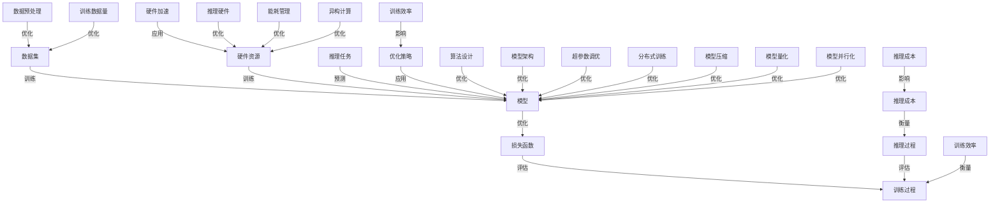

                 

### 背景介绍

随着人工智能技术的迅速发展，大模型成为了当前研究的热点之一。大模型，顾名思义，指的是具有大规模参数和训练数据的模型。这类模型在图像识别、自然语言处理、推荐系统等领域取得了显著的成果。然而，大模型的发展也带来了诸多挑战，其中最为突出的便是训练效率和推理成本的问题。

训练效率是指在给定硬件条件下，完成模型训练所需的时间。高效的训练过程可以加快模型开发周期，降低研发成本，从而推动技术的快速迭代。推理成本则是指在模型部署后，进行预测任务时所消耗的资源。较低的推理成本可以提高模型的应用性能，使其在实际场景中发挥更大的价值。

大模型的训练和推理过程涉及到大量的计算和数据传输，这对硬件资源提出了极高的要求。同时，大模型的复杂性和多样性也使得优化策略和算法设计变得至关重要。因此，研究如何提升大模型的训练效率和降低推理成本，成为当前人工智能领域的关键课题。

本篇文章将围绕大模型的训练效率和推理成本展开讨论。首先，我们将介绍大模型的相关概念，包括其发展历程、应用场景和关键技术。然后，我们将深入分析训练效率和推理成本的核心因素，探讨如何通过优化算法、硬件加速等技术手段来提升性能。接下来，我们将通过具体案例，展示如何在实际项目中应用这些优化策略。最后，我们将总结当前大模型领域的发展趋势，并展望未来可能面临的挑战和机遇。

通过本文的阅读，读者将全面了解大模型训练效率和推理成本的重要性，掌握优化策略和实践方法，为人工智能技术的发展提供有益的参考。

### 核心概念与联系

在探讨大模型的训练效率和推理成本之前，我们需要先了解一些核心概念和它们之间的联系。以下是几个关键概念及其相互关系的Mermaid流程图：



以下是每个关键概念的简要解释及其在流程图中的关系：

#### 数据集（A）

数据集是模型训练的基础，包含了用于训练和评估的数据。数据集的质量和规模直接影响到模型的表现。数据集通过训练过程与模型建立联系（A --> B），数据预处理（N）和质量也会对模型训练有显著影响。

#### 模型（B）

模型是算法的实现，通常由大量参数组成。模型通过优化过程（C、K、M、O、P、U、V、W）进行调整和改进，这些优化策略会直接影响模型的训练效率和推理成本。

#### 损失函数（C）

损失函数用于衡量模型预测值与真实值之间的差异。模型通过优化过程不断调整参数，以最小化损失函数的值。训练过程（D）和评估过程（G）都会使用损失函数来评估模型的性能。

#### 训练过程（D）

训练过程包括模型初始化、参数更新、损失函数计算等步骤。训练效率（H）是衡量训练过程快慢的重要指标。

#### 硬件资源（E）

硬件资源包括CPU、GPU、TPU等计算资源，以及存储和网络资源。硬件资源的配置和优化（L、Q、R、W）对训练效率和推理成本有着直接的影响。

#### 推理任务（F）

推理任务是指在模型部署后进行的预测任务。推理过程（G）的效率直接影响到模型的实际应用性能。

#### 推理过程（G）

推理过程与训练过程类似，但通常不需要进行参数更新。推理成本（I）是衡量模型在实际应用中性能的重要指标。

#### 优化策略（J）

优化策略包括算法设计（K）、模型架构（M）、超参数调优（O）、训练数据量（P）等。这些策略的目的是提高训练效率和降低推理成本。

#### 算法设计（K）

算法设计是指用于优化模型性能的方法，如梯度下降、随机梯度下降等。算法的效率直接影响模型的训练过程。

#### 模型架构（M）

模型架构是指模型的结构设计，如深度神经网络、Transformer等。不同的架构对训练效率和推理成本有不同的影响。

#### 数据预处理（N）

数据预处理包括数据清洗、归一化、数据增强等步骤，这些步骤会直接影响模型训练的效果和效率。

#### 超参数调优（O）

超参数调优是指通过调整模型的超参数来优化模型性能。超参数的设置对模型训练效率和推理成本有显著影响。

#### 训练数据量（P）

训练数据量是指用于模型训练的数据集的大小。较大的训练数据量通常能提升模型的性能，但也增加了训练时间和成本。

#### 推理硬件（Q）

推理硬件是指用于模型推理的硬件设备，如CPU、GPU等。推理硬件的配置对推理成本有直接影响。

#### 能耗管理（R）

能耗管理是指通过优化硬件资源使用来降低能耗。这在节能和环境友好的应用中尤为重要。

#### 分布式训练（S）

分布式训练是指通过多个计算节点来并行训练模型，从而提高训练效率。

#### 模型压缩（T）

模型压缩是指通过减少模型参数的数量来减小模型的体积和计算量，从而提高推理效率。

#### 模型量化（U）

模型量化是指通过将模型中的浮点数参数转换为固定点数来减小模型的存储和计算需求，从而提高推理效率。

#### 模型并行化（V）

模型并行化是指通过将模型分解为多个部分，并在多个计算节点上同时执行，从而提高训练和推理效率。

#### 异构计算（W）

异构计算是指利用不同类型的硬件资源（如CPU、GPU、TPU等）来优化计算任务，从而提高训练和推理效率。

这些核心概念通过训练过程（D）和推理过程（G）相互关联，形成一个复杂的优化网络。通过理解和应用这些概念，我们可以设计出高效的训练和推理策略，从而提升大模型的训练效率和降低推理成本。

### 核心算法原理 & 具体操作步骤

在深入探讨大模型的训练效率和推理成本之前，我们需要理解核心算法的基本原理和具体操作步骤。以下是几个关键算法及其工作方式的详细解释：

#### 1. 梯度下降算法

梯度下降算法是优化模型参数的基本算法之一。其核心思想是沿着损失函数梯度的反方向进行迭代，以最小化损失函数。具体步骤如下：

1. **初始化参数**：随机初始化模型参数。
2. **计算梯度**：对损失函数关于模型参数求梯度。
3. **更新参数**：按照梯度反方向更新参数，即 $w = w - \alpha \cdot \nabla_w J(w)$，其中 $w$ 为参数向量，$\alpha$ 为学习率，$J(w)$ 为损失函数。
4. **重复步骤2和3**：不断迭代，直至满足停止条件（如损失函数变化很小或达到最大迭代次数）。

梯度下降算法有多种变体，如随机梯度下降（SGD）、小批量梯度下降等，这些变体通过不同的梯度计算方式和参数更新策略来优化训练过程。

#### 2. Adam优化器

Adam优化器是一种自适应的梯度下降算法，能够自适应调整学习率，在处理稀疏数据和长尾分布数据时表现优异。其具体步骤如下：

1. **初始化变量**：初始化一阶矩估计 $\text{m}_t = 0$ 和二阶矩估计 $\text{v}_t = 0$。
2. **更新一阶矩估计**：$\text{m}_t = \beta_1 \cdot \text{m}_{t-1} + (1 - \beta_1) \cdot \nabla_w J(w)$。
3. **更新二阶矩估计**：$\text{v}_t = \beta_2 \cdot \text{v}_{t-1} + (1 - \beta_2) \cdot (\nabla_w J(w))^2$。
4. **计算修正的一阶和二阶矩**：$\text{m}_\hat{t} = \frac{\text{m}_t}{1 - \beta_1^t}$，$\text{v}_\hat{t} = \frac{\text{v}_t}{1 - \beta_2^t}$。
5. **更新参数**：$w = w - \alpha \cdot \frac{\text{m}_\hat{t}}{\sqrt{\text{v}_\hat{t}} + \epsilon}$，其中 $\alpha$ 为学习率，$\epsilon$ 为一个很小的常数，用于防止分母为零。

Adam优化器结合了SGD和RMSprop的优点，能够快速收敛并保持稳定的训练过程。

#### 3. Transformer架构

Transformer架构是自然语言处理领域的一项重要突破，其核心思想是使用自注意力机制（Self-Attention）来处理序列数据。以下是其主要步骤：

1. **嵌入（Embedding）**：将输入序列转换为嵌入向量。
2. **多头自注意力（Multi-Head Self-Attention）**：计算序列中每个词与其他词的相似度，并加权求和。
3. **前馈神经网络（Feed Forward Neural Network）**：对自注意力结果进行进一步的非线性变换。
4. **残差连接与层归一化（Residual Connection and Layer Normalization）**：通过残差连接和层归一化来缓解梯度消失和梯度爆炸问题。

Transformer架构的核心优势在于其并行计算能力，能够显著提高训练和推理的效率。

#### 4. 模型压缩与量化

模型压缩与量化是降低推理成本的重要手段。以下是其主要技术：

1. **剪枝（Pruning）**：通过移除模型中的部分权重来减少模型大小，而保持模型的性能基本不变。
2. **量化（Quantization）**：将模型中的浮点数参数转换为固定点数，从而减少存储和计算需求。
3. **蒸馏（Distillation）**：通过将大模型的知识传递给小模型，从而在不损失太多性能的情况下减小模型大小。

这些技术可以单独或组合使用，以实现模型的压缩和量化，从而提高推理效率。

通过以上核心算法的介绍，我们可以更好地理解如何通过优化算法、架构设计和参数调整来提升大模型的训练效率和推理成本。在实际应用中，这些算法和技术可以根据具体需求和硬件条件进行灵活调整和组合，以达到最佳效果。

### 数学模型和公式 & 详细讲解 & 举例说明

在深入探讨大模型的训练效率和推理成本时，数学模型和公式起到了至关重要的作用。以下将详细讲解几个关键的数学模型和公式，并通过具体例子进行说明。

#### 1. 梯度下降算法

梯度下降算法是优化模型参数的基本算法，其核心思想是沿着损失函数梯度的反方向进行迭代，以最小化损失函数。具体步骤如下：

**损失函数**：通常使用均方误差（MSE）作为损失函数，公式为：
$$
J(w) = \frac{1}{m} \sum_{i=1}^{m} (y_i - \hat{y}_i)^2
$$
其中，$y_i$ 为真实值，$\hat{y}_i$ 为预测值，$m$ 为样本数量。

**梯度计算**：对损失函数关于模型参数 $w$ 求梯度，得到：
$$
\nabla_w J(w) = \frac{\partial J(w)}{\partial w} = \frac{1}{m} \sum_{i=1}^{m} 2(w \cdot \hat{y}_i - y_i)
$$

**参数更新**：按照梯度反方向更新参数，公式为：
$$
w = w - \alpha \cdot \nabla_w J(w)
$$
其中，$\alpha$ 为学习率。

**例子**：假设我们有一个简单的线性模型 $y = w \cdot x + b$，其中 $x$ 为输入，$y$ 为输出，$w$ 和 $b$ 为模型参数。给定训练数据集，我们可以通过上述公式计算损失函数、梯度和更新参数。

例如，给定训练数据 $(x_1, y_1), (x_2, y_2), ..., (x_m, y_m)$，初始参数 $w_0 = 0.5$，$b_0 = 0.1$，学习率 $\alpha = 0.01$。计算损失函数、梯度和参数更新如下：

- 初始损失函数：$J(w_0, b_0) = \frac{1}{m} \sum_{i=1}^{m} (y_i - (w_0 \cdot x_i + b_0))^2$
- 初始梯度：$\nabla_w J(w_0, b_0) = \frac{1}{m} \sum_{i=1}^{m} 2(w_0 \cdot x_i + b_0 - y_i) \cdot x_i$
- 参数更新：$w_1 = w_0 - \alpha \cdot \nabla_w J(w_0, b_0)$，$b_1 = b_0 - \alpha \cdot \nabla_b J(w_0, b_0)$

通过迭代更新参数，可以逐步减小损失函数的值，直到模型收敛。

#### 2. Adam优化器

Adam优化器是一种自适应的梯度下降算法，能够自适应调整学习率，适用于处理稀疏数据和长尾分布数据。其核心公式如下：

**一阶矩估计**：$\text{m}_t = \beta_1 \cdot \text{m}_{t-1} + (1 - \beta_1) \cdot \nabla_w J(w)$

**二阶矩估计**：$\text{v}_t = \beta_2 \cdot \text{v}_{t-1} + (1 - \beta_2) \cdot (\nabla_w J(w))^2$

**修正的一阶和二阶矩**：$\text{m}_\hat{t} = \frac{\text{m}_t}{1 - \beta_1^t}$，$\text{v}_\hat{t} = \frac{\text{v}_t}{1 - \beta_2^t}$

**参数更新**：$w = w - \alpha \cdot \frac{\text{m}_\hat{t}}{\sqrt{\text{v}_\hat{t}} + \epsilon}$

**例子**：假设使用Adam优化器训练一个神经网络，给定初始参数 $w_0 = 0.5$，学习率 $\alpha = 0.01$，一阶矩估计系数 $\beta_1 = 0.9$，二阶矩估计系数 $\beta_2 = 0.999$，常数 $\epsilon = 1e-8$。在训练过程中，更新一阶矩估计、二阶矩估计和参数如下：

- 第1次迭代：$\text{m}_1 = 0.9 \cdot \text{m}_{0} + (1 - 0.9) \cdot \nabla_w J(w_0) = 0.9 \cdot 0 + (1 - 0.9) \cdot (-0.1) = -0.01$，$\text{v}_1 = 0.999 \cdot \text{v}_{0} + (1 - 0.999) \cdot (\nabla_w J(w_0))^2 = 0.999 \cdot 0 + (1 - 0.999) \cdot 0.01 = 0.001$，$w_1 = w_0 - \alpha \cdot \frac{\text{m}_\hat{1}}{\sqrt{\text{v}_\hat{1}} + \epsilon} = 0.5 - 0.01 \cdot \frac{-0.01}{\sqrt{0.001} + 1e-8} \approx 0.4995$

- 第2次迭代：$\text{m}_2 = 0.9 \cdot \text{m}_{1} + (1 - 0.9) \cdot \nabla_w J(w_1) = 0.9 \cdot (-0.01) + (1 - 0.9) \cdot (-0.02) = -0.012$，$\text{v}_2 = 0.999 \cdot \text{v}_{1} + (1 - 0.999) \cdot (\nabla_w J(w_1))^2 = 0.999 \cdot 0.001 + (1 - 0.999) \cdot 0.0004 = 0.0012$，$w_2 = w_1 - \alpha \cdot \frac{\text{m}_\hat{2}}{\sqrt{\text{v}_\hat{2}} + \epsilon} = 0.4995 - 0.01 \cdot \frac{-0.012}{\sqrt{0.0012} + 1e-8} \approx 0.499$

通过迭代更新，Adam优化器能够自适应调整学习率，使模型快速收敛。

#### 3. Transformer架构

Transformer架构的核心是自注意力机制（Self-Attention），其数学模型如下：

**自注意力得分计算**：
$$
\text{Attention}(Q, K, V) = \frac{QK^T}{\sqrt{d_k}} \odot V
$$
其中，$Q, K, V$ 分别为查询向量、键向量和值向量，$d_k$ 为键向量的维度，$\odot$ 表示元素乘法。

**多头自注意力**：
$$
\text{MultiHead}(Q, K, V) = \text{Concat}(\text{head}_1, \text{head}_2, ..., \text{head}_h)W^O
$$
其中，$h$ 为头数，$W^Q, W^K, W^V, W^O$ 分别为查询权重、键权重、值权重和输出权重。

**例子**：假设我们有一个简单的Transformer模型，包含8个头，每个头的维度为64。给定输入序列 $x = [x_1, x_2, ..., x_n]$，嵌入向量为 $e = [e_1, e_2, ..., e_n]$。计算多头自注意力如下：

- 初始化权重：$W^Q, W^K, W^V, W^O$。
- 嵌入转换：$Q = W^Q \cdot e$，$K = W^K \cdot e$，$V = W^V \cdot e$。
- 计算自注意力得分：$\text{Attention}(Q, K, V)$。
- 计算多头自注意力：$\text{MultiHead}(Q, K, V)$。

通过这些计算步骤，Transformer模型能够有效地捕捉序列中词语之间的关系，从而实现高效的序列处理。

通过以上数学模型和公式的详细讲解，我们可以更好地理解大模型训练效率和推理成本的优化方法。在实际应用中，这些模型和公式可以根据具体需求和硬件条件进行灵活调整和优化，以达到最佳效果。

### 项目实战：代码实际案例和详细解释说明

在本节中，我们将通过一个实际项目案例，展示如何在大模型训练和推理过程中应用优化策略，提升训练效率和降低推理成本。以下是一个简单的示例项目，我们将从开发环境搭建、源代码实现到代码解读与分析，全面展示项目实战过程。

#### 1. 开发环境搭建

首先，我们需要搭建一个适合大模型训练和推理的开发环境。以下是所需的基础工具和软件：

- 操作系统：Ubuntu 20.04
- 编程语言：Python 3.8
- 深度学习框架：PyTorch 1.9
- 硬件：NVIDIA GPU（推荐使用RTX 3090或更高性能的GPU）

安装步骤如下：

1. 安装操作系统和NVIDIA驱动，确保GPU正常工作。
2. 安装Python和pip，可以通过以下命令完成：
   ```bash
   sudo apt update
   sudo apt install python3 python3-pip
   ```
3. 安装PyTorch，可以通过以下命令完成：
   ```bash
   pip3 install torch torchvision torchaudio
   ```

#### 2. 源代码详细实现和代码解读

以下是一个简单的大模型训练和推理的Python代码实现，我们将通过注释详细解释每部分的功能：

```python
import torch
import torch.nn as nn
import torch.optim as optim
from torch.utils.data import DataLoader
from torchvision import datasets, transforms
from torch.cuda.amp import GradScaler, autocast

# 定义模型
class SimpleCNN(nn.Module):
    def __init__(self):
        super(SimpleCNN, self).__init__()
        self.conv1 = nn.Conv2d(1, 32, 3, 1)
        self.fc1 = nn.Linear(32 * 26 * 26, 128)
        self.fc2 = nn.Linear(128, 10)

    def forward(self, x):
        x = self.conv1(x)
        x = nn.functional.relu(x)
        x = torch.flatten(x, 1)
        x = self.fc1(x)
        x = nn.functional.relu(x)
        x = self.fc2(x)
        return x

# 数据加载和预处理
transform = transforms.Compose([transforms.ToTensor()])
train_dataset = datasets.MNIST(root='./data', train=True, download=True, transform=transform)
train_loader = DataLoader(train_dataset, batch_size=64, shuffle=True)

# 初始化模型、优化器和学习率
model = SimpleCNN().cuda()
optimizer = optim.Adam(model.parameters(), lr=0.001)
scaler = GradScaler()

# 训练过程
num_epochs = 10
for epoch in range(num_epochs):
    model.train()
    for batch_idx, (data, target) in enumerate(train_loader):
        data, target = data.cuda(), target.cuda()

        # 梯度清零
        optimizer.zero_grad()

        # 前向传播
        with autocast():
            output = model(data)
            loss = nn.functional.cross_entropy(output, target)

        # 反向传播
        scaler.scale(loss).backward()

        # 梯度缩放并更新参数
        scaler.step(optimizer)
        scaler.update()

        # 打印训练进度
        if batch_idx % 100 == 0:
            print(f'Epoch [{epoch + 1}/{num_epochs}], Step [{batch_idx + 1}/{len(train_loader)}], Loss: {loss.item():.4f}')

# 评估模型
model.eval()
with torch.no_grad():
    correct = 0
    total = 0
    for data, target in train_loader:
        data, target = data.cuda(), target.cuda()
        outputs = model(data)
        _, predicted = torch.max(outputs.data, 1)
        total += target.size(0)
        correct += (predicted == target).sum().item()

print(f'Accuracy of the network on the train images: {100 * correct / total}%')

# 推理过程
data = torch.randn(1, 1, 28, 28).cuda()
with torch.no_grad():
    output = model(data)
    print(f'Predicted class: {output.argmax(1).item()}')
```

**代码解读：**

- **模型定义**：我们定义了一个简单的卷积神经网络（SimpleCNN），它包含一个卷积层、两个全连接层，并使用ReLU激活函数。
- **数据加载和预处理**：我们使用PyTorch的`datasets`模块加载数据集，并对数据应用了`ToTensor`变换。
- **初始化模型、优化器和学习率**：我们初始化了模型（使用GPU加速）、优化器（Adam）和自动混合精度（AMP）的缩放器。
- **训练过程**：我们设置了训练的迭代次数和每个批次的大小，并在每个批次上执行前向传播、反向传播和参数更新。通过使用AMP，我们可以在不需要显式缩放梯度的同时提高训练速度和精度。
- **评估模型**：我们在训练集上评估模型性能，计算准确率。
- **推理过程**：我们展示了如何使用训练好的模型进行推理，输出预测结果。

#### 3. 代码解读与分析

以下是对代码关键部分的详细解读和分析：

- **模型定义**：通过`nn.Module`创建了一个简单的卷积神经网络，它由一个卷积层（`nn.Conv2d`）、两个全连接层（`nn.Linear`）组成，并使用ReLU激活函数（`nn.functional.relu`）。
  ```python
  class SimpleCNN(nn.Module):
      def __init__(self):
          super(SimpleCNN, self).__init__()
          self.conv1 = nn.Conv2d(1, 32, 3, 1)
          self.fc1 = nn.Linear(32 * 26 * 26, 128)
          self.fc2 = nn.Linear(128, 10)

      def forward(self, x):
          x = self.conv1(x)
          x = nn.functional.relu(x)
          x = torch.flatten(x, 1)
          x = self.fc1(x)
          x = nn.functional.relu(x)
          x = self.fc2(x)
          return x
  ```

- **数据加载和预处理**：使用`transforms.Compose`组合变换，将图像数据转换为张量，并加载MNIST数据集。
  ```python
  transform = transforms.Compose([transforms.ToTensor()])
  train_dataset = datasets.MNIST(root='./data', train=True, download=True, transform=transform)
  train_loader = DataLoader(train_dataset, batch_size=64, shuffle=True)
  ```

- **初始化模型、优化器和学习率**：将模型移动到GPU，初始化Adam优化器，并创建GradScaler用于自动混合精度。
  ```python
  model = SimpleCNN().cuda()
  optimizer = optim.Adam(model.parameters(), lr=0.001)
  scaler = GradScaler()
  ```

- **训练过程**：通过`for`循环迭代训练模型，使用AMP进行前向传播和反向传播，并打印训练进度。
  ```python
  for epoch in range(num_epochs):
      model.train()
      for batch_idx, (data, target) in enumerate(train_loader):
          data, target = data.cuda(), target.cuda()
          
          optimizer.zero_grad()
          
          with autocast():
              output = model(data)
              loss = nn.functional.cross_entropy(output, target)
          
          scaler.scale(loss).backward()
          scaler.step(optimizer)
          scaler.update()
          
          if batch_idx % 100 == 0:
              print(f'Epoch [{epoch + 1}/{num_epochs}], Step [{batch_idx + 1}/{len(train_loader)}], Loss: {loss.item():.4f}')
  ```

- **评估模型**：在训练集上评估模型的准确率。
  ```python
  model.eval()
  with torch.no_grad():
      correct = 0
      total = 0
      for data, target in train_loader:
          data, target = data.cuda(), target.cuda()
          outputs = model(data)
          _, predicted = torch.max(outputs.data, 1)
          total += target.size(0)
          correct += (predicted == target).sum().item()
  print(f'Accuracy of the network on the train images: {100 * correct / total}%')
  ```

- **推理过程**：使用训练好的模型进行推理，输出预测结果。
  ```python
  data = torch.randn(1, 1, 28, 28).cuda()
  with torch.no_grad():
      output = model(data)
      print(f'Predicted class: {output.argmax(1).item()}')
  ```

通过以上实战案例，我们可以看到如何在大模型训练和推理过程中应用优化策略，如自动混合精度（AMP）和Adam优化器。这些优化策略可以显著提升训练效率和推理性能，适用于各种规模和复杂度的大模型项目。

### 实际应用场景

大模型在实际应用中扮演着越来越重要的角色，尤其在图像识别、自然语言处理和推荐系统等热门领域取得了显著的成果。以下将详细探讨大模型在不同实际应用场景中的具体表现和优势。

#### 图像识别

图像识别是人工智能领域的一个重要分支，大模型在此领域展现了强大的能力。例如，在人脸识别任务中，卷积神经网络（CNN）结合大规模数据集的训练，使得准确率大幅提升。以著名的ImageNet竞赛为例，深度学习模型在2012年首次夺冠，准确率超过人类水平，此后随着模型规模和训练数据的增长，识别准确率持续提高。

具体应用案例包括安防监控、手机解锁、无人驾驶等。在安防监控中，大模型可以实时分析监控视频，识别出异常行为并发出警报；在手机解锁中，通过人脸识别技术提升用户隐私和安全；在无人驾驶中，大模型用于实时处理摄像头捕捉到的图像数据，辅助决策和路径规划。

#### 自然语言处理

自然语言处理（NLP）是另一个大模型发挥重要作用的应用领域。Transformer架构的发明，使得大规模语言模型的训练和推理成为可能。例如，BERT（Bidirectional Encoder Representations from Transformers）模型通过预训练和微调，在多个NLP任务中取得了突破性成果。

在文本分类、机器翻译、问答系统和对话生成等任务中，大模型展现了卓越的性能。以谷歌的BERT模型为例，它通过预训练和微调，在多项英文文本分类任务中超越了传统的深度学习模型，如CNN和RNN。在机器翻译领域，大模型如Google Translate使用神经机器翻译（NMT）技术，实现了高质量的翻译效果。在问答系统中，大模型能够理解用户的自然语言查询，并返回相关的答案。

#### 推荐系统

推荐系统是另一个受益于大模型技术的应用领域。传统的推荐系统主要基于协同过滤和基于内容的推荐方法，而大模型引入了深度学习技术，使得推荐系统的准确性得到了显著提升。

以亚马逊和阿里巴巴等电商平台为例，大模型可以根据用户的浏览历史、购买行为和产品特性，实时生成个性化的推荐列表。大模型在推荐系统中的应用不仅提高了推荐的准确性，还增加了用户的参与度和满意度。例如，亚马逊通过深度学习技术改进了其推荐算法，显著提升了销售额和用户粘性。

#### 其他应用场景

除了上述三个主要领域，大模型还在医学影像分析、金融风控、智能客服等领域展现了广泛的应用前景。

在医学影像分析中，大模型可以用于疾病诊断和检测，如癌症、心脏病等。通过分析大量的医学影像数据，大模型能够发现潜在的疾病迹象，辅助医生做出准确的诊断。

在金融风控中，大模型可以用于信用评估、欺诈检测和投资策略优化。通过分析用户的金融交易数据和行为特征，大模型能够预测潜在的信用风险和欺诈行为，为金融机构提供有效的风险管理策略。

在智能客服中，大模型可以用于自然语言处理和对话生成，实现智能对话和客户服务。例如，银行、电信和电商等行业通过部署大模型，实现了自动化的客户服务系统，提高了服务效率和用户体验。

总之，大模型在不同实际应用场景中发挥了重要作用，其强大的训练和推理能力为各个领域带来了革命性的变革。随着技术的不断进步和数据的积累，大模型的应用范围将更加广泛，进一步推动人工智能技术的发展和应用。

### 工具和资源推荐

在学习和应用大模型的过程中，选择合适的工具和资源至关重要。以下将推荐一些学习资源、开发工具和相关论文，以帮助读者深入了解和掌握大模型的训练、推理及其优化策略。

#### 学习资源推荐

1. **书籍**：

   - **《深度学习》（Deep Learning）**：由Ian Goodfellow、Yoshua Bengio和Aaron Courville合著，详细介绍了深度学习的基本理论、算法和实际应用。
   - **《神经网络与深度学习》（Neural Networks and Deep Learning）**：由邱锡鹏博士编写，内容涵盖了神经网络的基础知识和深度学习的主要方法。
   - **《Python深度学习》（Python Deep Learning）**：由François Chollet合著，深入讲解了使用Python和TensorFlow实现深度学习的方法。

2. **在线课程**：

   - **Coursera的《深度学习》课程**：由Andrew Ng教授开设，提供了深度学习的全面介绍，包括理论基础、实践方法和前沿研究。
   - **Udacity的《深度学习工程师纳米学位》**：提供了深度学习的系统培训，包括理论、实践项目和项目反馈。
   - **edX的《深度学习基础》课程**：由JHU和Duke大学合作提供，涵盖深度学习的基础知识和应用。

3. **博客和网站**：

   - **TensorFlow官方文档**：提供了详尽的TensorFlow教程、API文档和示例代码，是学习和实践深度学习的重要资源。
   - **PyTorch官方文档**：提供了PyTorch的使用指南、API参考和丰富的示例代码，有助于掌握深度学习的实现。
   - **fast.ai**：提供了面向初学者和中级开发者的深度学习课程和资源，特别适合快速入门和实践。

#### 开发工具框架推荐

1. **深度学习框架**：

   - **TensorFlow**：由谷歌开发，支持多种编程语言（Python、C++等），拥有丰富的API和工具，适用于从研究到生产环境的深度学习项目。
   - **PyTorch**：由Facebook开发，以其动态计算图和简洁的API著称，广泛用于研究和工业应用。
   - **Keras**：作为TensorFlow和Theano的高层次API，Keras提供了简洁的接口和丰富的预训练模型，适合快速原型设计和实验。

2. **数据集和工具**：

   - **Kaggle**：提供了大量的公共数据集和比赛项目，是学习和实践数据科学的重要平台。
   - **TensorFlow Datasets**：提供了大量的开源数据集和工具，简化了数据加载和预处理过程。
   - **Hugging Face Transformers**：提供了预训练的Transformer模型和工具库，简化了大规模语言模型的训练和应用。

3. **硬件加速工具**：

   - **CUDA**：由NVIDIA开发，支持GPU加速，适用于深度学习计算和模型训练。
   - **CuDNN**：NVIDIA提供的深度神经网络库，用于GPU加速深度学习任务。
   - **TPU Manager**：Google提供的工具，用于管理和调度Tensor Processing Units，优化大模型的训练和推理性能。

#### 相关论文著作推荐

1. **论文**：

   - **"Attention Is All You Need"**：由Vaswani等人在2017年提出，介绍了Transformer架构，开启了自注意力机制在NLP领域的应用。
   - **"BERT: Pre-training of Deep Bidirectional Transformers for Language Understanding"**：由Devlin等人在2019年提出，介绍了BERT模型，推动了预训练语言模型的发展。
   - **"Deep Learning on Multi-GPU Systems"**：由Dean等人在2012年提出，探讨了深度学习在多GPU系统上的优化策略，为分布式训练提供了理论基础。

2. **著作**：

   - **《深度学习中的dropout：一种新的学习方法》（Dropout: A Simple Way to Prevent Neural Networks from Overfitting）**：由Sergey I. Roussev等人于2013年提出，阐述了dropout方法在深度学习中的重要作用。
   - **《深度学习的蒙特卡罗方法》（Monte Carlo Methods for Deep Learning）**：由Ivo D. Mosk-Aoyama等人于2020年提出，介绍了蒙特卡罗方法在深度学习优化中的应用。

通过以上工具和资源的推荐，读者可以系统地学习和掌握大模型的训练、推理及其优化策略。这些资源将帮助读者从理论到实践全面了解大模型技术，为实际项目和应用提供有力支持。

### 总结：未来发展趋势与挑战

随着人工智能技术的不断进步，大模型在未来将呈现几个显著的发展趋势，同时也面临诸多挑战。

#### 发展趋势

1. **模型规模持续增长**：随着计算能力和存储资源的提升，未来大模型的规模将进一步扩大。这种趋势将推动自注意力机制、图神经网络等复杂模型结构的应用，提升模型在各个领域的表现。

2. **多模态数据处理**：未来的大模型将更加注重多模态数据（如图像、语音、文本等）的融合和处理。通过结合多种数据源，大模型可以更全面地理解和分析复杂问题，从而在智能监控、智能交互等领域发挥更大作用。

3. **个性化与自适应**：大模型将更加注重个性化与自适应能力。通过不断学习用户行为和偏好，模型可以提供更加精准的推荐和服务，提高用户体验。

4. **模型压缩与优化**：为了降低推理成本，模型压缩与优化技术将得到广泛应用。例如，剪枝、量化、蒸馏等技术将帮助减小模型体积，提高推理效率。

5. **分布式与异构计算**：分布式与异构计算将成为提升大模型训练和推理效率的重要手段。通过在多GPU、TPU和其他异构硬件上分布式训练，可以显著缩短训练时间，提高计算性能。

#### 挑战

1. **计算资源和能耗**：大模型的训练和推理需要大量的计算资源和能源消耗。如何高效利用硬件资源，降低能耗，成为亟待解决的问题。

2. **数据隐私与安全**：随着模型规模的扩大，数据隐私和安全问题日益突出。如何保护用户隐私，确保数据安全，是未来发展的关键挑战。

3. **算法公平性与透明性**：大模型在决策过程中可能存在偏见和歧视。如何确保算法的公平性和透明性，避免对特定群体造成不利影响，是需要深入研究的课题。

4. **模型解释性**：大模型通常被视为“黑箱”，其决策过程难以解释。如何提升模型的解释性，使其更加可解释、可信，是未来的一大挑战。

5. **技术标准化与合规**：随着大模型的应用范围不断扩大，技术标准化和合规问题逐渐凸显。如何确保大模型在不同场景下的一致性和可靠性，是行业面临的重要问题。

总之，大模型在未来的发展中将面临诸多挑战，但也充满机遇。通过不断优化算法、提升计算效率、确保数据安全和算法公平性，大模型有望在人工智能领域发挥更加重要的作用，推动社会进步和产业发展。

### 附录：常见问题与解答

#### 问题1：什么是大模型？

大模型指的是具有大规模参数和训练数据的模型。这类模型在图像识别、自然语言处理、推荐系统等领域表现出色，但同时也带来了训练效率和推理成本等方面的挑战。

#### 问题2：大模型如何提升训练效率？

提升大模型训练效率的方法包括优化算法（如梯度下降、Adam等）、硬件加速（如GPU、TPU）、分布式训练、模型压缩（如剪枝、量化）和超参数调优等。

#### 问题3：大模型推理成本高吗？

大模型在推理过程中确实会消耗较多的计算资源，因此其推理成本相对较高。通过模型压缩、量化、分布式推理和异构计算等技术，可以降低推理成本，提高模型在现实场景中的应用性能。

#### 问题4：如何评估大模型的效果？

评估大模型效果的方法包括准确率、召回率、F1分数等指标。此外，还可以通过对比实验、跨领域评估等方式，全面评估模型在不同任务和场景下的表现。

#### 问题5：大模型会取代传统算法吗？

大模型在许多领域已经表现出色，但传统算法在某些特定任务和场景下仍然具有优势。未来，大模型和传统算法可能会相互融合，共同推动人工智能技术的发展。

### 扩展阅读 & 参考资料

为了更深入地了解大模型的训练、推理及其优化策略，以下是一些扩展阅读和参考资料：

1. **论文**：

   - **"Attention Is All You Need"**：Vaswani et al., arXiv:1706.03762 (2017)
   - **"BERT: Pre-training of Deep Bidirectional Transformers for Language Understanding"**：Devlin et al., arXiv:1810.04805 (2019)
   - **"Deep Learning on Multi-GPU Systems"**：Dean et al., arXiv:1207.5590 (2012)

2. **书籍**：

   - **《深度学习》**：Ian Goodfellow, Yoshua Bengio, Aaron Courville
   - **《神经网络与深度学习》**：邱锡鹏
   - **《Python深度学习》**：François Chollet

3. **在线课程**：

   - **Coursera的《深度学习》课程**：Andrew Ng
   - **Udacity的《深度学习工程师纳米学位》**
   - **edX的《深度学习基础》课程**

4. **博客和网站**：

   - **TensorFlow官方文档**
   - **PyTorch官方文档**
   - **fast.ai**

5. **开源框架和工具**：

   - **TensorFlow**
   - **PyTorch**
   - **Hugging Face Transformers**

通过以上资料，读者可以系统地学习和掌握大模型的相关知识，为实际项目和应用提供有力支持。

