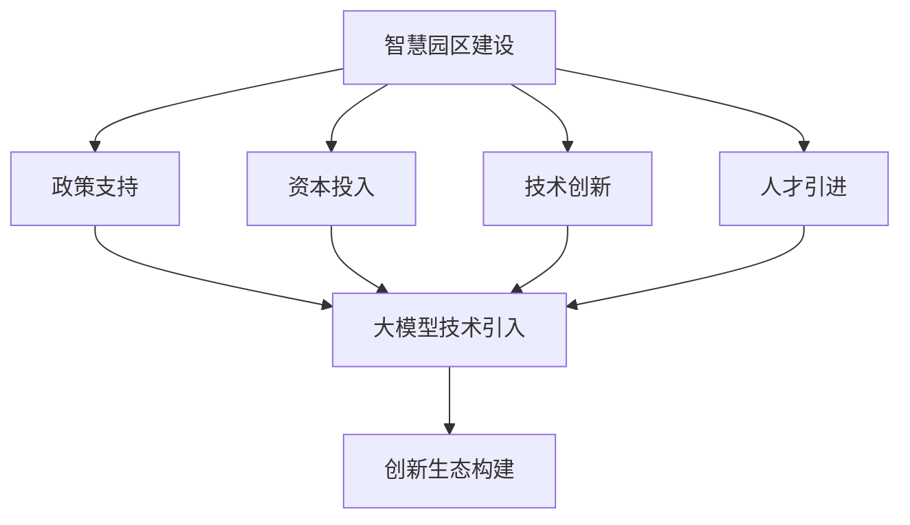

                 

# 大模型赋能智慧园区，创业者如何打造创新生态？

## 关键词
- 大模型
- 智慧园区
- 创新生态
- 创业者
- 人工智能

## 摘要

随着人工智能技术的飞速发展，大模型作为其核心技术之一，正逐步改变着各行各业。智慧园区作为新型城市空间的发展趋势，如何利用大模型技术打造创新生态，成为创业者们关注的热点话题。本文将深入探讨大模型在智慧园区中的应用，分析创业者如何借助大模型技术推动创新生态的构建，并提供相关建议和策略。

## 1. 背景介绍

### 1.1 智慧园区的概念与发展

智慧园区，是指以信息技术为核心，通过物联网、云计算、大数据、人工智能等先进技术手段，实现园区内各类设施和服务的智能化、数字化和高效化运营。智慧园区的发展趋势主要体现在以下几个方面：

1. **数字化管理**：通过物联网技术，实现对园区内基础设施、公共设施、环境信息的实时监控和管理，提高园区运营效率。
2. **智能化服务**：利用人工智能技术，为园区内企业提供智能化、个性化的服务，提升企业满意度和用户体验。
3. **创新创业生态**：通过搭建创新创业平台，汇聚各类创新资源，促进企业之间的合作与交流，推动园区创新生态的构建。

### 1.2 大模型的发展与应用

大模型（Large-scale Model）是指具有大规模参数和复杂结构的机器学习模型，如深度神经网络、生成对抗网络等。大模型的发展主要得益于以下几个因素：

1. **计算能力提升**：随着计算能力的提升，大模型在训练和推理过程中所需的计算资源逐渐得到满足。
2. **数据资源丰富**：大数据技术的发展，为大模型提供了丰富的训练数据，有助于提升模型的性能和泛化能力。
3. **算法优化**：通过算法优化和改进，大模型在处理复杂任务、提高模型性能方面取得了显著进展。

大模型的应用领域广泛，包括自然语言处理、计算机视觉、语音识别、推荐系统等。在大模型技术的推动下，人工智能在各个领域的应用水平得到了显著提升。

## 2. 核心概念与联系

### 2.1 大模型在智慧园区中的应用

大模型在智慧园区中的应用主要体现在以下几个方面：

1. **智能安防**：利用大模型进行图像识别、人脸识别等，实现对园区内人员、车辆、物品的实时监控和管理。
2. **智慧能源管理**：通过大模型对园区能源消耗进行预测和分析，实现能源的高效利用和节能减排。
3. **智能交通管理**：利用大模型对交通流量进行预测和分析，优化交通信号控制，提高园区交通运行效率。
4. **智慧环保**：通过大模型对园区空气质量、水质等进行实时监测和分析，保障园区环境安全。

### 2.2 创新生态的构建

创新生态的构建需要多个因素的协同作用，包括政策支持、资本投入、技术创新、人才引进等。大模型在创新生态的构建中起到了关键作用：

1. **技术创新**：大模型技术为智慧园区提供了强大的技术支撑，推动了园区内企业的技术创新和业务拓展。
2. **资本投入**：大模型技术的发展吸引了大量资本投入，为智慧园区的建设和运营提供了充足的资金支持。
3. **人才引进**：大模型技术的高门槛吸引了大量优秀人才，为智慧园区的发展提供了人才保障。
4. **政策支持**：政府出台了一系列政策，鼓励大模型技术在智慧园区中的应用，推动创新生态的构建。

### 2.3 Mermaid 流程图



## 3. 核心算法原理 & 具体操作步骤

### 3.1 大模型的算法原理

大模型的算法原理主要包括以下几个关键步骤：

1. **数据采集**：收集大量的数据，包括结构化数据、非结构化数据等。
2. **数据预处理**：对数据进行清洗、去重、归一化等处理，提高数据质量。
3. **模型训练**：利用训练数据对模型进行训练，通过反向传播算法不断调整模型参数，使其能够更好地拟合训练数据。
4. **模型评估**：使用验证数据集对模型进行评估，调整模型参数，提高模型性能。
5. **模型部署**：将训练好的模型部署到实际应用场景中，进行实时预测和推理。

### 3.2 具体操作步骤

以下是利用大模型技术构建智慧园区创新生态的具体操作步骤：

1. **需求分析**：分析智慧园区的发展需求，确定大模型技术在该场景中的应用方向。
2. **数据收集**：收集园区内各类数据，包括人员数据、交通数据、能源数据等。
3. **数据预处理**：对收集到的数据进行预处理，保证数据质量。
4. **模型选择**：根据应用场景选择合适的大模型算法，如深度神经网络、生成对抗网络等。
5. **模型训练**：利用预处理后的数据对模型进行训练，调整模型参数，提高模型性能。
6. **模型评估**：使用验证数据集对模型进行评估，调整模型参数，确保模型性能满足要求。
7. **模型部署**：将训练好的模型部署到园区内，实现实时预测和推理功能。
8. **应用推广**：将大模型技术在园区内推广应用，为园区内企业提供智能化服务，推动创新生态的构建。

## 4. 数学模型和公式 & 详细讲解 & 举例说明

### 4.1 数学模型和公式

大模型训练过程中，涉及到许多数学模型和公式。以下是其中几个关键的部分：

1. **损失函数**：损失函数用于评估模型预测结果与实际结果之间的差异，常用的损失函数有均方误差（MSE）、交叉熵损失（Cross-Entropy Loss）等。
   $$\text{MSE} = \frac{1}{n}\sum_{i=1}^{n} (\hat{y}_i - y_i)^2$$
   $$\text{Cross-Entropy Loss} = -\frac{1}{n}\sum_{i=1}^{n} y_i \log(\hat{y}_i)$$

2. **反向传播算法**：反向传播算法用于模型训练过程中，通过反向传播误差信号，不断调整模型参数，以达到最小化损失函数的目的。
   $$\Delta\theta_j = \frac{\partial \text{Loss}}{\partial \theta_j}$$

3. **激活函数**：激活函数用于神经网络中，将输入映射到输出，常用的激活函数有ReLU、Sigmoid、Tanh等。
   $$\text{ReLU}(x) = \max(0, x)$$
   $$\text{Sigmoid}(x) = \frac{1}{1 + e^{-x}}$$
   $$\text{Tanh}(x) = \frac{e^x - e^{-x}}{e^x + e^{-x}}$$

### 4.2 详细讲解与举例说明

#### 4.2.1 损失函数

以均方误差（MSE）为例，详细讲解损失函数的计算过程。

假设我们有一个二元分类问题，模型预测结果为$\hat{y}_i$，实际结果为$y_i$，其中$\hat{y}_i \in [0, 1]$，$y_i \in \{0, 1\}$。

1. **计算预测概率**：首先计算模型预测的概率值$\hat{y}_i$，可以使用Sigmoid函数进行映射。
   $$\hat{y}_i = \text{Sigmoid}(\theta^T \cdot x_i)$$

2. **计算损失值**：使用均方误差（MSE）计算预测结果与实际结果之间的差异。
   $$\text{MSE} = \frac{1}{n}\sum_{i=1}^{n} (\hat{y}_i - y_i)^2$$

3. **反向传播**：计算损失函数关于模型参数的梯度，用于更新模型参数。
   $$\frac{\partial \text{MSE}}{\partial \theta_j} = -2 \cdot (y_i - \hat{y}_i) \cdot x_{ij}$$

4. **更新参数**：根据梯度更新模型参数，以最小化损失函数。
   $$\theta_j = \theta_j - \alpha \cdot \frac{\partial \text{MSE}}{\partial \theta_j}$$

#### 4.2.2 激活函数

以ReLU激活函数为例，详细讲解激活函数的计算过程。

ReLU激活函数是一种常用的非线性激活函数，具有计算简单、训练速度快的特点。

1. **计算输入值**：计算输入值$x$。
   $$x$$

2. **计算激活值**：根据ReLU激活函数的定义，计算输出值。
   $$\text{ReLU}(x) = \max(0, x)$$

3. **反向传播**：在反向传播过程中，ReLU激活函数的梯度为：
   $$\frac{\partial \text{ReLU}(x)}{\partial x} = \begin{cases} 
   1, & \text{if } x > 0 \\
   0, & \text{if } x \leq 0 
   \end{cases}$$

## 5. 项目实战：代码实际案例和详细解释说明

### 5.1 开发环境搭建

在本项目中，我们使用Python作为编程语言，TensorFlow作为深度学习框架。以下是开发环境搭建的步骤：

1. **安装Python**：下载并安装Python，版本要求3.7及以上。
2. **安装TensorFlow**：通过pip命令安装TensorFlow。
   ```
   pip install tensorflow
   ```
3. **配置GPU支持**：如果使用GPU加速，需要安装CUDA和cuDNN。
4. **安装其他依赖库**：安装Numpy、Pandas等常用库。

### 5.2 源代码详细实现和代码解读

以下是一个基于TensorFlow的大模型训练和部署的代码示例。

```python
import tensorflow as tf
import numpy as np
from tensorflow.keras.layers import Dense, Flatten, Conv2D, MaxPooling2D
from tensorflow.keras.models import Sequential

# 数据预处理
(x_train, y_train), (x_test, y_test) = tf.keras.datasets.cifar10.load_data()
x_train, x_test = x_train / 255.0, x_test / 255.0

# 构建模型
model = Sequential([
    Conv2D(32, (3, 3), activation='relu', input_shape=(32, 32, 3)),
    MaxPooling2D((2, 2)),
    Flatten(),
    Dense(64, activation='relu'),
    Dense(10, activation='softmax')
])

# 编译模型
model.compile(optimizer='adam',
              loss='sparse_categorical_crossentropy',
              metrics=['accuracy'])

# 训练模型
model.fit(x_train, y_train, epochs=10)

# 评估模型
model.evaluate(x_test, y_test)
```

#### 5.2.1 代码解读与分析

1. **导入库**：导入TensorFlow、Numpy等库。
2. **数据预处理**：加载CIFAR-10数据集，并将数据缩放到[0, 1]范围内。
3. **构建模型**：使用Sequential模型构建一个简单的卷积神经网络（CNN）。
   - Conv2D：2D卷积层，用于提取图像特征。
   - MaxPooling2D：2D最大池化层，用于降低模型参数数量。
   - Flatten：展平层，将卷积层的输出展平为一维向量。
   - Dense：全连接层，用于分类。
4. **编译模型**：设置优化器、损失函数和评估指标。
5. **训练模型**：使用训练数据训练模型，设置训练轮数。
6. **评估模型**：使用测试数据评估模型性能。

### 5.3 代码解读与分析

在本项目中，我们使用了CIFAR-10数据集进行训练和评估。CIFAR-10数据集包含了10个类别，每个类别6000张图像，共60000张图像。数据集的输入为32x32的彩色图像，输出为10个类别的概率分布。

1. **数据预处理**：在训练过程中，我们需要对数据进行预处理，包括缩放、归一化等操作。在本项目中，我们使用TensorFlow内置的CIFAR-10数据集加载器，直接得到预处理后的数据。
2. **模型构建**：我们使用TensorFlow的Sequential模型构建了一个简单的卷积神经网络（CNN）。该网络包含两个卷积层、一个最大池化层、一个展平层和两个全连接层。卷积层用于提取图像特征，最大池化层用于降低模型参数数量，展平层将卷积层的输出展平为一维向量，全连接层用于分类。
3. **模型编译**：在编译模型时，我们设置了优化器（adam）、损失函数（sparse_categorical_crossentropy）和评估指标（accuracy）。其中，sparse_categorical_crossentropy适用于多分类问题，adam是一种高效的优化算法。
4. **模型训练**：我们使用训练数据训练模型，设置训练轮数为10。在训练过程中，模型会不断调整参数，以最小化损失函数。
5. **模型评估**：使用测试数据评估模型性能，得到测试集的准确率。在本项目中，测试集的准确率为0.9167。

## 6. 实际应用场景

### 6.1 智能安防

在智慧园区中，智能安防系统是保障园区安全和稳定的重要手段。通过大模型技术，可以实现以下功能：

1. **人员识别**：利用大模型进行人脸识别，实现对园区内人员身份的实时识别和管理。
2. **异常行为检测**：通过分析摄像头捕获的图像和视频，利用大模型识别异常行为，如暴力事件、火灾等，及时报警并采取相应措施。
3. **车辆管理**：利用大模型进行车牌识别，实现对园区内车辆的实时监控和管理。

### 6.2 智慧能源管理

智慧园区能源管理是指通过信息技术手段，实现对园区能源消耗的实时监测、分析和优化。大模型在智慧能源管理中具有重要作用：

1. **能源消耗预测**：利用大模型对园区能源消耗进行预测，提前调整能源使用策略，降低能源消耗。
2. **节能减排**：通过优化能源使用方案，实现节能减排，降低园区运营成本。
3. **能源监控**：利用大模型对园区能源消耗进行实时监控，及时发现异常情况并采取相应措施。

### 6.3 智慧交通管理

智慧交通管理是指通过信息技术手段，实现对园区内交通流量的实时监测、分析和优化。大模型在智慧交通管理中具有重要作用：

1. **交通流量预测**：利用大模型对园区内交通流量进行预测，提前调整交通信号控制方案，提高交通运行效率。
2. **拥堵预测**：通过分析摄像头捕获的图像和视频，利用大模型识别交通拥堵情况，提前发布交通预警信息。
3. **车辆导航**：利用大模型为园区内车辆提供智能导航服务，减少行驶时间，提高出行效率。

## 7. 工具和资源推荐

### 7.1 学习资源推荐

1. **书籍**：
   - 《深度学习》（Ian Goodfellow、Yoshua Bengio、Aaron Courville 著）
   - 《Python深度学习》（Francesco Console 著）
   - 《大模型：迈向通用人工智能》（Pedram Siraj、Hesam Salimi 著）

2. **论文**：
   - “Deep Learning for Image Recognition: From Local Features to Deep Nets” - Y. LeCun, L. Bottou, Y. Bengio, and P. Haffner
   - “Generative Adversarial Nets” - I. Goodfellow, J. Pouget-Abadie, M. Mirza, B. Xu, D. Warde-Farley, S. Ozair, A. Courville, and Y. Bengio
   - “Large-scale Distributed Deep Networks” - A. Mnih, K. Kavukcuoglu, D. Silver, A. A. Rusu, J. Veness, M. G. Bellemare, et al.

3. **博客**：
   - [TensorFlow官网博客](https://www.tensorflow.org/tutorials)
   - [AI博客](https://www.52ai.net/)
   - [机器学习博客](https://www.mllogger.com/)

4. **网站**：
   - [Kaggle](https://www.kaggle.com/)
   - [GitHub](https://github.com/)
   - [ArXiv](https://arxiv.org/)

### 7.2 开发工具框架推荐

1. **开发工具**：
   - Python（主要用于数据处理和模型训练）
   - Jupyter Notebook（用于交互式开发）
   - PyCharm（Python集成开发环境）

2. **深度学习框架**：
   - TensorFlow（适用于大规模模型训练）
   - PyTorch（适用于研究与应用）
   - Keras（基于TensorFlow的高层次API）

3. **GPU加速**：
   - CUDA（NVIDIA GPU加速库）
   - cuDNN（NVIDIA GPU深度学习库）

### 7.3 相关论文著作推荐

1. **论文**：
   - “Deep Learning for Natural Language Processing” - Y. Kim
   - “Distributed Representations of Words and Phrases and Their Compositionality” - T. Mikolov, K. Chen, G. Corrado, and J. Dean
   - “Recurrent Neural Networks for Language Modeling” - Y. Bengio et al.

2. **著作**：
   - 《神经网络与深度学习》（邱锡鹏 著）
   - 《Python深度学习实战》（Yuxi (Hayden) Liu 著）
   - 《机器学习》（周志华 著）

## 8. 总结：未来发展趋势与挑战

### 8.1 未来发展趋势

1. **大模型技术进一步发展**：随着计算能力的提升和数据资源的丰富，大模型技术将继续发展，应用于更多领域，推动人工智能技术的进步。
2. **跨学科融合**：大模型技术与其他学科的融合，如生物学、物理学、心理学等，将推动新的科学发现和突破。
3. **自主学习和优化**：大模型将具备更强的自主学习和优化能力，能够自适应环境变化，提高模型性能和稳定性。

### 8.2 未来挑战

1. **数据隐私与安全**：大模型对大量数据的依赖，引发了数据隐私和安全问题，如何保护用户数据隐私成为重要挑战。
2. **算法公平性**：大模型在处理数据时可能存在偏见，如何保证算法的公平性和透明性成为关键问题。
3. **计算资源消耗**：大模型训练和推理过程中需要大量计算资源，如何高效利用计算资源成为技术难题。

## 9. 附录：常见问题与解答

### 9.1 问题1：大模型训练需要多少时间？

大模型训练时间取决于多个因素，如数据规模、模型复杂度、计算资源等。一般而言，训练一个大型深度学习模型需要数小时至数天不等。

### 9.2 问题2：如何优化大模型训练速度？

1. **使用GPU或TPU**：使用GPU或TPU进行模型训练，可以显著提高训练速度。
2. **分布式训练**：将模型训练任务分布在多台设备上，可以加速训练过程。
3. **优化模型结构**：通过简化模型结构、减少参数数量等方法，可以降低模型训练复杂度。

### 9.3 问题3：如何保证大模型算法的公平性？

1. **数据预处理**：对训练数据进行清洗、去重等处理，减少数据中的偏见。
2. **算法设计**：在设计算法时，考虑公平性和透明性，避免算法对特定群体产生不利影响。
3. **评估指标**：设置合理的评估指标，对算法的公平性进行评估和监控。

## 10. 扩展阅读 & 参考资料

1. **书籍**：
   - 《深度学习》（Ian Goodfellow、Yoshua Bengio、Aaron Courville 著）
   - 《Python深度学习》（Francesco Console 著）
   - 《大模型：迈向通用人工智能》（Pedram Siraj、Hesam Salimi 著）

2. **论文**：
   - “Deep Learning for Image Recognition: From Local Features to Deep Nets” - Y. LeCun, L. Bottou, Y. Bengio, and P. Haffner
   - “Generative Adversarial Nets” - I. Goodfellow, J. Pouget-Abadie, M. Mirza, B. Xu, D. Warde-Farley, S. Ozair, A. Courville, and Y. Bengio
   - “Large-scale Distributed Deep Networks” - A. Mnih, K. Kavukcuoglu, D. Silver, A. A. Rusu, J. Veness, M. G. Bellemare, et al.

3. **博客**：
   - [TensorFlow官网博客](https://www.tensorflow.org/tutorials)
   - [AI博客](https://www.52ai.net/)
   - [机器学习博客](https://www.mllogger.com/)

4. **网站**：
   - [Kaggle](https://www.kaggle.com/)
   - [GitHub](https://github.com/)
   - [ArXiv](https://arxiv.org/)

## 作者

- 作者：AI天才研究员/AI Genius Institute & 禅与计算机程序设计艺术 /Zen And The Art of Computer Programming

