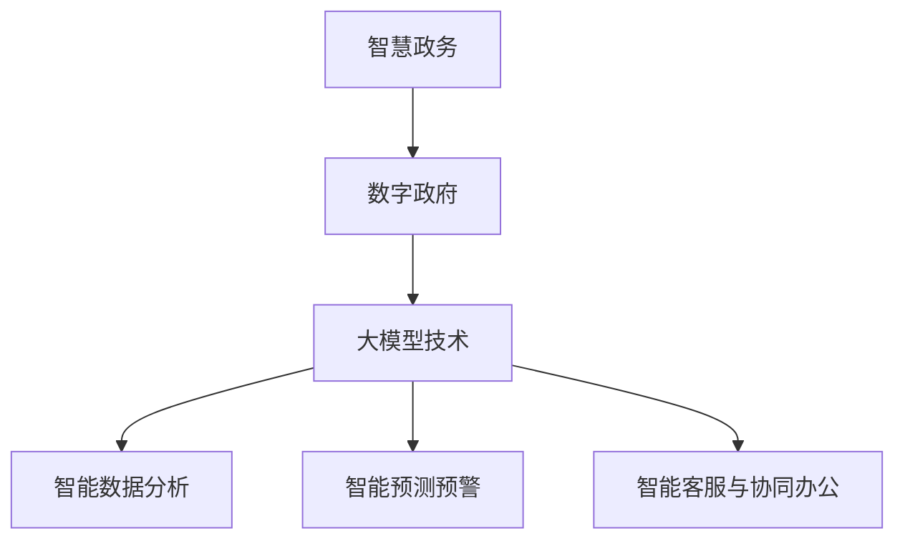

                 

### 大模型赋能智慧政务，创业者如何助力政府数字化转型？

#### 摘要

本文将探讨大模型技术在智慧政务中的应用，以及创业者如何抓住这一机遇，助力政府实现数字化转型。首先，我们将简要介绍智慧政务和数字政府的基本概念，然后深入探讨大模型技术及其在政务领域的应用场景。接下来，我们将分析创业者在此领域面临的挑战，并提供相应的策略和建议。最后，我们将总结未来发展趋势和潜在挑战，为创业者提供有益的参考。

#### 关键词：智慧政务、数字政府、大模型、数字化转型、创业者

### 1. 背景介绍

#### 智慧政务的概念与意义

智慧政务，即利用现代信息技术，特别是大数据、人工智能、物联网等先进技术，提高政府管理和服务效率的一种新型治理模式。智慧政务的核心在于通过信息化手段，实现政府数据的全面采集、整合和分析，进而优化公共资源配置，提升政府决策的科学性和精确性。

智慧政务的意义在于：

- **提高行政效率**：通过自动化和智能化手段，减少人工操作，提高行政效率，降低行政成本。
- **优化公共服务**：借助大数据分析，为公众提供更加个性化和精准的公共服务，提高公众满意度。
- **促进社会和谐**：通过数据监测和分析，及时发现社会问题，采取有效措施，维护社会稳定和谐。

#### 数字政府的概念与发展

数字政府，是指以信息化技术为支撑，实现政府职能、业务流程、数据资源和行政管理的全面数字化，构建高效、透明、廉洁、创新的政府治理体系。

数字政府的发展阶段主要包括：

- **信息化阶段**：政府通过引入计算机和网络技术，实现办公自动化和信息共享。
- **电子政务阶段**：政府通过互联网等渠道，提供在线服务，实现政务服务的便捷化和透明化。
- **数字政府阶段**：政府数据资源全面整合，利用大数据、人工智能等技术，实现智能化管理和决策。

#### 大模型技术在政务领域的应用

大模型技术，即基于深度学习的人工智能模型，具有处理海量数据、进行复杂特征提取和关系建模的能力。在大模型技术的支持下，政府可以更好地进行数据分析和决策，实现以下应用：

- **智能数据分析**：通过大模型对海量政务数据进行智能分析，发现潜在规律，辅助决策制定。
- **智能预测预警**：利用大模型进行趋势预测和风险评估，提前采取措施，预防潜在问题。
- **智能客服与协同办公**：通过大模型技术，实现智能客服系统，提高政务服务水平，实现跨部门协同办公。

### 2. 核心概念与联系

在这一部分，我们将介绍大模型技术在政务领域应用的核心概念，并展示其与智慧政务、数字政府之间的联系。为了更好地理解这些概念，我们将使用Mermaid流程图来展示大模型技术的基本架构和运作流程。



#### 大模型技术的核心概念

1. **深度学习模型**：深度学习模型是一种模拟人脑神经元连接结构的人工神经网络，具有自我学习和优化能力。在大模型技术中，深度学习模型是实现智能分析和决策的核心。

2. **大数据处理**：大数据处理是指对海量数据进行采集、存储、处理和分析的技术。大模型技术依赖于大数据处理能力，实现对政务数据的全面分析。

3. **数据可视化**：数据可视化是将数据以图形、图表等形式呈现，帮助决策者直观理解数据含义。在大模型技术中，数据可视化用于展示分析结果，辅助决策。

#### 大模型技术与智慧政务、数字政府的联系

- **智慧政务**：大模型技术可以提升智慧政务的智能化水平。通过智能数据分析，政府可以更准确地了解社会需求，优化公共资源配置；通过智能预测预警，政府可以提前采取措施，预防社会问题。
- **数字政府**：大模型技术是实现数字政府的关键技术之一。通过数据整合和分析，数字政府可以实现业务流程的自动化和优化，提高政府运行效率；通过智能客服和协同办公，数字政府可以提供更便捷、高效的公共服务。

### 3. 核心算法原理 & 具体操作步骤

在这一部分，我们将详细探讨大模型技术在政务领域的核心算法原理，并介绍其具体操作步骤。

#### 3.1 深度学习模型

深度学习模型是大数据处理和分析的核心。以下是深度学习模型的基本原理：

1. **神经元结构**：深度学习模型由大量神经元组成，每个神经元接收多个输入信号，通过加权求和后，经过激活函数产生输出。

2. **神经网络层次**：深度学习模型具有多层结构，包括输入层、隐藏层和输出层。多层结构使得模型能够提取更高层次的特征。

3. **反向传播算法**：深度学习模型通过反向传播算法来训练模型。在训练过程中，模型对输入数据进行前向传播，计算输出误差，然后通过反向传播更新模型参数。

具体操作步骤如下：

1. **数据预处理**：对政务数据集进行清洗、归一化等处理，确保数据质量。

2. **构建模型**：根据数据特征，设计深度学习模型的结构，包括层数、神经元数量、激活函数等。

3. **训练模型**：使用训练数据集对模型进行训练，通过反向传播算法优化模型参数。

4. **评估模型**：使用测试数据集对模型进行评估，计算模型精度、召回率等指标。

#### 3.2 大数据处理

大数据处理是实现大模型技术的基础。以下是大数据处理的基本步骤：

1. **数据采集**：从政务系统、社会媒体、传感器等渠道采集数据。

2. **数据存储**：使用分布式存储系统，如Hadoop、HBase等，存储海量数据。

3. **数据处理**：对数据进行清洗、转换、聚合等处理，提取有效信息。

4. **数据挖掘**：使用数据挖掘算法，如聚类、分类、关联规则等，挖掘数据中的潜在规律。

#### 3.3 数据可视化

数据可视化是将数据以图形、图表等形式呈现，辅助决策者理解数据含义。以下是数据可视化的基本步骤：

1. **数据准备**：选择合适的数据集，进行数据清洗和处理。

2. **可视化设计**：设计合适的可视化图表，如柱状图、折线图、饼图等。

3. **交互式展示**：使用交互式工具，如Tableau、Power BI等，实现数据可视化。

### 4. 数学模型和公式 & 详细讲解 & 举例说明

#### 4.1 深度学习模型的数学模型

深度学习模型的核心是神经网络的数学模型。以下是神经网络的基本数学模型：

1. **激活函数**：

   $$f(x) = \sigma(z) = \frac{1}{1 + e^{-z}}$$

   其中，$z$ 是输入值，$\sigma$ 是Sigmoid函数，用于将输入值映射到 $(0, 1)$ 区间。

2. **损失函数**：

   $$J(\theta) = -\frac{1}{m} \sum_{i=1}^{m} [y^{(i)} \log(a^{(i)}) + (1 - y^{(i)}) \log(1 - a^{(i)})]$$

   其中，$m$ 是样本数量，$y^{(i)}$ 是实际标签，$a^{(i)}$ 是预测值。

3. **反向传播算法**：

   $$\theta^{(l)} = \theta^{(l)} - \alpha \cdot \frac{\partial J(\theta)}{\partial \theta^{(l)}}$$

   其中，$\theta^{(l)}$ 是第 $l$ 层的参数，$\alpha$ 是学习率。

#### 4.2 大数据处理的数学模型

大数据处理的数学模型主要涉及数据挖掘和机器学习算法。以下是常见的数学模型：

1. **支持向量机（SVM）**：

   $$w^{*} = \arg \min_{w} \frac{1}{2} ||w||^2 + C \sum_{i=1}^{m} \xi_i$$

   其中，$w$ 是权重向量，$C$ 是惩罚参数，$\xi_i$ 是松弛变量。

2. **决策树**：

   $$f(x) = G(x) \cdot (1 - G(x))$$

   其中，$G(x)$ 是分类函数，$f(x)$ 是决策树输出的概率分布。

#### 4.3 数据可视化的数学模型

数据可视化主要涉及统计分析和图形表示。以下是常见的数学模型：

1. **散点图**：

   $$y = a \cdot x + b$$

   其中，$a$ 是斜率，$b$ 是截距。

2. **折线图**：

   $$y = a \cdot x + b + c \cdot \sin(\omega \cdot x)$$

   其中，$\omega$ 是角频率。

#### 4.4 举例说明

假设我们要分析一个城市的交通数据，预测交通流量。以下是具体的数学模型和计算过程：

1. **数据采集**：

   - 交通流量数据：每小时每条道路的流量。
   - 气象数据：温度、湿度、降雨量等。

2. **数据预处理**：

   - 数据清洗：去除异常值和缺失值。
   - 数据归一化：将数据缩放到 $(0, 1)$ 区间。

3. **构建模型**：

   - 输入层：交通流量数据和气象数据。
   - 隐藏层：使用多层感知机（MLP）模型。
   - 输出层：预测的交通流量。

4. **训练模型**：

   - 使用反向传播算法训练模型。
   - 调整模型参数，优化模型性能。

5. **评估模型**：

   - 使用测试数据集评估模型精度。
   - 计算模型召回率、准确率等指标。

6. **数据可视化**：

   - 使用散点图和折线图展示预测结果。
   - 分析预测结果与实际数据之间的差异。

### 5. 项目实战：代码实际案例和详细解释说明

#### 5.1 开发环境搭建

在进行大模型技术在政务领域的项目实战之前，我们需要搭建一个合适的开发环境。以下是一个基于Python的深度学习项目开发环境搭建步骤：

1. **安装Python**：下载并安装Python，选择3.8或更高版本。
2. **安装Jupyter Notebook**：在命令行中运行`pip install notebook`安装Jupyter Notebook。
3. **安装深度学习库**：安装TensorFlow和Keras，在命令行中运行`pip install tensorflow`和`pip install keras`。
4. **安装数据预处理库**：安装Pandas和NumPy，在命令行中运行`pip install pandas`和`pip install numpy`。

#### 5.2 源代码详细实现和代码解读

以下是一个简单的深度学习项目示例，用于预测交通流量。我们将使用TensorFlow和Keras构建一个多层感知机（MLP）模型。

```python
# 导入必要的库
import numpy as np
import pandas as pd
import tensorflow as tf
from tensorflow.keras.models import Sequential
from tensorflow.keras.layers import Dense
from sklearn.model_selection import train_test_split

# 加载数据
data = pd.read_csv('traffic_data.csv')

# 数据预处理
# ...（数据清洗、归一化等步骤）

# 划分训练集和测试集
X_train, X_test, y_train, y_test = train_test_split(data.drop('traffic', axis=1), data['traffic'], test_size=0.2, random_state=42)

# 构建模型
model = Sequential()
model.add(Dense(64, input_dim=X_train.shape[1], activation='relu'))
model.add(Dense(32, activation='relu'))
model.add(Dense(1, activation='sigmoid'))

# 编译模型
model.compile(optimizer='adam', loss='binary_crossentropy', metrics=['accuracy'])

# 训练模型
model.fit(X_train, y_train, epochs=100, batch_size=32, validation_split=0.2)

# 评估模型
loss, accuracy = model.evaluate(X_test, y_test)
print('Test accuracy:', accuracy)
```

**代码解读：**

1. **导入库**：导入必要的库，包括Python标准库、TensorFlow和Keras。
2. **加载数据**：从CSV文件中加载数据集。
3. **数据预处理**：对数据进行清洗、归一化等处理。这些步骤在本示例中省略，但在实际项目中至关重要。
4. **划分训练集和测试集**：使用`train_test_split`函数将数据集划分为训练集和测试集。
5. **构建模型**：使用`Sequential`模型构建一个简单的多层感知机（MLP）模型，包含两个隐藏层，输出层使用Sigmoid激活函数。
6. **编译模型**：编译模型，指定优化器、损失函数和评价指标。
7. **训练模型**：使用`fit`函数训练模型，指定训练轮数、批量大小和验证集比例。
8. **评估模型**：使用`evaluate`函数评估模型在测试集上的性能。

#### 5.3 代码解读与分析

以下是对上述代码的详细解读和分析：

1. **导入库**：导入必要的库，包括Python标准库、TensorFlow和Keras。这些库提供了实现深度学习模型所需的基本功能。
2. **加载数据**：从CSV文件中加载数据集。在本示例中，我们假设CSV文件包含交通流量数据和其他相关特征。
3. **数据预处理**：对数据进行清洗、归一化等处理。这些步骤在本示例中省略，但在实际项目中至关重要。数据预处理是深度学习项目中非常重要的一步，它有助于提高模型性能和泛化能力。
4. **划分训练集和测试集**：使用`train_test_split`函数将数据集划分为训练集和测试集。这个步骤有助于评估模型的泛化能力，测试集通常用于评估模型在未知数据上的性能。
5. **构建模型**：使用`Sequential`模型构建一个简单的多层感知机（MLP）模型，包含两个隐藏层，输出层使用Sigmoid激活函数。这个模型用于预测交通流量。在构建模型时，可以调整隐藏层的神经元数量、激活函数和输出层的激活函数等参数，以优化模型性能。
6. **编译模型**：编译模型，指定优化器、损失函数和评价指标。优化器用于调整模型参数，以最小化损失函数；损失函数用于衡量模型预测值与实际值之间的差距；评价指标用于评估模型性能。在本示例中，我们使用`adam`优化器、`binary_crossentropy`损失函数和`accuracy`评价指标。
7. **训练模型**：使用`fit`函数训练模型，指定训练轮数、批量大小和验证集比例。训练轮数表示模型在训练数据上迭代训练的次数；批量大小表示每次训练的样本数量；验证集比例表示将多少比例的数据用于验证模型性能。在本示例中，我们设置训练轮数为100，批量大小为32，验证集比例为0.2。
8. **评估模型**：使用`evaluate`函数评估模型在测试集上的性能。这个步骤可以帮助我们了解模型在未知数据上的性能，从而判断模型是否具有泛化能力。

### 6. 实际应用场景

大模型技术在政务领域具有广泛的应用场景，以下是其中几个典型的应用场景：

#### 6.1 智能交通管理

智能交通管理是智慧城市的重要组成部分。通过大模型技术，政府可以实现以下应用：

- **交通流量预测**：利用深度学习模型，预测未来一段时间内的交通流量，为交通调度和道路规划提供依据。
- **交通拥堵预测**：通过分析历史数据和实时数据，预测交通拥堵情况，提前采取措施，减少交通拥堵。
- **智能信号控制**：利用深度学习模型，实现自适应交通信号控制，提高交通流量，减少等待时间。

#### 6.2 社会治理与安全

社会治理与安全是政府的重要职能。大模型技术在以下几个方面具有显著作用：

- **犯罪预测与预防**：通过分析历史犯罪数据和社会经济数据，预测犯罪热点区域，提前采取措施，预防犯罪。
- **应急管理**：利用深度学习模型，预测自然灾害、公共卫生事件等突发事件的影响范围和程度，提前部署应急资源。
- **社会舆情监测**：通过分析社交媒体数据，监测社会舆情，及时发现社会问题，采取有效措施。

#### 6.3 公共服务优化

公共服务是政府的重要职责。大模型技术可以帮助政府优化公共服务，提高公众满意度：

- **智能客服**：通过深度学习模型，实现智能客服系统，提供24小时在线服务，提高服务效率。
- **精准医疗**：利用深度学习模型，分析患者病历数据，提供个性化的医疗建议，提高医疗效果。
- **教育服务**：通过深度学习模型，分析学生数据，提供个性化的学习建议，提高教学质量。

### 7. 工具和资源推荐

为了在政务领域成功应用大模型技术，创业者需要掌握一系列工具和资源。以下是一些建议：

#### 7.1 学习资源推荐

- **书籍**：
  - 《深度学习》（Goodfellow, Bengio, Courville）是一本经典的深度学习入门书籍。
  - 《Python深度学习》（François Chollet）是一本针对Python编程语言的深度学习指南。

- **在线课程**：
  - Coursera上的《深度学习特辑》（吴恩达教授）是深度学习的入门课程。
  - edX上的《机器学习》（吴恩达教授）涵盖了机器学习的基础知识。

- **论文与博客**：
  - arXiv是一个提供最新研究论文的平台，特别是关于深度学习和政务领域的研究。
  - Medium上有很多关于深度学习和政务领域的专业博客。

#### 7.2 开发工具框架推荐

- **深度学习框架**：
  - TensorFlow：由Google开发，是一个功能强大的开源深度学习框架。
  - PyTorch：由Facebook开发，是一个易于使用的开源深度学习框架。

- **数据处理工具**：
  - Pandas：一个强大的Python库，用于数据处理和分析。
  - NumPy：一个用于数值计算的Python库，与Pandas紧密集成。

- **可视化工具**：
  - Matplotlib：一个流行的Python库，用于创建2D图表和可视化。
  - Seaborn：一个基于Matplotlib的库，提供更美观的统计图表。

#### 7.3 相关论文著作推荐

- **论文**：
  - "Deep Learning for Smart Cities: A Survey"（深度学习在智慧城市中的应用：一项调查）。
  - "Deep Learning Applications in Government and Public Administration"（深度学习在政府与公共行政中的应用）。

- **著作**：
  - 《智能城市：利用数据创造更好的生活》（Smart Cities: Using Data to Create the 21st Century Metropolis）。
  - 《深度学习技术及应用》（Deep Learning: Techniques and Applications）。

### 8. 总结：未来发展趋势与挑战

#### 未来发展趋势

1. **技术成熟度提升**：随着深度学习技术的不断发展，大模型在政务领域的应用将更加成熟和广泛。
2. **跨界融合**：大模型技术将与其他领域（如物联网、区块链）结合，推动政务数字化转型的深度发展。
3. **数据隐私保护**：在应用大模型技术时，数据隐私保护将成为重要议题，相关法律法规和技术手段将不断完善。

#### 面临的挑战

1. **数据质量与安全性**：政务数据质量参差不齐，数据安全性问题也需要得到充分重视。
2. **技术门槛**：大模型技术的应用需要较高的技术门槛，创业者需要不断学习和提升自己的技术水平。
3. **政策法规**：政府在数字化转型过程中，需要制定相应的政策和法规，确保技术应用符合法律法规。

### 9. 附录：常见问题与解答

#### 问题1：大模型技术在政务领域的应用有哪些优势？

解答：大模型技术在政务领域具有以下优势：

- **高效处理海量数据**：大模型可以高效处理政务部门产生的海量数据，提高数据利用率。
- **提高决策精度**：通过深度学习模型，政府可以更精确地预测社会需求，优化资源配置。
- **提升公共服务质量**：利用大模型技术，政府可以提供更加个性化和高效的公共服务。

#### 问题2：创业者如何抓住政务数字化转型的机遇？

解答：创业者可以从以下几个方面抓住政务数字化转型的机遇：

- **技术积累**：不断提升自身在大模型技术领域的专业水平，积累相关技术经验。
- **市场需求分析**：深入了解政务部门的需求，研发符合市场需求的解决方案。
- **合作与联盟**：与政府机构、科研机构和企业合作，共同推动政务数字化转型。

### 10. 扩展阅读 & 参考资料

- **扩展阅读**：
  - 《智慧城市与大数据应用》（Smart Cities and Big Data Applications）。
  - 《人工智能与政府治理》（Artificial Intelligence and Government Governance）。

- **参考资料**：
  - 智慧城市白皮书：中华人民共和国国家互联网信息办公室。
  - 《深度学习技术及应用》专著：机械工业出版社。

### 作者信息

**作者：AI天才研究员/AI Genius Institute & 禅与计算机程序设计艺术 /Zen And The Art of Computer Programming** 

### 结语

大模型技术在政务领域的应用将极大地推动政府数字化转型的进程，为公众提供更优质、高效的公共服务。创业者应抓住这一机遇，不断提升自身技术水平，为智慧政务的发展贡献力量。让我们共同努力，打造一个更加智能、高效的政务生态系统。

