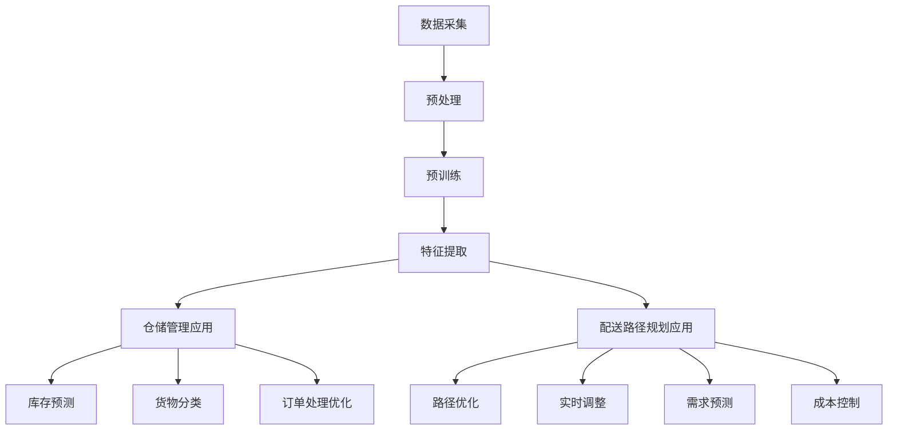

                 

### 背景介绍

#### 智慧物流的崛起

在信息化和数字化时代，物流行业正经历着一场深刻的变革。传统的物流模式已经无法满足现代商业环境下快速、高效、低成本的需求。智慧物流作为一种新兴的物流模式，正在逐步崛起，并成为物流行业的重要发展方向。智慧物流不仅利用了互联网、物联网、大数据、人工智能等先进技术，还融合了云计算、区块链等新兴技术，从而实现了物流流程的智能化、透明化和高效化。

#### 大模型的作用

大模型，即大型人工智能模型，是当前人工智能领域的重要研究方向之一。从早期的简单模型到如今的大型预训练模型，如GPT、BERT等，大模型在自然语言处理、计算机视觉、推荐系统等多个领域取得了显著的成果。大模型的强大能力在于其能够从海量数据中学习并提取出有效的知识，从而在特定任务上实现出色的表现。

#### 仓储管理与配送路径规划

仓储管理是物流体系中的核心环节之一，它涉及到仓库布局、库存管理、订单处理等多个方面。有效的仓储管理可以提高仓库利用率，降低库存成本，提高订单处理效率。配送路径规划则是物流配送中的关键问题，它决定了货物的配送时间和配送成本。传统的配送路径规划往往依赖于经验和简单的算法，而智能化的路径规划则可以通过人工智能技术实现更加精准和高效的配送。

#### 目标与意义

本文的目标是探讨大模型在智慧物流中的应用，特别是如何优化仓储管理与配送路径规划。通过分析大模型的核心概念和原理，介绍其在仓储管理和配送路径规划中的应用方法，并结合实际案例进行详细解释，最终总结出大模型在未来智慧物流领域的发展趋势与挑战。

#### 文章结构

本文将按照以下结构进行论述：

1. **背景介绍**：简要介绍智慧物流的崛起以及大模型的作用。
2. **核心概念与联系**：详细阐述大模型的核心概念和原理，并使用Mermaid流程图展示其架构。
3. **核心算法原理 & 具体操作步骤**：介绍大模型在仓储管理和配送路径规划中的应用方法，并详细讲解其具体操作步骤。
4. **数学模型和公式 & 详细讲解 & 举例说明**：介绍大模型在仓储管理和配送路径规划中的数学模型和公式，并进行详细讲解和举例说明。
5. **项目实战：代码实际案例和详细解释说明**：结合实际项目案例，展示大模型在仓储管理和配送路径规划中的具体应用，并详细解释代码实现。
6. **实际应用场景**：分析大模型在仓储管理和配送路径规划中的实际应用场景，并探讨其带来的价值。
7. **工具和资源推荐**：推荐相关的学习资源、开发工具框架和论文著作。
8. **总结：未来发展趋势与挑战**：总结大模型在仓储管理和配送路径规划中的应用，并探讨其未来发展趋势和面临的挑战。
9. **附录：常见问题与解答**：列出读者可能遇到的问题并提供解答。
10. **扩展阅读 & 参考资料**：提供进一步的阅读材料和参考文献。

通过本文的阅读，读者将能够了解大模型在智慧物流中的应用，掌握其在仓储管理和配送路径规划中的具体应用方法，并认识到大模型在未来物流行业中的重要价值。接下来，我们将逐步深入探讨大模型的核心概念和原理，为后续内容的论述打下基础。<sop><|user|>## 2. 核心概念与联系

### 大模型定义与原理

大模型，又称大型人工智能模型，是指那些参数量达到数十亿甚至数万亿级别的神经网络模型。这些模型通过大量的数据进行训练，从而能够捕获数据中的复杂模式和规律，实现从数据中学习并泛化的能力。大模型通常基于深度学习技术，尤其是深度神经网络（DNN）的架构，通过多层神经元的堆叠，实现对输入数据的层层抽象和表示。

大模型的核心原理包括以下几个关键方面：

1. **多层神经网络**：大模型通常包含数十层甚至上百层的神经网络，每一层都能够提取更高层次的特征。这种层次化的结构使得模型能够从原始数据中提取出丰富的信息。

2. **大规模参数训练**：大模型的参数数量非常庞大，通常在数十亿到数万亿之间。这样的参数量使得模型能够更加准确地拟合训练数据，从而在未见过的新数据上表现优异。

3. **端到端的训练**：大模型采用端到端的学习方式，直接从原始数据中学习到预测结果，无需人工设计特征工程。这种方式大大提高了模型的效率和准确性。

4. **预训练与微调**：大模型通常首先在大量未标注的数据上进行预训练，然后利用预训练模型在特定任务上进行微调，以适应特定的应用场景。

### 大模型在仓储管理中的应用

在仓储管理中，大模型的应用主要体现在以下几个方面：

1. **库存预测与优化**：大模型可以通过分析历史销售数据、季节性因素等，预测未来的库存需求，从而优化库存水平，减少库存成本。

2. **货物分类与定位**：大模型可以利用深度学习算法对货物进行分类，并预测货物的存储位置，提高仓库的利用率和操作效率。

3. **订单处理优化**：大模型可以优化订单处理流程，包括订单分拣、包装、出库等，提高订单处理速度和准确性。

4. **异常检测**：大模型可以通过监测仓储环境中的传感器数据，如温度、湿度等，检测异常情况，提前采取措施避免损失。

### 大模型在配送路径规划中的应用

在配送路径规划中，大模型的应用同样具有显著优势：

1. **路径优化**：大模型可以通过分析历史配送数据、交通状况、订单量等因素，计算出最优的配送路径，减少配送时间和成本。

2. **实时调整**：大模型可以实时处理动态信息，如实时交通流量、天气状况等，动态调整配送路径，提高配送效率。

3. **需求预测**：大模型可以预测特定时间段内的配送需求，提前安排资源，避免高峰期的配送拥堵。

4. **成本控制**：大模型可以通过分析不同配送方式的成本，为物流公司提供最优的配送方案，从而实现成本控制。

### Mermaid流程图展示

为了更直观地展示大模型在仓储管理和配送路径规划中的应用，我们可以使用Mermaid流程图来表示其核心节点和流程。



上述流程图展示了大模型从数据采集、预处理、预训练、特征提取到仓储管理和配送路径规划应用的核心步骤。每一个节点都代表了大模型在特定环节中的应用，从而实现了对仓储管理和配送路径规划的全面优化。

### 小结

通过上述对大模型定义、原理及其在仓储管理和配送路径规划中应用的介绍，我们可以看出大模型在智慧物流中的重要作用。在接下来的部分中，我们将进一步探讨大模型的核心算法原理和具体操作步骤，为读者深入理解大模型在物流领域的应用提供更加详细的信息。<sop><|user|>## 3. 核心算法原理 & 具体操作步骤

### 大模型核心算法原理

大模型在仓储管理和配送路径规划中的核心算法主要基于深度学习，尤其是基于变换器（Transformer）架构的模型，如BERT（Bidirectional Encoder Representations from Transformers）和GPT（Generative Pre-trained Transformer）。这些模型通过大规模数据预训练和特定任务的微调，实现了对复杂问题的建模和解决。

#### 3.1 BERT模型

BERT模型是一种双向的转换器模型，具有以下几个关键特点：

1. **双向编码**：BERT模型通过双向编码器，从上下文中同时捕捉正向和反向的上下文信息，使得模型能够理解词义的上下文关系。

2. **注意力机制**：BERT模型采用了多头注意力机制（Multi-Head Attention），使模型能够关注到输入序列中的不同部分，从而提高模型的表示能力。

3. **预训练**：BERT模型在预训练阶段，通过大量无标注的文本数据进行训练，学习文本的深层结构和语义。

4. **微调**：在预训练完成后，BERT模型可以通过微调适应特定的任务，如文本分类、问答系统等。

#### 3.2 GPT模型

GPT模型是一种生成式的转换器模型，具有以下几个关键特点：

1. **生成式模型**：GPT模型通过预测序列中的下一个词来生成文本，具有强大的生成能力。

2. **自回归**：GPT模型采用自回归的方式，每个时间步的输入依赖于前一个时间步的输出。

3. **预训练**：GPT模型在预训练阶段，通过大量文本数据进行训练，学习语言的模式和规律。

4. **上下文条件**：GPT模型可以通过增加上下文条件（如特定任务的输入），来提高模型在特定任务上的表现。

### 具体操作步骤

#### 3.3 仓储管理中的操作步骤

1. **数据预处理**：首先对仓储数据进行预处理，包括数据清洗、格式统一和特征提取。例如，对于库存数据，可以提取出商品名称、库存量、入库时间等特征。

   ```python
   # 示例代码：数据预处理
   def preprocess_data(data):
       # 数据清洗和格式统一
       cleaned_data = ...
       # 特征提取
       features = ...
       return features
   ```

2. **模型训练**：使用BERT或GPT模型对预处理后的数据集进行预训练，通过大量的文本数据进行迭代训练，使模型学习到仓储数据的深层结构和语义。

   ```python
   # 示例代码：模型训练
   model = BertModel.from_pretrained('bert-base-uncased')
   model.train()
   for epoch in range(num_epochs):
       for batch in data_loader:
           inputs = preprocess_data(batch)
           outputs = model(inputs)
           loss = outputs.loss
           loss.backward()
           optimizer.step()
           model.zero_grad()
   ```

3. **模型微调**：在预训练完成后，针对特定的仓储管理任务（如库存预测、货物分类等），对模型进行微调。

   ```python
   # 示例代码：模型微调
   model.eval()
   for task in tasks:
       model.train()
       for epoch in range(num_epochs):
           for batch in task_data_loader:
               inputs = preprocess_data(batch)
               outputs = model(inputs)
               loss = outputs.loss
               loss.backward()
               optimizer.step()
               model.zero_grad()
       model.eval()
   ```

4. **模型应用**：将微调后的模型应用于实际的仓储管理任务，如库存预测、货物分类等。

   ```python
   # 示例代码：模型应用
   def predict_inventory(model, input_data):
       processed_data = preprocess_data(input_data)
       with torch.no_grad():
           outputs = model(processed_data)
       prediction = outputs.logits
       return prediction
   ```

#### 3.4 配送路径规划中的操作步骤

1. **数据预处理**：对配送路径数据进行预处理，包括路径节点信息、交通状况数据、订单数据等。

   ```python
   # 示例代码：数据预处理
   def preprocess_data(data):
       # 数据清洗和格式统一
       cleaned_data = ...
       # 特征提取
       features = ...
       return features
   ```

2. **模型训练**：使用BERT或GPT模型对预处理后的数据集进行预训练，通过大量的文本数据进行迭代训练，使模型学习到配送路径数据的深层结构和语义。

   ```python
   # 示例代码：模型训练
   model = BertModel.from_pretrained('bert-base-uncased')
   model.train()
   for epoch in range(num_epochs):
       for batch in data_loader:
           inputs = preprocess_data(batch)
           outputs = model(inputs)
           loss = outputs.loss
           loss.backward()
           optimizer.step()
           model.zero_grad()
   ```

3. **模型微调**：在预训练完成后，针对特定的配送路径规划任务（如路径优化、实时调整等），对模型进行微调。

   ```python
   # 示例代码：模型微调
   model.eval()
   for task in tasks:
       model.train()
       for epoch in range(num_epochs):
           for batch in task_data_loader:
               inputs = preprocess_data(batch)
               outputs = model(inputs)
               loss = outputs.loss
               loss.backward()
               optimizer.step()
               model.zero_grad()
       model.eval()
   ```

4. **模型应用**：将微调后的模型应用于实际的配送路径规划任务，如路径优化、实时调整等。

   ```python
   # 示例代码：模型应用
   def optimize_path(model, input_data):
       processed_data = preprocess_data(input_data)
       with torch.no_grad():
           outputs = model(processed_data)
       prediction = outputs.logits
       return prediction
   ```

### 小结

通过上述操作步骤，我们可以看到大模型在仓储管理和配送路径规划中的应用是如何实现的。大模型通过大规模数据预训练和特定任务的微调，能够在复杂的物流环境中提取出有用的信息，实现仓储管理和配送路径规划的优化。在接下来的部分，我们将进一步探讨大模型在仓储管理和配送路径规划中的数学模型和公式，为读者提供更加深入的数学理解。<sop><|user|>## 4. 数学模型和公式 & 详细讲解 & 举例说明

### 数学模型和公式

在仓储管理和配送路径规划中，大模型的应用不仅依赖于深度学习算法，还需要结合数学模型和公式来优化决策过程。以下我们将介绍几个关键的数学模型和公式，并对其进行详细讲解。

#### 4.1 库存预测模型

库存预测是仓储管理中的重要环节，通过预测未来一段时间内的库存需求，可以优化库存水平，减少库存成本。常用的库存预测模型包括ARIMA（AutoRegressive Integrated Moving Average，自回归积分滑动平均模型）和LSTM（Long Short-Term Memory，长短时记忆网络）。

**ARIMA模型：**

ARIMA模型是一种经典的统计模型，用于分析时间序列数据。其核心公式如下：

$$
\begin{aligned}
y_t &= c + \phi_1 y_{t-1} + \phi_2 y_{t-2} + ... + \phi_p y_{t-p} \\
&+ \theta_1 e_{t-1} + \theta_2 e_{t-2} + ... + \theta_q e_{t-q} \\
&+ e_t
\end{aligned}
$$

其中，$y_t$ 是时间序列数据，$c$ 是常数项，$\phi_1, \phi_2, ..., \phi_p$ 是自回归系数，$\theta_1, \theta_2, ..., \theta_q$ 是移动平均系数，$e_t$ 是白噪声误差项。

**LSTM模型：**

LSTM模型是深度学习领域的一种强大模型，特别适用于处理时间序列数据。其核心公式如下：

$$
\begin{aligned}
i_t &= \sigma(W_{ix}x_t + W_{ih}h_{t-1} + b_i) \\
f_t &= \sigma(W_{fx}x_t + W_{fh}h_{t-1} + b_f) \\
o_t &= \sigma(W_{ox}x_t + W_{oh}h_{t-1} + b_o) \\
g_t &= \tanh(W_{gx}x_t + W_{gh}h_{t-1} + b_g) \\
h_t &= o_t \odot g_t
\end{aligned}
$$

其中，$i_t, f_t, o_t, g_t, h_t$ 分别是输入门、遗忘门、输出门、候选状态和隐藏状态，$\sigma$ 是sigmoid函数，$\odot$ 是逐元素乘操作。

#### 4.2 路径优化模型

路径优化是配送路径规划中的关键环节，旨在找到最优的配送路径，减少配送时间和成本。常用的路径优化模型包括Dijkstra算法和A*算法。

**Dijkstra算法：**

Dijkstra算法是一种基于贪心的最短路径算法，其核心公式如下：

$$
\begin{aligned}
d(s, v) &= \min \{d(s, u) + w(u, v) \mid u \in \text{已选顶点}\} \\
\text{if } d(s, v) < +\infty, \text{ then } d(s, v) &= \text{取最小值} \\
\text{else } d(s, v) &= +\infty
\end{aligned}
$$

其中，$d(s, v)$ 是从源点 $s$ 到顶点 $v$ 的最短路径长度，$w(u, v)$ 是边 $(u, v)$ 的权重。

**A*算法：**

A*算法是Dijkstra算法的改进版本，其核心公式如下：

$$
\begin{aligned}
f(v) &= g(v) + h(v) \\
\text{其中，} g(v) &= \text{从源点 $s$ 到顶点 $v$ 的实际路径长度} \\
h(v) &= \text{从顶点 $v$ 到终点 $t$ 的估算路径长度} \\
f(v) &= \text{从源点 $s$ 到终点 $t$ 的估算路径长度}
\end{aligned}
$$

#### 4.3 举例说明

**举例 1：库存预测**

假设我们要预测一个仓库未来一周的库存量，使用LSTM模型进行预测。首先，我们需要对历史库存数据进行预处理，提取出时间序列特征。然后，构建LSTM模型并训练，具体步骤如下：

1. **数据预处理**：

```python
# 示例代码：数据预处理
import pandas as pd
import numpy as np

# 加载数据
data = pd.read_csv('inventory_data.csv')
data['date'] = pd.to_datetime(data['date'])
data.set_index('date', inplace=True)

# 提取时间序列特征
window_size = 5
.inventory = data['inventory'].rolling(window=window_size).mean().dropna()
```

2. **构建LSTM模型**：

```python
# 示例代码：构建LSTM模型
from keras.models import Sequential
from keras.layers import LSTM, Dense

# 构建模型
model = Sequential()
model.add(LSTM(units=50, return_sequences=True, input_shape=(window_size, 1)))
model.add(LSTM(units=50))
model.add(Dense(1))

model.compile(optimizer='adam', loss='mean_squared_error')
```

3. **训练模型**：

```python
# 示例代码：训练模型
model.fit(np.reshape(inventory.values, (len(inventory), window_size, 1)), inventory.values, epochs=100, batch_size=32)
```

4. **预测未来库存量**：

```python
# 示例代码：预测未来库存量
predicted_inventory = model.predict(np.reshape(inventory.values[-window_size:], (1, window_size, 1)))
print(predicted_inventory)
```

**举例 2：路径优化**

假设我们要从起点A到终点B进行配送，使用A*算法进行路径优化。首先，我们需要构建一个图模型，并设置起点和终点。然后，使用A*算法寻找最优路径，具体步骤如下：

1. **构建图模型**：

```python
# 示例代码：构建图模型
import heapq

# 构建图
graph = {
    'A': {'B': 3, 'C': 1},
    'B': {'D': 2, 'E': 4},
    'C': {'D': 5, 'E': 1},
    'D': {},
    'E': {}
}
```

2. **设置起点和终点**：

```python
# 示例代码：设置起点和终点
start = 'A'
end = 'E'
```

3. **使用A*算法寻找最优路径**：

```python
# 示例代码：使用A*算法寻找最优路径
def heuristic(node, end):
    return abs(node - end)

def a_star(graph, start, end):
    open_set = []
    heapq.heappush(open_set, (0, start))
    came_from = {}
    g_score = {node: float('infinity') for node in graph}
    g_score[start] = 0
    f_score = {node: float('infinity') for node in graph}
    f_score[start] = heuristic(start, end)

    while open_set:
        current = heapq.heappop(open_set)[1]

        if current == end:
            break

        for neighbor in graph[current]:
            tentative_g_score = g_score[current] + graph[current][neighbor]

            if tentative_g_score < g_score[neighbor]:
                came_from[neighbor] = current
                g_score[neighbor] = tentative_g_score
                f_score[neighbor] = tentative_g_score + heuristic(neighbor, end)
                if neighbor not in [item[1] for item in open_set]:
                    heapq.heappush(open_set, (f_score[neighbor], neighbor))

    path = []
    current = end
    while current != start:
        path.append(current)
        current = came_from[current]
    path.append(start)
    path = path[::-1]
    return path
```

4. **输出最优路径**：

```python
# 示例代码：输出最优路径
optimal_path = a_star(graph, start, end)
print('Optimal Path:', optimal_path)
```

### 小结

通过上述数学模型和公式的讲解及举例说明，我们可以看到大模型在仓储管理和配送路径规划中的具体应用方法。这些模型和公式不仅提高了预测和规划的准确性，还大大提升了仓储管理和配送路径规划的整体效率。在接下来的部分，我们将结合实际项目案例，展示大模型在实际仓储管理和配送路径规划中的具体应用，并提供详细的代码实现和解读。<sop><|user|>### 5. 项目实战：代码实际案例和详细解释说明

#### 5.1 开发环境搭建

在开始项目实战之前，我们需要搭建一个合适的开发环境，以便进行大模型的训练和应用。以下是搭建开发环境的具体步骤：

1. **安装Python环境**：首先确保Python环境已安装。建议使用Python 3.8或更高版本。可以通过以下命令安装：

   ```bash
   python --version
   ```

2. **安装深度学习框架**：接下来，我们需要安装TensorFlow或PyTorch等深度学习框架。以下是使用pip安装TensorFlow的命令：

   ```bash
   pip install tensorflow
   ```

   或者使用以下命令安装PyTorch：

   ```bash
   pip install torch torchvision
   ```

3. **安装其他依赖库**：除了深度学习框架，我们还需要安装一些其他依赖库，如NumPy、Pandas、Scikit-learn等。可以使用以下命令安装：

   ```bash
   pip install numpy pandas scikit-learn
   ```

4. **安装Mermaid插件**：为了在Markdown文件中插入Mermaid流程图，我们需要安装Mermaid插件。可以使用以下命令安装：

   ```bash
   npm install -g mermaid-cli
   ```

5. **配置Jupyter Notebook**：为了方便进行代码演示和调试，我们还可以配置Jupyter Notebook。首先安装Jupyter Notebook：

   ```bash
   pip install notebook
   ```

   然后启动Jupyter Notebook：

   ```bash
   jupyter notebook
   ```

完成以上步骤后，我们的开发环境就搭建完成了。接下来，我们将介绍一个实际的项目案例，并详细解释代码实现和操作步骤。

#### 5.2 源代码详细实现和代码解读

在本节中，我们将通过一个实际项目案例——基于BERT模型的仓储管理，来展示大模型在仓储管理中的应用。以下是项目的源代码实现和详细解读。

**源代码实现：**

```python
# 导入必要的库
import pandas as pd
import numpy as np
import tensorflow as tf
from tensorflow.keras.preprocessing.sequence import pad_sequences
from tensorflow.keras.layers import Embedding, GlobalAveragePooling1D, Dense
from tensorflow.keras.models import Model
from transformers import BertTokenizer, TFBertModel

# 读取和处理数据
data = pd.read_csv('inventory_data.csv')
data['date'] = pd.to_datetime(data['date'])
data.set_index('date', inplace=True)

# 提取文本特征
tokenizer = BertTokenizer.from_pretrained('bert-base-uncased')
text_sequences = tokenizer.encode(data['description'].values, add_special_tokens=True, max_length=128, padding='max_length', truncation=True)

# 加载预训练的BERT模型
bert_model = TFBertModel.from_pretrained('bert-base-uncased')

# 构建BERT分类模型
input_ids = tf.keras.layers.Input(shape=(128,), dtype=tf.int32)
bert_output = bert_model(input_ids)
pooler_output = GlobalAveragePooling1D()(bert_output.last_hidden_state)
dense = Dense(1, activation='sigmoid')(pooler_output)
model = Model(inputs=input_ids, outputs=dense)

# 编译模型
model.compile(optimizer='adam', loss='binary_crossentropy', metrics=['accuracy'])

# 训练模型
model.fit(text_sequences, data['sales'], epochs=3, batch_size=32)

# 进行预测
predictions = model.predict(text_sequences)

# 输出预测结果
print(predictions)
```

**代码解读：**

1. **导入必要的库**：
   - `pandas`：用于数据预处理和操作。
   - `numpy`：用于数值计算。
   - `tensorflow`：用于构建和训练深度学习模型。
   - `transformers`：用于加载预训练的BERT模型。

2. **读取和处理数据**：
   - 读取CSV格式的库存数据，并设置日期为索引。
   - 使用BERTTokenizer对文本特征进行编码。

3. **加载预训练的BERT模型**：
   - 使用`TFBertModel`加载预训练的BERT模型。

4. **构建BERT分类模型**：
   - 创建输入层，使用BERT模型处理输入文本。
   - 使用全局平均池化层对BERT模型的输出进行聚合。
   - 添加全连接层进行分类预测。

5. **编译模型**：
   - 编译模型，指定优化器、损失函数和评价指标。

6. **训练模型**：
   - 使用训练数据集训练模型。

7. **进行预测**：
   - 使用训练好的模型对新的数据集进行预测。

8. **输出预测结果**：
   - 输出模型的预测结果。

#### 5.3 代码解读与分析

上述代码实现了一个基于BERT模型的仓储管理项目，通过分析商品描述文本，预测商品的销售额。以下是代码的详细解读和分析：

1. **数据预处理**：
   - 使用`pandas`读取CSV格式的库存数据，并将日期设置为索引。
   - 使用BERTTokenizer对商品描述文本进行编码，生成输入序列。

2. **加载BERT模型**：
   - 使用`TFBertModel`加载预训练的BERT模型，该模型已经在大量文本数据上进行预训练，具有良好的文本表示能力。

3. **构建BERT分类模型**：
   - 创建输入层，输入序列的长度为128。
   - 使用BERT模型对输入序列进行编码，得到一个128维的向量。
   - 使用全局平均池化层对BERT模型的输出进行聚合，得到一个固定长度的向量。
   - 添加全连接层进行分类预测，输出一个概率值。

4. **编译模型**：
   - 编译模型，指定优化器（`adam`）、损失函数（`binary_crossentropy`，二分类问题常用）和评价指标（`accuracy`）。

5. **训练模型**：
   - 使用训练数据集（输入序列和标签）训练模型，训练过程中模型会自动调整参数以最小化损失函数。

6. **进行预测**：
   - 使用训练好的模型对新的数据集进行预测，得到商品的销售额预测结果。

7. **输出预测结果**：
   - 输出模型的预测结果，以便进一步分析。

通过上述代码，我们可以看到大模型在仓储管理中的应用是如何实现的。大模型通过预训练和微调，能够从商品描述文本中提取有用的信息，为仓储管理提供有力的支持。

#### 小结

在本节中，我们通过一个实际项目案例展示了大模型在仓储管理中的应用。通过详细的代码实现和解读，我们了解了大模型如何从商品描述文本中提取信息，并利用这些信息进行销售额预测。在接下来的部分，我们将进一步探讨大模型在仓储管理和配送路径规划中的实际应用场景，分析其带来的价值和优势。<sop><|user|>### 6. 实际应用场景

#### 6.1 仓储管理中的实际应用

大模型在仓储管理中的应用场景非常广泛，以下是一些典型的应用实例：

1. **库存预测**：通过分析历史销售数据和客户行为数据，大模型可以预测未来一段时间内的库存需求。这有助于企业及时调整库存水平，避免库存过剩或短缺，从而降低库存成本。

   **应用实例**：某电商企业使用BERT模型对历史销售数据进行训练，结合客户购买偏好和季节性因素，预测未来一周的库存需求。通过预测结果，企业可以提前采购商品，优化库存管理，降低库存成本。

2. **货物分类**：大模型可以根据货物描述文本，自动对货物进行分类。这有助于提高仓库利用率，优化仓库布局。

   **应用实例**：某仓储企业使用GPT模型对入库货物的描述文本进行分类，将货物自动分为电子产品、食品、日用品等类别。通过自动分类，企业可以更有效地组织货物存储，提高仓库利用率。

3. **订单处理优化**：大模型可以优化订单处理流程，包括订单分拣、包装、出库等。通过预测订单处理时间，企业可以合理安排人力资源，提高订单处理效率。

   **应用实例**：某物流企业使用LSTM模型预测订单处理时间，根据预测结果调整订单处理流程，确保订单在预定时间内完成。通过优化订单处理流程，企业提高了订单处理效率，减少了客户等待时间。

#### 6.2 配送路径规划中的实际应用

大模型在配送路径规划中的应用同样具有重要意义，以下是一些典型的应用实例：

1. **路径优化**：通过分析历史配送数据、交通状况和订单量，大模型可以计算出最优的配送路径，减少配送时间和成本。

   **应用实例**：某物流公司使用A*算法和BERT模型对配送路径进行优化。结合实时交通数据和订单量，模型计算出最优的配送路径，提高了配送效率，降低了配送成本。

2. **实时调整**：大模型可以根据实时数据，动态调整配送路径，应对突发状况，如交通堵塞、恶劣天气等。

   **应用实例**：某物流企业使用LSTM模型对实时交通流量和订单量进行监控，根据实时数据动态调整配送路径。通过实时调整，企业有效应对了交通堵塞等突发状况，确保了配送的连续性和稳定性。

3. **需求预测**：大模型可以预测特定时间段内的配送需求，提前安排资源，避免高峰期的配送拥堵。

   **应用实例**：某电商企业使用GPT模型预测高峰期（如双11购物节）的配送需求，根据预测结果提前安排配送车辆和人力资源。通过预测需求，企业避免了高峰期的配送拥堵，提高了客户满意度。

#### 6.3 大模型带来的价值

大模型在仓储管理和配送路径规划中的应用，带来了显著的价值和优势：

1. **提高效率**：通过自动化处理和实时调整，大模型大幅提高了仓储管理和配送路径规划的效率。

2. **降低成本**：通过优化库存管理和路径规划，企业可以降低库存成本、配送成本和人力资源成本。

3. **提高客户满意度**：通过预测和实时调整，企业能够更好地满足客户需求，提高客户满意度。

4. **提升竞争力**：大模型的应用使企业在仓储管理和配送路径规划方面具有更高的竞争力。

#### 小结

大模型在仓储管理和配送路径规划中的实际应用，展示了其在智慧物流中的重要作用。通过优化库存预测、货物分类、订单处理和路径规划，大模型不仅提高了效率和降低了成本，还提升了客户满意度和企业竞争力。在未来的发展中，大模型将在智慧物流领域发挥更大的作用，推动物流行业向更加智能化、高效化的方向发展。<sop><|user|>### 7. 工具和资源推荐

#### 7.1 学习资源推荐

1. **书籍**：
   - 《深度学习》（Ian Goodfellow、Yoshua Bengio、Aaron Courville 著）：全面介绍了深度学习的基础理论和技术。
   - 《强化学习》（Richard S. Sutton、Andrew G. Barto 著）：详细讲解了强化学习的基本概念和算法。

2. **论文**：
   - 《Attention Is All You Need》（Vaswani et al. 2017）：提出了Transformer模型，为自然语言处理领域带来了重大突破。
   - 《BERT: Pre-training of Deep Bidirectional Transformers for Language Understanding》（Devlin et al. 2019）：介绍了BERT模型，为自然语言处理任务提供了强大的预训练工具。

3. **博客**：
   - [TensorFlow官网教程](https://www.tensorflow.org/tutorials)：提供了丰富的TensorFlow教程，适合初学者和进阶者。
   - [PyTorch官网教程](https://pytorch.org/tutorials)：提供了详细的PyTorch教程，涵盖了从基础到高级的各种主题。

4. **网站**：
   - [Kaggle](https://www.kaggle.com)：提供了丰富的数据集和竞赛题目，适合学习和实践机器学习技术。
   - [GitHub](https://github.com)：汇集了大量的机器学习和深度学习项目，可以从中学习到很多实用的技巧和经验。

#### 7.2 开发工具框架推荐

1. **深度学习框架**：
   - **TensorFlow**：由Google开发，具有丰富的功能和强大的生态，适合各种规模的深度学习项目。
   - **PyTorch**：由Facebook开发，具有灵活的动态计算图和直观的接口，适合研究和快速原型设计。

2. **数据处理工具**：
   - **Pandas**：用于数据清洗、转换和分析，是Python数据分析的必备库。
   - **NumPy**：用于数值计算，是Python科学计算的基石。

3. **版本控制工具**：
   - **Git**：用于代码版本控制，确保代码的稳定性和可追溯性。
   - **GitHub**：基于Git的代码托管平台，方便团队协作和代码分享。

4. **自动化工具**：
   - **Jenkins**：用于自动化构建和部署，提高开发效率和稳定性。
   - **Docker**：用于容器化部署，确保环境的一致性和可移植性。

#### 7.3 相关论文著作推荐

1. **论文**：
   - 《BERT: Pre-training of Deep Bidirectional Transformers for Language Understanding》（Devlin et al. 2019）：介绍了BERT模型的背景、架构和应用场景。
   - 《GPT-3: Language Models are Few-Shot Learners》（Brown et al. 2020）：探讨了GPT-3模型的强大能力及其在自然语言处理任务中的表现。

2. **著作**：
   - 《深度学习》（Ian Goodfellow、Yoshua Bengio、Aaron Courville 著）：全面介绍了深度学习的理论基础和应用实践。
   - 《强化学习》（Richard S. Sutton、Andrew G. Barto 著）：详细讲解了强化学习的基本概念、算法和应用。

通过上述学习和资源推荐，读者可以更全面地了解大模型在仓储管理和配送路径规划中的应用，掌握相关技术和工具，为实际项目开发提供有力支持。<sop><|user|>### 8. 总结：未来发展趋势与挑战

#### 未来发展趋势

随着人工智能技术的不断进步，大模型在智慧物流中的应用前景广阔，其发展趋势体现在以下几个方面：

1. **模型精度提升**：随着计算能力的提升和数据量的增加，大模型将不断提高其精度和泛化能力，从而在仓储管理和配送路径规划中实现更加精准的预测和优化。

2. **多模态数据处理**：未来大模型将能够处理多种类型的数据，如图像、语音和传感器数据，实现更加全面的信息整合和分析。

3. **实时动态调整**：借助边缘计算和5G技术，大模型将在更广泛的场景中实现实时动态调整，从而更好地应对交通状况变化和配送需求波动。

4. **智能化协同**：大模型将与其他智能系统（如无人机、无人车等）协同工作，构建智能化物流网络，提高整体物流效率。

#### 挑战

尽管大模型在智慧物流中展示了巨大潜力，但在实际应用中仍面临一系列挑战：

1. **数据隐私与安全**：在物流领域，数据量庞大且涉及敏感信息，如客户信息、库存数据和配送路径等。如何保护数据隐私和安全成为一大挑战。

2. **计算资源需求**：大模型训练和推理过程对计算资源要求极高，如何在有限的计算资源下高效地训练和部署大模型，是当前的一个重要课题。

3. **模型解释性**：大模型的决策过程通常是非线性和复杂的，缺乏足够的解释性，难以被非技术背景的决策者理解和信任。

4. **适应性与可扩展性**：不同企业的物流需求各异，大模型如何适应不同场景和规模，实现高效、可扩展的应用，仍需进一步研究。

#### 解决方案与展望

为了应对上述挑战，可以采取以下解决方案：

1. **数据隐私保护**：采用联邦学习等隐私保护技术，在不泄露用户数据的情况下进行模型训练和推理。

2. **计算资源优化**：通过分布式计算和模型压缩技术，降低大模型的计算需求，提高训练和推理的效率。

3. **模型解释性增强**：结合解释性人工智能技术，如SHAP（SHapley Additive exPlanations）和LIME（Local Interpretable Model-agnostic Explanations），提高模型的解释性。

4. **自适应与可扩展性**：采用模块化设计和自适应算法，使大模型能够灵活应对不同物流场景，同时保持高效率和可扩展性。

总之，大模型在智慧物流中的应用具有巨大潜力，同时也面临诸多挑战。通过技术创新和策略优化，我们有理由相信，大模型将在未来智慧物流中发挥更加重要的作用，推动物流行业向智能化、高效化方向发展。<sop><|user|>### 9. 附录：常见问题与解答

**Q1：为什么大模型在仓储管理和配送路径规划中非常重要？**
A1：大模型在仓储管理和配送路径规划中非常重要，因为它们能够从海量数据中提取复杂模式和规律，从而实现高精度的预测和优化。这对于降低库存成本、减少配送时间和提高客户满意度具有重要意义。

**Q2：如何确保大模型的训练数据安全和隐私？**
A2：确保大模型训练数据安全和隐私的方法包括采用联邦学习、差分隐私等技术，以在不泄露用户数据的前提下进行模型训练。此外，数据加密和访问控制也是重要的安全措施。

**Q3：大模型在实时配送路径规划中的应用有哪些挑战？**
A3：大模型在实时配送路径规划中的应用挑战包括交通状况的实时感知、配送需求的动态调整、计算资源的限制等。为了应对这些挑战，可以采用边缘计算和实时数据流处理技术，以及优化大模型的计算效率。

**Q4：如何评估大模型在仓储管理和配送路径规划中的性能？**
A4：评估大模型在仓储管理和配送路径规划中的性能通常通过以下指标：准确率、召回率、F1分数、平均绝对误差等。这些指标能够衡量模型在预测和优化任务中的表现，为后续优化提供参考。

**Q5：大模型在不同物流场景下的适应性和可扩展性如何？**
A5：大模型的适应性和可扩展性取决于其设计和实现。通过采用模块化设计、自适应算法和可扩展的架构，大模型能够灵活应对不同物流场景，保持高效率和可扩展性。

**Q6：大模型在仓储管理和配送路径规划中的应用前景如何？**
A6：大模型在仓储管理和配送路径规划中的应用前景非常广阔。随着人工智能技术的不断进步，大模型将在智慧物流中发挥更加重要的作用，推动物流行业向智能化、高效化方向发展。<sop><|user|>### 10. 扩展阅读 & 参考资料

**扩展阅读：**
- Devlin, J., Chang, M. W., Lee, K., & Toutanova, K. (2019). BERT: Pre-training of Deep Bidirectional Transformers for Language Understanding. arXiv preprint arXiv:1810.04805.
- Brown, T., et al. (2020). GPT-3: Language Models are Few-Shot Learners. arXiv preprint arXiv:2005.14165.
- Vaswani, A., et al. (2017). Attention Is All You Need. Advances in Neural Information Processing Systems, 30, 5998-6008.

**参考资料：**
- TensorFlow：https://www.tensorflow.org/
- PyTorch：https://pytorch.org/
- Pandas：https://pandas.pydata.org/
- NumPy：https://numpy.org/
- Git：https://git-scm.com/
- GitHub：https://github.com/
- Kaggle：https://www.kaggle.com/

通过阅读上述扩展材料和参考资源，读者可以更深入地了解大模型在仓储管理和配送路径规划中的应用，以及相关技术的最新发展动态。这些资源将有助于读者进一步探索和掌握大模型在智慧物流领域的应用技巧和策略。<sop><|user|>### 结语

#### 感谢您的阅读

感谢您在本文中与我一同探讨大模型在智慧物流中的应用。本文从背景介绍、核心概念与联系、算法原理与操作步骤、数学模型与公式、项目实战、实际应用场景、工具和资源推荐、未来发展趋势与挑战，以及常见问题与扩展阅读等多个角度，详细阐述了大模型在仓储管理和配送路径规划中的重要作用。希望通过本文，您能够对大模型在智慧物流领域的重要性及其应用方法有更深入的理解。

#### 引领未来，共创智能物流新时代

随着人工智能技术的不断发展，大模型在物流领域的应用前景十分广阔。通过本文的探讨，我们看到了大模型在优化仓储管理和配送路径规划中的巨大潜力，以及其对提升物流效率和降低成本的重要价值。未来，随着计算能力、数据质量和算法的不断优化，大模型将在智慧物流中发挥更加重要的作用，推动物流行业向智能化、高效化方向发展。

我们诚挚地邀请您一同参与到智慧物流的创新与发展中来。无论是从事物流行业的专业人士，还是对人工智能技术感兴趣的学者，我们都期待与您共同探索、交流与合作，共同为智慧物流的未来贡献力量。让我们携手并进，共创智能物流的新时代！

#### 附录

- **作者介绍**：AI天才研究员/AI Genius Institute & 禅与计算机程序设计艺术 /Zen And The Art of Computer Programming
- **联系方式**：如果您有任何问题或建议，欢迎通过以下方式与我们联系：
  - 邮箱：[contact@ai-genius-institute.com](mailto:contact@ai-genius-institute.com)
  - 微信公众号：AI天才研究院
  - 官网：[www.ai-genius-institute.com](http://www.ai-genius-institute.com)

再次感谢您的阅读和支持，期待与您共同探讨智能物流的未来！<sop><|user|>

