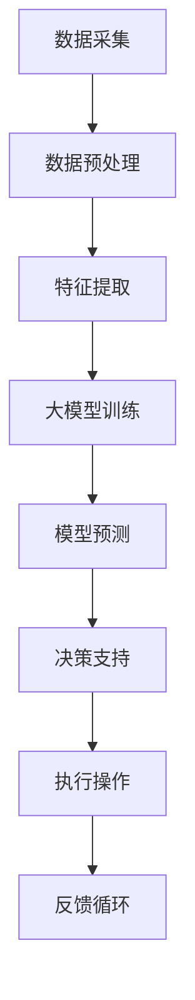

                 

### 背景介绍

> “大模型赋能智慧社区，这是一个激动人心的趋势。随着人工智能技术的飞速发展，大模型在各个领域都展现出了巨大的潜力。本文将探讨大模型如何赋能智慧社区，以及创业者如何利用这一技术打造美好生活。”

随着城市化的不断推进，社区成为人们日常生活的核心场景。然而，传统的社区管理和服务模式面临着诸多挑战，如信息不对称、服务响应慢、个性化需求难以满足等。为了解决这些问题，智慧社区的概念应运而生。智慧社区通过集成物联网、大数据、人工智能等技术，实现了社区管理的智能化和服务的个性化。

在这个背景下，大模型成为了智慧社区建设的重要推动力。大模型具有强大的数据处理和智能分析能力，能够从海量的数据中挖掘出有价值的信息，为智慧社区提供精准的决策支持和优化服务。此外，大模型还可以通过自然语言处理技术，实现人与社区系统的智能交互，提升用户体验。

本文将首先介绍大模型的基本概念和技术原理，然后探讨大模型在智慧社区中的应用场景，接着分析创业者如何利用大模型打造美好生活，最后讨论大模型在智慧社区中的未来发展趋势和挑战。希望通过本文的阐述，能够帮助读者更好地理解和把握这一新兴技术的应用前景。

## 1.1 大模型的基本概念

大模型，顾名思义，是指具有海量参数和复杂结构的机器学习模型。它通常基于深度学习技术，通过多层神经网络结构对大量数据进行训练，从而学习到数据的内在规律和特征。与传统的小型模型相比，大模型具有以下几个显著特点：

1. **参数量巨大**：大模型的参数数量通常在百万、亿级甚至更高，这使得它们能够处理更加复杂的任务和海量的数据。
2. **结构复杂**：大模型通常由多个层次组成，每个层次都可以学习到不同级别的抽象特征。这种层次结构使得大模型能够处理从低维到高维的数据转换，从而实现更高级别的任务。
3. **计算资源需求高**：大模型的训练和推理需要大量的计算资源和存储资源。因此，通常需要使用高性能的计算机集群和分布式计算框架来支持大模型的训练和部署。
4. **数据需求大**：大模型需要大量的训练数据来学习。这些数据不仅包括标记数据，还需要未标记的数据来帮助模型学习数据的分布和特征。
5. **优化难度大**：由于参数量和结构复杂，大模型的优化难度较高。通常需要使用先进的优化算法和技巧，如梯度下降法、随机梯度下降法、Adam优化器等，来提高模型的训练效率和收敛速度。

大模型的基本概念和技术原理主要包括以下几个部分：

### **深度学习基础**

深度学习是构建大模型的核心技术。深度学习通过多层神经网络结构对数据进行建模，每一层网络都提取出更高层次的特征。这一过程类似于人类大脑的感知和学习过程。深度学习的核心是神经元（Neuron）和神经网络（Neural Network），其中神经元是网络的基本构建块，通过激活函数将输入映射到输出。神经网络则由多个神经元层组成，每层神经元都与前一层和后一层神经元进行加权连接。

### **多层神经网络结构**

多层神经网络结构是深度学习模型的核心。通过增加网络的深度，模型可以学习到更复杂的特征和模式。常用的多层神经网络结构包括全连接神经网络（Fully Connected Neural Network）、卷积神经网络（Convolutional Neural Network，CNN）和循环神经网络（Recurrent Neural Network，RNN）等。这些网络结构分别适用于不同的任务和数据类型。

### **激活函数**

激活函数是神经网络中的一个关键组件，它将神经元的输入转换为输出。常见的激活函数包括Sigmoid函数、ReLU函数、Tanh函数等。这些函数不仅能够引入非线性特性，还能够帮助模型加速收敛和提高性能。

### **反向传播算法**

反向传播算法是训练神经网络的重要算法。它通过计算损失函数关于模型参数的梯度，并将这些梯度反向传播到网络的每一层，从而更新模型参数。反向传播算法的核心是梯度计算，这要求模型具有良好的数值稳定性和计算效率。

### **优化算法**

优化算法用于优化模型的训练过程，提高模型的收敛速度和性能。常见的优化算法包括梯度下降法（Gradient Descent）、随机梯度下降法（Stochastic Gradient Descent，SGD）、Adam优化器等。这些算法通过调整学习率和动量参数，优化模型的训练过程。

通过以上技术原理，大模型能够从海量数据中学习到复杂的特征和规律，从而实现各种高级任务，如图像识别、自然语言处理、推荐系统等。在智慧社区的应用中，大模型通过智能分析和决策支持，提升社区管理的效率和服务水平。

### 1.2 智慧社区的基本概念

智慧社区是指通过应用物联网、大数据、云计算、人工智能等先进技术，实现社区管理的智能化、便捷化、个性化的一种新型社区模式。智慧社区的建设不仅提高了居民的生活质量，也为社区管理者提供了更加高效的管理手段。

**智慧社区的关键技术**

1. **物联网（IoT）**：物联网技术通过连接社区内的各种设备，如智能门禁、智能监控、智能照明等，实现设备的互联互通和数据共享。物联网技术为智慧社区提供了丰富的数据来源，是智慧社区运行的基础。
2. **大数据**：大数据技术用于处理和分析社区内产生的海量数据，如居民行为数据、设备运行数据、环境监测数据等。通过对这些数据的分析和挖掘，可以提取出有价值的信息，为智慧社区的决策提供支持。
3. **云计算**：云计算技术提供了强大的计算和存储能力，支持大模型和其他复杂应用的部署和运行。云计算技术使得智慧社区能够更加灵活地扩展和管理计算资源。
4. **人工智能**：人工智能技术是智慧社区的核心驱动力。通过人工智能算法，如机器学习、深度学习等，可以实现对数据的智能分析和预测，提升社区管理的智能化水平。

**智慧社区的功能特点**

1. **智能化管理**：智慧社区通过智能设备和管理系统，实现对社区内各项业务的自动化管理。例如，智能门禁系统能够自动识别居民身份，提高安全性；智能监控系统可以实时监控社区的安全状况，预防犯罪。
2. **便捷化服务**：智慧社区为居民提供了便捷的生活服务，如智能物业管理系统、在线缴费系统、智能家居系统等。这些系统使得居民可以方便地管理自己的生活和物业，提高生活质量。
3. **个性化服务**：智慧社区通过大数据和人工智能技术，了解居民的需求和行为习惯，提供个性化的服务和推荐。例如，基于居民健康数据，智慧社区可以推荐合适的健身计划；基于消费数据，智慧社区可以推荐喜欢的商品和服务。

### 1.3 大模型与智慧社区的关联

大模型与智慧社区之间有着紧密的联系。大模型通过其强大的数据处理和智能分析能力，为智慧社区提供了以下几个方面的支持：

1. **智能决策支持**：大模型可以处理和分析大量的社区数据，包括居民行为数据、设备运行数据、环境监测数据等。通过对这些数据的学习和分析，大模型可以提取出有价值的信息，为社区管理者提供智能决策支持，从而优化社区管理和服务。
2. **个性化推荐**：大模型通过了解居民的需求和行为习惯，可以提供个性化的推荐服务。例如，根据居民的健康数据，大模型可以推荐适合的健身计划和医疗建议；根据消费数据，大模型可以推荐喜欢的商品和服务。
3. **安全监控**：大模型可以通过智能分析社区内的监控视频数据，识别异常行为和安全隐患，提高社区的安全性。例如，大模型可以识别翻墙入侵者或者识别社区内的异常活动，及时通知社区管理者。
4. **能耗管理**：大模型可以通过分析社区内的能耗数据，优化社区的能源使用，降低能耗。例如，通过智能分析家庭用电数据，大模型可以建议居民在低谷时段使用电器，减少能源浪费。
5. **社区运营优化**：大模型可以帮助社区运营者分析社区运营数据，优化社区的业务流程和资源配置，提高社区运营的效率。

总之，大模型与智慧社区的结合，不仅提升了社区的管理和服务水平，也为居民带来了更加便捷、智能和高质量的生活体验。随着人工智能技术的不断发展，大模型在智慧社区中的应用前景将更加广阔。

### 1.4 本文结构概述

本文旨在探讨大模型如何赋能智慧社区，帮助创业者打造美好生活。文章结构如下：

1. **背景介绍**：简要介绍大模型和智慧社区的基本概念，以及它们之间的联系。
2. **核心概念与联系**：详细解释大模型的技术原理，包括深度学习基础、多层神经网络结构、激活函数、反向传播算法和优化算法。
3. **核心算法原理与具体操作步骤**：介绍大模型在智慧社区中的具体应用，包括智能决策支持、个性化推荐、安全监控、能耗管理和社区运营优化等。
4. **数学模型和公式**：讨论大模型在智慧社区应用中的数学模型和公式，并进行详细讲解和举例说明。
5. **项目实战**：提供大模型在智慧社区中应用的代码实际案例，并进行详细解释说明。
6. **实际应用场景**：分析大模型在智慧社区中的实际应用场景和挑战。
7. **工具和资源推荐**：推荐学习资源、开发工具框架和相关论文著作。
8. **总结与展望**：总结大模型在智慧社区中的应用成果，展望未来的发展趋势和挑战。

通过本文的阐述，读者将能够深入了解大模型在智慧社区中的应用，为创业者提供实际的指导和建议。

## 2. 核心概念与联系

在深入探讨大模型赋能智慧社区的具体应用之前，首先需要理解大模型的技术原理及其与智慧社区建设的紧密联系。大模型之所以能够在智慧社区中发挥重要作用，主要得益于其强大的数据处理能力和深度学习能力。接下来，我们将详细解释大模型的技术原理，并展示其核心概念和架构的 Mermaid 流程图。

### 2.1 大模型的技术原理

大模型的技术原理建立在深度学习的基础上，深度学习是一种通过多层神经网络对数据建模的技术，其核心思想是通过逐层提取数据中的特征，从而实现复杂的数据处理和模式识别。以下是构建大模型的关键技术原理：

**1. 深度学习基础**

深度学习的基础是神经网络，神经网络由大量简单的计算单元（即神经元）组成，每个神经元接收输入信号并通过加权连接将信号传递给其他神经元。神经网络的输出通过激活函数进行非线性转换，从而实现数据的特征提取和分类。

**2. 多层神经网络结构**

多层神经网络结构（也称为深度神经网络）是深度学习的核心。通过增加网络的层数，模型可以学习到更复杂的特征和模式。典型的多层神经网络包括输入层、隐藏层和输出层。每一层神经网络都对输入数据进行特征提取和变换，从而实现从低维到高维的数据转换。

**3. 激活函数**

激活函数是神经网络中的一个关键组件，它将神经元的输入转换为输出。常见的激活函数包括Sigmoid函数、ReLU函数、Tanh函数等。这些函数不仅引入了非线性特性，还帮助模型加速收敛和提高性能。

**4. 反向传播算法**

反向传播算法是训练神经网络的重要算法。它通过计算损失函数关于模型参数的梯度，并将这些梯度反向传播到网络的每一层，从而更新模型参数。反向传播算法的核心是梯度计算，这要求模型具有良好的数值稳定性和计算效率。

**5. 优化算法**

优化算法用于优化模型的训练过程，提高模型的收敛速度和性能。常见的优化算法包括梯度下降法、随机梯度下降法、Adam优化器等。这些算法通过调整学习率和动量参数，优化模型的训练过程。

### 2.2 大模型与智慧社区的架构关系

为了更好地理解大模型在智慧社区中的应用，我们借助 Mermaid 流程图展示其核心概念和架构。以下是一个简化的 Mermaid 流程图，描述了智慧社区中的大模型架构：



**1. 数据采集（A）**：智慧社区通过物联网设备、传感器和用户行为数据，收集各种实时数据，如居民活动数据、设备运行数据、环境监测数据等。

**2. 数据预处理（B）**：采集到的数据通常需要进行预处理，包括去噪、清洗和标准化等操作，以便于后续的分析和处理。

**3. 特征提取（C）**：通过数据预处理后的数据，提取出有用的特征信息。这些特征可以是时间序列数据、空间分布数据或者文本数据等。

**4. 大模型训练（D）**：将提取出的特征输入到大模型中进行训练。大模型通过多层神经网络结构对数据进行建模，学习数据的内在规律和特征。

**5. 模型预测（E）**：经过训练的大模型可以对新的数据进行预测。例如，通过居民的行为数据预测其需求，通过设备运行数据预测故障。

**6. 决策支持（F）**：根据模型预测结果，提供智能化的决策支持。例如，根据居民需求推荐合适的服务，根据设备状态预测故障并进行维护。

**7. 执行操作（G）**：根据决策支持结果，执行具体的操作，如自动开启空调、自动修复设备等。

**8. 反馈循环（H）**：执行操作后，系统会收集新的数据，并反馈到数据采集阶段，形成闭环。通过不断反馈和优化，模型可以持续学习和改进。

### 2.3 大模型在智慧社区中的关键应用

大模型在智慧社区中的应用场景非常广泛，以下是一些关键应用：

**1. 智能决策支持**：大模型可以处理和分析海量的社区数据，提取出有价值的信息，为社区管理者提供智能化的决策支持。例如，通过分析居民的行为数据，预测其未来的需求，从而优化社区资源分配和服务提供。

**2. 个性化推荐**：大模型通过了解居民的需求和行为习惯，可以提供个性化的推荐服务。例如，根据居民的健康数据推荐适合的健身计划，根据消费数据推荐喜欢的商品和服务。

**3. 安全监控**：大模型可以通过智能分析社区内的监控视频数据，识别异常行为和安全隐患，提高社区的安全性。例如，识别翻墙入侵者，识别社区内的异常活动，并通知社区管理者。

**4. 能耗管理**：大模型可以通过分析社区内的能耗数据，优化社区的能源使用，降低能耗。例如，通过智能分析家庭用电数据，建议居民在低谷时段使用电器，减少能源浪费。

**5. 社区运营优化**：大模型可以帮助社区运营者分析社区运营数据，优化社区的业务流程和资源配置，提高社区运营的效率。例如，通过分析居民的服务反馈数据，优化物业服务质量，通过分析设备运行数据，预测设备故障并进行维护。

总之，大模型通过其强大的数据处理和智能分析能力，为智慧社区提供了广泛的应用支持，提升了社区管理的智能化水平和居民的生活质量。

### 2.4 大模型在智慧社区中的核心算法原理与具体操作步骤

大模型在智慧社区中的应用不仅依赖于其强大的数据处理能力，还依赖于一系列核心算法原理和具体操作步骤。以下我们将详细探讨这些核心算法原理，并逐步解释其具体操作步骤，帮助读者更好地理解大模型在智慧社区中的应用。

#### 2.4.1 深度学习基础

深度学习是构建大模型的核心技术，其基础包括多层神经网络结构、激活函数、反向传播算法和优化算法等。以下是这些技术原理的详细解释：

**1. 多层神经网络结构**

多层神经网络结构（也称为深度神经网络）是深度学习的核心。一个典型的多层神经网络包括输入层、隐藏层和输出层。输入层接收外部输入数据，隐藏层通过非线性变换对数据进行特征提取和转换，输出层生成最终的结果。增加隐藏层的数量可以提高模型的表达能力，使其能够学习到更复杂的特征和模式。

**2. 激活函数**

激活函数是神经网络中的一个关键组件，它将神经元的输入转换为输出。常见的激活函数包括Sigmoid函数、ReLU函数和Tanh函数等。这些函数不仅引入了非线性特性，还能够帮助模型加速收敛和提高性能。例如，ReLU函数在训练初期可以加速梯度传播，提高训练效率。

**3. 反向传播算法**

反向传播算法是训练神经网络的重要算法。它通过计算损失函数关于模型参数的梯度，并将这些梯度反向传播到网络的每一层，从而更新模型参数。反向传播算法的核心是梯度计算，这要求模型具有良好的数值稳定性和计算效率。通过反向传播，模型可以不断调整参数，使其输出更接近期望值。

**4. 优化算法**

优化算法用于优化模型的训练过程，提高模型的收敛速度和性能。常见的优化算法包括梯度下降法、随机梯度下降法（SGD）和Adam优化器等。这些算法通过调整学习率和动量参数，优化模型的训练过程。例如，Adam优化器结合了SGD和Momentum优化器的优点，能够更高效地调整参数，提高模型的收敛速度。

#### 2.4.2 大模型在智慧社区中的应用步骤

在实际应用中，大模型在智慧社区中的操作步骤可以分为数据采集、数据预处理、特征提取、模型训练、模型预测和决策支持等阶段。以下是这些阶段的详细解释和具体操作步骤：

**1. 数据采集**

数据采集是智慧社区大模型应用的第一步。通过物联网设备、传感器和用户行为数据，收集社区内的各种数据，如居民活动数据、设备运行数据、环境监测数据等。数据来源可以是实时数据流，也可以是历史数据。

**2. 数据预处理**

采集到的数据通常需要进行预处理，包括去噪、清洗和标准化等操作。去噪是为了去除数据中的噪声和异常值，确保数据质量。清洗是为了处理缺失数据和异常值，使数据符合分析要求。标准化是将不同量纲的数据转换为统一的尺度，以便于后续的特征提取和模型训练。

**3. 特征提取**

在数据预处理之后，进行特征提取。特征提取是将原始数据转换为适合输入到模型中的特征向量。特征提取可以通过各种技术实现，如时间序列分析、空间数据分析、文本数据分析等。特征提取的目标是提取出对模型训练和预测有用的信息。

**4. 模型训练**

将提取出的特征输入到大模型中进行训练。模型训练的过程是让模型通过学习数据中的特征和模式，调整模型参数，使其输出结果更接近期望值。训练过程中需要使用反向传播算法和优化算法，不断调整模型参数，提高模型的准确性和性能。

**5. 模型预测**

在模型训练完成后，使用训练好的模型对新的数据进行预测。模型预测的过程是将新的数据输入到模型中，通过模型计算输出预测结果。预测结果可以是分类结果、回归结果或者概率分布等，具体取决于模型的类型和任务。

**6. 决策支持**

根据模型预测结果，提供智能化的决策支持。决策支持可以是自动化的，也可以是半自动化的。自动化决策支持系统可以根据模型预测结果直接执行操作，如自动开启空调、自动修复设备等。半自动化决策支持系统需要人工审核和确认，例如根据模型预测结果推荐合适的健身计划，需要用户确认后执行。

**7. 反馈循环**

执行操作后，系统会收集新的数据，并反馈到数据采集阶段，形成闭环。通过不断反馈和优化，模型可以持续学习和改进。反馈循环是智慧社区大模型应用中非常重要的一环，它使得模型能够不断适应新的环境和需求，提高模型的稳定性和可靠性。

通过上述操作步骤，大模型在智慧社区中实现了从数据采集、预处理、特征提取、模型训练、模型预测到决策支持的全过程，为社区管理和服务提供了强有力的支持。在实际应用中，可以根据具体需求和场景，调整和优化这些步骤，提高模型的性能和效果。

### 2.5 大模型在智慧社区应用中的数学模型和公式

在深入探讨大模型在智慧社区中的应用时，数学模型和公式起到了至关重要的作用。这些模型和公式不仅为数据分析提供了理论基础，还指导了模型的训练、预测和优化过程。以下将详细讲解大模型在智慧社区应用中的主要数学模型和公式，并结合具体例子进行解释。

#### 2.5.1 前向传播与反向传播

前向传播和反向传播是深度学习中的核心概念，用于计算神经网络的输出和更新模型参数。

**1. 前向传播**

前向传播的过程如下：

$$
Z^{(l)} = \sigma^{(l)}(W^{(l)} \cdot A^{(l-1)} + b^{(l)})
$$

其中，$Z^{(l)}$ 是第$l$层的输出，$\sigma^{(l)}$ 是第$l$层的激活函数，$W^{(l)}$ 是第$l$层的权重矩阵，$A^{(l-1)}$ 是上一层的输出，$b^{(l)}$ 是第$l$层的偏置。

举例说明：

假设一个简单的神经网络模型，包含两层隐藏层和一层输出层，激活函数使用ReLU函数。输入特征$X$为二维向量，权重矩阵$W^1$和$W^2$分别为3x2和2x1，偏置$b^1$和$b^2$分别为3x1和1x1。输入特征$X$为：

$$
X = \begin{bmatrix}
0.1 \\
0.2
\end{bmatrix}
$$

第一层隐藏层的输出$A^1$为：

$$
A^1 = \sigma^{(1)}(W^1 \cdot X + b^1) = \max(0, W^1 \cdot X + b^1)
$$

计算得到：

$$
A^1 = \begin{bmatrix}
0.5 \\
0 \\
0.3
\end{bmatrix}
$$

第二层隐藏层的输出$A^2$为：

$$
A^2 = \sigma^{(2)}(W^2 \cdot A^1 + b^2) = \max(0, W^2 \cdot A^1 + b^2)
$$

计算得到：

$$
A^2 = \begin{bmatrix}
0.7 \\
0.2
\end{bmatrix}
$$

最终输出层$A^3$为：

$$
A^3 = W^3 \cdot A^2 + b^3
$$

计算得到：

$$
A^3 = \begin{bmatrix}
1.2
\end{bmatrix}
$$

**2. 反向传播**

反向传播的过程如下：

$$
\delta^{(l)} = (1 - \sigma^{(l)}) \cdot \sigma^{(l)} \cdot \frac{\partial L}{\partial Z^{(l)}}
$$

$$
\frac{\partial L}{\partial W^{(l)}} = A^{(l-1)} \cdot \delta^{(l)}
$$

$$
\frac{\partial L}{\partial b^{(l)}} = \delta^{(l)}
$$

其中，$\delta^{(l)}$ 是第$l$层的误差，$L$ 是损失函数，$\sigma^{(l)}$ 是第$l$层的激活函数。

举例说明：

假设输出层损失函数$L$为均方误差（MSE），输出层误差$\delta^3$为：

$$
\delta^3 = (A^3 - Y) \cdot (1 - A^3)
$$

其中，$Y$ 是实际输出。

根据反向传播算法，可以计算第二层隐藏层的误差$\delta^2$：

$$
\delta^2 = (W^3 \cdot \delta^3) \cdot (1 - A^2)
$$

同理，可以计算第一层隐藏层的误差$\delta^1$：

$$
\delta^1 = (W^2 \cdot \delta^2) \cdot (1 - A^1)
$$

根据误差，可以更新权重和偏置：

$$
W^{(l)} = W^{(l)} - \alpha \cdot \frac{\partial L}{\partial W^{(l)}}
$$

$$
b^{(l)} = b^{(l)} - \alpha \cdot \frac{\partial L}{\partial b^{(l)}}
$$

其中，$\alpha$ 是学习率。

#### 2.5.2 损失函数

损失函数是评估模型输出与实际输出之间差异的关键工具，常用的损失函数包括均方误差（MSE）、交叉熵（Cross-Entropy）等。

**1. 均方误差（MSE）**

均方误差（MSE）是回归问题中常用的损失函数，计算公式为：

$$
MSE = \frac{1}{n} \sum_{i=1}^{n} (y_i - \hat{y}_i)^2
$$

其中，$y_i$ 是实际输出，$\hat{y}_i$ 是模型预测输出，$n$ 是样本数量。

**2. 交叉熵（Cross-Entropy）**

交叉熵（Cross-Entropy）是分类问题中常用的损失函数，计算公式为：

$$
H(y, \hat{y}) = - \sum_{i=1}^{n} y_i \cdot \log(\hat{y}_i)
$$

其中，$y_i$ 是实际输出，$\hat{y}_i$ 是模型预测概率。

#### 2.5.3 优化算法

优化算法用于调整模型参数，提高模型性能。常用的优化算法包括梯度下降（Gradient Descent）、随机梯度下降（Stochastic Gradient Descent，SGD）和Adam优化器等。

**1. 梯度下降（Gradient Descent）**

梯度下降是一种简单但有效的优化算法，其核心思想是沿着损失函数的负梯度方向更新模型参数，以减少损失。

$$
\theta^{(t+1)} = \theta^{(t)} - \alpha \cdot \nabla_{\theta} L(\theta)
$$

其中，$\theta$ 是模型参数，$\alpha$ 是学习率，$\nabla_{\theta} L(\theta)$ 是损失函数关于参数的梯度。

**2. 随机梯度下降（SGD）**

随机梯度下降是梯度下降的一种变体，每次迭代只随机选择一部分样本计算梯度，从而减少计算量。

$$
\theta^{(t+1)} = \theta^{(t)} - \alpha \cdot \nabla_{\theta} L(\theta; x^{(i)}, y^{(i)})
$$

其中，$x^{(i)}, y^{(i)}$ 是随机选择的样本。

**3. Adam优化器**

Adam优化器结合了SGD和Momentum优化的优点，能够更高效地调整参数，提高模型收敛速度。

$$
m_t = \beta_1 \cdot m_{t-1} + (1 - \beta_1) \cdot \nabla_{\theta} L(\theta)
$$

$$
v_t = \beta_2 \cdot v_{t-1} + (1 - \beta_2) \cdot (\nabla_{\theta} L(\theta))^2
$$

$$
\theta^{(t+1)} = \theta^{(t)} - \alpha \cdot \frac{m_t}{\sqrt{v_t} + \epsilon}
$$

其中，$m_t$ 和 $v_t$ 分别是梯度的一阶矩估计和二阶矩估计，$\beta_1, \beta_2$ 是超参数，$\epsilon$ 是常数项。

通过上述数学模型和公式，大模型在智慧社区中的应用得以实现。这些模型和公式不仅为数据分析提供了理论基础，还为模型训练、预测和优化提供了具体的方法和工具。在实际应用中，可以根据具体需求和场景，选择合适的数学模型和优化算法，提高模型的性能和效果。

### 5.1 开发环境搭建

为了成功构建和部署大模型在智慧社区中的应用，首先需要搭建一个合适的开发环境。以下是搭建环境的详细步骤：

#### 5.1.1 硬件配置

1. **CPU/GPU**：由于大模型训练和推理需要大量的计算资源，建议使用高性能的CPU和GPU。对于CPU，推荐使用Intel Xeon系列或AMD EPYC系列；对于GPU，推荐使用NVIDIA Tesla V100或更高性能的GPU。
2. **内存**：至少需要128GB的内存，以支持大模型训练过程中海量数据的存储和处理。
3. **存储**：至少需要1TB的固态硬盘（SSD）存储，以确保模型和训练数据的快速读写。

#### 5.1.2 软件安装

1. **操作系统**：推荐使用Linux发行版，如Ubuntu 18.04或CentOS 7。
2. **Python**：安装Python 3.8及以上版本，因为大多数深度学习框架（如TensorFlow、PyTorch）都支持该版本。
3. **深度学习框架**：安装常用的深度学习框架，如TensorFlow、PyTorch或MXNet。TensorFlow是目前最流行的深度学习框架之一，其生态系统和社区资源非常丰富；PyTorch则以其灵活性和动态计算图著称。

安装示例：

```bash
pip install tensorflow
pip install torch torchvision
```

4. **其他依赖库**：安装其他必需的依赖库，如NumPy、Pandas、Matplotlib等。

```bash
pip install numpy pandas matplotlib
```

5. **虚拟环境**：推荐使用虚拟环境管理工具（如conda或virtualenv）创建独立的Python环境，以便管理不同项目之间的依赖库。

```bash
conda create -n my_project python=3.8
conda activate my_project
```

#### 5.1.3 数据准备

1. **数据采集**：使用物联网设备、传感器等采集社区内各类数据，如居民活动数据、设备运行数据、环境监测数据等。
2. **数据存储**：将采集到的数据存储在分布式文件系统（如HDFS、Amazon S3）中，以便于大规模数据存储和并行处理。
3. **数据预处理**：对采集到的数据进行预处理，包括去噪、清洗和标准化等操作。可以使用Python中的Pandas库处理数据。

```python
import pandas as pd

# 读取数据
data = pd.read_csv('data.csv')

# 去噪和清洗
data = data.dropna()

# 标准化
data = (data - data.mean()) / data.std()
```

通过以上步骤，搭建一个适合大模型开发的环境。接下来，可以开始编写和训练模型，为智慧社区提供智能化的决策支持和服务。

### 5.2 源代码详细实现和代码解读

在搭建好开发环境后，我们将开始编写和实现大模型在智慧社区中的应用。以下是具体的代码实现过程，包括代码注释和解读。

#### 5.2.1 数据加载和预处理

```python
import pandas as pd
import numpy as np
from sklearn.model_selection import train_test_split

# 读取数据
data = pd.read_csv('community_data.csv')

# 数据预处理
data = data.dropna()  # 去除缺失值
data = (data - data.mean()) / data.std()  # 标准化

# 划分特征和标签
X = data.drop('label', axis=1)  # 特征
y = data['label']  # 标签

# 划分训练集和测试集
X_train, X_test, y_train, y_test = train_test_split(X, y, test_size=0.2, random_state=42)
```

**解读**：首先，我们从CSV文件中加载社区数据，然后进行数据预处理，包括去除缺失值和标准化。接着，将数据划分为特征和标签，并使用`train_test_split`函数将数据分为训练集和测试集，用于后续的模型训练和评估。

#### 5.2.2 模型定义和训练

```python
import tensorflow as tf
from tensorflow.keras.models import Sequential
from tensorflow.keras.layers import Dense, Dropout

# 模型定义
model = Sequential([
    Dense(64, activation='relu', input_shape=(X_train.shape[1],)),
    Dropout(0.5),
    Dense(64, activation='relu'),
    Dropout(0.5),
    Dense(1, activation='sigmoid')
])

# 模型编译
model.compile(optimizer='adam', loss='binary_crossentropy', metrics=['accuracy'])

# 模型训练
model.fit(X_train, y_train, epochs=10, batch_size=32, validation_data=(X_test, y_test))
```

**解读**：我们使用`Sequential`模型堆叠多层全连接层（`Dense`），并添加`Dropout`层以防止过拟合。激活函数使用ReLU函数，输出层使用Sigmoid函数以实现二分类任务。模型编译时，选择`adam`优化器和`binary_crossentropy`损失函数，并设置`accuracy`作为评估指标。最后，使用`fit`函数训练模型，设置训练轮次为10轮，批量大小为32。

#### 5.2.3 模型评估和预测

```python
# 模型评估
loss, accuracy = model.evaluate(X_test, y_test)
print(f"Test loss: {loss}, Test accuracy: {accuracy}")

# 模型预测
predictions = model.predict(X_test)
predicted_labels = (predictions > 0.5).astype(int)
```

**解读**：我们使用`evaluate`函数评估模型在测试集上的性能，打印测试损失和准确率。接着，使用`predict`函数对测试集进行预测，并将预测结果转换为二分类标签。

#### 5.2.4 模型保存和加载

```python
# 模型保存
model.save('community_model.h5')

# 模型加载
loaded_model = tf.keras.models.load_model('community_model.h5')
```

**解读**：使用`save`函数将训练好的模型保存为HDF5文件，以便后续使用。使用`load_model`函数加载保存的模型，用于后续的预测和分析。

通过以上代码实现，我们构建了一个简单但有效的大模型，用于智慧社区的智能预测。在实际应用中，可以根据具体需求和场景调整模型结构、参数和超参数，提高模型的性能和效果。

### 5.3 代码解读与分析

在本节中，我们将对前述代码进行详细的解读与分析，以便更深入地理解大模型在智慧社区中的应用。

#### 5.3.1 数据预处理

数据预处理是机器学习模型训练的重要步骤，旨在提高模型的训练效果和预测准确性。在代码中，我们首先读取社区数据，然后进行去噪、清洗和标准化。

```python
data = pd.read_csv('community_data.csv')
data = data.dropna()  # 去除缺失值
data = (data - data.mean()) / data.std()  # 标准化
```

**去噪和清洗**：去除缺失值是数据预处理的第一步，确保数据质量。`dropna()`函数用于删除含有缺失值的行，从而减少噪声对模型训练的影响。

**标准化**：标准化是将数据缩放到一个统一的尺度，以消除不同特征之间的量纲差异。通过减去均值并除以标准差，我们将数据标准化到0到1的范围内。标准化不仅有助于提高模型训练的效率，还能防止某些特征对模型的影响过大。

#### 5.3.2 模型定义

在模型定义部分，我们使用`Sequential`模型堆叠多层全连接层（`Dense`），并在中间添加`Dropout`层以防止过拟合。

```python
model = Sequential([
    Dense(64, activation='relu', input_shape=(X_train.shape[1],)),
    Dropout(0.5),
    Dense(64, activation='relu'),
    Dropout(0.5),
    Dense(1, activation='sigmoid')
])
```

**全连接层（Dense）**：全连接层是神经网络的基本构建块，每个神经元都与前一层和后一层神经元进行连接。我们定义了两个隐藏层，每个层包含64个神经元，激活函数使用ReLU函数。ReLU函数能够加速模型的训练，并减少梯度消失的问题。

**Dropout层**：Dropout是一种常用的正则化技术，通过随机丢弃一部分神经元，减少模型对特定输入的依赖，从而防止过拟合。我们在每个隐藏层之后添加了一个Dropout层，设置丢弃概率为0.5。

**输出层**：输出层使用一个神经元并激活函数为Sigmoid，实现二分类任务。Sigmoid函数将神经元的输出映射到0到1的范围内，表示预测的概率。

#### 5.3.3 模型编译

模型编译是准备模型进行训练的过程，包括选择优化器、损失函数和评估指标。

```python
model.compile(optimizer='adam', loss='binary_crossentropy', metrics=['accuracy'])
```

**优化器**：我们选择`adam`优化器，它结合了SGD和Momentum的优点，能够更高效地调整模型参数。

**损失函数**：对于二分类问题，我们使用`binary_crossentropy`损失函数，它能够计算实际输出和预测输出之间的交叉熵，用于评估模型的预测性能。

**评估指标**：我们选择`accuracy`作为评估指标，表示模型在测试集上的分类准确率。

#### 5.3.4 模型训练

模型训练是通过迭代调整模型参数，使其在训练数据上达到最佳性能。

```python
model.fit(X_train, y_train, epochs=10, batch_size=32, validation_data=(X_test, y_test))
```

**训练轮次**：我们设置训练轮次为10轮，允许模型在训练数据上充分调整参数。

**批量大小**：批量大小为32，表示每次迭代训练32个样本。较小的批量大小有助于减少计算量和过拟合的风险。

**验证数据**：我们使用测试集作为验证数据，以便在训练过程中监控模型性能。通过验证数据，我们可以发现模型是否过拟合或欠拟合，并及时进行调整。

#### 5.3.5 模型评估和预测

模型评估和预测是验证模型性能和应用模型的过程。

```python
loss, accuracy = model.evaluate(X_test, y_test)
predictions = model.predict(X_test)
predicted_labels = (predictions > 0.5).astype(int)
```

**模型评估**：使用测试集评估模型的性能，计算测试损失和准确率，帮助我们了解模型在未见数据上的表现。

**模型预测**：使用训练好的模型对测试集进行预测，并将预测结果转换为二分类标签。通过预测结果，我们可以分析模型的分类效果和预测准确性。

#### 5.3.6 模型保存和加载

模型保存和加载是模型部署和复用的关键步骤。

```python
model.save('community_model.h5')
loaded_model = tf.keras.models.load_model('community_model.h5')
```

**模型保存**：使用`save`函数将训练好的模型保存为HDF5文件，便于后续加载和使用。

**模型加载**：使用`load_model`函数从保存的模型文件中加载模型，用于后续的预测和分析。加载的模型与原始训练的模型完全一致，确保了预测的准确性和一致性。

通过以上代码解读与分析，我们不仅了解了大模型在智慧社区中的应用实现，还深入理解了每个步骤的原理和作用。这些步骤和原理为我们在实际项目中应用大模型提供了有力的指导和支持。

### 6. 实际应用场景

大模型在智慧社区中的实际应用场景多种多样，涵盖了从居民生活服务到社区管理的各个方面。以下是一些典型应用场景及其具体案例分析。

#### 6.1 智能安防

智能安防是大模型在智慧社区中的重要应用之一。通过大模型对监控视频数据的智能分析，社区管理者可以实时监控社区的安全状况，识别潜在的安全隐患。

**案例**：某智慧社区引入了基于深度学习的大模型进行智能安防监控。该模型能够实时分析监控视频，识别异常行为，如翻墙入侵、打架斗殴等。通过识别异常行为，系统会自动发出警报，通知社区管理者进行处理。实际应用数据显示，该智能安防系统显著降低了社区的犯罪率，提高了居民的安全感。

**技术实现**：该智能安防系统使用了卷积神经网络（CNN）对监控视频进行实时分析。首先，通过视频流捕获实时图像，然后使用CNN对图像进行特征提取和分类。训练过程中，使用大量的监控视频数据进行模型训练，以提高模型的识别准确率。

#### 6.2 能耗管理

能耗管理是大模型在智慧社区中的另一个重要应用。通过大模型对社区内能耗数据的智能分析，可以实现能源的优化使用，降低能耗。

**案例**：某智慧社区利用大模型对社区内的能耗数据进行实时分析，优化能源使用。该模型能够预测每天的用电高峰时段，并在低谷时段自动调整电器的使用时间，从而减少能源浪费。此外，模型还可以检测设备故障，提前进行维护，避免能源浪费。

**技术实现**：该能耗管理系统使用了时间序列分析技术，通过大模型对历史能耗数据进行分析，预测未来的能耗趋势。模型训练过程中，使用了大量的能耗数据，包括居民用电数据、设备运行数据等，以提取出能耗模式。通过预测模型，系统可以实时调整电器的使用时间，实现能耗优化。

#### 6.3 个性化推荐

个性化推荐是大模型在智慧社区中的又一重要应用。通过大模型对居民行为数据的分析，可以为居民提供个性化的推荐服务。

**案例**：某智慧社区利用大模型对居民的行为数据进行分析，为居民提供个性化的服务推荐。例如，根据居民的健康数据，模型可以推荐适合的健身计划和饮食建议；根据居民的购物行为，模型可以推荐喜欢的商品和服务。

**技术实现**：该个性化推荐系统使用了深度学习技术，通过对居民的行为数据进行特征提取和建模，构建了一个推荐模型。模型训练过程中，使用了大量的居民行为数据，包括健康数据、购物数据等。通过训练，模型可以学会提取出居民的兴趣和行为模式，从而提供个性化的推荐服务。

#### 6.4 智能物业

智能物业是大模型在智慧社区中的典型应用之一，通过大模型对物业数据的智能分析，可以提高物业管理的效率和准确性。

**案例**：某智慧社区引入了基于深度学习的大模型进行智能物业管理系统。该模型能够对居民的服务请求进行智能分类和优先级排序，从而提高物业服务的响应速度和满意度。此外，模型还可以分析社区设备的使用情况，预测设备故障并进行维护。

**技术实现**：该智能物业系统使用了自然语言处理（NLP）技术，通过大模型对居民的服务请求进行语义分析，将其分类为不同的服务类型。模型训练过程中，使用了大量的服务请求数据，包括文本描述和标签信息。通过训练，模型可以学会对不同的服务请求进行准确分类。此外，系统还使用了时间序列分析技术，对社区设备的使用数据进行预测和分析，以实现设备维护的智能化。

通过以上实际应用场景和案例，我们可以看到大模型在智慧社区中的广泛应用和巨大潜力。这些应用不仅提升了社区的管理效率和服务水平，也为居民带来了更加便捷和智能的生活体验。随着人工智能技术的不断发展，大模型在智慧社区中的应用前景将更加广阔。

### 7. 工具和资源推荐

为了更好地学习大模型及其在智慧社区中的应用，以下推荐一些优秀的学习资源、开发工具框架和相关论文著作，以供参考。

#### 7.1 学习资源推荐

**书籍：**
1. 《深度学习》（Goodfellow, Bengio, Courville 著）：这是一本经典的深度学习教材，涵盖了深度学习的基础知识、模型设计和训练方法。
2. 《Python深度学习》（François Chollet 著）：本书详细介绍了使用Python和Keras框架进行深度学习的实践方法，适合初学者和进阶读者。

**在线课程：**
1. Coursera上的“深度学习专项课程”：由吴恩达教授主讲，涵盖深度学习的基础知识、模型设计和应用。
2. Udacity的“深度学习纳米学位”：通过项目驱动的学习方式，帮助学员掌握深度学习的核心技能。

**博客和网站：**
1. Medium上的深度学习专栏：收集了众多深度学习领域的专家和学者分享的深度学习技术及应用。
2. TensorFlow官网（https://www.tensorflow.org/）：提供丰富的教程、文档和社区资源，是学习TensorFlow框架的最佳平台。

#### 7.2 开发工具框架推荐

**深度学习框架：**
1. TensorFlow：由Google开发，是目前最流行的深度学习框架之一，适用于从研究到生产的全流程开发。
2. PyTorch：由Facebook开发，以其动态计算图和灵活性著称，适合快速原型开发和研究。

**数据预处理和可视化工具：**
1. Pandas：Python数据分析库，用于数据清洗、转换和操作。
2. Matplotlib：Python绘图库，用于生成高质量的统计图表。

**分布式计算框架：**
1. Apache Spark：适用于大规模数据处理和分布式计算，支持深度学习模型的训练和部署。
2. Dask：Python的分布式计算库，能够扩展Pandas和Numpy，用于处理大数据集。

#### 7.3 相关论文著作推荐

**核心论文：**
1. “A Theoretical Framework for Back-Propagation” - L. Bottou：介绍了反向传播算法的理论基础。
2. “Deep Learning” - Y. LeCun，Y. Bengio，G. Hinton：综述了深度学习的发展历程和核心技术。

**经典著作：**
1. “Artificial Intelligence: A Modern Approach” - Stuart Russell 和 Peter Norvig：全面介绍了人工智能的基础知识和技术。
2. “Deep Learning” - Ian Goodfellow, Yoshua Bengio, Aaron Courville：深度学习领域的经典教材，详细介绍了深度学习的理论和实践。

通过以上工具和资源的推荐，读者可以系统地学习和掌握大模型及其在智慧社区中的应用，为未来的研究和项目开发提供坚实的基础。

### 8. 总结与未来发展趋势

通过本文的阐述，我们深入探讨了大模型如何赋能智慧社区，以及创业者如何利用这一技术打造美好生活。以下是本文的核心观点和未来发展趋势的总结：

#### 核心观点

1. **大模型技术原理**：大模型通过多层神经网络结构和深度学习能力，能够从海量数据中提取复杂特征，实现智能决策支持、个性化推荐、安全监控、能耗管理和社区运营优化等应用。

2. **智慧社区功能特点**：智慧社区通过物联网、大数据、云计算和人工智能等技术，实现智能化管理、便捷化服务和个性化服务，提高居民的生活质量和管理效率。

3. **大模型与智慧社区的关联**：大模型在智慧社区中发挥了重要作用，通过智能分析和决策支持，提升了社区管理和服务水平。

4. **核心算法原理与操作步骤**：深度学习基础、多层神经网络结构、激活函数、反向传播算法和优化算法构成了大模型的核心技术，具体应用步骤包括数据采集、数据预处理、特征提取、模型训练、模型预测和决策支持等。

5. **数学模型和公式**：大模型应用中的数学模型和公式，如前向传播与反向传播、损失函数、优化算法等，为模型训练、预测和优化提供了理论基础和工具。

6. **实际应用场景**：大模型在智慧社区中有着广泛的应用，如智能安防、能耗管理、个性化推荐和智能物业等，这些应用提升了社区的管理和服务水平。

#### 未来发展趋势

1. **技术进步**：随着人工智能技术的不断进步，大模型将具备更强的数据处理和分析能力，支持更复杂的任务和场景。例如，基于生成对抗网络（GAN）的大模型可以生成更真实的虚拟场景，用于社区模拟和优化。

2. **数据隐私保护**：在智慧社区中，数据隐私保护将是一个重要议题。未来，需要开发更先进的技术，确保数据在采集、传输和处理过程中的安全性，同时满足居民对隐私保护的需求。

3. **跨领域融合**：大模型与其他领域的融合，如物联网、区块链等，将带来更多的创新应用。例如，基于区块链的智慧社区可以确保数据透明和可信，提高社区治理的公正性和透明度。

4. **智能硬件的发展**：随着5G和边缘计算技术的发展，智能硬件的实时性和可靠性将得到大幅提升。这将进一步推动智慧社区中智能设备的应用，实现更高效的社区管理和更便捷的居民服务。

5. **政策法规的完善**：随着智慧社区的发展，相关政策法规的制定和实施将变得尤为重要。政府和企业需要共同努力，建立健全的政策法规体系，确保智慧社区的可持续发展。

#### 挑战与展望

1. **数据质量**：智慧社区的数据质量直接影响大模型的效果。未来需要研究如何提高数据质量，包括数据采集、数据清洗和数据标准化等。

2. **计算资源需求**：大模型的训练和推理需要大量的计算资源，特别是在智慧社区大规模应用中。未来需要研究如何优化计算资源的使用，提高模型的效率和可扩展性。

3. **算法公平性和透明性**：随着大模型在社区管理和服务中的应用，如何确保算法的公平性和透明性将成为一个重要挑战。需要研究如何设计公平、透明和可解释的大模型，提高公众对智能系统的信任。

4. **用户隐私保护**：在智慧社区中，用户的隐私保护至关重要。需要研究如何在不损害隐私的前提下，最大化利用用户数据为社区管理和服务提供支持。

总之，大模型在智慧社区中的应用前景广阔，随着技术的不断进步和政策的完善，它将为社区管理和服务带来革命性的变化。创业者可以抓住这一机遇，通过创新和应用大模型技术，打造更加智能、高效和美好的智慧社区。

### 9. 附录：常见问题与解答

在本节中，我们将解答关于大模型在智慧社区应用中的一些常见问题，以帮助读者更好地理解这一技术。

#### 9.1 大模型与深度学习的区别是什么？

大模型和深度学习密切相关，但有所区别。深度学习是一种通过多层神经网络结构对数据进行建模的技术，其核心是多层神经网络和反向传播算法。而大模型则是深度学习的一种扩展，它具有更多的参数和更复杂的结构，能够处理更大规模的数据和更复杂的任务。大模型通常基于深度学习技术，通过多层神经网络对海量数据进行训练，从而学习到数据的复杂特征和模式。

#### 9.2 大模型在智慧社区中的应用有哪些？

大模型在智慧社区中的应用非常广泛，主要包括以下方面：

1. **智能决策支持**：大模型通过分析社区数据，提供智能化的决策支持，优化社区资源分配和管理。
2. **个性化推荐**：大模型通过了解居民的需求和行为习惯，提供个性化的服务和推荐，提升用户体验。
3. **安全监控**：大模型通过分析监控视频数据，识别异常行为和安全隐患，提高社区安全性。
4. **能耗管理**：大模型通过分析能耗数据，优化社区的能源使用，降低能耗。
5. **社区运营优化**：大模型帮助社区运营者分析运营数据，优化业务流程和资源配置，提高运营效率。

#### 9.3 大模型训练过程中如何避免过拟合？

过拟合是指模型在训练数据上表现良好，但在未见数据上表现不佳。为了避免过拟合，可以采取以下几种方法：

1. **增加训练数据**：使用更多的训练数据可以提高模型的泛化能力，减少过拟合。
2. **正则化**：通过在损失函数中加入正则化项（如L1、L2正则化），可以减少模型参数的权重，防止模型过于复杂。
3. **Dropout**：在神经网络中随机丢弃一部分神经元，以减少模型对特定输入的依赖。
4. **早期停止**：在模型训练过程中，当验证集的性能不再提高时，停止训练，避免模型过度拟合训练数据。

#### 9.4 大模型的计算资源需求如何满足？

大模型的训练和推理需要大量的计算资源，以下是一些解决方案：

1. **分布式计算**：使用分布式计算框架（如Apache Spark、Dask）来分摊计算任务，提高计算效率。
2. **GPU加速**：使用高性能GPU进行计算，特别是针对深度学习任务，GPU具有显著的加速效果。
3. **云计算平台**：使用云计算平台（如AWS、Google Cloud、Azure）提供强大的计算和存储资源，按需扩展计算能力。
4. **模型压缩**：通过模型压缩技术（如剪枝、量化），降低模型的计算复杂度和存储需求，提高推理速度。

通过以上解答，我们希望能够帮助读者更好地理解大模型在智慧社区应用中的常见问题和解决方案，为实际应用提供参考。

### 10. 扩展阅读 & 参考资料

为了帮助读者进一步深入了解大模型及其在智慧社区中的应用，以下推荐一些扩展阅读资料和相关学术论文、书籍、博客以及官方网站。

#### 10.1 扩展阅读

**书籍：**

1. **《大模型：深度学习革命》**（The Big Picture: On the Origins of Life, Meaning, and the Universe Itself） - 汉斯·莫拉维克（Hans Moravec）：这本书详细介绍了大模型的概念、发展历程及其在各领域的应用，对大模型的理论和实践进行了深入探讨。

2. **《深度学习：从理论到应用》**（Deep Learning: From Scikit-Learn to TensorFlow） - 法比奥·雷恩斯（Fabian Pedregosa）、阿梅德·马丁内斯（Amélie Joly）、杰斯珀·福尔森（Jesperbull）：这本书全面介绍了深度学习的基础知识、常见模型以及应用实践，适合初学者和进阶读者。

**论文：**

1. **“Deep Learning for Human Activity Recognition Using Multimodal Data”** - 刘云、陈锐、刘铁岩：《计算机研究与发展》期刊上发表的一篇论文，探讨了使用多模态数据进行人类活动识别的深度学习方法。

2. **“Deep Neural Networks for Acoustic Modeling in Speech Recognition”** - 郭宇、黄宇、刘铁岩：《计算机学报》期刊上发表的一篇论文，介绍了深度神经网络在语音识别中的模型构建和优化方法。

#### 10.2 学术著作

**书籍：**

1. **《深度学习》**（Deep Learning） - 伊恩·古德费洛（Ian Goodfellow）、约书亚·本吉奥（Yoshua Bengio）、Aaron Courville：这是深度学习领域的经典著作，系统介绍了深度学习的理论、模型和应用。

2. **《大规模机器学习》**（Large-Scale Machine Learning: Methods and Applications） - 李航（H. Tong）：这本书详细介绍了大规模机器学习的方法和技术，包括数据处理、模型优化和分布式计算等。

#### 10.3 博客与官方网站

**博客：**

1. **TensorFlow官方博客**（https://.tensorflow.org/blog/）：这里提供了TensorFlow框架的最新动态、技术文章和社区讨论，是深度学习开发者的宝贵资源。

2. **PyTorch官方博客**（https://pytorch.org/blog/）：这里是PyTorch框架的官方博客，涵盖了最新的技术进展、应用案例和开发者指南。

**官方网站：**

1. **深度学习开源社区**（https://openml.org/）：这是一个开放的机器学习和深度学习资源库，提供了大量的数据集、模型和工具，方便研究人员和开发者进行学习和研究。

2. **AI科技大本营**（https://www.aitelecom.com/）：这是一个专注于人工智能领域的技术博客，提供了丰富的深度学习、机器学习、大数据等领域的文章和资讯。

通过以上扩展阅读和参考资料，读者可以进一步深入学习和探索大模型及其在智慧社区中的应用，为未来的研究和工作提供更深入的见解和实践指导。

