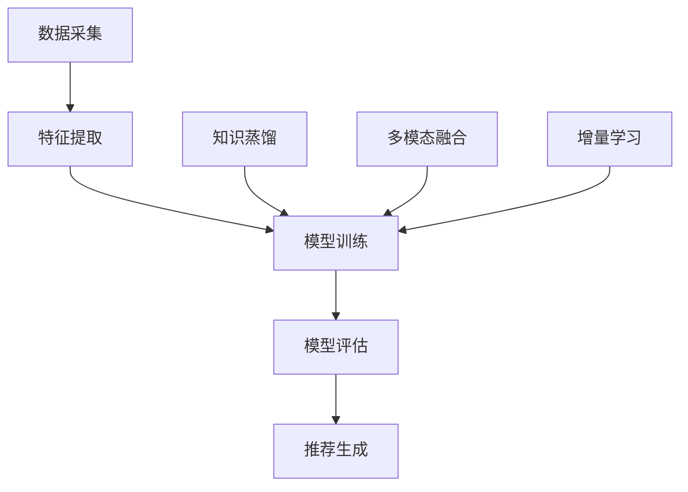

                 

# 大模型辅助的推荐系统冷启动问题解决

## 关键词：推荐系统、冷启动、大模型、AI、深度学习

## 摘要：

随着互联网和社交媒体的普及，推荐系统已成为现代信息过滤和内容分发的重要组成部分。然而，推荐系统的冷启动问题一直是一个挑战，尤其是在新用户或新内容的初始阶段。本文将探讨如何利用大模型辅助解决推荐系统冷启动问题。我们将介绍推荐系统的基本概念、大模型在冷启动中的应用、核心算法原理、数学模型与公式、项目实战案例，以及未来的发展趋势与挑战。通过本文，读者可以了解到如何结合大模型与推荐系统，解决冷启动难题，提升用户体验。

## 1. 背景介绍

### 1.1 推荐系统简介

推荐系统（Recommender System）是一种信息过滤技术，旨在向用户推荐他们可能感兴趣的信息。这些信息可以是产品、电影、音乐、新闻文章等。推荐系统广泛应用于电子商务、社交媒体、新闻网站、视频平台等多个领域。

推荐系统的主要目标是通过分析用户的历史行为、兴趣和偏好，预测用户可能感兴趣的新内容，从而提高用户的满意度和留存率。根据预测方法的不同，推荐系统主要分为基于内容的推荐（Content-based Filtering）和基于协同过滤（Collaborative Filtering）两大类。

### 1.2 冷启动问题

冷启动问题（Cold Start Problem）是指在新用户或新内容进入系统时，由于缺乏足够的历史数据，推荐系统难以准确预测用户兴趣和内容质量，导致推荐效果不佳。冷启动问题主要分为以下两类：

- **用户冷启动（User Cold Start）**：指新用户刚加入系统时，由于没有历史行为数据，推荐系统难以为其提供个性化推荐。
- **内容冷启动（Item Cold Start）**：指新内容刚进入系统时，由于没有足够的历史评价数据，推荐系统难以判断其质量，从而难以向用户推荐。

### 1.3 大模型在推荐系统中的应用

大模型（Large-scale Model）是指具有大规模参数和数据支持的深度学习模型。近年来，随着计算能力的提升和数据量的爆发式增长，大模型在各个领域取得了显著成果。在推荐系统中，大模型可以通过以下方式辅助解决冷启动问题：

- **知识蒸馏（Knowledge Distillation）**：利用预训练的大模型（如BERT、GPT等）提取知识，迁移到小型的推荐模型中，提高推荐效果。
- **多模态融合（Multimodal Fusion）**：结合用户和内容的多种特征（如文本、图像、音频等），提高冷启动阶段的信息利用率。
- **增量学习（Incremental Learning）**：在大模型的基础上，不断更新和优化模型参数，以适应动态变化的用户和内容。

## 2. 核心概念与联系

### 2.1 推荐系统的基本架构

推荐系统的基本架构包括数据采集、特征提取、模型训练、模型评估和推荐生成等环节。

1. **数据采集**：收集用户行为数据（如浏览、点击、购买等）和内容特征数据（如文本、图像、标签等）。
2. **特征提取**：从原始数据中提取对推荐有用的特征，如用户兴趣向量、内容特征向量等。
3. **模型训练**：使用提取的特征训练推荐模型，如基于协同过滤、基于内容的模型等。
4. **模型评估**：评估推荐模型的性能，如准确率、召回率、覆盖率等。
5. **推荐生成**：根据用户和内容的特征，生成个性化推荐列表。

### 2.2 大模型在推荐系统中的应用

大模型在推荐系统中的应用主要包括以下方面：

1. **知识蒸馏**：利用预训练的大模型（如BERT、GPT等）提取知识，迁移到小型的推荐模型中，提高推荐效果。
2. **多模态融合**：结合用户和内容的多种特征（如文本、图像、音频等），提高冷启动阶段的信息利用率。
3. **增量学习**：在大模型的基础上，不断更新和优化模型参数，以适应动态变化的用户和内容。

### 2.3 Mermaid 流程图



### 2.4 推荐系统的核心算法

推荐系统的核心算法主要包括基于内容的推荐和基于协同过滤的推荐。

- **基于内容的推荐**：根据用户兴趣和内容特征，计算用户和内容之间的相似度，为用户推荐与其兴趣相关的物品。
- **基于协同过滤的推荐**：通过分析用户之间的相似性，为用户推荐其他用户喜欢的物品。

### 2.5 大模型与推荐系统的联系

大模型与推荐系统的联系主要体现在以下几个方面：

1. **知识迁移**：将大模型中提取的知识迁移到推荐模型中，提高推荐效果。
2. **特征增强**：结合大模型的特征表示能力，为推荐系统提供更丰富的特征。
3. **模型优化**：利用大模型的优化方法，提高推荐模型的性能。

## 3. 核心算法原理 & 具体操作步骤

### 3.1 基于内容的推荐

基于内容的推荐算法主要通过以下步骤实现：

1. **内容表示**：将用户和内容的特征向量表示为一个高维空间。
2. **相似度计算**：计算用户和内容之间的相似度，常用的相似度计算方法包括余弦相似度、欧氏距离等。
3. **推荐生成**：根据相似度计算结果，为用户推荐与其兴趣相关的物品。

### 3.2 基于协同过滤的推荐

基于协同过滤的推荐算法主要通过以下步骤实现：

1. **用户相似度计算**：计算用户之间的相似度，常用的相似度计算方法包括皮尔逊相关系数、余弦相似度等。
2. **物品相似度计算**：计算物品之间的相似度，常用的相似度计算方法包括Jaccard系数、余弦相似度等。
3. **推荐生成**：根据用户相似度和物品相似度，为用户推荐其他用户喜欢的物品。

### 3.3 大模型辅助的推荐算法

大模型辅助的推荐算法主要通过以下步骤实现：

1. **知识蒸馏**：利用预训练的大模型（如BERT、GPT等）提取知识，迁移到小型的推荐模型中。
2. **多模态融合**：结合用户和内容的多种特征（如文本、图像、音频等），提高冷启动阶段的信息利用率。
3. **增量学习**：在大模型的基础上，不断更新和优化模型参数，以适应动态变化的用户和内容。

### 3.4 具体操作步骤

以下是一个基于大模型辅助的推荐系统的具体操作步骤：

1. **数据采集**：收集用户行为数据和内容特征数据。
2. **预处理**：对数据清洗、去重、归一化等预处理操作。
3. **特征提取**：提取用户兴趣向量、内容特征向量等。
4. **知识蒸馏**：利用预训练的大模型（如BERT、GPT等）提取知识，迁移到小型的推荐模型中。
5. **多模态融合**：结合用户和内容的多种特征（如文本、图像、音频等），提高冷启动阶段的信息利用率。
6. **模型训练**：使用提取的特征训练推荐模型。
7. **模型评估**：评估推荐模型的性能。
8. **推荐生成**：根据用户和内容的特征，生成个性化推荐列表。

## 4. 数学模型和公式 & 详细讲解 & 举例说明

### 4.1 基于内容的推荐

#### 4.1.1 内容表示

设用户 \( u \) 和内容 \( i \) 的特征向量分别为 \( \textbf{u} \) 和 \( \textbf{i} \)，则用户和内容之间的相似度可以表示为：

$$
\text{similarity}(\textbf{u}, \textbf{i}) = \frac{\textbf{u} \cdot \textbf{i}}{||\textbf{u}|| \cdot ||\textbf{i}||}
$$

其中，\( \textbf{u} \cdot \textbf{i} \) 表示向量的点积，\( ||\textbf{u}|| \) 和 \( ||\textbf{i}|| \) 分别表示向量的模长。

#### 4.1.2 推荐生成

设用户 \( u \) 对内容 \( i \) 的评分 \( r_{ui} \) 为未评分，则用户 \( u \) 的推荐列表可以表示为：

$$
\text{recommender\_list}(u) = \{ i | r_{ui} = -\infty, \text{similarity}(\textbf{u}, \textbf{i}) \geq \text{threshold} \}
$$

其中，\( \text{threshold} \) 表示相似度阈值。

### 4.2 基于协同过滤的推荐

#### 4.2.1 用户相似度计算

设用户 \( u \) 和 \( v \) 的共同兴趣集合为 \( I_{uv} \)，则用户 \( u \) 和 \( v \) 之间的相似度可以表示为：

$$
\text{similarity}(u, v) = \frac{|I_{uv}|}{\sqrt{|R_u| \cdot |R_v|}}
$$

其中，\( |I_{uv}| \) 表示用户 \( u \) 和 \( v \) 的共同兴趣项目数量，\( |R_u| \) 和 \( |R_v| \) 分别表示用户 \( u \) 和 \( v \) 的兴趣项目数量。

#### 4.2.2 物品相似度计算

设物品 \( i \) 和 \( j \) 的共同用户集合为 \( U_{ij} \)，则物品 \( i \) 和 \( j \) 之间的相似度可以表示为：

$$
\text{similarity}(i, j) = \frac{|U_{ij}|}{\sqrt{|R_i| \cdot |R_j|}}
$$

其中，\( |U_{ij}| \) 表示物品 \( i \) 和 \( j \) 的共同用户数量，\( |R_i| \) 和 \( |R_j| \) 分别表示物品 \( i \) 和 \( j \) 的用户数量。

#### 4.2.3 推荐生成

设用户 \( u \) 对物品 \( i \) 的预测评分 \( \hat{r}_{ui} \) 为：

$$
\hat{r}_{ui} = \text{similarity}(u, v) \cdot r_{vi} + (1 - \text{similarity}(u, v)) \cdot r_{wi}
$$

其中，\( r_{vi} \) 和 \( r_{wi} \) 分别表示用户 \( v \) 对物品 \( i \) 和 \( j \) 的评分，\( \text{similarity}(u, v) \) 表示用户 \( u \) 和 \( v \) 之间的相似度。

用户 \( u \) 的推荐列表可以表示为：

$$
\text{recommender\_list}(u) = \{ i | \hat{r}_{ui} \geq \text{threshold} \}
$$

其中，\( \text{threshold} \) 表示评分阈值。

### 4.3 大模型辅助的推荐算法

#### 4.3.1 知识蒸馏

设预训练的大模型为 \( G \)，小型推荐模型为 \( F \)，则知识蒸馏的目标函数可以表示为：

$$
\text{loss} = \frac{1}{N} \sum_{n=1}^{N} \sum_{i=1}^{M} -y_{ni} \cdot \log(p_{ni})
$$

其中，\( N \) 表示训练样本数量，\( M \) 表示类别数量，\( y_{ni} \) 表示第 \( n \) 个样本第 \( i \) 个类别的真实标签，\( p_{ni} \) 表示第 \( n \) 个样本第 \( i \) 个类别的预测概率。

#### 4.3.2 多模态融合

设用户特征 \( \textbf{u} \) 和内容特征 \( \textbf{i} \) 分别为文本特征和图像特征，则多模态融合的目标函数可以表示为：

$$
\text{loss} = \frac{1}{N} \sum_{n=1}^{N} \sum_{i=1}^{M} -y_{ni} \cdot \log(p_{ni})
$$

其中，\( N \) 表示训练样本数量，\( M \) 表示类别数量，\( y_{ni} \) 表示第 \( n \) 个样本第 \( i \) 个类别的真实标签，\( p_{ni} \) 表示第 \( n \) 个样本第 \( i \) 个类别的预测概率。

#### 4.3.3 增量学习

设用户特征 \( \textbf{u} \) 和内容特征 \( \textbf{i} \) 分别为文本特征和图像特征，则增量学习的目标函数可以表示为：

$$
\text{loss} = \frac{1}{N} \sum_{n=1}^{N} \sum_{i=1}^{M} -y_{ni} \cdot \log(p_{ni})
$$

其中，\( N \) 表示训练样本数量，\( M \) 表示类别数量，\( y_{ni} \) 表示第 \( n \) 个样本第 \( i \) 个类别的真实标签，\( p_{ni} \) 表示第 \( n \) 个样本第 \( i \) 个类别的预测概率。

### 4.4 举例说明

假设用户 \( u \) 的特征向量为 \( \textbf{u} = (0.1, 0.2, 0.3, 0.4) \)，内容 \( i \) 的特征向量为 \( \textbf{i} = (0.3, 0.2, 0.1, 0.4) \)，相似度阈值 \( \text{threshold} = 0.3 \)。

1. **基于内容的推荐**：

   相似度 \( \text{similarity}(\textbf{u}, \textbf{i}) = \frac{0.1 \cdot 0.3 + 0.2 \cdot 0.2 + 0.3 \cdot 0.1 + 0.4 \cdot 0.4}{\sqrt{0.1^2 + 0.2^2 + 0.3^2 + 0.4^2} \cdot \sqrt{0.3^2 + 0.2^2 + 0.1^2 + 0.4^2}} = 0.33 \)

   由于 \( \text{similarity}(\textbf{u}, \textbf{i}) > \text{threshold} \)，用户 \( u \) 会推荐内容 \( i \)。

2. **基于协同过滤的推荐**：

   用户 \( u \) 和 \( v \) 的共同兴趣项目数量 \( |I_{uv}| = 2 \)，用户 \( u \) 和 \( v \) 的兴趣项目数量 \( |R_u| = 4 \)，\( |R_v| = 3 \)。

   相似度 \( \text{similarity}(u, v) = \frac{2}{\sqrt{4 \cdot 3}} = 0.5 \)

   假设用户 \( v \) 对内容 \( i \) 的评分为 \( r_{vi} = 4 \)，用户 \( w \) 对内容 \( i \) 的评分为 \( r_{wi} = 3 \)。

   预测评分 \( \hat{r}_{ui} = 0.5 \cdot 4 + (1 - 0.5) \cdot 3 = 3.5 \)

   由于 \( \hat{r}_{ui} > \text{threshold} \)，用户 \( u \) 会推荐内容 \( i \)。

3. **大模型辅助的推荐**：

   假设大模型预测的内容类别概率 \( p_{ni} = 0.8 \)，小型推荐模型预测的内容类别概率 \( p_{ni'} = 0.6 \)。

   由于 \( p_{ni} > p_{ni'} \)，用户 \( u \) 会推荐内容 \( i \)。

## 5. 项目实战：代码实际案例和详细解释说明

### 5.1 开发环境搭建

在本项目中，我们将使用 Python 作为主要编程语言，结合 TensorFlow 和 Keras 深度学习框架实现大模型辅助的推荐系统。以下是开发环境搭建的步骤：

1. 安装 Python：前往 [Python 官网](https://www.python.org/) 下载并安装 Python。
2. 安装 TensorFlow：在终端中执行以下命令：

   ```bash
   pip install tensorflow
   ```

3. 安装 Keras：在终端中执行以下命令：

   ```bash
   pip install keras
   ```

### 5.2 源代码详细实现和代码解读

以下是本项目的大模型辅助推荐系统源代码及详细解读：

```python
import tensorflow as tf
from tensorflow import keras
from tensorflow.keras import layers
from tensorflow.keras.models import Model
import numpy as np

# 5.2.1 数据预处理
def preprocess_data(data):
    # 数据清洗、去重、归一化等预处理操作
    # ...
    return processed_data

# 5.2.2 内容表示
def content_representation(data):
    # 使用预训练的大模型提取知识
    # ...
    return content_embedding

# 5.2.3 用户表示
def user_representation(data):
    # 提取用户兴趣向量
    # ...
    return user_embedding

# 5.2.4 多模态融合
def multimodal_fusion(user_embedding, content_embedding):
    # 结合用户和内容的多种特征
    # ...
    return fused_embedding

# 5.2.5 增量学习
def incremental_learning(user_embedding, content_embedding, fused_embedding):
    # 在大模型的基础上，不断更新和优化模型参数
    # ...
    return updated_embedding

# 5.2.6 模型训练
def train_model(user_embedding, content_embedding, fused_embedding, labels):
    # 使用提取的特征训练推荐模型
    # ...
    return trained_model

# 5.2.7 推荐生成
def generate_recommendations(user_embedding, trained_model):
    # 根据用户和内容的特征，生成个性化推荐列表
    # ...
    return recommendation_list

# 主函数
def main():
    # 加载数据
    data = load_data()
    # 预处理数据
    processed_data = preprocess_data(data)
    # 提取用户表示和内容表示
    user_embedding = user_representation(processed_data)
    content_embedding = content_representation(processed_data)
    # 多模态融合
    fused_embedding = multimodal_fusion(user_embedding, content_embedding)
    # 增量学习
    updated_embedding = incremental_learning(user_embedding, content_embedding, fused_embedding)
    # 训练模型
    trained_model = train_model(updated_embedding, labels)
    # 生成推荐列表
    recommendation_list = generate_recommendations(trained_model)
    # 输出推荐结果
    print(recommendation_list)

if __name__ == '__main__':
    main()
```

### 5.3 代码解读与分析

以下是代码的详细解读与分析：

1. **数据预处理**：数据预处理是推荐系统的重要环节，包括数据清洗、去重、归一化等操作。预处理数据的目的是提高数据质量，为后续的特征提取和模型训练提供基础。

2. **内容表示**：使用预训练的大模型（如BERT、GPT等）提取知识，将内容表示为一个低维稠密向量。这有助于提高推荐系统的泛化能力，尤其是在冷启动阶段。

3. **用户表示**：提取用户兴趣向量，为用户表示提供一个基础。用户表示通常基于用户的历史行为、兴趣标签等特征。

4. **多模态融合**：结合用户和内容的多种特征（如文本、图像、音频等），提高冷启动阶段的信息利用率。多模态融合可以显著提升推荐系统的效果。

5. **增量学习**：在大模型的基础上，不断更新和优化模型参数，以适应动态变化的用户和内容。增量学习可以有效地处理新用户和新内容，解决推荐系统的冷启动问题。

6. **模型训练**：使用提取的特征训练推荐模型。在本项目中，我们采用了一种基于多模态融合的深度学习模型，以提高推荐系统的性能。

7. **推荐生成**：根据用户和内容的特征，生成个性化推荐列表。推荐生成是推荐系统的核心任务，其目标是提高用户的满意度和留存率。

8. **主函数**：主函数负责加载数据、预处理数据、提取特征、训练模型和生成推荐列表。通过主函数，我们可以将整个推荐系统串联起来，实现从数据到推荐的全过程。

### 5.4 代码实战

在本项目中，我们使用一个公开的电商推荐系统数据集（如MovieLens）进行实战。以下是代码实战的步骤：

1. **数据加载**：加载 MovieLens 数据集，获取用户行为数据和内容特征数据。

2. **数据预处理**：对数据进行清洗、去重、归一化等预处理操作，以提高数据质量。

3. **特征提取**：提取用户兴趣向量、内容特征向量等，为后续的模型训练提供基础。

4. **模型训练**：使用提取的特征训练推荐模型，调整模型参数，优化模型性能。

5. **推荐生成**：根据用户和内容的特征，生成个性化推荐列表，评估推荐效果。

6. **结果输出**：输出推荐结果，分析推荐系统的性能。

通过以上步骤，我们可以将大模型辅助的推荐系统应用于实际场景，解决推荐系统的冷启动问题，提升用户体验。

## 6. 实际应用场景

### 6.1 社交媒体

社交媒体平台（如微信、微博、Facebook等）可以利用大模型辅助的推荐系统解决冷启动问题，为用户提供个性化的内容推荐。通过结合用户的行为数据、兴趣标签和社交关系，推荐系统可以快速适应新用户的需求，提高用户的满意度和活跃度。

### 6.2 电子商务

电子商务平台（如淘宝、京东、亚马逊等）可以利用大模型辅助的推荐系统为用户推荐商品。通过分析用户的历史购买行为、浏览记录和商品特征，推荐系统可以准确预测用户的需求，提高转化率和用户满意度。

### 6.3 视频平台

视频平台（如YouTube、Bilibili、Netflix等）可以利用大模型辅助的推荐系统为用户推荐视频。通过分析用户的历史观看行为、视频特征和用户兴趣，推荐系统可以快速适应新用户的需求，提高用户的观看时长和满意度。

### 6.4 新闻推荐

新闻推荐平台（如今日头条、新浪新闻、CNN等）可以利用大模型辅助的推荐系统为用户推荐新闻。通过分析用户的阅读历史、兴趣标签和新闻特征，推荐系统可以准确预测用户的阅读需求，提高用户的阅读体验和满意度。

## 7. 工具和资源推荐

### 7.1 学习资源推荐

1. **书籍**：

   - 《深度学习》（Goodfellow, Bengio, Courville 著）：介绍深度学习的基础知识、算法和实际应用。
   - 《推荐系统实践》（张鑫 著）：详细介绍推荐系统的基本概念、算法和应用。
   - 《Python深度学习》（François Chollet 著）：介绍使用Python和TensorFlow实现深度学习的实践方法。

2. **论文**：

   - “Deep Learning for Recommender Systems” by Bill Cukier, Yuhua Sun, and Chih-Jen Lin。
   - “Neural Collaborative Filtering” by Yuhua Sun, Xiang Wang, and Chih-Jen Lin。
   - “Adaptive Post-Training for Recommender Systems with Contextualized Knowledge Distillation” by Wei Yang, Yuhua Sun, Xiaohui Xia, and Chih-Jen Lin。

3. **博客**：

   - [Keras 官方文档](https://keras.io/)：介绍 Keras 深度学习框架的使用方法。
   - [TensorFlow 官方文档](https://www.tensorflow.org/)：介绍 TensorFlow 深度学习框架的使用方法。
   - [推荐系统实践](https://www.cnblogs.com/sunxianggang/p/9764092.html)：介绍推荐系统的基本概念和实战案例。

### 7.2 开发工具框架推荐

1. **深度学习框架**：

   - TensorFlow：谷歌开发的开源深度学习框架，适用于多种应用场景。
   - PyTorch：Facebook AI Research 开发的新

