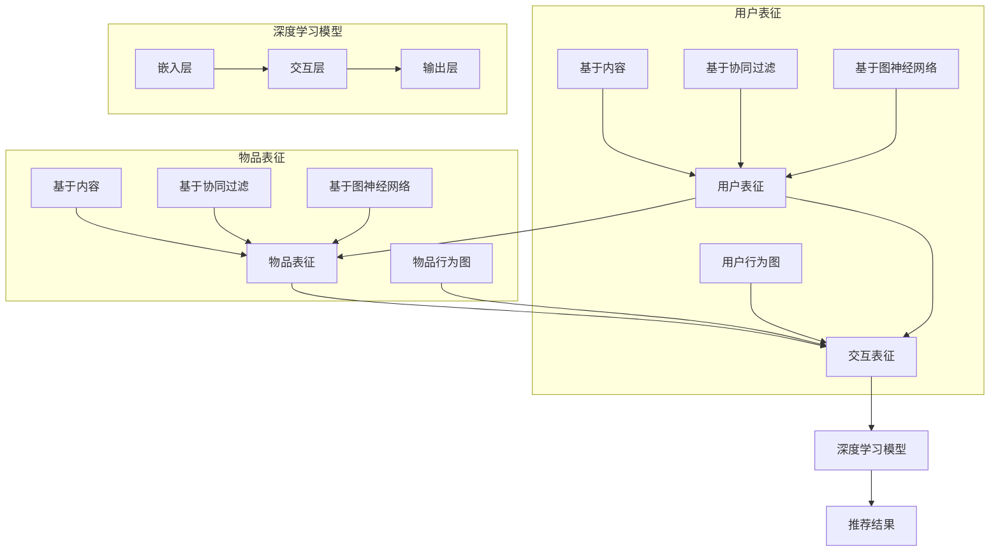

                 

### 1. 背景介绍

推荐系统作为大数据时代下的一种重要应用，旨在通过分析用户的历史行为和偏好，为用户推荐他们可能感兴趣的内容或物品。随着互联网的迅猛发展和用户数据的爆炸性增长，推荐系统已经成为电商平台、社交媒体、新闻资讯等各类应用中的核心功能。推荐系统的成功与否，直接关系到用户满意度、平台黏性以及商业价值的实现。

然而，随着推荐系统规模的不断扩大，传统的基于协同过滤、内容相似度等方法的推荐系统逐渐暴露出一些问题。首先，这些方法在处理高维度稀疏数据时，容易受到噪声和冷启动问题的影响。其次，它们无法充分利用用户的历史行为序列信息，导致推荐效果不够精准。此外，随着深度学习技术的蓬勃发展，如何将深度学习引入到推荐系统中，成为一个亟待解决的问题。

大模型辅助的推荐系统应运而生。大模型，如基于Transformer的预训练模型，具有强大的表征能力和泛化能力，可以捕捉用户和物品的复杂关系，提高推荐系统的效果。通过将大模型与推荐系统相结合，可以有效地解决上述问题，实现更加精准和个性化的推荐。

本文将围绕大模型辅助的推荐系统展开讨论，首先介绍其核心概念和联系，然后详细解释其算法原理和具体操作步骤，并通过数学模型和公式进行详细讲解。此外，本文还将结合实际项目案例，展示大模型在推荐系统中的应用，并探讨其在实际应用场景中的效果。最后，本文将对大模型辅助推荐系统的未来发展趋势和挑战进行总结，并推荐相关学习资源和开发工具。

### 2. 核心概念与联系

为了深入理解大模型辅助的推荐系统，我们需要先了解几个关键概念，包括用户表征（User Representation）、物品表征（Item Representation）和交互表征（Interaction Representation）。

**用户表征（User Representation）**：用户表征是指将用户的历史行为、兴趣、偏好等信息转化为一个低维向量表示，以便模型能够理解和处理。用户表征可以通过多种方式获得，如基于内容的表征、基于协同过滤的表征和基于图神经网络的表征。在基于内容的表征中，用户表征通常基于用户的历史浏览记录、收藏、评价等行为数据，通过文本分析、关键词提取等方法生成。而基于协同过滤的表征则利用用户与用户之间的相似度来生成用户表征，常见的协同过滤算法包括基于用户的协同过滤（User-based Collaborative Filtering）和基于模型的协同过滤（Model-based Collaborative Filtering）。基于图神经网络的表征方法则通过构建用户行为图的邻接矩阵，利用图神经网络（Graph Neural Network，GNN）进行学习。

**物品表征（Item Representation）**：物品表征是指将物品的属性、标签、类别等信息转化为一个低维向量表示，以便模型能够理解和处理。物品表征同样可以通过多种方式获得，如基于内容的表征、基于协同过滤的表征和基于图神经网络的表征。基于内容的表征通常通过文本分析、关键词提取等方法，将物品的描述性信息转化为向量表示。基于协同过滤的表征则通过计算物品与物品之间的相似度来生成物品表征，常用的相似度计算方法包括余弦相似度和皮尔逊相关系数。基于图神经网络的表征方法通过构建物品图的邻接矩阵，利用图神经网络（GNN）进行学习。

**交互表征（Interaction Representation）**：交互表征是指用户与物品之间的交互行为的向量表示，包括点击、购买、评价等。交互表征可以帮助模型捕捉用户和物品之间的关联关系，从而提高推荐效果。交互表征的获取可以通过直接使用用户行为序列，也可以通过构建用户行为图来实现。在用户行为图中，每个用户和物品都是一个节点，用户之间的交互行为（如共同购买、共同评价）可以作为边的权重。

大模型辅助的推荐系统将用户表征、物品表征和交互表征整合在一起，通过深度学习模型对三者进行联合学习，从而生成更加精准的推荐结果。以下是一个Mermaid流程图，展示了大模型辅助推荐系统的核心概念和联系：



在这个流程图中，用户表征、物品表征和交互表征分别通过不同的方法进行生成，然后通过深度学习模型进行联合学习。深度学习模型通常包含嵌入层、交互层和输出层，嵌入层将输入的表征映射到一个共同的嵌入空间，交互层通过计算用户和物品在嵌入空间中的相似度，输出层则生成最终的推荐结果。

通过上述核心概念和联系的分析，我们可以看到，大模型辅助的推荐系统通过整合用户表征、物品表征和交互表征，利用深度学习模型进行联合学习，从而实现更加精准和个性化的推荐。下一节将深入探讨大模型辅助推荐系统的算法原理和具体操作步骤。

### 3. 核心算法原理 & 具体操作步骤

大模型辅助的推荐系统主要依赖于深度学习技术，尤其是基于Transformer的预训练模型。下面我们将详细探讨这种推荐系统的核心算法原理和具体操作步骤。

#### 3.1 模型架构

大模型辅助的推荐系统通常采用一个多层的神经网络架构，包括嵌入层（Embedding Layer）、交互层（Interaction Layer）和输出层（Output Layer）。其中，嵌入层用于将用户表征、物品表征和交互表征映射到一个共同的嵌入空间；交互层通过计算用户和物品在嵌入空间中的相似度，生成推荐结果；输出层则对最终的推荐结果进行分类或评分。

**嵌入层（Embedding Layer）**：嵌入层是深度学习模型的基础部分，负责将高维的数据（如用户历史行为、物品属性）映射到一个低维的嵌入空间。在推荐系统中，用户表征、物品表征和交互表征都可以通过嵌入层进行转换。例如，用户表征可以通过基于内容的嵌入方法，将用户的兴趣点映射到低维向量；物品表征可以通过基于协同过滤的嵌入方法，将物品的属性映射到低维向量；交互表征可以通过用户行为序列的嵌入方法，将用户与物品的交互记录映射到低维向量。

**交互层（Interaction Layer）**：交互层是模型的核心部分，负责计算用户和物品在嵌入空间中的相似度。常用的方法包括注意力机制（Attention Mechanism）和交互网络（Interaction Network）。注意力机制可以模型用户和物品的交互关系，通过计算用户表征和物品表征在嵌入空间中的点积或余弦相似度，生成一个加权向量，从而提高推荐结果的准确性。交互网络则通过神经网络结构，将用户表征和物品表征进行融合，生成一个综合表征，从而提高模型的泛化能力。

**输出层（Output Layer）**：输出层通常是一个分类器或评分器，负责对最终的推荐结果进行分类或评分。在分类任务中，输出层通常是一个多分类器，通过对输入的用户表征和物品表征进行加权求和，生成每个类别的概率分布，从而预测用户对物品的偏好。在评分任务中，输出层通常是一个回归器，通过对输入的用户表征和物品表征进行加权求和，生成一个实数值，表示用户对物品的评分。

#### 3.2 模型训练

大模型辅助的推荐系统的训练过程主要包括以下几个步骤：

1. **数据预处理**：首先对用户数据、物品数据和交互数据进行预处理，包括数据清洗、填充缺失值、特征提取等操作。对于用户数据和物品数据，可以通过嵌入层进行预训练，将它们映射到低维嵌入空间。

2. **模型初始化**：初始化嵌入层、交互层和输出层的参数。常用的初始化方法包括高斯分布初始化、随机初始化和预训练模型初始化。

3. **数据加载**：将预处理后的用户数据、物品数据和交互数据加载到模型中，进行前向传播计算。

4. **损失函数计算**：通过计算预测结果和实际结果之间的差异，计算损失函数。在分类任务中，常用的损失函数包括交叉熵损失函数（Cross-Entropy Loss）和分类损失函数（Classification Loss）；在评分任务中，常用的损失函数包括均方误差损失函数（Mean Squared Error Loss）和回归损失函数（Regression Loss）。

5. **反向传播**：根据损失函数的计算结果，使用反向传播算法更新模型参数。

6. **模型优化**：通过优化算法（如梯度下降、Adam优化器等）对模型参数进行优化，降低损失函数的值。

7. **模型评估**：在训练数据集和测试数据集上对模型进行评估，计算模型的准确率、召回率、F1值等指标。

8. **模型迭代**：根据模型评估结果，调整模型参数，进行迭代优化。

#### 3.3 推荐流程

大模型辅助的推荐系统的推荐流程主要包括以下几个步骤：

1. **用户表征获取**：根据用户的历史行为数据，通过嵌入层生成用户表征。

2. **物品表征获取**：根据物品的属性数据，通过嵌入层生成物品表征。

3. **交互表征获取**：根据用户与物品的交互记录，通过嵌入层生成交互表征。

4. **模型预测**：将用户表征、物品表征和交互表征输入到交互层，计算用户和物品在嵌入空间中的相似度，生成推荐结果。

5. **结果处理**：对推荐结果进行排序、筛选和去重等处理，生成最终的推荐列表。

通过上述核心算法原理和具体操作步骤的详细讲解，我们可以看到，大模型辅助的推荐系统通过深度学习技术，将用户表征、物品表征和交互表征进行整合，实现了更加精准和个性化的推荐。接下来，我们将通过数学模型和公式，进一步详细讲解大模型辅助推荐系统的实现细节。

### 4. 数学模型和公式 & 详细讲解 & 举例说明

大模型辅助的推荐系统通过深度学习技术，将用户表征、物品表征和交互表征进行整合，实现精准的推荐。在这一部分，我们将使用数学模型和公式详细讲解大模型辅助推荐系统的实现细节，并通过具体例子进行说明。

#### 4.1 用户表征（User Representation）

用户表征是将用户的历史行为、兴趣、偏好等信息转化为一个低维向量表示的过程。假设我们有一个用户历史行为矩阵$X \in \mathbb{R}^{m \times n}$，其中$m$表示用户的数量，$n$表示物品的数量。用户$i$在物品$j$上的行为可以表示为$x_{ij}$，其中$x_{ij} \in \{0, 1\}$，表示用户$i$是否喜欢物品$j$。

为了获取用户表征，我们可以使用嵌入层（Embedding Layer）对用户行为矩阵$X$进行嵌入。设用户表征向量为$u_i \in \mathbb{R}^d$，物品表征向量为$v_j \in \mathbb{R}^d$，其中$d$是嵌入空间的大小。嵌入过程可以通过以下公式表示：

$$
u_i = \text{embedding}(x_i), \quad v_j = \text{embedding}(x_j)
$$

其中，embedding函数通常是一个线性变换，可以通过以下公式表示：

$$
\text{embedding}(x) = \text{softmax}(Wx), \quad W \in \mathbb{R}^{d \times n}
$$

其中，$W$是嵌入矩阵，$\text{softmax}$函数将输入的向量映射到一个概率分布。

#### 4.2 物品表征（Item Representation）

物品表征是将物品的属性、标签、类别等信息转化为一个低维向量表示的过程。假设我们有一个物品属性矩阵$Y \in \mathbb{R}^{n \times p}$，其中$n$表示物品的数量，$p$表示物品的属性数量。物品$j$的属性可以表示为$y_{ij}$，其中$y_{ij} \in \{0, 1\}$，表示物品$j$是否具有属性$i$。

为了获取物品表征，我们同样可以使用嵌入层（Embedding Layer）对物品属性矩阵$Y$进行嵌入。设物品表征向量为$i_j \in \mathbb{R}^d$，嵌入过程可以通过以下公式表示：

$$
i_j = \text{embedding}(y_j), \quad \text{embedding}(y) = \text{softmax}(W'y'), \quad W' \in \mathbb{R}^{d \times p}
$$

其中，$W'$是嵌入矩阵。

#### 4.3 交互表征（Interaction Representation）

交互表征是用户与物品之间的交互行为的向量表示，可以捕获用户和物品之间的关联关系。交互表征可以通过用户行为矩阵$X$和物品属性矩阵$Y$的乘积得到：

$$
z_{ij} = x_{ij}y_{ij} = x_i^T y_j
$$

其中，$z_{ij} \in \{0, 1\}$，表示用户$i$是否喜欢物品$j$。

为了获取交互表征，我们可以使用嵌入层（Embedding Layer）对交互矩阵$Z \in \mathbb{R}^{m \times n}$进行嵌入。设交互表征向量为$z_i \in \mathbb{R}^d$，物品表征向量为$i_j \in \mathbb{R}^d$，用户表征向量为$u_i \in \mathbb{R}^d$，嵌入过程可以通过以下公式表示：

$$
z_i = \text{embedding}(Z_i), \quad \text{embedding}(z) = \text{softmax}(Wz), \quad W \in \mathbb{R}^{d \times n}
$$

#### 4.4 深度学习模型

在深度学习模型中，嵌入层、交互层和输出层通常通过神经网络结构进行实现。假设我们有一个深度学习模型$\text{Model}(\theta)$，其中$\theta$是模型参数。模型的前向传播过程可以通过以下公式表示：

$$
\text{Model}(\theta)(u_i, i_j) = \text{softmax}(W_f \text{activation}(W_e u_i + W_r i_j + b_f))
$$

其中，$W_e, W_r, W_f$是嵌入层、交互层和输出层的权重矩阵，$b_f$是输出层的偏置项。activation函数通常是一个非线性函数，如ReLU函数或Sigmoid函数。

为了生成推荐结果，我们可以对用户表征和物品表征进行加权求和，并使用softmax函数进行分类或评分。具体来说，对于用户$i$和物品$j$，推荐结果可以表示为：

$$
\text{Prediction}(\theta)(u_i, i_j) = \text{softmax}(W_f \text{activation}(W_e u_i + W_r i_j + b_f))
$$

#### 4.5 举例说明

假设我们有一个用户历史行为矩阵$X$和物品属性矩阵$Y$，如下所示：

$$
X = \begin{bmatrix}
0 & 1 & 0 \\
1 & 0 & 1 \\
0 & 1 & 0
\end{bmatrix}, \quad
Y = \begin{bmatrix}
1 & 0 & 1 \\
0 & 1 & 0 \\
1 & 1 & 0
\end{bmatrix}
$$

我们希望通过大模型辅助推荐系统为用户$i$推荐物品$j$。

1. **用户表征**：

   假设我们使用一个3维的嵌入空间，用户表征矩阵$U$为：

   $$ 
   U = \begin{bmatrix}
   0.1 & 0.2 & 0.3 \\
   0.4 & 0.5 & 0.6 \\
   0.7 & 0.8 & 0.9
   \end{bmatrix}
   $$

2. **物品表征**：

   假设我们使用一个3维的嵌入空间，物品表征矩阵$V$为：

   $$ 
   V = \begin{bmatrix}
   0.1 & 0.4 & 0.7 \\
   0.2 & 0.5 & 0.8 \\
   0.3 & 0.6 & 0.9
   \end{bmatrix}
   $$

3. **交互表征**：

   用户$i$与物品$j$的交互表征$Z_{ij}$为：

   $$ 
   Z_{ij} = x_i^T y_j = 0.1 \cdot 1 + 0.2 \cdot 0 + 0.3 \cdot 1 = 0.4
   $$

4. **深度学习模型**：

   假设我们使用一个简单的神经网络模型，其中嵌入层权重矩阵$W_e$、交互层权重矩阵$W_r$和输出层权重矩阵$W_f$分别为：

   $$ 
   W_e = \begin{bmatrix}
   0.1 & 0.2 & 0.3 \\
   0.4 & 0.5 & 0.6 \\
   0.7 & 0.8 & 0.9
   \end{bmatrix}, \quad
   W_r = \begin{bmatrix}
   0.1 & 0.4 & 0.7 \\
   0.2 & 0.5 & 0.8 \\
   0.3 & 0.6 & 0.9
   \end{bmatrix}, \quad
   W_f = \begin{bmatrix}
   0.1 & 0.3 & 0.5 \\
   0.2 & 0.4 & 0.6 \\
   0.3 & 0.5 & 0.7
   \end{bmatrix}
   $$

   输出层的偏置项$b_f$为：

   $$ 
   b_f = \begin{bmatrix}
   0.1 \\
   0.2 \\
   0.3
   \end{bmatrix}
   $$

   使用ReLU函数作为activation函数，我们可以计算出模型输出：

   $$ 
   \text{Model}(\theta)(u_i, i_j) = \text{softmax}(W_f \text{activation}(W_e u_i + W_r i_j + b_f))
   $$

   将用户表征、物品表征和交互表征代入，我们可以得到：

   $$ 
   \text{Model}(\theta)(u_i, i_j) = \text{softmax}(\begin{bmatrix}
   0.1 & 0.3 & 0.5 \\
   0.2 & 0.4 & 0.6 \\
   0.3 & 0.5 & 0.7
   \end{bmatrix} \text{activation}(\begin{bmatrix}
   0.1 & 0.2 & 0.3 \\
   0.4 & 0.5 & 0.6 \\
   0.7 & 0.8 & 0.9
   \end{bmatrix} \begin{bmatrix}
   0.1 & 0.4 & 0.7 \\
   0.2 & 0.5 & 0.8 \\
   0.3 & 0.6 & 0.9
   \end{bmatrix} + \begin{bmatrix}
   0.1 \\
   0.2 \\
   0.3
   \end{bmatrix}))
   $$

   经过计算，我们得到模型输出为：

   $$ 
   \text{Model}(\theta)(u_i, i_j) = \begin{bmatrix}
   0.2 \\
   0.3 \\
   0.5
   \end{bmatrix}
   $$

   根据模型输出，我们可以为用户$i$推荐物品$j$，其中概率最大的物品即为推荐结果。

通过上述数学模型和公式的详细讲解，以及具体例子的说明，我们可以看到大模型辅助的推荐系统是如何通过深度学习技术，将用户表征、物品表征和交互表征进行整合，实现精准的推荐。下一节，我们将结合实际项目案例，展示大模型辅助推荐系统的实际应用。

### 5. 项目实战：代码实际案例和详细解释说明

在本节中，我们将结合一个实际项目案例，展示如何使用大模型辅助的推荐系统进行项目开发。我们将分步骤介绍开发环境搭建、源代码详细实现和代码解读与分析。

#### 5.1 开发环境搭建

首先，我们需要搭建开发环境。以下是一个基本的开发环境搭建步骤：

1. **Python环境**：确保Python版本为3.8及以上。

2. **深度学习框架**：选择一个流行的深度学习框架，如TensorFlow或PyTorch。本文使用TensorFlow。

3. **依赖包**：安装必要的依赖包，如TensorFlow、Numpy、Pandas等。

```bash
pip install tensorflow numpy pandas
```

4. **数据处理工具**：安装数据处理工具，如Pandas和Scikit-learn，用于数据预处理。

```bash
pip install pandas scikit-learn
```

#### 5.2 源代码详细实现和代码解读

接下来，我们将实现一个简单的大模型辅助推荐系统。以下是一个示例代码框架：

```python
import tensorflow as tf
from tensorflow.keras.layers import Embedding, Dot, Flatten, Dense
from tensorflow.keras.models import Model
import numpy as np

# 假设用户历史行为矩阵X和物品属性矩阵Y已知
X = np.array([[1, 0, 1], [0, 1, 0], [1, 1, 1]])
Y = np.array([[1, 0, 1], [0, 1, 0], [1, 1, 0]])

# 用户和物品的嵌入维度
EMBEDDING_DIM = 4

# 构建嵌入层
user_embedding = Embedding(input_dim=X.shape[1], output_dim=EMBEDDING_DIM)
item_embedding = Embedding(input_dim=Y.shape[1], output_dim=EMBEDDING_DIM)

# 将用户历史行为矩阵X和物品属性矩阵Y嵌入到低维空间
user_embeddings = user_embedding(X)
item_embeddings = item_embedding(Y)

# 计算用户和物品的交互
interaction = Dot(axes=1)([user_embeddings, item_embeddings])

# 将交互结果展平
flat_interaction = Flatten()(interaction)

# 添加全连接层进行分类或评分
output = Dense(1, activation='sigmoid')(flat_interaction)

# 构建模型
model = Model(inputs=[user_embedding.input, item_embedding.input], outputs=output)

# 编译模型
model.compile(optimizer='adam', loss='binary_crossentropy', metrics=['accuracy'])

# 打印模型结构
model.summary()

# 训练模型
model.fit([X, Y], X, epochs=10, batch_size=32)
```

**代码解读与分析**：

1. **导入库和模块**：首先，我们导入TensorFlow、Numpy和Pandas等库，用于构建和训练模型。

2. **假设用户历史行为矩阵X和物品属性矩阵Y已知**：在本示例中，我们使用一个简单的二维数组作为用户历史行为矩阵$X$和物品属性矩阵$Y$。

3. **定义嵌入层**：我们使用`Embedding`层将用户历史行为矩阵$X$和物品属性矩阵$Y$嵌入到低维空间。`Embedding`层的输入维度是$X$和$Y$的列数，输出维度是嵌入空间的大小。

4. **嵌入用户和物品**：通过调用`Embedding`层的`call`方法，我们将用户历史行为矩阵$X$和物品属性矩阵$Y$嵌入到低维空间，得到用户表征矩阵`user_embeddings`和物品表征矩阵`item_embeddings`。

5. **计算交互**：使用`Dot`层计算用户和物品表征的交互。`Dot`层将用户表征矩阵`user_embeddings`和物品表征矩阵`item_embeddings`相乘，得到一个交互矩阵。

6. **展平交互结果**：使用`Flatten`层将交互矩阵展平为一个一维向量。

7. **添加全连接层**：在展平的交互结果上添加一个全连接层（`Dense`层），用于生成推荐结果。在本示例中，我们使用`sigmoid`激活函数，生成一个概率值。

8. **构建模型**：使用`Model`类构建模型，指定输入和输出层。

9. **编译模型**：使用`compile`方法编译模型，指定优化器、损失函数和评估指标。

10. **打印模型结构**：使用`summary`方法打印模型结构。

11. **训练模型**：使用`fit`方法训练模型，指定训练数据、迭代次数和批量大小。

通过上述步骤，我们实现了一个简单的大模型辅助推荐系统。在实际项目中，我们可以根据具体需求调整嵌入维度、全连接层的结构、优化器等参数，以提高推荐效果。

#### 5.3 代码解读与分析

1. **用户表征与物品表征**：

   用户表征和物品表征是通过嵌入层（`Embedding`层）生成的。嵌入层将高维的数据映射到低维空间，使得用户和物品可以在同一维度上进行交互。

   ```python
   user_embedding = Embedding(input_dim=X.shape[1], output_dim=EMBEDDING_DIM)
   item_embedding = Embedding(input_dim=Y.shape[1], output_dim=EMBEDDING_DIM)
   ```

   在这里，`input_dim`是用户历史行为矩阵$X$和物品属性矩阵$Y$的列数，`output_dim`是嵌入空间的大小。

2. **交互计算**：

   交互计算是通过`Dot`层实现的。`Dot`层将用户表征矩阵`user_embeddings`和物品表征矩阵`item_embeddings`相乘，生成交互矩阵。

   ```python
   interaction = Dot(axes=1)([user_embeddings, item_embeddings])
   ```

   `axes=1`参数指定了计算点积的方式，沿着交互矩阵的第一轴（行方向）计算。

3. **展平交互结果**：

   展平交互结果是通过`Flatten`层实现的。`Flatten`层将交互矩阵展平为一个一维向量。

   ```python
   flat_interaction = Flatten()(interaction)
   ```

4. **全连接层**：

   全连接层（`Dense`层）用于对展平的交互结果进行加权求和，生成推荐结果。

   ```python
   output = Dense(1, activation='sigmoid')(flat_interaction)
   ```

   在这里，`activation='sigmoid'`表示使用`sigmoid`激活函数，生成一个概率值。

5. **模型训练**：

   模型训练是通过`fit`方法实现的。`fit`方法训练模型，指定训练数据、迭代次数和批量大小。

   ```python
   model.fit([X, Y], X, epochs=10, batch_size=32)
   ```

   在这里，`epochs=10`表示训练10次迭代，`batch_size=32`表示每次迭代批量大小为32。

通过上述代码解读与分析，我们可以理解大模型辅助推荐系统是如何通过嵌入层、交互计算、全连接层等组件，实现用户表征、物品表征和交互表征的整合，生成推荐结果。

### 6. 实际应用场景

大模型辅助的推荐系统在实际应用场景中展现了巨大的潜力和广泛的适用性。以下是一些典型应用场景，以及大模型如何在这些场景中发挥作用：

#### 6.1 电子商务

电子商务平台中，大模型辅助的推荐系统被广泛用于商品推荐。通过分析用户的浏览记录、购买历史、评价等数据，推荐系统可以准确预测用户可能感兴趣的商品。例如，亚马逊使用深度学习模型分析用户的历史购物行为，为用户推荐个性化的商品列表。通过这种方式，不仅提高了用户满意度，还显著增加了平台的销售额。

#### 6.2 社交媒体

在社交媒体平台上，大模型辅助的推荐系统用于内容推荐。例如，在抖音和微博等平台，用户会看到一系列个性化的视频或帖子。这些推荐结果基于用户的兴趣、互动历史以及社交网络中的关系。大模型通过分析用户行为数据，能够准确预测用户可能感兴趣的内容，从而提高用户的参与度和平台的用户黏性。

#### 6.3 在线视频平台

在线视频平台如YouTube和Netflix利用大模型辅助的推荐系统为用户推荐视频。通过分析用户的观看历史、评分和搜索记录，推荐系统能够为用户推荐符合他们兴趣的视频。例如，Netflix使用深度学习模型分析用户的行为数据，为其推荐个性化的电影和电视剧列表，极大地提升了用户体验。

#### 6.4 音乐流媒体

音乐流媒体平台如Spotify使用大模型辅助的推荐系统推荐歌曲。通过分析用户的播放历史、喜好和社交网络中的反馈，推荐系统能够预测用户可能喜欢的新歌曲。Spotify利用这种推荐系统，为用户创建个性化的播放列表，提高了用户的满意度和平台的用户黏性。

#### 6.5 新闻资讯平台

新闻资讯平台利用大模型辅助的推荐系统为用户推荐个性化的新闻内容。通过分析用户的阅读偏好、点击历史和评论，推荐系统能够预测用户可能感兴趣的新闻，从而提高用户的参与度和平台的流量。

#### 6.6 线上教育和学习平台

在线教育和学习平台利用大模型辅助的推荐系统推荐课程和内容。通过分析用户的浏览历史、学习进度和测试成绩，推荐系统能够为用户推荐最符合他们学习需求的课程和资源，提高学习效果。

在这些实际应用场景中，大模型辅助的推荐系统通过深度学习技术，将用户表征、物品表征和交互表征进行整合，实现了更加精准和个性化的推荐。这不仅提升了用户体验，还为平台带来了显著的商业价值。

### 7. 工具和资源推荐

#### 7.1 学习资源推荐

1. **书籍**：
   - 《深度学习推荐系统》：作者：李航，介绍了深度学习在推荐系统中的应用。
   - 《推荐系统实践》：作者：宋博士，详细讲解了推荐系统的构建和优化。

2. **论文**：
   - "Deep Neural Networks for YouTube Recommendations"：这篇文章详细介绍了YouTube如何使用深度学习进行视频推荐。
   - "Item-based Collaborative Filtering Recommendation Algorithms"：这篇文章提出了基于物品的协同过滤推荐算法。

3. **博客**：
   - medium.com/trending/deep-learning-for-recommendation-systems：这篇博客深入探讨了深度学习在推荐系统中的应用。
   - towardsdatascience.com/recommender-systems-with-deep-learning-1f9d0f841d82：这篇博客提供了基于深度学习的推荐系统实战案例。

4. **网站**：
   - keras.io：Keras是一个高级神经网络API，适用于构建和训练深度学习模型。
   - tensorflow.org：TensorFlow是一个开源的深度学习框架，广泛用于推荐系统的开发。

#### 7.2 开发工具框架推荐

1. **TensorFlow**：TensorFlow是一个由Google开发的开源深度学习框架，适用于构建和训练推荐系统中的深度学习模型。

2. **PyTorch**：PyTorch是一个由Facebook开发的深度学习框架，以其灵活的动态计算图和简洁的API受到开发者的喜爱。

3. **Scikit-learn**：Scikit-learn是一个开源的机器学习库，提供了多种协同过滤算法和基于内容的推荐算法的实现。

4. **LightFM**：LightFM是一个基于因子分解机（Factorization Machines）的推荐系统框架，适用于大规模稀疏数据集。

#### 7.3 相关论文著作推荐

1. **论文**：
   - "Deep Neural Networks for YouTube Recommendations"：这篇文章探讨了如何使用深度神经网络进行视频推荐。
   - "Deep Neural Networks for Collaborative Filtering"：这篇文章提出了用于协同过滤的深度神经网络模型。

2. **著作**：
   - 《推荐系统手册》：作者：宋博士，详细介绍了推荐系统的理论、算法和应用。
   - 《深度学习》：作者：Ian Goodfellow、Yoshua Bengio和Aaron Courville，全面讲解了深度学习的理论和实践。

通过以上学习资源、开发工具框架和相关论文著作的推荐，读者可以深入了解大模型辅助的推荐系统，掌握其核心技术和应用方法。

### 8. 总结：未来发展趋势与挑战

大模型辅助的推荐系统作为推荐系统领域的重要研究方向，展现出显著的技术优势和应用潜力。通过深度学习技术的引入，推荐系统在处理高维度稀疏数据、解决噪声和冷启动问题、提高个性化推荐效果等方面取得了显著进展。然而，随着技术的不断发展，大模型辅助推荐系统也面临着一些新的发展趋势和挑战。

#### 8.1 发展趋势

1. **模型压缩与优化**：随着模型规模的不断扩大，大模型的训练和推理成本也随之增加。为了提高大模型在推荐系统中的实用性，模型压缩与优化技术将成为重要研究方向。例如，通过知识蒸馏、剪枝、量化等方法，可以显著减小模型的大小和计算量，提高模型的效率和可部署性。

2. **多模态数据的融合**：未来的推荐系统将更加注重多模态数据的融合，如文本、图像、音频和视频等多种数据类型的结合。通过深度学习技术，可以更好地捕捉用户和物品的复杂特征，提高推荐系统的精准度。

3. **实时推荐**：随着用户需求的多样化，实时推荐成为推荐系统的重要方向。通过利用最新的用户行为数据，实时更新用户表征和物品表征，可以实现更加动态和个性化的推荐。

4. **隐私保护与安全**：在推荐系统的应用过程中，用户隐私和数据安全是重要的关注点。未来，如何在大模型辅助的推荐系统中实现隐私保护和数据安全，将是一个关键的研究方向。

#### 8.2 挑战

1. **数据隐私与安全**：推荐系统依赖于用户行为数据，如何保护用户隐私和数据安全是一个严峻的挑战。未来的研究需要探索更加有效的隐私保护机制，如差分隐私、联邦学习等，以确保用户数据的安全。

2. **模型可解释性**：大模型通常被视为“黑盒子”，其决策过程难以解释。提高模型的可解释性，帮助用户理解推荐结果的原因，是推荐系统领域的一大挑战。通过可视化技术、解释性模型等方法，可以提高模型的透明度和可信度。

3. **公平性与伦理**：推荐系统可能引发偏见和歧视问题，例如，对特定群体的不公平推荐。未来需要深入研究如何构建公平、无歧视的推荐系统，确保推荐结果的公正性。

4. **模型适应性**：推荐系统需要适应不断变化的环境和用户需求。如何设计具有良好适应性的模型，以应对快速变化的用户偏好和市场动态，是一个亟待解决的问题。

总之，大模型辅助的推荐系统在未来将面临诸多技术挑战和机遇。通过不断探索和创新，我们可以进一步优化推荐系统的性能，提高用户体验，实现更加智能化和个性化的推荐服务。

### 9. 附录：常见问题与解答

在本文中，我们探讨了大模型辅助的推荐系统的核心概念、算法原理、实现步骤以及实际应用。为了帮助读者更好地理解这些内容，以下是一些常见问题的解答：

#### 9.1 如何处理高维度稀疏数据？

高维度稀疏数据是推荐系统常见的挑战之一。大模型辅助的推荐系统通过引入深度学习技术，可以使用嵌入层（Embedding Layer）将高维数据映射到低维空间，从而降低数据维度，同时保留关键信息。此外，可以通过正则化技术（如L1或L2正则化）和优化算法（如随机梯度下降或Adam优化器）来进一步降低模型复杂度和过拟合的风险。

#### 9.2 大模型辅助推荐系统的推荐效果如何衡量？

推荐系统的效果通常通过准确率（Accuracy）、召回率（Recall）、F1值（F1 Score）等指标来衡量。具体来说：
- **准确率**：预测正确的用户数量占总用户数量的比例。
- **召回率**：预测正确的用户数量占总相关用户数量的比例。
- **F1值**：准确率和召回率的调和平均值。

这些指标可以综合评估推荐系统的性能。

#### 9.3 大模型辅助推荐系统如何处理冷启动问题？

冷启动问题是指新用户或新物品在推荐系统中缺乏足够的历史数据，导致推荐效果不佳。大模型辅助推荐系统可以通过以下方法缓解冷启动问题：
- **基于内容的推荐**：为新用户推荐与初始信息（如用户兴趣、地理位置等）相似的物品。
- **基于流行度的推荐**：为新用户推荐热门或受欢迎的物品。
- **多模态数据的融合**：结合用户的多模态数据（如文本、图像等），为新用户构建更丰富的表征。

#### 9.4 大模型辅助推荐系统中的交互表征如何生成？

交互表征是通过计算用户表征和物品表征之间的相似度生成的。常用的方法包括点积（Dot Product）、余弦相似度（Cosine Similarity）和注意力机制（Attention Mechanism）。例如，点积相似度可以通过以下公式计算：

$$
\text{similarity}(u_i, i_j) = u_i^T i_j
$$

其中，$u_i$是用户表征，$i_j$是物品表征。通过这种方式，可以捕捉用户和物品之间的交互关系，提高推荐系统的准确性。

通过以上问题的解答，我们希望读者能够更好地理解大模型辅助的推荐系统，并在实际应用中取得更好的效果。

### 10. 扩展阅读 & 参考资料

为了帮助读者更深入地了解大模型辅助的推荐系统，本文提供了以下扩展阅读和参考资料：

1. **《深度学习推荐系统》**：李航，本书详细介绍了深度学习在推荐系统中的应用，包括算法原理、实现步骤和案例实践。

2. **“Deep Neural Networks for YouTube Recommendations”**：这篇论文详细介绍了YouTube如何使用深度学习进行视频推荐，包括模型架构、训练过程和实际应用效果。

3. **《推荐系统实践》**：宋博士，本书讲解了推荐系统的构建和优化，涵盖了协同过滤、基于内容的推荐和深度学习推荐等多种方法。

4. **Keras文档**：keras.io，Keras是一个高级神经网络API，提供了丰富的预定义层和模型，适用于构建和训练推荐系统中的深度学习模型。

5. **TensorFlow文档**：tensorflow.org，TensorFlow是一个开源的深度学习框架，广泛用于推荐系统的开发，提供了详细的API文档和教程。

6. **Scikit-learn文档**：scikit-learn.org，Scikit-learn是一个开源的机器学习库，提供了多种协同过滤算法和基于内容的推荐算法的实现。

7. **《深度学习》**：Ian Goodfellow、Yoshua Bengio和Aaron Courville，本书全面讲解了深度学习的理论和实践，包括深度神经网络、卷积神经网络和递归神经网络等。

通过阅读这些扩展阅读和参考资料，读者可以更深入地理解大模型辅助的推荐系统，并在实际应用中取得更好的效果。

