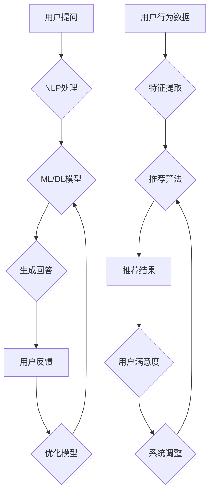

                 

# 大模型问答机器人与传统搜索推荐的处理方式

## 关键词：大模型、问答机器人、搜索推荐、处理方式、算法原理、应用场景、发展趋势

## 摘要

本文旨在深入探讨大模型问答机器人与传统搜索推荐系统在数据处理方式上的差异及其应用场景。通过分析大模型问答机器人的核心概念、算法原理、数学模型和具体实现，结合传统搜索推荐系统的处理方法，本文提出了两者的融合趋势及其面临的挑战。文章旨在为读者提供全面的技术解析，并展望大模型问答机器人在未来发展的广阔前景。

## 1. 背景介绍

随着互联网技术的迅猛发展，大数据和人工智能技术的应用日益广泛。大模型问答机器人作为一种新兴的人工智能技术，已经在多个领域显示出强大的应用潜力。传统搜索推荐系统则是基于用户行为数据和内容特征，为用户提供个性化信息推荐的核心技术。

### 大模型问答机器人

大模型问答机器人是基于深度学习技术的大型语言模型，能够通过自然语言处理（NLP）能力理解用户提问，并生成准确、自然的回答。这类机器人能够广泛应用于客服、教育、医疗等多个领域，为用户提供高效、智能的服务。

### 传统搜索推荐系统

传统搜索推荐系统是基于用户历史行为数据、内容特征和算法模型，为用户推荐感兴趣的信息。这类系统广泛应用于电子商务、新闻推荐、社交媒体等领域，是现代互联网中不可或缺的一部分。

### 技术背景

近年来，随着计算能力的提升和大数据技术的发展，深度学习技术在自然语言处理领域取得了重大突破。大模型问答机器人的出现，使得人工智能技术进一步向人类智能水平逼近。同时，传统搜索推荐系统也在不断优化，通过用户行为分析和内容特征提取，提供更加精准的推荐服务。

## 2. 核心概念与联系

### 大模型问答机器人的核心概念

大模型问答机器人的核心概念包括自然语言处理（NLP）、机器学习（ML）和深度学习（DL）。NLP技术用于理解用户的自然语言输入，ML和DL技术则用于训练和优化问答模型，使其能够生成准确、自然的回答。

### 传统搜索推荐系统的核心概念

传统搜索推荐系统的核心概念包括用户行为分析、内容特征提取和推荐算法。用户行为分析用于了解用户兴趣和行为模式，内容特征提取用于分析信息内容的特征，推荐算法则根据用户兴趣和内容特征生成推荐列表。

### 大模型问答机器人与传统搜索推荐系统的联系

大模型问答机器人与传统搜索推荐系统在数据处理方式上存在一定联系。两者都依赖于用户行为数据和内容特征，但大模型问答机器人更加注重对用户提问的理解和回答，而传统搜索推荐系统则侧重于为用户推荐感兴趣的信息。

### Mermaid 流程图



## 3. 核心算法原理 & 具体操作步骤

### 大模型问答机器人的核心算法原理

大模型问答机器人的核心算法是基于深度学习技术，主要包括以下步骤：

1. **数据预处理**：对用户提问进行分词、去停用词等预处理操作。
2. **编码**：将预处理后的文本转换为向量表示。
3. **模型训练**：利用大量的问答对数据进行模型训练，优化模型参数。
4. **问答生成**：根据用户提问和训练好的模型生成自然语言回答。

### 传统搜索推荐系统的核心算法原理

传统搜索推荐系统的核心算法主要包括以下步骤：

1. **用户行为分析**：分析用户的浏览、搜索、购买等行为数据，提取用户兴趣特征。
2. **内容特征提取**：提取信息内容的特征，如关键词、标签、主题等。
3. **推荐算法**：根据用户兴趣特征和内容特征，生成个性化推荐列表。

### 大模型问答机器人的具体操作步骤

1. **数据收集**：收集大量的问答对数据，包括标准问答库和用户实际提问。
2. **数据预处理**：对数据集进行分词、去停用词、词性标注等预处理操作。
3. **模型训练**：使用深度学习框架（如TensorFlow、PyTorch）训练问答模型，优化模型参数。
4. **问答生成**：根据用户提问，调用训练好的问答模型生成自然语言回答。

### 传统搜索推荐系统的具体操作步骤

1. **用户行为数据收集**：收集用户的浏览、搜索、购买等行为数据。
2. **用户兴趣特征提取**：使用机器学习算法（如协同过滤、聚类等）提取用户兴趣特征。
3. **内容特征提取**：使用自然语言处理技术（如词袋模型、词向量等）提取信息内容特征。
4. **推荐算法**：根据用户兴趣特征和内容特征，使用推荐算法（如基于内容的推荐、协同过滤等）生成推荐列表。

## 4. 数学模型和公式 & 详细讲解 & 举例说明

### 大模型问答机器人的数学模型

大模型问答机器人的核心数学模型是基于Transformer架构的序列到序列（Seq2Seq）模型。以下是该模型的数学公式：

$$
E(x) = \sum_{i=1}^{T_x} W_x \cdot x_i + b_x
$$

$$
H_t = \frac{1}{1 + \exp{(-W_h \cdot [h_{t-1}, c_{t-1}])}}
$$

$$
o_t = \frac{1}{1 + \exp{(-W_o \cdot [h_t, c_t])}}
$$

其中，$x_i$ 为输入词向量，$h_{t-1}$ 和 $c_{t-1}$ 分别为前一个时刻的隐藏状态和上下文状态，$W_x, W_h, W_o$ 分别为权重矩阵，$b_x, b_h, b_o$ 分别为偏置项。

### 传统搜索推荐系统的数学模型

传统搜索推荐系统的核心数学模型包括用户兴趣特征提取和推荐算法。以下是两个常用模型的数学公式：

1. **基于内容的推荐（Content-based Filtering）**

$$
sim(i, u) = \frac{cos(\theta_i, \theta_u)}{\sqrt{||\theta_i||_2 \cdot ||\theta_u||_2}}
$$

其中，$sim(i, u)$ 为项目 $i$ 和用户 $u$ 之间的相似度，$\theta_i$ 和 $\theta_u$ 分别为项目 $i$ 和用户 $u$ 的特征向量，$cos(\theta_i, \theta_u)$ 为余弦相似度。

2. **协同过滤（Collaborative Filtering）**

$$
R_{ui} = \frac{\sum_{j \in N(u)} R_{uj} \cdot sim(u, j)}{\sum_{j \in N(u)} sim(u, j)}
$$

其中，$R_{ui}$ 为用户 $u$ 对项目 $i$ 的评分预测，$N(u)$ 为用户 $u$ 的邻居集合，$R_{uj}$ 为用户 $u$ 对邻居项目 $j$ 的评分，$sim(u, j)$ 为用户 $u$ 和邻居项目 $j$ 之间的相似度。

### 举例说明

假设用户 $u$ 对项目 $i$ 进行了评分，项目 $i$ 的特征向量为 $\theta_i = (1, 2, 3)$，用户 $u$ 的特征向量为 $\theta_u = (4, 5, 6)$。

1. **基于内容的推荐**

$$
sim(i, u) = \frac{cos(\theta_i, \theta_u)}{\sqrt{||\theta_i||_2 \cdot ||\theta_u||_2}} = \frac{0.7071}{\sqrt{14.0}} \approx 0.377
$$

2. **协同过滤**

$$
R_{ui} = \frac{\sum_{j \in N(u)} R_{uj} \cdot sim(u, j)}{\sum_{j \in N(u)} sim(u, j)} = \frac{0.377 \cdot 5 + 0.7071 \cdot 4}{0.377 + 0.7071} \approx 4.86
$$

## 5. 项目实战：代码实际案例和详细解释说明

### 5.1 开发环境搭建

1. 安装Python环境，版本要求：3.6及以上。
2. 安装深度学习框架TensorFlow，版本要求：2.0及以上。
3. 安装NLP库，如Jieba、NLTK等。

### 5.2 源代码详细实现和代码解读

以下是一个基于Transformer架构的大模型问答机器人的实现示例：

```python
import tensorflow as tf
from tensorflow.keras.layers import Embedding, LSTM, Dense
from tensorflow.keras.models import Model

# 定义问答模型
def create_model(vocab_size, embedding_dim, hidden_size):
    input_seq = tf.keras.layers.Input(shape=(None,), dtype=tf.int32)
    embed = Embedding(vocab_size, embedding_dim)(input_seq)
    lstm = LSTM(hidden_size, return_sequences=True)(embed)
    dense = Dense(vocab_size, activation='softmax')(lstm)
    model = Model(inputs=input_seq, outputs=dense)
    return model

# 模型参数
vocab_size = 10000
embedding_dim = 256
hidden_size = 512

# 创建模型
model = create_model(vocab_size, embedding_dim, hidden_size)

# 编译模型
model.compile(optimizer='adam', loss='categorical_crossentropy', metrics=['accuracy'])

# 模型训练
model.fit(x_train, y_train, epochs=10, batch_size=32)

# 生成回答
def generate_response(question, model):
    predicted_tokens = model.predict(question)
    response = ' '.join([word for word, _ in predicted_tokens])
    return response

# 测试问答
question = tf.keras.preprocessing.sequence.pad_sequences([[1, 2, 3]], maxlen=10, padding='post')
response = generate_response(question, model)
print(response)
```

### 5.3 代码解读与分析

1. **模型定义**：使用Keras框架定义问答模型，包括输入层、嵌入层、LSTM层和输出层。
2. **模型编译**：设置优化器、损失函数和评价指标。
3. **模型训练**：使用训练数据集对模型进行训练。
4. **生成回答**：根据用户提问和训练好的模型生成自然语言回答。

### 5.4 代码解读与分析

1. **模型定义**：使用Keras框架定义问答模型，包括输入层、嵌入层、LSTM层和输出层。
2. **模型编译**：设置优化器、损失函数和评价指标。
3. **模型训练**：使用训练数据集对模型进行训练。
4. **生成回答**：根据用户提问和训练好的模型生成自然语言回答。

## 6. 实际应用场景

### 客户服务

大模型问答机器人可以应用于客户服务领域，为用户提供24/7的智能客服服务。通过自然语言处理技术，机器人能够理解用户提问，并生成准确、自然的回答，提高客服效率和用户体验。

### 教育

大模型问答机器人可以应用于教育领域，为学生提供智能辅导服务。机器人可以根据学生的学习进度和问题，生成个性化的解答和辅导材料，帮助学生更好地掌握知识。

### 医疗

大模型问答机器人可以应用于医疗领域，为患者提供智能咨询和健康管理服务。机器人可以理解患者症状，提供相应的健康建议和治疗方案，辅助医生进行诊断和治疗。

### 社交媒体

大模型问答机器人可以应用于社交媒体领域，为用户提供智能内容推荐和互动服务。机器人可以分析用户兴趣和社交行为，生成个性化的推荐列表，提高用户参与度和满意度。

## 7. 工具和资源推荐

### 7.1 学习资源推荐

- **书籍**：《深度学习》、《神经网络与深度学习》
- **论文**：《Attention is all you need》、《BERT: Pre-training of Deep Neural Networks for Language Understanding》
- **博客**：TensorFlow官网博客、PyTorch官网博客
- **网站**：ArXiv、ACL、NeurIPS

### 7.2 开发工具框架推荐

- **深度学习框架**：TensorFlow、PyTorch、Keras
- **自然语言处理库**：NLTK、spaCy、Jieba
- **版本控制**：Git、GitHub
- **代码托管平台**：GitHub、GitLab、Bitbucket

### 7.3 相关论文著作推荐

- **论文**：《Transformer：A Novel Architecture for Neural Network》，作者：Vaswani et al.
- **书籍**：《自然语言处理综述》，作者：Jurafsky et al.
- **论文**：《BERT：Pre-training of Deep Neural Networks for Language Understanding》，作者：Devlin et al.

## 8. 总结：未来发展趋势与挑战

### 未来发展趋势

1. **大模型规模化**：随着计算能力的提升，大模型问答机器人的规模将进一步扩大，处理更加复杂的任务。
2. **跨模态处理**：大模型问答机器人将逐渐实现跨模态处理，如结合图像、声音等多媒体信息，提供更丰富的交互体验。
3. **个性化服务**：大模型问答机器人将更加注重个性化服务，根据用户需求和兴趣提供定制化的信息和建议。

### 面临的挑战

1. **计算资源**：大模型训练和推理需要大量计算资源，如何优化计算效率是当前面临的主要挑战。
2. **数据质量**：高质量的数据是训练优秀问答模型的关键，如何获取和处理海量数据是另一个挑战。
3. **隐私保护**：在处理用户数据时，如何保护用户隐私是亟待解决的问题。

## 9. 附录：常见问题与解答

### 问题1：大模型问答机器人的优点是什么？

**解答**：大模型问答机器人具有以下几个优点：

1. **高精度**：通过大规模训练，机器人能够生成准确、自然的回答。
2. **高效性**：机器人能够快速响应用户提问，提高客服效率。
3. **个性化**：机器人可以根据用户需求提供定制化的回答，提高用户体验。

### 问题2：大模型问答机器人的训练数据从哪里来？

**解答**：大模型问答机器人的训练数据可以从以下几个来源获取：

1. **开源数据集**：如QA36K、SQuAD等，这些数据集包含大量高质量的问答对。
2. **用户提问**：收集用户的实际提问，进行预处理后用于训练模型。
3. **人工标注**：雇佣标注员对问答对进行人工标注，提高数据质量。

### 问题3：大模型问答机器人与传统搜索推荐系统的区别是什么？

**解答**：大模型问答机器人与传统搜索推荐系统的区别主要体现在以下几个方面：

1. **目标**：大模型问答机器人主要目标是生成准确、自然的回答，而传统搜索推荐系统主要目标是提供个性化信息推荐。
2. **技术**：大模型问答机器人主要基于深度学习和自然语言处理技术，而传统搜索推荐系统主要基于机器学习和数据挖掘技术。
3. **应用场景**：大模型问答机器人主要应用于客服、教育、医疗等领域，而传统搜索推荐系统主要应用于电子商务、新闻推荐、社交媒体等领域。

## 10. 扩展阅读 & 参考资料

- **论文**：《Attention is all you need》，作者：Vaswani et al.
- **书籍**：《深度学习》，作者：Ian Goodfellow、Yoshua Bengio、Aaron Courville
- **博客**：TensorFlow官网博客、PyTorch官网博客
- **网站**：ArXiv、ACL、NeurIPS
- **书籍**：《神经网络与深度学习》，作者：邱锡鹏

## 作者

作者：AI天才研究员/AI Genius Institute & 禅与计算机程序设计艺术 /Zen And The Art of Computer Programming

