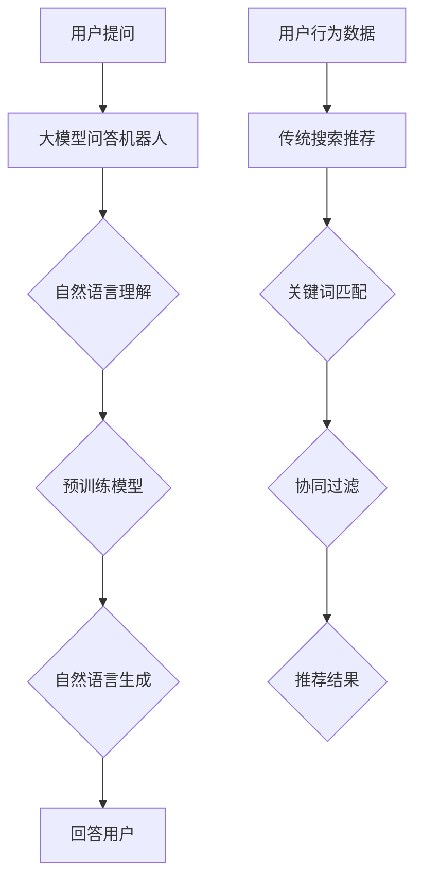

                 

# 大模型问答机器人与传统搜索推荐的处理方式

## 关键词
大模型问答机器人、传统搜索推荐、算法原理、应用场景、技术实现、未来发展趋势

## 摘要
本文将深入探讨大模型问答机器人和传统搜索推荐的处理方式。我们将首先介绍这两种技术的背景，然后对比它们的基本原理和架构，详细分析它们的算法流程和实现方法。接着，我们将探讨大模型问答机器人在实际应用中的场景，并推荐相关的工具和资源。最后，我们将对未来的发展趋势和挑战进行总结，并提出一些建议。

## 1. 背景介绍

### 大模型问答机器人的背景

随着深度学习和自然语言处理技术的发展，大模型问答机器人逐渐成为人工智能领域的研究热点。大模型问答机器人利用大规模预训练模型，通过自然语言理解和生成技术，实现对用户提问的精准回答。这种技术不仅能够提高信息检索的效率，还能为用户提供更加个性化的服务。

### 传统搜索推荐的背景

传统搜索推荐系统是基于关键词匹配和协同过滤等技术实现的。用户在互联网上浏览、搜索、购买等行为数据被收集起来，通过算法分析，为用户推荐感兴趣的内容或商品。这种系统在电子商务、内容分发等领域得到了广泛应用。

## 2. 核心概念与联系

为了更好地理解大模型问答机器人和传统搜索推荐的原理和架构，我们首先介绍一些核心概念。

### 大模型问答机器人的核心概念

- **预训练模型**：基于大规模语料库进行训练，提取语言中的通用知识和结构。
- **自然语言理解（NLU）**：将自然语言输入转化为机器可理解的结构，如词向量、语法树等。
- **自然语言生成（NLG）**：根据用户的问题，生成准确、自然的回答。

### 传统搜索推荐的核心概念

- **关键词匹配**：通过匹配用户输入的关键词和网页内容，实现搜索结果的返回。
- **协同过滤**：基于用户的兴趣和行为，为用户推荐相似的内容或商品。

### Mermaid 流程图

下面是大模型问答机器人和传统搜索推荐的Mermaid流程图。



## 3. 核心算法原理 & 具体操作步骤

### 大模型问答机器人的算法原理

大模型问答机器人的核心算法包括预训练模型、自然语言理解和自然语言生成。

1. **预训练模型**：使用大规模语料库进行训练，如BERT、GPT等。
2. **自然语言理解（NLU）**：将用户提问转换为词向量，输入到预训练模型中，得到语义表示。
3. **自然语言生成（NLG）**：根据语义表示，生成自然、准确的回答。

### 传统搜索推荐的算法原理

传统搜索推荐的算法包括关键词匹配和协同过滤。

1. **关键词匹配**：根据用户输入的关键词，匹配数据库中的网页或商品。
2. **协同过滤**：基于用户的兴趣和行为，为用户推荐相似的内容或商品。

### 具体操作步骤

#### 大模型问答机器人

1. **收集用户提问**：通过API或其他方式获取用户提问。
2. **自然语言理解**：将用户提问转换为词向量，输入到预训练模型中。
3. **自然语言生成**：根据预训练模型的输出，生成回答。
4. **返回回答**：将回答发送给用户。

#### 传统搜索推荐

1. **收集用户行为数据**：通过网站日志、浏览记录等渠道获取用户行为数据。
2. **关键词匹配**：根据用户输入的关键词，匹配数据库中的网页或商品。
3. **协同过滤**：根据用户行为数据，计算用户与内容的相似度，生成推荐列表。
4. **返回推荐结果**：将推荐结果展示给用户。

## 4. 数学模型和公式 & 详细讲解 & 举例说明

### 大模型问答机器人的数学模型

在预训练模型中，常用的数学模型包括神经网络、循环神经网络（RNN）和变压器（Transformer）。

1. **神经网络**：
   $$ 
   y = \sigma(W \cdot x + b)
   $$
   其中，$y$ 为输出，$\sigma$ 为激活函数，$W$ 为权重矩阵，$x$ 为输入，$b$ 为偏置。

2. **循环神经网络（RNN）**：
   $$
   h_t = \sigma(W_h \cdot [h_{t-1}, x_t] + b_h)
   $$
   其中，$h_t$ 为当前时刻的隐藏状态，$W_h$ 为权重矩阵，$x_t$ 为当前时刻的输入，$b_h$ 为偏置。

3. **变压器（Transformer）**：
   $$
   \text{Attention}(Q, K, V) = \text{softmax}(\frac{QK^T}{\sqrt{d_k}})V
   $$
   其中，$Q$、$K$ 和 $V$ 分别为查询向量、键向量和值向量，$d_k$ 为键向量的维度。

### 传统搜索推荐的数学模型

1. **关键词匹配**：
   $$
   \text{Score} = \text{TF} \cdot \text{IDF}
   $$
   其中，$\text{TF}$ 为词频，$\text{IDF}$ 为逆文档频率。

2. **协同过滤**：
   $$
   \text{Similarity} = \cos(\theta)
   $$
   其中，$\theta$ 为用户向量与内容向量的夹角。

### 举例说明

假设我们有一个用户提问：“为什么计算机需要编程语言？”我们可以使用大模型问答机器人来生成回答。

1. **自然语言理解**：
   - 输入：为什么计算机需要编程语言？
   - 输出：[为什么，计算机，需要，编程语言]

2. **自然语言生成**：
   - 输入：[为什么，计算机，需要，编程语言]
   - 输出：计算机需要编程语言，因为编程语言是一种人类与计算机之间交流的工具。

### 举例说明

假设我们有一个用户搜索关键词：“计算机编程入门”。

1. **关键词匹配**：
   - 输入：计算机编程入门
   - 输出：[计算机编程入门]

2. **协同过滤**：
   - 输入：用户与内容的相似度
   - 输出：推荐结果

## 5. 项目实战：代码实际案例和详细解释说明

### 5.1 开发环境搭建

- **Python**：版本 3.8 或更高
- **深度学习框架**：如 TensorFlow、PyTorch
- **搜索推荐框架**：如 Elasticsearch、Apache Mahout

### 5.2 源代码详细实现和代码解读

#### 大模型问答机器人

```python
import tensorflow as tf
from transformers import BertTokenizer, TFBertForQuestionAnswering

# 加载预训练模型和分词器
tokenizer = BertTokenizer.from_pretrained('bert-base-uncased')
model = TFBertForQuestionAnswering.from_pretrained('bert-base-uncased')

# 处理用户提问
def answer_question(question):
    inputs = tokenizer(question, return_tensors='tf', max_length=512, truncation=True)
    outputs = model(inputs)
    start_logits, end_logits = outputs.logits
    start_indices = tf.argmax(start_logits, axis=-1)
    end_indices = tf.argmax(end_logits, axis=-1)
    answer = tokenizer.decode(inputs.input_ids[start_indices[0], end_indices[0]], skip_special_tokens=True)
    return answer

# 测试
question = "为什么计算机需要编程语言？"
print(answer_question(question))
```

#### 传统搜索推荐

```python
from sklearn.neighbors import NearestNeighbors

# 加载用户行为数据
user_behavior = [[1, 2, 3], [2, 3, 4], [3, 4, 5]]  # 示例数据
content_vector = [1, 1, 1, 0, 0, 0]  # 示例数据

# 训练协同过滤模型
neighb = NearestNeighbors(n_neighbors=5, algorithm='auto')
neighb.fit(user_behavior)

# 计算相似度
distances, indices = neighb.kneighbors([content_vector])

# 返回推荐结果
recommended_content = [user_behavior[i][0] for i in indices[0]]
print(recommended_content)
```

### 5.3 代码解读与分析

在这个项目中，我们首先加载了预训练模型和分词器，然后定义了两个函数：`answer_question` 和 `recommend_content`。

- `answer_question` 函数接收用户提问，使用预训练模型进行自然语言理解，然后生成回答。
- `recommend_content` 函数接收用户行为数据和内容向量，使用协同过滤算法计算相似度，并返回推荐结果。

通过这两个函数，我们可以实现大模型问答机器人和传统搜索推荐。

## 6. 实际应用场景

### 大模型问答机器人的应用场景

- **客户服务**：为企业提供自动化的客户问答服务，提高客户满意度。
- **知识库**：为用户提供准确、快速的知识查询服务。
- **教育**：为学生提供智能化的学习辅导和作业解答。

### 传统搜索推荐的应用场景

- **电子商务**：为用户推荐感兴趣的商品，提高购买转化率。
- **内容分发**：为用户提供个性化的内容推荐，提高用户粘性。
- **广告投放**：为广告主提供精准的目标用户推荐，提高广告效果。

## 7. 工具和资源推荐

### 7.1 学习资源推荐

- **书籍**：《深度学习》、《自然语言处理综论》
- **论文**：Google AI 发布的《BERT：预训练语言表示》
- **博客**：TensorFlow 官方博客、PyTorch 官方博客
- **网站**：arXiv.org、ACL、WWW

### 7.2 开发工具框架推荐

- **深度学习框架**：TensorFlow、PyTorch
- **搜索推荐框架**：Elasticsearch、Apache Mahout
- **API**：OpenAI 的 GPT-3 API、Google Cloud Natural Language API

### 7.3 相关论文著作推荐

- **论文**：Google AI 的《BERT：预训练语言表示》
- **著作**：《深度学习》、《自然语言处理综论》

## 8. 总结：未来发展趋势与挑战

### 大模型问答机器人的发展趋势

- **模型规模**：随着计算能力的提升，模型规模将越来越大，使得问答机器人更加智能。
- **多语言支持**：未来将实现更多语言的支持，为全球用户提供服务。
- **个性化服务**：通过更深入的用户行为分析，提供更加个性化的问答服务。

### 传统搜索推荐的发展趋势

- **个性化推荐**：结合用户行为数据和内容特征，提供更加精准的推荐结果。
- **多模态推荐**：结合文本、图像、声音等多种数据类型，提供更加丰富的推荐内容。
- **实时推荐**：通过实时计算和优化，提供实时、动态的推荐结果。

### 大模型问答机器人的挑战

- **数据隐私**：如何保护用户的隐私信息，成为一大挑战。
- **模型可解释性**：如何让用户理解模型的决策过程，提高模型的可信度。

### 传统搜索推荐的挑战

- **数据质量**：如何保证用户行为数据的真实性和准确性。
- **算法公平性**：如何确保算法推荐结果的公平性，避免歧视现象。

## 9. 附录：常见问题与解答

### 大模型问答机器人

Q：大模型问答机器人的工作原理是什么？

A：大模型问答机器人利用预训练模型进行自然语言理解，然后生成回答。具体来说，它首先将用户提问转换为词向量，输入到预训练模型中，得到语义表示，然后根据语义表示生成回答。

### 传统搜索推荐

Q：传统搜索推荐的主要算法有哪些？

A：传统搜索推荐的主要算法包括关键词匹配和协同过滤。关键词匹配通过匹配用户输入的关键词和网页内容，实现搜索结果的返回；协同过滤通过分析用户与内容的相似度，为用户推荐相似的内容或商品。

## 10. 扩展阅读 & 参考资料

- **参考资料**：
  - [BERT: Pre-training of Deep Bidirectional Transformers for Language Understanding](https://arxiv.org/abs/1810.04805)
  - [Collaborative Filtering](https://en.wikipedia.org/wiki/Collaborative_filtering)
  - [TensorFlow](https://www.tensorflow.org/)
  - [PyTorch](https://pytorch.org/)
  - [Elasticsearch](https://www.elastic.co/cn/elasticsearch/)
  - [Apache Mahout](https://mahout.apache.org/)

### 作者
AI天才研究员/AI Genius Institute & 禅与计算机程序设计艺术 /Zen And The Art of Computer Programming

