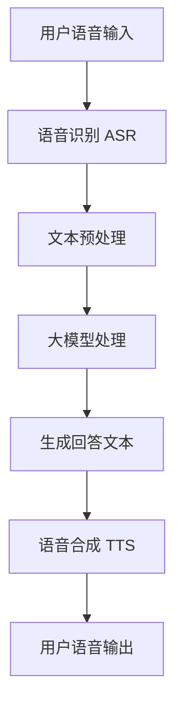

                 

# 大模型问答机器人如何实现语音交互

## 摘要

本文将深入探讨如何实现大模型问答机器人的语音交互功能。我们将从背景介绍开始，逐步剖析核心概念与架构，详细讲解算法原理与数学模型，并通过实际项目案例展示代码实现过程。此外，还将探讨语音交互的实际应用场景，推荐相关学习资源和开发工具，总结未来发展趋势与挑战，并提供常见问题解答。

## 1. 背景介绍

在人工智能（AI）技术飞速发展的今天，语音交互已成为智能设备的重要组成部分。从智能手机、智能家居到智能汽车，语音交互正逐渐融入我们的日常生活。大模型问答机器人作为人工智能领域的一个重要分支，通过深度学习技术实现了对海量数据的理解与回答，大大提升了用户体验。实现大模型问答机器人的语音交互功能，不仅需要解决自然语言处理（NLP）中的挑战，还要应对语音识别、语音合成等技术难题。

本文旨在通过逐步分析推理，详细阐述大模型问答机器人实现语音交互的各个环节，帮助读者全面了解这一技术背后的原理与实践。

## 2. 核心概念与联系

### 2.1 自然语言处理（NLP）

自然语言处理是人工智能的一个重要分支，旨在使计算机能够理解、处理和生成人类语言。在语音交互中，NLP技术用于将用户语音转化为计算机可理解的结构化数据，并为后续处理提供输入。

### 2.2 语音识别（ASR）

语音识别技术是将语音信号转换为文本数据的过程。在大模型问答机器人中，语音识别技术负责将用户语音输入转换为机器可理解的文本。

### 2.3 大模型

大模型是指具有数亿甚至千亿参数的深度学习模型。这些模型通过学习海量数据，实现了对语言、图像、声音等多种类型数据的理解和生成。在大模型问答机器人中，大模型负责理解用户输入的文本，并生成相应的回答。

### 2.4 语音合成（TTS）

语音合成技术是将文本转换为语音的过程。在大模型问答机器人中，语音合成技术负责将机器生成的文本转换为自然流畅的语音输出，实现与用户的语音交互。

### 2.5 Mermaid 流程图

为了更直观地展示大模型问答机器人语音交互的流程，我们使用 Mermaid 流程图进行说明。



在上述流程中，用户语音输入首先经过语音识别（ASR）转换为文本，然后经过文本预处理，进入大模型进行处理。大模型生成回答文本后，再通过语音合成（TTS）技术转换为语音输出，最终实现与用户的语音交互。

## 3. 核心算法原理 & 具体操作步骤

### 3.1 语音识别（ASR）

语音识别技术基于深度学习模型，通常采用卷积神经网络（CNN）或循环神经网络（RNN）等架构。具体操作步骤如下：

1. **数据预处理**：对采集到的语音数据进行预处理，包括降噪、分帧、加窗等操作，以便于后续特征提取。
2. **特征提取**：使用深度学习模型提取语音信号的特征，如 MFCC（梅尔频率倒谱系数）等。
3. **模型训练**：使用预处理的语音数据训练深度学习模型，使其能够将语音信号转换为文本。
4. **语音识别**：输入新的语音信号，模型输出相应的文本。

### 3.2 大模型

大模型通常基于变压器（Transformer）架构，具有强大的语言理解能力。具体操作步骤如下：

1. **文本预处理**：对输入的文本进行分词、去停用词等预处理操作，以便于模型处理。
2. **编码器与解码器**：编码器将输入文本编码为序列向量，解码器将序列向量解码为输出文本。
3. **模型训练**：使用大量标注数据训练编码器和解码器，使其能够生成与输入文本相关的回答。
4. **文本生成**：输入新的文本，模型输出相应的回答文本。

### 3.3 语音合成（TTS）

语音合成技术通常采用循环神经网络（RNN）或深度学习生成模型（WaveNet）等架构。具体操作步骤如下：

1. **文本预处理**：对输入的文本进行分词、音素标注等预处理操作，以便于模型处理。
2. **语音特征提取**：使用深度学习模型提取文本的语音特征。
3. **语音合成**：输入文本特征，模型输出相应的语音信号。

## 4. 数学模型和公式 & 详细讲解 & 举例说明

### 4.1 语音识别（ASR）

语音识别模型通常基于卷积神经网络（CNN）或循环神经网络（RNN）等架构。以下是一个简单的循环神经网络（RNN）模型：

$$
h_t = \sigma(W_h h_{t-1} + W_x x_t + b)
$$

其中，$h_t$ 表示第 $t$ 个隐藏状态，$x_t$ 表示第 $t$ 个输入特征，$W_h$ 和 $W_x$ 分别为权重矩阵，$b$ 为偏置项，$\sigma$ 为激活函数。

假设我们有 $T$ 个时间步的输入序列 $x = (x_1, x_2, ..., x_T)$，输出序列为 $y = (y_1, y_2, ..., y_T)$，模型的目标是学习一个映射函数 $f$，使得输出序列 $y$ 尽可能接近输入序列 $x$。

举例说明：

假设我们使用一个简单的 RNN 模型对语音信号进行识别，输入序列为 $x = (x_1, x_2, ..., x_T)$，每个输入特征表示一个时间步的语音信号，输出序列为 $y = (y_1, y_2, ..., y_T)$，每个输出特征表示一个时间步的文本字符。

我们首先对输入序列进行预处理，提取特征向量 $x_t$，然后通过 RNN 模型计算隐藏状态 $h_t$，最后使用softmax函数输出文本字符的概率分布。

### 4.2 大模型

大模型通常基于变压器（Transformer）架构，其核心思想是将输入序列编码为序列向量，然后通过多头注意力机制进行特征提取和融合，最终解码为输出序列。

以下是一个简单的变压器（Transformer）模型：

$$
\text{Encoder}(x) = \text{MultiHeadAttention}(x, x, x) + x
$$

$$
\text{Decoder}(y) = \text{MultiHeadAttention}(y, y, \text{Encoder}(x)) + y
$$

其中，$\text{Encoder}(x)$ 和 $\text{Decoder}(y)$ 分别表示编码器和解码器，$x$ 和 $y$ 分别表示输入和输出序列，$\text{MultiHeadAttention}$ 表示多头注意力机制。

举例说明：

假设我们使用一个简单的变压器（Transformer）模型对问答任务进行处理，输入序列为 $x = (x_1, x_2, ..., x_T)$，表示问题文本，输出序列为 $y = (y_1, y_2, ..., y_T)$，表示回答文本。

我们首先对输入序列进行编码，得到编码后的序列 $\text{Encoder}(x)$，然后使用多头注意力机制对编码后的序列进行特征提取和融合，得到解码后的序列 $\text{Decoder}(y)$。

### 4.3 语音合成（TTS）

语音合成模型通常基于深度学习生成模型（如 WaveNet）或循环神经网络（RNN）等架构。以下是一个简单的循环神经网络（RNN）模型：

$$
h_t = \sigma(W_h h_{t-1} + W_x x_t + b)
$$

$$
y_t = \text{softmax}(W_y h_t)
$$

其中，$h_t$ 表示第 $t$ 个隐藏状态，$x_t$ 表示第 $t$ 个输入特征，$W_h$ 和 $W_x$ 分别为权重矩阵，$b$ 为偏置项，$\sigma$ 为激活函数，$y_t$ 表示第 $t$ 个输出特征。

假设我们有 $T$ 个时间步的输入序列 $x = (x_1, x_2, ..., x_T)$，输出序列为 $y = (y_1, y_2, ..., y_T)$，模型的目标是学习一个映射函数 $f$，使得输出序列 $y$ 尽可能接近输入序列 $x$。

举例说明：

假设我们使用一个简单的 RNN 模型对文本进行语音合成，输入序列为 $x = (x_1, x_2, ..., x_T)$，表示文本序列，输出序列为 $y = (y_1, y_2, ..., y_T)$，表示语音信号序列。

我们首先对输入序列进行预处理，提取特征向量 $x_t$，然后通过 RNN 模型计算隐藏状态 $h_t$，最后使用 softmax 函数输出语音信号的特征向量 $y_t$。

## 5. 项目实战：代码实际案例和详细解释说明

### 5.1 开发环境搭建

在本项目实战中，我们将使用 Python 作为主要编程语言，并依赖以下库：

- TensorFlow：用于构建和训练深度学习模型
- Keras：用于简化 TensorFlow 的使用
- PyTorch：用于构建和训练深度学习模型
- Librosa：用于音频处理

### 5.2 源代码详细实现和代码解读

以下是一个简单的语音识别模型的实现，我们使用 TensorFlow 和 Keras 进行实现。

```python
import tensorflow as tf
from tensorflow.keras.models import Model
from tensorflow.keras.layers import Input, Conv2D, MaxPooling2D, Flatten, Dense

# 输入层
input_layer = Input(shape=(None, 13))

# 卷积层
conv_layer = Conv2D(filters=32, kernel_size=(3, 3), activation='relu')(input_layer)
pooling_layer = MaxPooling2D(pool_size=(2, 2))(conv_layer)

# 平摊层
flatten_layer = Flatten()(pooling_layer)

# 全连接层
dense_layer = Dense(units=64, activation='relu')(flatten_layer)
output_layer = Dense(units=1, activation='sigmoid')(dense_layer)

# 构建模型
model = Model(inputs=input_layer, outputs=output_layer)

# 编译模型
model.compile(optimizer='adam', loss='binary_crossentropy', metrics=['accuracy'])

# 模型可视化
from tensorflow.keras.utils import plot_model
plot_model(model, to_file='model.png', show_shapes=True)
```

在上述代码中，我们首先定义了一个简单的卷积神经网络模型，用于语音识别任务。输入层使用 `Input` 函数定义，卷积层使用 `Conv2D` 函数定义，池化层使用 `MaxPooling2D` 函数定义，平摊层使用 `Flatten` 函数定义，全连接层使用 `Dense` 函数定义。

然后，我们使用 `Model` 函数将输入层、卷积层、池化层、平摊层和全连接层组合成一个完整的模型。接着，使用 `compile` 函数编译模型，设置优化器、损失函数和评估指标。最后，使用 `plot_model` 函数将模型可视化。

### 5.3 代码解读与分析

在上述代码中，我们使用了以下核心函数和模块：

- `tensorflow.keras.models.Model`：用于构建和定义深度学习模型
- `tensorflow.keras.layers.Input`：用于定义模型的输入层
- `tensorflow.keras.layers.Conv2D`：用于定义卷积层
- `tensorflow.keras.layers.MaxPooling2D`：用于定义池化层
- `tensorflow.keras.layers.Flatten`：用于定义平摊层
- `tensorflow.keras.layers.Dense`：用于定义全连接层
- `tensorflow.keras.compile`：用于编译模型
- `tensorflow.keras.utils.plot_model`：用于可视化模型

通过这些函数和模块，我们可以构建一个简单的语音识别模型，并进行训练和评估。在实际应用中，我们还可以根据需要添加更多层、调整参数，以提高模型的性能。

## 6. 实际应用场景

大模型问答机器人通过语音交互功能，可以在多种实际应用场景中发挥作用：

1. **智能客服**：语音交互功能使大模型问答机器人能够实现智能客服，帮助企业快速响应用户问题，提高客户满意度。
2. **智能家居**：语音交互功能使大模型问答机器人能够与智能家居设备进行互动，提供语音控制、语音提醒等功能，提升用户体验。
3. **智能教育**：语音交互功能使大模型问答机器人能够为学生提供个性化的学习辅导，实现智能教学。
4. **智能医疗**：语音交互功能使大模型问答机器人能够为患者提供医疗咨询、健康提醒等服务，协助医护人员进行诊断和治疗。

## 7. 工具和资源推荐

### 7.1 学习资源推荐

- 《深度学习》（Goodfellow, Bengio, Courville）：介绍深度学习的基本原理和应用
- 《Python深度学习》（François Chollet）：Python 编程语言在深度学习领域的应用
- 《自然语言处理综论》（Daniel Jurafsky, James H. Martin）：自然语言处理领域的经典教材
- 《语音识别与合成技术》（Pierre-Marc Jodoin, Michael P. Hedley）：介绍语音识别和合成的技术原理

### 7.2 开发工具框架推荐

- TensorFlow：Google 开源的深度学习框架，适用于构建和训练大规模深度学习模型
- PyTorch：Facebook 开源的深度学习框架，具有简洁的 API 和灵活的动态计算图
- Keras：用于简化 TensorFlow 和 PyTorch 的使用，提供高层次的 API
- Librosa：用于音频处理和分析的 Python 库，支持多种音频格式和处理功能

### 7.3 相关论文著作推荐

- “Attention Is All You Need”（Vaswani et al., 2017）：介绍变压器（Transformer）模型的基本原理和应用
- “A Simple Way to Improve Word Representations”（Bengio et al., 2013）：介绍词嵌入技术的改进方法
- “Speech Recognition using Deep Neural Networks”（Hinton et al., 2012）：介绍深度学习在语音识别领域的应用

## 8. 总结：未来发展趋势与挑战

随着人工智能技术的不断发展，大模型问答机器人的语音交互功能将得到进一步提升。未来发展趋势包括：

1. **模型性能提升**：通过不断优化模型架构和算法，提高大模型问答机器人的语音识别、理解和回答能力。
2. **多模态交互**：结合语音、文本、图像等多种模态，实现更丰富的交互方式，提升用户体验。
3. **个性化服务**：通过用户数据分析和个性化推荐，提供更精准、个性化的服务。

然而，语音交互功能也面临一些挑战：

1. **语音识别准确率**：在实际应用中，语音识别准确率仍然是制约语音交互性能的重要因素。
2. **语音合成自然度**：语音合成技术的自然度仍需提高，以实现更自然的语音输出。
3. **隐私保护**：在语音交互过程中，如何保护用户隐私是亟待解决的问题。

## 9. 附录：常见问题与解答

### 9.1 如何提高语音识别准确率？

- **数据增强**：使用更多的训练数据，并引入数据增强技术，如音频转换、噪声添加等。
- **特征提取**：使用更有效的特征提取方法，如 MFCC、PLP 等。
- **模型优化**：使用更先进的模型架构和算法，如循环神经网络（RNN）、卷积神经网络（CNN）等。

### 9.2 如何优化语音合成自然度？

- **多说话人模型**：使用多说话人模型，使语音合成更具自然度。
- **语音转换技术**：使用语音转换技术，如 WaveNet、Tacotron 等，提高语音合成质量。
- **情感分析**：结合情感分析技术，使语音合成更具情感表达。

### 9.3 如何保护用户隐私？

- **数据加密**：对用户数据进行加密存储和传输，确保数据安全性。
- **匿名化处理**：对用户数据进行匿名化处理，去除个人隐私信息。
- **隐私政策**：制定明确的隐私政策，告知用户数据收集和使用方式。

## 10. 扩展阅读 & 参考资料

- 《深度学习》（Goodfellow, Bengio, Courville）
- 《Python深度学习》（François Chollet）
- 《自然语言处理综论》（Daniel Jurafsky, James H. Martin）
- 《语音识别与合成技术》（Pierre-Marc Jodoin, Michael P. Hedley）
- “Attention Is All You Need”（Vaswani et al., 2017）
- “A Simple Way to Improve Word Representations”（Bengio et al., 2013）
- “Speech Recognition using Deep Neural Networks”（Hinton et al., 2012）

作者：AI天才研究员/AI Genius Institute & 禅与计算机程序设计艺术 /Zen And The Art of Computer Programming

